This document describes how memory allocation records are handled during profiling. Allocation records are received, validated, filtered, and stored efficiently for later analysis. The flow begins with posting allocation records for asynchronous processing and ends with optimized storage for profiling insights.

# Posting Allocation Records to the Task Runner

```mermaid
%%{init: {"flowchart": {"defaultRenderer": "elk"}} }%%
flowchart TD
    node1["Allocation record is scheduled for asynchronous processing"]
    click node1 openCode "src/profiling/memory/heapprofd_producer.cc:993:1000"
    node1 --> node2{"Is producer available when processing starts?"}
    click node2 openCode "src/profiling/memory/heapprofd_producer.cc:996:997"
    node2 -->|"Available"| node3["Process allocation record"]
    click node3 openCode "src/profiling/memory/heapprofd_producer.cc:997:998"
    node3 --> node4["Return allocation record to worker"]
    click node4 openCode "src/profiling/memory/heapprofd_producer.cc:998:999"
    node2 -->|"Not available"| node5["Allocation record is not processed"]
    click node5 openCode "src/profiling/memory/heapprofd_producer.cc:996:1000"
classDef HeadingStyle fill:#777777,stroke:#333,stroke-width:2px;

%% Swimm:
%% %%{init: {"flowchart": {"defaultRenderer": "elk"}} }%%
%% flowchart TD
%%     node1["Allocation record is scheduled for asynchronous processing"]
%%     click node1 openCode "<SwmPath>[src/…/memory/heapprofd_producer.cc](src/profiling/memory/heapprofd_producer.cc)</SwmPath>:993:1000"
%%     node1 --> node2{"Is producer available when processing starts?"}
%%     click node2 openCode "<SwmPath>[src/…/memory/heapprofd_producer.cc](src/profiling/memory/heapprofd_producer.cc)</SwmPath>:996:997"
%%     node2 -->|"Available"| node3["Process allocation record"]
%%     click node3 openCode "<SwmPath>[src/…/memory/heapprofd_producer.cc](src/profiling/memory/heapprofd_producer.cc)</SwmPath>:997:998"
%%     node3 --> node4["Return allocation record to worker"]
%%     click node4 openCode "<SwmPath>[src/…/memory/heapprofd_producer.cc](src/profiling/memory/heapprofd_producer.cc)</SwmPath>:998:999"
%%     node2 -->|"Not available"| node5["Allocation record is not processed"]
%%     click node5 openCode "<SwmPath>[src/…/memory/heapprofd_producer.cc](src/profiling/memory/heapprofd_producer.cc)</SwmPath>:996:1000"
%% classDef HeadingStyle fill:#777777,stroke:#333,stroke-width:2px;
```



<SwmSnippet path="/src/profiling/memory/heapprofd_producer.cc" line="987">

---

<SwmToken path="src/profiling/memory/heapprofd_producer.cc" pos="987:4:4" line-data="void HeapprofdProducer::PostAllocRecord(">`PostAllocRecord`</SwmToken> posts the allocation record to the task runner and then calls <SwmToken path="src/profiling/memory/heapprofd_producer.cc" pos="997:3:3" line-data="      weak_this-&gt;HandleAllocRecord(unique_alloc_ref.get());">`HandleAllocRecord`</SwmToken> in the posted task to process it safely on the right thread.

```c++
void HeapprofdProducer::PostAllocRecord(
    UnwindingWorker* worker,
    std::unique_ptr<AllocRecord> alloc_rec) {
  // Once we can use C++14, this should be std::moved into the lambda instead.
  auto* raw_alloc_rec = alloc_rec.release();
  auto weak_this = weak_factory_.GetWeakPtr();
  task_runner_->PostTask([weak_this, raw_alloc_rec, worker] {
    std::unique_ptr<AllocRecord> unique_alloc_ref =
        std::unique_ptr<AllocRecord>(raw_alloc_rec);
    if (weak_this) {
      weak_this->HandleAllocRecord(unique_alloc_ref.get());
      worker->ReturnAllocRecord(std::move(unique_alloc_ref));
    }
  });
}
```

---

</SwmSnippet>

# Processing and Filtering Allocation Records

```mermaid
%%{init: {"flowchart": {"defaultRenderer": "elk"}} }%%
flowchart TD
    node1["Receive allocation record"] --> node2{"Is data source valid?"}
    click node1 openCode "src/profiling/memory/heapprofd_producer.cc:1038:1039"
    node2 -->|"No"| node3["Stop processing"]
    click node2 openCode "src/profiling/memory/heapprofd_producer.cc:1040:1044"
    click node3 openCode "src/profiling/memory/heapprofd_producer.cc:1042:1044"
    node2 -->|"Yes"| node4{"Is process ID valid?"}
    click node4 openCode "src/profiling/memory/heapprofd_producer.cc:1047:1051"
    node4 -->|"No"| node3
    node4 -->|"Yes"| node5{"Stream allocations directly?"}
    click node5 openCode "src/profiling/memory/heapprofd_producer.cc:1053:1064"
    node5 -->|"Yes"| node6["Stream allocation data"]
    click node6 openCode "src/profiling/memory/heapprofd_producer.cc:1054:1063"
    node5 -->|"No"| node7{"Are there symbol prefixes to filter?"}
    click node7 openCode "src/profiling/memory/heapprofd_producer.cc:1066:1067"
    node7 -->|"No"| node8["Update profiling statistics"]
    click node8 openCode "src/profiling/memory/heapprofd_producer.cc:1086:1092"
    node7 -->|"Yes"| loop1
    subgraph loop1["For each frame in allocation record"]
      node9{"Does symbol name match any prefix?"}
      click node9 openCode "src/profiling/memory/heapprofd_producer.cc:1068:1076"
      node9 -->|"Yes"| node10["Mark symbol as FILTERED"]
      click node10 openCode "src/profiling/memory/heapprofd_producer.cc:1077:1078"
      node9 -->|"No"| node11["Keep symbol name"]
      click node11 openCode "src/profiling/memory/heapprofd_producer.cc:1079:1081"
    end
    loop1 --> node8
    node8 --> node12["Update error and reparsed map statistics"]
    click node12 openCode "src/profiling/memory/heapprofd_producer.cc:1086:1097"
    node12 --> node13["Record allocation in heap tracker"]
    click node13 openCode "src/profiling/memory/heapprofd_producer.cc:1099:1104"

classDef HeadingStyle fill:#777777,stroke:#333,stroke-width:2px;

%% Swimm:
%% %%{init: {"flowchart": {"defaultRenderer": "elk"}} }%%
%% flowchart TD
%%     node1["Receive allocation record"] --> node2{"Is data source valid?"}
%%     click node1 openCode "<SwmPath>[src/…/memory/heapprofd_producer.cc](src/profiling/memory/heapprofd_producer.cc)</SwmPath>:1038:1039"
%%     node2 -->|"No"| node3["Stop processing"]
%%     click node2 openCode "<SwmPath>[src/…/memory/heapprofd_producer.cc](src/profiling/memory/heapprofd_producer.cc)</SwmPath>:1040:1044"
%%     click node3 openCode "<SwmPath>[src/…/memory/heapprofd_producer.cc](src/profiling/memory/heapprofd_producer.cc)</SwmPath>:1042:1044"
%%     node2 -->|"Yes"| node4{"Is process ID valid?"}
%%     click node4 openCode "<SwmPath>[src/…/memory/heapprofd_producer.cc](src/profiling/memory/heapprofd_producer.cc)</SwmPath>:1047:1051"
%%     node4 -->|"No"| node3
%%     node4 -->|"Yes"| node5{"Stream allocations directly?"}
%%     click node5 openCode "<SwmPath>[src/…/memory/heapprofd_producer.cc](src/profiling/memory/heapprofd_producer.cc)</SwmPath>:1053:1064"
%%     node5 -->|"Yes"| node6["Stream allocation data"]
%%     click node6 openCode "<SwmPath>[src/…/memory/heapprofd_producer.cc](src/profiling/memory/heapprofd_producer.cc)</SwmPath>:1054:1063"
%%     node5 -->|"No"| node7{"Are there symbol prefixes to filter?"}
%%     click node7 openCode "<SwmPath>[src/…/memory/heapprofd_producer.cc](src/profiling/memory/heapprofd_producer.cc)</SwmPath>:1066:1067"
%%     node7 -->|"No"| node8["Update profiling statistics"]
%%     click node8 openCode "<SwmPath>[src/…/memory/heapprofd_producer.cc](src/profiling/memory/heapprofd_producer.cc)</SwmPath>:1086:1092"
%%     node7 -->|"Yes"| loop1
%%     subgraph loop1["For each frame in allocation record"]
%%       node9{"Does symbol name match any prefix?"}
%%       click node9 openCode "<SwmPath>[src/…/memory/heapprofd_producer.cc](src/profiling/memory/heapprofd_producer.cc)</SwmPath>:1068:1076"
%%       node9 -->|"Yes"| node10["Mark symbol as FILTERED"]
%%       click node10 openCode "<SwmPath>[src/…/memory/heapprofd_producer.cc](src/profiling/memory/heapprofd_producer.cc)</SwmPath>:1077:1078"
%%       node9 -->|"No"| node11["Keep symbol name"]
%%       click node11 openCode "<SwmPath>[src/…/memory/heapprofd_producer.cc](src/profiling/memory/heapprofd_producer.cc)</SwmPath>:1079:1081"
%%     end
%%     loop1 --> node8
%%     node8 --> node12["Update error and reparsed map statistics"]
%%     click node12 openCode "<SwmPath>[src/…/memory/heapprofd_producer.cc](src/profiling/memory/heapprofd_producer.cc)</SwmPath>:1086:1097"
%%     node12 --> node13["Record allocation in heap tracker"]
%%     click node13 openCode "<SwmPath>[src/…/memory/heapprofd_producer.cc](src/profiling/memory/heapprofd_producer.cc)</SwmPath>:1099:1104"
%% 
%% classDef HeadingStyle fill:#777777,stroke:#333,stroke-width:2px;
```



<SwmSnippet path="/src/profiling/memory/heapprofd_producer.cc" line="1038">

---

In <SwmToken path="src/profiling/memory/heapprofd_producer.cc" pos="1038:4:4" line-data="void HeapprofdProducer::HandleAllocRecord(AllocRecord* alloc_rec) {">`HandleAllocRecord`</SwmToken>, we first check that the data source and PID are valid. If streaming is enabled, we immediately stream the allocation and exit. Otherwise, if symbol prefix filtering is configured, we scan the frames and mask out function names for frames matching the configured prefixes. This keeps unwanted symbols out of the trace.

```c++
void HeapprofdProducer::HandleAllocRecord(AllocRecord* alloc_rec) {
  const AllocMetadata& alloc_metadata = alloc_rec->alloc_metadata;
  auto it = data_sources_.find(alloc_rec->data_source_instance_id);
  if (it == data_sources_.end()) {
    PERFETTO_LOG("Invalid data source in alloc record.");
    return;
  }

  DataSource& ds = it->second;
  auto process_state_it = ds.process_states.find(alloc_rec->pid);
  if (process_state_it == ds.process_states.end()) {
    PERFETTO_LOG("Invalid PID in alloc record.");
    return;
  }

  if (ds.config.stream_allocations()) {
    auto packet = ds.trace_writer->NewTracePacket();
    auto* streaming_alloc = packet->set_streaming_allocation();
    streaming_alloc->add_address(alloc_metadata.alloc_address);
    streaming_alloc->add_size(alloc_metadata.alloc_size);
    streaming_alloc->add_sample_size(alloc_metadata.sample_size);
    streaming_alloc->add_clock_monotonic_coarse_timestamp(
        alloc_metadata.clock_monotonic_coarse_timestamp);
    streaming_alloc->add_heap_id(alloc_metadata.heap_id);
    streaming_alloc->add_sequence_number(alloc_metadata.sequence_number);
    return;
  }

  const auto& prefixes = ds.config.skip_symbol_prefix();
  if (!prefixes.empty()) {
    for (unwindstack::FrameData& frame_data : alloc_rec->frames) {
      if (frame_data.map_info == nullptr) {
        continue;
      }
      const std::string& map = frame_data.map_info->name();
      if (std::find_if(prefixes.cbegin(), prefixes.cend(),
                       [&map](const std::string& prefix) {
                         return base::StartsWith(map, prefix);
                       }) != prefixes.cend()) {
        frame_data.function_name = "FILTERED";
      }
    }
```

---

</SwmSnippet>

<SwmSnippet path="/src/profiling/memory/heapprofd_producer.cc" line="1082">

---

Finishing up <SwmToken path="src/profiling/memory/heapprofd_producer.cc" pos="997:3:3" line-data="      weak_this-&gt;HandleAllocRecord(unique_alloc_ref.get());">`HandleAllocRecord`</SwmToken>, we update process state counters for errors, reparses, and samples, and track unwinding timing. If maps were reparsed, we clear the frame cache to avoid stale data. Finally, we call <SwmToken path="src/profiling/memory/heapprofd_producer.cc" pos="1099:3:3" line-data="  heap_tracker.RecordMalloc(">`RecordMalloc`</SwmToken> to store the allocation in the heap tracker for later analysis.

```c++
  ProcessState& process_state = process_state_it->second;
  HeapTracker& heap_tracker =
      process_state.GetHeapTracker(alloc_rec->alloc_metadata.heap_id);

  if (alloc_rec->error)
    process_state.unwinding_errors++;
  if (alloc_rec->reparsed_map)
    process_state.map_reparses++;
  process_state.heap_samples++;
  process_state.unwinding_time_us.Add(alloc_rec->unwinding_time_us);
  process_state.total_unwinding_time_us += alloc_rec->unwinding_time_us;

  // abspc may no longer refer to the same functions, as we had to reparse
  // maps. Reset the cache.
  if (alloc_rec->reparsed_map)
    heap_tracker.ClearFrameCache();

  heap_tracker.RecordMalloc(
      alloc_rec->frames, alloc_rec->build_ids, alloc_metadata.alloc_address,
      alloc_metadata.sample_size, alloc_metadata.alloc_size,
      alloc_metadata.sequence_number,
      alloc_metadata.clock_monotonic_coarse_timestamp);
}
```

---

</SwmSnippet>

# Caching and Interning Allocation Frames

```mermaid
%%{init: {"flowchart": {"defaultRenderer": "elk"}} }%%
flowchart TD
    subgraph loop1["For each frame in call stack"]
      node1["Build or retrieve frame representation"]
      click node1 openCode "src/profiling/memory/bookkeeping.cc:44:54"
    end
    loop1 --> node2{"Does allocation address already exist?"}
    click node2 openCode "src/profiling/memory/bookkeeping.cc:56:57"
    node2 -->|"No"| node3["Create new allocation record (address, call stack, sizes, sequence)"]
    click node3 openCode "src/profiling/memory/bookkeeping.cc:83:87"
    node2 -->|"Yes"| node4{"Is new allocation more recent than previous?"}
    click node4 openCode "src/profiling/memory/bookkeeping.cc:60:61"
    node4 -->|"No"| node7["Skip updating allocation record"]
    click node7 openCode "src/profiling/memory/bookkeeping.cc:57:82"
    node4 -->|"Yes"| node5{"Was previous allocation committed?"}
    click node5 openCode "src/profiling/memory/bookkeeping.cc:69:71"
    node5 -->|"No"| node6["Add previous allocation to statistics"]
    click node6 openCode "src/profiling/memory/bookkeeping.cc:72:73"
    node5 -->|"Yes"| node8["Skip adding to statistics"]
    click node8 openCode "src/profiling/memory/bookkeeping.cc:71:74"
    node6 --> node9["Remove previous allocation from statistics"]
    click node9 openCode "src/profiling/memory/bookkeeping.cc:75:80"
    node8 --> node9
    node9 --> node10["Update allocation record with new details"]
    click node10 openCode "src/profiling/memory/bookkeeping.cc:77:81"
    node3 --> node11["Record allocation operation (sequence, address, timestamp)"]
    click node11 openCode "src/profiling/memory/bookkeeping.cc:89:90"
    node10 --> node11
    node7 --> node11

classDef HeadingStyle fill:#777777,stroke:#333,stroke-width:2px;

%% Swimm:
%% %%{init: {"flowchart": {"defaultRenderer": "elk"}} }%%
%% flowchart TD
%%     subgraph loop1["For each frame in call stack"]
%%       node1["Build or retrieve frame representation"]
%%       click node1 openCode "<SwmPath>[src/…/memory/bookkeeping.cc](src/profiling/memory/bookkeeping.cc)</SwmPath>:44:54"
%%     end
%%     loop1 --> node2{"Does allocation address already exist?"}
%%     click node2 openCode "<SwmPath>[src/…/memory/bookkeeping.cc](src/profiling/memory/bookkeeping.cc)</SwmPath>:56:57"
%%     node2 -->|"No"| node3["Create new allocation record (address, call stack, sizes, sequence)"]
%%     click node3 openCode "<SwmPath>[src/…/memory/bookkeeping.cc](src/profiling/memory/bookkeeping.cc)</SwmPath>:83:87"
%%     node2 -->|"Yes"| node4{"Is new allocation more recent than previous?"}
%%     click node4 openCode "<SwmPath>[src/…/memory/bookkeeping.cc](src/profiling/memory/bookkeeping.cc)</SwmPath>:60:61"
%%     node4 -->|"No"| node7["Skip updating allocation record"]
%%     click node7 openCode "<SwmPath>[src/…/memory/bookkeeping.cc](src/profiling/memory/bookkeeping.cc)</SwmPath>:57:82"
%%     node4 -->|"Yes"| node5{"Was previous allocation committed?"}
%%     click node5 openCode "<SwmPath>[src/…/memory/bookkeeping.cc](src/profiling/memory/bookkeeping.cc)</SwmPath>:69:71"
%%     node5 -->|"No"| node6["Add previous allocation to statistics"]
%%     click node6 openCode "<SwmPath>[src/…/memory/bookkeeping.cc](src/profiling/memory/bookkeeping.cc)</SwmPath>:72:73"
%%     node5 -->|"Yes"| node8["Skip adding to statistics"]
%%     click node8 openCode "<SwmPath>[src/…/memory/bookkeeping.cc](src/profiling/memory/bookkeeping.cc)</SwmPath>:71:74"
%%     node6 --> node9["Remove previous allocation from statistics"]
%%     click node9 openCode "<SwmPath>[src/…/memory/bookkeeping.cc](src/profiling/memory/bookkeeping.cc)</SwmPath>:75:80"
%%     node8 --> node9
%%     node9 --> node10["Update allocation record with new details"]
%%     click node10 openCode "<SwmPath>[src/…/memory/bookkeeping.cc](src/profiling/memory/bookkeeping.cc)</SwmPath>:77:81"
%%     node3 --> node11["Record allocation operation (sequence, address, timestamp)"]
%%     click node11 openCode "<SwmPath>[src/…/memory/bookkeeping.cc](src/profiling/memory/bookkeeping.cc)</SwmPath>:89:90"
%%     node10 --> node11
%%     node7 --> node11
%% 
%% classDef HeadingStyle fill:#777777,stroke:#333,stroke-width:2px;
```



<SwmSnippet path="/src/profiling/memory/bookkeeping.cc" line="33">

---

In <SwmToken path="src/profiling/memory/bookkeeping.cc" pos="33:4:4" line-data="void HeapTracker::RecordMalloc(">`RecordMalloc`</SwmToken>, we process the callstack and <SwmToken path="src/profiling/memory/bookkeeping.cc" pos="35:12:12" line-data="    const std::vector&lt;std::string&gt;&amp; build_ids,">`build_ids`</SwmToken> in parallel, caching frames by program counter. If a frame is already cached, we reuse it; otherwise, we intern the code location and add it to the cache. This keeps memory usage down and speeds up repeated lookups.

```c++
void HeapTracker::RecordMalloc(
    const std::vector<unwindstack::FrameData>& callstack,
    const std::vector<std::string>& build_ids,
    uint64_t address,
    uint64_t sample_size,
    uint64_t alloc_size,
    uint64_t sequence_number,
    uint64_t timestamp) {
  PERFETTO_CHECK(callstack.size() == build_ids.size());
  std::vector<Interned<Frame>> frames;
  frames.reserve(callstack.size());
  for (size_t i = 0; i < callstack.size(); ++i) {
    const unwindstack::FrameData& loc = callstack[i];
    const std::string& build_id = build_ids[i];
    auto frame_it = frame_cache_.find(loc.pc);
    if (frame_it != frame_cache_.end()) {
      frames.emplace_back(frame_it->second);
    } else {
      frames.emplace_back(callsites_->InternCodeLocation(loc, build_id));
      frame_cache_.emplace(loc.pc, frames.back());
    }
  }
```

---

</SwmSnippet>

<SwmSnippet path="/src/profiling/memory/bookkeeping.cc" line="56">

---

After building the interned frames, we check if there's already an allocation for the address. If so, and the sequence number is newer, we update the record and adjust callstack allocations, pretending the previous allocation was freed. If not, we create a new allocation entry. This keeps allocation/free tracking consistent even if events arrive out of order.

```c++
  auto it = allocations_.find(address);
  if (it != allocations_.end()) {
    Allocation& alloc = it->second;
    PERFETTO_DCHECK(alloc.sequence_number != sequence_number);
    if (alloc.sequence_number < sequence_number) {
      // As we are overwriting the previous allocation, the previous allocation
      // must have been freed.
      //
      // This makes the sequencing a bit incorrect. We are overwriting this
      // allocation, so we prentend both the alloc and the free for this have
      // already happened at committed_sequence_number_, while in fact the free
      // might not have happened until right before this operation.

      if (alloc.sequence_number > committed_sequence_number_) {
        // Only count the previous allocation if it hasn't already been
        // committed to avoid double counting it.
        AddToCallstackAllocations(timestamp, alloc);
      }

      SubtractFromCallstackAllocations(alloc);
      GlobalCallstackTrie::Node* node = callsites_->CreateCallsite(frames);
      alloc.sample_size = sample_size;
      alloc.alloc_size = alloc_size;
      alloc.sequence_number = sequence_number;
      alloc.SetCallstackAllocations(MaybeCreateCallstackAllocations(node));
    }
  } else {
    GlobalCallstackTrie::Node* node = callsites_->CreateCallsite(frames);
    allocations_.emplace(address,
                         Allocation(sample_size, alloc_size, sequence_number,
                                    MaybeCreateCallstackAllocations(node)));
  }

  RecordOperation(sequence_number, {address, timestamp});
}
```

---

</SwmSnippet>

&nbsp;

*This is an auto-generated document by Swimm 🌊 and has not yet been verified by a human*

<SwmMeta version="3.0.0" repo-id="Z2l0aHViJTNBJTNBY3BsdXNwbHVzLXBlcmZldHRvJTNBJTNBcmljYXJkb2xvcGV6Zw==" repo-name="cplusplus-perfetto"><sup>Powered by [Swimm](https://app.swimm.io/)</sup></SwmMeta>
