This document describes how trace data messages from a WebAssembly (Wasm) source are received and processed. Incoming trace data is decoded and the resulting responses are dispatched to the relevant parts of the application for analysis and UI updates.

# Receiving and forwarding Wasm trace data

<SwmSnippet path="/ui/src/trace_processor/wasm_engine_proxy.ts" line="60">

---

OnMessage checks the message type and forwards the trace data to the next handler for decoding and processing.

```typescript
  onMessage(m: MessageEvent) {
    assertTrue(m.data instanceof Uint8Array);
    super.onRpcResponseBytes(m.data as Uint8Array);
  }
```

---

</SwmSnippet>

# Buffering and dispatching trace processor responses

```mermaid
%%{init: {"flowchart": {"defaultRenderer": "elk"}} }%%
flowchart TD
  node1["Receive new response data"]
  click node1 openCode "ui/src/trace_processor/engine.ts:173:178"
  node1 --> node2["Append incoming data to internal buffer"]
  click node2 openCode "ui/src/trace_processor/engine.ts:178:178"
  
  subgraph loop1["Process all complete messages in buffer"]
    node2 --> node3{"Is there a complete message in buffer?"}
    click node3 openCode "ui/src/trace_processor/engine.ts:179:181"
    node3 -->|"Yes"| node4["Process message"]
    click node4 openCode "ui/src/trace_processor/engine.ts:182:182"
    node4 --> node3
    node3 -->|"No"| node5["All messages processed"]
    click node5 openCode "ui/src/trace_processor/engine.ts:183:184"
  end
classDef HeadingStyle fill:#777777,stroke:#333,stroke-width:2px;

%% Swimm:
%% %%{init: {"flowchart": {"defaultRenderer": "elk"}} }%%
%% flowchart TD
%%   node1["Receive new response data"]
%%   click node1 openCode "<SwmPath>[ui/…/trace_processor/engine.ts](ui/src/trace_processor/engine.ts)</SwmPath>:173:178"
%%   node1 --> node2["Append incoming data to internal buffer"]
%%   click node2 openCode "<SwmPath>[ui/…/trace_processor/engine.ts](ui/src/trace_processor/engine.ts)</SwmPath>:178:178"
%%   
%%   subgraph loop1["Process all complete messages in buffer"]
%%     node2 --> node3{"Is there a complete message in buffer?"}
%%     click node3 openCode "<SwmPath>[ui/…/trace_processor/engine.ts](ui/src/trace_processor/engine.ts)</SwmPath>:179:181"
%%     node3 -->|"Yes"| node4["Process message"]
%%     click node4 openCode "<SwmPath>[ui/…/trace_processor/engine.ts](ui/src/trace_processor/engine.ts)</SwmPath>:182:182"
%%     node4 --> node3
%%     node3 -->|"No"| node5["All messages processed"]
%%     click node5 openCode "<SwmPath>[ui/…/trace_processor/engine.ts](ui/src/trace_processor/engine.ts)</SwmPath>:183:184"
%%   end
%% classDef HeadingStyle fill:#777777,stroke:#333,stroke-width:2px;
```



<SwmSnippet path="/ui/src/trace_processor/engine.ts" line="173">

---

OnRpcResponseBytes collects incoming data, extracts messages, and hands each one off for further processing.

```typescript
  onRpcResponseBytes(dataWillBeRetained: Uint8Array) {
    // Note: when hitting the fastpath inside ProtoRingBuffer, the |data| buffer
    // is returned back by readMessage() (% subarray()-ing it) and held onto by
    // other classes (e.g., QueryResult). For both fetch() and Wasm we are fine
    // because every response creates a new buffer.
    this.rxBuf.append(dataWillBeRetained);
    for (;;) {
      const msg = this.rxBuf.readMessage();
      if (msg === undefined) break;
      this.onRpcResponseMessage(msg);
    }
  }
```

---

</SwmSnippet>

<SwmSnippet path="/ui/src/trace_processor/engine.ts" line="189">

---

OnRpcResponseMessage decodes each trace processor response, overrides <SwmToken path="ui/src/trace_processor/engine.ts" pos="191:7:7" line-data="    // new streaming QueryResult and instead passing it through like a buffer.">`QueryResult`</SwmToken> decoding to handle raw buffers for streaming, checks sequence IDs for message order, and dispatches logic for each response type—resolving or rejecting promises, appending streaming batches, and updating pending request counts as needed.

```typescript
  private onRpcResponseMessage(rpcMsgEncoded: Uint8Array) {
    // Here we override the protobufjs-generated code to skip the parsing of the
    // new streaming QueryResult and instead passing it through like a buffer.
    // This is the overall problem: All trace processor responses are wrapped
    // into a TraceProcessorRpc proto message. In all cases %
    // TPM_QUERY_STREAMING, we want protobufjs to decode the proto bytes and
    // give us a structured object. In the case of TPM_QUERY_STREAMING, instead,
    // we want to deal with the proto parsing ourselves using the new
    // QueryResult.appendResultBatch() method, because that handled streaming
    // results more efficiently and skips several copies.
    // By overriding the decode method below, we achieve two things:
    // 1. We avoid protobufjs decoding the TraceProcessorRpc.query_result field.
    // 2. We stash (a view of) the original buffer into the |rawQueryResult| so
    //    the `case TPM_QUERY_STREAMING` below can take it.
    protos.QueryResult.decode = (reader: protobuf.Reader, length: number) => {
      const res = protos.QueryResult.create() as {} as QueryResultBypass;
      res.rawQueryResult = reader.buf.subarray(reader.pos, reader.pos + length);
      // All this works only if protobufjs returns the original ArrayBuffer
      // from |rpcMsgEncoded|. It should be always the case given the
      // current implementation. This check mainly guards against future
      // behavioral changes of protobufjs. We don't want to accidentally
      // hold onto some internal protobufjs buffer. We are fine holding
      // onto |rpcMsgEncoded| because those come from ProtoRingBuffer which
      // is buffer-retention-friendly.
      assertTrue(res.rawQueryResult.buffer === rpcMsgEncoded.buffer);
      reader.pos += length;
      return res as {} as protos.QueryResult;
    };

    const rpc = protos.TraceProcessorRpc.decode(rpcMsgEncoded);

    if (rpc.fatalError !== undefined && rpc.fatalError.length > 0) {
      this.fail(`${rpc.fatalError}`);
    }

    // Allow restarting sequences from zero (when reloading the browser).
    if (rpc.seq !== this.rxSeqId + 1 && this.rxSeqId !== 0 && rpc.seq !== 0) {
      // "(ERR:rpc_seq)" is intercepted by error_dialog.ts to show a more
      // graceful and actionable error.
      this.fail(
        `RPC sequence id mismatch ` +
          `cur=${rpc.seq} last=${this.rxSeqId} (ERR:rpc_seq)`,
      );
    }

    this.rxSeqId = rpc.seq;

    let isFinalResponse = true;

    switch (rpc.response) {
      case TPM.TPM_APPEND_TRACE_DATA: {
        const appendResult = assertExists(rpc.appendResult);
        const pendingPromise = assertExists(this.pendingParses.shift());
        if (exists(appendResult.error) && appendResult.error.length > 0) {
          pendingPromise.reject(appendResult.error);
        } else {
          pendingPromise.resolve();
        }
        break;
      }
      case TPM.TPM_FINALIZE_TRACE_DATA: {
        const finalizeResult = assertExists(rpc.finalizeDataResult);
        const pendingPromise = assertExists(this.pendingEOFs.shift());
        if (exists(finalizeResult.error) && finalizeResult.error.length > 0) {
          pendingPromise.reject(finalizeResult.error);
        } else {
          pendingPromise.resolve();
        }
        break;
      }
      case TPM.TPM_RESET_TRACE_PROCESSOR:
        assertExists(this.pendingResetTraceProcessors.shift()).resolve();
        break;
      case TPM.TPM_RESTORE_INITIAL_TABLES:
        assertExists(this.pendingRestoreTables.shift()).resolve();
        break;
      case TPM.TPM_QUERY_STREAMING:
        const qRes = assertExists(rpc.queryResult) as {} as QueryResultBypass;
        const pendingQuery = assertExists(this.pendingQueries[0]);
        pendingQuery.appendResultBatch(qRes.rawQueryResult);
        if (pendingQuery.isComplete()) {
          this.pendingQueries.shift();
        } else {
          isFinalResponse = false;
        }
        break;
      case TPM.TPM_COMPUTE_METRIC:
        const metricRes = assertExists(
          rpc.metricResult,
        ) as protos.ComputeMetricResult;
        const pendingComputeMetric = assertExists(
          this.pendingComputeMetrics.shift(),
        );
        if (exists(metricRes.error) && metricRes.error.length > 0) {
          const error = new QueryError(
            `ComputeMetric() error: ${metricRes.error}`,
            {
              query: 'COMPUTE_METRIC',
            },
          );
          pendingComputeMetric.reject(error);
        } else {
          const result =
            metricRes.metricsAsPrototext ??
            metricRes.metricsAsJson ??
            metricRes.metrics ??
            '';
          pendingComputeMetric.resolve(result);
        }
        break;
      case TPM.TPM_DISABLE_AND_READ_METATRACE:
        const metatraceRes = assertExists(
          rpc.metatrace,
        ) as protos.DisableAndReadMetatraceResult;
        assertExists(this.pendingReadMetatrace).resolve(metatraceRes);
        this.pendingReadMetatrace = undefined;
        break;
      case TPM.TPM_REGISTER_SQL_PACKAGE:
        const registerResult = assertExists(rpc.registerSqlPackageResult);
        const res = assertExists(this.pendingRegisterSqlPackage);
        if (exists(registerResult.error) && registerResult.error.length > 0) {
          res.reject(registerResult.error);
        } else {
          res.resolve();
        }
        break;
      case TPM.TPM_SUMMARIZE_TRACE:
        const summaryRes = assertExists(
          rpc.traceSummaryResult,
        ) as protos.TraceSummaryResult;
        assertExists(this.pendingTraceSummary).resolve(summaryRes);
        this.pendingTraceSummary = undefined;
        break;
      case TPM.TPM_ANALYZE_STRUCTURED_QUERY:
        const analyzeRes = assertExists(
          rpc.analyzeStructuredQueryResult,
        ) as {} as protos.AnalyzeStructuredQueryResult;
        const x = assertExists(this.pendingAnalyzeStructuredQueries);
        x.resolve(analyzeRes);
        this.pendingAnalyzeStructuredQueries = undefined;
        break;
      case TPM.TPM_ENABLE_METATRACE:
        // We don't have any pending promises for this request so just
        // return.
        break;
      default:
        console.log(
          'Unexpected TraceProcessor response received: ',
          rpc.response,
        );
        break;
    } // switch(rpc.response);

    if (isFinalResponse) {
      --this._numRequestsPending;
    }

    this.onResponseReceived?.();
  }
```

---

</SwmSnippet>

&nbsp;

*This is an auto-generated document by Swimm 🌊 and has not yet been verified by a human*

<SwmMeta version="3.0.0" repo-id="Z2l0aHViJTNBJTNBY3BsdXNwbHVzLXBlcmZldHRvJTNBJTNBcmljYXJkb2xvcGV6Zw==" repo-name="cplusplus-perfetto"><sup>Powered by [Swimm](https://app.swimm.io/)</sup></SwmMeta>
