This document describes how a producer connects to the tracing service, negotiates shared memory usage, and completes registration. Only successful connections proceed to communication setup, while failed attempts result in disconnection.

# Handling Connection Initialization Status

<SwmSnippet path="/src/tracing/ipc/producer/producer_ipc_client_impl.cc" line="264">

---

In <SwmToken path="src/tracing/ipc/producer/producer_ipc_client_impl.cc" pos="264:4:4" line-data="void ProducerIPCClientImpl::OnConnectionInitialized(">`OnConnectionInitialized`</SwmToken>, we check if the connection succeeded and, if not, exit early. If it did, we update some internal flags based on the connection parameters and then immediately call <SwmToken path="src/tracing/ipc/producer/producer_ipc_client_impl.cc" pos="281:3:3" line-data="  producer_-&gt;OnConnect();">`OnConnect`</SwmToken> to continue the setup. Calling <SwmToken path="src/tracing/ipc/producer/producer_ipc_client_impl.cc" pos="281:3:3" line-data="  producer_-&gt;OnConnect();">`OnConnect`</SwmToken> here is necessary because it kicks off the next phase of the producer's registration and communication with the service.

```c++
void ProducerIPCClientImpl::OnConnectionInitialized(
    bool connection_succeeded,
    bool using_shmem_provided_by_producer,
    bool direct_smb_patching_supported,
    bool use_shmem_emulation) {
  PERFETTO_DCHECK_THREAD(thread_checker_);
  // If connection_succeeded == false, the OnDisconnect() call will follow next
  // and there we'll notify the |producer_|. TODO: add a test for this.
  if (!connection_succeeded)
    return;
  is_shmem_provided_by_producer_ = using_shmem_provided_by_producer;
  direct_smb_patching_supported_ = direct_smb_patching_supported;
  // The tracing service may reject using shared memory and tell the client to
  // commit data over the socket. This can happen when the client connects to
  // the service via a relay service:
  // client <-Unix socket-> relay service <- vsock -> tracing service.
  use_shmem_emulation_ = use_shmem_emulation;
  producer_->OnConnect();

```

---

</SwmSnippet>

## Establishing Producer Registration

```mermaid
%%{init: {"flowchart": {"defaultRenderer": "elk"}} }%%
flowchart TD
    node1["Start: Producer initiates connection"] --> node2["Negotiate connection parameters (name, memory size, page size, SDK version)"]
    click node1 openCode "src/tracing/ipc/producer/producer_ipc_client_impl.cc:170:171"
    click node2 openCode "src/tracing/ipc/producer/producer_ipc_client_impl.cc:186:191"
    node2 --> node3{"SMB scraping mode?"}
    click node3 openCode "src/tracing/ipc/producer/producer_ipc_client_impl.cc:192:205"
    node3 -->|"Default"| node4["Use service default"]
    node3 -->|"Enabled"| node5["Enable SMB scraping"]
    node3 -->|"Disabled"| node6["Disable SMB scraping"]
    click node4 openCode "src/tracing/ipc/producer/producer_ipc_client_impl.cc:194:196"
    click node5 openCode "src/tracing/ipc/producer/producer_ipc_client_impl.cc:198:200"
    click node6 openCode "src/tracing/ipc/producer/producer_ipc_client_impl.cc:202:204"
    node4 --> node7{"Producer-provided shared memory?"}
    node5 --> node7
    node6 --> node7
    click node7 openCode "src/tracing/ipc/producer/producer_ipc_client_impl.cc:208:216"
    node7 -->|"Yes"| node8["Configure producer-provided shared memory"]
    node7 -->|"No"| node9["Use service-provided shared memory"]
    click node8 openCode "src/tracing/ipc/producer/producer_ipc_client_impl.cc:209:215"
    click node9 openCode "src/tracing/ipc/producer/producer_ipc_client_impl.cc:207:207"
    node8 --> node10["Set up command channel"]
    node9 --> node10
    click node10 openCode "src/tracing/ipc/producer/producer_ipc_client_impl.cc:221:230"
    node10 --> node11["Process pending sync requests"]
    click node11 openCode "src/tracing/ipc/producer/producer_ipc_client_impl.cc:233:235"
    subgraph loop1["For each pending sync request"]
      node11 --> node12["Send sync request"]
      click node12 openCode "src/tracing/ipc/producer/producer_ipc_client_impl.cc:234:234"
      node12 --> node11
    end

classDef HeadingStyle fill:#777777,stroke:#333,stroke-width:2px;

%% Swimm:
%% %%{init: {"flowchart": {"defaultRenderer": "elk"}} }%%
%% flowchart TD
%%     node1["Start: Producer initiates connection"] --> node2["Negotiate connection parameters (name, memory size, page size, SDK version)"]
%%     click node1 openCode "<SwmPath>[src/…/producer/producer_ipc_client_impl.cc](src/tracing/ipc/producer/producer_ipc_client_impl.cc)</SwmPath>:170:171"
%%     click node2 openCode "<SwmPath>[src/…/producer/producer_ipc_client_impl.cc](src/tracing/ipc/producer/producer_ipc_client_impl.cc)</SwmPath>:186:191"
%%     node2 --> node3{"SMB scraping mode?"}
%%     click node3 openCode "<SwmPath>[src/…/producer/producer_ipc_client_impl.cc](src/tracing/ipc/producer/producer_ipc_client_impl.cc)</SwmPath>:192:205"
%%     node3 -->|"Default"| node4["Use service default"]
%%     node3 -->|"Enabled"| node5["Enable SMB scraping"]
%%     node3 -->|"Disabled"| node6["Disable SMB scraping"]
%%     click node4 openCode "<SwmPath>[src/…/producer/producer_ipc_client_impl.cc](src/tracing/ipc/producer/producer_ipc_client_impl.cc)</SwmPath>:194:196"
%%     click node5 openCode "<SwmPath>[src/…/producer/producer_ipc_client_impl.cc](src/tracing/ipc/producer/producer_ipc_client_impl.cc)</SwmPath>:198:200"
%%     click node6 openCode "<SwmPath>[src/…/producer/producer_ipc_client_impl.cc](src/tracing/ipc/producer/producer_ipc_client_impl.cc)</SwmPath>:202:204"
%%     node4 --> node7{"<SwmToken path="src/tracing/ipc/producer/producer_ipc_client_impl.cc" pos="381:3:5" line-data="      // Producer-provided SMB (used by Chrome for startup tracing).">`Producer-provided`</SwmToken> shared memory?"}
%%     node5 --> node7
%%     node6 --> node7
%%     click node7 openCode "<SwmPath>[src/…/producer/producer_ipc_client_impl.cc](src/tracing/ipc/producer/producer_ipc_client_impl.cc)</SwmPath>:208:216"
%%     node7 -->|"Yes"| node8["Configure <SwmToken path="src/tracing/ipc/producer/producer_ipc_client_impl.cc" pos="286:10:12" line-data="    PERFETTO_DLOG(&quot;Service failed adopt producer-provided SMB, disconnecting.&quot;);">`producer-provided`</SwmToken> shared memory"]
%%     node7 -->|"No"| node9["Use <SwmToken path="src/tracing/ipc/service/producer_ipc_service.cc" pos="109:2:4" line-data="            &quot;service-provided SMB&quot;);">`service-provided`</SwmToken> shared memory"]
%%     click node8 openCode "<SwmPath>[src/…/producer/producer_ipc_client_impl.cc](src/tracing/ipc/producer/producer_ipc_client_impl.cc)</SwmPath>:209:215"
%%     click node9 openCode "<SwmPath>[src/…/producer/producer_ipc_client_impl.cc](src/tracing/ipc/producer/producer_ipc_client_impl.cc)</SwmPath>:207:207"
%%     node8 --> node10["Set up command channel"]
%%     node9 --> node10
%%     click node10 openCode "<SwmPath>[src/…/producer/producer_ipc_client_impl.cc](src/tracing/ipc/producer/producer_ipc_client_impl.cc)</SwmPath>:221:230"
%%     node10 --> node11["Process pending sync requests"]
%%     click node11 openCode "<SwmPath>[src/…/producer/producer_ipc_client_impl.cc](src/tracing/ipc/producer/producer_ipc_client_impl.cc)</SwmPath>:233:235"
%%     subgraph loop1["For each pending sync request"]
%%       node11 --> node12["Send sync request"]
%%       click node12 openCode "<SwmPath>[src/…/producer/producer_ipc_client_impl.cc](src/tracing/ipc/producer/producer_ipc_client_impl.cc)</SwmPath>:234:234"
%%       node12 --> node11
%%     end
%% 
%% classDef HeadingStyle fill:#777777,stroke:#333,stroke-width:2px;
```



<SwmSnippet path="/src/tracing/ipc/producer/producer_ipc_client_impl.cc" line="170">

---

In <SwmToken path="src/tracing/ipc/producer/producer_ipc_client_impl.cc" pos="170:4:4" line-data="void ProducerIPCClientImpl::OnConnect() {">`OnConnect`</SwmToken>, we prepare and send an <SwmToken path="src/tracing/ipc/producer/producer_ipc_client_impl.cc" pos="186:5:5" line-data="  protos::gen::InitializeConnectionRequest req;">`InitializeConnectionRequest`</SwmToken> to the service, including details like producer name, shared memory hints, and SMB scraping mode. We bind a callback to handle the async response, which will trigger <SwmToken path="src/tracing/ipc/producer/producer_ipc_client_impl.cc" pos="180:1:1" line-data="        OnConnectionInitialized(">`OnConnectionInitialized`</SwmToken> once the service replies. This step is needed to let the service set up the producer and shared memory before we can proceed.

```c++
void ProducerIPCClientImpl::OnConnect() {
  PERFETTO_DCHECK_THREAD(thread_checker_);
  connected_ = true;

  // The IPC layer guarantees that any outstanding callback will be dropped on
  // the floor if producer_port_ is destroyed between the request and the reply.
  // Binding |this| is hence safe.
  ipc::Deferred<protos::gen::InitializeConnectionResponse> on_init;
  on_init.Bind(
      [this](ipc::AsyncResult<protos::gen::InitializeConnectionResponse> resp) {
        OnConnectionInitialized(
            resp.success(),
            resp.success() ? resp->using_shmem_provided_by_producer() : false,
            resp.success() ? resp->direct_smb_patching_supported() : false,
            resp.success() ? resp->use_shmem_emulation() : false);
      });
  protos::gen::InitializeConnectionRequest req;
  req.set_producer_name(name_);
  req.set_shared_memory_size_hint_bytes(
      static_cast<uint32_t>(shared_memory_size_hint_bytes_));
  req.set_shared_memory_page_size_hint_bytes(
      static_cast<uint32_t>(shared_memory_page_size_hint_bytes_));
  switch (smb_scraping_mode_) {
    case TracingService::ProducerSMBScrapingMode::kDefault:
      // No need to set the mode, it defaults to use the service default if
      // unspecified.
      break;
    case TracingService::ProducerSMBScrapingMode::kEnabled:
      req.set_smb_scraping_mode(
          protos::gen::InitializeConnectionRequest::SMB_SCRAPING_ENABLED);
      break;
    case TracingService::ProducerSMBScrapingMode::kDisabled:
      req.set_smb_scraping_mode(
          protos::gen::InitializeConnectionRequest::SMB_SCRAPING_DISABLED);
      break;
  }

  int shm_fd = -1;
  if (shared_memory_) {
    req.set_producer_provided_shmem(true);
#if PERFETTO_BUILDFLAG(PERFETTO_OS_WIN)
    auto key = static_cast<SharedMemoryWindows*>(shared_memory_.get())->key();
    req.set_shm_key_windows(key);
#else
    shm_fd = static_cast<PosixSharedMemory*>(shared_memory_.get())->fd();
#endif
  }

  req.set_sdk_version(base::GetVersionString());
  producer_port_->InitializeConnection(req, std::move(on_init), shm_fd);

```

---

</SwmSnippet>

<SwmSnippet path="/src/tracing/ipc/service/producer_ipc_service.cc" line="59">

---

<SwmToken path="src/tracing/ipc/service/producer_ipc_service.cc" pos="59:4:4" line-data="void ProducerIPCService::InitializeConnection(">`InitializeConnection`</SwmToken> checks if the client is already connected and rejects duplicates. It interprets the SMB scraping mode from the request, tries to attach <SwmToken path="src/tracing/ipc/service/producer_ipc_service.cc" pos="108:8:10" line-data="            &quot;Couldn&#39;t map producer-provided SMB, falling back to &quot;">`producer-provided`</SwmToken> shared memory (with OS-specific logic), and if that fails, uses its own. Then it connects the producer to the core tracing service, handling resource limits and setting up shared memory emulation if needed. Finally, it registers the producer and sends an async response with connection details so the client knows what memory setup to use.

```c++
void ProducerIPCService::InitializeConnection(
    const protos::gen::InitializeConnectionRequest& req,
    DeferredInitializeConnectionResponse response) {
  const auto& client_info = ipc::Service::client_info();
  const ipc::ClientID ipc_client_id = client_info.client_id();
  PERFETTO_CHECK(ipc_client_id);

  if (producers_.count(ipc_client_id) > 0) {
    PERFETTO_DLOG(
        "The remote Producer is trying to re-initialize the connection");
    return response.Reject();
  }

  // Create a new entry.
  std::unique_ptr<RemoteProducer> producer(new RemoteProducer());

  TracingService::ProducerSMBScrapingMode smb_scraping_mode =
      TracingService::ProducerSMBScrapingMode::kDefault;
  switch (req.smb_scraping_mode()) {
    case protos::gen::InitializeConnectionRequest::SMB_SCRAPING_UNSPECIFIED:
      break;
    case protos::gen::InitializeConnectionRequest::SMB_SCRAPING_DISABLED:
      smb_scraping_mode = TracingService::ProducerSMBScrapingMode::kDisabled;
      break;
    case protos::gen::InitializeConnectionRequest::SMB_SCRAPING_ENABLED:
      smb_scraping_mode = TracingService::ProducerSMBScrapingMode::kEnabled;
      break;
  }

  // If the producer provided an SMB, tell the service to attempt to adopt it.
  std::unique_ptr<SharedMemory> shmem;
  if (req.producer_provided_shmem()) {
#if PERFETTO_BUILDFLAG(PERFETTO_OS_WIN)
    if (!req.has_shm_key_windows() || req.shm_key_windows().empty()) {
      PERFETTO_ELOG(
          "shm_key_windows must be non-empty when "
          "producer_provided_shmem = true");
    } else {
      shmem = SharedMemoryWindows::Attach(req.shm_key_windows());
      // Attach() does error logging if something fails, no need to extra ELOGs.
    }
#else
    base::ScopedFile shmem_fd = ipc::Service::TakeReceivedFD();

    if (shmem_fd) {
      shmem = PosixSharedMemory::AttachToFd(
          std::move(shmem_fd), /*require_seals_if_supported=*/true);
      if (!shmem) {
        PERFETTO_ELOG(
            "Couldn't map producer-provided SMB, falling back to "
            "service-provided SMB");
      }
    } else {
      PERFETTO_DLOG(
          "InitializeConnectionRequest's producer_provided_shmem flag is set "
          "but the producer didn't provide an FD");
    }
#endif
  }

  // Copy the data fields to be emitted to trace packets into ClientIdentity.
  ClientIdentity client_identity(client_info.uid(), client_info.pid(),
                                 client_info.machine_id());
  // ConnectProducer will call OnConnect() on the next task.
  producer->service_endpoint = core_service_->ConnectProducer(
      producer.get(), client_identity, req.producer_name(),
      req.shared_memory_size_hint_bytes(),
      /*in_process=*/false, smb_scraping_mode,
      req.shared_memory_page_size_hint_bytes(), std::move(shmem),
      req.sdk_version(), client_info.machine_name());

  // Could happen if the service has too many producers connected.
  if (!producer->service_endpoint) {
    response.Reject();
    return;
  }

  bool use_shmem_emulation = ipc::Service::use_shmem_emulation();
  bool using_producer_shmem =
      !use_shmem_emulation &&
      producer->service_endpoint->IsShmemProvidedByProducer();

  producers_.emplace(ipc_client_id, std::move(producer));
  // Because of the std::move() |producer| is invalid after this point.

  auto async_res =
      ipc::AsyncResult<protos::gen::InitializeConnectionResponse>::Create();
  async_res->set_using_shmem_provided_by_producer(using_producer_shmem);
  async_res->set_direct_smb_patching_supported(true);
  async_res->set_use_shmem_emulation(use_shmem_emulation);
  response.Resolve(std::move(async_res));
}
```

---

</SwmSnippet>

<SwmSnippet path="/src/tracing/ipc/producer/producer_ipc_client_impl.cc" line="221">

---

Back in <SwmToken path="src/tracing/ipc/producer/producer_ipc_client_impl.cc" pos="170:4:4" line-data="void ProducerIPCClientImpl::OnConnect() {">`OnConnect`</SwmToken>, we set up the async command channel and flush any pending Syncs now that we're connected.

```c++
  // Create the back channel to receive commands from the Service.
  ipc::Deferred<protos::gen::GetAsyncCommandResponse> on_cmd;
  on_cmd.Bind(
      [this](ipc::AsyncResult<protos::gen::GetAsyncCommandResponse> resp) {
        if (!resp)
          return;  // The IPC channel was closed and |resp| was auto-rejected.
        OnServiceRequest(*resp);
      });
  producer_port_->GetAsyncCommand(protos::gen::GetAsyncCommandRequest(),
                                  std::move(on_cmd));

  // If there are pending Sync() requests, send them now.
  for (auto& pending_sync : pending_sync_reqs_)
    Sync(std::move(pending_sync));
```

---

</SwmSnippet>

<SwmSnippet path="/src/tracing/ipc/producer/producer_ipc_client_impl.cc" line="234">

---

<SwmToken path="src/tracing/ipc/producer/producer_ipc_client_impl.cc" pos="170:4:4" line-data="void ProducerIPCClientImpl::OnConnect() {">`OnConnect`</SwmToken> just clears out the list of pending sync requests after sending them. There's no return value or status; the function just completes the setup.

```c++
    Sync(std::move(pending_sync));
  pending_sync_reqs_.clear();
}
```

---

</SwmSnippet>

## Finalizing Connection and Handling SMB Adoption

<SwmSnippet path="/src/tracing/ipc/producer/producer_ipc_client_impl.cc" line="283">

---

Back in <SwmToken path="src/tracing/ipc/producer/producer_ipc_client_impl.cc" pos="180:1:1" line-data="        OnConnectionInitialized(">`OnConnectionInitialized`</SwmToken> after returning from <SwmToken path="src/tracing/ipc/producer/producer_ipc_client_impl.cc" pos="170:4:4" line-data="void ProducerIPCClientImpl::OnConnect() {">`OnConnect`</SwmToken>, we check if the service failed to adopt our shared memory. If it did, we log and disconnect right away to avoid running in a bad state.

```c++
  // Bail out if the service failed to adopt our producer-allocated SMB.
  // TODO(eseckler): Handle adoption failure more gracefully.
  if (shared_memory_ && !is_shmem_provided_by_producer_) {
    PERFETTO_DLOG("Service failed adopt producer-provided SMB, disconnecting.");
    Disconnect();
    return;
  }
}
```

---

</SwmSnippet>

&nbsp;

*This is an auto-generated document by Swimm 🌊 and has not yet been verified by a human*

<SwmMeta version="3.0.0" repo-id="Z2l0aHViJTNBJTNBY3BsdXNwbHVzLXBlcmZldHRvJTNBJTNBcmljYXJkb2xvcGV6Zw==" repo-name="cplusplus-perfetto"><sup>Powered by [Swimm](https://app.swimm.io/)</sup></SwmMeta>
