This document describes how users interact with the profile analysis interface to select and analyze performance profiles. Users are presented with an interactive view that adapts based on the available profiling data and their selections, allowing them to choose profiles, view explanations, and visualize performance data.

# Rendering and Managing Profile Selection

```mermaid
%%{init: {"flowchart": {"defaultRenderer": "elk"}} }%%
flowchart TD
  node1["Start: Display profile analysis page"]
  click node1 openCode "ui/src/plugins/dev.perfetto.PprofProfiles/pprof_page.ts:49:102"
  node1 --> node2{"Has state changed?"}
  click node2 openCode "ui/src/plugins/dev.perfetto.PprofProfiles/pprof_page.ts:51:62"
  node2 -->|"Yes"| node3["Update selected profile and flamegraph state"]
  click node3 openCode "ui/src/plugins/dev.perfetto.PprofProfiles/pprof_page.ts:52:61"
  node2 -->|"No"| node4
  node3 --> node4
  node4 --> node5{"More than one profile?"}
  click node5 openCode "ui/src/plugins/dev.perfetto.PprofProfiles/pprof_page.ts:71:72"
  node5 -->|"Yes"| node6["Show profile selection controls"]
  click node6 openCode "ui/src/plugins/dev.perfetto.PprofProfiles/pprof_page.ts:72:72"
  node5 -->|"No"| node7
  node6 --> node7
  node7 --> node8{"Show protos/…/android/view explanations?"}
  click node8 openCode "ui/src/plugins/dev.perfetto.PprofProfiles/pprof_page.ts:73:84"
  node8 -->|"Yes"| node9["Show explanations"]
  click node9 openCode "ui/src/plugins/dev.perfetto.PprofProfiles/pprof_page.ts:74:84"
  node8 -->|"No"| node10
  node9 --> node10
  node10 --> node11["Show tab navigation and help button"]
  click node11 openCode "ui/src/plugins/dev.perfetto.PprofProfiles/pprof_page.ts:77:81"
  node11 --> node12{"Is flamegraph available and selected?"}
  click node12 openCode "ui/src/plugins/dev.perfetto.PprofProfiles/pprof_page.ts:86:88"
  node12 -->|"Yes"| node13["Render flamegraph visualization"]
  click node13 openCode "ui/src/plugins/dev.perfetto.PprofProfiles/pprof_page.ts:88:97"
  node12 -->|"No"| node14["Show empty state"]
  click node14 openCode "ui/src/plugins/dev.perfetto.PprofProfiles/pprof_page.ts:98:99"

classDef HeadingStyle fill:#777777,stroke:#333,stroke-width:2px;

%% Swimm:
%% %%{init: {"flowchart": {"defaultRenderer": "elk"}} }%%
%% flowchart TD
%%   node1["Start: Display profile analysis page"]
%%   click node1 openCode "<SwmPath>[ui/…/dev.perfetto.PprofProfiles/pprof_page.ts](ui/src/plugins/dev.perfetto.PprofProfiles/pprof_page.ts)</SwmPath>:49:102"
%%   node1 --> node2{"Has state changed?"}
%%   click node2 openCode "<SwmPath>[ui/…/dev.perfetto.PprofProfiles/pprof_page.ts](ui/src/plugins/dev.perfetto.PprofProfiles/pprof_page.ts)</SwmPath>:51:62"
%%   node2 -->|"Yes"| node3["Update selected profile and flamegraph state"]
%%   click node3 openCode "<SwmPath>[ui/…/dev.perfetto.PprofProfiles/pprof_page.ts](ui/src/plugins/dev.perfetto.PprofProfiles/pprof_page.ts)</SwmPath>:52:61"
%%   node2 -->|"No"| node4
%%   node3 --> node4
%%   node4 --> node5{"More than one profile?"}
%%   click node5 openCode "<SwmPath>[ui/…/dev.perfetto.PprofProfiles/pprof_page.ts](ui/src/plugins/dev.perfetto.PprofProfiles/pprof_page.ts)</SwmPath>:71:72"
%%   node5 -->|"Yes"| node6["Show profile selection controls"]
%%   click node6 openCode "<SwmPath>[ui/…/dev.perfetto.PprofProfiles/pprof_page.ts](ui/src/plugins/dev.perfetto.PprofProfiles/pprof_page.ts)</SwmPath>:72:72"
%%   node5 -->|"No"| node7
%%   node6 --> node7
%%   node7 --> node8{"Show <SwmPath>[protos/…/android/view/](protos/perfetto/trace/android/view/)</SwmPath> explanations?"}
%%   click node8 openCode "<SwmPath>[ui/…/dev.perfetto.PprofProfiles/pprof_page.ts](ui/src/plugins/dev.perfetto.PprofProfiles/pprof_page.ts)</SwmPath>:73:84"
%%   node8 -->|"Yes"| node9["Show explanations"]
%%   click node9 openCode "<SwmPath>[ui/…/dev.perfetto.PprofProfiles/pprof_page.ts](ui/src/plugins/dev.perfetto.PprofProfiles/pprof_page.ts)</SwmPath>:74:84"
%%   node8 -->|"No"| node10
%%   node9 --> node10
%%   node10 --> node11["Show tab navigation and help button"]
%%   click node11 openCode "<SwmPath>[ui/…/dev.perfetto.PprofProfiles/pprof_page.ts](ui/src/plugins/dev.perfetto.PprofProfiles/pprof_page.ts)</SwmPath>:77:81"
%%   node11 --> node12{"Is flamegraph available and selected?"}
%%   click node12 openCode "<SwmPath>[ui/…/dev.perfetto.PprofProfiles/pprof_page.ts](ui/src/plugins/dev.perfetto.PprofProfiles/pprof_page.ts)</SwmPath>:86:88"
%%   node12 -->|"Yes"| node13["Render flamegraph visualization"]
%%   click node13 openCode "<SwmPath>[ui/…/dev.perfetto.PprofProfiles/pprof_page.ts](ui/src/plugins/dev.perfetto.PprofProfiles/pprof_page.ts)</SwmPath>:88:97"
%%   node12 -->|"No"| node14["Show empty state"]
%%   click node14 openCode "<SwmPath>[ui/…/dev.perfetto.PprofProfiles/pprof_page.ts](ui/src/plugins/dev.perfetto.PprofProfiles/pprof_page.ts)</SwmPath>:98:99"
%% 
%% classDef HeadingStyle fill:#777777,stroke:#333,stroke-width:2px;
```



<SwmSnippet path="/ui/src/plugins/dev.perfetto.PprofProfiles/pprof_page.ts" line="49">

---

PprofPage.view kicks off the flow by syncing the internal profiles list with incoming attrs, checking for state changes, and updating the selected profile and flamegraph if needed. It also conditionally renders explanation UI and the flamegraph visualization, using repository-specific keys and methods to manage what gets shown. The state update and flamegraph creation happen right inside the view method, which is unusual for Mithril but keeps everything tightly coupled to the latest data.

```typescript
  view({attrs}: m.CVnode<PprofPageAttrs>): m.Children {
    this.profiles = attrs.profiles;
    if (this.monitor.ifStateChanged()) {
      const selectedProfile =
        attrs.profiles.find((p) => p.id === attrs.state.selectedProfileId) ||
        (attrs.profiles.length > 0 ? attrs.profiles[0] : undefined);
      attrs.onStateChange({
        flamegraphState: undefined,
        selectedProfileId: selectedProfile?.id,
      });
      if (selectedProfile) {
        this.createFlamegraph(attrs, selectedProfile);
      }
    }
    return m(
      Stack,
      {
        fillHeight: true,
        spacing: 'medium',
        className: 'pf-pprof-page',
      },
      [
        attrs.profiles.length > 1 &&
          m(StackFixed, this.renderControlsRow(attrs)),
        this.shouldShowExplanation(HIDE_PAGE_EXPLANATION_KEY) &&
          m(StackFixed, this.renderPageExplanation()),
        m(
          StackFixed,
          m(Stack, {orientation: 'horizontal', spacing: 'medium'}, [
            m(StackAuto, this.renderTabStrip()),
            this.shouldShowExplanation(HIDE_PAGE_EXPLANATION_KEY) &&
              m(StackFixed, this.renderPageHelpButton()),
          ]),
        ),
        this.shouldShowExplanation(HIDE_VIEW_EXPLANATION_KEY) &&
          m(StackFixed, this.renderViewExplanation()),
        m(StackAuto, [
          this.flamegraphWithMetrics &&
            attrs.state.flamegraphState &&
            this.flamegraphWithMetrics.flamegraph.render({
              metrics: this.flamegraphWithMetrics.metrics,
              state: attrs.state.flamegraphState,
              onStateChange: (state) => {
                attrs.onStateChange({
                  ...attrs.state,
                  flamegraphState: state,
                });
              },
            }),
          !this.flamegraphWithMetrics && this.renderEmptyState(),
        ]),
      ],
    );
  }
```

---

</SwmSnippet>

&nbsp;

*This is an auto-generated document by Swimm 🌊 and has not yet been verified by a human*

<SwmMeta version="3.0.0" repo-id="Z2l0aHViJTNBJTNBY3BsdXNwbHVzLXBlcmZldHRvJTNBJTNBcmljYXJkb2xvcGV6Zw==" repo-name="cplusplus-perfetto"><sup>Powered by [Swimm](https://app.swimm.io/)</sup></SwmMeta>
