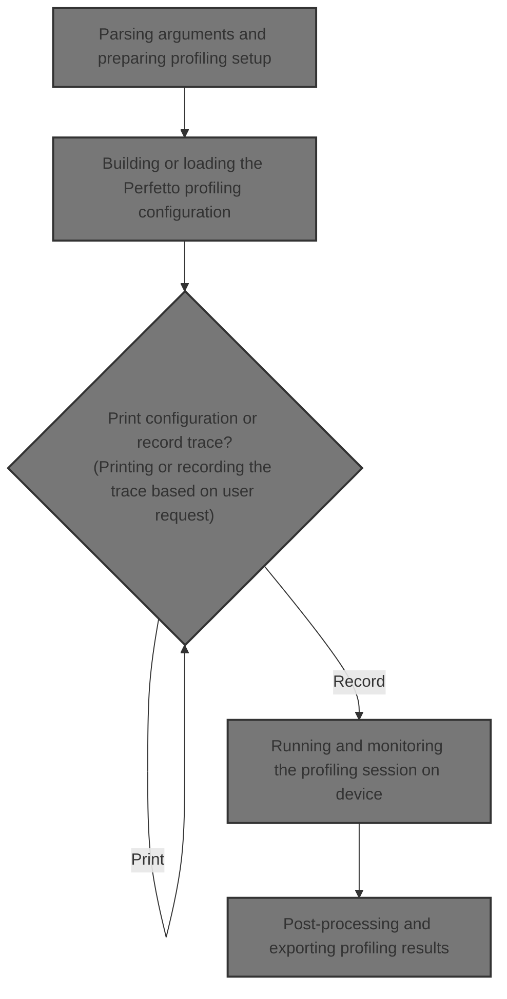
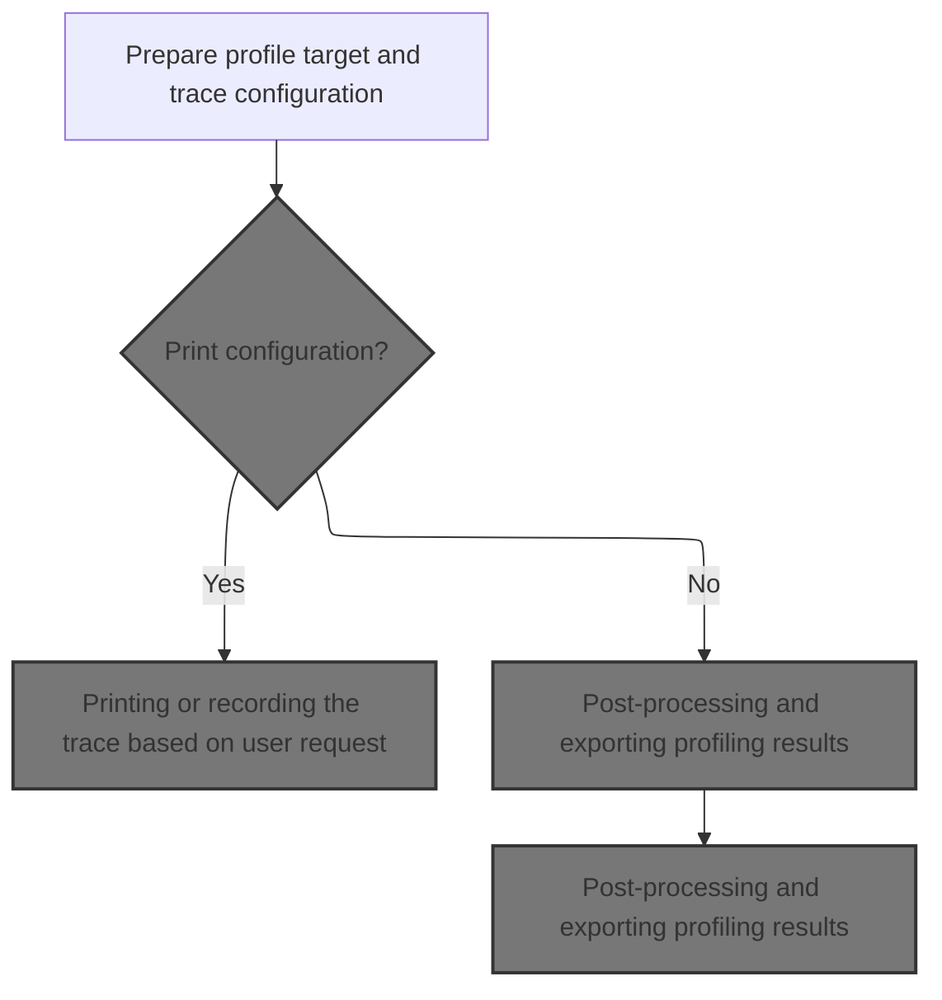
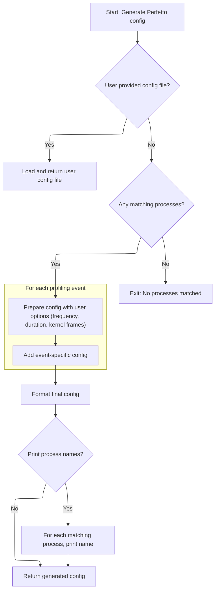
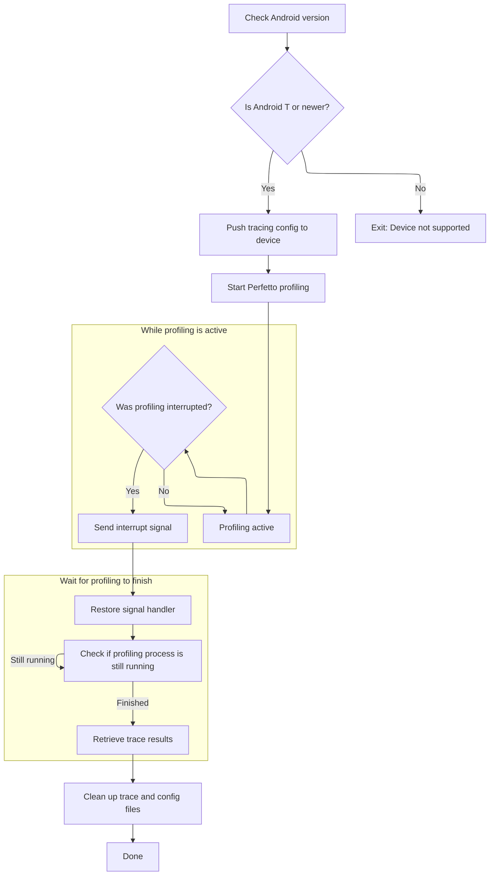

This document outlines how users collect and analyze profiling data using Perfetto. Users provide arguments to define profiling parameters, review or record the configuration, and receive processed results for analysis.



# Parsing arguments and preparing profiling setup



<SwmSnippet path="/python/tools/cpu_profile.py" line="506">

---

In <SwmToken path="python/tools/cpu_profile.py" pos="506:2:2" line-data="def main(argv):">`main`</SwmToken>, we parse arguments, prep the profiling target, and immediately fetch the Perfetto config. We need to call <SwmToken path="python/tools/cpu_profile.py" pos="509:5:5" line-data="  trace_config = get_perfetto_config(args)">`get_perfetto_config`</SwmToken> next because it builds or loads the config that tells Perfetto what and how to profile, based on user input or defaults.

```python
def main(argv):
  args = parse_and_validate_args()
  profile_target = get_and_prepare_profile_target(args)
  trace_config = get_perfetto_config(args)
```

---

</SwmSnippet>

## Building or loading the Perfetto profiling configuration



<SwmSnippet path="/python/tools/cpu_profile.py" line="199">

---

In <SwmToken path="python/tools/cpu_profile.py" pos="199:2:2" line-data="def get_perfetto_config(args):">`get_perfetto_config`</SwmToken>, we either load a user-supplied config file or build a config string with fixed and dynamic sections. We match process names if given, and bail if none are found. The config embeds constants and formats in blocks for each event, controlling what gets profiled and how.

```python
def get_perfetto_config(args):
  """Returns a Perfetto config with CPU profiling enabled for the selected
  processes.

  Args:
    args: The command-line arguments provided to this script.
  """
  if args.config is not None:
    try:
      with open(args.config, 'r') as config_file:
        return config_file.read()
    except IOError as error:
      sys.exit("Unable to read config file: {}".format(error))

  CONFIG_INDENT = '          '
  CONFIG = textwrap.dedent('''\
  buffers {{
    size_kb: 2048
  }}

  buffers {{
    size_kb: 63488
  }}

  data_sources {{
    config {{
      name: "linux.process_stats"
      target_buffer: 0
      process_stats_config {{
        proc_stats_poll_ms: 100
      }}
    }}
  }}

  duration_ms: {duration}
  write_into_file: true
  flush_timeout_ms: 30000
  flush_period_ms: 604800000
  ''')

  matching_processes = []
  if args.name is not None:
    names_to_match = [name.strip() for name in args.name.split(',')]
    matching_processes = get_matching_processes(args, names_to_match)

  if not matching_processes:
    sys.exit("No running processes matched for profiling.")

  target_config = "\n".join(
      [f'{CONFIG_INDENT}target_cmdline: "{p}"' for p in matching_processes])

  events = args.event or ['SW_CPU_CLOCK']
  for event in events:
    CONFIG += (
        textwrap.dedent('''
    data_sources {{
      config {{
        name: "linux.perf"
        target_buffer: 1
        perf_event_config {{
          timebase {{
            counter: %s
            frequency: {frequency}
            timestamp_clock: PERF_CLOCK_MONOTONIC
          }}
          callstack_sampling {{
            scope {{
    {target_config}
            }}
            kernel_frames: {kernel_config}
          }}
        }}
      }}
    }}
    ''') % (event))
```

---

</SwmSnippet>

<SwmSnippet path="/python/tools/cpu_profile.py" line="275">

---

Here we set whether kernel frames are included in the config, based on args. We also print the list of matched processes unless <SwmToken path="python/tools/cpu_profile.py" pos="280:7:7" line-data="  if not args.print_config:">`print_config`</SwmToken> is set, so the user knows what will be profiled.

```python
  if args.kernel_frames:
    kernel_config = "true"
  else:
    kernel_config = "false"

  if not args.print_config:
    print("Configured profiling for these processes:\n")
    for matching_process in matching_processes:
      print(matching_process)
```

---

</SwmSnippet>

<SwmSnippet path="/python/tools/cpu_profile.py" line="283">

---

Finally we format the config string with all the user-supplied and computed values, then return it for use in profiling.

```python
      print(matching_process)
    print()

  config = CONFIG.format(
      frequency=args.frequency,
      duration=args.duration,
      target_config=target_config,
      kernel_config=kernel_config)

  return config
```

---

</SwmSnippet>

## Printing or recording the trace based on user request

<SwmSnippet path="/python/tools/cpu_profile.py" line="510">

---

Back in <SwmToken path="python/tools/cpu_profile.py" pos="506:2:2" line-data="def main(argv):">`main`</SwmToken>, after getting the config, we either print it and exit if requested, or call <SwmToken path="python/tools/cpu_profile.py" pos="513:1:1" line-data="  record_trace(trace_config, profile_target)">`record_trace`</SwmToken> to actually start profiling. Calling <SwmToken path="python/tools/cpu_profile.py" pos="513:1:1" line-data="  record_trace(trace_config, profile_target)">`record_trace`</SwmToken> is what kicks off the trace collection on the device.

```python
  if args.print_config:
    print(trace_config)
    return 0
  record_trace(trace_config, profile_target)
```

---

</SwmSnippet>

## Running and monitoring the profiling session on device



<SwmSnippet path="/python/tools/cpu_profile.py" line="329">

---

In <SwmToken path="python/tools/cpu_profile.py" pos="329:2:2" line-data="def record_trace(config, profile_target):">`record_trace`</SwmToken>, we check device compatibility, push the config to a unique path, start Perfetto profiling, and monitor the process. We use UUIDs for file paths to keep sessions separate, and set up for handling user interrupts.

```python
def record_trace(config, profile_target):
  """Runs Perfetto with the provided configuration to record a trace.

  Args:
    config: The Perfetto config to be used for tracing/profiling.
    profile_target: The directory where the recorded trace is output.
  """
  NULL = open(os.devnull)
  NO_OUT = {
      'stdout': NULL,
      'stderr': NULL,
  }
  if not release_or_newer('T'):
    sys.exit("This tool requires Android T+ to run.")

  # Push configuration to the device.
  # On Windows, temp files cannot be accessed by external processes while open
  # due to file locking, so we must close before adb push and manually cleanup.
  tf = tempfile.NamedTemporaryFile(delete=False)
  try:
    tf.write(config.encode('utf-8'))
    tf.flush()
    tf.close()
    profile_config_path = '/data/misc/perfetto-configs/config-' + UUID
    adb_check_output(['adb', 'push', tf.name, profile_config_path])
  finally:
    os.remove(tf.name)

  profile_device_path = '/data/misc/perfetto-traces/profile-' + UUID
  perfetto_command = ('perfetto --txt -c {} -o {} -d')
  try:
    perfetto_pid = int(
        adb_check_output([
            'adb', 'exec-out',
            perfetto_command.format(profile_config_path, profile_device_path)
        ]).strip())
  except ValueError as error:
    sys.exit("Unable to start profiling: {}".format(error))

  print("Profiling active. Press Ctrl+C to terminate.")

  old_handler = signal.signal(signal.SIGINT, sigint_handler)

  perfetto_alive = True
  while perfetto_alive and not IS_INTERRUPTED:
    perfetto_alive = subprocess.call(
        ['adb', 'shell', '[ -d /proc/{} ]'.format(perfetto_pid)], **NO_OUT) == 0
    time.sleep(0.25)
```

---

</SwmSnippet>

<SwmSnippet path="/python/tools/cpu_profile.py" line="376">

---

Here we handle user interrupts by sending SIGINT to the profiling process on the device, then restore the signal handler and wait for the process to exit cleanly.

```python
    time.sleep(0.25)

  print("Finishing profiling and symbolization...")

  if IS_INTERRUPTED:
    adb_check_output(['adb', 'shell', 'kill', '-INT', str(perfetto_pid)])

  # Restore old handler.
  signal.signal(signal.SIGINT, old_handler)

  while perfetto_alive:
    perfetto_alive = subprocess.call(
        ['adb', 'shell', '[ -d /proc/{} ]'.format(perfetto_pid)]) == 0
    time.sleep(0.25)
```

---

</SwmSnippet>

<SwmSnippet path="/python/tools/cpu_profile.py" line="389">

---

Finally we pull the trace file from the device to the host, then clean up the config and trace files on the device.

```python
    time.sleep(0.25)

  profile_host_path = os.path.join(profile_target, 'raw-trace')
  adb_check_output(['adb', 'pull', profile_device_path, profile_host_path])
  adb_check_output(['adb', 'shell', 'rm', profile_config_path])
  adb_check_output(['adb', 'shell', 'rm', profile_device_path])
```

---

</SwmSnippet>

## Post-processing and exporting profiling results

<SwmSnippet path="/python/tools/cpu_profile.py" line="514">

---

Back in <SwmToken path="python/tools/cpu_profile.py" pos="506:2:2" line-data="def main(argv):">`main`</SwmToken>, after recording the trace, we symbolize it, generate profiles, and copy them to the destination. This wraps up the profiling flow and prepares results for analysis.

```python
  traceconv = get_traceconv()
  trace_file = symbolize_trace(traceconv, profile_target)
  copy_profiles_to_destination(
      profile_target, generate_pprof_profiles(traceconv, trace_file, args))
  return 0
```

---

</SwmSnippet>

&nbsp;

*This is an auto-generated document by Swimm 🌊 and has not yet been verified by a human*

<SwmMeta version="3.0.0" repo-id="Z2l0aHViJTNBJTNBY3BsdXNwbHVzLXBlcmZldHRvJTNBJTNBcmljYXJkb2xvcGV6Zw==" repo-name="cplusplus-perfetto"><sup>Powered by [Swimm](https://app.swimm.io/)</sup></SwmMeta>
