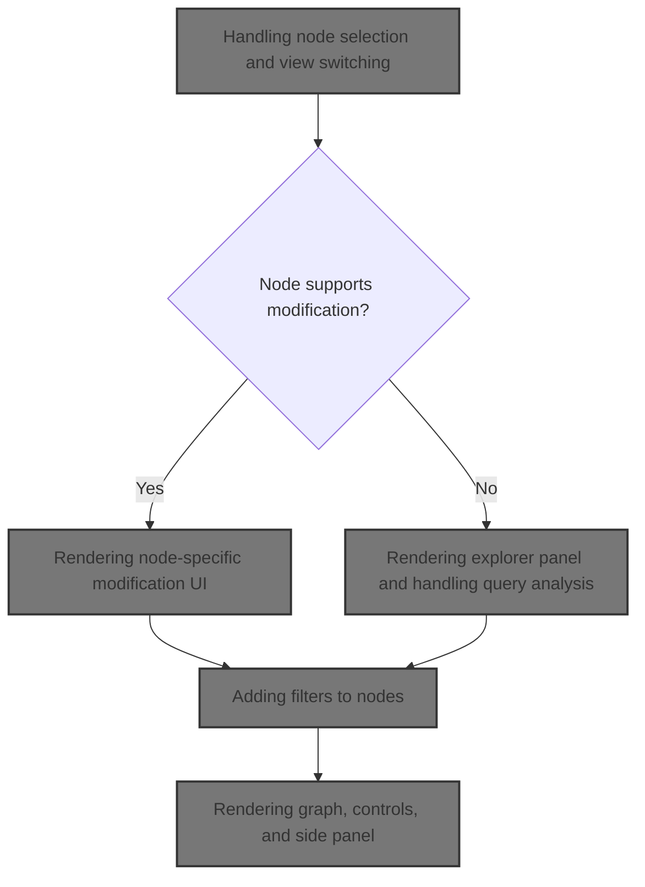

This document describes how users interact with the query builder to explore, modify, and analyze nodes. User actions such as selecting nodes, switching views, and adding filters dynamically update the UI, enabling visual construction and refinement of data queries.



# Handling node selection and view switching

```mermaid
%%{init: {"flowchart": {"defaultRenderer": "elk"}} }%%
flowchart TD
  node1["User selects a node"] --> node2{"Does node support modification?"}
  click node1 openCode "ui/src/plugins/dev.perfetto.ExplorePage/query_builder/builder.ts:167:190"
  node2 -->|"Yes"| node3["Show Modify panel"]
  
  node2 -->|"No"| node4["Show Info panel"]
  click node3 openCode "ui/src/plugins/dev.perfetto.ExplorePage/query_builder/builder.ts:191:308"
  click node4 openCode "ui/src/plugins/dev.perfetto.ExplorePage/query_builder/builder.ts:191:308"
  node3 --> node5{"User switches panel"}
  node4 --> node5
  node5 -->|"Result"| node6["Show Result panel"]
  node5 -->|"Comment"| node6["Show Comment panel"]
  
  click node6 openCode "ui/src/plugins/dev.perfetto.ExplorePage/query_builder/builder.ts:309:475"

classDef HeadingStyle fill:#777777,stroke:#333,stroke-width:2px;
click node2 goToHeading "Rendering node-specific modification UI"
node2:::HeadingStyle
click node5 goToHeading "Adding filters to nodes"
node5:::HeadingStyle

%% Swimm:
%% %%{init: {"flowchart": {"defaultRenderer": "elk"}} }%%
%% flowchart TD
%%   node1["User selects a node"] --> node2{"Does node support modification?"}
%%   click node1 openCode "<SwmPath>[ui/…/query_builder/builder.ts](ui/src/plugins/dev.perfetto.ExplorePage/query_builder/builder.ts)</SwmPath>:167:190"
%%   node2 -->|"Yes"| node3["Show Modify panel"]
%%   
%%   node2 -->|"No"| node4["Show Info panel"]
%%   click node3 openCode "<SwmPath>[ui/…/query_builder/builder.ts](ui/src/plugins/dev.perfetto.ExplorePage/query_builder/builder.ts)</SwmPath>:191:308"
%%   click node4 openCode "<SwmPath>[ui/…/query_builder/builder.ts](ui/src/plugins/dev.perfetto.ExplorePage/query_builder/builder.ts)</SwmPath>:191:308"
%%   node3 --> node5{"User switches panel"}
%%   node4 --> node5
%%   node5 -->|"Result"| node6["Show Result panel"]
%%   node5 -->|"Comment"| node6["Show Comment panel"]
%%   
%%   click node6 openCode "<SwmPath>[ui/…/query_builder/builder.ts](ui/src/plugins/dev.perfetto.ExplorePage/query_builder/builder.ts)</SwmPath>:309:475"
%% 
%% classDef HeadingStyle fill:#777777,stroke:#333,stroke-width:2px;
%% click node2 goToHeading "Rendering node-specific modification UI"
%% node2:::HeadingStyle
%% click node5 goToHeading "Adding filters to nodes"
%% node5:::HeadingStyle
```



<SwmSnippet path="/ui/src/plugins/dev.perfetto.ExplorePage/query_builder/builder.ts" line="167">

---

In `Builder.view`, we start by checking if the selected node has changed. If so, we reset query state and update the UI view to Info or Modify depending on whether the node supports modification. This sets up the context for the next step, which is calling <SwmToken path="ui/src/plugins/dev.perfetto.ExplorePage/query_builder/builder.ts" pos="181:9:9" line-data="      const hasModifyPanel = selectedNode.nodeSpecificModify() != null;">`nodeSpecificModify`</SwmToken> in <SwmPath>[ui/…/nodes/interval_intersect_node.ts](ui/src/plugins/dev.perfetto.ExplorePage/query_builder/nodes/interval_intersect_node.ts)</SwmPath> to determine if the node has a modification panel and what UI to show.

```typescript
  view({attrs}: m.CVnode<BuilderAttrs>) {
    const {
      trace,
      rootNodes,
      onNodeSelected,
      selectedNode,
      onClearAllNodes,
      sqlModules,
    } = attrs;

    if (selectedNode && selectedNode !== this.previousSelectedNode) {
      this.resetQueryState();
      this.isQueryRunning = false;
      this.isAnalyzing = false;
      const hasModifyPanel = selectedNode.nodeSpecificModify() != null;
      // If current view is Info, switch to Modify (if available) when selecting a new node
      if (this.selectedView === SelectedView.kInfo && hasModifyPanel) {
        this.selectedView = SelectedView.kModify;
      }
      // If current view is Modify but modify panel is not available, switch to Info
      if (this.selectedView === SelectedView.kModify && !hasModifyPanel) {
        this.selectedView = SelectedView.kInfo;
      }
    }
```

---

</SwmSnippet>

## Rendering node-specific modification UI

```mermaid
%%{init: {"flowchart": {"defaultRenderer": "elk"}} }%%
flowchart TD
  node1{"Are there connected inputs?"}
  click node1 openCode "ui/src/plugins/dev.perfetto.ExplorePage/query_builder/nodes/interval_intersect_node.ts:456:458"
  node1 -->|"No"| node2["Show 'No inputs connected' message"]
  click node2 openCode "ui/src/plugins/dev.perfetto.ExplorePage/query_builder/nodes/interval_intersect_node.ts:457:458"
  node1 -->|"Yes"| node3["Show error and duplicate column warnings if present"]
  click node3 openCode "ui/src/plugins/dev.perfetto.ExplorePage/query_builder/nodes/interval_intersect_node.ts:462:473"
  node3 --> node4["Show partition selector"]
  click node4 openCode "ui/src/plugins/dev.perfetto.ExplorePage/query_builder/nodes/interval_intersect_node.ts:474:474"
  node4 --> node5["Show input controls"]
  click node5 openCode "ui/src/plugins/dev.perfetto.ExplorePage/query_builder/nodes/interval_intersect_node.ts:479:518"
  subgraph loop1["For each connected input"]
    node5 --> node6["Display input label, filter toggle, and modify columns button"]
    click node6 openCode "ui/src/plugins/dev.perfetto.ExplorePage/query_builder/nodes/interval_intersect_node.ts:484:517"
  end

classDef HeadingStyle fill:#777777,stroke:#333,stroke-width:2px;

%% Swimm:
%% %%{init: {"flowchart": {"defaultRenderer": "elk"}} }%%
%% flowchart TD
%%   node1{"Are there connected inputs?"}
%%   click node1 openCode "<SwmPath>[ui/…/nodes/interval_intersect_node.ts](ui/src/plugins/dev.perfetto.ExplorePage/query_builder/nodes/interval_intersect_node.ts)</SwmPath>:456:458"
%%   node1 -->|"No"| node2["Show 'No inputs connected' message"]
%%   click node2 openCode "<SwmPath>[ui/…/nodes/interval_intersect_node.ts](ui/src/plugins/dev.perfetto.ExplorePage/query_builder/nodes/interval_intersect_node.ts)</SwmPath>:457:458"
%%   node1 -->|"Yes"| node3["Show error and duplicate column warnings if present"]
%%   click node3 openCode "<SwmPath>[ui/…/nodes/interval_intersect_node.ts](ui/src/plugins/dev.perfetto.ExplorePage/query_builder/nodes/interval_intersect_node.ts)</SwmPath>:462:473"
%%   node3 --> node4["Show partition selector"]
%%   click node4 openCode "<SwmPath>[ui/…/nodes/interval_intersect_node.ts](ui/src/plugins/dev.perfetto.ExplorePage/query_builder/nodes/interval_intersect_node.ts)</SwmPath>:474:474"
%%   node4 --> node5["Show input controls"]
%%   click node5 openCode "<SwmPath>[ui/…/nodes/interval_intersect_node.ts](ui/src/plugins/dev.perfetto.ExplorePage/query_builder/nodes/interval_intersect_node.ts)</SwmPath>:479:518"
%%   subgraph loop1["For each connected input"]
%%     node5 --> node6["Display input label, filter toggle, and modify columns button"]
%%     click node6 openCode "<SwmPath>[ui/…/nodes/interval_intersect_node.ts](ui/src/plugins/dev.perfetto.ExplorePage/query_builder/nodes/interval_intersect_node.ts)</SwmPath>:484:517"
%%   end
%% 
%% classDef HeadingStyle fill:#777777,stroke:#333,stroke-width:2px;
```



<SwmSnippet path="/ui/src/plugins/dev.perfetto.ExplorePage/query_builder/nodes/interval_intersect_node.ts" line="441">

---

<SwmToken path="ui/src/plugins/dev.perfetto.ExplorePage/query_builder/nodes/interval_intersect_node.ts" pos="441:1:1" line-data="  nodeSpecificModify(): m.Child {">`nodeSpecificModify`</SwmToken> builds the UI for modifying interval intersect nodes. It validates the node, checks for errors and duplicate columns, sets up filtering state, and renders interactive controls for each input node. The filter and column picker buttons trigger further actions, including calling into <SwmPath>[ui/…/dev.perfetto.ExplorePage/explore_page.ts](ui/src/plugins/dev.perfetto.ExplorePage/explore_page.ts)</SwmPath> to handle column modifications.

```typescript
  nodeSpecificModify(): m.Child {
    this.validate();
    const error = this.state.issues?.queryError;
    const duplicateWarnings = this.checkDuplicateColumns();

    // Initialize filterNegativeDur array if needed
    if (!this.state.filterNegativeDur) {
      this.state.filterNegativeDur = [];
    }

    // Map prevNodes to UI elements with their indices
    const connectedInputs: Array<{node: QueryNode; index: number}> =
      this.prevNodes.map((node, index) => ({node, index}));

    // If no inputs connected, show a message
    if (connectedInputs.length === 0) {
      return m('.pf-exp-query-operations', 'No inputs connected');
    }

    return m(
      '.pf-exp-query-operations',
      error && m(Callout, {icon: 'error'}, error.message),
      duplicateWarnings.length > 0 &&
        m(
          Callout,
          {icon: 'warning'},
          m('div', 'Duplicate columns found:'),
          m(
            'ul',
            {style: {marginTop: '4px', marginBottom: '0', paddingLeft: '20px'}},
            duplicateWarnings.map((warning) => m('li', warning)),
          ),
        ),
      this.renderPartitionSelector(false),
      m(
        '.pf-exp-section',
        m(
          '.pf-exp-operations-container',
          connectedInputs.map(({node, index}) => {
            const label = `Input ${index + 1}`;
            const filterEnabled = this.state.filterNegativeDur?.[index] ?? true;

            return m(
              '.pf-exp-interval-node',
              {
                key: node.nodeId,
                style: {
                  display: 'flex',
                  gap: '8px',
                  alignItems: 'center',
                  marginBottom: '8px',
                },
              },
              m('span', {style: {flex: 1}}, `${label}: ${node.getTitle()}`),
              m(Button, {
                label: 'Filter unfinished intervals',
                icon: filterEnabled ? 'check_box' : 'check_box_outline_blank',
                title: 'Filter out intervals with negative duration',
                onclick: () => {
                  if (!this.state.filterNegativeDur) {
                    this.state.filterNegativeDur = [];
                  }
                  this.state.filterNegativeDur[index] = !filterEnabled;
                  this.state.onchange?.();
                },
              }),
              m(Button, {
                icon: 'view_column',
                title: 'Pick columns',
                compact: true,
                onclick: () => {
                  if (this.state.actions?.onInsertModifyColumnsNode) {
                    this.state.actions.onInsertModifyColumnsNode(index);
                  }
                },
              }),
            );
          }),
        ),
      ),
    );
  }
```

---

</SwmSnippet>

<SwmSnippet path="/ui/src/plugins/dev.perfetto.ExplorePage/explore_page.ts" line="84">

---

OnInsertModifyColumnsNode just calls <SwmToken path="ui/src/plugins/dev.perfetto.ExplorePage/explore_page.ts" pos="85:3:3" line-data="        this.handleInsertModifyColumnsNode(attrs, node, portIndex);">`handleInsertModifyColumnsNode`</SwmToken> with attrs, node, and <SwmToken path="ui/src/plugins/dev.perfetto.ExplorePage/explore_page.ts" pos="84:5:5" line-data="      onInsertModifyColumnsNode: (portIndex: number) =&gt; {">`portIndex`</SwmToken>, relying on those variables being available in the current scope. This passes control to the next handler for column modification.

```typescript
      onInsertModifyColumnsNode: (portIndex: number) => {
        this.handleInsertModifyColumnsNode(attrs, node, portIndex);
      },
```

---

</SwmSnippet>

## Rendering explorer panel and handling query analysis

```mermaid
%%{init: {"flowchart": {"defaultRenderer": "elk"}} }%%
flowchart TD
  node1["User opens Query Builder"] --> node2{"Are there any nodes in the graph?"}
  click node1 openCode "ui/src/plugins/dev.perfetto.ExplorePage/query_builder/builder.ts:191:221"
  node2 -->|"No"| node3["Show only the graph (empty state)"]
  click node2 openCode "ui/src/plugins/dev.perfetto.ExplorePage/query_builder/builder.ts:201:221"
  click node3 openCode "ui/src/plugins/dev.perfetto.ExplorePage/query_builder/builder.ts:202:220"
  node2 -->|"Yes"| node4{"Is a node selected?"}
  click node4 openCode "ui/src/plugins/dev.perfetto.ExplorePage/query_builder/builder.ts:223:278"
  node4 -->|"Yes"| node5["Show node explorer and data panel (layout adapts to selection)"]
  click node5 openCode "ui/src/plugins/dev.perfetto.ExplorePage/query_builder/builder.ts:223:261"
  node4 -->|"No"| node6["Show help panel (with option to create new node)"]
  click node6 openCode "ui/src/plugins/dev.perfetto.ExplorePage/query_builder/builder.ts:262:278"
classDef HeadingStyle fill:#777777,stroke:#333,stroke-width:2px;

%% Swimm:
%% %%{init: {"flowchart": {"defaultRenderer": "elk"}} }%%
%% flowchart TD
%%   node1["User opens Query Builder"] --> node2{"Are there any nodes in the graph?"}
%%   click node1 openCode "<SwmPath>[ui/…/query_builder/builder.ts](ui/src/plugins/dev.perfetto.ExplorePage/query_builder/builder.ts)</SwmPath>:191:221"
%%   node2 -->|"No"| node3["Show only the graph (empty state)"]
%%   click node2 openCode "<SwmPath>[ui/…/query_builder/builder.ts](ui/src/plugins/dev.perfetto.ExplorePage/query_builder/builder.ts)</SwmPath>:201:221"
%%   click node3 openCode "<SwmPath>[ui/…/query_builder/builder.ts](ui/src/plugins/dev.perfetto.ExplorePage/query_builder/builder.ts)</SwmPath>:202:220"
%%   node2 -->|"Yes"| node4{"Is a node selected?"}
%%   click node4 openCode "<SwmPath>[ui/…/query_builder/builder.ts](ui/src/plugins/dev.perfetto.ExplorePage/query_builder/builder.ts)</SwmPath>:223:278"
%%   node4 -->|"Yes"| node5["Show node explorer and data panel (layout adapts to selection)"]
%%   click node5 openCode "<SwmPath>[ui/…/query_builder/builder.ts](ui/src/plugins/dev.perfetto.ExplorePage/query_builder/builder.ts)</SwmPath>:223:261"
%%   node4 -->|"No"| node6["Show help panel (with option to create new node)"]
%%   click node6 openCode "<SwmPath>[ui/…/query_builder/builder.ts](ui/src/plugins/dev.perfetto.ExplorePage/query_builder/builder.ts)</SwmPath>:262:278"
%% classDef HeadingStyle fill:#777777,stroke:#333,stroke-width:2px;
```



<SwmSnippet path="/ui/src/plugins/dev.perfetto.ExplorePage/query_builder/builder.ts" line="191">

---

Back in Builder.view, after returning from <SwmToken path="ui/src/plugins/dev.perfetto.ExplorePage/query_builder/builder.ts" pos="181:9:9" line-data="      const hasModifyPanel = selectedNode.nodeSpecificModify() != null;">`nodeSpecificModify`</SwmToken>, we set up the explorer panel. If a node is selected, we render <SwmToken path="ui/src/plugins/dev.perfetto.ExplorePage/query_builder/builder.ts" pos="224:5:5" line-data="      ? m(NodeExplorer, {">`NodeExplorer`</SwmToken> with callbacks for query analysis and state changes. If not, we show <SwmToken path="ui/src/plugins/dev.perfetto.ExplorePage/query_builder/builder.ts" pos="262:5:5" line-data="      : m(ExplorePageHelp, {">`ExplorePageHelp`</SwmToken> for creating new nodes. The <SwmToken path="ui/src/plugins/dev.perfetto.ExplorePage/query_builder/builder.ts" pos="292:5:5" line-data="          ? m(DataExplorer, {">`DataExplorer`</SwmToken> drawer is set up with an <SwmToken path="ui/src/plugins/dev.perfetto.ExplorePage/query_builder/builder.ts" pos="303:1:1" line-data="              onFilterAdd: (filter) =&gt; {">`onFilterAdd`</SwmToken> callback, which lets users add filters to the selected node, triggering the next step.

```typescript
    this.previousSelectedNode = selectedNode;

    const layoutClasses =
      classNames(
        'pf-query-builder-layout',
        this.isExplorerCollapsed && 'explorer-collapsed',
      ) || '';

    // When no nodes exist, show only the graph (which renders EmptyGraph)
    // without any panels or split layout
    if (rootNodes.length === 0) {
      return m(Graph, {
        rootNodes,
        selectedNode,
        onNodeSelected,
        nodeLayouts: attrs.nodeLayouts,
        onNodeLayoutChange: attrs.onNodeLayoutChange,
        onDeselect: attrs.onDeselect,
        onAddSourceNode: attrs.onAddSourceNode,
        onClearAllNodes,
        onDuplicateNode: attrs.onDuplicateNode,
        onAddOperationNode: (id, node) => attrs.onAddOperationNode(id, node),
        devMode: attrs.devMode,
        onDevModeChange: attrs.onDevModeChange,
        onDeleteNode: attrs.onDeleteNode,
        onConnectionRemove: attrs.onConnectionRemove,
        onImport: attrs.onImport,
        onImportWithStatement: attrs.onImportWithStatement,
        onExport: attrs.onExport,
      });
    }

    const explorer = selectedNode
      ? m(NodeExplorer, {
          // The key to force mithril to re-create the component when the
          // selected node changes, preventing state from leaking between
          // different nodes.
          key: selectedNode.nodeId,
          trace,
          node: selectedNode,
          resolveNode: (nodeId: string) => this.resolveNode(nodeId, rootNodes),
          onQueryAnalyzed: (query: Query | Error) => {
            this.query = query;
            const shouldAutoExecute = selectedNode.state.autoExecute ?? true;
            if (isAQuery(this.query)) {
              // Check if we have an existing materialized table for this exact query
              const currentQueryHash = hashNodeQuery(selectedNode);
              const hasMatchingMaterialization = this.canReuseMaterialization(
                selectedNode,
                currentQueryHash,
              );

              if (hasMatchingMaterialization || shouldAutoExecute) {
                // Either we have materialized data to reuse, or auto-execute is on
                this.queryExecuted = false;
                this.runQuery(selectedNode);
              }
            }
          },
          onAnalysisStateChange: (isAnalyzing: boolean) => {
            this.isAnalyzing = isAnalyzing;
          },
          onchange: () => {
            attrs.onNodeStateChange?.();
          },
          isCollapsed: this.isExplorerCollapsed,
          selectedView: this.selectedView,
          onViewChange: (view: number) => {
            this.selectedView = view;
          },
        })
      : m(ExplorePageHelp, {
          sqlModules,
          onTableClick: (tableName: string) => {
            const {onRootNodeCreated} = attrs;
            const sqlTable = sqlModules.getTable(tableName);
            if (!sqlTable) return;

            const newNode = new TableSourceNode({
              trace,
              sqlModules,
              sqlTable,
              filters: [],
            });
            newNode.state.autoExecute = true;
            onRootNodeCreated(newNode);
          },
        });

    return m(
      SplitPanel,
      {
        className: layoutClasses,
        visibility: selectedNode
          ? this.drawerVisibility
          : SplitPanelDrawerVisibility.COLLAPSED,
        onVisibilityChange: (v) => {
          this.drawerVisibility = v;
        },
        startingHeight: 300,
        drawerContent: selectedNode
          ? m(DataExplorer, {
              queryService: this.queryService,
              query: this.query,
              node: selectedNode,
              response: this.response,
              dataSource: this.dataSource,
              isQueryRunning: this.isQueryRunning,
              isAnalyzing: this.isAnalyzing,
              onchange: () => {
                attrs.onNodeStateChange?.();
              },
              onFilterAdd: (filter) => {
                attrs.onFilterAdd(selectedNode, filter);
              },
              isFullScreen:
                this.drawerVisibility === SplitPanelDrawerVisibility.FULLSCREEN,
              onFullScreenToggle: () => {
```

---

</SwmSnippet>

## Adding filters to nodes

<SwmSnippet path="/ui/src/plugins/dev.perfetto.ExplorePage/query_builder/builder.ts" line="303">

---

OnFilterAdd takes a filter and passes it along with <SwmToken path="ui/src/plugins/dev.perfetto.ExplorePage/query_builder/builder.ts" pos="304:5:5" line-data="                attrs.onFilterAdd(selectedNode, filter);">`selectedNode`</SwmToken> to the next handler. This links the filter to the right node, setting up the next step in <SwmPath>[ui/…/dev.perfetto.ExplorePage/explore_page.ts](ui/src/plugins/dev.perfetto.ExplorePage/explore_page.ts)</SwmPath>.

```typescript
              onFilterAdd: (filter) => {
                attrs.onFilterAdd(selectedNode, filter);
              },
```

---

</SwmSnippet>

## Processing filter addition in node graph

```mermaid
%%{init: {"flowchart": {"defaultRenderer": "elk"}} }%%
flowchart TD
  node1["User requests to add filter"] --> node2{"Is source node a filter node?"}
  click node1 openCode "ui/src/plugins/dev.perfetto.ExplorePage/explore_page.ts:818:820"
  click node2 openCode "ui/src/plugins/dev.perfetto.ExplorePage/explore_page.ts:431:438"
  node2 -->|"Yes"| node3["Add filter to source node"]
  click node3 openCode "ui/src/plugins/dev.perfetto.ExplorePage/explore_page.ts:432:435"
  node3 --> node4["Update UI state"]
  click node4 openCode "ui/src/plugins/dev.perfetto.ExplorePage/explore_page.ts:436:437"
  node2 -->|"No"| node5{"Does source node have one child that is a filter node?"}
  click node5 openCode "ui/src/plugins/dev.perfetto.ExplorePage/explore_page.ts:441:455"
  node5 -->|"Yes"| node6["Add filter to child filter node"]
  click node6 openCode "ui/src/plugins/dev.perfetto.ExplorePage/explore_page.ts:446:449"
  node6 --> node7["Update UI state and select child filter node"]
  click node7 openCode "ui/src/plugins/dev.perfetto.ExplorePage/explore_page.ts:450:454"
  node5 -->|"No"| node8["Create new filter node after source node"]
  click node8 openCode "ui/src/plugins/dev.perfetto.ExplorePage/explore_page.ts:458:463"
  node8 --> node9["Add filter to new filter node"]
  click node9 openCode "ui/src/plugins/dev.perfetto.ExplorePage/explore_page.ts:467:468"
  node9 --> node10["Update UI state and select new filter node"]
  click node10 openCode "ui/src/plugins/dev.perfetto.ExplorePage/explore_page.ts:469:471"
classDef HeadingStyle fill:#777777,stroke:#333,stroke-width:2px;

%% Swimm:
%% %%{init: {"flowchart": {"defaultRenderer": "elk"}} }%%
%% flowchart TD
%%   node1["User requests to add filter"] --> node2{"Is source node a filter node?"}
%%   click node1 openCode "<SwmPath>[ui/…/dev.perfetto.ExplorePage/explore_page.ts](ui/src/plugins/dev.perfetto.ExplorePage/explore_page.ts)</SwmPath>:818:820"
%%   click node2 openCode "<SwmPath>[ui/…/dev.perfetto.ExplorePage/explore_page.ts](ui/src/plugins/dev.perfetto.ExplorePage/explore_page.ts)</SwmPath>:431:438"
%%   node2 -->|"Yes"| node3["Add filter to source node"]
%%   click node3 openCode "<SwmPath>[ui/…/dev.perfetto.ExplorePage/explore_page.ts](ui/src/plugins/dev.perfetto.ExplorePage/explore_page.ts)</SwmPath>:432:435"
%%   node3 --> node4["Update UI state"]
%%   click node4 openCode "<SwmPath>[ui/…/dev.perfetto.ExplorePage/explore_page.ts](ui/src/plugins/dev.perfetto.ExplorePage/explore_page.ts)</SwmPath>:436:437"
%%   node2 -->|"No"| node5{"Does source node have one child that is a filter node?"}
%%   click node5 openCode "<SwmPath>[ui/…/dev.perfetto.ExplorePage/explore_page.ts](ui/src/plugins/dev.perfetto.ExplorePage/explore_page.ts)</SwmPath>:441:455"
%%   node5 -->|"Yes"| node6["Add filter to child filter node"]
%%   click node6 openCode "<SwmPath>[ui/…/dev.perfetto.ExplorePage/explore_page.ts](ui/src/plugins/dev.perfetto.ExplorePage/explore_page.ts)</SwmPath>:446:449"
%%   node6 --> node7["Update UI state and select child filter node"]
%%   click node7 openCode "<SwmPath>[ui/…/dev.perfetto.ExplorePage/explore_page.ts](ui/src/plugins/dev.perfetto.ExplorePage/explore_page.ts)</SwmPath>:450:454"
%%   node5 -->|"No"| node8["Create new filter node after source node"]
%%   click node8 openCode "<SwmPath>[ui/…/dev.perfetto.ExplorePage/explore_page.ts](ui/src/plugins/dev.perfetto.ExplorePage/explore_page.ts)</SwmPath>:458:463"
%%   node8 --> node9["Add filter to new filter node"]
%%   click node9 openCode "<SwmPath>[ui/…/dev.perfetto.ExplorePage/explore_page.ts](ui/src/plugins/dev.perfetto.ExplorePage/explore_page.ts)</SwmPath>:467:468"
%%   node9 --> node10["Update UI state and select new filter node"]
%%   click node10 openCode "<SwmPath>[ui/…/dev.perfetto.ExplorePage/explore_page.ts](ui/src/plugins/dev.perfetto.ExplorePage/explore_page.ts)</SwmPath>:469:471"
%% classDef HeadingStyle fill:#777777,stroke:#333,stroke-width:2px;
```



<SwmSnippet path="/ui/src/plugins/dev.perfetto.ExplorePage/explore_page.ts" line="818">

---

OnFilterAdd in <SwmPath>[ui/…/dev.perfetto.ExplorePage/explore_page.ts](ui/src/plugins/dev.perfetto.ExplorePage/explore_page.ts)</SwmPath> calls <SwmToken path="ui/src/plugins/dev.perfetto.ExplorePage/explore_page.ts" pos="819:3:3" line-data="          this.handleFilterAdd(wrappedAttrs, node, filter);">`handleFilterAdd`</SwmToken>, which checks if the node or its child is a <SwmToken path="ui/src/plugins/dev.perfetto.ExplorePage/explore_page.ts" pos="430:17:17" line-data="    // If the source node is already a FilterNode, just add the filter to it">`FilterNode`</SwmToken>. If so, it adds the filter there; if not, it creates a new <SwmToken path="ui/src/plugins/dev.perfetto.ExplorePage/explore_page.ts" pos="430:17:17" line-data="    // If the source node is already a FilterNode, just add the filter to it">`FilterNode`</SwmToken> and attaches the filter. This updates the node graph and selected node for further UI updates.

```typescript
        onFilterAdd: (node, filter) => {
          this.handleFilterAdd(wrappedAttrs, node, filter);
        },
```

---

</SwmSnippet>

<SwmSnippet path="/ui/src/plugins/dev.perfetto.ExplorePage/explore_page.ts" line="425">

---

This function adds the filter to an existing <SwmToken path="ui/src/plugins/dev.perfetto.ExplorePage/explore_page.ts" pos="430:17:17" line-data="    // If the source node is already a FilterNode, just add the filter to it">`FilterNode`</SwmToken> if possible, otherwise creates a new one and updates selection.

```typescript
  async handleFilterAdd(
    attrs: ExplorePageAttrs,
    sourceNode: QueryNode,
    filter: {column: string; op: string; value?: unknown},
  ) {
    // If the source node is already a FilterNode, just add the filter to it
    if (sourceNode.type === NodeType.kFilter) {
      sourceNode.state.filters = [
        ...(sourceNode.state.filters ?? []),
        filter as UIFilter,
      ];
      attrs.onStateUpdate((currentState) => ({...currentState}));
      return;
    }

    // If the source node has exactly one child and it's a FilterNode, add to that
    if (
      sourceNode.nextNodes.length === 1 &&
      sourceNode.nextNodes[0].type === NodeType.kFilter
    ) {
      const existingFilterNode = sourceNode.nextNodes[0];
      existingFilterNode.state.filters = [
        ...(existingFilterNode.state.filters ?? []),
        filter as UIFilter,
      ];
      attrs.onStateUpdate((currentState) => ({
        ...currentState,
        selectedNode: existingFilterNode,
      }));
      return;
    }

    // Otherwise, create a new FilterNode after the source node
    const filterNodeId = 'filter_node';
    const newFilterNode = await this.handleAddOperationNode(
      attrs,
      sourceNode,
      filterNodeId,
    );

    // Add the filter to the newly created FilterNode
    if (newFilterNode) {
      newFilterNode.state.filters = [filter as UIFilter];
      attrs.onStateUpdate((currentState) => ({
        ...currentState,
        selectedNode: newFilterNode,
      }));
    }
  }
```

---

</SwmSnippet>

## Rendering graph, controls, and side panel

```mermaid
%%{init: {"flowchart": {"defaultRenderer": "elk"}} }%%
flowchart TD
    node1["User interacts with query builder UI"]
    click node1 openCode "ui/src/plugins/dev.perfetto.ExplorePage/query_builder/builder.ts:309:476"
    node1 --> node2{"Is a node selected?"}
    click node2 openCode "ui/src/plugins/dev.perfetto.ExplorePage/query_builder/builder.ts:348:349"
    node2 -->|"Yes"| node3["Show node-specific controls and panels"]
    click node3 openCode "ui/src/plugins/dev.perfetto.ExplorePage/query_builder/builder.ts:350:474"
    node3 --> node4{"Which view is active?"}
    click node4 openCode "ui/src/plugins/dev.perfetto.ExplorePage/query_builder/builder.ts:392:473"
    node4 -->|"Info"| node5["Show Info panel"]
    click node5 openCode "ui/src/plugins/dev.perfetto.ExplorePage/query_builder/builder.ts:392:411"
    node4 -->|"Edit"| node6["Show Edit panel"]
    click node6 openCode "ui/src/plugins/dev.perfetto.ExplorePage/query_builder/builder.ts:412:432"
    node4 -->|"Result"| node7["Show Result panel"]
    click node7 openCode "ui/src/plugins/dev.perfetto.ExplorePage/query_builder/builder.ts:433:452"
    node4 -->|"Comment"| node8["Show Comment panel"]
    click node8 openCode "ui/src/plugins/dev.perfetto.ExplorePage/query_builder/builder.ts:453:473"
    node3 --> node9{"Is node valid?"}
    click node9 openCode "ui/src/plugins/dev.perfetto.ExplorePage/query_builder/builder.ts:351:360"
    node9 -->|"Invalid"| node10["Show warning"]
    click node10 openCode "ui/src/plugins/dev.perfetto.ExplorePage/query_builder/builder.ts:353:360"
    node2 -->|"No"| node11["Show node graph and explorer"]
    click node11 openCode "ui/src/plugins/dev.perfetto.ExplorePage/query_builder/builder.ts:327:388"
    node1 --> node12{"Toggle drawer/explorer visibility"}
    click node12 openCode "ui/src/plugins/dev.perfetto.ExplorePage/query_builder/builder.ts:309:314"
    node12 --> node1
classDef HeadingStyle fill:#777777,stroke:#333,stroke-width:2px;

%% Swimm:
%% %%{init: {"flowchart": {"defaultRenderer": "elk"}} }%%
%% flowchart TD
%%     node1["User interacts with query builder UI"]
%%     click node1 openCode "<SwmPath>[ui/…/query_builder/builder.ts](ui/src/plugins/dev.perfetto.ExplorePage/query_builder/builder.ts)</SwmPath>:309:476"
%%     node1 --> node2{"Is a node selected?"}
%%     click node2 openCode "<SwmPath>[ui/…/query_builder/builder.ts](ui/src/plugins/dev.perfetto.ExplorePage/query_builder/builder.ts)</SwmPath>:348:349"
%%     node2 -->|"Yes"| node3["Show node-specific controls and panels"]
%%     click node3 openCode "<SwmPath>[ui/…/query_builder/builder.ts](ui/src/plugins/dev.perfetto.ExplorePage/query_builder/builder.ts)</SwmPath>:350:474"
%%     node3 --> node4{"Which view is active?"}
%%     click node4 openCode "<SwmPath>[ui/…/query_builder/builder.ts](ui/src/plugins/dev.perfetto.ExplorePage/query_builder/builder.ts)</SwmPath>:392:473"
%%     node4 -->|"Info"| node5["Show Info panel"]
%%     click node5 openCode "<SwmPath>[ui/…/query_builder/builder.ts](ui/src/plugins/dev.perfetto.ExplorePage/query_builder/builder.ts)</SwmPath>:392:411"
%%     node4 -->|"Edit"| node6["Show Edit panel"]
%%     click node6 openCode "<SwmPath>[ui/…/query_builder/builder.ts](ui/src/plugins/dev.perfetto.ExplorePage/query_builder/builder.ts)</SwmPath>:412:432"
%%     node4 -->|"Result"| node7["Show Result panel"]
%%     click node7 openCode "<SwmPath>[ui/…/query_builder/builder.ts](ui/src/plugins/dev.perfetto.ExplorePage/query_builder/builder.ts)</SwmPath>:433:452"
%%     node4 -->|"Comment"| node8["Show Comment panel"]
%%     click node8 openCode "<SwmPath>[ui/…/query_builder/builder.ts](ui/src/plugins/dev.perfetto.ExplorePage/query_builder/builder.ts)</SwmPath>:453:473"
%%     node3 --> node9{"Is node valid?"}
%%     click node9 openCode "<SwmPath>[ui/…/query_builder/builder.ts](ui/src/plugins/dev.perfetto.ExplorePage/query_builder/builder.ts)</SwmPath>:351:360"
%%     node9 -->|"Invalid"| node10["Show warning"]
%%     click node10 openCode "<SwmPath>[ui/…/query_builder/builder.ts](ui/src/plugins/dev.perfetto.ExplorePage/query_builder/builder.ts)</SwmPath>:353:360"
%%     node2 -->|"No"| node11["Show node graph and explorer"]
%%     click node11 openCode "<SwmPath>[ui/…/query_builder/builder.ts](ui/src/plugins/dev.perfetto.ExplorePage/query_builder/builder.ts)</SwmPath>:327:388"
%%     node1 --> node12{"Toggle drawer/explorer visibility"}
%%     click node12 openCode "<SwmPath>[ui/…/query_builder/builder.ts](ui/src/plugins/dev.perfetto.ExplorePage/query_builder/builder.ts)</SwmPath>:309:314"
%%     node12 --> node1
%% classDef HeadingStyle fill:#777777,stroke:#333,stroke-width:2px;
```



<SwmSnippet path="/ui/src/plugins/dev.perfetto.ExplorePage/query_builder/builder.ts" line="309">

---

After returning from <SwmToken path="ui/src/plugins/dev.perfetto.ExplorePage/query_builder/builder.ts" pos="303:1:1" line-data="              onFilterAdd: (filter) =&gt; {">`onFilterAdd`</SwmToken>, Builder.view renders the graph, floating controls for <SwmToken path="ui/src/plugins/dev.perfetto.ExplorePage/explore_page.ts" pos="627:5:7" line-data="    // Handle undo/redo shortcuts">`undo/redo`</SwmToken> and validation warnings, and the side panel for switching views. If the node state changes (like after adding a filter), we call <SwmToken path="ui/src/plugins/dev.perfetto.ExplorePage/query_builder/builder.ts" pos="412:3:3" line-data="          selectedNode.nodeSpecificModify() != null &amp;&amp;">`nodeSpecificModify`</SwmToken> again to update the modification UI.

```typescript
                if (
                  this.drawerVisibility ===
                  SplitPanelDrawerVisibility.FULLSCREEN
                ) {
                  this.drawerVisibility = SplitPanelDrawerVisibility.VISIBLE;
                } else {
                  this.drawerVisibility = SplitPanelDrawerVisibility.FULLSCREEN;
                }
              },
              onExecute: () => {
                // Reset queryExecuted flag to allow execution
                // Analysis has already happened, this.query is already set
                this.queryExecuted = false;
                this.runQuery(selectedNode);
              },
            })
          : null,
      },
      m(
        '.pf-qb-node-graph',
        m(Graph, {
          rootNodes,
          selectedNode,
          onNodeSelected,
          nodeLayouts: attrs.nodeLayouts,
          onNodeLayoutChange: attrs.onNodeLayoutChange,
          onDeselect: attrs.onDeselect,
          onAddSourceNode: attrs.onAddSourceNode,
          onClearAllNodes,
          onDuplicateNode: attrs.onDuplicateNode,
          onAddOperationNode: (id, node) => attrs.onAddOperationNode(id, node),
          devMode: attrs.devMode,
          onDevModeChange: attrs.onDevModeChange,
          onDeleteNode: attrs.onDeleteNode,
          onConnectionRemove: attrs.onConnectionRemove,
          onImport: attrs.onImport,
          onImportWithStatement: attrs.onImportWithStatement,
          onExport: attrs.onExport,
        }),
        selectedNode &&
          m(
            '.pf-qb-floating-controls',
            !selectedNode.validate() &&
              m(
                '.pf-qb-floating-warning',
                m(Icon, {
                  icon: Icons.Warning,
                  filled: true,
                  className: 'pf-qb-warning-icon',
                  title: `Invalid node: ${selectedNode.state.issues?.getTitle() ?? ''}`,
                }),
              ),
          ),
        m(
          '.pf-qb-floating-controls-bottom',
          attrs.onUndo &&
            m(Button, {
              icon: Icons.Undo,
              title: 'Undo (Ctrl+Z)',
              onclick: attrs.onUndo,
              disabled: !attrs.canUndo,
              variant: ButtonVariant.Filled,
              rounded: true,
              iconFilled: true,
              intent: Intent.Primary,
            }),
          attrs.onRedo &&
            m(Button, {
              icon: Icons.Redo,
              title: 'Redo (Ctrl+Shift+Z)',
              onclick: attrs.onRedo,
              disabled: !attrs.canRedo,
              variant: ButtonVariant.Filled,
              rounded: true,
              iconFilled: true,
              intent: Intent.Primary,
            }),
        ),
      ),
      m('.pf-qb-explorer', explorer),
      selectedNode &&
        m(
          '.pf-qb-side-panel',
          m(Button, {
            icon: Icons.Info,
            title: 'Info',
            className:
              this.selectedView === SelectedView.kInfo &&
              !this.isExplorerCollapsed
                ? 'pf-active'
                : '',
            onclick: () => {
              if (
                this.selectedView === SelectedView.kInfo &&
                !this.isExplorerCollapsed
              ) {
                this.isExplorerCollapsed = true;
              } else {
                this.selectedView = SelectedView.kInfo;
                this.isExplorerCollapsed = false;
              }
            },
          }),
          selectedNode.nodeSpecificModify() != null &&
            m(Button, {
              icon: Icons.Edit,
              title: 'Edit',
              className:
                this.selectedView === SelectedView.kModify &&
                !this.isExplorerCollapsed
                  ? 'pf-active'
                  : '',
              onclick: () => {
```

---

</SwmSnippet>

<SwmSnippet path="/ui/src/plugins/dev.perfetto.ExplorePage/query_builder/builder.ts" line="422">

---

After returning from <SwmToken path="ui/src/plugins/dev.perfetto.ExplorePage/query_builder/builder.ts" pos="181:9:9" line-data="      const hasModifyPanel = selectedNode.nodeSpecificModify() != null;">`nodeSpecificModify`</SwmToken>, Builder.view sets up the side panel buttons for switching between Info, Modify, Result, and Comment views. The Modify button only appears if the node supports modification, so the UI adapts based on node capabilities.

```typescript
                if (
                  this.selectedView === SelectedView.kModify &&
                  !this.isExplorerCollapsed
                ) {
                  this.isExplorerCollapsed = true;
                } else {
                  this.selectedView = SelectedView.kModify;
                  this.isExplorerCollapsed = false;
                }
              },
            }),
          m(Button, {
            icon: 'code',
            title: 'Result',
            className:
              this.selectedView === SelectedView.kResult &&
              !this.isExplorerCollapsed
                ? 'pf-active'
                : '',
            onclick: () => {
              if (
                this.selectedView === SelectedView.kResult &&
                !this.isExplorerCollapsed
              ) {
                this.isExplorerCollapsed = true;
              } else {
                this.selectedView = SelectedView.kResult;
                this.isExplorerCollapsed = false;
              }
            },
          }),
          m(Button, {
            icon: 'comment',
            title: 'Comment',
            iconFilled: !!selectedNode.state.comment,
            className:
              this.selectedView === SelectedView.kComment &&
              !this.isExplorerCollapsed
                ? 'pf-active'
                : '',
            onclick: () => {
              if (
                this.selectedView === SelectedView.kComment &&
                !this.isExplorerCollapsed
              ) {
                this.isExplorerCollapsed = true;
              } else {
                this.selectedView = SelectedView.kComment;
                this.isExplorerCollapsed = false;
              }
            },
          }),
        ),
    );
  }
```

---

</SwmSnippet>

&nbsp;

*This is an auto-generated document by Swimm 🌊 and has not yet been verified by a human*

<SwmMeta version="3.0.0" repo-id="Z2l0aHViJTNBJTNBY3BsdXNwbHVzLXBlcmZldHRvJTNBJTNBcmljYXJkb2xvcGV6Zw==" repo-name="cplusplus-perfetto"><sup>Powered by [Swimm](https://app.swimm.io/)</sup></SwmMeta>
