This document explains how the recording UI saves and restores the user's session, configuration, and probe selections. User interactions are periodically persisted, enabling the interface to reload with the same state and preferences, supporting a seamless and consistent experience.

# Triggering Periodic State Persistence

<SwmSnippet path="/ui/src/plugins/dev.perfetto.RecordTraceV2/pages/record_page.ts" line="64">

---

In <SwmToken path="ui/src/plugins/dev.perfetto.RecordTraceV2/pages/record_page.ts" pos="64:1:1" line-data="  view({attrs}: m.CVnode&lt;RecordPageAttrs&gt;) {">`view`</SwmToken>, we start a timer to periodically save the recording state by calling the recording manager's persist function.

```typescript
  view({attrs}: m.CVnode<RecordPageAttrs>) {
    if (this.persistTimer === undefined) {
      this.persistTimer = window.setTimeout(() => {
        this.recMgr.persistIntoLocalStorage();
        this.persistTimer = undefined;
      }, PERSIST_EVERY_MS);
    }
```

---

</SwmSnippet>

## Serializing and Saving Recording State

<SwmSnippet path="/ui/src/plugins/dev.perfetto.RecordTraceV2/recording_manager.ts" line="249">

---

In <SwmToken path="ui/src/plugins/dev.perfetto.RecordTraceV2/recording_manager.ts" pos="249:1:1" line-data="  persistIntoLocalStorage(): void {">`persistIntoLocalStorage`</SwmToken>, we start by creating a schema object and serializing the current session. This prepares the state for saving, and the next step is to serialize session pages and probe settings for a complete snapshot.

```typescript
  persistIntoLocalStorage(): void {
    const state: RecordPluginSchema = RECORD_PLUGIN_SCHEMA.parse({});
    state.lastSession = this.serializeSession();
```

---

</SwmSnippet>

### Filtering and Serializing Session Pages

```mermaid
%%{init: {"flowchart": {"defaultRenderer": "elk"}} }%%
flowchart TD
    node1["Start session serialization"]
    click node1 openCode "ui/src/plugins/dev.perfetto.RecordTraceV2/recording_manager.ts:227:229"
    node1 --> node2["Initialize empty session snapshot"]
    click node2 openCode "ui/src/plugins/dev.perfetto.RecordTraceV2/recording_manager.ts:229:229"
    node2 --> node3["Process all pages"]
    click node3 openCode "ui/src/plugins/dev.perfetto.RecordTraceV2/recording_manager.ts:230:234"
    subgraph loop1["For each page in session"]
      node3 --> node4{"Is this a session page?"}
      click node4 openCode "ui/src/plugins/dev.perfetto.RecordTraceV2/recording_manager.ts:231:232"
      node4 -->|"Yes"| node5["Add page data to snapshot"]
      click node5 openCode "ui/src/plugins/dev.perfetto.RecordTraceV2/recording_manager.ts:232:232"
      node4 -->|"No"| node3
    end
    node3 --> node6["Add all probe configurations to snapshot"]
    click node6 openCode "ui/src/plugins/dev.perfetto.RecordTraceV2/recording_manager.ts:236:236"
    node6 --> node7["Return complete session snapshot"]
    click node7 openCode "ui/src/plugins/dev.perfetto.RecordTraceV2/recording_manager.ts:237:238"

classDef HeadingStyle fill:#777777,stroke:#333,stroke-width:2px;

%% Swimm:
%% %%{init: {"flowchart": {"defaultRenderer": "elk"}} }%%
%% flowchart TD
%%     node1["Start session serialization"]
%%     click node1 openCode "<SwmPath>[ui/…/dev.perfetto.RecordTraceV2/recording_manager.ts](ui/src/plugins/dev.perfetto.RecordTraceV2/recording_manager.ts)</SwmPath>:227:229"
%%     node1 --> node2["Initialize empty session snapshot"]
%%     click node2 openCode "<SwmPath>[ui/…/dev.perfetto.RecordTraceV2/recording_manager.ts](ui/src/plugins/dev.perfetto.RecordTraceV2/recording_manager.ts)</SwmPath>:229:229"
%%     node2 --> node3["Process all pages"]
%%     click node3 openCode "<SwmPath>[ui/…/dev.perfetto.RecordTraceV2/recording_manager.ts](ui/src/plugins/dev.perfetto.RecordTraceV2/recording_manager.ts)</SwmPath>:230:234"
%%     subgraph loop1["For each page in session"]
%%       node3 --> node4{"Is this a session page?"}
%%       click node4 openCode "<SwmPath>[ui/…/dev.perfetto.RecordTraceV2/recording_manager.ts](ui/src/plugins/dev.perfetto.RecordTraceV2/recording_manager.ts)</SwmPath>:231:232"
%%       node4 -->|"Yes"| node5["Add page data to snapshot"]
%%       click node5 openCode "<SwmPath>[ui/…/dev.perfetto.RecordTraceV2/recording_manager.ts](ui/src/plugins/dev.perfetto.RecordTraceV2/recording_manager.ts)</SwmPath>:232:232"
%%       node4 -->|"No"| node3
%%     end
%%     node3 --> node6["Add all probe configurations to snapshot"]
%%     click node6 openCode "<SwmPath>[ui/…/dev.perfetto.RecordTraceV2/recording_manager.ts](ui/src/plugins/dev.perfetto.RecordTraceV2/recording_manager.ts)</SwmPath>:236:236"
%%     node6 --> node7["Return complete session snapshot"]
%%     click node7 openCode "<SwmPath>[ui/…/dev.perfetto.RecordTraceV2/recording_manager.ts](ui/src/plugins/dev.perfetto.RecordTraceV2/recording_manager.ts)</SwmPath>:237:238"
%% 
%% classDef HeadingStyle fill:#777777,stroke:#333,stroke-width:2px;
```



<SwmSnippet path="/ui/src/plugins/dev.perfetto.RecordTraceV2/recording_manager.ts" line="227">

---

In <SwmToken path="ui/src/plugins/dev.perfetto.RecordTraceV2/recording_manager.ts" pos="227:1:1" line-data="  serializeSession(): RecordSessionSchema {">`serializeSession`</SwmToken>, we filter pages to only serialize those marked as <SwmToken path="ui/src/plugins/dev.perfetto.RecordTraceV2/recording_manager.ts" pos="231:11:11" line-data="      if (page.kind === &#39;SESSION_PAGE&#39;) {">`SESSION_PAGE`</SwmToken>. This keeps the session state focused and avoids saving unrelated page data.

```typescript
  serializeSession(): RecordSessionSchema {
    // Initialize with default values.
    const state: RecordSessionSchema = RECORD_SESSION_SCHEMA.parse({});
    for (const page of this.pages.values()) {
      if (page.kind === 'SESSION_PAGE') {
        page.serialize(state);
      }
    }
```

---

</SwmSnippet>

<SwmSnippet path="/ui/src/plugins/dev.perfetto.RecordTraceV2/recording_manager.ts" line="235">

---

After serializing session pages, we add probe settings to the state using <SwmToken path="ui/src/plugins/dev.perfetto.RecordTraceV2/recording_manager.ts" pos="236:11:11" line-data="    state.probes = this.recordConfig.serializeProbes();">`serializeProbes`</SwmToken>, then return the complete state object for storage.

```typescript
    // Serialize the state of each probe page and their settings.
    state.probes = this.recordConfig.serializeProbes();
    return state;
  }
```

---

</SwmSnippet>

### Finalizing State Before Storage

```mermaid
%%{init: {"flowchart": {"defaultRenderer": "elk"}} }%%
flowchart TD
    node1["Prepare session state with saved configurations"] --> node2["For each page"]
    click node1 openCode "ui/src/plugins/dev.perfetto.RecordTraceV2/recording_manager.ts:252:253"
    
    subgraph loop1["For each page"]
      node2 --> node3{"Is page a GLOBAL_PAGE?"}
      click node3 openCode "ui/src/plugins/dev.perfetto.RecordTraceV2/recording_manager.ts:254:254"
      node3 -->|"Yes"| node4["Serialize page state"]
      click node4 openCode "ui/src/plugins/dev.perfetto.RecordTraceV2/recording_manager.ts:255:255"
      node3 -->|"No"| node5["Continue"]
      node4 --> node5
      node5 --> node6["Next page"]
      node6 --> node3
    end
    node2 --> node7["Save session state to local storage"]
    click node7 openCode "ui/src/plugins/dev.perfetto.RecordTraceV2/recording_manager.ts:258:259"
classDef HeadingStyle fill:#777777,stroke:#333,stroke-width:2px;

%% Swimm:
%% %%{init: {"flowchart": {"defaultRenderer": "elk"}} }%%
%% flowchart TD
%%     node1["Prepare session state with saved configurations"] --> node2["For each page"]
%%     click node1 openCode "<SwmPath>[ui/…/dev.perfetto.RecordTraceV2/recording_manager.ts](ui/src/plugins/dev.perfetto.RecordTraceV2/recording_manager.ts)</SwmPath>:252:253"
%%     
%%     subgraph loop1["For each page"]
%%       node2 --> node3{"Is page a <SwmToken path="ui/src/plugins/dev.perfetto.RecordTraceV2/recording_manager.ts" pos="254:11:11" line-data="      if (page.kind === &#39;GLOBAL_PAGE&#39;) {">`GLOBAL_PAGE`</SwmToken>?"}
%%       click node3 openCode "<SwmPath>[ui/…/dev.perfetto.RecordTraceV2/recording_manager.ts](ui/src/plugins/dev.perfetto.RecordTraceV2/recording_manager.ts)</SwmPath>:254:254"
%%       node3 -->|"Yes"| node4["Serialize page state"]
%%       click node4 openCode "<SwmPath>[ui/…/dev.perfetto.RecordTraceV2/recording_manager.ts](ui/src/plugins/dev.perfetto.RecordTraceV2/recording_manager.ts)</SwmPath>:255:255"
%%       node3 -->|"No"| node5["Continue"]
%%       node4 --> node5
%%       node5 --> node6["Next page"]
%%       node6 --> node3
%%     end
%%     node2 --> node7["Save session state to local storage"]
%%     click node7 openCode "<SwmPath>[ui/…/dev.perfetto.RecordTraceV2/recording_manager.ts](ui/src/plugins/dev.perfetto.RecordTraceV2/recording_manager.ts)</SwmPath>:258:259"
%% classDef HeadingStyle fill:#777777,stroke:#333,stroke-width:2px;
```



<SwmSnippet path="/ui/src/plugins/dev.perfetto.RecordTraceV2/recording_manager.ts" line="252">

---

Back in <SwmToken path="ui/src/plugins/dev.perfetto.RecordTraceV2/pages/record_page.ts" pos="67:5:5" line-data="        this.recMgr.persistIntoLocalStorage();">`persistIntoLocalStorage`</SwmToken>, after getting the session state, we add saved configs and serialize any global pages to make sure all relevant data is included before saving.

```typescript
    state.savedSessions = this.savedConfigs;
    for (const page of this.pages.values()) {
      if (page.kind === 'GLOBAL_PAGE') {
        page.serialize(state);
      }
    }
```

---

</SwmSnippet>

<SwmSnippet path="/ui/src/plugins/dev.perfetto.RecordTraceV2/recording_manager.ts" line="258">

---

Finally, we serialize the complete state to JSON and store it in <SwmToken path="ui/src/plugins/dev.perfetto.RecordTraceV2/recording_manager.ts" pos="259:1:1" line-data="    localStorage.setItem(LOCALSTORAGE_KEY, json);">`localStorage`</SwmToken> for persistence.

```typescript
    const json = JSON.stringify(state);
    localStorage.setItem(LOCALSTORAGE_KEY, json);
  }
```

---

</SwmSnippet>

## Preparing UI After State Persistence

```mermaid
%%{init: {"flowchart": {"defaultRenderer": "elk"}} }%%
flowchart TD
  node1{"Is a subpage specified?"}
  click node1 openCode "ui/src/plugins/dev.perfetto.RecordTraceV2/pages/record_page.ts:71:74"
  node1 -->|"Yes"| node2["Show specified subpage"]
  click node2 openCode "ui/src/plugins/dev.perfetto.RecordTraceV2/pages/record_page.ts:71:74"
  node1 -->|"No"| node3["Show default subpage"]
  click node3 openCode "ui/src/plugins/dev.perfetto.RecordTraceV2/pages/record_page.ts:74:74"
  node2 --> node4{"Is recording mode LONG_TRACE?"}
  node3 --> node4
  click node4 openCode "ui/src/plugins/dev.perfetto.RecordTraceV2/pages/record_page.ts:83:95"
  node4 -->|"Yes"| node5["Show warning about unsupported long trace mode"]
  click node5 openCode "ui/src/plugins/dev.perfetto.RecordTraceV2/pages/record_page.ts:83:95"
  node4 -->|"No"| node6["No warning"]
  node5 --> node7["Render recording page with menu and subpage content"]
  click node7 openCode "ui/src/plugins/dev.perfetto.RecordTraceV2/pages/record_page.ts:97:102"
  node6 --> node7
classDef HeadingStyle fill:#777777,stroke:#333,stroke-width:2px;

%% Swimm:
%% %%{init: {"flowchart": {"defaultRenderer": "elk"}} }%%
%% flowchart TD
%%   node1{"Is a subpage specified?"}
%%   click node1 openCode "<SwmPath>[ui/…/pages/record_page.ts](ui/src/plugins/dev.perfetto.RecordTraceV2/pages/record_page.ts)</SwmPath>:71:74"
%%   node1 -->|"Yes"| node2["Show specified subpage"]
%%   click node2 openCode "<SwmPath>[ui/…/pages/record_page.ts](ui/src/plugins/dev.perfetto.RecordTraceV2/pages/record_page.ts)</SwmPath>:71:74"
%%   node1 -->|"No"| node3["Show default subpage"]
%%   click node3 openCode "<SwmPath>[ui/…/pages/record_page.ts](ui/src/plugins/dev.perfetto.RecordTraceV2/pages/record_page.ts)</SwmPath>:74:74"
%%   node2 --> node4{"Is recording mode <SwmToken path="ui/src/plugins/dev.perfetto.RecordTraceV2/pages/record_page.ts" pos="83:14:14" line-data="        this.recMgr.recordConfig.traceConfig.mode === &#39;LONG_TRACE&#39; &amp;&amp;">`LONG_TRACE`</SwmToken>?"}
%%   node3 --> node4
%%   click node4 openCode "<SwmPath>[ui/…/pages/record_page.ts](ui/src/plugins/dev.perfetto.RecordTraceV2/pages/record_page.ts)</SwmPath>:83:95"
%%   node4 -->|"Yes"| node5["Show warning about unsupported long trace mode"]
%%   click node5 openCode "<SwmPath>[ui/…/pages/record_page.ts](ui/src/plugins/dev.perfetto.RecordTraceV2/pages/record_page.ts)</SwmPath>:83:95"
%%   node4 -->|"No"| node6["No warning"]
%%   node5 --> node7["Render recording page with menu and subpage content"]
%%   click node7 openCode "<SwmPath>[ui/…/pages/record_page.ts](ui/src/plugins/dev.perfetto.RecordTraceV2/pages/record_page.ts)</SwmPath>:97:102"
%%   node6 --> node7
%% classDef HeadingStyle fill:#777777,stroke:#333,stroke-width:2px;
```



<SwmSnippet path="/ui/src/plugins/dev.perfetto.RecordTraceV2/pages/record_page.ts" line="71">

---

Back in `RecordPageV2.view`, after saving state, we set up the subpage and call <SwmToken path="ui/src/plugins/dev.perfetto.RecordTraceV2/pages/record_page.ts" pos="98:3:3" line-data="          this.renderMenu(), //">`renderMenu`</SwmToken> to update the UI with the latest session and config info.

```typescript
    this.subpage =
      exists(attrs.subpage) && attrs.subpage.length > 0
        ? attrs.subpage.substring(1)
        : DEFAULT_SUBPAGE;

    const cmdlineUrl =
      'https://perfetto.dev/docs/quickstart/android-tracing#perfetto-cmdline';
    return m(
      '.pf-record-page',
      m(
        Stack,
        {className: 'pf-record-page__container'},
        this.recMgr.recordConfig.traceConfig.mode === 'LONG_TRACE' &&
          m(
            Callout,
            {intent: Intent.Warning, icon: Icons.Warning},
            `
              Recording in long trace mode through the UI is not supported.
              Please copy the command and `,
            m(
              Anchor,
              {href: cmdlineUrl, target: '_blank'},
              `collect the trace using ADB.`,
            ),
          ),
        m(
          '.pf-record-page__container-content',
          this.renderMenu(), //
          this.renderSubPage(), //
        ),
      ),
    );
  }
```

---

</SwmSnippet>

# Rendering the Recording Menu

```mermaid
%%{init: {"flowchart": {"defaultRenderer": "elk"}} }%%
flowchart TD
  node1["Build Record menu section"]
  click node1 openCode "ui/src/plugins/dev.perfetto.RecordTraceV2/pages/record_page.ts:181:183"
  node1 --> node2["Build Recording settings section"]
  click node2 openCode "ui/src/plugins/dev.perfetto.RecordTraceV2/pages/record_page.ts:188:189"
  node2 --> node3["Build Probes section"]
  click node3 openCode "ui/src/plugins/dev.perfetto.RecordTraceV2/pages/record_page.ts:191:192"
  node3 --> node4{"User confirms clear configuration?"}
  click node4 openCode "ui/src/plugins/dev.perfetto.RecordTraceV2/pages/record_page.ts:196:197"
  node4 -->|"Yes"| node5["Clear current configuration"]
  click node5 openCode "ui/src/plugins/dev.perfetto.RecordTraceV2/pages/record_page.ts:198:199"
  node4 -->|"No"| node6["Continue"]
  click node6 openCode "ui/src/plugins/dev.perfetto.RecordTraceV2/pages/record_page.ts:200:201"
  node3 --> node7["Sort probes"]
  click node7 openCode "ui/src/plugins/dev.perfetto.RecordTraceV2/pages/record_page.ts:205:205"
  subgraph loop1["For each available probe"]
    node7 --> node8["Render probe menu entry"]
    click node8 openCode "ui/src/plugins/dev.perfetto.RecordTraceV2/pages/record_page.ts:206:206"
  end
  node8 --> node9["Return menu structure"]
  click node9 openCode "ui/src/plugins/dev.perfetto.RecordTraceV2/pages/record_page.ts:179:209"
classDef HeadingStyle fill:#777777,stroke:#333,stroke-width:2px;

%% Swimm:
%% %%{init: {"flowchart": {"defaultRenderer": "elk"}} }%%
%% flowchart TD
%%   node1["Build Record menu section"]
%%   click node1 openCode "<SwmPath>[ui/…/pages/record_page.ts](ui/src/plugins/dev.perfetto.RecordTraceV2/pages/record_page.ts)</SwmPath>:181:183"
%%   node1 --> node2["Build Recording settings section"]
%%   click node2 openCode "<SwmPath>[ui/…/pages/record_page.ts](ui/src/plugins/dev.perfetto.RecordTraceV2/pages/record_page.ts)</SwmPath>:188:189"
%%   node2 --> node3["Build Probes section"]
%%   click node3 openCode "<SwmPath>[ui/…/pages/record_page.ts](ui/src/plugins/dev.perfetto.RecordTraceV2/pages/record_page.ts)</SwmPath>:191:192"
%%   node3 --> node4{"User confirms clear configuration?"}
%%   click node4 openCode "<SwmPath>[ui/…/pages/record_page.ts](ui/src/plugins/dev.perfetto.RecordTraceV2/pages/record_page.ts)</SwmPath>:196:197"
%%   node4 -->|"Yes"| node5["Clear current configuration"]
%%   click node5 openCode "<SwmPath>[ui/…/pages/record_page.ts](ui/src/plugins/dev.perfetto.RecordTraceV2/pages/record_page.ts)</SwmPath>:198:199"
%%   node4 -->|"No"| node6["Continue"]
%%   click node6 openCode "<SwmPath>[ui/…/pages/record_page.ts](ui/src/plugins/dev.perfetto.RecordTraceV2/pages/record_page.ts)</SwmPath>:200:201"
%%   node3 --> node7["Sort probes"]
%%   click node7 openCode "<SwmPath>[ui/…/pages/record_page.ts](ui/src/plugins/dev.perfetto.RecordTraceV2/pages/record_page.ts)</SwmPath>:205:205"
%%   subgraph loop1["For each available probe"]
%%     node7 --> node8["Render probe menu entry"]
%%     click node8 openCode "<SwmPath>[ui/…/pages/record_page.ts](ui/src/plugins/dev.perfetto.RecordTraceV2/pages/record_page.ts)</SwmPath>:206:206"
%%   end
%%   node8 --> node9["Return menu structure"]
%%   click node9 openCode "<SwmPath>[ui/…/pages/record_page.ts](ui/src/plugins/dev.perfetto.RecordTraceV2/pages/record_page.ts)</SwmPath>:179:209"
%% classDef HeadingStyle fill:#777777,stroke:#333,stroke-width:2px;
```



<SwmSnippet path="/ui/src/plugins/dev.perfetto.RecordTraceV2/pages/record_page.ts" line="177">

---

<SwmToken path="ui/src/plugins/dev.perfetto.RecordTraceV2/pages/record_page.ts" pos="177:3:3" line-data="  private renderMenu() {">`renderMenu`</SwmToken> builds the menu UI, wiring up controls and entries for session, config, and probes. The clear config button calls <SwmToken path="ui/src/plugins/dev.perfetto.RecordTraceV2/pages/record_page.ts" pos="198:3:5" line-data="              this.recMgr.clearSession();">`recMgr.clearSession`</SwmToken> to reset everything.

```typescript
  private renderMenu() {
    const pages = this.recMgr.pages;
    return m(
      '.pf-record-page__menu',
      m(RecordingCtl, {recMgr: this.recMgr}),
      m('header', 'Record'),
      m(
        'ul',
        this.renderMenuEntry(pages.get('target')), // Overview
        this.renderMenuEntry(pages.get('cmdline')),
      ),
      m('header', 'Recording settings'),
      m('ul', this.renderMenuEntry(pages.get('config'))),
      m(
        'header',
        'Probes',
        m(Button, {
          icon: 'delete_sweep',
          title: 'Clear current configuration',
          onclick: () => {
            if (confirm('The current config will be cleared. Are you sure?')) {
              this.recMgr.clearSession();
            }
          },
        }),
      ),
      m(
        'ul',
        this.getSortedProbes(Array.from(pages.values())).map((rc) =>
          this.renderMenuEntry(rc),
        ),
      ),
    );
  }
```

---

</SwmSnippet>

# Resetting Session State

<SwmSnippet path="/ui/src/plugins/dev.perfetto.RecordTraceV2/recording_manager.ts" line="301">

---

<SwmToken path="ui/src/plugins/dev.perfetto.RecordTraceV2/recording_manager.ts" pos="301:1:1" line-data="  clearSession() {">`clearSession`</SwmToken> resets the session by creating a default state and passing it to <SwmToken path="ui/src/plugins/dev.perfetto.RecordTraceV2/recording_manager.ts" pos="303:5:5" line-data="    return this.loadSession(emptySession);">`loadSession`</SwmToken> for a full reset.

```typescript
  clearSession() {
    const emptySession = RECORD_SESSION_SCHEMA.parse({});
    return this.loadSession(emptySession);
  }
```

---

</SwmSnippet>

# Loading Session Data Into Pages

<SwmSnippet path="/ui/src/plugins/dev.perfetto.RecordTraceV2/recording_manager.ts" line="240">

---

<SwmToken path="ui/src/plugins/dev.perfetto.RecordTraceV2/recording_manager.ts" pos="240:1:1" line-data="  loadSession(state: RecordSessionSchema): void {">`loadSession`</SwmToken> updates each session page with the new state and restores probe settings. Next, <SwmPath>[ui/…/pages/target_selection_page.ts](ui/src/plugins/dev.perfetto.RecordTraceV2/pages/target_selection_page.ts)</SwmPath> can use this updated state for platform and target selection.

```typescript
  loadSession(state: RecordSessionSchema): void {
    for (const page of this.pages.values()) {
      if (page.kind === 'SESSION_PAGE') {
        page.deserialize(state);
      }
    }
    this.recordConfig.deserializeProbes(state.probes);
  }
```

---

</SwmSnippet>

# Restoring Target and Config Selection

```mermaid
%%{init: {"flowchart": {"defaultRenderer": "elk"}} }%%
flowchart TD
  node1["Restore auto-open trace preference"]
  click node1 openCode "ui/src/plugins/dev.perfetto.RecordTraceV2/pages/target_selection_page.ts:61:61"
  node1 --> node2{"Was a platform previously selected?"}
  click node2 openCode "ui/src/plugins/dev.perfetto.RecordTraceV2/pages/target_selection_page.ts:64:66"
  node2 -->|"Yes"| node3["Restore platform selection"]
  click node3 openCode "ui/src/plugins/dev.perfetto.RecordTraceV2/pages/target_selection_page.ts:65:65"
  node2 -->|"No"| node5
  node3 --> node5{"Is there a saved config or probes?"}
  node5 -->|"Yes, config selected"| node6["Restore configuration by ID"]
  click node6 openCode "ui/src/plugins/dev.perfetto.RecordTraceV2/pages/target_selection_page.ts:76:81"
  node5 -->|"Yes, probes only"| node7["Restore session with probes"]
  click node7 openCode "ui/src/plugins/dev.perfetto.RecordTraceV2/pages/target_selection_page.ts:83:84"
  node5 -->|"No"| node8["Load default configuration"]
  click node8 openCode "ui/src/plugins/dev.perfetto.RecordTraceV2/pages/target_selection_page.ts:86:87"
  node6 --> node9{"Was a provider previously selected?"}
  node7 --> node9
  node8 --> node9
  click node9 openCode "ui/src/plugins/dev.perfetto.RecordTraceV2/pages/target_selection_page.ts:91:93"
  node9 -->|"Yes"| node10["Restore provider selection"]
  click node10 openCode "ui/src/plugins/dev.perfetto.RecordTraceV2/pages/target_selection_page.ts:92:92"
  node9 -->|"No"| node12
  node10 --> node13{"Was a target previously selected and is it available?"}
  node12 --> node13
  click node13 openCode "ui/src/plugins/dev.perfetto.RecordTraceV2/pages/target_selection_page.ts:96:101"
  node13 -->|"Yes"| node14["Restore target selection"]
  click node14 openCode "ui/src/plugins/dev.perfetto.RecordTraceV2/pages/target_selection_page.ts:100:100"
  node13 -->|"No"| node15["End"]

classDef HeadingStyle fill:#777777,stroke:#333,stroke-width:2px;

%% Swimm:
%% %%{init: {"flowchart": {"defaultRenderer": "elk"}} }%%
%% flowchart TD
%%   node1["Restore auto-open trace preference"]
%%   click node1 openCode "<SwmPath>[ui/…/pages/target_selection_page.ts](ui/src/plugins/dev.perfetto.RecordTraceV2/pages/target_selection_page.ts)</SwmPath>:61:61"
%%   node1 --> node2{"Was a platform previously selected?"}
%%   click node2 openCode "<SwmPath>[ui/…/pages/target_selection_page.ts](ui/src/plugins/dev.perfetto.RecordTraceV2/pages/target_selection_page.ts)</SwmPath>:64:66"
%%   node2 -->|"Yes"| node3["Restore platform selection"]
%%   click node3 openCode "<SwmPath>[ui/…/pages/target_selection_page.ts](ui/src/plugins/dev.perfetto.RecordTraceV2/pages/target_selection_page.ts)</SwmPath>:65:65"
%%   node2 -->|"No"| node5
%%   node3 --> node5{"Is there a saved config or probes?"}
%%   node5 -->|"Yes, config selected"| node6["Restore configuration by ID"]
%%   click node6 openCode "<SwmPath>[ui/…/pages/target_selection_page.ts](ui/src/plugins/dev.perfetto.RecordTraceV2/pages/target_selection_page.ts)</SwmPath>:76:81"
%%   node5 -->|"Yes, probes only"| node7["Restore session with probes"]
%%   click node7 openCode "<SwmPath>[ui/…/pages/target_selection_page.ts](ui/src/plugins/dev.perfetto.RecordTraceV2/pages/target_selection_page.ts)</SwmPath>:83:84"
%%   node5 -->|"No"| node8["Load default configuration"]
%%   click node8 openCode "<SwmPath>[ui/…/pages/target_selection_page.ts](ui/src/plugins/dev.perfetto.RecordTraceV2/pages/target_selection_page.ts)</SwmPath>:86:87"
%%   node6 --> node9{"Was a provider previously selected?"}
%%   node7 --> node9
%%   node8 --> node9
%%   click node9 openCode "<SwmPath>[ui/…/pages/target_selection_page.ts](ui/src/plugins/dev.perfetto.RecordTraceV2/pages/target_selection_page.ts)</SwmPath>:91:93"
%%   node9 -->|"Yes"| node10["Restore provider selection"]
%%   click node10 openCode "<SwmPath>[ui/…/pages/target_selection_page.ts](ui/src/plugins/dev.perfetto.RecordTraceV2/pages/target_selection_page.ts)</SwmPath>:92:92"
%%   node9 -->|"No"| node12
%%   node10 --> node13{"Was a target previously selected and is it available?"}
%%   node12 --> node13
%%   click node13 openCode "<SwmPath>[ui/…/pages/target_selection_page.ts](ui/src/plugins/dev.perfetto.RecordTraceV2/pages/target_selection_page.ts)</SwmPath>:96:101"
%%   node13 -->|"Yes"| node14["Restore target selection"]
%%   click node14 openCode "<SwmPath>[ui/…/pages/target_selection_page.ts](ui/src/plugins/dev.perfetto.RecordTraceV2/pages/target_selection_page.ts)</SwmPath>:100:100"
%%   node13 -->|"No"| node15["End"]
%% 
%% classDef HeadingStyle fill:#777777,stroke:#333,stroke-width:2px;
```



<SwmSnippet path="/ui/src/plugins/dev.perfetto.RecordTraceV2/pages/target_selection_page.ts" line="60">

---

In <SwmToken path="ui/src/plugins/dev.perfetto.RecordTraceV2/pages/target_selection_page.ts" pos="60:3:3" line-data="    async deserialize(state: RecordPluginSchema) {">`deserialize`</SwmToken>, we restore platform, config, and probe selection from the state. Depending on what's available, we call <SwmToken path="ui/src/plugins/dev.perfetto.RecordTraceV2/pages/target_selection_page.ts" pos="76:1:3" line-data="          recMgr.loadConfig({">`recMgr.loadConfig`</SwmToken> or <SwmToken path="ui/src/plugins/dev.perfetto.RecordTraceV2/pages/target_selection_page.ts" pos="83:3:3" line-data="          recMgr.loadSession(state.lastSession);">`loadSession`</SwmToken> to set up the session.

```typescript
    async deserialize(state: RecordPluginSchema) {
      recMgr.autoOpenTraceWhenTracingEnds = state.autoOpenTrace;

      // Restore platform selection
      if (state.target.platformId !== undefined) {
        recMgr.setPlatform(state.target.platformId);
      }

      // Restore config
      const hasSavedProbes =
        state.lastSession !== undefined &&
        state.lastSession.probes !== undefined &&
        Object.keys(state.lastSession.probes).length > 0;

      if (state.selectedConfigId || hasSavedProbes) {
        if (state.selectedConfigId) {
          recMgr.loadConfig({
            config: state.lastSession,
            configId: state.selectedConfigId,
            configName: recMgr.resolveConfigName(state.selectedConfigId),
            configModified: state.configModified,
          });
        } else {
          recMgr.loadSession(state.lastSession);
        }
      } else {
        recMgr.loadDefaultConfig();
      }

```

---

</SwmSnippet>

<SwmSnippet path="/ui/src/plugins/dev.perfetto.RecordTraceV2/pages/target_selection_page.ts" line="89">

---

Back in <SwmToken path="ui/src/plugins/dev.perfetto.RecordTraceV2/recording_manager.ts" pos="243:3:3" line-data="        page.deserialize(state);">`deserialize`</SwmToken>, after restoring config, we finish by restoring provider and target selection so the UI matches the saved state.

```typescript
      // Restore provider selection
      const prov = recMgr.getProvider(state.target.transportId ?? '');
      if (prov !== undefined) {
        await recMgr.setProvider(prov);
      }

      // Restore target selection
      if (state.target.targetId !== undefined) {
        const targets = await recMgr.listTargets();
        const target = targets.find((t) => t.id === state.target.targetId);
        if (target) {
          recMgr.setTarget(target);
        }
      }
    },
```

---

</SwmSnippet>

&nbsp;

*This is an auto-generated document by Swimm 🌊 and has not yet been verified by a human*

<SwmMeta version="3.0.0" repo-id="Z2l0aHViJTNBJTNBY3BsdXNwbHVzLXBlcmZldHRvJTNBJTNBcmljYXJkb2xvcGV6Zw==" repo-name="cplusplus-perfetto"><sup>Powered by [Swimm](https://app.swimm.io/)</sup></SwmMeta>
