This document describes how the graph exploration interface restores a previously undone state when a user requests a redo. The flow starts with a user action in the UI and ends with the application updating the graph to reflect the redone state.

# Triggering Redo from the UI

<SwmSnippet path="/ui/src/plugins/dev.perfetto.ExplorePage/explore_page.ts" line="829">

---

<SwmToken path="ui/src/plugins/dev.perfetto.ExplorePage/explore_page.ts" pos="829:1:1" line-data="        onRedo: () =&gt; this.handleRedo(attrs),">`onRedo`</SwmToken> kicks off the redo flow by delegating to <SwmToken path="ui/src/plugins/dev.perfetto.ExplorePage/explore_page.ts" pos="829:11:11" line-data="        onRedo: () =&gt; this.handleRedo(attrs),">`handleRedo`</SwmToken> with the current attributes. This separation lets the UI layer stay clean and hands off the actual redo logic to the <SwmToken path="ui/src/plugins/dev.perfetto.ExplorePage/explore_page.ts" pos="57:4:4" line-data="export class ExplorePage implements m.ClassComponent&lt;ExplorePageAttrs&gt; {">`ExplorePage`</SwmToken>, which knows how to process it. Next, we need to call ExplorePage.handleRedo because that's where the redo operation is actually performed, including updating state and interacting with history.

```typescript
        onRedo: () => this.handleRedo(attrs),
```

---

</SwmSnippet>

# Processing Redo in <SwmToken path="ui/src/plugins/dev.perfetto.ExplorePage/explore_page.ts" pos="57:4:4" line-data="export class ExplorePage implements m.ClassComponent&lt;ExplorePageAttrs&gt; {">`ExplorePage`</SwmToken>

<SwmSnippet path="/ui/src/plugins/dev.perfetto.ExplorePage/explore_page.ts" line="690">

---

In <SwmToken path="ui/src/plugins/dev.perfetto.ExplorePage/explore_page.ts" pos="690:3:3" line-data="  private handleRedo(attrs: ExplorePageAttrs) {">`handleRedo`</SwmToken>, we check if <SwmToken path="ui/src/plugins/dev.perfetto.ExplorePage/explore_page.ts" pos="691:7:7" line-data="    if (!this.historyManager) return;">`historyManager`</SwmToken> exists, then call its redo method to get the next state. This hands off the responsibility for managing redo history to the dedicated history manager. Next, we need to call into <SwmPath>[ui/…/dev.perfetto.ExplorePage/history_manager.ts](ui/src/plugins/dev.perfetto.ExplorePage/history_manager.ts)</SwmPath> because that's where the actual redo stack and state management live.

```typescript
  private handleRedo(attrs: ExplorePageAttrs) {
    if (!this.historyManager) return;

    const nextState = this.historyManager.redo();
```

---

</SwmSnippet>

## Advancing History State

<SwmSnippet path="/ui/src/plugins/dev.perfetto.ExplorePage/history_manager.ts" line="98">

---

In <SwmToken path="ui/src/plugins/dev.perfetto.ExplorePage/history_manager.ts" pos="98:1:1" line-data="  redo(): ExplorePageState | null {">`redo`</SwmToken>, we check if redo is possible, bump the history index, and mark <SwmToken path="ui/src/plugins/dev.perfetto.ExplorePage/explore_page.ts" pos="627:5:7" line-data="    // Handle undo/redo shortcuts">`undo/redo`</SwmToken> as in progress. Then we deserialize the next state from the history entry. Next, we call into <SwmPath>[ui/…/dev.perfetto.ExplorePage/json_handler.ts](ui/src/plugins/dev.perfetto.ExplorePage/json_handler.ts)</SwmPath> because that's where the logic for reconstructing the graph from serialized data lives.

```typescript
  redo(): ExplorePageState | null {
    if (!this.canRedo()) {
      return null;
    }

    this.currentIndex++;
    this.isUndoRedoInProgress = true;
    const state = deserializeState(
      this.history[this.currentIndex],
      this.trace,
      this.sqlModules,
    );
```

---

</SwmSnippet>

### Rebuilding Graph from Serialized State

```mermaid
%%{init: {"flowchart": {"defaultRenderer": "elk"}} }%%
flowchart TD
  node1["Validate loaded file is a Perfetto graph export"]
  click node1 openCode "ui/src/plugins/dev.perfetto.ExplorePage/json_handler.ts:263:272"
  node1 -->|"Valid"| node1a{"Are node layouts present and valid?"}
  node1 -->|"Not valid"| nodeErr["Show error: Not a valid Perfetto graph"]
  click nodeErr openCode "ui/src/plugins/dev.perfetto.ExplorePage/json_handler.ts:269:271"
  node1a -->|"Yes"| node2["Use provided node layouts"]
  click node1a openCode "ui/src/plugins/dev.perfetto.ExplorePage/json_handler.ts:275:282"
  node1a -->|"No"| node3["Use default layout"]
  node2 --> node4
  node3 --> node4

  subgraph loop1["For each node in saved graph"]
    node4["Create node instance"]
    click node4 openCode "ui/src/plugins/dev.perfetto.ExplorePage/json_handler.ts:286:292"
  end

  subgraph loop2["For each node in saved graph"]
    node5["Restore connections and special node states"]
    click node5 openCode "ui/src/plugins/dev.perfetto.ExplorePage/json_handler.ts:295:404"
  end

  subgraph loop3["For each node in saved graph"]
    node6["Resolve columns for aggregation/modify-columns nodes"]
    click node6 openCode "ui/src/plugins/dev.perfetto.ExplorePage/json_handler.ts:407:414"
  end

  node4 --> node5
  node5 --> node6
  node6 --> node7["Assemble and return reconstructed graph state (root nodes, selected node, layouts)"]
  click node7 openCode "ui/src/plugins/dev.perfetto.ExplorePage/json_handler.ts:416:438"
classDef HeadingStyle fill:#777777,stroke:#333,stroke-width:2px;

%% Swimm:
%% %%{init: {"flowchart": {"defaultRenderer": "elk"}} }%%
%% flowchart TD
%%   node1["Validate loaded file is a Perfetto graph export"]
%%   click node1 openCode "<SwmPath>[ui/…/dev.perfetto.ExplorePage/json_handler.ts](ui/src/plugins/dev.perfetto.ExplorePage/json_handler.ts)</SwmPath>:263:272"
%%   node1 -->|"Valid"| node1a{"Are node layouts present and valid?"}
%%   node1 -->|"Not valid"| nodeErr["Show error: Not a valid Perfetto graph"]
%%   click nodeErr openCode "<SwmPath>[ui/…/dev.perfetto.ExplorePage/json_handler.ts](ui/src/plugins/dev.perfetto.ExplorePage/json_handler.ts)</SwmPath>:269:271"
%%   node1a -->|"Yes"| node2["Use provided node layouts"]
%%   click node1a openCode "<SwmPath>[ui/…/dev.perfetto.ExplorePage/json_handler.ts](ui/src/plugins/dev.perfetto.ExplorePage/json_handler.ts)</SwmPath>:275:282"
%%   node1a -->|"No"| node3["Use default layout"]
%%   node2 --> node4
%%   node3 --> node4
%% 
%%   subgraph loop1["For each node in saved graph"]
%%     node4["Create node instance"]
%%     click node4 openCode "<SwmPath>[ui/…/dev.perfetto.ExplorePage/json_handler.ts](ui/src/plugins/dev.perfetto.ExplorePage/json_handler.ts)</SwmPath>:286:292"
%%   end
%% 
%%   subgraph loop2["For each node in saved graph"]
%%     node5["Restore connections and special node states"]
%%     click node5 openCode "<SwmPath>[ui/…/dev.perfetto.ExplorePage/json_handler.ts](ui/src/plugins/dev.perfetto.ExplorePage/json_handler.ts)</SwmPath>:295:404"
%%   end
%% 
%%   subgraph loop3["For each node in saved graph"]
%%     node6["Resolve columns for aggregation/modify-columns nodes"]
%%     click node6 openCode "<SwmPath>[ui/…/dev.perfetto.ExplorePage/json_handler.ts](ui/src/plugins/dev.perfetto.ExplorePage/json_handler.ts)</SwmPath>:407:414"
%%   end
%% 
%%   node4 --> node5
%%   node5 --> node6
%%   node6 --> node7["Assemble and return reconstructed graph state (root nodes, selected node, layouts)"]
%%   click node7 openCode "<SwmPath>[ui/…/dev.perfetto.ExplorePage/json_handler.ts](ui/src/plugins/dev.perfetto.ExplorePage/json_handler.ts)</SwmPath>:416:438"
%% classDef HeadingStyle fill:#777777,stroke:#333,stroke-width:2px;
```



<SwmSnippet path="/ui/src/plugins/dev.perfetto.ExplorePage/json_handler.ts" line="255">

---

In <SwmToken path="ui/src/plugins/dev.perfetto.ExplorePage/json_handler.ts" pos="255:4:4" line-data="export function deserializeState(">`deserializeState`</SwmToken>, we parse and validate the JSON, then create all node instances in a first pass. This sets up the basic objects so we can wire up connections and references in the next steps. Multi-pass is needed because nodes reference each other, so you can't connect them until they're all created.

```typescript
export function deserializeState(
  json: string,
  trace: Trace,
  sqlModules: SqlModules,
): ExplorePageState {
  const serializedGraph: SerializedGraph = JSON.parse(json);

  // Basic validation to ensure the file is a Perfetto graph export.
  if (
    serializedGraph == null ||
    typeof serializedGraph !== 'object' ||
    !Array.isArray(serializedGraph.nodes) ||
    !Array.isArray(serializedGraph.rootNodeIds)
  ) {
    throw new Error(
      'Invalid file format. The selected file is not a valid Perfetto graph.',
    );
  }

  // Validate nodeLayouts if present
  if (
    serializedGraph.nodeLayouts != null &&
    typeof serializedGraph.nodeLayouts !== 'object'
  ) {
    throw new Error(
      'Invalid file format. nodeLayouts must be an object if provided.',
    );
  }

  const nodes = new Map<string, QueryNode>();
  // First pass: create all node instances
  for (const serializedNode of serializedGraph.nodes) {
    const node = createNodeInstance(serializedNode, trace, sqlModules);
    // Overwrite the newly generated nodeId with the one from the file
    // to allow re-linking nodes correctly.
    (node as {nodeId: string}).nodeId = serializedNode.nodeId;
    nodes.set(serializedNode.nodeId, node);
  }
```

---

</SwmSnippet>

<SwmSnippet path="/ui/src/plugins/dev.perfetto.ExplorePage/json_handler.ts" line="294">

---

This pass links up nodes, fixes legacy <SwmToken path="ui/src/plugins/dev.perfetto.ExplorePage/json_handler.ts" pos="312:3:3" line-data="      serializedNode.prevNode === undefined &amp;&amp;">`prevNode`</SwmToken>(s), and runs custom deserialization for special node types.

```typescript
  // Second pass: connect nodes
  for (const serializedNode of serializedGraph.nodes) {
    const node = nodes.get(serializedNode.nodeId);
    if (!node) {
      throw new Error(
        `Graph is corrupted. Node with ID "${serializedNode.nodeId}" was serialized but not instantiated.`,
      );
    }
    node.nextNodes = serializedNode.nextNodes.map((id) => {
      const nextNode = nodes.get(id);
      if (nextNode == null) {
        throw new Error(`Graph is corrupted. Node "${id}" not found.`);
      }
      return nextNode;
    });

    // Backwards compatibility: if prevNodes is not in the JSON, infer it.
    if (
      serializedNode.prevNode === undefined &&
      serializedNode.prevNodes === undefined
    ) {
      for (const nextNode of node.nextNodes) {
        if ('prevNode' in nextNode) {
          (nextNode as {prevNode: QueryNode}).prevNode = node;
        } else if ('prevNodes' in nextNode) {
          nextNode.prevNodes.push(node);
        }
      }
    }

    if (serializedNode.prevNode) {
      if ('prevNode' in node) {
        const prevNode = nodes.get(serializedNode.prevNode);
        if (prevNode) {
          (node as {prevNode: QueryNode}).prevNode = prevNode;
        }
      }
    }

    if (serializedNode.prevNodes) {
      if ('prevNodes' in node) {
        for (const id of serializedNode.prevNodes) {
          const prevNode = nodes.get(id);
          if (prevNode) {
            node.prevNodes.push(prevNode);
          }
        }
      } else if ('prevNode' in node && serializedNode.prevNodes.length > 0) {
        // Backwards compatibility
        const prevNode = nodes.get(serializedNode.prevNodes[0]);
        if (prevNode) {
          (node as {prevNode: QueryNode}).prevNode = prevNode;
        }
      }
    }

    // Restore inputNodes for ModificationNode with additional input ports
    if (serializedNode.inputNodes && 'inputNodes' in node) {
      if (!node.inputNodes) {
        node.inputNodes = [];
      }
      // Restore each inputNode connection
      for (let i = 0; i < serializedNode.inputNodes.length; i++) {
        const inputNodeId = serializedNode.inputNodes[i];
        if (inputNodeId !== undefined) {
          const inputNode = nodes.get(inputNodeId);
          if (inputNode) {
            node.inputNodes[i] = inputNode;
          }
        } else {
          node.inputNodes[i] = undefined;
        }
      }
    }

    if (serializedNode.type === NodeType.kIntervalIntersect) {
      const intervalNode = node as IntervalIntersectNode;
      if (intervalNode.prevNodes.length > 0) {
        const deserializedState = IntervalIntersectNode.deserializeState(
          nodes,
          serializedNode.state as IntervalIntersectSerializedState,
          intervalNode.prevNodes[0],
        );
        intervalNode.prevNodes.length = 0;
        intervalNode.prevNodes.push(...deserializedState.prevNodes);
      }
    }
    if (serializedNode.type === NodeType.kMerge) {
      const mergeNode = node as MergeNode;
      if (mergeNode.prevNodes.length > 0) {
        const deserializedState = MergeNode.deserializeState(
          nodes,
          serializedNode.state as MergeSerializedState,
        );
        mergeNode.prevNodes.length = 0;
        mergeNode.prevNodes.push(...deserializedState.prevNodes);
      }
    }
    if (serializedNode.type === NodeType.kUnion) {
      const unionNode = node as UnionNode;
      if (unionNode.prevNodes.length > 0) {
        const deserializedState = UnionNode.deserializeState(
          nodes,
          serializedNode.state as UnionSerializedState,
          unionNode.prevNodes[0],
        );
        unionNode.prevNodes.length = 0;
        unionNode.prevNodes.push(...deserializedState.prevNodes);
      }
    }
  }
```

---

</SwmSnippet>

<SwmSnippet path="/ui/src/plugins/dev.perfetto.ExplorePage/json_handler.ts" line="406">

---

After wiring up connections, we run <SwmToken path="ui/src/plugins/dev.perfetto.ExplorePage/json_handler.ts" pos="409:9:9" line-data="      (node as AggregationNode).resolveColumns();">`resolveColumns`</SwmToken> on Aggregation and <SwmToken path="ui/src/plugins/dev.perfetto.ExplorePage/explore_page.ts" pos="306:7:7" line-data="    // Get the ModifyColumns descriptor">`ModifyColumns`</SwmToken> nodes to restore their column info. This is needed for those nodes to function properly in the graph.

```typescript
  // Third pass: resolve columns
  for (const node of nodes.values()) {
    if (node.type === NodeType.kAggregation) {
      (node as AggregationNode).resolveColumns();
    }
    if (node.type === NodeType.kModifyColumns) {
      (node as ModifyColumnsNode).resolveColumns();
    }
  }
```

---

</SwmSnippet>

<SwmSnippet path="/ui/src/plugins/dev.perfetto.ExplorePage/json_handler.ts" line="416">

---

After all passes, we map <SwmToken path="ui/src/plugins/dev.perfetto.ExplorePage/json_handler.ts" pos="416:9:9" line-data="  const rootNodes = serializedGraph.rootNodeIds.map((id) =&gt; {">`rootNodeIds`</SwmToken> to actual nodes, set the selected node if present, and build the <SwmToken path="ui/src/plugins/dev.perfetto.ExplorePage/json_handler.ts" pos="427:7:7" line-data="  // Use provided nodeLayouts if present, otherwise use empty map (will trigger auto-layout)">`nodeLayouts`</SwmToken> map. The function returns an <SwmToken path="ui/src/plugins/dev.perfetto.ExplorePage/history_manager.ts" pos="98:6:6" line-data="  redo(): ExplorePageState | null {">`ExplorePageState`</SwmToken> object with these properties, ready for use by the rest of the app.

```typescript
  const rootNodes = serializedGraph.rootNodeIds.map((id) => {
    const rootNode = nodes.get(id)!;
    if (rootNode == null) {
      throw new Error(`Graph is corrupted. Root node "${id}" not found.`);
    }
    return rootNode;
  });
  const selectedNode = serializedGraph.selectedNodeId
    ? nodes.get(serializedGraph.selectedNodeId)
    : undefined;

  // Use provided nodeLayouts if present, otherwise use empty map (will trigger auto-layout)
  const nodeLayouts =
    serializedGraph.nodeLayouts != null
      ? new Map(Object.entries(serializedGraph.nodeLayouts))
      : new Map<string, {x: number; y: number}>();

  return {
    rootNodes,
    selectedNode,
    nodeLayouts,
  };
}
```

---

</SwmSnippet>

### Finalizing Redo State

<SwmSnippet path="/ui/src/plugins/dev.perfetto.ExplorePage/history_manager.ts" line="110">

---

Back in HistoryManager.redo, after getting the new state from <SwmToken path="ui/src/plugins/dev.perfetto.ExplorePage/explore_page.ts" pos="30:13:13" line-data="import {exportStateAsJson, importStateFromJson} from &#39;./json_handler&#39;;">`json_handler`</SwmToken>, we reset the <SwmToken path="ui/src/plugins/dev.perfetto.ExplorePage/explore_page.ts" pos="627:5:7" line-data="    // Handle undo/redo shortcuts">`undo/redo`</SwmToken> flag and return the reconstructed state to the caller.

```typescript
    this.isUndoRedoInProgress = false;
    return state;
  }
```

---

</SwmSnippet>

## Updating State After Redo

<SwmSnippet path="/ui/src/plugins/dev.perfetto.ExplorePage/explore_page.ts" line="694">

---

Back in ExplorePage.handleRedo, after getting the new state from HistoryManager.redo, we update the UI by calling <SwmToken path="ui/src/plugins/dev.perfetto.ExplorePage/explore_page.ts" pos="695:3:3" line-data="      attrs.onStateUpdate(nextState);">`onStateUpdate`</SwmToken> if there's a valid next state.

```typescript
    if (nextState) {
      attrs.onStateUpdate(nextState);
    }
  }
```

---

</SwmSnippet>

&nbsp;

*This is an auto-generated document by Swimm 🌊 and has not yet been verified by a human*

<SwmMeta version="3.0.0" repo-id="Z2l0aHViJTNBJTNBY3BsdXNwbHVzLXBlcmZldHRvJTNBJTNBcmljYXJkb2xvcGV6Zw==" repo-name="cplusplus-perfetto"><sup>Powered by [Swimm](https://app.swimm.io/)</sup></SwmMeta>
