This document outlines the flow for redoing a previously undone state in the trace analysis workflow. Users can move forward in their analysis history, restoring the application to a prior state, including graph structure and layout. The flow receives a redo request and returns the reconstructed state, allowing users to seamlessly continue their trace analysis.

# Redoing a State from History

<SwmSnippet path="/ui/src/plugins/dev.perfetto.ExplorePage/history_manager.ts" line="98">

---

In <SwmToken path="ui/src/plugins/dev.perfetto.ExplorePage/history_manager.ts" pos="98:1:1" line-data="  redo(): ExplorePageState | null {">`redo`</SwmToken>, we check if a redo is possible, bump the current index, and flag that we're in the middle of an <SwmToken path="ui/src/plugins/dev.perfetto.ExplorePage/history_manager.ts" pos="45:17:19" line-data="    // Don&#39;t record history changes triggered by undo/redo">`undo/redo`</SwmToken>. We then call <SwmToken path="ui/src/plugins/dev.perfetto.ExplorePage/history_manager.ts" pos="105:7:7" line-data="    const state = deserializeState(">`deserializeState`</SwmToken> with the serialized state at the new index, passing in trace and <SwmToken path="ui/src/plugins/dev.perfetto.ExplorePage/history_manager.ts" pos="108:3:3" line-data="      this.sqlModules,">`sqlModules`</SwmToken> so the restored state is ready for trace analysis and SQL queries. This sets up the context for the next step, which is actually reconstructing the state from JSON.

```typescript
  redo(): ExplorePageState | null {
    if (!this.canRedo()) {
      return null;
    }

    this.currentIndex++;
    this.isUndoRedoInProgress = true;
    const state = deserializeState(
      this.history[this.currentIndex],
      this.trace,
      this.sqlModules,
    );
```

---

</SwmSnippet>

## Restoring the Graph Structure

```mermaid
%%{init: {"flowchart": {"defaultRenderer": "elk"}} }%%
flowchart TD
  node1{"Is loaded file a valid Perfetto graph export?"}
  click node1 openCode "ui/src/plugins/dev.perfetto.ExplorePage/json_handler.ts:263:272"
  node1 -->|"Yes"| node2["Instantiate nodes from saved graph"]
  node1 -->|"No"| node6["Show error: Invalid file format"]
  click node6 openCode "ui/src/plugins/dev.perfetto.ExplorePage/json_handler.ts:269:271"

  subgraph loop1["For each node in saved graph"]
    node2 --> node3["Restore node connections"]
    click node2 openCode "ui/src/plugins/dev.perfetto.ExplorePage/json_handler.ts:286:292"
    click node3 openCode "ui/src/plugins/dev.perfetto.ExplorePage/json_handler.ts:295:404"
    node3 --> node4{"Is node a special type?"}
    click node4 openCode "ui/src/plugins/dev.perfetto.ExplorePage/json_handler.ts:369:403"
    node4 -->|"IntervalIntersect"| node7["Restore interval intersect state"]
    click node7 openCode "ui/src/plugins/dev.perfetto.ExplorePage/json_handler.ts:369:380"
    node4 -->|"Merge"| node8["Restore merge state"]
    click node8 openCode "ui/src/plugins/dev.perfetto.ExplorePage/json_handler.ts:381:391"
    node4 -->|"Union"| node9["Restore union state"]
    click node9 openCode "ui/src/plugins/dev.perfetto.ExplorePage/json_handler.ts:392:402"
    node4 -->|"No"| node5["Continue"]
    click node5 openCode "ui/src/plugins/dev.perfetto.ExplorePage/json_handler.ts:295:404"
    node7 --> node5
    node8 --> node5
    node9 --> node5
    node5 --> node2
  end

  subgraph loop2["For each node in graph"]
    node10{"Is node aggregation or modification?"}
    click node10 openCode "ui/src/plugins/dev.perfetto.ExplorePage/json_handler.ts:407:414"
    node10 -->|"Yes"| node11["Resolve columns"]
    click node11 openCode "ui/src/plugins/dev.perfetto.ExplorePage/json_handler.ts:409:413"
    node10 -->|"No"| node12["Continue"]
    click node12 openCode "ui/src/plugins/dev.perfetto.ExplorePage/json_handler.ts:407:414"
    node11 --> node12
    node12 --> node13["All nodes processed"]
  end

  node13 --> node14["Return reconstructed graph state (root nodes, selected node, node layouts)"]
  click node14 openCode "ui/src/plugins/dev.perfetto.ExplorePage/json_handler.ts:433:438"
classDef HeadingStyle fill:#777777,stroke:#333,stroke-width:2px;

%% Swimm:
%% %%{init: {"flowchart": {"defaultRenderer": "elk"}} }%%
%% flowchart TD
%%   node1{"Is loaded file a valid Perfetto graph export?"}
%%   click node1 openCode "<SwmPath>[ui/…/dev.perfetto.ExplorePage/json_handler.ts](ui/src/plugins/dev.perfetto.ExplorePage/json_handler.ts)</SwmPath>:263:272"
%%   node1 -->|"Yes"| node2["Instantiate nodes from saved graph"]
%%   node1 -->|"No"| node6["Show error: Invalid file format"]
%%   click node6 openCode "<SwmPath>[ui/…/dev.perfetto.ExplorePage/json_handler.ts](ui/src/plugins/dev.perfetto.ExplorePage/json_handler.ts)</SwmPath>:269:271"
%% 
%%   subgraph loop1["For each node in saved graph"]
%%     node2 --> node3["Restore node connections"]
%%     click node2 openCode "<SwmPath>[ui/…/dev.perfetto.ExplorePage/json_handler.ts](ui/src/plugins/dev.perfetto.ExplorePage/json_handler.ts)</SwmPath>:286:292"
%%     click node3 openCode "<SwmPath>[ui/…/dev.perfetto.ExplorePage/json_handler.ts](ui/src/plugins/dev.perfetto.ExplorePage/json_handler.ts)</SwmPath>:295:404"
%%     node3 --> node4{"Is node a special type?"}
%%     click node4 openCode "<SwmPath>[ui/…/dev.perfetto.ExplorePage/json_handler.ts](ui/src/plugins/dev.perfetto.ExplorePage/json_handler.ts)</SwmPath>:369:403"
%%     node4 -->|"IntervalIntersect"| node7["Restore interval intersect state"]
%%     click node7 openCode "<SwmPath>[ui/…/dev.perfetto.ExplorePage/json_handler.ts](ui/src/plugins/dev.perfetto.ExplorePage/json_handler.ts)</SwmPath>:369:380"
%%     node4 -->|"Merge"| node8["Restore merge state"]
%%     click node8 openCode "<SwmPath>[ui/…/dev.perfetto.ExplorePage/json_handler.ts](ui/src/plugins/dev.perfetto.ExplorePage/json_handler.ts)</SwmPath>:381:391"
%%     node4 -->|"Union"| node9["Restore union state"]
%%     click node9 openCode "<SwmPath>[ui/…/dev.perfetto.ExplorePage/json_handler.ts](ui/src/plugins/dev.perfetto.ExplorePage/json_handler.ts)</SwmPath>:392:402"
%%     node4 -->|"No"| node5["Continue"]
%%     click node5 openCode "<SwmPath>[ui/…/dev.perfetto.ExplorePage/json_handler.ts](ui/src/plugins/dev.perfetto.ExplorePage/json_handler.ts)</SwmPath>:295:404"
%%     node7 --> node5
%%     node8 --> node5
%%     node9 --> node5
%%     node5 --> node2
%%   end
%% 
%%   subgraph loop2["For each node in graph"]
%%     node10{"Is node aggregation or modification?"}
%%     click node10 openCode "<SwmPath>[ui/…/dev.perfetto.ExplorePage/json_handler.ts](ui/src/plugins/dev.perfetto.ExplorePage/json_handler.ts)</SwmPath>:407:414"
%%     node10 -->|"Yes"| node11["Resolve columns"]
%%     click node11 openCode "<SwmPath>[ui/…/dev.perfetto.ExplorePage/json_handler.ts](ui/src/plugins/dev.perfetto.ExplorePage/json_handler.ts)</SwmPath>:409:413"
%%     node10 -->|"No"| node12["Continue"]
%%     click node12 openCode "<SwmPath>[ui/…/dev.perfetto.ExplorePage/json_handler.ts](ui/src/plugins/dev.perfetto.ExplorePage/json_handler.ts)</SwmPath>:407:414"
%%     node11 --> node12
%%     node12 --> node13["All nodes processed"]
%%   end
%% 
%%   node13 --> node14["Return reconstructed graph state (root nodes, selected node, node layouts)"]
%%   click node14 openCode "<SwmPath>[ui/…/dev.perfetto.ExplorePage/json_handler.ts](ui/src/plugins/dev.perfetto.ExplorePage/json_handler.ts)</SwmPath>:433:438"
%% classDef HeadingStyle fill:#777777,stroke:#333,stroke-width:2px;
```



<SwmSnippet path="/ui/src/plugins/dev.perfetto.ExplorePage/json_handler.ts" line="255">

---

In <SwmToken path="ui/src/plugins/dev.perfetto.ExplorePage/json_handler.ts" pos="255:4:4" line-data="export function deserializeState(">`deserializeState`</SwmToken>, we start by parsing and validating the JSON, then create node instances for each serialized node, storing them by <SwmToken path="ui/src/plugins/dev.perfetto.ExplorePage/json_handler.ts" pos="288:11:11" line-data="    // Overwrite the newly generated nodeId with the one from the file">`nodeId`</SwmToken>. This sets up the map needed for linking nodes in the next pass.

```typescript
export function deserializeState(
  json: string,
  trace: Trace,
  sqlModules: SqlModules,
): ExplorePageState {
  const serializedGraph: SerializedGraph = JSON.parse(json);

  // Basic validation to ensure the file is a Perfetto graph export.
  if (
    serializedGraph == null ||
    typeof serializedGraph !== 'object' ||
    !Array.isArray(serializedGraph.nodes) ||
    !Array.isArray(serializedGraph.rootNodeIds)
  ) {
    throw new Error(
      'Invalid file format. The selected file is not a valid Perfetto graph.',
    );
  }

  // Validate nodeLayouts if present
  if (
    serializedGraph.nodeLayouts != null &&
    typeof serializedGraph.nodeLayouts !== 'object'
  ) {
    throw new Error(
      'Invalid file format. nodeLayouts must be an object if provided.',
    );
  }

  const nodes = new Map<string, QueryNode>();
  // First pass: create all node instances
  for (const serializedNode of serializedGraph.nodes) {
    const node = createNodeInstance(serializedNode, trace, sqlModules);
    // Overwrite the newly generated nodeId with the one from the file
    // to allow re-linking nodes correctly.
    (node as {nodeId: string}).nodeId = serializedNode.nodeId;
    nodes.set(serializedNode.nodeId, node);
  }
```

---

</SwmSnippet>

<SwmSnippet path="/ui/src/plugins/dev.perfetto.ExplorePage/json_handler.ts" line="294">

---

Here we link nodes together by resolving <SwmToken path="ui/src/plugins/dev.perfetto.ExplorePage/json_handler.ts" pos="302:3:3" line-data="    node.nextNodes = serializedNode.nextNodes.map((id) =&gt; {">`nextNodes`</SwmToken> and <SwmToken path="ui/src/plugins/dev.perfetto.ExplorePage/json_handler.ts" pos="310:10:10" line-data="    // Backwards compatibility: if prevNodes is not in the JSON, infer it.">`prevNodes`</SwmToken>, handle backward compatibility for older formats, restore <SwmToken path="ui/src/plugins/dev.perfetto.ExplorePage/json_handler.ts" pos="350:5:5" line-data="    // Restore inputNodes for ModificationNode with additional input ports">`inputNodes`</SwmToken> for nodes with multiple inputs, and call custom deserialization for special node types. This connects the node instances created earlier and sets up their relationships for the graph.

```typescript
  // Second pass: connect nodes
  for (const serializedNode of serializedGraph.nodes) {
    const node = nodes.get(serializedNode.nodeId);
    if (!node) {
      throw new Error(
        `Graph is corrupted. Node with ID "${serializedNode.nodeId}" was serialized but not instantiated.`,
      );
    }
    node.nextNodes = serializedNode.nextNodes.map((id) => {
      const nextNode = nodes.get(id);
      if (nextNode == null) {
        throw new Error(`Graph is corrupted. Node "${id}" not found.`);
      }
      return nextNode;
    });

    // Backwards compatibility: if prevNodes is not in the JSON, infer it.
    if (
      serializedNode.prevNode === undefined &&
      serializedNode.prevNodes === undefined
    ) {
      for (const nextNode of node.nextNodes) {
        if ('prevNode' in nextNode) {
          (nextNode as {prevNode: QueryNode}).prevNode = node;
        } else if ('prevNodes' in nextNode) {
          nextNode.prevNodes.push(node);
        }
      }
    }

    if (serializedNode.prevNode) {
      if ('prevNode' in node) {
        const prevNode = nodes.get(serializedNode.prevNode);
        if (prevNode) {
          (node as {prevNode: QueryNode}).prevNode = prevNode;
        }
      }
    }

    if (serializedNode.prevNodes) {
      if ('prevNodes' in node) {
        for (const id of serializedNode.prevNodes) {
          const prevNode = nodes.get(id);
          if (prevNode) {
            node.prevNodes.push(prevNode);
          }
        }
      } else if ('prevNode' in node && serializedNode.prevNodes.length > 0) {
        // Backwards compatibility
        const prevNode = nodes.get(serializedNode.prevNodes[0]);
        if (prevNode) {
          (node as {prevNode: QueryNode}).prevNode = prevNode;
        }
      }
    }

    // Restore inputNodes for ModificationNode with additional input ports
    if (serializedNode.inputNodes && 'inputNodes' in node) {
      if (!node.inputNodes) {
        node.inputNodes = [];
      }
      // Restore each inputNode connection
      for (let i = 0; i < serializedNode.inputNodes.length; i++) {
        const inputNodeId = serializedNode.inputNodes[i];
        if (inputNodeId !== undefined) {
          const inputNode = nodes.get(inputNodeId);
          if (inputNode) {
            node.inputNodes[i] = inputNode;
          }
        } else {
          node.inputNodes[i] = undefined;
        }
      }
    }

    if (serializedNode.type === NodeType.kIntervalIntersect) {
      const intervalNode = node as IntervalIntersectNode;
      if (intervalNode.prevNodes.length > 0) {
        const deserializedState = IntervalIntersectNode.deserializeState(
          nodes,
          serializedNode.state as IntervalIntersectSerializedState,
          intervalNode.prevNodes[0],
        );
        intervalNode.prevNodes.length = 0;
        intervalNode.prevNodes.push(...deserializedState.prevNodes);
      }
    }
    if (serializedNode.type === NodeType.kMerge) {
      const mergeNode = node as MergeNode;
      if (mergeNode.prevNodes.length > 0) {
        const deserializedState = MergeNode.deserializeState(
          nodes,
          serializedNode.state as MergeSerializedState,
        );
        mergeNode.prevNodes.length = 0;
        mergeNode.prevNodes.push(...deserializedState.prevNodes);
      }
    }
    if (serializedNode.type === NodeType.kUnion) {
      const unionNode = node as UnionNode;
      if (unionNode.prevNodes.length > 0) {
        const deserializedState = UnionNode.deserializeState(
          nodes,
          serializedNode.state as UnionSerializedState,
          unionNode.prevNodes[0],
        );
        unionNode.prevNodes.length = 0;
        unionNode.prevNodes.push(...deserializedState.prevNodes);
      }
    }
  }
```

---

</SwmSnippet>

<SwmSnippet path="/ui/src/plugins/dev.perfetto.ExplorePage/json_handler.ts" line="406">

---

Now we run <SwmToken path="ui/src/plugins/dev.perfetto.ExplorePage/json_handler.ts" pos="409:9:9" line-data="      (node as AggregationNode).resolveColumns();">`resolveColumns`</SwmToken> for aggregation and modification nodes. This finalizes their internal state so they're ready for queries and transformations. It follows the node linking step and comes before collecting root and selected nodes.

```typescript
  // Third pass: resolve columns
  for (const node of nodes.values()) {
    if (node.type === NodeType.kAggregation) {
      (node as AggregationNode).resolveColumns();
    }
    if (node.type === NodeType.kModifyColumns) {
      (node as ModifyColumnsNode).resolveColumns();
    }
  }
```

---

</SwmSnippet>

<SwmSnippet path="/ui/src/plugins/dev.perfetto.ExplorePage/json_handler.ts" line="416">

---

Finally we collect the root nodes and selected node from the map, set up node layouts, and return the <SwmToken path="ui/src/plugins/dev.perfetto.ExplorePage/history_manager.ts" pos="98:6:6" line-data="  redo(): ExplorePageState | null {">`ExplorePageState`</SwmToken> object. This wraps up the deserialization and hands back a usable state.

```typescript
  const rootNodes = serializedGraph.rootNodeIds.map((id) => {
    const rootNode = nodes.get(id)!;
    if (rootNode == null) {
      throw new Error(`Graph is corrupted. Root node "${id}" not found.`);
    }
    return rootNode;
  });
  const selectedNode = serializedGraph.selectedNodeId
    ? nodes.get(serializedGraph.selectedNodeId)
    : undefined;

  // Use provided nodeLayouts if present, otherwise use empty map (will trigger auto-layout)
  const nodeLayouts =
    serializedGraph.nodeLayouts != null
      ? new Map(Object.entries(serializedGraph.nodeLayouts))
      : new Map<string, {x: number; y: number}>();

  return {
    rootNodes,
    selectedNode,
    nodeLayouts,
  };
}
```

---

</SwmSnippet>

## Completing the Redo Operation

<SwmSnippet path="/ui/src/plugins/dev.perfetto.ExplorePage/history_manager.ts" line="110">

---

Back in HistoryManager.redo, we clear the <SwmToken path="ui/src/plugins/dev.perfetto.ExplorePage/history_manager.ts" pos="45:17:19" line-data="    // Don&#39;t record history changes triggered by undo/redo">`undo/redo`</SwmToken> flag and return the state we just got from deserialization. This wraps up the redo process and hands the restored state to the caller.

```typescript
    this.isUndoRedoInProgress = false;
    return state;
  }
```

---

</SwmSnippet>

&nbsp;

*This is an auto-generated document by Swimm 🌊 and has not yet been verified by a human*

<SwmMeta version="3.0.0" repo-id="Z2l0aHViJTNBJTNBY3BsdXNwbHVzLXBlcmZldHRvJTNBJTNBcmljYXJkb2xvcGV6Zw==" repo-name="cplusplus-perfetto"><sup>Powered by [Swimm](https://app.swimm.io/)</sup></SwmMeta>
