This document describes how the table UI refreshes its data and state in response to user actions such as filtering, sorting, or navigating. When a reload is triggered, the system updates the table's data and state, redraws the UI, and ensures the user sees the most current information.

# Where is this flow used?

This flow is used multiple times in the codebase as represented in the following diagram:

(Note - these are only some of the entry points of this flow)

```mermaid
graph TD;
      a62e7039418ed52d674a4a13ab8ab8beaffa425e8fddb62f9512eb005a75ebcf(ui/…/table/table.ts::SqlTable.view) --> d06afe098de392713aff96fcfcc4b1dedb85769010f6284d941cd2eb9abc3ae9(ui/…/table/state.ts::SqlTableState.sortBy)

a62e7039418ed52d674a4a13ab8ab8beaffa425e8fddb62f9512eb005a75ebcf(ui/…/table/table.ts::SqlTable.view) --> cd3e66fe4f8fcaae21e62fc95eee76833a41f78d9ae970d429099b66b11992bb(ui/…/menus/transform_column_menu.ts::renderTransformColumnMenu)

a62e7039418ed52d674a4a13ab8ab8beaffa425e8fddb62f9512eb005a75ebcf(ui/…/table/table.ts::SqlTable.view) --> c411d8bb9e5c087dac3eb68dc3b23848ba57ac5a4ff0c94f5c757edafb5a5cfe(ui/…/table/state.ts::SqlTableState.hideColumnAtIndex)

a62e7039418ed52d674a4a13ab8ab8beaffa425e8fddb62f9512eb005a75ebcf(ui/…/table/table.ts::SqlTable.view) --> c09cf45ec3340eea3b7e4730d987c3027978b330b8a8e83b99da04c1352c874e(ui/…/menus/cast_column_menu.ts::renderCastColumnMenu)

a62e7039418ed52d674a4a13ab8ab8beaffa425e8fddb62f9512eb005a75ebcf(ui/…/table/table.ts::SqlTable.view) --> 17eb4b63d3a1acf17b3b0a2a6dbdac1250fcbe88549cc6e5737c5902d387077e(ui/…/table/state.ts::SqlTableState.replaceColumnAtIndex)

d06afe098de392713aff96fcfcc4b1dedb85769010f6284d941cd2eb9abc3ae9(ui/…/table/state.ts::SqlTableState.sortBy) --> 727245f83ba1514a7e121094b4d3621e6b07ac4f5338876b90624eaf1cedb052(ui/…/table/state.ts::SqlTableState.reload)

cd3e66fe4f8fcaae21e62fc95eee76833a41f78d9ae970d429099b66b11992bb(ui/…/menus/transform_column_menu.ts::renderTransformColumnMenu) --> 32bb645a4f2c747b222192678f43f21462633e315b4a011f170cc319391e2cb3(ui/…/table/state.ts::SqlTableState.addColumn)

32bb645a4f2c747b222192678f43f21462633e315b4a011f170cc319391e2cb3(ui/…/table/state.ts::SqlTableState.addColumn) --> 727245f83ba1514a7e121094b4d3621e6b07ac4f5338876b90624eaf1cedb052(ui/…/table/state.ts::SqlTableState.reload)

c411d8bb9e5c087dac3eb68dc3b23848ba57ac5a4ff0c94f5c757edafb5a5cfe(ui/…/table/state.ts::SqlTableState.hideColumnAtIndex) --> 727245f83ba1514a7e121094b4d3621e6b07ac4f5338876b90624eaf1cedb052(ui/…/table/state.ts::SqlTableState.reload)

c09cf45ec3340eea3b7e4730d987c3027978b330b8a8e83b99da04c1352c874e(ui/…/menus/cast_column_menu.ts::renderCastColumnMenu) --> 17eb4b63d3a1acf17b3b0a2a6dbdac1250fcbe88549cc6e5737c5902d387077e(ui/…/table/state.ts::SqlTableState.replaceColumnAtIndex)

17eb4b63d3a1acf17b3b0a2a6dbdac1250fcbe88549cc6e5737c5902d387077e(ui/…/table/state.ts::SqlTableState.replaceColumnAtIndex) --> 727245f83ba1514a7e121094b4d3621e6b07ac4f5338876b90624eaf1cedb052(ui/…/table/state.ts::SqlTableState.reload)

e07b06ac4aaaabc9da79269543951e834220e9865a19e54f79038d8509b52c5f(ui/…/details/sql_table_tab.ts::SqlTableTab.render) --> de616ce260c4aabcb352fb820211c830ef326b4eace70dd6c2003b12ac4b4e6b(ui/…/details/sql_table_tab.ts::SqlTableTab.getTableButtons)

de616ce260c4aabcb352fb820211c830ef326b4eace70dd6c2003b12ac4b4e6b(ui/…/details/sql_table_tab.ts::SqlTableTab.getTableButtons) --> 4f25dc8658133050fce6a2b84966ab6c5f8b903bee6d0c48f205e273097b6a0b(ui/…/table/state.ts::SqlTableState.goForward)

de616ce260c4aabcb352fb820211c830ef326b4eace70dd6c2003b12ac4b4e6b(ui/…/details/sql_table_tab.ts::SqlTableTab.getTableButtons) --> ad88f96374d03416c0ec9103130f1fdca9fdc87d98bf1d0d6f7df3e607c8799f(ui/…/table/state.ts::SqlTableState.goBack)

4f25dc8658133050fce6a2b84966ab6c5f8b903bee6d0c48f205e273097b6a0b(ui/…/table/state.ts::SqlTableState.goForward) --> 727245f83ba1514a7e121094b4d3621e6b07ac4f5338876b90624eaf1cedb052(ui/…/table/state.ts::SqlTableState.reload)

ad88f96374d03416c0ec9103130f1fdca9fdc87d98bf1d0d6f7df3e607c8799f(ui/…/table/state.ts::SqlTableState.goBack) --> 727245f83ba1514a7e121094b4d3621e6b07ac4f5338876b90624eaf1cedb052(ui/…/table/state.ts::SqlTableState.reload)

6f179cd63cf4d55e36a47b353da2bd94395bd61ad842b9ff681f6d4d786dbb4f(ui/…/table/state.ts::SqlTableState.constructor) --> 727245f83ba1514a7e121094b4d3621e6b07ac4f5338876b90624eaf1cedb052(ui/…/table/state.ts::SqlTableState.reload)

62b585ff327ab28c34c32d1b50814b2ed6b5b0ef4a77a9fa834e47dfc54e196e(ui/…/table/table.ts::AddColumnMenuItem.view) --> 32bb645a4f2c747b222192678f43f21462633e315b4a011f170cc319391e2cb3(ui/…/table/state.ts::SqlTableState.addColumn)

dfc3fcbcfa9fd98d121a4236eb271af3c4cba8c5891ca9fd7bc8f2a81c44aaec(ui/…/menus/transform_column_menu.ts::ConfigureTransformMenu.view) --> c9ef9ff450c7f9d1f84a586cc905b0396c2be598264cee136a3a43e21aca4d67(ui/…/menus/transform_column_menu.ts::onApply)

c9ef9ff450c7f9d1f84a586cc905b0396c2be598264cee136a3a43e21aca4d67(ui/…/menus/transform_column_menu.ts::onApply) --> cd332c5bb69dc438d9726f202298fcf6d7b61fe43507f5f5d557e7cdb94e7b64(ui/…/table/table.ts::replaceColumn)

cd332c5bb69dc438d9726f202298fcf6d7b61fe43507f5f5d557e7cdb94e7b64(ui/…/table/table.ts::replaceColumn) --> 17eb4b63d3a1acf17b3b0a2a6dbdac1250fcbe88549cc6e5737c5902d387077e(ui/…/table/state.ts::SqlTableState.replaceColumnAtIndex)


classDef mainFlowStyle color:#000000,fill:#7CB9F4
classDef rootsStyle color:#000000,fill:#00FFF4
classDef Style1 color:#000000,fill:#00FFAA
classDef Style2 color:#000000,fill:#FFFF00
classDef Style3 color:#000000,fill:#AA7CB9

%% Swimm:
%% graph TD;
%%       a62e7039418ed52d674a4a13ab8ab8beaffa425e8fddb62f9512eb005a75ebcf(<SwmPath>[ui/…/table/table.ts](ui/src/components/widgets/sql/table/table.ts)</SwmPath>::SqlTable.view) --> d06afe098de392713aff96fcfcc4b1dedb85769010f6284d941cd2eb9abc3ae9(<SwmPath>[ui/…/table/state.ts](ui/src/components/widgets/sql/table/state.ts)</SwmPath>::SqlTableState.sortBy)
%% 
%% a62e7039418ed52d674a4a13ab8ab8beaffa425e8fddb62f9512eb005a75ebcf(<SwmPath>[ui/…/table/table.ts](ui/src/components/widgets/sql/table/table.ts)</SwmPath>::SqlTable.view) --> cd3e66fe4f8fcaae21e62fc95eee76833a41f78d9ae970d429099b66b11992bb(<SwmPath>[ui/…/menus/transform_column_menu.ts](ui/src/components/widgets/sql/table/menus/transform_column_menu.ts)</SwmPath>::renderTransformColumnMenu)
%% 
%% a62e7039418ed52d674a4a13ab8ab8beaffa425e8fddb62f9512eb005a75ebcf(<SwmPath>[ui/…/table/table.ts](ui/src/components/widgets/sql/table/table.ts)</SwmPath>::SqlTable.view) --> c411d8bb9e5c087dac3eb68dc3b23848ba57ac5a4ff0c94f5c757edafb5a5cfe(<SwmPath>[ui/…/table/state.ts](ui/src/components/widgets/sql/table/state.ts)</SwmPath>::SqlTableState.hideColumnAtIndex)
%% 
%% a62e7039418ed52d674a4a13ab8ab8beaffa425e8fddb62f9512eb005a75ebcf(<SwmPath>[ui/…/table/table.ts](ui/src/components/widgets/sql/table/table.ts)</SwmPath>::SqlTable.view) --> c09cf45ec3340eea3b7e4730d987c3027978b330b8a8e83b99da04c1352c874e(<SwmPath>[ui/…/menus/cast_column_menu.ts](ui/src/components/widgets/sql/table/menus/cast_column_menu.ts)</SwmPath>::renderCastColumnMenu)
%% 
%% a62e7039418ed52d674a4a13ab8ab8beaffa425e8fddb62f9512eb005a75ebcf(<SwmPath>[ui/…/table/table.ts](ui/src/components/widgets/sql/table/table.ts)</SwmPath>::SqlTable.view) --> 17eb4b63d3a1acf17b3b0a2a6dbdac1250fcbe88549cc6e5737c5902d387077e(<SwmPath>[ui/…/table/state.ts](ui/src/components/widgets/sql/table/state.ts)</SwmPath>::SqlTableState.replaceColumnAtIndex)
%% 
%% d06afe098de392713aff96fcfcc4b1dedb85769010f6284d941cd2eb9abc3ae9(<SwmPath>[ui/…/table/state.ts](ui/src/components/widgets/sql/table/state.ts)</SwmPath>::SqlTableState.sortBy) --> 727245f83ba1514a7e121094b4d3621e6b07ac4f5338876b90624eaf1cedb052(<SwmPath>[ui/…/table/state.ts](ui/src/components/widgets/sql/table/state.ts)</SwmPath>::SqlTableState.reload)
%% 
%% cd3e66fe4f8fcaae21e62fc95eee76833a41f78d9ae970d429099b66b11992bb(<SwmPath>[ui/…/menus/transform_column_menu.ts](ui/src/components/widgets/sql/table/menus/transform_column_menu.ts)</SwmPath>::renderTransformColumnMenu) --> 32bb645a4f2c747b222192678f43f21462633e315b4a011f170cc319391e2cb3(<SwmPath>[ui/…/table/state.ts](ui/src/components/widgets/sql/table/state.ts)</SwmPath>::SqlTableState.addColumn)
%% 
%% 32bb645a4f2c747b222192678f43f21462633e315b4a011f170cc319391e2cb3(<SwmPath>[ui/…/table/state.ts](ui/src/components/widgets/sql/table/state.ts)</SwmPath>::SqlTableState.addColumn) --> 727245f83ba1514a7e121094b4d3621e6b07ac4f5338876b90624eaf1cedb052(<SwmPath>[ui/…/table/state.ts](ui/src/components/widgets/sql/table/state.ts)</SwmPath>::SqlTableState.reload)
%% 
%% c411d8bb9e5c087dac3eb68dc3b23848ba57ac5a4ff0c94f5c757edafb5a5cfe(<SwmPath>[ui/…/table/state.ts](ui/src/components/widgets/sql/table/state.ts)</SwmPath>::SqlTableState.hideColumnAtIndex) --> 727245f83ba1514a7e121094b4d3621e6b07ac4f5338876b90624eaf1cedb052(<SwmPath>[ui/…/table/state.ts](ui/src/components/widgets/sql/table/state.ts)</SwmPath>::SqlTableState.reload)
%% 
%% c09cf45ec3340eea3b7e4730d987c3027978b330b8a8e83b99da04c1352c874e(<SwmPath>[ui/…/menus/cast_column_menu.ts](ui/src/components/widgets/sql/table/menus/cast_column_menu.ts)</SwmPath>::renderCastColumnMenu) --> 17eb4b63d3a1acf17b3b0a2a6dbdac1250fcbe88549cc6e5737c5902d387077e(<SwmPath>[ui/…/table/state.ts](ui/src/components/widgets/sql/table/state.ts)</SwmPath>::SqlTableState.replaceColumnAtIndex)
%% 
%% 17eb4b63d3a1acf17b3b0a2a6dbdac1250fcbe88549cc6e5737c5902d387077e(<SwmPath>[ui/…/table/state.ts](ui/src/components/widgets/sql/table/state.ts)</SwmPath>::SqlTableState.replaceColumnAtIndex) --> 727245f83ba1514a7e121094b4d3621e6b07ac4f5338876b90624eaf1cedb052(<SwmPath>[ui/…/table/state.ts](ui/src/components/widgets/sql/table/state.ts)</SwmPath>::SqlTableState.reload)
%% 
%% e07b06ac4aaaabc9da79269543951e834220e9865a19e54f79038d8509b52c5f(<SwmPath>[ui/…/details/sql_table_tab.ts](ui/src/components/details/sql_table_tab.ts)</SwmPath>::SqlTableTab.render) --> de616ce260c4aabcb352fb820211c830ef326b4eace70dd6c2003b12ac4b4e6b(<SwmPath>[ui/…/details/sql_table_tab.ts](ui/src/components/details/sql_table_tab.ts)</SwmPath>::SqlTableTab.getTableButtons)
%% 
%% de616ce260c4aabcb352fb820211c830ef326b4eace70dd6c2003b12ac4b4e6b(<SwmPath>[ui/…/details/sql_table_tab.ts](ui/src/components/details/sql_table_tab.ts)</SwmPath>::SqlTableTab.getTableButtons) --> 4f25dc8658133050fce6a2b84966ab6c5f8b903bee6d0c48f205e273097b6a0b(<SwmPath>[ui/…/table/state.ts](ui/src/components/widgets/sql/table/state.ts)</SwmPath>::SqlTableState.goForward)
%% 
%% de616ce260c4aabcb352fb820211c830ef326b4eace70dd6c2003b12ac4b4e6b(<SwmPath>[ui/…/details/sql_table_tab.ts](ui/src/components/details/sql_table_tab.ts)</SwmPath>::SqlTableTab.getTableButtons) --> ad88f96374d03416c0ec9103130f1fdca9fdc87d98bf1d0d6f7df3e607c8799f(<SwmPath>[ui/…/table/state.ts](ui/src/components/widgets/sql/table/state.ts)</SwmPath>::SqlTableState.goBack)
%% 
%% 4f25dc8658133050fce6a2b84966ab6c5f8b903bee6d0c48f205e273097b6a0b(<SwmPath>[ui/…/table/state.ts](ui/src/components/widgets/sql/table/state.ts)</SwmPath>::SqlTableState.goForward) --> 727245f83ba1514a7e121094b4d3621e6b07ac4f5338876b90624eaf1cedb052(<SwmPath>[ui/…/table/state.ts](ui/src/components/widgets/sql/table/state.ts)</SwmPath>::SqlTableState.reload)
%% 
%% ad88f96374d03416c0ec9103130f1fdca9fdc87d98bf1d0d6f7df3e607c8799f(<SwmPath>[ui/…/table/state.ts](ui/src/components/widgets/sql/table/state.ts)</SwmPath>::SqlTableState.goBack) --> 727245f83ba1514a7e121094b4d3621e6b07ac4f5338876b90624eaf1cedb052(<SwmPath>[ui/…/table/state.ts](ui/src/components/widgets/sql/table/state.ts)</SwmPath>::SqlTableState.reload)
%% 
%% 6f179cd63cf4d55e36a47b353da2bd94395bd61ad842b9ff681f6d4d786dbb4f(<SwmPath>[ui/…/table/state.ts](ui/src/components/widgets/sql/table/state.ts)</SwmPath>::SqlTableState.constructor) --> 727245f83ba1514a7e121094b4d3621e6b07ac4f5338876b90624eaf1cedb052(<SwmPath>[ui/…/table/state.ts](ui/src/components/widgets/sql/table/state.ts)</SwmPath>::SqlTableState.reload)
%% 
%% 62b585ff327ab28c34c32d1b50814b2ed6b5b0ef4a77a9fa834e47dfc54e196e(<SwmPath>[ui/…/table/table.ts](ui/src/components/widgets/sql/table/table.ts)</SwmPath>::AddColumnMenuItem.view) --> 32bb645a4f2c747b222192678f43f21462633e315b4a011f170cc319391e2cb3(<SwmPath>[ui/…/table/state.ts](ui/src/components/widgets/sql/table/state.ts)</SwmPath>::SqlTableState.addColumn)
%% 
%% dfc3fcbcfa9fd98d121a4236eb271af3c4cba8c5891ca9fd7bc8f2a81c44aaec(<SwmPath>[ui/…/menus/transform_column_menu.ts](ui/src/components/widgets/sql/table/menus/transform_column_menu.ts)</SwmPath>::ConfigureTransformMenu.view) --> c9ef9ff450c7f9d1f84a586cc905b0396c2be598264cee136a3a43e21aca4d67(<SwmPath>[ui/…/menus/transform_column_menu.ts](ui/src/components/widgets/sql/table/menus/transform_column_menu.ts)</SwmPath>::onApply)
%% 
%% c9ef9ff450c7f9d1f84a586cc905b0396c2be598264cee136a3a43e21aca4d67(<SwmPath>[ui/…/menus/transform_column_menu.ts](ui/src/components/widgets/sql/table/menus/transform_column_menu.ts)</SwmPath>::onApply) --> cd332c5bb69dc438d9726f202298fcf6d7b61fe43507f5f5d557e7cdb94e7b64(<SwmPath>[ui/…/table/table.ts](ui/src/components/widgets/sql/table/table.ts)</SwmPath>::replaceColumn)
%% 
%% cd332c5bb69dc438d9726f202298fcf6d7b61fe43507f5f5d557e7cdb94e7b64(<SwmPath>[ui/…/table/table.ts](ui/src/components/widgets/sql/table/table.ts)</SwmPath>::replaceColumn) --> 17eb4b63d3a1acf17b3b0a2a6dbdac1250fcbe88549cc6e5737c5902d387077e(<SwmPath>[ui/…/table/state.ts](ui/src/components/widgets/sql/table/state.ts)</SwmPath>::SqlTableState.replaceColumnAtIndex)
%% 
%% 
%% classDef mainFlowStyle color:#000000,fill:#7CB9F4
%% classDef rootsStyle color:#000000,fill:#00FFF4
%% classDef Style1 color:#000000,fill:#00FFAA
%% classDef Style2 color:#000000,fill:#FFFF00
%% classDef Style3 color:#000000,fill:#AA7CB9
```



# Refreshing Table Data and State

```mermaid
%%{init: {"flowchart": {"defaultRenderer": "elk"}} }%%
flowchart TD
  node1["Start reload process"]
  click node1 openCode "ui/src/components/widgets/sql/table/state.ts:251:252"
  node1 --> node2{"Should offset be reset?"}
  click node2 openCode "ui/src/components/widgets/sql/table/state.ts:252:254"
  node2 -->|"Reset"| node3["Set offset to 0"]
  click node3 openCode "ui/src/components/widgets/sql/table/state.ts:253:254"
  node2 -->|"Keep"| node4["Keep current offset"]
  click node4 openCode "ui/src/components/widgets/sql/table/state.ts:254:256"
  node3 --> node5{"Do filters match previous filters?"}
  node4 --> node5
  click node5 openCode "ui/src/components/widgets/sql/table/state.ts:257:258"
  node5 -->|"No"| node6["Clear row count and reload it"]
  click node6 openCode "ui/src/components/widgets/sql/table/state.ts:262:278"
  node5 -->|"Yes"| node7["Keep row count"]
  click node7 openCode "ui/src/components/widgets/sql/table/state.ts:258:262"
  node6 --> node8["Schedule UI redraw"]
  node7 --> node8
  click node8 openCode "ui/src/components/widgets/sql/table/state.ts:266:274"
  node8 --> node9["Load table data"]
  click node9 openCode "ui/src/components/widgets/sql/table/state.ts:280:281"
  node9 --> node10{"Is this still the latest request?"}
  click node10 openCode "ui/src/components/widgets/sql/table/state.ts:283:284"
  node10 -->|"No"| node11["Do not update table"]
  click node11 openCode "ui/src/components/widgets/sql/table/state.ts:283:284"
  node10 -->|"Yes"| node12["Update table data and redraw UI"]
  click node12 openCode "ui/src/components/widgets/sql/table/state.ts:284:287"
classDef HeadingStyle fill:#777777,stroke:#333,stroke-width:2px;

%% Swimm:
%% %%{init: {"flowchart": {"defaultRenderer": "elk"}} }%%
%% flowchart TD
%%   node1["Start reload process"]
%%   click node1 openCode "<SwmPath>[ui/…/table/state.ts](ui/src/components/widgets/sql/table/state.ts)</SwmPath>:251:252"
%%   node1 --> node2{"Should offset be reset?"}
%%   click node2 openCode "<SwmPath>[ui/…/table/state.ts](ui/src/components/widgets/sql/table/state.ts)</SwmPath>:252:254"
%%   node2 -->|"Reset"| node3["Set offset to 0"]
%%   click node3 openCode "<SwmPath>[ui/…/table/state.ts](ui/src/components/widgets/sql/table/state.ts)</SwmPath>:253:254"
%%   node2 -->|"Keep"| node4["Keep current offset"]
%%   click node4 openCode "<SwmPath>[ui/…/table/state.ts](ui/src/components/widgets/sql/table/state.ts)</SwmPath>:254:256"
%%   node3 --> node5{"Do filters match previous filters?"}
%%   node4 --> node5
%%   click node5 openCode "<SwmPath>[ui/…/table/state.ts](ui/src/components/widgets/sql/table/state.ts)</SwmPath>:257:258"
%%   node5 -->|"No"| node6["Clear row count and reload it"]
%%   click node6 openCode "<SwmPath>[ui/…/table/state.ts](ui/src/components/widgets/sql/table/state.ts)</SwmPath>:262:278"
%%   node5 -->|"Yes"| node7["Keep row count"]
%%   click node7 openCode "<SwmPath>[ui/…/table/state.ts](ui/src/components/widgets/sql/table/state.ts)</SwmPath>:258:262"
%%   node6 --> node8["Schedule UI redraw"]
%%   node7 --> node8
%%   click node8 openCode "<SwmPath>[ui/…/table/state.ts](ui/src/components/widgets/sql/table/state.ts)</SwmPath>:266:274"
%%   node8 --> node9["Load table data"]
%%   click node9 openCode "<SwmPath>[ui/…/table/state.ts](ui/src/components/widgets/sql/table/state.ts)</SwmPath>:280:281"
%%   node9 --> node10{"Is this still the latest request?"}
%%   click node10 openCode "<SwmPath>[ui/…/table/state.ts](ui/src/components/widgets/sql/table/state.ts)</SwmPath>:283:284"
%%   node10 -->|"No"| node11["Do not update table"]
%%   click node11 openCode "<SwmPath>[ui/…/table/state.ts](ui/src/components/widgets/sql/table/state.ts)</SwmPath>:283:284"
%%   node10 -->|"Yes"| node12["Update table data and redraw UI"]
%%   click node12 openCode "<SwmPath>[ui/…/table/state.ts](ui/src/components/widgets/sql/table/state.ts)</SwmPath>:284:287"
%% classDef HeadingStyle fill:#777777,stroke:#333,stroke-width:2px;
```



<SwmSnippet path="/ui/src/components/widgets/sql/table/state.ts" line="251">

---

<SwmToken path="ui/src/components/widgets/sql/table/state.ts" pos="251:5:5" line-data="  private async reload(params?: {offset: &#39;reset&#39; | &#39;keep&#39;}) {">`reload`</SwmToken> kicks off the refresh process for the table's data and state. If the offset param is 'reset' or missing, it resets the offset to 0, so data loads from the start. It checks if the filters have changed—if so, it clears the row count to force a reload. It clears the current data, builds a new request, and schedules a redraw after <SwmToken path="ui/src/components/widgets/sql/table/state.ts" pos="272:3:3" line-data="    // 50ms is half of the responsiveness threshold (100ms):">`50ms`</SwmToken> to avoid flicker. If filters changed, it reloads the row count, then always loads the data. Before updating state, it checks if the request is still current to avoid stale updates. If all is good, it updates the data and triggers another redraw.

```typescript
  private async reload(params?: {offset: 'reset' | 'keep'}) {
    if ((params?.offset ?? 'reset') === 'reset') {
      this.offset = 0;
    }

    const newFilters = this.rowCount?.filters;
    const filtersMatch =
      newFilters && areFiltersEqual(newFilters, this.filters.get());
    this.data = undefined;
    const request = this.buildRequest();
    this.request = request;
    if (!filtersMatch) {
      this.rowCount = undefined;
    }

    // Schedule a full redraw to happen after a short delay (50 ms).
    // This is done to prevent flickering / visual noise and allow the UI to fetch
    // the initial data from the Trace Processor.
    // There is a chance that someone else schedules a full redraw in the
    // meantime, forcing the flicker, but in practice it works quite well and
    // avoids a lot of complexity for the callers.
    // 50ms is half of the responsiveness threshold (100ms):
    // https://web.dev/rail/#response-process-events-in-under-50ms
    setTimeout(() => raf.scheduleFullRedraw(), 50);

    if (!filtersMatch) {
      this.rowCount = await this.loadRowCount();
    }

    const data = await this.loadData();

    // If the request has changed since we started loading the data, do not update the state.
    if (this.request !== request) return;
    this.data = data;

    raf.scheduleFullRedraw();
  }
```

---

</SwmSnippet>

&nbsp;

*This is an auto-generated document by Swimm 🌊 and has not yet been verified by a human*

<SwmMeta version="3.0.0" repo-id="Z2l0aHViJTNBJTNBY3BsdXNwbHVzLXBlcmZldHRvJTNBJTNBcmljYXJkb2xvcGV6Zw==" repo-name="cplusplus-perfetto"><sup>Powered by [Swimm](https://app.swimm.io/)</sup></SwmMeta>
