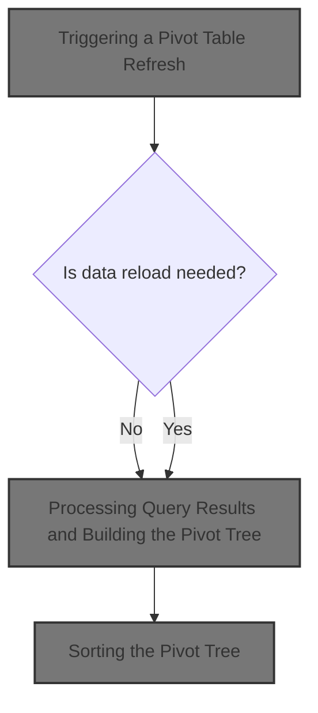

This document describes how the pivot table is refreshed in response to user changes, such as modifying pivots, aggregations, filters, or sort order. The flow supports interactive data exploration by updating the table to reflect the latest configuration. The main steps are building a new query, determining if data needs to be reloaded, updating the table with new results, and sorting the data for display.



# Where is this flow used?

This flow is used multiple times in the codebase as represented in the following diagram:

(Note - these are only some of the entry points of this flow)

```mermaid
graph TD;
      b4c2818110c9becae72a406b219827d5cd1cce3ffa6c181c814638285a7f3e94(ui/…/pivot_table/pivot_table.ts::PivotTable.view) --> 94383b6f3d149369ac3e68652c6b78881fab7cd0cb878c9e5e428dfa297dda6d(ui/…/pivot_table/pivot_table.ts::PivotTable.renderPivotColumnMenu)

b4c2818110c9becae72a406b219827d5cd1cce3ffa6c181c814638285a7f3e94(ui/…/pivot_table/pivot_table.ts::PivotTable.view) --> 33e09df866eda8c1fa72376dea2f27f5cf8aaf824f71ade9d230084d7c516375(ui/…/pivot_table/pivot_table.ts::PivotTable.renderAggregationColumnMenu)

b4c2818110c9becae72a406b219827d5cd1cce3ffa6c181c814638285a7f3e94(ui/…/pivot_table/pivot_table.ts::PivotTable.view) --> 03367d0796206e249841ba3507caf671eed1854aad798359cc2f9d36b910d9e2(ui/…/pivot_table/pivot_table_state.ts::PivotTableState.movePivot)

b4c2818110c9becae72a406b219827d5cd1cce3ffa6c181c814638285a7f3e94(ui/…/pivot_table/pivot_table.ts::PivotTable.view) --> 1900d3ef63d672527729ed5bde0b627f96e4beffdafccec8307b46a4521000fc(ui/…/pivot_table/pivot_table_state.ts::PivotTableState.moveAggregation)

94383b6f3d149369ac3e68652c6b78881fab7cd0cb878c9e5e428dfa297dda6d(ui/…/pivot_table/pivot_table.ts::PivotTable.renderPivotColumnMenu) --> 35d22bc6dec4e7e5495efde010610713c92dd45d11853c843d39d2d313fad9a9(ui/…/pivot_table/pivot_table_state.ts::PivotTableState.addPivot)

94383b6f3d149369ac3e68652c6b78881fab7cd0cb878c9e5e428dfa297dda6d(ui/…/pivot_table/pivot_table.ts::PivotTable.renderPivotColumnMenu) --> de1c1d83d0316e0b523ae167aaf20e2dd75d9e52ce59d939a2fe78759b6c2884(ui/…/pivot_table/pivot_table_state.ts::PivotTableState.removePivot)

35d22bc6dec4e7e5495efde010610713c92dd45d11853c843d39d2d313fad9a9(ui/…/pivot_table/pivot_table_state.ts::PivotTableState.addPivot) --> bc63de45e9f34657637842cc5a890380c2fd4781bae253681f17b9004487227b(ui/…/pivot_table/pivot_table_state.ts::PivotTableState.reload)

de1c1d83d0316e0b523ae167aaf20e2dd75d9e52ce59d939a2fe78759b6c2884(ui/…/pivot_table/pivot_table_state.ts::PivotTableState.removePivot) --> bc63de45e9f34657637842cc5a890380c2fd4781bae253681f17b9004487227b(ui/…/pivot_table/pivot_table_state.ts::PivotTableState.reload)

33e09df866eda8c1fa72376dea2f27f5cf8aaf824f71ade9d230084d7c516375(ui/…/pivot_table/pivot_table.ts::PivotTable.renderAggregationColumnMenu) --> 869b30f09d58038cb5c9719cbf4a9ffa96eee13cb13229c3046183e8d7078794(ui/…/pivot_table/pivot_table_state.ts::PivotTableState.addAggregation)

33e09df866eda8c1fa72376dea2f27f5cf8aaf824f71ade9d230084d7c516375(ui/…/pivot_table/pivot_table.ts::PivotTable.renderAggregationColumnMenu) --> 9071e3a521fb8b4db4b6e92a5ddb65625e0483890d497be11d17e641a5f80b10(ui/…/pivot_table/pivot_table_state.ts::PivotTableState.removeAggregation)

33e09df866eda8c1fa72376dea2f27f5cf8aaf824f71ade9d230084d7c516375(ui/…/pivot_table/pivot_table.ts::PivotTable.renderAggregationColumnMenu) --> 98a63e5cc12e0b7151cd13fc0e96a9f70707f49157f880a305e0607b33b44946(ui/…/pivot_table/pivot_table_state.ts::PivotTableState.replaceAggregation)

869b30f09d58038cb5c9719cbf4a9ffa96eee13cb13229c3046183e8d7078794(ui/…/pivot_table/pivot_table_state.ts::PivotTableState.addAggregation) --> bc63de45e9f34657637842cc5a890380c2fd4781bae253681f17b9004487227b(ui/…/pivot_table/pivot_table_state.ts::PivotTableState.reload)

9071e3a521fb8b4db4b6e92a5ddb65625e0483890d497be11d17e641a5f80b10(ui/…/pivot_table/pivot_table_state.ts::PivotTableState.removeAggregation) --> bc63de45e9f34657637842cc5a890380c2fd4781bae253681f17b9004487227b(ui/…/pivot_table/pivot_table_state.ts::PivotTableState.reload)

98a63e5cc12e0b7151cd13fc0e96a9f70707f49157f880a305e0607b33b44946(ui/…/pivot_table/pivot_table_state.ts::PivotTableState.replaceAggregation) --> bc63de45e9f34657637842cc5a890380c2fd4781bae253681f17b9004487227b(ui/…/pivot_table/pivot_table_state.ts::PivotTableState.reload)

03367d0796206e249841ba3507caf671eed1854aad798359cc2f9d36b910d9e2(ui/…/pivot_table/pivot_table_state.ts::PivotTableState.movePivot) --> bc63de45e9f34657637842cc5a890380c2fd4781bae253681f17b9004487227b(ui/…/pivot_table/pivot_table_state.ts::PivotTableState.reload)

1900d3ef63d672527729ed5bde0b627f96e4beffdafccec8307b46a4521000fc(ui/…/pivot_table/pivot_table_state.ts::PivotTableState.moveAggregation) --> bc63de45e9f34657637842cc5a890380c2fd4781bae253681f17b9004487227b(ui/…/pivot_table/pivot_table_state.ts::PivotTableState.reload)

eb5d254d0b3b6d589105fabfe146f62af2eb2196eb3792f07ec1afb8acd158b3(ui/…/widgets/grid.ts::Grid.view) --> 33390d7e2e27c87d753440c48148346dc285e22e598e12568f6f2d915aed1483(ui/…/widgets/grid.ts::Grid.renderHeaderCell)

33390d7e2e27c87d753440c48148346dc285e22e598e12568f6f2d915aed1483(ui/…/widgets/grid.ts::Grid.renderHeaderCell) --> 5ef8fcde48af4636257fcb985b7bd3591f9a6f37ffdac0bd02276ef8fb4d7676(ui/…/pivot_table/pivot_table.ts::onColumnReorder)

5ef8fcde48af4636257fcb985b7bd3591f9a6f37ffdac0bd02276ef8fb4d7676(ui/…/pivot_table/pivot_table.ts::onColumnReorder) --> 03367d0796206e249841ba3507caf671eed1854aad798359cc2f9d36b910d9e2(ui/…/pivot_table/pivot_table_state.ts::PivotTableState.movePivot)

5ef8fcde48af4636257fcb985b7bd3591f9a6f37ffdac0bd02276ef8fb4d7676(ui/…/pivot_table/pivot_table.ts::onColumnReorder) --> 1900d3ef63d672527729ed5bde0b627f96e4beffdafccec8307b46a4521000fc(ui/…/pivot_table/pivot_table_state.ts::PivotTableState.moveAggregation)

0987f3781ab9f82bb6e721145427f9fa993534ba895cb8f4615251ebd99e436b(ui/…/menus/select_column_menu.ts::SelectColumnMenu.view) --> e0cd3e98e83d8306ef021ee57a8efca2ac959d8f66fa147b6062cae811370401(ui/…/menus/select_column_menu.ts::onColumnSelectedClickHandler)

0987f3781ab9f82bb6e721145427f9fa993534ba895cb8f4615251ebd99e436b(ui/…/menus/select_column_menu.ts::SelectColumnMenu.view) --> 099442ab02174fb54f15410bc09541ee6e3d73e0c9e160874c5a53f5360ceca6(ui/…/pivot_table/pivot_table.ts::columnMenu)

e0cd3e98e83d8306ef021ee57a8efca2ac959d8f66fa147b6062cae811370401(ui/…/menus/select_column_menu.ts::onColumnSelectedClickHandler) --> 5fde9da1cdd1850c36e9fdb8d3547328171c0bbf87cf968a764253f837fcec96(ui/…/pivot_table/pivot_table.ts::onColumnSelected)

5fde9da1cdd1850c36e9fdb8d3547328171c0bbf87cf968a764253f837fcec96(ui/…/pivot_table/pivot_table.ts::onColumnSelected) --> 35d22bc6dec4e7e5495efde010610713c92dd45d11853c843d39d2d313fad9a9(ui/…/pivot_table/pivot_table_state.ts::PivotTableState.addPivot)

099442ab02174fb54f15410bc09541ee6e3d73e0c9e160874c5a53f5360ceca6(ui/…/pivot_table/pivot_table.ts::columnMenu) --> 869b30f09d58038cb5c9719cbf4a9ffa96eee13cb13229c3046183e8d7078794(ui/…/pivot_table/pivot_table_state.ts::PivotTableState.addAggregation)

b157b01dcb1ecc41632e2c3c156b15d67cccc05e9f9b0b22e6d8dbff0d76c72f(ui/…/menus/select_column_menu.ts::SelectColumnMenuImpl.view) --> e0cd3e98e83d8306ef021ee57a8efca2ac959d8f66fa147b6062cae811370401(ui/…/menus/select_column_menu.ts::onColumnSelectedClickHandler)

b157b01dcb1ecc41632e2c3c156b15d67cccc05e9f9b0b22e6d8dbff0d76c72f(ui/…/menus/select_column_menu.ts::SelectColumnMenuImpl.view) --> 099442ab02174fb54f15410bc09541ee6e3d73e0c9e160874c5a53f5360ceca6(ui/…/pivot_table/pivot_table.ts::columnMenu)

5d1972cf8e964465255623d0aee443ac50bd6c1ee75c5238f83664deafe46163(ui/…/pivot_table/pivot_table.ts::onclick) --> 9071e3a521fb8b4db4b6e92a5ddb65625e0483890d497be11d17e641a5f80b10(ui/…/pivot_table/pivot_table_state.ts::PivotTableState.removeAggregation)


classDef mainFlowStyle color:#000000,fill:#7CB9F4
classDef rootsStyle color:#000000,fill:#00FFF4
classDef Style1 color:#000000,fill:#00FFAA
classDef Style2 color:#000000,fill:#FFFF00
classDef Style3 color:#000000,fill:#AA7CB9

%% Swimm:
%% graph TD;
%%       b4c2818110c9becae72a406b219827d5cd1cce3ffa6c181c814638285a7f3e94(<SwmPath>[ui/…/pivot_table/pivot_table.ts](ui/src/components/widgets/sql/pivot_table/pivot_table.ts)</SwmPath>::PivotTable.view) --> 94383b6f3d149369ac3e68652c6b78881fab7cd0cb878c9e5e428dfa297dda6d(<SwmPath>[ui/…/pivot_table/pivot_table.ts](ui/src/components/widgets/sql/pivot_table/pivot_table.ts)</SwmPath>::PivotTable.renderPivotColumnMenu)
%% 
%% b4c2818110c9becae72a406b219827d5cd1cce3ffa6c181c814638285a7f3e94(<SwmPath>[ui/…/pivot_table/pivot_table.ts](ui/src/components/widgets/sql/pivot_table/pivot_table.ts)</SwmPath>::PivotTable.view) --> 33e09df866eda8c1fa72376dea2f27f5cf8aaf824f71ade9d230084d7c516375(<SwmPath>[ui/…/pivot_table/pivot_table.ts](ui/src/components/widgets/sql/pivot_table/pivot_table.ts)</SwmPath>::PivotTable.renderAggregationColumnMenu)
%% 
%% b4c2818110c9becae72a406b219827d5cd1cce3ffa6c181c814638285a7f3e94(<SwmPath>[ui/…/pivot_table/pivot_table.ts](ui/src/components/widgets/sql/pivot_table/pivot_table.ts)</SwmPath>::PivotTable.view) --> 03367d0796206e249841ba3507caf671eed1854aad798359cc2f9d36b910d9e2(<SwmPath>[ui/…/pivot_table/pivot_table_state.ts](ui/src/components/widgets/sql/pivot_table/pivot_table_state.ts)</SwmPath>::PivotTableState.movePivot)
%% 
%% b4c2818110c9becae72a406b219827d5cd1cce3ffa6c181c814638285a7f3e94(<SwmPath>[ui/…/pivot_table/pivot_table.ts](ui/src/components/widgets/sql/pivot_table/pivot_table.ts)</SwmPath>::PivotTable.view) --> 1900d3ef63d672527729ed5bde0b627f96e4beffdafccec8307b46a4521000fc(<SwmPath>[ui/…/pivot_table/pivot_table_state.ts](ui/src/components/widgets/sql/pivot_table/pivot_table_state.ts)</SwmPath>::PivotTableState.moveAggregation)
%% 
%% 94383b6f3d149369ac3e68652c6b78881fab7cd0cb878c9e5e428dfa297dda6d(<SwmPath>[ui/…/pivot_table/pivot_table.ts](ui/src/components/widgets/sql/pivot_table/pivot_table.ts)</SwmPath>::PivotTable.renderPivotColumnMenu) --> 35d22bc6dec4e7e5495efde010610713c92dd45d11853c843d39d2d313fad9a9(<SwmPath>[ui/…/pivot_table/pivot_table_state.ts](ui/src/components/widgets/sql/pivot_table/pivot_table_state.ts)</SwmPath>::PivotTableState.addPivot)
%% 
%% 94383b6f3d149369ac3e68652c6b78881fab7cd0cb878c9e5e428dfa297dda6d(<SwmPath>[ui/…/pivot_table/pivot_table.ts](ui/src/components/widgets/sql/pivot_table/pivot_table.ts)</SwmPath>::PivotTable.renderPivotColumnMenu) --> de1c1d83d0316e0b523ae167aaf20e2dd75d9e52ce59d939a2fe78759b6c2884(<SwmPath>[ui/…/pivot_table/pivot_table_state.ts](ui/src/components/widgets/sql/pivot_table/pivot_table_state.ts)</SwmPath>::PivotTableState.removePivot)
%% 
%% 35d22bc6dec4e7e5495efde010610713c92dd45d11853c843d39d2d313fad9a9(<SwmPath>[ui/…/pivot_table/pivot_table_state.ts](ui/src/components/widgets/sql/pivot_table/pivot_table_state.ts)</SwmPath>::PivotTableState.addPivot) --> bc63de45e9f34657637842cc5a890380c2fd4781bae253681f17b9004487227b(<SwmPath>[ui/…/pivot_table/pivot_table_state.ts](ui/src/components/widgets/sql/pivot_table/pivot_table_state.ts)</SwmPath>::PivotTableState.reload)
%% 
%% de1c1d83d0316e0b523ae167aaf20e2dd75d9e52ce59d939a2fe78759b6c2884(<SwmPath>[ui/…/pivot_table/pivot_table_state.ts](ui/src/components/widgets/sql/pivot_table/pivot_table_state.ts)</SwmPath>::PivotTableState.removePivot) --> bc63de45e9f34657637842cc5a890380c2fd4781bae253681f17b9004487227b(<SwmPath>[ui/…/pivot_table/pivot_table_state.ts](ui/src/components/widgets/sql/pivot_table/pivot_table_state.ts)</SwmPath>::PivotTableState.reload)
%% 
%% 33e09df866eda8c1fa72376dea2f27f5cf8aaf824f71ade9d230084d7c516375(<SwmPath>[ui/…/pivot_table/pivot_table.ts](ui/src/components/widgets/sql/pivot_table/pivot_table.ts)</SwmPath>::PivotTable.renderAggregationColumnMenu) --> 869b30f09d58038cb5c9719cbf4a9ffa96eee13cb13229c3046183e8d7078794(<SwmPath>[ui/…/pivot_table/pivot_table_state.ts](ui/src/components/widgets/sql/pivot_table/pivot_table_state.ts)</SwmPath>::PivotTableState.addAggregation)
%% 
%% 33e09df866eda8c1fa72376dea2f27f5cf8aaf824f71ade9d230084d7c516375(<SwmPath>[ui/…/pivot_table/pivot_table.ts](ui/src/components/widgets/sql/pivot_table/pivot_table.ts)</SwmPath>::PivotTable.renderAggregationColumnMenu) --> 9071e3a521fb8b4db4b6e92a5ddb65625e0483890d497be11d17e641a5f80b10(<SwmPath>[ui/…/pivot_table/pivot_table_state.ts](ui/src/components/widgets/sql/pivot_table/pivot_table_state.ts)</SwmPath>::PivotTableState.removeAggregation)
%% 
%% 33e09df866eda8c1fa72376dea2f27f5cf8aaf824f71ade9d230084d7c516375(<SwmPath>[ui/…/pivot_table/pivot_table.ts](ui/src/components/widgets/sql/pivot_table/pivot_table.ts)</SwmPath>::PivotTable.renderAggregationColumnMenu) --> 98a63e5cc12e0b7151cd13fc0e96a9f70707f49157f880a305e0607b33b44946(<SwmPath>[ui/…/pivot_table/pivot_table_state.ts](ui/src/components/widgets/sql/pivot_table/pivot_table_state.ts)</SwmPath>::PivotTableState.replaceAggregation)
%% 
%% 869b30f09d58038cb5c9719cbf4a9ffa96eee13cb13229c3046183e8d7078794(<SwmPath>[ui/…/pivot_table/pivot_table_state.ts](ui/src/components/widgets/sql/pivot_table/pivot_table_state.ts)</SwmPath>::PivotTableState.addAggregation) --> bc63de45e9f34657637842cc5a890380c2fd4781bae253681f17b9004487227b(<SwmPath>[ui/…/pivot_table/pivot_table_state.ts](ui/src/components/widgets/sql/pivot_table/pivot_table_state.ts)</SwmPath>::PivotTableState.reload)
%% 
%% 9071e3a521fb8b4db4b6e92a5ddb65625e0483890d497be11d17e641a5f80b10(<SwmPath>[ui/…/pivot_table/pivot_table_state.ts](ui/src/components/widgets/sql/pivot_table/pivot_table_state.ts)</SwmPath>::PivotTableState.removeAggregation) --> bc63de45e9f34657637842cc5a890380c2fd4781bae253681f17b9004487227b(<SwmPath>[ui/…/pivot_table/pivot_table_state.ts](ui/src/components/widgets/sql/pivot_table/pivot_table_state.ts)</SwmPath>::PivotTableState.reload)
%% 
%% 98a63e5cc12e0b7151cd13fc0e96a9f70707f49157f880a305e0607b33b44946(<SwmPath>[ui/…/pivot_table/pivot_table_state.ts](ui/src/components/widgets/sql/pivot_table/pivot_table_state.ts)</SwmPath>::PivotTableState.replaceAggregation) --> bc63de45e9f34657637842cc5a890380c2fd4781bae253681f17b9004487227b(<SwmPath>[ui/…/pivot_table/pivot_table_state.ts](ui/src/components/widgets/sql/pivot_table/pivot_table_state.ts)</SwmPath>::PivotTableState.reload)
%% 
%% 03367d0796206e249841ba3507caf671eed1854aad798359cc2f9d36b910d9e2(<SwmPath>[ui/…/pivot_table/pivot_table_state.ts](ui/src/components/widgets/sql/pivot_table/pivot_table_state.ts)</SwmPath>::PivotTableState.movePivot) --> bc63de45e9f34657637842cc5a890380c2fd4781bae253681f17b9004487227b(<SwmPath>[ui/…/pivot_table/pivot_table_state.ts](ui/src/components/widgets/sql/pivot_table/pivot_table_state.ts)</SwmPath>::PivotTableState.reload)
%% 
%% 1900d3ef63d672527729ed5bde0b627f96e4beffdafccec8307b46a4521000fc(<SwmPath>[ui/…/pivot_table/pivot_table_state.ts](ui/src/components/widgets/sql/pivot_table/pivot_table_state.ts)</SwmPath>::PivotTableState.moveAggregation) --> bc63de45e9f34657637842cc5a890380c2fd4781bae253681f17b9004487227b(<SwmPath>[ui/…/pivot_table/pivot_table_state.ts](ui/src/components/widgets/sql/pivot_table/pivot_table_state.ts)</SwmPath>::PivotTableState.reload)
%% 
%% eb5d254d0b3b6d589105fabfe146f62af2eb2196eb3792f07ec1afb8acd158b3(<SwmPath>[ui/…/widgets/grid.ts](ui/src/widgets/grid.ts)</SwmPath>::Grid.view) --> 33390d7e2e27c87d753440c48148346dc285e22e598e12568f6f2d915aed1483(<SwmPath>[ui/…/widgets/grid.ts](ui/src/widgets/grid.ts)</SwmPath>::Grid.renderHeaderCell)
%% 
%% 33390d7e2e27c87d753440c48148346dc285e22e598e12568f6f2d915aed1483(<SwmPath>[ui/…/widgets/grid.ts](ui/src/widgets/grid.ts)</SwmPath>::Grid.renderHeaderCell) --> 5ef8fcde48af4636257fcb985b7bd3591f9a6f37ffdac0bd02276ef8fb4d7676(<SwmPath>[ui/…/pivot_table/pivot_table.ts](ui/src/components/widgets/sql/pivot_table/pivot_table.ts)</SwmPath>::onColumnReorder)
%% 
%% 5ef8fcde48af4636257fcb985b7bd3591f9a6f37ffdac0bd02276ef8fb4d7676(<SwmPath>[ui/…/pivot_table/pivot_table.ts](ui/src/components/widgets/sql/pivot_table/pivot_table.ts)</SwmPath>::onColumnReorder) --> 03367d0796206e249841ba3507caf671eed1854aad798359cc2f9d36b910d9e2(<SwmPath>[ui/…/pivot_table/pivot_table_state.ts](ui/src/components/widgets/sql/pivot_table/pivot_table_state.ts)</SwmPath>::PivotTableState.movePivot)
%% 
%% 5ef8fcde48af4636257fcb985b7bd3591f9a6f37ffdac0bd02276ef8fb4d7676(<SwmPath>[ui/…/pivot_table/pivot_table.ts](ui/src/components/widgets/sql/pivot_table/pivot_table.ts)</SwmPath>::onColumnReorder) --> 1900d3ef63d672527729ed5bde0b627f96e4beffdafccec8307b46a4521000fc(<SwmPath>[ui/…/pivot_table/pivot_table_state.ts](ui/src/components/widgets/sql/pivot_table/pivot_table_state.ts)</SwmPath>::PivotTableState.moveAggregation)
%% 
%% 0987f3781ab9f82bb6e721145427f9fa993534ba895cb8f4615251ebd99e436b(<SwmPath>[ui/…/menus/select_column_menu.ts](ui/src/components/widgets/sql/table/menus/select_column_menu.ts)</SwmPath>::SelectColumnMenu.view) --> e0cd3e98e83d8306ef021ee57a8efca2ac959d8f66fa147b6062cae811370401(<SwmPath>[ui/…/menus/select_column_menu.ts](ui/src/components/widgets/sql/table/menus/select_column_menu.ts)</SwmPath>::onColumnSelectedClickHandler)
%% 
%% 0987f3781ab9f82bb6e721145427f9fa993534ba895cb8f4615251ebd99e436b(<SwmPath>[ui/…/menus/select_column_menu.ts](ui/src/components/widgets/sql/table/menus/select_column_menu.ts)</SwmPath>::SelectColumnMenu.view) --> 099442ab02174fb54f15410bc09541ee6e3d73e0c9e160874c5a53f5360ceca6(<SwmPath>[ui/…/pivot_table/pivot_table.ts](ui/src/components/widgets/sql/pivot_table/pivot_table.ts)</SwmPath>::columnMenu)
%% 
%% e0cd3e98e83d8306ef021ee57a8efca2ac959d8f66fa147b6062cae811370401(<SwmPath>[ui/…/menus/select_column_menu.ts](ui/src/components/widgets/sql/table/menus/select_column_menu.ts)</SwmPath>::onColumnSelectedClickHandler) --> 5fde9da1cdd1850c36e9fdb8d3547328171c0bbf87cf968a764253f837fcec96(<SwmPath>[ui/…/pivot_table/pivot_table.ts](ui/src/components/widgets/sql/pivot_table/pivot_table.ts)</SwmPath>::onColumnSelected)
%% 
%% 5fde9da1cdd1850c36e9fdb8d3547328171c0bbf87cf968a764253f837fcec96(<SwmPath>[ui/…/pivot_table/pivot_table.ts](ui/src/components/widgets/sql/pivot_table/pivot_table.ts)</SwmPath>::onColumnSelected) --> 35d22bc6dec4e7e5495efde010610713c92dd45d11853c843d39d2d313fad9a9(<SwmPath>[ui/…/pivot_table/pivot_table_state.ts](ui/src/components/widgets/sql/pivot_table/pivot_table_state.ts)</SwmPath>::PivotTableState.addPivot)
%% 
%% 099442ab02174fb54f15410bc09541ee6e3d73e0c9e160874c5a53f5360ceca6(<SwmPath>[ui/…/pivot_table/pivot_table.ts](ui/src/components/widgets/sql/pivot_table/pivot_table.ts)</SwmPath>::columnMenu) --> 869b30f09d58038cb5c9719cbf4a9ffa96eee13cb13229c3046183e8d7078794(<SwmPath>[ui/…/pivot_table/pivot_table_state.ts](ui/src/components/widgets/sql/pivot_table/pivot_table_state.ts)</SwmPath>::PivotTableState.addAggregation)
%% 
%% b157b01dcb1ecc41632e2c3c156b15d67cccc05e9f9b0b22e6d8dbff0d76c72f(<SwmPath>[ui/…/menus/select_column_menu.ts](ui/src/components/widgets/sql/table/menus/select_column_menu.ts)</SwmPath>::SelectColumnMenuImpl.view) --> e0cd3e98e83d8306ef021ee57a8efca2ac959d8f66fa147b6062cae811370401(<SwmPath>[ui/…/menus/select_column_menu.ts](ui/src/components/widgets/sql/table/menus/select_column_menu.ts)</SwmPath>::onColumnSelectedClickHandler)
%% 
%% b157b01dcb1ecc41632e2c3c156b15d67cccc05e9f9b0b22e6d8dbff0d76c72f(<SwmPath>[ui/…/menus/select_column_menu.ts](ui/src/components/widgets/sql/table/menus/select_column_menu.ts)</SwmPath>::SelectColumnMenuImpl.view) --> 099442ab02174fb54f15410bc09541ee6e3d73e0c9e160874c5a53f5360ceca6(<SwmPath>[ui/…/pivot_table/pivot_table.ts](ui/src/components/widgets/sql/pivot_table/pivot_table.ts)</SwmPath>::columnMenu)
%% 
%% 5d1972cf8e964465255623d0aee443ac50bd6c1ee75c5238f83664deafe46163(<SwmPath>[ui/…/pivot_table/pivot_table.ts](ui/src/components/widgets/sql/pivot_table/pivot_table.ts)</SwmPath>::onclick) --> 9071e3a521fb8b4db4b6e92a5ddb65625e0483890d497be11d17e641a5f80b10(<SwmPath>[ui/…/pivot_table/pivot_table_state.ts](ui/src/components/widgets/sql/pivot_table/pivot_table_state.ts)</SwmPath>::PivotTableState.removeAggregation)
%% 
%% 
%% classDef mainFlowStyle color:#000000,fill:#7CB9F4
%% classDef rootsStyle color:#000000,fill:#00FFF4
%% classDef Style1 color:#000000,fill:#00FFAA
%% classDef Style2 color:#000000,fill:#FFFF00
%% classDef Style3 color:#000000,fill:#AA7CB9
```

# Triggering a Pivot Table Refresh

<SwmSnippet path="/ui/src/components/widgets/sql/pivot_table/pivot_table_state.ts" line="231">

---

In <SwmToken path="ui/src/components/widgets/sql/pivot_table/pivot_table_state.ts" pos="231:5:5" line-data="  private async reload() {">`reload`</SwmToken>, we kick off the refresh by saving the previous tree state and scheduling the reload logic. We immediately call <SwmToken path="ui/src/components/widgets/sql/pivot_table/pivot_table_state.ts" pos="235:17:17" line-data="      const {query, columnIds, aliasToIds} = this.buildQuery();">`buildQuery`</SwmToken> to get the SQL query and metadata, which we use to check if the columns and filters have changed. This check determines if we need to reload data or can reuse what's already loaded.

```typescript
  private async reload() {
    this.oldTree = this.data.result?.tree ?? this.oldTree;

    this.limiter.schedule(async () => {
      const {query, columnIds, aliasToIds} = this.buildQuery();

      // Check if we already have all of the columns (and the filters are the same): in that case
      // we don't need to reload.
      // Note that comparing the queries directly is too sensitive for us: e.g. we don't care about
      // the column ordering, as well as having extra aggregations.
      const needsReload =
        this.data.error !== undefined ||
        !areFiltersEqual(this.filters.get(), this.data.filters) ||
        ![...columnIds].every((id) => this.data.columnIds.has(id));
```

---

</SwmSnippet>

## Building SQL Query and Metadata

```mermaid
%%{init: {"flowchart": {"defaultRenderer": "elk"}} }%%
flowchart TD
  node1["Start building pivot table query"]
  click node1 openCode "ui/src/components/widgets/sql/pivot_table/pivot_table_state.ts:282:287"
  node1 --> loop1
  subgraph loop1["For each selected column"]
    loop1a["Collect column alias and ID"]
    click loop1a openCode "ui/src/components/widgets/sql/pivot_table/pivot_table_state.ts:291:295"
    loop1b["Add column to groupings"]
    click loop1b openCode "ui/src/components/widgets/sql/pivot_table/pivot_table_state.ts:296:297"
  end
  loop1 --> loop2
  subgraph loop2["For each aggregation"]
    loop2a["Expand aggregation"]
    click loop2a openCode "ui/src/components/widgets/sql/pivot_table/pivot_table_state.ts:301:302"
    loop2b["Map aggregation alias and ID"]
    click loop2b openCode "ui/src/components/widgets/sql/pivot_table/pivot_table_state.ts:303:308"
  end
  loop2 --> node2["Build SQL query with columns, aggregations, table name, and filters"]
  click node2 openCode "ui/src/components/widgets/sql/pivot_table/pivot_table_state.ts:310:315"
  node2 --> node3{"Are there imports required?"}
  click node3 openCode "ui/src/components/widgets/sql/pivot_table/pivot_table_state.ts:316:317"
  node3 -->|"Yes"| node4["Include import statements"]
  click node4 openCode "ui/src/components/widgets/sql/pivot_table/pivot_table_state.ts:317:318"
  node3 -->|"No"| node5["Skip imports"]
  click node5 openCode "ui/src/components/widgets/sql/pivot_table/pivot_table_state.ts:318:318"
  node4 --> node6["Return assembled query and mappings"]
  click node6 openCode "ui/src/components/widgets/sql/pivot_table/pivot_table_state.ts:319:324"
  node5 --> node6

classDef HeadingStyle fill:#777777,stroke:#333,stroke-width:2px;

%% Swimm:
%% %%{init: {"flowchart": {"defaultRenderer": "elk"}} }%%
%% flowchart TD
%%   node1["Start building pivot table query"]
%%   click node1 openCode "<SwmPath>[ui/…/pivot_table/pivot_table_state.ts](ui/src/components/widgets/sql/pivot_table/pivot_table_state.ts)</SwmPath>:282:287"
%%   node1 --> loop1
%%   subgraph loop1["For each selected column"]
%%     loop1a["Collect column alias and ID"]
%%     click loop1a openCode "<SwmPath>[ui/…/pivot_table/pivot_table_state.ts](ui/src/components/widgets/sql/pivot_table/pivot_table_state.ts)</SwmPath>:291:295"
%%     loop1b["Add column to groupings"]
%%     click loop1b openCode "<SwmPath>[ui/…/pivot_table/pivot_table_state.ts](ui/src/components/widgets/sql/pivot_table/pivot_table_state.ts)</SwmPath>:296:297"
%%   end
%%   loop1 --> loop2
%%   subgraph loop2["For each aggregation"]
%%     loop2a["Expand aggregation"]
%%     click loop2a openCode "<SwmPath>[ui/…/pivot_table/pivot_table_state.ts](ui/src/components/widgets/sql/pivot_table/pivot_table_state.ts)</SwmPath>:301:302"
%%     loop2b["Map aggregation alias and ID"]
%%     click loop2b openCode "<SwmPath>[ui/…/pivot_table/pivot_table_state.ts](ui/src/components/widgets/sql/pivot_table/pivot_table_state.ts)</SwmPath>:303:308"
%%   end
%%   loop2 --> node2["Build SQL query with columns, aggregations, table name, and filters"]
%%   click node2 openCode "<SwmPath>[ui/…/pivot_table/pivot_table_state.ts](ui/src/components/widgets/sql/pivot_table/pivot_table_state.ts)</SwmPath>:310:315"
%%   node2 --> node3{"Are there imports required?"}
%%   click node3 openCode "<SwmPath>[ui/…/pivot_table/pivot_table_state.ts](ui/src/components/widgets/sql/pivot_table/pivot_table_state.ts)</SwmPath>:316:317"
%%   node3 -->|"Yes"| node4["Include import statements"]
%%   click node4 openCode "<SwmPath>[ui/…/pivot_table/pivot_table_state.ts](ui/src/components/widgets/sql/pivot_table/pivot_table_state.ts)</SwmPath>:317:318"
%%   node3 -->|"No"| node5["Skip imports"]
%%   click node5 openCode "<SwmPath>[ui/…/pivot_table/pivot_table_state.ts](ui/src/components/widgets/sql/pivot_table/pivot_table_state.ts)</SwmPath>:318:318"
%%   node4 --> node6["Return assembled query and mappings"]
%%   click node6 openCode "<SwmPath>[ui/…/pivot_table/pivot_table_state.ts](ui/src/components/widgets/sql/pivot_table/pivot_table_state.ts)</SwmPath>:319:324"
%%   node5 --> node6
%% 
%% classDef HeadingStyle fill:#777777,stroke:#333,stroke-width:2px;
```



<SwmSnippet path="/ui/src/components/widgets/sql/pivot_table/pivot_table_state.ts" line="282">

---

In <SwmToken path="ui/src/components/widgets/sql/pivot_table/pivot_table_state.ts" pos="282:3:3" line-data="  private buildQuery(): {">`buildQuery`</SwmToken>, we set up the collections for columns, IDs, and aliases. For each pivot, we use helpers to generate SQL aliases and IDs, map them, and build the <SwmToken path="ui/src/components/widgets/sql/pivot_table/pivot_table_state.ts" pos="290:3:3" line-data="    const groupBy: SqlColumn[] = [];">`groupBy`</SwmToken> array. This sets up the structure for the SQL query and metadata needed for later steps.

```typescript
  private buildQuery(): {
    query: string;
    columnIds: Set<string>;
    aliasToIds: Map<string, string>;
  } {
    const columns: {[key: string]: SqlColumn} = {};
    const columnIds = new Set<string>();
    const aliasToIds = new Map<string, string>();
    const groupBy: SqlColumn[] = [];
    for (const pivot of this.pivots) {
      const alias = pivotSqliteAlias(pivot);
      columns[alias] = pivot.column;
      columnIds.add(pivotId(pivot));
      aliasToIds.set(alias, pivotId(pivot));
      groupBy.push(pivot.column);
    }
```

---

</SwmSnippet>

<SwmSnippet path="/ui/src/components/widgets/sql/pivot_table/pivot_table_state.ts" line="299">

---

Here, we expand and map aggregations to SQL expressions so the DB can handle them directly.

```typescript
    // Expand non-assocative aggregations (average) into basic associative aggregations which
    // can be pushed down to SQL.
    for (const agg of expandAggregations(this.aggregations)) {
      const alias = aggregationSqliteAlias(agg);
      columns[alias] = new SqlExpression(
        (cols) => `${agg.op}(${cols[0]})`,
        [agg.column.column],
      );
      columnIds.add(aggregationId(agg));
      aliasToIds.set(alias, aggregationId(agg));
    }
```

---

</SwmSnippet>

<SwmSnippet path="/ui/src/components/widgets/sql/pivot_table/pivot_table_state.ts" line="310">

---

Finally in <SwmToken path="ui/src/components/widgets/sql/pivot_table/pivot_table_state.ts" pos="235:17:17" line-data="      const {query, columnIds, aliasToIds} = this.buildQuery();">`buildQuery`</SwmToken>, we build the SQL query string, prepend any needed PERFETTO MODULE imports, and return the query along with the column and alias mappings. This output is used for executing the query and mapping results back to the UI.

```typescript
    const query = buildSqlQuery({
      table: this.args.table.name,
      columns,
      groupBy,
      filters: this.filters.get(),
    });
    const importStatement = (this.table.imports ?? [])
      .map((i) => `INCLUDE PERFETTO MODULE ${i};\n`)
      .join('');
    return {
      query: `${importStatement}${query}`,
      columnIds,
      aliasToIds,
    };
  }
```

---

</SwmSnippet>

## Processing Query Results and Building the Pivot Tree

```mermaid
%%{init: {"flowchart": {"defaultRenderer": "elk"}} }%%
flowchart TD
    node1["Start reload process"]
    click node1 openCode "ui/src/components/widgets/sql/pivot_table/pivot_table_state.ts:245:246"
    node1 --> node11["Update filters and query"]
    click node11 openCode "ui/src/components/widgets/sql/pivot_table/pivot_table_state.ts:248:252"
    node11 --> node2{"needsReload?"}
    click node2 openCode "ui/src/components/widgets/sql/pivot_table/pivot_table_state.ts:246:247"
    node2 -->|"No reload needed"| node3["Reuse existing rows"]
    click node3 openCode "ui/src/components/widgets/sql/pivot_table/pivot_table_state.ts:246:247"
    node2 -->|"Reload needed"| node4["Fetch new data"]
    click node4 openCode "ui/src/components/widgets/sql/pivot_table/pivot_table_state.ts:255:257"
    node4 --> node5{"Was there an error?"}
    click node5 openCode "ui/src/components/widgets/sql/pivot_table/pivot_table_state.ts:258:259"
    node5 -->|"No error"| node6["Build pivot tree from rows"]
    click node6 openCode "ui/src/components/widgets/sql/pivot_table/pivot_table_state.ts:261:264"
    node6 --> node7["Preserve expanded/collapsed state"]
    click node7 openCode "ui/src/components/widgets/sql/pivot_table/pivot_table_state.ts:267:268"
    node7 --> node8["Sort tree by user preference"]
    click node8 openCode "ui/src/components/widgets/sql/pivot_table/pivot_table_state.ts:270:270"
    node8 --> node9["Update table with new data"]
    click node9 openCode "ui/src/components/widgets/sql/pivot_table/pivot_table_state.ts:271:274"
    node5 -->|"Error"| node10["Display error to user"]
    click node10 openCode "ui/src/components/widgets/sql/pivot_table/pivot_table_state.ts:256:257"

classDef HeadingStyle fill:#777777,stroke:#333,stroke-width:2px;

%% Swimm:
%% %%{init: {"flowchart": {"defaultRenderer": "elk"}} }%%
%% flowchart TD
%%     node1["Start reload process"]
%%     click node1 openCode "<SwmPath>[ui/…/pivot_table/pivot_table_state.ts](ui/src/components/widgets/sql/pivot_table/pivot_table_state.ts)</SwmPath>:245:246"
%%     node1 --> node11["Update filters and query"]
%%     click node11 openCode "<SwmPath>[ui/…/pivot_table/pivot_table_state.ts](ui/src/components/widgets/sql/pivot_table/pivot_table_state.ts)</SwmPath>:248:252"
%%     node11 --> node2{"<SwmToken path="ui/src/components/widgets/sql/pivot_table/pivot_table_state.ts" pos="241:3:3" line-data="      const needsReload =">`needsReload`</SwmToken>?"}
%%     click node2 openCode "<SwmPath>[ui/…/pivot_table/pivot_table_state.ts](ui/src/components/widgets/sql/pivot_table/pivot_table_state.ts)</SwmPath>:246:247"
%%     node2 -->|"No reload needed"| node3["Reuse existing rows"]
%%     click node3 openCode "<SwmPath>[ui/…/pivot_table/pivot_table_state.ts](ui/src/components/widgets/sql/pivot_table/pivot_table_state.ts)</SwmPath>:246:247"
%%     node2 -->|"Reload needed"| node4["Fetch new data"]
%%     click node4 openCode "<SwmPath>[ui/…/pivot_table/pivot_table_state.ts](ui/src/components/widgets/sql/pivot_table/pivot_table_state.ts)</SwmPath>:255:257"
%%     node4 --> node5{"Was there an error?"}
%%     click node5 openCode "<SwmPath>[ui/…/pivot_table/pivot_table_state.ts](ui/src/components/widgets/sql/pivot_table/pivot_table_state.ts)</SwmPath>:258:259"
%%     node5 -->|"No error"| node6["Build pivot tree from rows"]
%%     click node6 openCode "<SwmPath>[ui/…/pivot_table/pivot_table_state.ts](ui/src/components/widgets/sql/pivot_table/pivot_table_state.ts)</SwmPath>:261:264"
%%     node6 --> node7["Preserve expanded/collapsed state"]
%%     click node7 openCode "<SwmPath>[ui/…/pivot_table/pivot_table_state.ts](ui/src/components/widgets/sql/pivot_table/pivot_table_state.ts)</SwmPath>:267:268"
%%     node7 --> node8["Sort tree by user preference"]
%%     click node8 openCode "<SwmPath>[ui/…/pivot_table/pivot_table_state.ts](ui/src/components/widgets/sql/pivot_table/pivot_table_state.ts)</SwmPath>:270:270"
%%     node8 --> node9["Update table with new data"]
%%     click node9 openCode "<SwmPath>[ui/…/pivot_table/pivot_table_state.ts](ui/src/components/widgets/sql/pivot_table/pivot_table_state.ts)</SwmPath>:271:274"
%%     node5 -->|"Error"| node10["Display error to user"]
%%     click node10 openCode "<SwmPath>[ui/…/pivot_table/pivot_table_state.ts](ui/src/components/widgets/sql/pivot_table/pivot_table_state.ts)</SwmPath>:256:257"
%% 
%% classDef HeadingStyle fill:#777777,stroke:#333,stroke-width:2px;
```



<SwmSnippet path="/ui/src/components/widgets/sql/pivot_table/pivot_table_state.ts" line="245">

---

Back in <SwmToken path="ui/src/components/widgets/sql/pivot_table/pivot_table_state.ts" pos="245:15:15" line-data="      // If we don&#39;t need to reload, we can keep the old rows.">`reload`</SwmToken>, after getting the query and metadata from <SwmToken path="ui/src/components/widgets/sql/pivot_table/pivot_table_state.ts" pos="235:17:17" line-data="      const {query, columnIds, aliasToIds} = this.buildQuery();">`buildQuery`</SwmToken>, we update the data and fetch new rows if needed. If there's no error, we build the pivot tree from the rows, copy the expanded state from the previous tree, and sort it. Calling <SwmToken path="ui/src/components/widgets/sql/pivot_table/pivot_table_state.ts" pos="261:7:9" line-data="        const tree = PivotTreeNode.buildTree(rows, {">`PivotTreeNode.buildTree`</SwmToken> here lets us structure the raw rows into a tree for the UI.

```typescript
      // If we don't need to reload, we can keep the old rows.
      let rows = needsReload ? undefined : this.data.result?.rows;

      this.data = {
        columnIds: new Set(aliasToIds.values()),
        filters: [...this.filters.get()],
        query,
      };
      // If we need to reload, fetch the data from the trace processor.
      if (rows === undefined) {
        const queryResult = await this.loadData(query, aliasToIds);
        this.data.error = queryResult.error;
        rows = queryResult.rows;
      }
      if (this.data.error === undefined) {
        // Build the pivot tree from the rows.
        const tree = PivotTreeNode.buildTree(rows, {
          pivots: this.getPivots(),
          aggregations: this.getAggregations(),
        });

        // If we have an old tree, copy the expanded state from it.
        tree.copyExpandedState(this.oldTree);
        this.oldTree = undefined;

        tree.sort(this.orderBy);
        this.data.result = {
          rows,
          tree,
        };
      }
    });
  }
```

---

</SwmSnippet>

# Sorting the Pivot Tree

```mermaid
%%{init: {"flowchart": {"defaultRenderer": "elk"}} }%%
flowchart TD
  node1{"Is sort order empty?"}
  click node1 openCode "ui/src/components/widgets/sql/pivot_table/pivot_tree_node.ts:204:205"
  node1 -->|"Yes"| node2["Skip sorting"]
  click node2 openCode "ui/src/components/widgets/sql/pivot_table/pivot_tree_node.ts:204:205"
  node1 -->|"No"| node3["Recursively sort all child nodes"]
  click node3 openCode "ui/src/components/widgets/sql/pivot_table/pivot_tree_node.ts:206:208"
  
  subgraph loop1["For each child node"]
    node3 --> node4["Sort child node"]
    click node4 openCode "ui/src/components/widgets/sql/pivot_table/pivot_tree_node.ts:207:207"
  end
  node3 --> node5["Sort current node's children according to order"]
  click node5 openCode "ui/src/components/widgets/sql/pivot_table/pivot_tree_node.ts:209:211"
  node5 --> node6["Update children map with sorted order"]
  click node6 openCode "ui/src/components/widgets/sql/pivot_table/pivot_tree_node.ts:212:215"
  
  subgraph loop2["For each sorted child"]
    node6 --> node7["Insert child into children map"]
    click node7 openCode "ui/src/components/widgets/sql/pivot_table/pivot_tree_node.ts:213:214"
  end
classDef HeadingStyle fill:#777777,stroke:#333,stroke-width:2px;

%% Swimm:
%% %%{init: {"flowchart": {"defaultRenderer": "elk"}} }%%
%% flowchart TD
%%   node1{"Is sort order empty?"}
%%   click node1 openCode "<SwmPath>[ui/…/pivot_table/pivot_tree_node.ts](ui/src/components/widgets/sql/pivot_table/pivot_tree_node.ts)</SwmPath>:204:205"
%%   node1 -->|"Yes"| node2["Skip sorting"]
%%   click node2 openCode "<SwmPath>[ui/…/pivot_table/pivot_tree_node.ts](ui/src/components/widgets/sql/pivot_table/pivot_tree_node.ts)</SwmPath>:204:205"
%%   node1 -->|"No"| node3["Recursively sort all child nodes"]
%%   click node3 openCode "<SwmPath>[ui/…/pivot_table/pivot_tree_node.ts](ui/src/components/widgets/sql/pivot_table/pivot_tree_node.ts)</SwmPath>:206:208"
%%   
%%   subgraph loop1["For each child node"]
%%     node3 --> node4["Sort child node"]
%%     click node4 openCode "<SwmPath>[ui/…/pivot_table/pivot_tree_node.ts](ui/src/components/widgets/sql/pivot_table/pivot_tree_node.ts)</SwmPath>:207:207"
%%   end
%%   node3 --> node5["Sort current node's children according to order"]
%%   click node5 openCode "<SwmPath>[ui/…/pivot_table/pivot_tree_node.ts](ui/src/components/widgets/sql/pivot_table/pivot_tree_node.ts)</SwmPath>:209:211"
%%   node5 --> node6["Update children map with sorted order"]
%%   click node6 openCode "<SwmPath>[ui/…/pivot_table/pivot_tree_node.ts](ui/src/components/widgets/sql/pivot_table/pivot_tree_node.ts)</SwmPath>:212:215"
%%   
%%   subgraph loop2["For each sorted child"]
%%     node6 --> node7["Insert child into children map"]
%%     click node7 openCode "<SwmPath>[ui/…/pivot_table/pivot_tree_node.ts](ui/src/components/widgets/sql/pivot_table/pivot_tree_node.ts)</SwmPath>:213:214"
%%   end
%% classDef HeadingStyle fill:#777777,stroke:#333,stroke-width:2px;
```



<SwmSnippet path="/ui/src/components/widgets/sql/pivot_table/pivot_tree_node.ts" line="203">

---

In <SwmToken path="ui/src/components/widgets/sql/pivot_table/pivot_tree_node.ts" pos="203:1:1" line-data="  sort(order: SortOrder) {">`sort`</SwmToken>, we recursively sort all child nodes if a sort order is provided. This keeps the entire tree ordered as specified.

```typescript
  sort(order: SortOrder) {
    if (order.length === 0) return;

    for (const child of this.children.values()) {
      child.sort(order);
    }
```

---

</SwmSnippet>

<SwmSnippet path="/ui/src/components/widgets/sql/pivot_table/pivot_tree_node.ts" line="209">

---

Here we sort the children using <SwmToken path="ui/src/components/widgets/sql/pivot_table/pivot_tree_node.ts" pos="210:1:3" line-data="      PivotTreeNode.compare(lhs, rhs, order),">`PivotTreeNode.compare`</SwmToken>, which applies the sort criteria to each node pair. This step is needed to order the tree as specified by the user.

```typescript
    const sorted = [...this.children.values()].sort((lhs, rhs) =>
      PivotTreeNode.compare(lhs, rhs, order),
    );
```

---

</SwmSnippet>

<SwmSnippet path="/ui/src/components/widgets/sql/pivot_table/pivot_tree_node.ts" line="288">

---

<SwmToken path="ui/src/components/widgets/sql/pivot_table/pivot_tree_node.ts" pos="288:5:5" line-data="  private static compare(">`compare`</SwmToken> checks that both nodes are siblings, then walks through the sort order to compare aggregations or pivots as needed. It uses a helper to handle nulls and returns as soon as a difference is found.

```typescript
  private static compare(
    lhs: PivotTreeNode,
    rhs: PivotTreeNode,
    order: SortOrder,
  ): number {
    // Note: resolving items in `order` requires a lookup in the state. We can consider
    // optimising this and performing the lookup in `sort` instead.

    // We should only compare siblings.
    assertTrue(
      lhs.config === rhs.config &&
        lhs.depth === rhs.depth &&
        lhs.parent === rhs.parent,
    );

    const compareSqlValues = (lhs: SqlValue, rhs: SqlValue) => {
      if (lhs === rhs) return 0;
      // Nulls can't be compared, but should be considered the smallest value.
      if (lhs === null) return -1;
      if (rhs === null) return 1;
      return lhs < rhs ? -1 : 1;
    };
    for (const {type, id, direction} of order) {
      if (type === 'aggregation') {
        const index = lhs.config.aggregations.findIndex(
          (a) => aggregationId(a) === id,
        );
        // Aggregation with this index should always exist.
        // If this is not the case, we probably failed to remove sorting after
        // hiding a column.
        assertTrue(index !== -1);
        const cmp = compareSqlValues(
          lhs.getAggregationValue(index),
          rhs.getAggregationValue(index),
        );
        if (cmp !== 0) return direction === 'ASC' ? cmp : -cmp;
      } else {
        const index = lhs.config.pivots.findIndex((p) => pivotId(p) === id);
        // Pivot with this index should always exist.
        // If this is not the case, we probably failed to remove sorting after
        // hiding a column.
        assertTrue(index !== -1);
        // For pivot sorting, we only compare the pivot values at the given depth.
        if (index + 1 === lhs.depth) {
          const cmp = compareSqlValues(
            assertDefined(lhs.pivotValue),
            assertDefined(rhs.pivotValue),
          );
          if (cmp !== 0) return direction === 'ASC' ? cmp : -cmp;
        }
      }
    }
```

---

</SwmSnippet>

<SwmSnippet path="/ui/src/components/widgets/sql/pivot_table/pivot_tree_node.ts" line="212">

---

After sorting with <SwmToken path="ui/src/components/widgets/sql/pivot_table/pivot_tree_node.ts" pos="210:3:3" line-data="      PivotTreeNode.compare(lhs, rhs, order),">`compare`</SwmToken>, we clear and repopulate the children map to match the new order. This keeps the tree structure consistent with the sorted results.

```typescript
    this.children.clear();
    for (const child of sorted) {
      this.children.set(assertDefined(child.pivotValue), child);
    }
```

---

</SwmSnippet>

&nbsp;

*This is an auto-generated document by Swimm 🌊 and has not yet been verified by a human*

<SwmMeta version="3.0.0" repo-id="Z2l0aHViJTNBJTNBY3BsdXNwbHVzLXBlcmZldHRvJTNBJTNBcmljYXJkb2xvcGV6Zw==" repo-name="cplusplus-perfetto"><sup>Powered by [Swimm](https://app.swimm.io/)</sup></SwmMeta>
