This document describes how a new memory mapping for a user process is registered and organized. The system ensures that the mapping does not conflict with existing mappings and links it to relevant JIT caches, enabling accurate future analysis of memory usage and code execution.

# Where is this flow used?

This flow is used multiple times in the codebase as represented in the following diagram:

(Note - these are only some of the entry points of this flow)

```mermaid
graph TD;
      95e2761ffc98a274bd58290384d0f7b0805c8d6b7df819fb760561059a4ffb3a(src/…/instruments/row_parser.cc::Parse) --> 682a755f65970f927a462496e9df8bea8ab3b96aae57ef3a10001c96701c5575(src/…/common/mapping_tracker.cc::MappingTracker::FindUserMappingForAddress)

95e2761ffc98a274bd58290384d0f7b0805c8d6b7df819fb760561059a4ffb3a(src/…/instruments/row_parser.cc::Parse) --> cf813bed2945ed903bcb98572cbee80bd18c0b7db3fdca81a98de43e12d30435(src/…/common/mapping_tracker.cc::MappingTracker::CreateUserMemoryMapping)

682a755f65970f927a462496e9df8bea8ab3b96aae57ef3a10001c96701c5575(src/…/common/mapping_tracker.cc::MappingTracker::FindUserMappingForAddress) --> 5a4826d1d7eb0737517617772d8a0bd0f1c87a128442df344d1d5b0c56bc94ec(src/…/common/jit_cache.cc::JitCache::CreateMapping)

5a4826d1d7eb0737517617772d8a0bd0f1c87a128442df344d1d5b0c56bc94ec(src/…/common/jit_cache.cc::JitCache::CreateMapping) --> cf813bed2945ed903bcb98572cbee80bd18c0b7db3fdca81a98de43e12d30435(src/…/common/mapping_tracker.cc::MappingTracker::CreateUserMemoryMapping)

43853dca8e64e88a928073779752751e7ea06159a4da2924c02e858b302b8020(src/…/proto/stack_profile_sequence_state.cc::StackProfileSequenceState::FindOrInsertMappingImpl) --> cf813bed2945ed903bcb98572cbee80bd18c0b7db3fdca81a98de43e12d30435(src/…/common/mapping_tracker.cc::MappingTracker::CreateUserMemoryMapping)

c54627be74e5779b21d7772c88742047d413cea0159385aaaa189f956d3e69c5(src/…/perf/spe_record_parser.cc::Parse) --> 682a755f65970f927a462496e9df8bea8ab3b96aae57ef3a10001c96701c5575(src/…/common/mapping_tracker.cc::MappingTracker::FindUserMappingForAddress)

ef086437111e545c958e4f38efa4424138f35a7b64683d003dd4845c582f93ab(src/…/perf/record_parser.cc::InternCallchain) --> 682a755f65970f927a462496e9df8bea8ab3b96aae57ef3a10001c96701c5575(src/…/common/mapping_tracker.cc::MappingTracker::FindUserMappingForAddress)

190e5a3a818441a205dcdc0e621da0196c470f04a56b8de8bfb0287f2fc580ac(src/…/proto/v8_tracker.cc::V8Tracker::FindEmbeddedBlobMapping) --> 682a755f65970f927a462496e9df8bea8ab3b96aae57ef3a10001c96701c5575(src/…/common/mapping_tracker.cc::MappingTracker::FindUserMappingForAddress)


classDef mainFlowStyle color:#000000,fill:#7CB9F4
classDef rootsStyle color:#000000,fill:#00FFF4
classDef Style1 color:#000000,fill:#00FFAA
classDef Style2 color:#000000,fill:#FFFF00
classDef Style3 color:#000000,fill:#AA7CB9

%% Swimm:
%% graph TD;
%%       95e2761ffc98a274bd58290384d0f7b0805c8d6b7df819fb760561059a4ffb3a(<SwmPath>[src/…/instruments/row_parser.cc](src/trace_processor/importers/instruments/row_parser.cc)</SwmPath>::Parse) --> 682a755f65970f927a462496e9df8bea8ab3b96aae57ef3a10001c96701c5575(<SwmPath>[src/…/common/mapping_tracker.cc](src/trace_processor/importers/common/mapping_tracker.cc)</SwmPath>::<SwmToken path="src/trace_processor/importers/common/mapping_tracker.cc" pos="87:3:3" line-data="UserMemoryMapping&amp; MappingTracker::CreateUserMemoryMapping(">`MappingTracker`</SwmToken>::<SwmToken path="src/trace_processor/importers/common/mapping_tracker.cc" pos="118:5:5" line-data="UserMemoryMapping* MappingTracker::FindUserMappingForAddress(">`FindUserMappingForAddress`</SwmToken>)
%% 
%% 95e2761ffc98a274bd58290384d0f7b0805c8d6b7df819fb760561059a4ffb3a(<SwmPath>[src/…/instruments/row_parser.cc](src/trace_processor/importers/instruments/row_parser.cc)</SwmPath>::Parse) --> cf813bed2945ed903bcb98572cbee80bd18c0b7db3fdca81a98de43e12d30435(<SwmPath>[src/…/common/mapping_tracker.cc](src/trace_processor/importers/common/mapping_tracker.cc)</SwmPath>::<SwmToken path="src/trace_processor/importers/common/mapping_tracker.cc" pos="87:3:3" line-data="UserMemoryMapping&amp; MappingTracker::CreateUserMemoryMapping(">`MappingTracker`</SwmToken>::<SwmToken path="src/trace_processor/importers/common/mapping_tracker.cc" pos="87:5:5" line-data="UserMemoryMapping&amp; MappingTracker::CreateUserMemoryMapping(">`CreateUserMemoryMapping`</SwmToken>)
%% 
%% 682a755f65970f927a462496e9df8bea8ab3b96aae57ef3a10001c96701c5575(<SwmPath>[src/…/common/mapping_tracker.cc](src/trace_processor/importers/common/mapping_tracker.cc)</SwmPath>::<SwmToken path="src/trace_processor/importers/common/mapping_tracker.cc" pos="87:3:3" line-data="UserMemoryMapping&amp; MappingTracker::CreateUserMemoryMapping(">`MappingTracker`</SwmToken>::<SwmToken path="src/trace_processor/importers/common/mapping_tracker.cc" pos="118:5:5" line-data="UserMemoryMapping* MappingTracker::FindUserMappingForAddress(">`FindUserMappingForAddress`</SwmToken>) --> 5a4826d1d7eb0737517617772d8a0bd0f1c87a128442df344d1d5b0c56bc94ec(<SwmPath>[src/…/common/jit_cache.cc](src/trace_processor/importers/common/jit_cache.cc)</SwmPath>::<SwmToken path="src/trace_processor/importers/common/mapping_tracker.cc" pos="97:17:17" line-data="      mapping_range, [&amp;](std::pair&lt;const AddressRange, JitCache*&gt;&amp; entry) {">`JitCache`</SwmToken>::<SwmToken path="src/trace_processor/importers/common/mapping_tracker.cc" pos="129:8:8" line-data="      return &amp;it-&gt;second-&gt;CreateMapping();">`CreateMapping`</SwmToken>)
%% 
%% 5a4826d1d7eb0737517617772d8a0bd0f1c87a128442df344d1d5b0c56bc94ec(<SwmPath>[src/…/common/jit_cache.cc](src/trace_processor/importers/common/jit_cache.cc)</SwmPath>::<SwmToken path="src/trace_processor/importers/common/mapping_tracker.cc" pos="97:17:17" line-data="      mapping_range, [&amp;](std::pair&lt;const AddressRange, JitCache*&gt;&amp; entry) {">`JitCache`</SwmToken>::<SwmToken path="src/trace_processor/importers/common/mapping_tracker.cc" pos="129:8:8" line-data="      return &amp;it-&gt;second-&gt;CreateMapping();">`CreateMapping`</SwmToken>) --> cf813bed2945ed903bcb98572cbee80bd18c0b7db3fdca81a98de43e12d30435(<SwmPath>[src/…/common/mapping_tracker.cc](src/trace_processor/importers/common/mapping_tracker.cc)</SwmPath>::<SwmToken path="src/trace_processor/importers/common/mapping_tracker.cc" pos="87:3:3" line-data="UserMemoryMapping&amp; MappingTracker::CreateUserMemoryMapping(">`MappingTracker`</SwmToken>::<SwmToken path="src/trace_processor/importers/common/mapping_tracker.cc" pos="87:5:5" line-data="UserMemoryMapping&amp; MappingTracker::CreateUserMemoryMapping(">`CreateUserMemoryMapping`</SwmToken>)
%% 
%% 43853dca8e64e88a928073779752751e7ea06159a4da2924c02e858b302b8020(<SwmPath>[src/…/proto/stack_profile_sequence_state.cc](src/trace_processor/importers/proto/stack_profile_sequence_state.cc)</SwmPath>::StackProfileSequenceState::FindOrInsertMappingImpl) --> cf813bed2945ed903bcb98572cbee80bd18c0b7db3fdca81a98de43e12d30435(<SwmPath>[src/…/common/mapping_tracker.cc](src/trace_processor/importers/common/mapping_tracker.cc)</SwmPath>::<SwmToken path="src/trace_processor/importers/common/mapping_tracker.cc" pos="87:3:3" line-data="UserMemoryMapping&amp; MappingTracker::CreateUserMemoryMapping(">`MappingTracker`</SwmToken>::<SwmToken path="src/trace_processor/importers/common/mapping_tracker.cc" pos="87:5:5" line-data="UserMemoryMapping&amp; MappingTracker::CreateUserMemoryMapping(">`CreateUserMemoryMapping`</SwmToken>)
%% 
%% c54627be74e5779b21d7772c88742047d413cea0159385aaaa189f956d3e69c5(<SwmPath>[src/…/perf/spe_record_parser.cc](src/trace_processor/importers/perf/spe_record_parser.cc)</SwmPath>::Parse) --> 682a755f65970f927a462496e9df8bea8ab3b96aae57ef3a10001c96701c5575(<SwmPath>[src/…/common/mapping_tracker.cc](src/trace_processor/importers/common/mapping_tracker.cc)</SwmPath>::<SwmToken path="src/trace_processor/importers/common/mapping_tracker.cc" pos="87:3:3" line-data="UserMemoryMapping&amp; MappingTracker::CreateUserMemoryMapping(">`MappingTracker`</SwmToken>::<SwmToken path="src/trace_processor/importers/common/mapping_tracker.cc" pos="118:5:5" line-data="UserMemoryMapping* MappingTracker::FindUserMappingForAddress(">`FindUserMappingForAddress`</SwmToken>)
%% 
%% ef086437111e545c958e4f38efa4424138f35a7b64683d003dd4845c582f93ab(<SwmPath>[src/…/perf/record_parser.cc](src/trace_processor/importers/perf/record_parser.cc)</SwmPath>::InternCallchain) --> 682a755f65970f927a462496e9df8bea8ab3b96aae57ef3a10001c96701c5575(<SwmPath>[src/…/common/mapping_tracker.cc](src/trace_processor/importers/common/mapping_tracker.cc)</SwmPath>::<SwmToken path="src/trace_processor/importers/common/mapping_tracker.cc" pos="87:3:3" line-data="UserMemoryMapping&amp; MappingTracker::CreateUserMemoryMapping(">`MappingTracker`</SwmToken>::<SwmToken path="src/trace_processor/importers/common/mapping_tracker.cc" pos="118:5:5" line-data="UserMemoryMapping* MappingTracker::FindUserMappingForAddress(">`FindUserMappingForAddress`</SwmToken>)
%% 
%% 190e5a3a818441a205dcdc0e621da0196c470f04a56b8de8bfb0287f2fc580ac(<SwmPath>[src/…/proto/v8_tracker.cc](src/trace_processor/importers/proto/v8_tracker.cc)</SwmPath>::V8Tracker::FindEmbeddedBlobMapping) --> 682a755f65970f927a462496e9df8bea8ab3b96aae57ef3a10001c96701c5575(<SwmPath>[src/…/common/mapping_tracker.cc](src/trace_processor/importers/common/mapping_tracker.cc)</SwmPath>::<SwmToken path="src/trace_processor/importers/common/mapping_tracker.cc" pos="87:3:3" line-data="UserMemoryMapping&amp; MappingTracker::CreateUserMemoryMapping(">`MappingTracker`</SwmToken>::<SwmToken path="src/trace_processor/importers/common/mapping_tracker.cc" pos="118:5:5" line-data="UserMemoryMapping* MappingTracker::FindUserMappingForAddress(">`FindUserMappingForAddress`</SwmToken>)
%% 
%% 
%% classDef mainFlowStyle color:#000000,fill:#7CB9F4
%% classDef rootsStyle color:#000000,fill:#00FFF4
%% classDef Style1 color:#000000,fill:#00FFAA
%% classDef Style2 color:#000000,fill:#FFFF00
%% classDef Style3 color:#000000,fill:#AA7CB9
```



# Creating and Registering a User Memory Mapping

<SwmSnippet path="/src/trace_processor/importers/common/mapping_tracker.cc" line="87">

---

In <SwmToken path="src/trace_processor/importers/common/mapping_tracker.cc" pos="87:3:5" line-data="UserMemoryMapping&amp; MappingTracker::CreateUserMemoryMapping(">`MappingTracker::CreateUserMemoryMapping`</SwmToken>, we start by creating a <SwmToken path="src/trace_processor/importers/common/mapping_tracker.cc" pos="87:0:0" line-data="UserMemoryMapping&amp; MappingTracker::CreateUserMemoryMapping(">`UserMemoryMapping`</SwmToken> object and then immediately try to insert it into the <SwmToken path="src/trace_processor/importers/common/mapping_tracker.cc" pos="94:1:1" line-data="  user_memory_[upid].TrimOverlapsAndEmplace(mapping_range, mapping.get());">`user_memory_`</SwmToken> structure. Instead of just inserting, we use <SwmToken path="src/trace_processor/importers/common/mapping_tracker.cc" pos="94:6:6" line-data="  user_memory_[upid].TrimOverlapsAndEmplace(mapping_range, mapping.get());">`TrimOverlapsAndEmplace`</SwmToken> to make sure any existing overlapping memory ranges are trimmed or split, so we don't end up with ambiguous mappings. This is why we need to call into <SwmPath>[src/…/common/address_range.h](src/trace_processor/importers/common/address_range.h)</SwmPath> next—the logic for handling these overlaps lives there, and it's not just a plain container insert.

```c++
UserMemoryMapping& MappingTracker::CreateUserMemoryMapping(
    UniquePid upid,
    CreateMappingParams params) {
  const AddressRange mapping_range = params.memory_range;
  std::unique_ptr<UserMemoryMapping> mapping(
      new UserMemoryMapping(context_, upid, std::move(params)));

  user_memory_[upid].TrimOverlapsAndEmplace(mapping_range, mapping.get());

```

---

</SwmSnippet>

## Trimming and Inserting Address Ranges


<SwmSnippet path="/src/trace_processor/importers/common/address_range.h" line="288">

---

In <SwmToken path="src/trace_processor/importers/common/address_range.h" pos="288:3:3" line-data="  bool TrimOverlapsAndEmplace(AddressRange range, Args&amp;&amp;... args) {">`TrimOverlapsAndEmplace`</SwmToken>, we start by checking if the new range is empty, then look for the first range that could overlap with the new one. If there's a partial overlap at the start, we trim or split the existing range so the new one can fit without overlap. This sets up the state so we can safely remove or adjust other overlaps in the next steps. We need to call into the graph logic next because the trimming might affect ownership or parent-child relationships tracked elsewhere.

```c
  bool TrimOverlapsAndEmplace(AddressRange range, Args&&... args) {
    if (range.empty()) {
      return false;
    }
    auto it = ranges_.upper_bound(range.start());
    PERFETTO_DCHECK(it == ranges_.end() || range.start() < it->first.end());

    // First check if we need to trim the first overlapping range, if any.
    if (it != ranges_.end() && it->first.start() < range.start()) {
      // Range starts after `it->first` starts, but before `it->first` ends, and
      // so overlaps it:
      //   it->first:   |-----------?
      //       range:        |------?
      PERFETTO_DCHECK(it->first.Overlaps(range));

      // Cache it->first since we'll be mutating it in TrimEntryRange.
      AddressRange existing_range = it->first;

      // Trim the first overlap to end at the start of the range.
      //   it->first:   |----|
      //       range:        |------?
      it = TrimEntryRange(it,
                          AddressRange(existing_range.start(), range.start()));

      if (range.end() < existing_range.end()) {
        // Range also ends before existing_range, thus strictly containing it.
        //   existing_range:   |-----------|    (previously it->first)
        //            range:        |----|
        PERFETTO_DCHECK(existing_range.Contains(range));

        // In this special case, we need to split existing_range into two
        // ranges, with the same value, and insert the new range between them:
        //        it->first:   |----|
        //            range:        |----|
        //             tail:             |-|
        // We've already trimmed existing_range (as it->first), so just add
        // the tail now.

        AddressRange tail(range.end(), existing_range.end());
        ranges_.emplace_hint(std::next(it, 1), tail, Value(it->second));
      }

      // After trimming, the current iterated range is now before the new
      // range. This means it no longer ends after the new range starts, and we
      // need to advance the iterator to the new upper_bound.
      ++it;
      PERFETTO_DCHECK(it == ranges_.upper_bound(range.start()));
    }

```

---

</SwmSnippet>

### Custom Pre-Order Traversal with Ownership and Parent Checks


<SwmSnippet path="/src/trace_processor/importers/memory_tracker/graph.cc" line="195">

---

In <SwmToken path="src/trace_processor/importers/memory_tracker/graph.cc" pos="195:3:5" line-data="Node* PreOrderIterator::next() {">`PreOrderIterator::next`</SwmToken>, we loop through the stack of nodes to visit, popping one off each time. Before visiting, we check if it's already been visited, or if its owned node or parent hasn't been visited yet—if so, we skip it for now. This custom order is needed because the relationships between nodes matter. We need to call into <SwmPath>[src/…/impl/flex_vector.h](src/trace_processor/dataframe/impl/flex_vector.h)</SwmPath> next because the stack operations (<SwmToken path="src/trace_processor/importers/memory_tracker/graph.cc" pos="199:3:3" line-data="    to_visit_.pop_back();">`pop_back`</SwmToken>, <SwmToken path="src/trace_processor/importers/memory_tracker/graph.cc" pos="216:3:3" line-data="      to_visit_.push_back(it-&gt;second);">`push_back`</SwmToken>) are implemented there.

```c++
Node* PreOrderIterator::next() {
  while (!to_visit_.empty()) {
    // Retain a pointer to the node at the top and remove it from stack.
    Node* node = to_visit_.back();
    to_visit_.pop_back();

    // If the node has already been visited, don't visit it again.
    if (visited_.count(node) != 0)
      continue;

    // If we haven't visited the node which this node owns then wait for that.
    if (node->owns_edge() && visited_.count(node->owns_edge()->target()) == 0)
      continue;

    // If we haven't visited the node's parent then wait for that.
    if (node->parent() && visited_.count(node->parent()) == 0)
      continue;

```

---

</SwmSnippet>

<SwmSnippet path="/src/trace_processor/dataframe/impl/flex_vector.h" line="128">

---

<SwmToken path="src/trace_processor/dataframe/impl/flex_vector.h" pos="128:5:5" line-data="  PERFETTO_ALWAYS_INLINE void pop_back() {">`pop_back`</SwmToken> just removes the last element from the vector, assuming there's at least one element. The debug check is there to catch mistakes during development, but nothing stops you from messing up in release builds if you misuse it.

```c
  PERFETTO_ALWAYS_INLINE void pop_back() {
    PERFETTO_DCHECK(size_ > 0);
    --size_;
  }
```

---

</SwmSnippet>

<SwmSnippet path="/src/trace_processor/importers/memory_tracker/graph.cc" line="213">

---

We just came back from <SwmToken path="src/trace_processor/importers/memory_tracker/graph.cc" pos="199:3:3" line-data="    to_visit_.pop_back();">`pop_back`</SwmToken> in flex_vector, so now in <SwmToken path="src/trace_processor/importers/memory_tracker/graph.cc" pos="195:3:5" line-data="Node* PreOrderIterator::next() {">`PreOrderIterator::next`</SwmToken> we're pushing all the node's children onto the stack in reverse order. This keeps the traversal order consistent when we pop them off later.

```c++
    // Visit all children of this node.
    for (auto it = node->children()->rbegin(); it != node->children()->rend();
         it++) {
      to_visit_.push_back(it->second);
    }
```

---

</SwmSnippet>

<SwmSnippet path="/src/trace_processor/importers/memory_tracker/graph.cc" line="219">

---

After handling the children, we push all the owners of the node onto the stack in reverse order. This is needed because the traversal logic has to respect both ownership and parent-child relationships, and the stack operations are handled by flex_vector.

```c++
    // Visit all owners of this node.
    for (auto it = node->owned_by_edges()->rbegin();
         it != node->owned_by_edges()->rend(); it++) {
      to_visit_.push_back((*it)->source());
    }

```

---

</SwmSnippet>

<SwmSnippet path="/src/trace_processor/dataframe/impl/flex_vector.h" line="104">

---

<SwmToken path="src/trace_processor/dataframe/impl/flex_vector.h" pos="104:5:5" line-data="  PERFETTO_ALWAYS_INLINE void push_back(T value) {">`push_back`</SwmToken> adds a new element to the end of the vector, bumping up the size. If the vector is full, it grows the capacity first. The checks and macros are there to catch bugs and help the compiler, but the main thing is it always makes room if needed.

```c
  PERFETTO_ALWAYS_INLINE void push_back(T value) {
    PERFETTO_DCHECK(capacity() % kCapacityMultiple == 0);
    PERFETTO_DCHECK(size_ <= capacity());
    if (PERFETTO_UNLIKELY(size_ == capacity())) {
      IncreaseCapacity();
    }
    slab_[size_++] = value;
  }
```

---

</SwmSnippet>

<SwmSnippet path="/src/trace_processor/importers/memory_tracker/graph.cc" line="225">

---

After stack ops, we mark the node as visited and return it, or nullptr if done. Next up is using a <SwmToken path="src/traced/probes/ftrace/printk_formats_parser.h" pos="22:8:8" line-data="#include &quot;perfetto/base/flat_set.h&quot;">`flat_set`</SwmToken> for tracking.

```c++
    // Add this node to the visited set.
    visited_.insert(node);
    return node;
  }
  return nullptr;
}
```

---

</SwmSnippet>

### Efficient Set Insertion and Lookup

<SwmSnippet path="/include/perfetto/base/flat_set.h" line="69">

---

<SwmToken path="include/perfetto/base/flat_set.h" pos="69:11:11" line-data="  std::pair&lt;iterator, bool&gt; insert(T value) {">`insert`</SwmToken> in <SwmToken path="src/traced/probes/ftrace/printk_formats_parser.h" pos="22:8:8" line-data="#include &quot;perfetto/base/flat_set.h&quot;">`flat_set`</SwmToken> checks if the value is already present using <SwmToken path="include/perfetto/base/flat_set.h" pos="71:9:9" line-data="    auto it = std::lower_bound(entries_.begin(), entries_end, value);">`lower_bound`</SwmToken>, and only inserts if it's not found. This keeps the set sorted and avoids duplicates. Next, we call into <SwmPath>[src/…/ftrace/printk_formats_parser.h](src/traced/probes/ftrace/printk_formats_parser.h)</SwmPath> to actually use this set for storing parsed entries.

```c
  std::pair<iterator, bool> insert(T value) {
    auto entries_end = entries_.end();
    auto it = std::lower_bound(entries_.begin(), entries_end, value);
    if (it != entries_end && *it == value)
      return std::make_pair(it, false);
    // If the value is not found |it| is either end() or the next item strictly
    // greater than |value|. In both cases we want to insert just before that.
    it = entries_.insert(it, std::move(value));
    return std::make_pair(it, true);
  }
```

---

</SwmSnippet>

<SwmSnippet path="/src/traced/probes/ftrace/printk_formats_parser.h" line="47">

---

<SwmToken path="src/traced/probes/ftrace/printk_formats_parser.h" pos="47:3:3" line-data="  void insert(uint64_t address, std::string name) {">`insert`</SwmToken> here just creates a <SwmToken path="src/traced/probes/ftrace/printk_formats_parser.h" pos="48:5:5" line-data="    set_.insert(PrintkEntry(address, name));">`PrintkEntry`</SwmToken> and adds it to the set\_ using the <SwmToken path="src/traced/probes/ftrace/printk_formats_parser.h" pos="22:8:8" line-data="#include &quot;perfetto/base/flat_set.h&quot;">`flat_set`</SwmToken> logic. This keeps the storage and lookup logic encapsulated. We call back into <SwmPath>[include/…/base/flat_set.h](include/perfetto/base/flat_set.h)</SwmPath> to actually do the insertion and maintain set properties.

```c
  void insert(uint64_t address, std::string name) {
    set_.insert(PrintkEntry(address, name));
  }
```

---

</SwmSnippet>

### Removing Fully Contained Ranges


<SwmSnippet path="/src/trace_processor/importers/common/address_range.h" line="337">

---

After coming back from the graph traversal, in <SwmToken path="src/trace_processor/importers/common/mapping_tracker.cc" pos="94:6:6" line-data="  user_memory_[upid].TrimOverlapsAndEmplace(mapping_range, mapping.get());">`TrimOverlapsAndEmplace`</SwmToken> we now remove any ranges that are completely inside the new range. This avoids redundant mappings and keeps the intervals non-overlapping.

```c
    // Now, check for any ranges which are _fully_ contained inside
    // the existing range.
    while (it != ranges_.end() && it->first.end() <= range.end()) {
      // Range fully contains `it->first`:
      //   it->first:     |----|
      //       range:   |-----------|
      //
      // We're testing for whether it ends after it->first, and we know it
      // starts before it->first (because we've already handled the first
      // overlap), so this existing range is fully contained inside the new
      // range
      PERFETTO_DCHECK(range.Contains(it->first));
      it = ranges_.erase(it);
    }
```

---

</SwmSnippet>

<SwmSnippet path="/src/trace_processor/importers/common/address_range.h" line="352">

---

After cleaning up contained ranges, we check if there's a range that overlaps at the end and trim it to start after the new range. Then we insert the new range in the right spot, keeping everything sorted and non-overlapping. The function returns true to signal the insertion worked.

```c
    // Finally, check if we need to trim the last range. We know that it
    // ends after the new range, but it might also start after the new
    // range, or we might have reached the end, so this is really a check for
    // overlap.
    if (it != ranges_.end() && it->first.start() < range.end()) {
      // Range overlaps with it->first, and ends before `it->first`:
      //   it->first:     |----------|
      //       range:   |-----|
      PERFETTO_DCHECK(range.Overlaps(it->first));

      // Trim this overlap to end after the end of the range, and insert it
      // after where the range will be inserted.
      //       range:   |-----|
      //   it->first:         |-----|
      it = TrimEntryRange(it, AddressRange(range.end(), it->first.end()));

      // `it` now points to the newly trimmed range, which is _after_ where
      // we want to insert the new range. This is what we want as an insertion
      // hint, so keep it as is.
    }

    ranges_.emplace_hint(it, std::piecewise_construct,
                         std::forward_as_tuple(range),
                         std::forward_as_tuple(std::forward<Args>(args)...));

    return true;
  }
```

---

</SwmSnippet>

## Associating JIT Caches and Finalizing the Mapping


<SwmSnippet path="/src/trace_processor/importers/common/mapping_tracker.cc" line="96">

---

After coming back from <SwmPath>[src/…/common/address_range.h](src/trace_processor/importers/common/address_range.h)</SwmPath>, we're back in <SwmToken path="src/trace_processor/importers/common/mapping_tracker.cc" pos="87:3:5" line-data="UserMemoryMapping&amp; MappingTracker::CreateUserMemoryMapping(">`MappingTracker::CreateUserMemoryMapping`</SwmToken>. Now we look for any <SwmToken path="src/trace_processor/importers/common/mapping_tracker.cc" pos="97:17:17" line-data="      mapping_range, [&amp;](std::pair&lt;const AddressRange, JitCache*&gt;&amp; entry) {">`JitCache`</SwmToken> objects whose ranges cover the new mapping and associate them. This links the mapping to JIT-compiled code regions, then we add the mapping to our internal structures and return it.

```c++
  jit_caches_[upid].ForOverlaps(
      mapping_range, [&](std::pair<const AddressRange, JitCache*>& entry) {
        const auto& jit_range = entry.first;
        JitCache* jit_cache = entry.second;
        PERFETTO_CHECK(jit_range.Contains(mapping_range));
        mapping->SetJitCache(jit_cache);
      });

  return AddMapping(std::move(mapping));
}
```

---

</SwmSnippet>

&nbsp;

*This is an auto-generated document by Swimm 🌊 and has not yet been verified by a human*

<SwmMeta version="3.0.0" repo-id="Z2l0aHViJTNBJTNBY3BsdXNwbHVzLXBlcmZldHRvJTNBJTNBcmljYXJkb2xvcGV6Zw==" repo-name="cplusplus-perfetto"><sup>Powered by [Swimm](https://app.swimm.io/)</sup></SwmMeta>
