This document describes how a chain of connected nodes is rendered in a node graph demo. Starting from the initial node data, each node is built with its UI properties and interactive features, and the process continues recursively for linked nodes. This allows users to visualize and interact with sequences of connected nodes.

# Where is this flow used?

This flow is used multiple times in the codebase as represented in the following diagram:

```mermaid
graph TD;
      a6fda4a172c4477a55cd26df8f068a46d18c06ff7ce770b39a61f1b606861617(ui/…/demos/nodegraph_demo.ts::renderNodes) --> 23126ae558e3a5da587f3c33aa1325a5654b91b8ed322b87f7e44ed0f76c5550(ui/…/demos/nodegraph_demo.ts::renderNodeChain):::mainFlowStyle

7fffc94f48fbf1ad52d39580f98ee9cab0659060df1c509d537a25a08e6d1137(ui/…/demos/nodegraph_demo.ts::NodeGraphDemo) --> a6fda4a172c4477a55cd26df8f068a46d18c06ff7ce770b39a61f1b606861617(ui/…/demos/nodegraph_demo.ts::renderNodes)

7fffc94f48fbf1ad52d39580f98ee9cab0659060df1c509d537a25a08e6d1137(ui/…/demos/nodegraph_demo.ts::NodeGraphDemo) --> 23126ae558e3a5da587f3c33aa1325a5654b91b8ed322b87f7e44ed0f76c5550(ui/…/demos/nodegraph_demo.ts::renderNodeChain):::mainFlowStyle

3c0eedb4abf35114eeffd1580a4aed5df559b814c409a2243ba54971d89b79ff(ui/…/demos/nodegraph_demo.ts::view) --> a6fda4a172c4477a55cd26df8f068a46d18c06ff7ce770b39a61f1b606861617(ui/…/demos/nodegraph_demo.ts::renderNodes)

3c0eedb4abf35114eeffd1580a4aed5df559b814c409a2243ba54971d89b79ff(ui/…/demos/nodegraph_demo.ts::view) --> 23126ae558e3a5da587f3c33aa1325a5654b91b8ed322b87f7e44ed0f76c5550(ui/…/demos/nodegraph_demo.ts::renderNodeChain):::mainFlowStyle


classDef mainFlowStyle color:#000000,fill:#7CB9F4
classDef rootsStyle color:#000000,fill:#00FFF4
classDef Style1 color:#000000,fill:#00FFAA
classDef Style2 color:#000000,fill:#FFFF00
classDef Style3 color:#000000,fill:#AA7CB9

%% Swimm:
%% graph TD;
%%       a6fda4a172c4477a55cd26df8f068a46d18c06ff7ce770b39a61f1b606861617(<SwmPath>[ui/…/demos/nodegraph_demo.ts](ui/src/plugins/dev.perfetto.WidgetsPage/demos/nodegraph_demo.ts)</SwmPath>::<SwmToken path="ui/src/plugins/dev.perfetto.WidgetsPage/demos/nodegraph_demo.ts" pos="1021:3:3" line-data="      function renderNodes(): Node[] {">`renderNodes`</SwmToken>) --> 23126ae558e3a5da587f3c33aa1325a5654b91b8ed322b87f7e44ed0f76c5550(<SwmPath>[ui/…/demos/nodegraph_demo.ts](ui/src/plugins/dev.perfetto.WidgetsPage/demos/nodegraph_demo.ts)</SwmPath>::<SwmToken path="ui/src/plugins/dev.perfetto.WidgetsPage/demos/nodegraph_demo.ts" pos="955:3:3" line-data="      function renderNodeChain(nodeData: NodeData): Node {">`renderNodeChain`</SwmToken>):::mainFlowStyle
%% 
%% 7fffc94f48fbf1ad52d39580f98ee9cab0659060df1c509d537a25a08e6d1137(<SwmPath>[ui/…/demos/nodegraph_demo.ts](ui/src/plugins/dev.perfetto.WidgetsPage/demos/nodegraph_demo.ts)</SwmPath>::<SwmToken path="ui/src/plugins/dev.perfetto.WidgetsPage/demos/nodegraph_demo.ts" pos="427:4:4" line-data="export function NodeGraphDemo(): m.Component&lt;NodeGraphDemoAttrs&gt; {">`NodeGraphDemo`</SwmToken>) --> a6fda4a172c4477a55cd26df8f068a46d18c06ff7ce770b39a61f1b606861617(<SwmPath>[ui/…/demos/nodegraph_demo.ts](ui/src/plugins/dev.perfetto.WidgetsPage/demos/nodegraph_demo.ts)</SwmPath>::<SwmToken path="ui/src/plugins/dev.perfetto.WidgetsPage/demos/nodegraph_demo.ts" pos="1021:3:3" line-data="      function renderNodes(): Node[] {">`renderNodes`</SwmToken>)
%% 
%% 7fffc94f48fbf1ad52d39580f98ee9cab0659060df1c509d537a25a08e6d1137(<SwmPath>[ui/…/demos/nodegraph_demo.ts](ui/src/plugins/dev.perfetto.WidgetsPage/demos/nodegraph_demo.ts)</SwmPath>::<SwmToken path="ui/src/plugins/dev.perfetto.WidgetsPage/demos/nodegraph_demo.ts" pos="427:4:4" line-data="export function NodeGraphDemo(): m.Component&lt;NodeGraphDemoAttrs&gt; {">`NodeGraphDemo`</SwmToken>) --> 23126ae558e3a5da587f3c33aa1325a5654b91b8ed322b87f7e44ed0f76c5550(<SwmPath>[ui/…/demos/nodegraph_demo.ts](ui/src/plugins/dev.perfetto.WidgetsPage/demos/nodegraph_demo.ts)</SwmPath>::<SwmToken path="ui/src/plugins/dev.perfetto.WidgetsPage/demos/nodegraph_demo.ts" pos="955:3:3" line-data="      function renderNodeChain(nodeData: NodeData): Node {">`renderNodeChain`</SwmToken>):::mainFlowStyle
%% 
%% 3c0eedb4abf35114eeffd1580a4aed5df559b814c409a2243ba54971d89b79ff(<SwmPath>[ui/…/demos/nodegraph_demo.ts](ui/src/plugins/dev.perfetto.WidgetsPage/demos/nodegraph_demo.ts)</SwmPath>::view) --> a6fda4a172c4477a55cd26df8f068a46d18c06ff7ce770b39a61f1b606861617(<SwmPath>[ui/…/demos/nodegraph_demo.ts](ui/src/plugins/dev.perfetto.WidgetsPage/demos/nodegraph_demo.ts)</SwmPath>::<SwmToken path="ui/src/plugins/dev.perfetto.WidgetsPage/demos/nodegraph_demo.ts" pos="1021:3:3" line-data="      function renderNodes(): Node[] {">`renderNodes`</SwmToken>)
%% 
%% 3c0eedb4abf35114eeffd1580a4aed5df559b814c409a2243ba54971d89b79ff(<SwmPath>[ui/…/demos/nodegraph_demo.ts](ui/src/plugins/dev.perfetto.WidgetsPage/demos/nodegraph_demo.ts)</SwmPath>::view) --> 23126ae558e3a5da587f3c33aa1325a5654b91b8ed322b87f7e44ed0f76c5550(<SwmPath>[ui/…/demos/nodegraph_demo.ts](ui/src/plugins/dev.perfetto.WidgetsPage/demos/nodegraph_demo.ts)</SwmPath>::<SwmToken path="ui/src/plugins/dev.perfetto.WidgetsPage/demos/nodegraph_demo.ts" pos="955:3:3" line-data="      function renderNodeChain(nodeData: NodeData): Node {">`renderNodeChain`</SwmToken>):::mainFlowStyle
%% 
%% 
%% classDef mainFlowStyle color:#000000,fill:#7CB9F4
%% classDef rootsStyle color:#000000,fill:#00FFF4
%% classDef Style1 color:#000000,fill:#00FFAA
%% classDef Style2 color:#000000,fill:#FFFF00
%% classDef Style3 color:#000000,fill:#AA7CB9
```



# Rendering a Linked Chain of Nodes

<SwmSnippet path="/ui/src/plugins/dev.perfetto.WidgetsPage/demos/nodegraph_demo.ts" line="955">

---

RenderNodeChain starts the process by creating a node object with all its UI properties and configuration. If the node has a <SwmToken path="ui/src/plugins/dev.perfetto.WidgetsPage/demos/nodegraph_demo.ts" pos="956:9:9" line-data="        const hasNext = nodeData.nextId !== undefined;">`nextId`</SwmToken>, it fetches the next node and calls <SwmToken path="ui/src/plugins/dev.perfetto.WidgetsPage/demos/nodegraph_demo.ts" pos="976:8:8" line-data="          next: nextModel ? renderChildNode(nextModel) : undefined,">`renderChildNode`</SwmToken> to continue rendering the chain. This sets up the linked structure by chaining nodes together via the 'next' property.

```typescript
      function renderNodeChain(nodeData: NodeData): Node {
        const hasNext = nodeData.nextId !== undefined;
        const nextModel = hasNext
          ? store.nodes.get(nodeData.nextId!)
          : undefined;

        const config = NODE_CONFIGS[nodeData.type];

        return {
          id: nodeData.id,
          x: nodeData.x,
          y: nodeData.y,
          inputs: config.inputs,
          outputs: config.outputs?.map((out) => {
            return {...out, contextMenuItems: renderAddNodeMenu(nodeData.id)};
          }),
          content: renderNodeContent(nodeData, (updates) =>
            updateNode(nodeData.id, updates),
          ),
          canDockBottom: config.canDockBottom,
          canDockTop: config.canDockTop,
          next: nextModel ? renderChildNode(nextModel) : undefined,
          accentBar: attrs.accentBars,
          titleBar: attrs.titleBars
            ? {title: nodeData.type.toUpperCase()}
            : undefined,
          hue: attrs.colors ? config.hue : undefined,
          contextMenuItems: attrs.contextMenus
            ? renderNodeContextMenu(nodeData)
            : undefined,
        };
      }
```

---

</SwmSnippet>

<SwmSnippet path="/ui/src/plugins/dev.perfetto.WidgetsPage/demos/nodegraph_demo.ts" line="989">

---

RenderChildNode handles rendering each subsequent node in the chain by recursively calling itself if there's a next node. It uses <SwmToken path="ui/src/plugins/dev.perfetto.WidgetsPage/demos/nodegraph_demo.ts" pos="995:7:7" line-data="        const config = NODE_CONFIGS[nodeData.type];">`NODE_CONFIGS`</SwmToken> for node properties, adds context menus to outputs, sets up interactive content, and applies UI customizations based on attrs. This builds out the full linked structure.

```typescript
      function renderChildNode(nodeData: NodeData): Omit<Node, 'x' | 'y'> {
        const hasNext = nodeData.nextId !== undefined;
        const nextModel = hasNext
          ? store.nodes.get(nodeData.nextId!)
          : undefined;

        const config = NODE_CONFIGS[nodeData.type];

        return {
          id: nodeData.id,
          inputs: config.inputs,
          outputs: config.outputs?.map((out) => {
            return {...out, contextMenuItems: renderAddNodeMenu(nodeData.id)};
          }),
          content: renderNodeContent(nodeData, (updates) =>
            updateNode(nodeData.id, updates),
          ),
          canDockBottom: config.canDockBottom,
          canDockTop: config.canDockTop,
          next: nextModel ? renderChildNode(nextModel) : undefined,
          accentBar: attrs.accentBars,
          titleBar: attrs.titleBars
            ? {title: nodeData.type.toUpperCase()}
            : undefined,
          hue: attrs.colors ? config.hue : undefined,
          contextMenuItems: attrs.contextMenus
            ? renderNodeContextMenu(nodeData)
            : undefined,
        };
      }
```

---

</SwmSnippet>

&nbsp;

*This is an auto-generated document by Swimm 🌊 and has not yet been verified by a human*

<SwmMeta version="3.0.0" repo-id="Z2l0aHViJTNBJTNBY3BsdXNwbHVzLXBlcmZldHRvJTNBJTNBcmljYXJkb2xvcGV6Zw==" repo-name="cplusplus-perfetto"><sup>Powered by [Swimm](https://app.swimm.io/)</sup></SwmMeta>
