This document describes the flow for rendering and managing the interactive node graph UI. Users interact with the UI to add, connect, and configure nodes, building a visual graph that represents their workflow. The system receives user actions as input and outputs an updated, interactive graph display.

# Rendering and Managing Node Graph UI

```mermaid
%%{init: {"flowchart": {"defaultRenderer": "elk"}} }%%
flowchart TD
  node1["Initialize interactive node graph editor"]
  click node1 openCode "ui/src/plugins/dev.perfetto.WidgetsPage/demos/nodegraph_demo.ts:822:886"
  node1 --> node2["Show menu of node types for addition"]
  click node2 openCode "ui/src/plugins/dev.perfetto.WidgetsPage/demos/nodegraph_demo.ts:835:886"
  node2 --> node3["User adds a node"]
  click node3 openCode "ui/src/plugins/dev.perfetto.WidgetsPage/demos/nodegraph_demo.ts:888:952"
  node3 --> node4{"Is optimal placement API available?"}
  click node4 openCode "ui/src/plugins/dev.perfetto.WidgetsPage/demos/nodegraph_demo.ts:897:921"
  node4 -->|"Yes"| node5["Place node optimally"]
  click node5 openCode "ui/src/plugins/dev.perfetto.WidgetsPage/demos/nodegraph_demo.ts:898:921"
  node4 -->|"No"| node6["Place node randomly"]
  click node6 openCode "ui/src/plugins/dev.perfetto.WidgetsPage/demos/nodegraph_demo.ts:922:925"
  node5 --> node7["Update graph with new node"]
  node6 --> node7
  click node7 openCode "ui/src/plugins/dev.perfetto.WidgetsPage/demos/nodegraph_demo.ts:929:951"
  subgraph loop1["For each node in the graph"]
    node8["Enumerate node"]
    click node8 openCode "ui/src/plugins/dev.perfetto.WidgetsPage/demos/nodegraph_demo.ts:824:830"
    node8 --> node9{"Is node a 'result' node?"}
    click node9 openCode "ui/src/plugins/dev.perfetto.WidgetsPage/demos/nodegraph_demo.ts:826:829"
    node9 -->|"Yes"| node10["Log SQL query"]
    click node10 openCode "ui/src/plugins/dev.perfetto.WidgetsPage/demos/nodegraph_demo.ts:827:828"
    node9 -->|"No"| node11["Skip logging"]
    click node11 openCode "ui/src/plugins/dev.perfetto.WidgetsPage/demos/nodegraph_demo.ts:830:830"
    node10 --> node12["Render node chain"]
    node11 --> node12
    click node12 openCode "ui/src/plugins/dev.perfetto.WidgetsPage/demos/nodegraph_demo.ts:955:986"
  end
  node7 --> node13["Handle user actions (connect, remove, select, dock, undock)"]
  click node13 openCode "ui/src/plugins/dev.perfetto.WidgetsPage/demos/nodegraph_demo.ts:1127:1212"
  node13 --> node14["Update and display interactive graph"]
  click node14 openCode "ui/src/plugins/dev.perfetto.WidgetsPage/demos/nodegraph_demo.ts:1032:1121"
classDef HeadingStyle fill:#777777,stroke:#333,stroke-width:2px;

%% Swimm:
%% %%{init: {"flowchart": {"defaultRenderer": "elk"}} }%%
%% flowchart TD
%%   node1["Initialize interactive node graph editor"]
%%   click node1 openCode "<SwmPath>[ui/…/demos/nodegraph_demo.ts](ui/src/plugins/dev.perfetto.WidgetsPage/demos/nodegraph_demo.ts)</SwmPath>:822:886"
%%   node1 --> node2["Show menu of node types for addition"]
%%   click node2 openCode "<SwmPath>[ui/…/demos/nodegraph_demo.ts](ui/src/plugins/dev.perfetto.WidgetsPage/demos/nodegraph_demo.ts)</SwmPath>:835:886"
%%   node2 --> node3["User adds a node"]
%%   click node3 openCode "<SwmPath>[ui/…/demos/nodegraph_demo.ts](ui/src/plugins/dev.perfetto.WidgetsPage/demos/nodegraph_demo.ts)</SwmPath>:888:952"
%%   node3 --> node4{"Is optimal placement API available?"}
%%   click node4 openCode "<SwmPath>[ui/…/demos/nodegraph_demo.ts](ui/src/plugins/dev.perfetto.WidgetsPage/demos/nodegraph_demo.ts)</SwmPath>:897:921"
%%   node4 -->|"Yes"| node5["Place node optimally"]
%%   click node5 openCode "<SwmPath>[ui/…/demos/nodegraph_demo.ts](ui/src/plugins/dev.perfetto.WidgetsPage/demos/nodegraph_demo.ts)</SwmPath>:898:921"
%%   node4 -->|"No"| node6["Place node randomly"]
%%   click node6 openCode "<SwmPath>[ui/…/demos/nodegraph_demo.ts](ui/src/plugins/dev.perfetto.WidgetsPage/demos/nodegraph_demo.ts)</SwmPath>:922:925"
%%   node5 --> node7["Update graph with new node"]
%%   node6 --> node7
%%   click node7 openCode "<SwmPath>[ui/…/demos/nodegraph_demo.ts](ui/src/plugins/dev.perfetto.WidgetsPage/demos/nodegraph_demo.ts)</SwmPath>:929:951"
%%   subgraph loop1["For each node in the graph"]
%%     node8["Enumerate node"]
%%     click node8 openCode "<SwmPath>[ui/…/demos/nodegraph_demo.ts](ui/src/plugins/dev.perfetto.WidgetsPage/demos/nodegraph_demo.ts)</SwmPath>:824:830"
%%     node8 --> node9{"Is node a 'result' node?"}
%%     click node9 openCode "<SwmPath>[ui/…/demos/nodegraph_demo.ts](ui/src/plugins/dev.perfetto.WidgetsPage/demos/nodegraph_demo.ts)</SwmPath>:826:829"
%%     node9 -->|"Yes"| node10["Log SQL query"]
%%     click node10 openCode "<SwmPath>[ui/…/demos/nodegraph_demo.ts](ui/src/plugins/dev.perfetto.WidgetsPage/demos/nodegraph_demo.ts)</SwmPath>:827:828"
%%     node9 -->|"No"| node11["Skip logging"]
%%     click node11 openCode "<SwmPath>[ui/…/demos/nodegraph_demo.ts](ui/src/plugins/dev.perfetto.WidgetsPage/demos/nodegraph_demo.ts)</SwmPath>:830:830"
%%     node10 --> node12["Render node chain"]
%%     node11 --> node12
%%     click node12 openCode "<SwmPath>[ui/…/demos/nodegraph_demo.ts](ui/src/plugins/dev.perfetto.WidgetsPage/demos/nodegraph_demo.ts)</SwmPath>:955:986"
%%   end
%%   node7 --> node13["Handle user actions (connect, remove, select, dock, undock)"]
%%   click node13 openCode "<SwmPath>[ui/…/demos/nodegraph_demo.ts](ui/src/plugins/dev.perfetto.WidgetsPage/demos/nodegraph_demo.ts)</SwmPath>:1127:1212"
%%   node13 --> node14["Update and display interactive graph"]
%%   click node14 openCode "<SwmPath>[ui/…/demos/nodegraph_demo.ts](ui/src/plugins/dev.perfetto.WidgetsPage/demos/nodegraph_demo.ts)</SwmPath>:1032:1121"
%% classDef HeadingStyle fill:#777777,stroke:#333,stroke-width:2px;
```



<SwmSnippet path="/ui/src/plugins/dev.perfetto.WidgetsPage/demos/nodegraph_demo.ts" line="822">

---

In <SwmToken path="ui/src/plugins/dev.perfetto.WidgetsPage/demos/nodegraph_demo.ts" pos="822:1:1" line-data="    view: ({attrs}: m.Vnode&lt;NodeGraphDemoAttrs&gt;) =&gt; {">`view`</SwmToken>, we start by iterating over all nodes in the store and logging the SQL queries for nodes of type 'result'. This is just for debugging and doesn't affect the UI rendering that follows.

```typescript
    view: ({attrs}: m.Vnode<NodeGraphDemoAttrs>) => {
      // Log the SQL queries for all result nodes
      const queries = [];
      for (const node of store.nodes.values()) {
        if (node.type === 'result') {
          const sql = buildSqlFromNode(store.nodes, store.connections, node.id);
          queries.push(sql);
        }
      }
```

---

</SwmSnippet>

<SwmSnippet path="/ui/src/plugins/dev.perfetto.WidgetsPage/demos/nodegraph_demo.ts" line="835">

---

Here we define a menu for adding different node types to the graph. Each menu item calls <SwmToken path="ui/src/plugins/dev.perfetto.WidgetsPage/demos/nodegraph_demo.ts" pos="840:9:9" line-data="            onclick: () =&gt; addNode(createSelectNode, toNode),">`addNode`</SwmToken> with the right factory and target node, letting users extend the graph interactively.

```typescript
      function renderAddNodeMenu(toNode: string) {
        return [
          m(MenuItem, {
            label: 'Select',
            icon: 'filter_alt',
            onclick: () => addNode(createSelectNode, toNode),
            style: {
              borderLeft: `4px solid hsl(${NODE_CONFIGS.select.hue}, 60%, 50%)`,
            },
          }),
          m(MenuItem, {
            label: 'Filter',
            icon: 'filter_list',
            onclick: () => addNode(createFilterNode, toNode),
            style: {
              borderLeft: `4px solid hsl(${NODE_CONFIGS.filter.hue}, 60%, 50%)`,
            },
          }),
          m(MenuItem, {
            label: 'Sort',
            icon: 'sort',
            onclick: () => addNode(createSortNode, toNode),
            style: {
              borderLeft: `4px solid hsl(${NODE_CONFIGS.sort.hue}, 60%, 50%)`,
            },
          }),
          m(MenuItem, {
            label: 'Join',
            icon: 'join',
            onclick: () => addNode(createJoinNode, toNode),
            style: {
              borderLeft: `4px solid hsl(${NODE_CONFIGS.join.hue}, 60%, 50%)`,
            },
          }),
          m(MenuItem, {
            label: 'Union',
            icon: 'merge',
            onclick: () => addNode(createUnionNode, toNode),
            style: {
              borderLeft: `4px solid hsl(${NODE_CONFIGS.union.hue}, 60%, 50%)`,
            },
          }),
          m(MenuItem, {
            label: 'Result',
            icon: 'output',
            onclick: () => addNode(createResultNode, toNode),
            style: {
              borderLeft: `4px solid hsl(${NODE_CONFIGS.result.hue}, 60%, 50%)`,
            },
          }),
        ];
      }

```

---

</SwmSnippet>

<SwmSnippet path="/ui/src/plugins/dev.perfetto.WidgetsPage/demos/nodegraph_demo.ts" line="888">

---

<SwmToken path="ui/src/plugins/dev.perfetto.WidgetsPage/demos/nodegraph_demo.ts" pos="888:3:3" line-data="      const addNode = (">`addNode`</SwmToken> handles creating a new node with a unique id, figures out where to place it (using <SwmToken path="ui/src/plugins/dev.perfetto.WidgetsPage/demos/nodegraph_demo.ts" pos="898:4:4" line-data="        if (graphApi &amp;&amp; !toNodeId) {">`graphApi`</SwmToken> for smart placement or random if not), and updates the store to add the node and connect it if needed. It also updates connections if the new node is inserted into an existing chain.

```typescript
      const addNode = (
        factory: (id: string, x: number, y: number) => NodeData,
        toNodeId?: string,
      ) => {
        const id = uuidv4();

        let x: number;
        let y: number;

        // Use API to find optimal placement if available
        if (graphApi && !toNodeId) {
          const tempNode = factory(id, 0, 0);
          const config = NODE_CONFIGS[tempNode.type];
          const placement = graphApi.findPlacementForNode({
            id,
            inputs: config.inputs,
            outputs: config.outputs?.map((out) => {
              return {...out, contextMenuItems: renderAddNodeMenu(tempNode.id)};
            }),
            content: renderNodeContent(tempNode, () => {}),
            canDockBottom: config.canDockBottom,
            canDockTop: config.canDockTop,
            accentBar: attrs.accentBars,
            titleBar: attrs.titleBars
              ? {title: tempNode.type.toUpperCase()}
              : undefined,
            hue: attrs.colors ? config.hue : undefined,
            contextMenuItems: attrs.contextMenus
              ? renderNodeContextMenu(tempNode)
              : undefined,
          });
          x = placement.x;
          y = placement.y;
        } else {
          // Fallback to random position
          x = 100 + Math.random() * 200;
          y = 50 + Math.random() * 200;
        }

        const newNode = factory(id, x, y);

        updateStore((draft) => {
          draft.nodes.set(newNode.id, newNode);

          if (toNodeId) {
            const parentNode = draft.nodes.get(toNodeId);
            if (parentNode) {
              newNode.nextId = parentNode.nextId;
              parentNode.nextId = id;
            }

            // Find any connection connected to the bottom port of this node
            const bottomConnectionIdx = draft.connections.findIndex(
              (c) => c.fromNode === toNodeId && c.fromPort === 0,
            );
            if (bottomConnectionIdx > -1) {
              draft.connections[bottomConnectionIdx] = {
                ...draft.connections[bottomConnectionIdx],
                fromNode: id,
                fromPort: 0,
              };
            }
          }
        });
      };
```

---

</SwmSnippet>

<SwmSnippet path="/ui/src/plugins/dev.perfetto.WidgetsPage/demos/nodegraph_demo.ts" line="888">

---

Back in <SwmToken path="ui/src/plugins/dev.perfetto.WidgetsPage/demos/nodegraph_demo.ts" pos="822:1:1" line-data="    view: ({attrs}: m.Vnode&lt;NodeGraphDemoAttrs&gt;) =&gt; {">`view`</SwmToken>, after adding a node, we define <SwmToken path="ui/src/plugins/dev.perfetto.WidgetsPage/demos/nodegraph_demo.ts" pos="955:3:3" line-data="      function renderNodeChain(nodeData: NodeData): Node {">`renderNodeChain`</SwmToken> to recursively build out the node and its linked chain for rendering. This keeps the UI in sync with the graph structure.

```typescript
      const addNode = (
        factory: (id: string, x: number, y: number) => NodeData,
        toNodeId?: string,
      ) => {
        const id = uuidv4();

        let x: number;
        let y: number;

        // Use API to find optimal placement if available
        if (graphApi && !toNodeId) {
          const tempNode = factory(id, 0, 0);
          const config = NODE_CONFIGS[tempNode.type];
          const placement = graphApi.findPlacementForNode({
            id,
            inputs: config.inputs,
            outputs: config.outputs?.map((out) => {
              return {...out, contextMenuItems: renderAddNodeMenu(tempNode.id)};
            }),
            content: renderNodeContent(tempNode, () => {}),
            canDockBottom: config.canDockBottom,
            canDockTop: config.canDockTop,
            accentBar: attrs.accentBars,
            titleBar: attrs.titleBars
              ? {title: tempNode.type.toUpperCase()}
              : undefined,
            hue: attrs.colors ? config.hue : undefined,
            contextMenuItems: attrs.contextMenus
              ? renderNodeContextMenu(tempNode)
              : undefined,
          });
          x = placement.x;
          y = placement.y;
        } else {
          // Fallback to random position
          x = 100 + Math.random() * 200;
          y = 50 + Math.random() * 200;
        }

        const newNode = factory(id, x, y);

        updateStore((draft) => {
          draft.nodes.set(newNode.id, newNode);

          if (toNodeId) {
            const parentNode = draft.nodes.get(toNodeId);
            if (parentNode) {
              newNode.nextId = parentNode.nextId;
              parentNode.nextId = id;
            }

            // Find any connection connected to the bottom port of this node
            const bottomConnectionIdx = draft.connections.findIndex(
              (c) => c.fromNode === toNodeId && c.fromPort === 0,
            );
            if (bottomConnectionIdx > -1) {
              draft.connections[bottomConnectionIdx] = {
                ...draft.connections[bottomConnectionIdx],
                fromNode: id,
                fromPort: 0,
              };
            }
          }
        });
      };

      // Render a model node and its chain
      function renderNodeChain(nodeData: NodeData): Node {
        const hasNext = nodeData.nextId !== undefined;
        const nextModel = hasNext
          ? store.nodes.get(nodeData.nextId!)
          : undefined;

        const config = NODE_CONFIGS[nodeData.type];

        return {
          id: nodeData.id,
          x: nodeData.x,
          y: nodeData.y,
          inputs: config.inputs,
          outputs: config.outputs?.map((out) => {
            return {...out, contextMenuItems: renderAddNodeMenu(nodeData.id)};
          }),
          content: renderNodeContent(nodeData, (updates) =>
            updateNode(nodeData.id, updates),
          ),
          canDockBottom: config.canDockBottom,
          canDockTop: config.canDockTop,
          next: nextModel ? renderChildNode(nextModel) : undefined,
          accentBar: attrs.accentBars,
          titleBar: attrs.titleBars
            ? {title: nodeData.type.toUpperCase()}
            : undefined,
          hue: attrs.colors ? config.hue : undefined,
          contextMenuItems: attrs.contextMenus
            ? renderNodeContextMenu(nodeData)
            : undefined,
        };
      }

      // Render child node (keep all ports visible)
      function renderChildNode(nodeData: NodeData): Omit<Node, 'x' | 'y'> {
        const hasNext = nodeData.nextId !== undefined;
        const nextModel = hasNext
          ? store.nodes.get(nodeData.nextId!)
          : undefined;

        const config = NODE_CONFIGS[nodeData.type];

        return {
          id: nodeData.id,
          inputs: config.inputs,
          outputs: config.outputs?.map((out) => {
            return {...out, contextMenuItems: renderAddNodeMenu(nodeData.id)};
          }),
          content: renderNodeContent(nodeData, (updates) =>
            updateNode(nodeData.id, updates),
          ),
          canDockBottom: config.canDockBottom,
          canDockTop: config.canDockTop,
          next: nextModel ? renderChildNode(nextModel) : undefined,
          accentBar: attrs.accentBars,
          titleBar: attrs.titleBars
            ? {title: nodeData.type.toUpperCase()}
            : undefined,
          hue: attrs.colors ? config.hue : undefined,
          contextMenuItems: attrs.contextMenus
            ? renderNodeContextMenu(nodeData)
            : undefined,
        };
      }

      // Render model state into NodeGraph nodes
      function renderNodes(): Node[] {
        const rootIds = getRootNodeIds(store.nodes);
        return rootIds
          .map((id) => {
            const model = store.nodes.get(id);
            if (!model) return null;
            return renderNodeChain(model);
          })
          .filter((n): n is Node => n !== null);
      }

```

---

</SwmSnippet>

<SwmSnippet path="/ui/src/plugins/dev.perfetto.WidgetsPage/demos/nodegraph_demo.ts" line="955">

---

<SwmToken path="ui/src/plugins/dev.perfetto.WidgetsPage/demos/nodegraph_demo.ts" pos="955:3:3" line-data="      function renderNodeChain(nodeData: NodeData): Node {">`renderNodeChain`</SwmToken> builds a node object for rendering, pulling config from <SwmToken path="ui/src/plugins/dev.perfetto.WidgetsPage/demos/nodegraph_demo.ts" pos="961:7:7" line-data="        const config = NODE_CONFIGS[nodeData.type];">`NODE_CONFIGS`</SwmToken> and UI options from attrs. It recursively renders any linked child nodes, and adds context menus to outputs for adding more nodes.

```typescript
      function renderNodeChain(nodeData: NodeData): Node {
        const hasNext = nodeData.nextId !== undefined;
        const nextModel = hasNext
          ? store.nodes.get(nodeData.nextId!)
          : undefined;

        const config = NODE_CONFIGS[nodeData.type];

        return {
          id: nodeData.id,
          x: nodeData.x,
          y: nodeData.y,
          inputs: config.inputs,
          outputs: config.outputs?.map((out) => {
            return {...out, contextMenuItems: renderAddNodeMenu(nodeData.id)};
          }),
          content: renderNodeContent(nodeData, (updates) =>
            updateNode(nodeData.id, updates),
          ),
          canDockBottom: config.canDockBottom,
          canDockTop: config.canDockTop,
          next: nextModel ? renderChildNode(nextModel) : undefined,
          accentBar: attrs.accentBars,
          titleBar: attrs.titleBars
            ? {title: nodeData.type.toUpperCase()}
            : undefined,
          hue: attrs.colors ? config.hue : undefined,
          contextMenuItems: attrs.contextMenus
            ? renderNodeContextMenu(nodeData)
            : undefined,
        };
      }
```

---

</SwmSnippet>

<SwmSnippet path="/ui/src/plugins/dev.perfetto.WidgetsPage/demos/nodegraph_demo.ts" line="1032">

---

Back in <SwmToken path="ui/src/plugins/dev.perfetto.WidgetsPage/demos/nodegraph_demo.ts" pos="822:1:1" line-data="    view: ({attrs}: m.Vnode&lt;NodeGraphDemoAttrs&gt;) =&gt; {">`view`</SwmToken>, after setting up node rendering, we define toolbar items including an 'Add Node' menu. Clicking these calls <SwmToken path="ui/src/plugins/dev.perfetto.WidgetsPage/demos/nodegraph_demo.ts" pos="1059:9:9" line-data="                onclick: () =&gt; addNode(createTableNode),">`addNode`</SwmToken> to insert new root nodes into the graph.

```typescript
      const nodeGraphAttrs: NodeGraphAttrs = {
        toolbarItems: [
          m(Button, {
            label: 'Undo',
            icon: 'undo',
            disabled: !canUndo(),
            onclick: undo,
          }),
          m(Button, {
            label: 'Redo',
            icon: 'redo',
            disabled: !canRedo(),
            onclick: redo,
          }),
          m(
            PopupMenu,
            {
              trigger: m(Button, {
                label: 'Add Node',
                icon: 'add',
                variant: ButtonVariant.Filled,
              }),
            },
            [
              m(MenuItem, {
                label: 'Table',
                icon: 'table_chart',
                onclick: () => addNode(createTableNode),
                style: {
                  borderLeft: `4px solid hsl(${NODE_CONFIGS.table.hue}, 60%, 50%)`,
                },
              }),
              m(MenuItem, {
                label: 'Select',
                icon: 'filter_alt',
                onclick: () => addNode(createSelectNode),
                style: {
                  borderLeft: `4px solid hsl(${NODE_CONFIGS.select.hue}, 60%, 50%)`,
                },
              }),
              m(MenuItem, {
                label: 'Filter',
                icon: 'filter_list',
                onclick: () => addNode(createFilterNode),
                style: {
                  borderLeft: `4px solid hsl(${NODE_CONFIGS.filter.hue}, 60%, 50%)`,
                },
              }),
              m(MenuItem, {
                label: 'Sort',
                icon: 'sort',
                onclick: () => addNode(createSortNode),
                style: {
                  borderLeft: `4px solid hsl(${NODE_CONFIGS.sort.hue}, 60%, 50%)`,
                },
              }),
              m(MenuItem, {
                label: 'Join',
                icon: 'join',
                onclick: () => addNode(createJoinNode),
                style: {
                  borderLeft: `4px solid hsl(${NODE_CONFIGS.join.hue}, 60%, 50%)`,
                },
              }),
              m(MenuItem, {
                label: 'Union',
                icon: 'merge',
                onclick: () => addNode(createUnionNode),
                style: {
                  borderLeft: `4px solid hsl(${NODE_CONFIGS.union.hue}, 60%, 50%)`,
                },
              }),
              m(MenuItem, {
                label: 'Result',
                icon: 'output',
                onclick: () => addNode(createResultNode),
                style: {
                  borderLeft: `4px solid hsl(${NODE_CONFIGS.result.hue}, 60%, 50%)`,
                },
              }),
            ],
          ),
          m(Button, {
            label: 'Stress Test',
            icon: 'science',
            variant: ButtonVariant.Filled,
            title: 'Generate a large random graph for performance testing',
            onclick: () => runStressTest(),
          }),
        ],
```

---

</SwmSnippet>

<SwmSnippet path="/ui/src/plugins/dev.perfetto.WidgetsPage/demos/nodegraph_demo.ts" line="1122">

---

Back in <SwmToken path="ui/src/plugins/dev.perfetto.WidgetsPage/demos/nodegraph_demo.ts" pos="822:1:1" line-data="    view: ({attrs}: m.Vnode&lt;NodeGraphDemoAttrs&gt;) =&gt; {">`view`</SwmToken>, after handling node additions, we call <SwmToken path="ui/src/plugins/dev.perfetto.WidgetsPage/demos/nodegraph_demo.ts" pos="1122:4:4" line-data="        nodes: renderNodes(),">`renderNodes`</SwmToken> to generate the current list of nodes for the graph UI. This keeps the display up to date with the store.

```typescript
        nodes: renderNodes(),
        connections: store.connections,
        selectedNodeIds: selectedNodeIds,
        multiselect: attrs.multiselect,
        onReady: (api: NodeGraphApi) => {
```

---

</SwmSnippet>

<SwmSnippet path="/ui/src/plugins/dev.perfetto.WidgetsPage/demos/nodegraph_demo.ts" line="1021">

---

<SwmToken path="ui/src/plugins/dev.perfetto.WidgetsPage/demos/nodegraph_demo.ts" pos="1021:3:3" line-data="      function renderNodes(): Node[] {">`renderNodes`</SwmToken> gets all root node ids, then for each one, calls <SwmToken path="ui/src/plugins/dev.perfetto.WidgetsPage/demos/nodegraph_demo.ts" pos="1027:3:3" line-data="            return renderNodeChain(model);">`renderNodeChain`</SwmToken> to build out the full chain for rendering. This way, the UI shows all top-level node chains in the graph.

```typescript
      function renderNodes(): Node[] {
        const rootIds = getRootNodeIds(store.nodes);
        return rootIds
          .map((id) => {
            const model = store.nodes.get(id);
            if (!model) return null;
            return renderNodeChain(model);
          })
          .filter((n): n is Node => n !== null);
      }
```

---

</SwmSnippet>

<SwmSnippet path="/ui/src/plugins/dev.perfetto.WidgetsPage/demos/nodegraph_demo.ts" line="1127">

---

After <SwmToken path="ui/src/plugins/dev.perfetto.WidgetsPage/demos/nodegraph_demo.ts" pos="1021:3:3" line-data="      function renderNodes(): Node[] {">`renderNodes`</SwmToken>, the resulting node list is passed into <SwmToken path="ui/src/plugins/dev.perfetto.WidgetsPage/demos/nodegraph_demo.ts" pos="1020:11:11" line-data="      // Render model state into NodeGraph nodes">`NodeGraph`</SwmToken>, which then uses these nodes for rendering and handling all the user interaction events like move, connect, select, and remove.

```typescript
          graphApi = api;
        },
        onNodeMove: (nodeId: string, x: number, y: number) => {
          // Update position in store with history entry when node is dropped
          updateNode(nodeId, {x, y});
          console.log(`onNodeMove: ${nodeId} to (${x}, ${y})`);
        },
        onConnect: (conn: Connection) => {
          console.log('onConnect:', conn);
          updateStore((draft) => {
            draft.connections.push(conn);
          });
        },
        onConnectionRemove: (index: number) => {
          console.log('onConnectionRemove:', index);
          updateStore((draft) => {
            draft.connections.splice(index, 1);
          });
        },
        onNodeRemove: (nodeId: string) => {
          removeNode(nodeId);
          console.log(`onNodeRemove: ${nodeId}`);
        },
        onNodeSelect: (nodeId: string) => {
          selectedNodeIds.clear();
          selectedNodeIds.add(nodeId);
          m.redraw();
          console.log(`onNodeSelect: ${nodeId}`);
        },
        onNodeAddToSelection: (nodeId: string) => {
          selectedNodeIds.add(nodeId);
          m.redraw();
          console.log(
            `onNodeAddToSelection: ${nodeId} (total: ${selectedNodeIds.size})`,
          );
        },
        onNodeRemoveFromSelection: (nodeId: string) => {
          selectedNodeIds.delete(nodeId);
          m.redraw();
          console.log(
            `onNodeRemoveFromSelection: ${nodeId} (total: ${selectedNodeIds.size})`,
          );
        },
        onSelectionClear: () => {
          selectedNodeIds.clear();
          m.redraw();
          console.log(`onSelectionClear`);
        },
        onDock: (targetId: string, childNode: Omit<Node, 'x' | 'y'>) => {
          updateStore((draft) => {
            const target = draft.nodes.get(targetId);
            const child = draft.nodes.get(childNode.id);

            if (target && child) {
              target.nextId = child.id;
              console.log(`onDock: ${child.id} to ${targetId}`);
            }

            // If a connection already exists between these nodes, remove it
            for (let i = draft.connections.length - 1; i >= 0; i--) {
              const conn = draft.connections[i];
              if (
                (conn.fromNode === targetId && conn.fromPort === 0) ||
                (conn.toNode === child?.id && conn.toPort === 0)
              ) {
                draft.connections.splice(i, 1);
              }
            }
```

---

</SwmSnippet>

<SwmSnippet path="/ui/src/plugins/dev.perfetto.WidgetsPage/demos/nodegraph_demo.ts" line="1198">

---

Finally, <SwmToken path="ui/src/plugins/dev.perfetto.WidgetsPage/demos/nodegraph_demo.ts" pos="822:1:1" line-data="    view: ({attrs}: m.Vnode&lt;NodeGraphDemoAttrs&gt;) =&gt; {">`view`</SwmToken> returns the <SwmToken path="ui/src/plugins/dev.perfetto.WidgetsPage/demos/nodegraph_demo.ts" pos="1215:5:5" line-data="      return m(NodeGraph, nodeGraphAttrs);">`NodeGraph`</SwmToken> component with all the attributes set up, so the UI shows the current graph and is ready for user interaction.

```typescript
          updateStore((draft) => {
            const parent = draft.nodes.get(parentId);
            const child = draft.nodes.get(nodeId);

            if (parent && child) {
              child.x = x;
              child.y = y;
              parent.nextId = undefined;

              console.log(
                `onUndock: ${nodeId} from ${parentId} at (${x}, ${y})`,
              );
            }
          });
        },
      };

      return m(NodeGraph, nodeGraphAttrs);
    },
```

---

</SwmSnippet>

&nbsp;

*This is an auto-generated document by Swimm 🌊 and has not yet been verified by a human*

<SwmMeta version="3.0.0" repo-id="Z2l0aHViJTNBJTNBY3BsdXNwbHVzLXBlcmZldHRvJTNBJTNBcmljYXJkb2xvcGV6Zw==" repo-name="cplusplus-perfetto"><sup>Powered by [Swimm](https://app.swimm.io/)</sup></SwmMeta>
