This document describes how users interactively explore and analyze trace data using a dynamic table view. The interface presents data in multiple tabs, including tables, pivots, bar charts, and histograms, and supports filtering, navigation, and pagination.

# Rendering Table and Pivot Tabs

```mermaid
%%{init: {"flowchart": {"defaultRenderer": "elk"}} }%%
flowchart TD
  node1["Start: Build Table Tab"]
  click node1 openCode "ui/src/components/details/sql_table_tab.ts:195:204"

  subgraph loop1["For each Pivot"]
    node1 --> node2["Add Pivot Tab"]
    click node2 openCode "ui/src/components/details/sql_table_tab.ts:206:246"
    node2 --> node3
  end

  subgraph loop2["For each Bar Chart"]
    node3["Add Bar Chart Tab"]
    click node3 openCode "ui/src/components/details/sql_table_tab.ts:248:262"
    node3 --> node4
  end

  subgraph loop3["For each Histogram"]
    node4["Add Histogram Tab"]
    click node4 openCode "ui/src/components/details/sql_table_tab.ts:264:278"
    node4 --> node5
  end

  node5{"Is selected tab present?"}
  click node5 openCode "ui/src/components/details/sql_table_tab.ts:281:283"
  node5 -->|"Yes"| node6{"Filters or multiple tabs?"}
  node5 -->|"No"| node7["Select Table Tab"]
  click node7 openCode "ui/src/components/details/sql_table_tab.ts:282:283"
  node7 --> node6

  node6 -->|"Yes"| node8["Render toolbar with filters and tab navigation"]
  click node8 openCode "ui/src/components/details/sql_table_tab.ts:296:304"
  node6 -->|"No"| node9["Skip toolbar"]
  click node9 openCode "ui/src/components/details/sql_table_tab.ts:295:304"

  node8 --> node10["Render selected tab content"]
  node9 --> node10
  click node10 openCode "ui/src/components/details/sql_table_tab.ts:305:316"

  node10 --> node11["Wrap all content in DetailsShell"]
  click node11 openCode "ui/src/components/details/sql_table_tab.ts:285:318"
classDef HeadingStyle fill:#777777,stroke:#333,stroke-width:2px;

%% Swimm:
%% %%{init: {"flowchart": {"defaultRenderer": "elk"}} }%%
%% flowchart TD
%%   node1["Start: Build Table Tab"]
%%   click node1 openCode "<SwmPath>[ui/…/details/sql_table_tab.ts](ui/src/components/details/sql_table_tab.ts)</SwmPath>:195:204"
%% 
%%   subgraph loop1["For each Pivot"]
%%     node1 --> node2["Add Pivot Tab"]
%%     click node2 openCode "<SwmPath>[ui/…/details/sql_table_tab.ts](ui/src/components/details/sql_table_tab.ts)</SwmPath>:206:246"
%%     node2 --> node3
%%   end
%% 
%%   subgraph loop2["For each Bar Chart"]
%%     node3["Add Bar Chart Tab"]
%%     click node3 openCode "<SwmPath>[ui/…/details/sql_table_tab.ts](ui/src/components/details/sql_table_tab.ts)</SwmPath>:248:262"
%%     node3 --> node4
%%   end
%% 
%%   subgraph loop3["For each Histogram"]
%%     node4["Add Histogram Tab"]
%%     click node4 openCode "<SwmPath>[ui/…/details/sql_table_tab.ts](ui/src/components/details/sql_table_tab.ts)</SwmPath>:264:278"
%%     node4 --> node5
%%   end
%% 
%%   node5{"Is selected tab present?"}
%%   click node5 openCode "<SwmPath>[ui/…/details/sql_table_tab.ts](ui/src/components/details/sql_table_tab.ts)</SwmPath>:281:283"
%%   node5 -->|"Yes"| node6{"Filters or multiple tabs?"}
%%   node5 -->|"No"| node7["Select Table Tab"]
%%   click node7 openCode "<SwmPath>[ui/…/details/sql_table_tab.ts](ui/src/components/details/sql_table_tab.ts)</SwmPath>:282:283"
%%   node7 --> node6
%% 
%%   node6 -->|"Yes"| node8["Render toolbar with filters and tab navigation"]
%%   click node8 openCode "<SwmPath>[ui/…/details/sql_table_tab.ts](ui/src/components/details/sql_table_tab.ts)</SwmPath>:296:304"
%%   node6 -->|"No"| node9["Skip toolbar"]
%%   click node9 openCode "<SwmPath>[ui/…/details/sql_table_tab.ts](ui/src/components/details/sql_table_tab.ts)</SwmPath>:295:304"
%% 
%%   node8 --> node10["Render selected tab content"]
%%   node9 --> node10
%%   click node10 openCode "<SwmPath>[ui/…/details/sql_table_tab.ts](ui/src/components/details/sql_table_tab.ts)</SwmPath>:305:316"
%% 
%%   node10 --> node11["Wrap all content in <SwmToken path="ui/src/components/details/sql_table_tab.ts" pos="286:1:1" line-data="      DetailsShell,">`DetailsShell`</SwmToken>"]
%%   click node11 openCode "<SwmPath>[ui/…/details/sql_table_tab.ts](ui/src/components/details/sql_table_tab.ts)</SwmPath>:285:318"
%% classDef HeadingStyle fill:#777777,stroke:#333,stroke-width:2px;
```



<SwmSnippet path="/ui/src/components/details/sql_table_tab.ts" line="192">

---

In <SwmToken path="ui/src/components/details/sql_table_tab.ts" pos="192:1:1" line-data="  render() {">`render`</SwmToken>, we start by building the tabs array with the main table tab, then loop through pivots to add pivot tabs with close buttons and extra row actions. This sets up the initial tab structure before adding charts and histograms.

```typescript
  render() {
    const hasFilters = this.tableState.filters.get().length > 0;

    const tabs: (TabOption & {content: m.Children})[] = [
      {
        key: this.tableState.uuid,
        title: 'Table',
        content: m(SqlTable, {
          state: this.tableState,
          addColumnMenuItems: this.tableMenuItems.bind(this),
        }),
      },
    ];

    for (const pivot of this.pivots) {
      tabs.push({
        key: pivot.uuid,
        title: `Pivot: ${pivot.getPivots().map(pivotId).join(', ')}`,
        rightIcon: m(Button, {
          icon: Icons.Close,
          onclick: () => {
            this.pivots = this.pivots.filter((p) => p.uuid !== pivot.uuid);
          },
        }),
        content: m(PivotTable, {
          state: pivot,
          getSelectableColumns: () => getSelectableColumns(this.tableState),
          extraRowButton: (node) =>
            // Do not show any buttons for root as it doesn't have any filters anyway.
            !node.isRoot() &&
            m(
              PopupMenu,
              {
                trigger: m(Button, {
                  icon: Icons.GoTo,
                }),
              },
              m(MenuItem, {
                label: 'Add filters',
                onclick: () => {
                  this.tableState.filters.addFilters(node.getFilters());
                },
              }),
              m(MenuItem, {
                label: 'Open tab with filters',
                onclick: () => {
                  const newState = this.tableState.clone();
                  newState.filters.addFilters(node.getFilters());
                  addSqlTableTabWithState(this.tableState.trace, newState);
                },
              }),
            ),
        }),
      });
    }
```

---

</SwmSnippet>

<SwmSnippet path="/ui/src/components/details/sql_table_tab.ts" line="248">

---

Next we loop through <SwmToken path="ui/src/components/details/sql_table_tab.ts" pos="248:12:12" line-data="    for (const chart of this.barCharts) {">`barCharts`</SwmToken> and add a tab for each, with a close button and chart-specific content. This extends the tab list after pivots, keeping each chart isolated for user interaction.

```typescript
    for (const chart of this.barCharts) {
      tabs.push({
        key: chart.uuid,
        title: `Bar chart: ${sqlColumnId(chart.args.column)}`,
        rightIcon: m(Button, {
          icon: Icons.Close,
          onclick: () => {
            this.barCharts = this.barCharts.filter(
              (c) => c.uuid !== chart.uuid,
            );
          },
        }),
        content: m(SqlBarChart, {state: chart}),
      });
    }
```

---

</SwmSnippet>

<SwmSnippet path="/ui/src/components/details/sql_table_tab.ts" line="264">

---

After bar charts, we add tabs for each histogram, each with a close button and its own content. This keeps histogram visualizations separate and manageable within the tab strip.

```typescript
    for (const histogram of this.histograms) {
      tabs.push({
        key: histogram.uuid,
        title: `Histogram: ${sqlColumnId(histogram.args.column)}`,
        rightIcon: m(Button, {
          icon: Icons.Close,
          onclick: () => {
            this.histograms = this.histograms.filter(
              (h) => h.uuid !== histogram.uuid,
            );
          },
        }),
        content: m(SqlHistogram, {state: histogram}),
      });
    }
```

---

</SwmSnippet>

<SwmSnippet path="/ui/src/components/details/sql_table_tab.ts" line="280">

---

We finish up by rendering the shell and tab strip, and call <SwmToken path="ui/src/components/details/sql_table_tab.ts" pos="290:6:6" line-data="        buttons: this.getTableButtons(),">`getTableButtons`</SwmToken> to add table navigation and actions.

```typescript
    // Fall back to the table view if the selected tab was closed.
    if (!tabs.some((tab) => tab.key === this.selectedTab)) {
      this.selectedTab = this.tableState.uuid;
    }

    return m(
      DetailsShell,
      {
        title: 'Table',
        description: this.getDisplayName(),
        buttons: this.getTableButtons(),
        fillHeight: true,
      },
      m(
        '.pf-sql-table',
        (hasFilters || tabs.length > 1) &&
          m('.pf-sql-table__toolbar', [
            hasFilters && renderFilters(this.tableState.filters),
            tabs.length > 1 &&
              m(TabStrip, {
                tabs,
                currentTabKey: this.selectedTab,
                onTabChange: (key) => (this.selectedTab = key),
              }),
          ]),
        m(
          '.pf-sql-table__table',
          tabs.map((tab) =>
            m(
              Gate,
              {
                open: tab.key == this.selectedTab,
              },
              tab.content,
            ),
          ),
        ),
      ),
    );
  }
```

---

</SwmSnippet>

# Building Table Navigation and Actions

<SwmSnippet path="/ui/src/components/details/sql_table_tab.ts" line="76">

---

In <SwmToken path="ui/src/components/details/sql_table_tab.ts" pos="76:3:3" line-data="  private getTableButtons() {">`getTableButtons`</SwmToken>, we build navigation and action buttons for the table, including pagination controls. The <SwmToken path="ui/src/components/details/sql_table_tab.ts" pos="86:13:13" line-data="        onclick: () =&gt; this.tableState.goBack(),">`goBack`</SwmToken> button calls <SwmToken path="ui/src/components/details/sql_table_tab.ts" pos="86:11:13" line-data="        onclick: () =&gt; this.tableState.goBack(),">`tableState.goBack`</SwmToken>, so we need to handle pagination logic next in table state.

```typescript
  private getTableButtons() {
    const range = this.tableState.getDisplayedRange();
    const rowCount = this.tableState.getTotalRowCount();
    const navigation = [
      exists(range) &&
        exists(rowCount) &&
        `Showing rows ${range.from}-${range.to} of ${rowCount}`,
      m(Button, {
        icon: Icons.GoBack,
        disabled: !this.tableState.canGoBack(),
        onclick: () => this.tableState.goBack(),
      }),
```

---

</SwmSnippet>

## Handling Table Pagination (Back)

```mermaid
%%{init: {"flowchart": {"defaultRenderer": "elk"}} }%%
flowchart TD
    node1["User requests to go back to previous page"] --> node2{"Can go back to previous page?"}
    click node1 openCode "ui/src/components/widgets/sql/table/state.ts:198:202"
    node2 -->|"Yes"| node3["Show previous set of results (rows per page)"]
    click node2 openCode "ui/src/components/widgets/sql/table/state.ts:199:199"
    node3 --> node4["Refresh table view, keeping current position"]
    click node3 openCode "ui/src/components/widgets/sql/table/state.ts:200:201"
    click node4 openCode "ui/src/components/widgets/sql/table/state.ts:201:201"
    node2 -->|"No"| node5["Stay on current page"]
    click node5 openCode "ui/src/components/widgets/sql/table/state.ts:199:199"
classDef HeadingStyle fill:#777777,stroke:#333,stroke-width:2px;

%% Swimm:
%% %%{init: {"flowchart": {"defaultRenderer": "elk"}} }%%
%% flowchart TD
%%     node1["User requests to go back to previous page"] --> node2{"Can go back to previous page?"}
%%     click node1 openCode "<SwmPath>[ui/…/table/state.ts](ui/src/components/widgets/sql/table/state.ts)</SwmPath>:198:202"
%%     node2 -->|"Yes"| node3["Show previous set of results (rows per page)"]
%%     click node2 openCode "<SwmPath>[ui/…/table/state.ts](ui/src/components/widgets/sql/table/state.ts)</SwmPath>:199:199"
%%     node3 --> node4["Refresh table view, keeping current position"]
%%     click node3 openCode "<SwmPath>[ui/…/table/state.ts](ui/src/components/widgets/sql/table/state.ts)</SwmPath>:200:201"
%%     click node4 openCode "<SwmPath>[ui/…/table/state.ts](ui/src/components/widgets/sql/table/state.ts)</SwmPath>:201:201"
%%     node2 -->|"No"| node5["Stay on current page"]
%%     click node5 openCode "<SwmPath>[ui/…/table/state.ts](ui/src/components/widgets/sql/table/state.ts)</SwmPath>:199:199"
%% classDef HeadingStyle fill:#777777,stroke:#333,stroke-width:2px;
```



<SwmSnippet path="/ui/src/components/widgets/sql/table/state.ts" line="198">

---

<SwmToken path="ui/src/components/details/sql_table_tab.ts" pos="84:6:6" line-data="        icon: Icons.GoBack,">`GoBack`</SwmToken> checks if paging backward is allowed, updates the offset, and calls reload to refresh the table data. Next, reload handles the actual data fetching and UI update.

```typescript
  goBack() {
    if (!this.canGoBack()) return;
    this.offset -= ROW_LIMIT;
    this.reload({offset: 'keep'});
  }
```

---

</SwmSnippet>

<SwmSnippet path="/ui/src/components/widgets/sql/table/state.ts" line="251">

---

Reload handles offset resetting, checks for filter changes to reload row count if needed, and schedules a delayed redraw to minimize flicker. It loads data and only updates state if the request is still current.

```typescript
  private async reload(params?: {offset: 'reset' | 'keep'}) {
    if ((params?.offset ?? 'reset') === 'reset') {
      this.offset = 0;
    }

    const newFilters = this.rowCount?.filters;
    const filtersMatch =
      newFilters && areFiltersEqual(newFilters, this.filters.get());
    this.data = undefined;
    const request = this.buildRequest();
    this.request = request;
    if (!filtersMatch) {
      this.rowCount = undefined;
    }

    // Schedule a full redraw to happen after a short delay (50 ms).
    // This is done to prevent flickering / visual noise and allow the UI to fetch
    // the initial data from the Trace Processor.
    // There is a chance that someone else schedules a full redraw in the
    // meantime, forcing the flicker, but in practice it works quite well and
    // avoids a lot of complexity for the callers.
    // 50ms is half of the responsiveness threshold (100ms):
    // https://web.dev/rail/#response-process-events-in-under-50ms
    setTimeout(() => raf.scheduleFullRedraw(), 50);

    if (!filtersMatch) {
      this.rowCount = await this.loadRowCount();
    }

    const data = await this.loadData();

    // If the request has changed since we started loading the data, do not update the state.
    if (this.request !== request) return;
    this.data = data;

    raf.scheduleFullRedraw();
  }
```

---

</SwmSnippet>

## Handling Table Pagination (Forward)

```mermaid
%%{init: {"flowchart": {"defaultRenderer": "elk"}} }%%
flowchart TD
    node1["Generate navigation buttons for table view"]
    click node1 openCode "ui/src/components/details/sql_table_tab.ts:88:137"
    node1 --> node2["Set 'Go Forward' button enabled/disabled (based on ability to go forward)"]
    click node2 openCode "ui/src/components/details/sql_table_tab.ts:88:93"
    node1 --> node3["Filter columns for debug track (exclude internal columns)"]
    click node3 openCode "ui/src/components/details/sql_table_tab.ts:94:97"
    node3 --> node4["Show 'Add Debug Track' button (with filtered columns)"]
    click node4 openCode "ui/src/components/details/sql_table_tab.ts:98:109"
    node1 --> node5["Show menu with actions: Duplicate tab, Copy SQL query"]
    click node5 openCode "ui/src/components/details/sql_table_tab.ts:113:135"
    node1 --> node6["Return array of all buttons"]
    click node6 openCode "ui/src/components/details/sql_table_tab.ts:110:137"

classDef HeadingStyle fill:#777777,stroke:#333,stroke-width:2px;

%% Swimm:
%% %%{init: {"flowchart": {"defaultRenderer": "elk"}} }%%
%% flowchart TD
%%     node1["Generate navigation buttons for table view"]
%%     click node1 openCode "<SwmPath>[ui/…/details/sql_table_tab.ts](ui/src/components/details/sql_table_tab.ts)</SwmPath>:88:137"
%%     node1 --> node2["Set 'Go Forward' button enabled/disabled (based on ability to go forward)"]
%%     click node2 openCode "<SwmPath>[ui/…/details/sql_table_tab.ts](ui/src/components/details/sql_table_tab.ts)</SwmPath>:88:93"
%%     node1 --> node3["Filter columns for debug track (exclude internal columns)"]
%%     click node3 openCode "<SwmPath>[ui/…/details/sql_table_tab.ts](ui/src/components/details/sql_table_tab.ts)</SwmPath>:94:97"
%%     node3 --> node4["Show 'Add Debug Track' button (with filtered columns)"]
%%     click node4 openCode "<SwmPath>[ui/…/details/sql_table_tab.ts](ui/src/components/details/sql_table_tab.ts)</SwmPath>:98:109"
%%     node1 --> node5["Show menu with actions: Duplicate tab, Copy SQL query"]
%%     click node5 openCode "<SwmPath>[ui/…/details/sql_table_tab.ts](ui/src/components/details/sql_table_tab.ts)</SwmPath>:113:135"
%%     node1 --> node6["Return array of all buttons"]
%%     click node6 openCode "<SwmPath>[ui/…/details/sql_table_tab.ts](ui/src/components/details/sql_table_tab.ts)</SwmPath>:110:137"
%% 
%% classDef HeadingStyle fill:#777777,stroke:#333,stroke-width:2px;
```



<SwmSnippet path="/ui/src/components/details/sql_table_tab.ts" line="88">

---

Back in <SwmToken path="ui/src/components/details/sql_table_tab.ts" pos="76:3:3" line-data="  private getTableButtons() {">`getTableButtons`</SwmToken>, after handling <SwmToken path="ui/src/components/details/sql_table_tab.ts" pos="86:13:13" line-data="        onclick: () =&gt; this.tableState.goBack(),">`goBack`</SwmToken>, we add the <SwmToken path="ui/src/components/details/sql_table_tab.ts" pos="91:13:13" line-data="        onclick: () =&gt; this.tableState.goForward(),">`goForward`</SwmToken> button. Clicking it calls <SwmToken path="ui/src/components/details/sql_table_tab.ts" pos="91:11:13" line-data="        onclick: () =&gt; this.tableState.goForward(),">`tableState.goForward`</SwmToken>, so we need to handle forward paging logic next in table state.

```typescript
      m(Button, {
        icon: Icons.GoForward,
        disabled: !this.tableState.canGoForward(),
        onclick: () => this.tableState.goForward(),
      }),
    ];
```

---

</SwmSnippet>

<SwmSnippet path="/ui/src/components/widgets/sql/table/state.ts" line="192">

---

<SwmToken path="ui/src/components/details/sql_table_tab.ts" pos="89:6:6" line-data="        icon: Icons.GoForward,">`GoForward`</SwmToken> checks if paging forward is allowed, updates the offset, and calls reload to fetch the next page of data. This keeps navigation consistent with <SwmToken path="ui/src/components/details/sql_table_tab.ts" pos="86:13:13" line-data="        onclick: () =&gt; this.tableState.goBack(),">`goBack`</SwmToken>.

```typescript
  goForward() {
    if (!this.canGoForward()) return;
    this.offset += ROW_LIMIT;
    this.reload({offset: 'keep'});
  }
```

---

</SwmSnippet>

<SwmSnippet path="/ui/src/components/details/sql_table_tab.ts" line="94">

---

After paging logic, <SwmToken path="ui/src/components/details/sql_table_tab.ts" pos="76:3:3" line-data="  private getTableButtons() {">`getTableButtons`</SwmToken> wraps up by adding the debug track popup (excluding internal columns), and a menu for duplicating the tab or copying the SQL query. These actions use <SwmToken path="ui/src/components/details/sql_table_tab.ts" pos="94:14:14" line-data="    const {selectStatement, columns} = this.tableState.getCurrentRequest();">`tableState`</SwmToken> methods and provide extra table controls.

```typescript
    const {selectStatement, columns} = this.tableState.getCurrentRequest();
    const debugTrackColumns = Object.values(columns).filter(
      (c) => !c.startsWith('__'),
    );
    const addDebugTrack = m(
      Popup,
      {
        trigger: m(Button, {label: 'Show debug track'}),
        position: PopupPosition.Top,
      },
      m(AddDebugTrackMenu, {
        trace: this.tableState.trace,
        query: `SELECT ${debugTrackColumns.join(', ')} FROM (${selectStatement})`,
        availableColumns: debugTrackColumns,
      }),
    );
    return [
      ...navigation,
      addDebugTrack,
      m(
        PopupMenu,
        {
          trigger: m(Button, {
            icon: Icons.Menu,
          }),
        },
        m(MenuItem, {
          label: 'Duplicate',
          icon: 'tab_duplicate',
          onclick: () =>
            addSqlTableTabWithState(
              this.tableState.trace,
              this.tableState.clone(),
            ),
        }),
        m(MenuItem, {
          label: 'Copy SQL query',
          icon: Icons.Copy,
          onclick: () =>
            copyToClipboard(this.tableState.getNonPaginatedSQLQuery()),
        }),
      ),
    ];
  }
```

---

</SwmSnippet>

&nbsp;

*This is an auto-generated document by Swimm 🌊 and has not yet been verified by a human*

<SwmMeta version="3.0.0" repo-id="Z2l0aHViJTNBJTNBY3BsdXNwbHVzLXBlcmZldHRvJTNBJTNBcmljYXJkb2xvcGV6Zw==" repo-name="cplusplus-perfetto"><sup>Powered by [Swimm](https://app.swimm.io/)</sup></SwmMeta>
