This document describes how the track shell UI is rendered, enabling users to interactively select tracks or groups of tracks and manage track-related actions. UI controls are built based on track and node properties, area selection checkboxes allow for interactive selection, and the selection state is updated and reflected in the UI. The track shell UI is finalized with event handling for user interactions.

# Where is this flow used?

This flow is used multiple times in the codebase as represented in the following diagram:

```mermaid
graph TD;
      7af2a7812bac0fd77765ddddcbd63121690ab837f6ee0644fc5ffbfc1b106963(ui/…/timeline_page/track_tree_view.ts::TrackTreeView.view) --> 925b9ccedebafdbef04dfe98926e027413208a3887a621aafb61d275841d3d6c(ui/…/timeline_page/track_view.ts::TrackView.renderDOM)

7af2a7812bac0fd77765ddddcbd63121690ab837f6ee0644fc5ffbfc1b106963(ui/…/timeline_page/track_tree_view.ts::TrackTreeView.view) --> 71a9af46b6a4cfbffec5d3b1946c3970075b05dba39f20887ed63966b55d8cde(ui/…/timeline_page/track_tree_view.ts::renderTrack)

71a9af46b6a4cfbffec5d3b1946c3970075b05dba39f20887ed63966b55d8cde(ui/…/timeline_page/track_tree_view.ts::renderTrack) --> 925b9ccedebafdbef04dfe98926e027413208a3887a621aafb61d275841d3d6c(ui/…/timeline_page/track_view.ts::TrackView.renderDOM)

71a9af46b6a4cfbffec5d3b1946c3970075b05dba39f20887ed63966b55d8cde(ui/…/timeline_page/track_tree_view.ts::renderTrack) --> 71a9af46b6a4cfbffec5d3b1946c3970075b05dba39f20887ed63966b55d8cde(ui/…/timeline_page/track_tree_view.ts::renderTrack)

ccd26b8c3ed14b076dd184360362bfa5a82828c80e81919f33ee2dbaa5fa66a1(ui/…/timeline_page/track_tree_view.ts::onTrackMouseOver) --> 925b9ccedebafdbef04dfe98926e027413208a3887a621aafb61d275841d3d6c(ui/…/timeline_page/track_view.ts::TrackView.renderDOM)

e093bdc20466931c2f8d3e06caae34727076423c642ad7e7363bef208b79519b(ui/…/timeline_page/track_tree_view.ts::onTrackMouseOut) --> 925b9ccedebafdbef04dfe98926e027413208a3887a621aafb61d275841d3d6c(ui/…/timeline_page/track_view.ts::TrackView.renderDOM)


classDef mainFlowStyle color:#000000,fill:#7CB9F4
classDef rootsStyle color:#000000,fill:#00FFF4
classDef Style1 color:#000000,fill:#00FFAA
classDef Style2 color:#000000,fill:#FFFF00
classDef Style3 color:#000000,fill:#AA7CB9

%% Swimm:
%% graph TD;
%%       7af2a7812bac0fd77765ddddcbd63121690ab837f6ee0644fc5ffbfc1b106963(<SwmPath>[ui/…/timeline_page/track_tree_view.ts](ui/src/frontend/timeline_page/track_tree_view.ts)</SwmPath>::TrackTreeView.view) --> 925b9ccedebafdbef04dfe98926e027413208a3887a621aafb61d275841d3d6c(<SwmPath>[ui/…/timeline_page/track_view.ts](ui/src/frontend/timeline_page/track_view.ts)</SwmPath>::TrackView.renderDOM)
%% 
%% 7af2a7812bac0fd77765ddddcbd63121690ab837f6ee0644fc5ffbfc1b106963(<SwmPath>[ui/…/timeline_page/track_tree_view.ts](ui/src/frontend/timeline_page/track_tree_view.ts)</SwmPath>::TrackTreeView.view) --> 71a9af46b6a4cfbffec5d3b1946c3970075b05dba39f20887ed63966b55d8cde(<SwmPath>[ui/…/timeline_page/track_tree_view.ts](ui/src/frontend/timeline_page/track_tree_view.ts)</SwmPath>::renderTrack)
%% 
%% 71a9af46b6a4cfbffec5d3b1946c3970075b05dba39f20887ed63966b55d8cde(<SwmPath>[ui/…/timeline_page/track_tree_view.ts](ui/src/frontend/timeline_page/track_tree_view.ts)</SwmPath>::renderTrack) --> 925b9ccedebafdbef04dfe98926e027413208a3887a621aafb61d275841d3d6c(<SwmPath>[ui/…/timeline_page/track_view.ts](ui/src/frontend/timeline_page/track_view.ts)</SwmPath>::TrackView.renderDOM)
%% 
%% 71a9af46b6a4cfbffec5d3b1946c3970075b05dba39f20887ed63966b55d8cde(<SwmPath>[ui/…/timeline_page/track_tree_view.ts](ui/src/frontend/timeline_page/track_tree_view.ts)</SwmPath>::renderTrack) --> 71a9af46b6a4cfbffec5d3b1946c3970075b05dba39f20887ed63966b55d8cde(<SwmPath>[ui/…/timeline_page/track_tree_view.ts](ui/src/frontend/timeline_page/track_tree_view.ts)</SwmPath>::renderTrack)
%% 
%% ccd26b8c3ed14b076dd184360362bfa5a82828c80e81919f33ee2dbaa5fa66a1(<SwmPath>[ui/…/timeline_page/track_tree_view.ts](ui/src/frontend/timeline_page/track_tree_view.ts)</SwmPath>::<SwmToken path="ui/src/frontend/timeline_page/track_view.ts" pos="200:3:3" line-data="          attrs.onTrackMouseOver();">`onTrackMouseOver`</SwmToken>) --> 925b9ccedebafdbef04dfe98926e027413208a3887a621aafb61d275841d3d6c(<SwmPath>[ui/…/timeline_page/track_view.ts](ui/src/frontend/timeline_page/track_view.ts)</SwmPath>::TrackView.renderDOM)
%% 
%% e093bdc20466931c2f8d3e06caae34727076423c642ad7e7363bef208b79519b(<SwmPath>[ui/…/timeline_page/track_tree_view.ts](ui/src/frontend/timeline_page/track_tree_view.ts)</SwmPath>::<SwmToken path="ui/src/frontend/timeline_page/track_view.ts" pos="205:3:3" line-data="          attrs.onTrackMouseOut();">`onTrackMouseOut`</SwmToken>) --> 925b9ccedebafdbef04dfe98926e027413208a3887a621aafb61d275841d3d6c(<SwmPath>[ui/…/timeline_page/track_view.ts](ui/src/frontend/timeline_page/track_view.ts)</SwmPath>::TrackView.renderDOM)
%% 
%% 
%% classDef mainFlowStyle color:#000000,fill:#7CB9F4
%% classDef rootsStyle color:#000000,fill:#00FFF4
%% classDef Style1 color:#000000,fill:#00FFAA
%% classDef Style2 color:#000000,fill:#FFFF00
%% classDef Style3 color:#000000,fill:#AA7CB9
```



# Building Track Shell UI Controls

<SwmSnippet path="/ui/src/frontend/timeline_page/track_view.ts" line="125">

---

In <SwmToken path="ui/src/frontend/timeline_page/track_view.ts" pos="125:1:1" line-data="  renderDOM(attrs: TrackViewAttrs, children: m.Children) {">`renderDOM`</SwmToken>, we start by unpacking attributes and building the buttons array based on track and node properties. The array includes UI controls like help, close, pin, menu, and area selection checkbox, but only if the track isn't in 'lite' mode and the properties match. Calling <SwmToken path="ui/src/frontend/timeline_page/track_view.ts" pos="151:3:3" line-data="          this.renderAreaSelectionCheckbox(),">`renderAreaSelectionCheckbox`</SwmToken> next lets us add a selection control for tracks or groups, which is needed for interactive selection features.

```typescript
  renderDOM(attrs: TrackViewAttrs, children: m.Children) {
    const {
      scrollToOnCreate,
      reorderable = false,
      collapsible,
      removable,
    } = attrs;
    const {node, renderer, height} = this;

    const description = renderer?.desc.description;

    const buttons = attrs.lite
      ? []
      : [
          renderer?.track.getTrackShellButtons?.(),
          description !== undefined &&
            this.renderHelpButton(
              typeof description === 'function'
                ? description()
                : linkify(description),
            ),
          (removable || node.removable) && this.renderCloseButton(),
          // We don't want summary tracks to be pinned as they rarely have
          // useful information.
          !node.isSummary && this.renderPinButton(),
          this.renderTrackMenuButton(),
          this.renderAreaSelectionCheckbox(),
        ];

```

---

</SwmSnippet>

## Rendering Area Selection Controls


<SwmSnippet path="/ui/src/frontend/timeline_page/track_view.ts" line="430">

---

In <SwmToken path="ui/src/frontend/timeline_page/track_view.ts" pos="430:3:3" line-data="  private renderAreaSelectionCheckbox(): m.Children {">`renderAreaSelectionCheckbox`</SwmToken>, we check if we're dealing with a summary node and if the selection kind is 'area'. For summary nodes, we gather child tracks with URIs, figure out which are selected, and set the checkbox icon and title based on whether all, some, or none are selected. Clicking the button toggles selection for all child tracks, which means we need to call into the selection manager next to update the selection state.

```typescript
  private renderAreaSelectionCheckbox(): m.Children {
    const {trace, node} = this;
    const selectionManager = trace.selection;
    const selection = selectionManager.selection;
    if (selection.kind === 'area') {
      if (node.isSummary) {
        const tracksWithUris = node.flatTracks.filter(
          (t) => t.uri !== undefined,
        ) as ReadonlyArray<RequiredField<TrackNode, 'uri'>>;

        // Check if any nodes within are selected
        const childTracksInSelection = tracksWithUris.map((t) =>
          selection.trackUris.includes(t.uri),
        );

        function renderButton(icon: string, title: string) {
          return m(Button, {
            onclick: () => {
              const uris = tracksWithUris.map((t) => t.uri);
              selectionManager.toggleGroupAreaSelection(uris);
            },
            compact: true,
            icon,
            title,
          });
        }

```

---

</SwmSnippet>

### Toggling Selection for Multiple Tracks


<SwmSnippet path="/ui/src/core/selection_manager.ts" line="190">

---

<SwmToken path="ui/src/core/selection_manager.ts" pos="190:1:1" line-data="  toggleGroupAreaSelection(trackUris: string[]) {">`toggleGroupAreaSelection`</SwmToken> checks if all provided track URIs are already selected. If so, it deselects them; if not, it adds any missing ones. Then it calls <SwmToken path="ui/src/core/selection_manager.ts" pos="212:3:3" line-data="    this.selectArea({">`selectArea`</SwmToken> to update the selection state, which is needed to propagate the change to the rest of the system.

```typescript
  toggleGroupAreaSelection(trackUris: string[]) {
    const curSelection = this._selection;
    if (curSelection.kind !== 'area') return;

    const allTracksSelected = trackUris.every((t) =>
      curSelection.trackUris.includes(t),
    );

    let newTrackUris: string[];
    if (allTracksSelected) {
      // Deselect all tracks in the list
      newTrackUris = curSelection.trackUris.filter(
        (t) => !trackUris.includes(t),
      );
    } else {
      newTrackUris = curSelection.trackUris.slice();
      trackUris.forEach((t) => {
        if (!newTrackUris.includes(t)) {
          newTrackUris.push(t);
        }
      });
    }
    this.selectArea({
      ...curSelection,
      trackUris: newTrackUris,
    });
  }
```

---

</SwmSnippet>

### Resolving Track Descriptors for Selection


<SwmSnippet path="/ui/src/core/selection_manager.ts" line="97">

---

In <SwmToken path="ui/src/core/selection_manager.ts" pos="97:1:1" line-data="  selectArea(area: Area, opts?: SelectionOpts): void {">`selectArea`</SwmToken>, we take the area object, check that the time bounds are valid, and resolve each track URI to its descriptor. This way, consumers get the actual track objects, not just URIs, and don't have to do the lookup themselves.

```typescript
  selectArea(area: Area, opts?: SelectionOpts): void {
    const {start, end} = area;
    assertTrue(start <= end);

    // In the case of area selection, the caller provides a list of trackUris.
    // However, all the consumers want to access the resolved Tracks. Rather
    // than delegating this to the various consumers, we resolve them now once
    // and for all and place them in the selection object.
    const tracks = [];
    for (const uri of area.trackUris) {
      const trackDescr = this.trackManager.getTrack(uri);
      if (trackDescr === undefined) continue;
      tracks.push(trackDescr);
    }
```

---

</SwmSnippet>

<SwmSnippet path="/ui/src/core/selection_manager.ts" line="112">

---

After resolving the track descriptors, we call <SwmToken path="ui/src/core/selection_manager.ts" pos="112:3:3" line-data="    this.setSelection(">`setSelection`</SwmToken> to update the selection state with the new area and tracks. This pushes the change to any listeners or UI components.

```typescript
    this.setSelection(
      {
        ...area,
        kind: 'area',
        tracks,
      },
      opts,
    );
  }
```

---

</SwmSnippet>

### Updating Selection State

See <SwmLink doc-title="Selection Update Flow">[Selection Update Flow](/.swm/selection-update-flow.si6rwev4.sw.md)</SwmLink>

### Rendering Checkbox State for Track Groups


<SwmSnippet path="/ui/src/frontend/timeline_page/track_view.ts" line="457">

---

Back in <SwmToken path="ui/src/frontend/timeline_page/track_view.ts" pos="151:3:3" line-data="          this.renderAreaSelectionCheckbox(),">`renderAreaSelectionCheckbox`</SwmToken>, after updating selection, we check which child tracks are selected and call <SwmToken path="ui/src/frontend/timeline_page/track_view.ts" pos="458:3:3" line-data="          return renderButton(">`renderButton`</SwmToken> with the right icon and title. This gives users visual feedback and lets them toggle selection for all child tracks at once.

```typescript
        if (childTracksInSelection.every((b) => b)) {
          return renderButton(
            Icons.Checkbox,
            'Remove child tracks from selection',
          );
        } else if (childTracksInSelection.some((b) => b)) {
          return renderButton(
            Icons.IndeterminateCheckbox,
            'Add remaining child tracks to selection',
          );
        } else {
          return renderButton(
            Icons.BlankCheckbox,
            'Add child tracks to selection',
          );
        }
      } else {
```

---

</SwmSnippet>

<SwmSnippet path="/ui/src/frontend/timeline_page/track_view.ts" line="445">

---

<SwmToken path="ui/src/frontend/timeline_page/track_view.ts" pos="445:3:3" line-data="        function renderButton(icon: string, title: string) {">`renderButton`</SwmToken> returns a Button with the given icon and title, but the key part is the onclick handler. When clicked, it grabs all child track URIs and calls the selection manager to toggle their selection state.

```typescript
        function renderButton(icon: string, title: string) {
          return m(Button, {
            onclick: () => {
              const uris = tracksWithUris.map((t) => t.uri);
              selectionManager.toggleGroupAreaSelection(uris);
            },
            compact: true,
            icon,
            title,
          });
        }
```

---

</SwmSnippet>

<SwmSnippet path="/ui/src/frontend/timeline_page/track_view.ts" line="474">

---

After returning from <SwmToken path="ui/src/frontend/timeline_page/track_view.ts" pos="445:3:3" line-data="        function renderButton(icon: string, title: string) {">`renderButton`</SwmToken>, in <SwmToken path="ui/src/frontend/timeline_page/track_view.ts" pos="151:3:3" line-data="          this.renderAreaSelectionCheckbox(),">`renderAreaSelectionCheckbox`</SwmToken> we check if we're dealing with a single track (not a summary node). If so, we render a checkbox button that toggles selection for just that track, using the selection manager to update the state.

```typescript
        const nodeUri = node.uri;
        if (nodeUri) {
          return (
            selection.kind === 'area' &&
            m(Button, {
              onclick: () => {
                selectionManager.toggleTrackAreaSelection(nodeUri);
              },
              compact: true,
              ...(selection.trackUris.includes(nodeUri)
                ? {icon: Icons.Checkbox, title: 'Remove track'}
                : {icon: Icons.BlankCheckbox, title: 'Add track to selection'}),
            })
          );
        }
      }
    }
    return undefined;
  }
```

---

</SwmSnippet>

<SwmSnippet path="/ui/src/core/selection_manager.ts" line="174">

---

<SwmToken path="ui/src/core/selection_manager.ts" pos="174:1:1" line-data="  toggleTrackAreaSelection(trackUri: string) {">`toggleTrackAreaSelection`</SwmToken> checks if the current selection is 'area', then toggles the presence of the given <SwmToken path="ui/src/core/selection_manager.ts" pos="174:3:3" line-data="  toggleTrackAreaSelection(trackUri: string) {">`trackUri`</SwmToken> in the <SwmToken path="ui/src/core/selection_manager.ts" pos="178:3:3" line-data="    let trackUris = curSelection.trackUris.slice();">`trackUris`</SwmToken> array. It updates the selection by calling <SwmToken path="ui/src/core/selection_manager.ts" pos="184:3:3" line-data="    this.selectArea({">`selectArea`</SwmToken> with the new array.

```typescript
  toggleTrackAreaSelection(trackUri: string) {
    const curSelection = this._selection;
    if (curSelection.kind !== 'area') return;

    let trackUris = curSelection.trackUris.slice();
    if (!trackUris.includes(trackUri)) {
      trackUris.push(trackUri);
    } else {
      trackUris = trackUris.filter((t) => t !== trackUri);
    }
    this.selectArea({
      ...curSelection,
      trackUris,
    });
  }
```

---

</SwmSnippet>

## Finalizing Track Shell and Handling Events


<SwmSnippet path="/ui/src/frontend/timeline_page/track_view.ts" line="154">

---

After returning from <SwmToken path="ui/src/frontend/timeline_page/track_view.ts" pos="151:3:3" line-data="          this.renderAreaSelectionCheckbox(),">`renderAreaSelectionCheckbox`</SwmToken>, in <SwmToken path="ui/src/frontend/timeline_page/track_view.ts" pos="125:1:1" line-data="  renderDOM(attrs: TrackViewAttrs, children: m.Children) {">`renderDOM`</SwmToken> we finalize the track shell UI, including the area selection checkbox in the buttons. We also handle scrolling into view, show error modals for failed track moves, and set up event handlers for mouse interactions and track reordering.

```typescript
    let scrollIntoView = false;
    const tracks = this.trace.tracks;
    if (tracks.scrollToTrackNodeId === node.id) {
      tracks.scrollToTrackNodeId = undefined;
      scrollIntoView = true;
    }

    function showTrackMoveErrorModal(msg: string) {
      showModal({
        title: 'Error',
        content: msg,
        buttons: [{text: 'OK'}],
      });
    }

    return m(
      TrackShell,
      {
        id: node.id,
        title: node.name,
        subtitle: renderer?.desc.subtitle,
        ref: node.fullPath.join('/'),
        heightPx: height,
        error: renderer?.getError(),
        chips: renderer?.desc.chips,
        buttons,
        scrollToOnCreate: scrollToOnCreate || scrollIntoView,
        collapsible: collapsible && node.hasChildren,
        collapsed: collapsible && node.collapsed,
        highlight: this.isHighlighted(),
        summary: node.isSummary,
        reorderable,
        depth: attrs.depth,
        stickyTop: attrs.stickyTop,
        pluginId: renderer?.desc.pluginId,
        lite: attrs.lite,
        onCollapsedChanged: () => {
          node.hasChildren && node.toggleCollapsed();
        },
        onTrackContentMouseMove: (pos, bounds) => {
          const timescale = this.getTimescaleForBounds(bounds);
          renderer?.track.onMouseMove?.({
            ...pos,
            timescale,
          });
          raf.scheduleCanvasRedraw();
          attrs.onTrackMouseOver();
        },
        onTrackContentMouseOut: () => {
          renderer?.track.onMouseOut?.();
          raf.scheduleCanvasRedraw();
          attrs.onTrackMouseOut();
        },
        onTrackContentClick: (pos, bounds) => {
          const timescale = this.getTimescaleForBounds(bounds);
          raf.scheduleCanvasRedraw();
          return (
            renderer?.track.onMouseClick?.({
              ...pos,
              timescale,
            }) ?? false
          );
        },
        onupdate: () => {
          renderer?.track.onFullRedraw?.();
        },
        onMoveBefore: (nodeId: string) => {
          // We are the reference node (the one to be moved relative to), nodeId
          // references the target node (the one to be moved)
          const nodeToMove = node.workspace?.getTrackById(nodeId);
          const targetNode = this.node.parent;
          if (nodeToMove && targetNode) {
            // Insert the target node before this one
            const result = targetNode.addChildBefore(nodeToMove, node);
            if (!result.ok) {
              showTrackMoveErrorModal(result.error);
            }
          }
        },
        onMoveInside: (nodeId: string) => {
          // This one moves the node inside this node & expand it if it's not
          // expanded already.
          const nodeToMove = node.workspace?.getTrackById(nodeId);
          if (nodeToMove) {
            const result = this.node.addChildLast(nodeToMove);
            if (result.ok) {
              this.node.expand();
            } else {
              showTrackMoveErrorModal(result.error);
            }
          }
        },
        onMoveAfter: (nodeId: string) => {
          // We are the reference node (the one to be moved relative to), nodeId
          // references the target node (the one to be moved)
          const nodeToMove = node.workspace?.getTrackById(nodeId);
          const targetNode = this.node.parent;
          if (nodeToMove && targetNode) {
            // Insert the target node after this one
            const result = targetNode.addChildAfter(nodeToMove, node);
            if (!result.ok) {
              showTrackMoveErrorModal(result.error);
            }
          }
        },
      },
      children,
    );
  }
```

---

</SwmSnippet>

&nbsp;

*This is an auto-generated document by Swimm 🌊 and has not yet been verified by a human*

<SwmMeta version="3.0.0" repo-id="Z2l0aHViJTNBJTNBY3BsdXNwbHVzLXBlcmZldHRvJTNBJTNBcmljYXJkb2xvcGV6Zw==" repo-name="cplusplus-perfetto"><sup>Powered by [Swimm](https://app.swimm.io/)</sup></SwmMeta>
