This document describes how nodes and their connections are prepared for display in a node graph interface. The process starts by identifying root nodes, then builds each node and its linked chain, ensuring only valid nodes are included for interactive visualization.

# Where is this flow used?

This flow is used multiple times in the codebase as represented in the following diagram:

```mermaid
graph TD;
      7fffc94f48fbf1ad52d39580f98ee9cab0659060df1c509d537a25a08e6d1137(ui/…/demos/nodegraph_demo.ts::NodeGraphDemo) --> a6fda4a172c4477a55cd26df8f068a46d18c06ff7ce770b39a61f1b606861617(ui/…/demos/nodegraph_demo.ts::renderNodes):::mainFlowStyle

3c0eedb4abf35114eeffd1580a4aed5df559b814c409a2243ba54971d89b79ff(ui/…/demos/nodegraph_demo.ts::view) --> a6fda4a172c4477a55cd26df8f068a46d18c06ff7ce770b39a61f1b606861617(ui/…/demos/nodegraph_demo.ts::renderNodes):::mainFlowStyle


classDef mainFlowStyle color:#000000,fill:#7CB9F4
classDef rootsStyle color:#000000,fill:#00FFF4
classDef Style1 color:#000000,fill:#00FFAA
classDef Style2 color:#000000,fill:#FFFF00
classDef Style3 color:#000000,fill:#AA7CB9

%% Swimm:
%% graph TD;
%%       7fffc94f48fbf1ad52d39580f98ee9cab0659060df1c509d537a25a08e6d1137(<SwmPath>[ui/…/demos/nodegraph_demo.ts](ui/src/plugins/dev.perfetto.WidgetsPage/demos/nodegraph_demo.ts)</SwmPath>::<SwmToken path="ui/src/plugins/dev.perfetto.WidgetsPage/demos/nodegraph_demo.ts" pos="427:4:4" line-data="export function NodeGraphDemo(): m.Component&lt;NodeGraphDemoAttrs&gt; {">`NodeGraphDemo`</SwmToken>) --> a6fda4a172c4477a55cd26df8f068a46d18c06ff7ce770b39a61f1b606861617(<SwmPath>[ui/…/demos/nodegraph_demo.ts](ui/src/plugins/dev.perfetto.WidgetsPage/demos/nodegraph_demo.ts)</SwmPath>::<SwmToken path="ui/src/plugins/dev.perfetto.WidgetsPage/demos/nodegraph_demo.ts" pos="1021:3:3" line-data="      function renderNodes(): Node[] {">`renderNodes`</SwmToken>):::mainFlowStyle
%% 
%% 3c0eedb4abf35114eeffd1580a4aed5df559b814c409a2243ba54971d89b79ff(<SwmPath>[ui/…/demos/nodegraph_demo.ts](ui/src/plugins/dev.perfetto.WidgetsPage/demos/nodegraph_demo.ts)</SwmPath>::view) --> a6fda4a172c4477a55cd26df8f068a46d18c06ff7ce770b39a61f1b606861617(<SwmPath>[ui/…/demos/nodegraph_demo.ts](ui/src/plugins/dev.perfetto.WidgetsPage/demos/nodegraph_demo.ts)</SwmPath>::<SwmToken path="ui/src/plugins/dev.perfetto.WidgetsPage/demos/nodegraph_demo.ts" pos="1021:3:3" line-data="      function renderNodes(): Node[] {">`renderNodes`</SwmToken>):::mainFlowStyle
%% 
%% 
%% classDef mainFlowStyle color:#000000,fill:#7CB9F4
%% classDef rootsStyle color:#000000,fill:#00FFF4
%% classDef Style1 color:#000000,fill:#00FFAA
%% classDef Style2 color:#000000,fill:#FFFF00
%% classDef Style3 color:#000000,fill:#AA7CB9
```



# Building the root node array


<SwmSnippet path="/ui/src/plugins/dev.perfetto.WidgetsPage/demos/nodegraph_demo.ts" line="1021">

---

RenderNodes kicks off the flow by grabbing all root node IDs from the store, then tries to get each node model. For each valid model, it calls <SwmToken path="ui/src/plugins/dev.perfetto.WidgetsPage/demos/nodegraph_demo.ts" pos="1027:3:3" line-data="            return renderNodeChain(model);">`renderNodeChain`</SwmToken> to build up the Node object. We call <SwmToken path="ui/src/plugins/dev.perfetto.WidgetsPage/demos/nodegraph_demo.ts" pos="1027:3:3" line-data="            return renderNodeChain(model);">`renderNodeChain`</SwmToken> next because each node might have a chain of child nodes, and we need to recursively build out the full structure for each root. Nulls are filtered out so we only return actual Node objects.

```typescript
      function renderNodes(): Node[] {
        const rootIds = getRootNodeIds(store.nodes);
        return rootIds
          .map((id) => {
            const model = store.nodes.get(id);
            if (!model) return null;
            return renderNodeChain(model);
          })
          .filter((n): n is Node => n !== null);
      }
```

---

</SwmSnippet>

# Rendering node chains and content

<SwmSnippet path="/ui/src/plugins/dev.perfetto.WidgetsPage/demos/nodegraph_demo.ts" line="955">

---

In <SwmToken path="ui/src/plugins/dev.perfetto.WidgetsPage/demos/nodegraph_demo.ts" pos="955:3:3" line-data="      function renderNodeChain(nodeData: NodeData): Node {">`renderNodeChain`</SwmToken>, we grab the config for the node type, set up inputs and outputs (with context menus), and call <SwmToken path="ui/src/plugins/dev.perfetto.WidgetsPage/demos/nodegraph_demo.ts" pos="971:4:4" line-data="          content: renderNodeContent(nodeData, (updates) =&gt;">`renderNodeContent`</SwmToken> to handle the node's UI. We need <SwmToken path="ui/src/plugins/dev.perfetto.WidgetsPage/demos/nodegraph_demo.ts" pos="971:4:4" line-data="          content: renderNodeContent(nodeData, (updates) =&gt;">`renderNodeContent`</SwmToken> next because it generates the actual content for the node, using a callback for updates. If there's a <SwmToken path="ui/src/plugins/dev.perfetto.WidgetsPage/demos/nodegraph_demo.ts" pos="956:9:9" line-data="        const hasNext = nodeData.nextId !== undefined;">`nextId`</SwmToken>, we fetch and render the next node recursively to build the chain.

```typescript
      function renderNodeChain(nodeData: NodeData): Node {
        const hasNext = nodeData.nextId !== undefined;
        const nextModel = hasNext
          ? store.nodes.get(nodeData.nextId!)
          : undefined;

        const config = NODE_CONFIGS[nodeData.type];

        return {
          id: nodeData.id,
          x: nodeData.x,
          y: nodeData.y,
          inputs: config.inputs,
          outputs: config.outputs?.map((out) => {
            return {...out, contextMenuItems: renderAddNodeMenu(nodeData.id)};
          }),
          content: renderNodeContent(nodeData, (updates) =>
            updateNode(nodeData.id, updates),
          ),
          canDockBottom: config.canDockBottom,
          canDockTop: config.canDockTop,
```

---

</SwmSnippet>

<SwmSnippet path="/ui/src/plugins/dev.perfetto.WidgetsPage/demos/nodegraph_demo.ts" line="397">

---

RenderNodeContent switches on <SwmToken path="ui/src/plugins/dev.perfetto.WidgetsPage/demos/nodegraph_demo.ts" pos="401:4:6" line-data="  switch (node.type) {">`node.type`</SwmToken> and delegates to the right render function for each type, passing the update callback. If the type isn't handled, it returns undefined and nothing is rendered.

```typescript
function renderNodeContent(
  node: NodeData,
  updateNode: (updates: Partial<Omit<NodeData, 'id'>>) => void,
): m.Children {
  switch (node.type) {
    case 'table':
      return renderTableNode(node, updateNode);
    case 'select':
      return renderSelectNode(node, updateNode);
    case 'filter':
      return renderFilterNode(node, updateNode);
    case 'sort':
      return renderSortNode(node, updateNode);
    case 'join':
      return renderJoinNode(node, updateNode);
    case 'union':
      return renderUnionNode(node, updateNode);
    case 'result':
      return renderResultNode();
  }
}
```

---

</SwmSnippet>

<SwmSnippet path="/ui/src/plugins/dev.perfetto.WidgetsPage/demos/nodegraph_demo.ts" line="976">

---

We just got back from <SwmToken path="ui/src/plugins/dev.perfetto.WidgetsPage/demos/nodegraph_demo.ts" pos="397:2:2" line-data="function renderNodeContent(">`renderNodeContent`</SwmToken>, and now <SwmToken path="ui/src/plugins/dev.perfetto.WidgetsPage/demos/nodegraph_demo.ts" pos="955:3:3" line-data="      function renderNodeChain(nodeData: NodeData): Node {">`renderNodeChain`</SwmToken> finishes up by adding visual and interactive attributes based on flags. If there's a next node, we call <SwmToken path="ui/src/plugins/dev.perfetto.WidgetsPage/demos/nodegraph_demo.ts" pos="976:8:8" line-data="          next: nextModel ? renderChildNode(nextModel) : undefined,">`renderChildNode`</SwmToken> to keep building the chain. This keeps the linked structure going for each node.

```typescript
          next: nextModel ? renderChildNode(nextModel) : undefined,
          accentBar: attrs.accentBars,
          titleBar: attrs.titleBars
            ? {title: nodeData.type.toUpperCase()}
            : undefined,
          hue: attrs.colors ? config.hue : undefined,
          contextMenuItems: attrs.contextMenus
            ? renderNodeContextMenu(nodeData)
            : undefined,
        };
      }
```

---

</SwmSnippet>

<SwmSnippet path="/ui/src/plugins/dev.perfetto.WidgetsPage/demos/nodegraph_demo.ts" line="989">

---

RenderChildNode grabs the config for the node type, sets up inputs and outputs (with context menus), and calls <SwmToken path="ui/src/plugins/dev.perfetto.WidgetsPage/demos/nodegraph_demo.ts" pos="1003:4:4" line-data="          content: renderNodeContent(nodeData, (updates) =&gt;">`renderNodeContent`</SwmToken> for the node's UI. If there's a next node, it calls itself recursively to keep building the chain. Visual features are added based on attrs flags.

```typescript
      function renderChildNode(nodeData: NodeData): Omit<Node, 'x' | 'y'> {
        const hasNext = nodeData.nextId !== undefined;
        const nextModel = hasNext
          ? store.nodes.get(nodeData.nextId!)
          : undefined;

        const config = NODE_CONFIGS[nodeData.type];

        return {
          id: nodeData.id,
          inputs: config.inputs,
          outputs: config.outputs?.map((out) => {
            return {...out, contextMenuItems: renderAddNodeMenu(nodeData.id)};
          }),
          content: renderNodeContent(nodeData, (updates) =>
            updateNode(nodeData.id, updates),
          ),
          canDockBottom: config.canDockBottom,
          canDockTop: config.canDockTop,
          next: nextModel ? renderChildNode(nextModel) : undefined,
          accentBar: attrs.accentBars,
          titleBar: attrs.titleBars
            ? {title: nodeData.type.toUpperCase()}
            : undefined,
          hue: attrs.colors ? config.hue : undefined,
          contextMenuItems: attrs.contextMenus
            ? renderNodeContextMenu(nodeData)
            : undefined,
        };
      }
```

---

</SwmSnippet>

&nbsp;

*This is an auto-generated document by Swimm 🌊 and has not yet been verified by a human*

<SwmMeta version="3.0.0" repo-id="Z2l0aHViJTNBJTNBY3BsdXNwbHVzLXBlcmZldHRvJTNBJTNBcmljYXJkb2xvcGV6Zw==" repo-name="cplusplus-perfetto"><sup>Powered by [Swimm](https://app.swimm.io/)</sup></SwmMeta>
