This document describes how the trace analysis UI displays detailed information for a selected slice. When a user selects a slice, a panel is shown with description, links, breakdowns, and argument sections. Users can interact with argument menus to filter slices or visualize argument values, supporting deeper exploration of trace data.

# Rendering Slice Details and Arguments

```mermaid
%%{init: {"flowchart": {"defaultRenderer": "elk"}} }%%
flowchart TD
    node1{"Are slice details available?"}
    click node1 openCode "ui/src/plugins/org.chromium.ChromeScrollJank/event_latency_details_panel.ts:481:482"
    node1 -->|"Yes"| node2["Compose details shell with:"]
    click node2 openCode "ui/src/plugins/org.chromium.ChromeScrollJank/event_latency_details_panel.ts:501:521"
    node2 --> node3["Description section"]
    click node3 openCode "ui/src/plugins/org.chromium.ChromeScrollJank/event_latency_details_panel.ts:486:490"
    node2 --> node4{"Are relevant links available?"}
    click node4 openCode "ui/src/plugins/org.chromium.ChromeScrollJank/event_latency_details_panel.ts:493:497"
    node4 -->|"Yes"| node5["Include relevant links"]
    click node5 openCode "ui/src/plugins/org.chromium.ChromeScrollJank/event_latency_details_panel.ts:496:497"
    node4 -->|"No"| node6
    node2 --> node7["Include additional links"]
    click node7 openCode "ui/src/plugins/org.chromium.ChromeScrollJank/event_latency_details_panel.ts:498:498"
    node2 --> node8["Include breakdown"]
    click node8 openCode "ui/src/plugins/org.chromium.ChromeScrollJank/event_latency_details_panel.ts:499:499"
    node2 --> node9{"Are arguments available?"}
    click node9 openCode "ui/src/plugins/org.chromium.ChromeScrollJank/event_latency_details_panel.ts:512:517"
    node9 -->|"Yes"| node10["Include arguments section"]
    click node10 openCode "ui/src/plugins/org.chromium.ChromeScrollJank/event_latency_details_panel.ts:514:517"
    node9 -->|"No"| node11
    node2 --> node12["Show composed details shell"]
    click node12 openCode "ui/src/plugins/org.chromium.ChromeScrollJank/event_latency_details_panel.ts:501:521"
    node1 -->|"No"| node13["Show loading message"]
    click node13 openCode "ui/src/plugins/org.chromium.ChromeScrollJank/event_latency_details_panel.ts:523:524"

classDef HeadingStyle fill:#777777,stroke:#333,stroke-width:2px;

%% Swimm:
%% %%{init: {"flowchart": {"defaultRenderer": "elk"}} }%%
%% flowchart TD
%%     node1{"Are slice details available?"}
%%     click node1 openCode "<SwmPath>[ui/…/org.chromium.ChromeScrollJank/event_latency_details_panel.ts](ui/src/plugins/org.chromium.ChromeScrollJank/event_latency_details_panel.ts)</SwmPath>:481:482"
%%     node1 -->|"Yes"| node2["Compose details shell with:"]
%%     click node2 openCode "<SwmPath>[ui/…/org.chromium.ChromeScrollJank/event_latency_details_panel.ts](ui/src/plugins/org.chromium.ChromeScrollJank/event_latency_details_panel.ts)</SwmPath>:501:521"
%%     node2 --> node3["Description section"]
%%     click node3 openCode "<SwmPath>[ui/…/org.chromium.ChromeScrollJank/event_latency_details_panel.ts](ui/src/plugins/org.chromium.ChromeScrollJank/event_latency_details_panel.ts)</SwmPath>:486:490"
%%     node2 --> node4{"Are relevant links available?"}
%%     click node4 openCode "<SwmPath>[ui/…/org.chromium.ChromeScrollJank/event_latency_details_panel.ts](ui/src/plugins/org.chromium.ChromeScrollJank/event_latency_details_panel.ts)</SwmPath>:493:497"
%%     node4 -->|"Yes"| node5["Include relevant links"]
%%     click node5 openCode "<SwmPath>[ui/…/org.chromium.ChromeScrollJank/event_latency_details_panel.ts](ui/src/plugins/org.chromium.ChromeScrollJank/event_latency_details_panel.ts)</SwmPath>:496:497"
%%     node4 -->|"No"| node6
%%     node2 --> node7["Include additional links"]
%%     click node7 openCode "<SwmPath>[ui/…/org.chromium.ChromeScrollJank/event_latency_details_panel.ts](ui/src/plugins/org.chromium.ChromeScrollJank/event_latency_details_panel.ts)</SwmPath>:498:498"
%%     node2 --> node8["Include breakdown"]
%%     click node8 openCode "<SwmPath>[ui/…/org.chromium.ChromeScrollJank/event_latency_details_panel.ts](ui/src/plugins/org.chromium.ChromeScrollJank/event_latency_details_panel.ts)</SwmPath>:499:499"
%%     node2 --> node9{"Are arguments available?"}
%%     click node9 openCode "<SwmPath>[ui/…/org.chromium.ChromeScrollJank/event_latency_details_panel.ts](ui/src/plugins/org.chromium.ChromeScrollJank/event_latency_details_panel.ts)</SwmPath>:512:517"
%%     node9 -->|"Yes"| node10["Include arguments section"]
%%     click node10 openCode "<SwmPath>[ui/…/org.chromium.ChromeScrollJank/event_latency_details_panel.ts](ui/src/plugins/org.chromium.ChromeScrollJank/event_latency_details_panel.ts)</SwmPath>:514:517"
%%     node9 -->|"No"| node11
%%     node2 --> node12["Show composed details shell"]
%%     click node12 openCode "<SwmPath>[ui/…/org.chromium.ChromeScrollJank/event_latency_details_panel.ts](ui/src/plugins/org.chromium.ChromeScrollJank/event_latency_details_panel.ts)</SwmPath>:501:521"
%%     node1 -->|"No"| node13["Show loading message"]
%%     click node13 openCode "<SwmPath>[ui/…/org.chromium.ChromeScrollJank/event_latency_details_panel.ts](ui/src/plugins/org.chromium.ChromeScrollJank/event_latency_details_panel.ts)</SwmPath>:523:524"
%% 
%% classDef HeadingStyle fill:#777777,stroke:#333,stroke-width:2px;
```



<SwmSnippet path="/ui/src/plugins/org.chromium.ChromeScrollJank/event_latency_details_panel.ts" line="480">

---

EventLatencySliceDetailsPanel.render kicks off the UI for slice details. It sets up the main layout, splits the view into columns, and populates widgets for description, links, and breakdown. If the slice has arguments, it calls <SwmToken path="ui/src/plugins/org.chromium.ChromeScrollJank/event_latency_details_panel.ts" pos="516:6:6" line-data="                m(Tree, renderSliceArguments(this.trace, slice.args)),">`renderSliceArguments`</SwmToken> to generate UI elements for each argument, including interactive menu items. This call is needed to let users interact with argument data, like filtering or visualizing slices based on argument values.

```typescript
  render() {
    if (this.sliceDetails) {
      const slice = this.sliceDetails;

      const rightSideWidgets: m.Child[] = [];
      rightSideWidgets.push(
        m(
          Section,
          {title: 'Description'},
          m('.div', this.getDescriptionText()),
        ),
      );

      const stageWidget = this.getRelevantLinks();
      // eslint-disable-next-line @typescript-eslint/strict-boolean-expressions
      if (stageWidget) {
        rightSideWidgets.push(stageWidget);
      }
      rightSideWidgets.push(this.getLinksSection());
      rightSideWidgets.push(this.getBreakdownSection());

      return m(
        DetailsShell,
        {
          title: 'Slice',
          description: this.name,
        },
        m(
          GridLayout,
          m(
            GridLayoutColumn,
            renderDetails(this.trace, slice),
            hasArgs(slice.args) &&
              m(
                Section,
                {title: 'Arguments'},
                m(Tree, renderSliceArguments(this.trace, slice.args)),
              ),
          ),
          m(GridLayoutColumn, rightSideWidgets),
        ),
      );
    } else {
      return m(DetailsShell, {title: 'Slice', description: 'Loading...'});
    }
  }
```

---

</SwmSnippet>

# Building Argument Menus and Visualizations

<SwmSnippet path="/ui/src/components/details/slice_args.ts" line="26">

---

RenderSliceArguments builds out the UI for each argument, attaching menu items that let users filter slices by argument value or visualize argument values. It relies on repository-specific extensions to add SQL table tabs and visual tracks. Calling <SwmToken path="ui/src/components/details/slice_args.ts" pos="62:3:3" line-data="          extensions.addVisualizedArgTracks(trace, arg.flatKey);">`addVisualizedArgTracks`</SwmToken> next is needed to actually create and insert the visual tracks when the user chooses to visualize an argument.

```typescript
export function renderSliceArguments(
  trace: Trace,
  args: ReadonlyArray<Arg>,
): m.Children {
  return renderArguments(trace, args, (arg) => {
    return [
      m(MenuItem, {
        label: 'Find slices with same arg value',
        icon: 'search',
        onclick: () => {
          extensions.addLegacySqlTableTab(trace, {
            table: assertExists(getSqlTableDescription(trace, 'slice')),
            filters: [
              {
                op: (cols) => `${cols[0]} = ${sqliteString(arg.displayValue)}`,
                columns: [
                  {
                    column: 'display_value',
                    source: {
                      table: 'args',
                      joinOn: {
                        arg_set_id: 'arg_set_id',
                        key: sqliteString(arg.flatKey),
                      },
                    },
                  },
                ],
              },
            ],
          });
        },
      }),
      m(MenuItem, {
        label: 'Visualize argument values',
        icon: 'query_stats',
        onclick: () => {
          extensions.addVisualizedArgTracks(trace, arg.flatKey);
        },
      }),
    ];
  });
}
```

---

</SwmSnippet>

<SwmSnippet path="/ui/src/components/tracks/visualized_args_tracks.ts" line="24">

---

AddVisualizedArgTracks handles the creation and insertion of visual tracks for a given argument. It sanitizes the argument name for safe SQL table usage, runs a query to build a helper table with slices and their depths, and then registers new tracks with custom renderers. These tracks are inserted before the corresponding thread slice tracks in the UI, and a cleanup callback removes them when closed.

```typescript
export async function addVisualizedArgTracks(trace: Trace, argName: string) {
  const escapedArgName = argName.replace(/[^a-zA-Z]/g, '_');
  const tableName = `__arg_visualisation_helper_${escapedArgName}_slice`;

  const result = await trace.engine.query(`
        drop table if exists ${tableName};

        create table ${tableName} as
        with slice_with_arg as (
          select
            slice.id,
            slice.track_id,
            slice.ts,
            slice.dur,
            slice.thread_dur,
            NULL as cat,
            args.display_value as name
          from slice
          join args using (arg_set_id)
          where args.key='${argName}'
        )
        select
          *,
          (select count()
           from ancestor_slice(s1.id) s2
           join slice_with_arg s3 on s2.id=s3.id
          ) as depth
        from slice_with_arg s1
        order by id;

        select
          track_id as trackId,
          max(depth) as maxDepth
        from ${tableName}
        group by track_id;
    `);

  const addedTracks: TrackNode[] = [];
  const it = result.iter({trackId: NUM, maxDepth: NUM});
  for (; it.valid(); it.next()) {
    const trackId = it.trackId;
    const maxDepth = it.maxDepth;

    const uri = `${VISUALIZED_ARGS_SLICE_TRACK_URI_PREFIX}#${uuidv4()}`;
    trace.tracks.registerTrack({
      uri,
      chips: ['arg'],
      renderer: await createVisualizedArgsTrack({
        trace,
        uri,
        trackId,
        maxDepth,
        argName,
        onClose: () => {
          // Remove all added for this argument
          addedTracks.forEach((t) => t.parent?.removeChild(t));
        },
      }),
    });

    // Find the thread slice track that corresponds with this trackID and insert
    // this track before it.
    const threadSliceTrack = trace.currentWorkspace.flatTracks.find(
      (trackNode) => {
        if (!trackNode.uri) return false;
        const track = trace.tracks.getTrack(trackNode.uri);
        return (
          track &&
          track.tags?.kinds?.includes(SLICE_TRACK_KIND) &&
          track.tags?.trackIds?.includes(trackId)
        );
      },
    );

    const parentGroup = threadSliceTrack?.parent;
    if (parentGroup) {
      const newTrack = new TrackNode({uri, name: argName});
      parentGroup.addChildBefore(newTrack, threadSliceTrack);
      addedTracks.push(newTrack);
    }
  }
```

---

</SwmSnippet>

&nbsp;

*This is an auto-generated document by Swimm 🌊 and has not yet been verified by a human*

<SwmMeta version="3.0.0" repo-id="Z2l0aHViJTNBJTNBY3BsdXNwbHVzLXBlcmZldHRvJTNBJTNBcmljYXJkb2xvcGV6Zw==" repo-name="cplusplus-perfetto"><sup>Powered by [Swimm](https://app.swimm.io/)</sup></SwmMeta>
