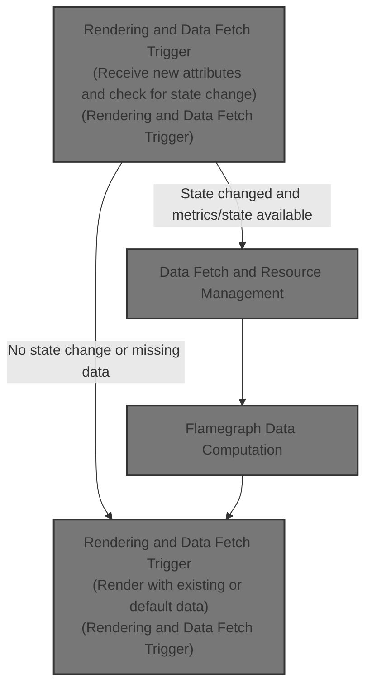

This document describes how the UI updates the flamegraph visualization in response to user actions and data changes. When new metrics or state are provided, dependencies are managed, data is computed, and the updated flamegraph is rendered. This ensures users see an accurate and interactive profiling view.



# Rendering and Data Fetch Trigger

```mermaid
%%{init: {"flowchart": {"defaultRenderer": "elk"}} }%%
flowchart TD
  node1["Receive new attributes (metrics, state, onStateChange)"] --> node2{"Has state changed?"}
  click node1 openCode "ui/src/components/query_flamegraph.ts:197:199"
  node2 -->|"Yes"| node3["Reset flamegraph data"]
  click node2 openCode "ui/src/components/query_flamegraph.ts:200:205"
  node3 --> node4{"Are metrics and state available?"}
  click node3 openCode "ui/src/components/query_flamegraph.ts:201:202"
  node4 -->|"Yes"| node5["Fetch new flamegraph data"]
  click node4 openCode "ui/src/components/query_flamegraph.ts:202:204"
  node4 -->|"No"| node7["Render flamegraph visualization (with default state if missing)"]
  click node5 openCode "ui/src/components/query_flamegraph.ts:203:204"
  node5 --> node7["Render flamegraph visualization (with metrics, data, state, onStateChange)"]
  click node7 openCode "ui/src/components/query_flamegraph.ts:206:216"
  node2 -->|"No"| node7["Render flamegraph visualization (with metrics, data, state, onStateChange)"]
  click node7 openCode "ui/src/components/query_flamegraph.ts:206:216"
classDef HeadingStyle fill:#777777,stroke:#333,stroke-width:2px;

%% Swimm:
%% %%{init: {"flowchart": {"defaultRenderer": "elk"}} }%%
%% flowchart TD
%%   node1["Receive new attributes (metrics, state, <SwmToken path="ui/src/components/query_flamegraph.ts" pos="198:10:10" line-data="    const {metrics, state, onStateChange} = attrs;">`onStateChange`</SwmToken>)"] --> node2{"Has state changed?"}
%%   click node1 openCode "<SwmPath>[ui/…/components/query_flamegraph.ts](ui/src/components/query_flamegraph.ts)</SwmPath>:197:199"
%%   node2 -->|"Yes"| node3["Reset flamegraph data"]
%%   click node2 openCode "<SwmPath>[ui/…/components/query_flamegraph.ts](ui/src/components/query_flamegraph.ts)</SwmPath>:200:205"
%%   node3 --> node4{"Are metrics and state available?"}
%%   click node3 openCode "<SwmPath>[ui/…/components/query_flamegraph.ts](ui/src/components/query_flamegraph.ts)</SwmPath>:201:202"
%%   node4 -->|"Yes"| node5["Fetch new flamegraph data"]
%%   click node4 openCode "<SwmPath>[ui/…/components/query_flamegraph.ts](ui/src/components/query_flamegraph.ts)</SwmPath>:202:204"
%%   node4 -->|"No"| node7["Render flamegraph visualization (with default state if missing)"]
%%   click node5 openCode "<SwmPath>[ui/…/components/query_flamegraph.ts](ui/src/components/query_flamegraph.ts)</SwmPath>:203:204"
%%   node5 --> node7["Render flamegraph visualization (with metrics, data, state, <SwmToken path="ui/src/components/query_flamegraph.ts" pos="198:10:10" line-data="    const {metrics, state, onStateChange} = attrs;">`onStateChange`</SwmToken>)"]
%%   click node7 openCode "<SwmPath>[ui/…/components/query_flamegraph.ts](ui/src/components/query_flamegraph.ts)</SwmPath>:206:216"
%%   node2 -->|"No"| node7["Render flamegraph visualization (with metrics, data, state, <SwmToken path="ui/src/components/query_flamegraph.ts" pos="198:10:10" line-data="    const {metrics, state, onStateChange} = attrs;">`onStateChange`</SwmToken>)"]
%%   click node7 openCode "<SwmPath>[ui/…/components/query_flamegraph.ts](ui/src/components/query_flamegraph.ts)</SwmPath>:206:216"
%% classDef HeadingStyle fill:#777777,stroke:#333,stroke-width:2px;
```



<SwmSnippet path="/ui/src/components/query_flamegraph.ts" line="197">

---

<SwmToken path="ui/src/components/query_flamegraph.ts" pos="197:1:1" line-data="  render(attrs: QueryFlamegraphAttrs) {">`render`</SwmToken> checks for state changes, resets data, and triggers <SwmToken path="ui/src/components/query_flamegraph.ts" pos="203:3:3" line-data="        this.fetchData(metrics, state);">`fetchData`</SwmToken> to ensure the flamegraph reflects the latest state.

```typescript
  render(attrs: QueryFlamegraphAttrs) {
    const {metrics, state, onStateChange} = attrs;
    this.lastAttrs = attrs;
    if (this.monitor.ifStateChanged()) {
      this.data = undefined;
      if (metrics && state) {
        this.fetchData(metrics, state);
      }
    }
    return m(Flamegraph, {
      metrics: metrics ?? [],
      data: this.data,
      state: state ?? {
        view: {kind: 'TOP_DOWN'},
        selectedMetricName: '',
        filters: [],
      },
      onStateChange,
    });
  }
```

---

</SwmSnippet>

# Data Fetch and Resource Management

```mermaid
%%{init: {"flowchart": {"defaultRenderer": "elk"}} }%%
flowchart TD
  node1{"Is there a metric matching the selected name?"}
  click node1 openCode "ui/src/components/query_flamegraph.ts:222:224"
  node1 -->|"Yes"| node2["Prepare dependencies"]
  click node2 openCode "ui/src/components/query_flamegraph.ts:225:236"
  node1 -->|"No"| node5["Cannot compute flamegraph"]
  click node5 openCode "ui/src/components/query_flamegraph.ts:222:224"
  
  subgraph loop1["For each dependency"]
    node2 --> node3["Clone and register dependency"]
    click node3 openCode "ui/src/components/query_flamegraph.ts:234:236"
    node3 --> node2
  end
  node2 --> node4["Compute flamegraph data"]
  click node4 openCode "ui/src/components/query_flamegraph.ts:237:237"
  node4 --> node6["Flamegraph data ready"]
  click node6 openCode "ui/src/components/query_flamegraph.ts:237:237"

classDef HeadingStyle fill:#777777,stroke:#333,stroke-width:2px;

%% Swimm:
%% %%{init: {"flowchart": {"defaultRenderer": "elk"}} }%%
%% flowchart TD
%%   node1{"Is there a metric matching the selected name?"}
%%   click node1 openCode "<SwmPath>[ui/…/components/query_flamegraph.ts](ui/src/components/query_flamegraph.ts)</SwmPath>:222:224"
%%   node1 -->|"Yes"| node2["Prepare dependencies"]
%%   click node2 openCode "<SwmPath>[ui/…/components/query_flamegraph.ts](ui/src/components/query_flamegraph.ts)</SwmPath>:225:236"
%%   node1 -->|"No"| node5["Cannot compute flamegraph"]
%%   click node5 openCode "<SwmPath>[ui/…/components/query_flamegraph.ts](ui/src/components/query_flamegraph.ts)</SwmPath>:222:224"
%%   
%%   subgraph loop1["For each dependency"]
%%     node2 --> node3["Clone and register dependency"]
%%     click node3 openCode "<SwmPath>[ui/…/components/query_flamegraph.ts](ui/src/components/query_flamegraph.ts)</SwmPath>:234:236"
%%     node3 --> node2
%%   end
%%   node2 --> node4["Compute flamegraph data"]
%%   click node4 openCode "<SwmPath>[ui/…/components/query_flamegraph.ts](ui/src/components/query_flamegraph.ts)</SwmPath>:237:237"
%%   node4 --> node6["Flamegraph data ready"]
%%   click node6 openCode "<SwmPath>[ui/…/components/query_flamegraph.ts](ui/src/components/query_flamegraph.ts)</SwmPath>:237:237"
%% 
%% classDef HeadingStyle fill:#777777,stroke:#333,stroke-width:2px;
```



<SwmSnippet path="/ui/src/components/query_flamegraph.ts" line="218">

---

<SwmToken path="ui/src/components/query_flamegraph.ts" pos="218:1:1" line-data="  fetchData(">`fetchData`</SwmToken> finds the right metric, schedules the async fetch, and manages dependencies' lifetimes to avoid leaks during the operation.

```typescript
  fetchData(
    metrics: ReadonlyArray<QueryFlamegraphMetric>,
    state: FlamegraphState,
  ) {
    const metric = assertExists(
      metrics.find((x) => state.selectedMetricName === x.name),
    );
    const engine = this.trace.engine;
    this.queryLimiter.schedule(async () => {
      this.data = undefined;
      // Clone all the dependencies to make sure the the are not dropped while
      // this function is running, adding them to the trash to make sure they
      // are disposed after this function returns, but note this won't
      // actually drop the tables unless this class instances have also been
      // disposed due to the SharedAsyncDisposable logic.
      await using trash = new AsyncDisposableStack();
      for (const dependency of this.dependencies ?? []) {
        trash.use(dependency.clone());
      }
```

---

</SwmSnippet>

<SwmSnippet path="/ui/src/components/query_flamegraph.ts" line="237">

---

After dependencies are managed and concurrency is limited, we call <SwmToken path="ui/src/components/query_flamegraph.ts" pos="237:9:9" line-data="      this.data = await computeFlamegraphTree(engine, metric, state);">`computeFlamegraphTree`</SwmToken> to actually generate the flamegraph data using the selected metric and state. This step produces the processed data that will be rendered in the UI.

```typescript
      this.data = await computeFlamegraphTree(engine, metric, state);
    });
  }
```

---

</SwmSnippet>

# Flamegraph Data Computation

```mermaid
%%{init: {"flowchart": {"defaultRenderer": "elk"}} }%%
flowchart TD
    node1["Prepare filters, grouping, and markers based on user selection"]
    click node1 openCode "ui/src/components/query_flamegraph.ts:255:279"
    node1 --> node2{"Is dependency SQL provided?"}
    click node2 openCode "ui/src/components/query_flamegraph.ts:326:328"
    node2 -->|"Yes"| node3["Run dependency SQL"]
    click node3 openCode "ui/src/components/query_flamegraph.ts:327:328"
    node2 -->|"No"| node4["Prepare and filter data with filters/grouping"]
    click node4 openCode "ui/src/components/query_flamegraph.ts:329:483"
    node3 --> node4
    node4 --> node5["Build nodes and calculate statistics"]
    click node5 openCode "ui/src/components/query_flamegraph.ts:490:553"
    
    subgraph loop1["For each row in the result"]
      node5 --> node6["Extract properties, apply marker, update statistics"]
      click node6 openCode "ui/src/components/query_flamegraph.ts:509:552"
    end
    node5 --> node7{"Is view kind BOTTOM_UP?"}
    click node7 openCode "ui/src/components/query_flamegraph.ts:561:561"
    node7 -->|BOTTOM_UP| node8["Calculate root value from negative roots"]
    click node8 openCode "ui/src/components/query_flamegraph.ts:561:561"
    node7 -->|"Other"| node9["Calculate root value from positive roots"]
    click node9 openCode "ui/src/components/query_flamegraph.ts:561:561"
    node8 --> node10["Return flamegraph tree data"]
    click node10 openCode "ui/src/components/query_flamegraph.ts:558:567"
    node9 --> node10
classDef HeadingStyle fill:#777777,stroke:#333,stroke-width:2px;

%% Swimm:
%% %%{init: {"flowchart": {"defaultRenderer": "elk"}} }%%
%% flowchart TD
%%     node1["Prepare filters, grouping, and markers based on user selection"]
%%     click node1 openCode "<SwmPath>[ui/…/components/query_flamegraph.ts](ui/src/components/query_flamegraph.ts)</SwmPath>:255:279"
%%     node1 --> node2{"Is dependency SQL provided?"}
%%     click node2 openCode "<SwmPath>[ui/…/components/query_flamegraph.ts](ui/src/components/query_flamegraph.ts)</SwmPath>:326:328"
%%     node2 -->|"Yes"| node3["Run dependency SQL"]
%%     click node3 openCode "<SwmPath>[ui/…/components/query_flamegraph.ts](ui/src/components/query_flamegraph.ts)</SwmPath>:327:328"
%%     node2 -->|"No"| node4["Prepare and filter data with filters/grouping"]
%%     click node4 openCode "<SwmPath>[ui/…/components/query_flamegraph.ts](ui/src/components/query_flamegraph.ts)</SwmPath>:329:483"
%%     node3 --> node4
%%     node4 --> node5["Build nodes and calculate statistics"]
%%     click node5 openCode "<SwmPath>[ui/…/components/query_flamegraph.ts](ui/src/components/query_flamegraph.ts)</SwmPath>:490:553"
%%     
%%     subgraph loop1["For each row in the result"]
%%       node5 --> node6["Extract properties, apply marker, update statistics"]
%%       click node6 openCode "<SwmPath>[ui/…/components/query_flamegraph.ts](ui/src/components/query_flamegraph.ts)</SwmPath>:509:552"
%%     end
%%     node5 --> node7{"Is view kind <SwmToken path="ui/src/components/query_flamegraph.ts" pos="432:10:10" line-data="          ${view.kind === &#39;BOTTOM_UP&#39; ? &#39;FALSE&#39; : &#39;TRUE&#39;}">`BOTTOM_UP`</SwmToken>?"}
%%     click node7 openCode "<SwmPath>[ui/…/components/query_flamegraph.ts](ui/src/components/query_flamegraph.ts)</SwmPath>:561:561"
%%     node7 -->|<SwmToken path="ui/src/components/query_flamegraph.ts" pos="432:10:10" line-data="          ${view.kind === &#39;BOTTOM_UP&#39; ? &#39;FALSE&#39; : &#39;TRUE&#39;}">`BOTTOM_UP`</SwmToken>| node8["Calculate root value from negative roots"]
%%     click node8 openCode "<SwmPath>[ui/…/components/query_flamegraph.ts](ui/src/components/query_flamegraph.ts)</SwmPath>:561:561"
%%     node7 -->|"Other"| node9["Calculate root value from positive roots"]
%%     click node9 openCode "<SwmPath>[ui/…/components/query_flamegraph.ts](ui/src/components/query_flamegraph.ts)</SwmPath>:561:561"
%%     node8 --> node10["Return flamegraph tree data"]
%%     click node10 openCode "<SwmPath>[ui/…/components/query_flamegraph.ts](ui/src/components/query_flamegraph.ts)</SwmPath>:558:567"
%%     node9 --> node10
%% classDef HeadingStyle fill:#777777,stroke:#333,stroke-width:2px;
```



<SwmSnippet path="/ui/src/components/query_flamegraph.ts" line="242">

---

In <SwmToken path="ui/src/components/query_flamegraph.ts" pos="242:4:4" line-data="async function computeFlamegraphTree(">`computeFlamegraphTree`</SwmToken>, we process filters and properties, build SQL expressions, and set up a chain of temporary tables and indexes (with UUIDs) to filter, aggregate, and layout the flamegraph data. The function uses Perfetto-specific SQL functions for each stage, and iterates the final result to build the flamegraph nodes.

```typescript
async function computeFlamegraphTree(
  engine: Engine,
  {
    dependencySql,
    statement,
    unaggregatableProperties,
    aggregatableProperties,
    optionalNodeActions,
    optionalRootActions,
    optionalMarker,
  }: QueryFlamegraphMetric,
  {filters, view}: FlamegraphState,
): Promise<FlamegraphQueryData> {
  const showStack = filters
    .filter((x) => x.kind === 'SHOW_STACK')
    .map((x) => x.filter);
  const hideStack = filters
    .filter((x) => x.kind === 'HIDE_STACK')
    .map((x) => x.filter);
  const showFromFrame = filters
    .filter((x) => x.kind === 'SHOW_FROM_FRAME')
    .map((x) => x.filter);
  const hideFrame = filters
    .filter((x) => x.kind === 'HIDE_FRAME')
    .map((x) => x.filter);

  // Pivot also essentially acts as a "show stack" filter so treat it like one.
  const showStackAndPivot = [...showStack];
  if (view.kind === 'PIVOT') {
    showStackAndPivot.push(view.pivot);
  }

  const agg = aggregatableProperties ?? [];
  const aggCols = agg.map((x) => x.name);
  const unagg = unaggregatableProperties ?? [];
  const unaggCols = unagg.map((x) => x.name);

  const matchingColumns = ['name', ...unaggCols];
  const matchExpr = (x: string) =>
    matchingColumns.map(
      (c) =>
        `(IFNULL(${c}, '') like ${sqliteString(makeSqlFilter(x))} escape '\\')`,
    );

  const showStackFilter =
    showStackAndPivot.length === 0
      ? '0'
      : showStackAndPivot
          .map((x, i) => `((${matchExpr(x).join(' OR ')}) << ${i})`)
          .join(' | ');
  const showStackBits = (1 << showStackAndPivot.length) - 1;

  const hideStackFilter =
    hideStack.length === 0
      ? 'false'
      : hideStack
          .map((x) => matchExpr(x))
          .flat()
          .join(' OR ');

  const showFromFrameFilter =
    showFromFrame.length === 0
      ? '0'
      : showFromFrame
          .map((x, i) => `((${matchExpr(x).join(' OR ')}) << ${i})`)
          .join(' | ');
  const showFromFrameBits = (1 << showFromFrame.length) - 1;

  const hideFrameFilter =
    hideFrame.length === 0
      ? 'false'
      : hideFrame
          .map((x) => matchExpr(x))
          .flat()
          .join(' OR ');

  const pivotFilter = getPivotFilter(view, matchExpr);

  const nodeActions = optionalNodeActions ?? [];
  const rootActions = optionalRootActions ?? [];

  const groupingColumns = `(${(unaggCols.length === 0 ? ['groupingColumn'] : unaggCols).join()})`;
  const groupedColumns = `(${(aggCols.length === 0 ? ['groupedColumn'] : aggCols).join()})`;

  if (dependencySql !== undefined) {
    await engine.query(dependencySql);
  }
  await engine.query(`include perfetto module viz.flamegraph;`);

  const uuid = uuidv4Sql();
  await using disposable = new AsyncDisposableStack();

  disposable.use(
    await createPerfettoTable({
      engine,
      name: `_flamegraph_materialized_statement_${uuid}`,
      as: statement,
    }),
  );
  disposable.use(
    await createPerfettoIndex({
      engine,
      name: `_flamegraph_materialized_statement_${uuid}_index`,
      on: `_flamegraph_materialized_statement_${uuid}(parentId)`,
    }),
  );

  // TODO(lalitm): this doesn't need to be called unless we have
  // a non-empty set of filters.
  disposable.use(
    await createPerfettoTable({
      engine,
      name: `_flamegraph_source_${uuid}`,
      as: `
        select *
        from _viz_flamegraph_prepare_filter!(
          (
            select
              s.id,
              s.parentId,
              s.name,
              s.value,
              ${(unaggCols.length === 0
                ? [`'' as groupingColumn`]
                : unaggCols.map((x) => `s.${x}`)
              ).join()},
              ${(aggCols.length === 0
                ? [`'' as groupedColumn`]
                : aggCols.map((x) => `s.${x}`)
              ).join()}
            from _flamegraph_materialized_statement_${uuid} s
          ),
          (${showStackFilter}),
          (${hideStackFilter}),
          (${showFromFrameFilter}),
          (${hideFrameFilter}),
          (${pivotFilter}),
          ${1 << showStackAndPivot.length},
          ${groupingColumns}
        )
      `,
    }),
  );
  // TODO(lalitm): this doesn't need to be called unless we have
  // a non-empty set of filters.
  disposable.use(
    await createPerfettoTable({
      engine,
      name: `_flamegraph_filtered_${uuid}`,
      as: `
        select *
        from _viz_flamegraph_filter_frames!(
          _flamegraph_source_${uuid},
          ${showFromFrameBits}
        )
      `,
    }),
  );
  disposable.use(
    await createPerfettoIndex({
      engine,
      name: `_flamegraph_filtered_${uuid}_index`,
      on: `_flamegraph_filtered_${uuid}(parentId)`,
    }),
  );
  disposable.use(
    await createPerfettoTable({
      engine,
      name: `_flamegraph_accumulated_${uuid}`,
      as: `
        select *
        from _viz_flamegraph_accumulate!(
          _flamegraph_filtered_${uuid},
          ${showStackBits}
        )
      `,
    }),
  );
  disposable.use(
    await createPerfettoTable({
      engine,
      name: `_flamegraph_hash_${uuid}`,
      as: `
        select *
        from _viz_flamegraph_downwards_hash!(
          _flamegraph_source_${uuid},
          _flamegraph_filtered_${uuid},
          _flamegraph_accumulated_${uuid},
          ${groupingColumns},
          ${groupedColumns},
          ${view.kind === 'BOTTOM_UP' ? 'FALSE' : 'TRUE'}
        )
        union all
        select *
        from _viz_flamegraph_upwards_hash!(
          _flamegraph_source_${uuid},
          _flamegraph_filtered_${uuid},
          _flamegraph_accumulated_${uuid},
          ${groupingColumns},
          ${groupedColumns}
        )
        order by hash
      `,
    }),
  );
  disposable.use(
    await createPerfettoTable({
      engine,
      name: `_flamegraph_merged_${uuid}`,
      as: `
        select *
        from _viz_flamegraph_merge_hashes!(
          _flamegraph_hash_${uuid},
          ${groupingColumns},
          ${computeGroupedAggExprs(agg)}
        )
      `,
    }),
  );
  disposable.use(
    await createPerfettoIndex({
      engine,
      name: `_flamegraph_merged_${uuid}_index`,
      on: `_flamegraph_merged_${uuid}(parentId)`,
    }),
  );
  disposable.use(
    await createPerfettoTable({
      engine,
      name: `_flamegraph_layout_${uuid}`,
      as: `
        select *
        from _viz_flamegraph_local_layout!(
          _flamegraph_merged_${uuid}
        );
      `,
    }),
  );
  const res = await engine.query(`
    select *
    from _viz_flamegraph_global_layout!(
      _flamegraph_merged_${uuid},
      _flamegraph_layout_${uuid},
      ${groupingColumns},
      ${groupedColumns}
    )
  `);

  const it = res.iter({
    id: NUM,
    parentId: NUM,
    depth: NUM,
    name: STR,
    selfValue: NUM,
    cumulativeValue: NUM,
    parentCumulativeValue: NUM_NULL,
    xStart: NUM,
    xEnd: NUM,
    ...Object.fromEntries(unaggCols.map((m) => [m, STR_NULL])),
    ...Object.fromEntries(aggCols.map((m) => [m, UNKNOWN])),
  });
  let postiveRootsValue = 0;
  let negativeRootsValue = 0;
  let minDepth = 0;
  let maxDepth = 0;
  const nodes = [];
  for (; it.valid(); it.next()) {
    const properties = new Map<string, FlamegraphPropertyDefinition>();
    for (const a of [...agg, ...unagg]) {
      const r = it.get(a.name);
      if (r !== null) {
        const value = r as string;
        properties.set(a.name, {
          displayName: a.displayName,
          value,
          isVisible: a.isVisible ? a.isVisible(value) : true,
        });
      }
    }

    // Evaluate marker
    let marker: string | undefined;
    if (
      optionalMarker &&
      optionalMarker.isVisible(
        new Map([...properties].map(([k, v]) => [k, v.value])),
      )
    ) {
      marker = optionalMarker.name;
    }

    nodes.push({
      id: it.id,
      parentId: it.parentId,
      depth: it.depth,
      name: it.name,
      selfValue: it.selfValue,
      cumulativeValue: it.cumulativeValue,
      parentCumulativeValue: it.parentCumulativeValue ?? undefined,
      xStart: it.xStart,
      xEnd: it.xEnd,
      properties,
      marker,
    });
    if (it.depth === 1) {
      postiveRootsValue += it.cumulativeValue;
    } else if (it.depth === -1) {
      negativeRootsValue += it.cumulativeValue;
    }
    minDepth = Math.min(minDepth, it.depth);
    maxDepth = Math.max(maxDepth, it.depth);
  }
```

---

</SwmSnippet>

<SwmSnippet path="/ui/src/components/query_flamegraph.ts" line="554">

---

Finally, <SwmToken path="ui/src/components/query_flamegraph.ts" pos="237:9:9" line-data="      this.data = await computeFlamegraphTree(engine, metric, state);">`computeFlamegraphTree`</SwmToken> returns the flamegraph nodes, cumulative values, depth info, and actions. This is the complete data structure used by the UI to render and interact with the flamegraph.

```typescript
  const sumQuery = await engine.query(
    `select sum(value) v from _flamegraph_source_${uuid}`,
  );
  const unfilteredCumulativeValue = sumQuery.firstRow({v: NUM_NULL}).v ?? 0;
  return {
    nodes,
    allRootsCumulativeValue:
      view.kind === 'BOTTOM_UP' ? negativeRootsValue : postiveRootsValue,
    unfilteredCumulativeValue,
    minDepth,
    maxDepth,
    nodeActions,
    rootActions,
  };
}
```

---

</SwmSnippet>

&nbsp;

*This is an auto-generated document by Swimm 🌊 and has not yet been verified by a human*

<SwmMeta version="3.0.0" repo-id="Z2l0aHViJTNBJTNBY3BsdXNwbHVzLXBlcmZldHRvJTNBJTNBcmljYXJkb2xvcGV6Zw==" repo-name="cplusplus-perfetto"><sup>Powered by [Swimm](https://app.swimm.io/)</sup></SwmMeta>
