This document describes the process of rendering the interactive timeline canvas, which displays tracks, flow connections, highlights, overlays, and supports user-driven interactions. The flow integrates timeline and track data with user input to produce a dynamic visualization, allowing users to explore relationships between events and interact with the timeline.

# Where is this flow used?

This flow is used multiple times in the codebase as represented in the following diagram:

```mermaid
graph TD;
      7af2a7812bac0fd77765ddddcbd63121690ab837f6ee0644fc5ffbfc1b106963(ui/…/timeline_page/track_tree_view.ts::TrackTreeView.view) --> 97f94e49d0b55f66c9167270e6d18dd8baa4699356cef5450a0e748e6b7b6457(ui/…/timeline_page/track_tree_view.ts::TrackTreeView.drawCanvas)

a330d37d0fddc61b56e616df0520dd332c18059ff362f1b58a5788e738f980c0(ui/…/timeline_page/track_tree_view.ts::onCanvasRedraw) --> 97f94e49d0b55f66c9167270e6d18dd8baa4699356cef5450a0e748e6b7b6457(ui/…/timeline_page/track_tree_view.ts::TrackTreeView.drawCanvas)

3bc6007fac10bd1a7f4318556ad694f6d86d9b35ff49944f66203947a12bb581(ui/…/timeline_page/track_tree_view.ts::TrackTreeView.drawTracks) --> 97f94e49d0b55f66c9167270e6d18dd8baa4699356cef5450a0e748e6b7b6457(ui/…/timeline_page/track_tree_view.ts::TrackTreeView.drawCanvas)


classDef mainFlowStyle color:#000000,fill:#7CB9F4
classDef rootsStyle color:#000000,fill:#00FFF4
classDef Style1 color:#000000,fill:#00FFAA
classDef Style2 color:#000000,fill:#FFFF00
classDef Style3 color:#000000,fill:#AA7CB9

%% Swimm:
%% graph TD;
%%       7af2a7812bac0fd77765ddddcbd63121690ab837f6ee0644fc5ffbfc1b106963(<SwmPath>[ui/…/timeline_page/track_tree_view.ts](ui/src/frontend/timeline_page/track_tree_view.ts)</SwmPath>::TrackTreeView.view) --> 97f94e49d0b55f66c9167270e6d18dd8baa4699356cef5450a0e748e6b7b6457(<SwmPath>[ui/…/timeline_page/track_tree_view.ts](ui/src/frontend/timeline_page/track_tree_view.ts)</SwmPath>::TrackTreeView.drawCanvas)
%% 
%% a330d37d0fddc61b56e616df0520dd332c18059ff362f1b58a5788e738f980c0(<SwmPath>[ui/…/timeline_page/track_tree_view.ts](ui/src/frontend/timeline_page/track_tree_view.ts)</SwmPath>::<SwmToken path="ui/src/frontend/timeline_page/track_tree_view.ts" pos="276:1:1" line-data="        onCanvasRedraw: ({ctx, virtualCanvasSize, canvasRect}) =&gt; {">`onCanvasRedraw`</SwmToken>) --> 97f94e49d0b55f66c9167270e6d18dd8baa4699356cef5450a0e748e6b7b6457(<SwmPath>[ui/…/timeline_page/track_tree_view.ts](ui/src/frontend/timeline_page/track_tree_view.ts)</SwmPath>::TrackTreeView.drawCanvas)
%% 
%% 3bc6007fac10bd1a7f4318556ad694f6d86d9b35ff49944f66203947a12bb581(<SwmPath>[ui/…/timeline_page/track_tree_view.ts](ui/src/frontend/timeline_page/track_tree_view.ts)</SwmPath>::TrackTreeView.drawTracks) --> 97f94e49d0b55f66c9167270e6d18dd8baa4699356cef5450a0e748e6b7b6457(<SwmPath>[ui/…/timeline_page/track_tree_view.ts](ui/src/frontend/timeline_page/track_tree_view.ts)</SwmPath>::TrackTreeView.drawCanvas)
%% 
%% 
%% classDef mainFlowStyle color:#000000,fill:#7CB9F4
%% classDef rootsStyle color:#000000,fill:#00FFF4
%% classDef Style1 color:#000000,fill:#00FFAA
%% classDef Style2 color:#000000,fill:#FFFF00
%% classDef Style3 color:#000000,fill:#AA7CB9
```



# Setting Up Timeline Canvas


<SwmSnippet path="/ui/src/frontend/timeline_page/track_tree_view.ts" line="364">

---

In <SwmToken path="ui/src/frontend/timeline_page/track_tree_view.ts" pos="364:3:3" line-data="  private drawCanvas(">`drawCanvas`</SwmToken>, we set up the timeline's drawing area, configure the visible window and timescale, and draw the grid and tracks. We then call <SwmToken path="ui/src/frontend/timeline_page/track_tree_view.ts" pos="413:1:1" line-data="    renderFlows(this.trace, ctx, size, renderedTracks, rootNode, timescale);">`renderFlows`</SwmToken> to overlay flow arrows between tracks, which needs the track positions calculated earlier. This sets up the canvas for all subsequent timeline interactions.

```typescript
  private drawCanvas(
    ctx: CanvasRenderingContext2D,
    size: Size2D,
    renderedTracks: ReadonlyArray<TrackView>,
    floatingCanvasRect: Rect2D,
    rootNode: TrackNode,
  ) {
    const timelineRect = new Rect2D({
      left: TRACK_SHELL_WIDTH,
      top: 0,
      right: size.width,
      bottom: size.height,
    });

    // Always grab the latest visible window and create a timescale out of
    // it.
    const visibleWindow = this.trace.timeline.visibleWindow;
    const timescale = new TimeScale(visibleWindow, timelineRect);

    const start = performance.now();

    // Save, translate & clip the canvas to the area of the timeline.
    using _ = canvasSave(ctx);
    canvasClip(ctx, timelineRect);

    this.drawGridLines(ctx, timescale, timelineRect);

    const colors: CanvasColors = {
      COLOR_BORDER,
      COLOR_BORDER_SECONDARY,
      COLOR_BACKGROUND_SECONDARY,
      COLOR_ACCENT,
      COLOR_BACKGROUND,
      COLOR_NEUTRAL,
      COLOR_TEXT,
      COLOR_TEXT_MUTED,
      COLOR_TIMELINE_OVERLAY,
    };

    const tracksOnCanvas = this.drawTracks(
      renderedTracks,
      floatingCanvasRect,
      size,
      ctx,
      timelineRect,
      visibleWindow,
      colors,
    );

    renderFlows(this.trace, ctx, size, renderedTracks, rootNode, timescale);
```

---

</SwmSnippet>

## Rendering Flow Connections


<SwmSnippet path="/ui/src/frontend/timeline_page/flow_events_renderer.ts" line="69">

---

In <SwmToken path="ui/src/frontend/timeline_page/flow_events_renderer.ts" pos="69:4:4" line-data="export function renderFlows(">`renderFlows`</SwmToken>, we map track nodes to their info, then define how to draw each flow arrow. We use timescale to convert timestamps to pixel positions, and only draw flows that are visible in the viewport. This sets up the logic for drawing arrows between tracks.

```typescript
export function renderFlows(
  trace: TraceImpl,
  ctx: CanvasRenderingContext2D,
  size: Size2D,
  tracks: ReadonlyArray<TrackInfo>,
  trackRoot: TrackNode,
  timescale: TimeScale,
): void {
  // Create an index of track node instances to panels. This doesn't need to be
  // a WeakMap because it's thrown away every render cycle.
  const trackInfoByNode = new Map(
    tracks.map((trackInfo) => [trackInfo.node, trackInfo]),
  );

  const drawFlow = (flow: Flow, hue: number) => {
    const flowStartTs =
      flow.flowToDescendant || flow.begin.sliceStartTs >= flow.end.sliceStartTs
        ? flow.begin.sliceStartTs
        : flow.begin.sliceEndTs;

    const flowEndTs = flow.end.sliceStartTs;

    const startX = timescale.timeToPx(flowStartTs);
    const endX = timescale.timeToPx(flowEndTs);

    const flowBounds = {
      left: Math.min(startX, endX),
      right: Math.max(startX, endX),
    };

    if (!isInViewport(flowBounds, size)) {
      return;
    }

    const highlighted =
      flow.end.sliceId === trace.timeline.highlightedSliceId ||
      flow.begin.sliceId === trace.timeline.highlightedSliceId;
    const focused =
      flow.id === trace.flows.focusedFlowIdLeft ||
      flow.id === trace.flows.focusedFlowIdRight;

    let intensity = DEFAULT_FLOW_INTENSITY;
    let width = DEFAULT_FLOW_WIDTH;
    if (focused) {
      intensity = FOCUSED_FLOW_INTENSITY;
      width = FOCUSED_FLOW_WIDTH;
    }
    if (highlighted) {
      intensity = HIGHLIGHTED_FLOW_INTENSITY;
    }

    const start = getConnectionTarget(
      flow.begin.trackUri,
      flow.begin.depth,
      startX,
    );
    const end = getConnectionTarget(flow.end.trackUri, flow.end.depth, endX);

    if (start && end) {
      drawArrow(ctx, start, end, intensity, hue, width);
    }
  };

```

---

</SwmSnippet>

<SwmSnippet path="/ui/src/frontend/timeline_page/flow_events_renderer.ts" line="213">

---

<SwmToken path="ui/src/frontend/timeline_page/flow_events_renderer.ts" pos="213:2:2" line-data="function drawArrow(">`drawArrow`</SwmToken> sets up the arrow's color and width, figures out if there's room for a triangle arrowhead, and picks arrowhead styles based on whether the start/end are vertical edges or points. It then calls <SwmToken path="ui/src/frontend/timeline_page/flow_events_renderer.ts" pos="259:1:1" line-data="  drawBezierArrow(ctx, start, end, BEZIER_OFFSET, startStyle, endStyle);">`drawBezierArrow`</SwmToken> to actually draw the arrow.

```typescript
function drawArrow(
  ctx: CanvasRenderingContext2D,
  start: VerticalEdgeOrPoint,
  end: VerticalEdgeOrPoint,
  intensity: number,
  hue: number,
  width: number,
): void {
  ctx.strokeStyle = `hsl(${hue}, 50%, ${intensity}%)`;
  ctx.fillStyle = `hsl(${hue}, 50%, ${intensity}%)`;
  ctx.lineWidth = width;

  const dist = new Vector2D(end).sub(new Vector2D(start));
  const roomForArrowHead =
    Math.abs(dist.x) > 3 * TRIANGLE_SIZE ||
    Math.abs(dist.y) > 2 * TRIANGLE_SIZE;

  let startStyle: ArrowHeadStyle;
  if (start.kind === 'vertical_edge') {
    startStyle = {
      orientation: 'east',
      shape: 'none',
    };
  } else {
    startStyle = {
      orientation: 'auto_vertical',
      shape: 'circle',
      size: CIRCLE_RADIUS,
    };
  }

  let endStyle: ArrowHeadStyle;
  if (end.kind === 'vertical_edge') {
    endStyle = {
      orientation: 'west',
      shape: roomForArrowHead ? 'triangle' : 'none',
      size: TRIANGLE_SIZE,
    };
  } else {
    endStyle = {
      orientation: 'auto_vertical',
      shape: 'circle',
      size: CIRCLE_RADIUS,
    };
  }

  drawBezierArrow(ctx, start, end, BEZIER_OFFSET, startStyle, endStyle);
}
```

---

</SwmSnippet>

<SwmSnippet path="/ui/src/frontend/timeline_page/flow_events_renderer.ts" line="132">

---

After returning from <SwmPath>[ui/…/timeline_page/flow_events_renderer.ts](ui/src/frontend/timeline_page/flow_events_renderer.ts)</SwmPath>, we use <SwmToken path="ui/src/frontend/timeline_page/flow_events_renderer.ts" pos="132:3:3" line-data="  const getConnectionTarget = (">`getConnectionTarget`</SwmToken> to figure out where to anchor flow arrows on tracks or groups. Then we loop through connected and selected flows, drawing each with the right color and category filtering.

```typescript
  const getConnectionTarget = (
    trackUri: string | undefined,
    depth: number,
    x: number,
  ): VerticalEdgeOrPoint | undefined => {
    if (trackUri === undefined) {
      return undefined;
    }

    const track = trackRoot.getTrackByUri(trackUri);
    if (!track) {
      return undefined;
    }

    const trackPanel = trackInfoByNode.get(track);
    if (trackPanel) {
      const trackRect = trackPanel.verticalBounds;
      const sliceRectRaw = trace.tracks
        .getTrack(trackUri)
        ?.renderer.getSliceVerticalBounds?.(depth);
      if (sliceRectRaw) {
        const sliceRect = {
          top: sliceRectRaw.top + trackRect.top,
          bottom: sliceRectRaw.bottom + trackRect.top,
        };
        return {
          kind: 'vertical_edge',
          x,
          y: (sliceRect.top + sliceRect.bottom) / 2,
        };
      } else {
        // Slice bounds are not available for this track, so just put the target
        // in the middle of the track
        return {
          kind: 'vertical_edge',
          x,
          y: (trackRect.top + trackRect.bottom) / 2,
        };
      }
    } else {
      // If we didn't find a track, it might inside a group, so check for the group
      const containerNode = track.findClosestVisibleAncestor();
      const groupPanel = trackInfoByNode.get(containerNode);
      if (groupPanel) {
        return {
          kind: 'point',
          x,
          y: groupPanel.verticalBounds.bottom - TRACK_GROUP_CONNECTION_OFFSET,
        };
      }
    }

    return undefined;
  };

  // Render the connected flows
  trace.flows.connectedFlows.forEach((flow) => {
    drawFlow(flow, CONNECTED_FLOW_HUE);
  });

  // Render the selected flows
  trace.flows.selectedFlows.forEach((flow) => {
    const categories = getFlowCategories(flow);
    for (const cat of categories) {
      if (
        trace.flows.visibleCategories.get(cat) ||
        trace.flows.visibleCategories.get(ALL_CATEGORIES)
      ) {
        drawFlow(flow, SELECTED_FLOW_HUE);
        break;
      }
    }
  });
}
```

---

</SwmSnippet>

<SwmSnippet path="/ui/src/frontend/timeline_page/flow_events_renderer.ts" line="83">

---

<SwmToken path="ui/src/frontend/timeline_page/flow_events_renderer.ts" pos="83:3:3" line-data="  const drawFlow = (flow: Flow, hue: number) =&gt; {">`drawFlow`</SwmToken> figures out where each flow starts and ends in time, converts those to pixel positions, checks if the flow is visible, and then picks visual styles based on highlight/focus state. It uses connection targets to anchor arrows and draws them if both ends are valid.

```typescript
  const drawFlow = (flow: Flow, hue: number) => {
    const flowStartTs =
      flow.flowToDescendant || flow.begin.sliceStartTs >= flow.end.sliceStartTs
        ? flow.begin.sliceStartTs
        : flow.begin.sliceEndTs;

    const flowEndTs = flow.end.sliceStartTs;

    const startX = timescale.timeToPx(flowStartTs);
    const endX = timescale.timeToPx(flowEndTs);

    const flowBounds = {
      left: Math.min(startX, endX),
      right: Math.max(startX, endX),
    };

    if (!isInViewport(flowBounds, size)) {
      return;
    }

    const highlighted =
      flow.end.sliceId === trace.timeline.highlightedSliceId ||
      flow.begin.sliceId === trace.timeline.highlightedSliceId;
    const focused =
      flow.id === trace.flows.focusedFlowIdLeft ||
      flow.id === trace.flows.focusedFlowIdRight;

    let intensity = DEFAULT_FLOW_INTENSITY;
    let width = DEFAULT_FLOW_WIDTH;
    if (focused) {
      intensity = FOCUSED_FLOW_INTENSITY;
      width = FOCUSED_FLOW_WIDTH;
    }
    if (highlighted) {
      intensity = HIGHLIGHTED_FLOW_INTENSITY;
    }

    const start = getConnectionTarget(
      flow.begin.trackUri,
      flow.begin.depth,
      startX,
    );
    const end = getConnectionTarget(flow.end.trackUri, flow.end.depth, endX);

    if (start && end) {
      drawArrow(ctx, start, end, intensity, hue, width);
    }
  };
```

---

</SwmSnippet>

## Drawing Timeline Interactions


<SwmSnippet path="/ui/src/frontend/timeline_page/track_tree_view.ts" line="414">

---

After returning from <SwmPath>[ui/…/timeline_page/flow_events_renderer.ts](ui/src/frontend/timeline_page/flow_events_renderer.ts)</SwmPath>, we draw overlays for hovered notes, cursors, and selection areas, then call <SwmToken path="ui/src/frontend/timeline_page/track_tree_view.ts" pos="418:3:3" line-data="    this.updateInteractions(timelineRect, timescale, size, renderedTracks);">`updateInteractions`</SwmToken> to set up user input handlers for the timeline.

```typescript
    this.drawHoveredNoteVertical(ctx, timescale, size);
    this.drawHoveredCursorVertical(ctx, timescale, size);
    this.drawNoteVerticals(ctx, timescale, size);
    this.drawAreaSelection(ctx, timescale, size);
    this.updateInteractions(timelineRect, timescale, size, renderedTracks);

```

---

</SwmSnippet>

## Setting Up Timeline User Input


<SwmSnippet path="/ui/src/frontend/timeline_page/track_tree_view.ts" line="488">

---

<SwmToken path="ui/src/frontend/timeline_page/track_tree_view.ts" pos="488:3:3" line-data="  private updateInteractions(">`updateInteractions`</SwmToken> sets up drag handlers for editing selection boundaries and area selection, snapping drag positions to tracks, and updating selection state. It also adds wheel navigation for panning and zooming the timeline.

```typescript
  private updateInteractions(
    timelineRect: Rect2D,
    timescale: TimeScale,
    size: Size2D,
    renderedTracks: ReadonlyArray<TrackView>,
  ) {
    const trace = this.trace;
    const areaSelection =
      trace.selection.selection.kind === 'area' && trace.selection.selection;

    assertExists(this.interactions).update([
      shiftDragPanInteraction(trace, timelineRect, timescale),
      areaSelection !== false && {
        id: 'start-edit',
        area: new Rect2D({
          left: timescale.timeToPx(areaSelection.start) - 5,
          right: timescale.timeToPx(areaSelection.start) + 5,
          top: 0,
          bottom: size.height,
        }),
        cursor: 'col-resize',
        drag: {
          cursorWhileDragging: 'col-resize',
          onDrag: (e) => {
            if (!this.handleDrag) {
              this.handleDrag = new InProgressHandleDrag(
                new HighPrecisionTime(areaSelection.end),
              );
            }

            this.currentSnapPoint = undefined;
            const currentTime = this.trySnapToTrack(
              timescale.pxToHpTime(e.dragCurrent.x),
              e.dragCurrent.y,
              e.altKey,
              timescale,
              renderedTracks,
            );

            this.handleDrag.currentTime = currentTime;
            trace.timeline.selectedSpan = this.handleDrag
              .timeSpan()
              .toTimeSpan();
            this.trace.raf.scheduleCanvasRedraw();
          },
          onDragEnd: (e) => {
            this.currentSnapPoint = undefined;
            const newStartTime = this.trySnapToTrack(
              timescale.pxToHpTime(e.dragCurrent.x),
              e.dragCurrent.y,
              e.altKey,
              timescale,
              renderedTracks,
            );

            trace.selection.selectArea({
              ...areaSelection,
              end: Time.max(newStartTime.toTime('ceil'), areaSelection.end),
              start: Time.min(newStartTime.toTime('ceil'), areaSelection.end),
            });
            trace.timeline.selectedSpan = undefined;
            this.handleDrag = undefined;
            this.currentSnapPoint = undefined;
          },
        },
      },
      areaSelection !== false && {
        id: 'end-edit',
        area: new Rect2D({
          left: timescale.timeToPx(areaSelection.end) - 5,
          right: timescale.timeToPx(areaSelection.end) + 5,
          top: 0,
          bottom: size.height,
        }),
        cursor: 'col-resize',
        drag: {
          cursorWhileDragging: 'col-resize',
          onDrag: (e) => {
            if (!this.handleDrag) {
              this.handleDrag = new InProgressHandleDrag(
                new HighPrecisionTime(areaSelection.start),
              );
            }

            this.currentSnapPoint = undefined;
            const currentTime = this.trySnapToTrack(
              timescale.pxToHpTime(e.dragCurrent.x),
              e.dragCurrent.y,
              e.altKey,
              timescale,
              renderedTracks,
            );

            this.handleDrag.currentTime = currentTime;
            trace.timeline.selectedSpan = this.handleDrag
              .timeSpan()
              .toTimeSpan();
            this.trace.raf.scheduleCanvasRedraw();
          },
          onDragEnd: (e) => {
            this.currentSnapPoint = undefined;
            const newEndTime = this.trySnapToTrack(
              timescale.pxToHpTime(e.dragCurrent.x),
              e.dragCurrent.y,
              e.altKey,
              timescale,
              renderedTracks,
            );

            trace.selection.selectArea({
              ...areaSelection,
              end: Time.max(newEndTime.toTime('ceil'), areaSelection.start),
              start: Time.min(newEndTime.toTime('ceil'), areaSelection.start),
            });
            trace.timeline.selectedSpan = undefined;
            this.handleDrag = undefined;
            this.currentSnapPoint = undefined;
          },
        },
      },
      {
        id: 'area-selection',
        area: timelineRect,
        onClick: () => {
          // If a track hasn't intercepted the click, treat this as a
          // deselection event.
          trace.selection.clearSelection();
        },
        drag: {
          minDistance: 1,
          cursorWhileDragging: 'crosshair',
          onDrag: (e) => {
            if (!this.areaDrag) {
              this.areaDrag = new InProgressAreaSelection(
                timescale.pxToHpTime(e.dragStart.x),
                e.dragStart.y,
              );
            }

            this.currentSnapPoint = undefined;
            const currentTime = this.trySnapToTrack(
              timescale.pxToHpTime(e.dragCurrent.x),
              e.dragCurrent.y,
              e.altKey,
              timescale,
              renderedTracks,
            );

            this.areaDrag.currentTime = currentTime;
            this.areaDrag.currentY = e.dragCurrent.y;

            this.trace.raf.scheduleCanvasRedraw();
            trace.timeline.selectedSpan = this.areaDrag.timeSpan().toTimeSpan();
          },
          onDragEnd: (e) => {
            if (!this.areaDrag) {
              this.areaDrag = new InProgressAreaSelection(
                timescale.pxToHpTime(e.dragStart.x),
                e.dragStart.y,
              );
            }

            this.currentSnapPoint = undefined;
            const currentTime = this.trySnapToTrack(
              timescale.pxToHpTime(e.dragCurrent.x),
              e.dragCurrent.y,
              e.altKey,
              timescale,
              renderedTracks,
            );

            this.areaDrag.currentTime = currentTime;
            this.areaDrag.currentY = e.dragCurrent.y;

            // Find the list of tracks that intersect this selection
            const trackUris = findTracksInRect(
              renderedTracks,
              this.areaDrag.rect(timescale),
              true,
            )
              .map((t) => t.uri)
              .filter((uri) => uri !== undefined);

            const timeSpan = this.areaDrag.timeSpan().toTimeSpan();
            trace.selection.selectArea({
              start: timeSpan.start,
              end: timeSpan.end,
              trackUris,
            });

            trace.timeline.selectedSpan = undefined;
            this.areaDrag = undefined;
            this.currentSnapPoint = undefined;
          },
        },
      },
      wheelNavigationInteraction(trace, timelineRect, timescale),
    ]);
  }
```

---

</SwmSnippet>

<SwmSnippet path="/ui/src/frontend/timeline_page/timeline_interactions.ts" line="49">

---

<SwmToken path="ui/src/frontend/timeline_page/timeline_interactions.ts" pos="49:4:4" line-data="export function wheelNavigationInteraction(">`wheelNavigationInteraction`</SwmToken> handles mouse wheel events for timeline panning and zooming. Horizontal wheel moves pan the timeline, vertical moves with ctrl zoom in/out using a logarithmic scale for smoothness. The zoom center is set by mouse position.

```typescript
export function wheelNavigationInteraction(
  trace: TraceImpl,
  rect: Rect2D,
  timescale: TimeScale,
): Zone {
  return {
    id: 'mouse-wheel-navigation',
    area: rect,
    onWheel: (e) => {
      if (Math.abs(e.deltaX) > Math.abs(e.deltaY)) {
        const tDelta = timescale.pxToDuration(e.deltaX);
        trace.timeline.panVisibleWindow(tDelta);
      } else {
        if (e.ctrlKey) {
          const sign = e.deltaY < 0 ? -1 : 1;
          const deltaY = sign * Math.log2(1 + Math.abs(e.deltaY));
          const zoomPx = e.position.x - rect.left;
          const centerPoint = zoomPx / rect.width;
          trace.timeline.zoomVisibleWindow(
            1 - deltaY * WHEEL_ZOOM_SPEED,
            centerPoint,
          );
        }
      }
    },
  };
}
```

---

</SwmSnippet>

## Rendering Overlays and Final Stats

<SwmSnippet path="/ui/src/frontend/timeline_page/track_tree_view.ts" line="420">

---

After returning from <SwmToken path="ui/src/frontend/timeline_page/track_tree_view.ts" pos="418:3:3" line-data="    this.updateInteractions(timelineRect, timescale, size, renderedTracks);">`updateInteractions`</SwmToken>, we render overlays on top of the timeline and update performance stats, making sure overlays reflect the latest interaction state and are drawn above everything else.

```typescript
    this.trace.tracks.overlays.forEach((overlay) => {
      overlay.render(ctx, timescale, size, renderedTracks, colors);
    });

    const renderTime = performance.now() - start;
    this.updatePerfStats(renderTime, renderedTracks.length, tracksOnCanvas);
  }
```

---

</SwmSnippet>

&nbsp;

*This is an auto-generated document by Swimm 🌊 and has not yet been verified by a human*

<SwmMeta version="3.0.0" repo-id="Z2l0aHViJTNBJTNBY3BsdXNwbHVzLXBlcmZldHRvJTNBJTNBcmljYXJkb2xvcGV6Zw==" repo-name="cplusplus-perfetto"><sup>Powered by [Swimm](https://app.swimm.io/)</sup></SwmMeta>
