This document describes how the system updates and renders the search overview bar. When users interact with the timeline, the system ensures the search summary is current and displays an updated visual overview of search results.

# Triggering Search Overview Update and Render

<SwmSnippet path="/ui/src/frontend/timeline_page/search_overview_track.ts" line="54">

---

In <SwmToken path="ui/src/frontend/timeline_page/search_overview_track.ts" pos="54:1:1" line-data="  render(ctx: CanvasRenderingContext2D, size: Size2D) {">`render`</SwmToken>, we kick things off by making sure our search summary is current for the visible timeline and search state. That's why we call <SwmToken path="ui/src/frontend/timeline_page/search_overview_track.ts" pos="55:3:3" line-data="    this.maybeUpdate(size.width);">`maybeUpdate`</SwmToken> right away—so any drawing that follows uses fresh data.

```typescript
  render(ctx: CanvasRenderingContext2D, size: Size2D) {
    this.maybeUpdate(size.width);
```

---

</SwmSnippet>

## Conditional Search Summary Refresh and Data Fetch

```mermaid
%%{init: {"flowchart": {"defaultRenderer": "elk"}} }%%
flowchart TD
  node1["Check for search results"] --> node2{"Are there search results?"}
  click node1 openCode "ui/src/frontend/timeline_page/search_overview_track.ts:156:159"
  click node2 openCode "ui/src/frontend/timeline_page/search_overview_track.ts:158:160"
  node2 -->|"No"| node3["Return, no update needed"]
  click node3 openCode "ui/src/frontend/timeline_page/search_overview_track.ts:159:160"
  node2 -->|"Yes"| node4["Check if visible window, resolution, or search generation changed"]
  click node4 openCode "ui/src/frontend/timeline_page/search_overview_track.ts:161:173"
  node4 --> node5{"Has anything changed?"}
  click node5 openCode "ui/src/frontend/timeline_page/search_overview_track.ts:169:174"
  node5 -->|"No"| node3
  node5 -->|"Yes"| node6["Pad time span and update previous state"]
  click node6 openCode "ui/src/frontend/timeline_page/search_overview_track.ts:180:183"
  node6 --> node7["Check if search text is empty"]
  click node7 openCode "ui/src/frontend/timeline_page/search_overview_track.ts:184:185"
  node7 --> node8{"Is search text empty?"}
  click node8 openCode "ui/src/frontend/timeline_page/search_overview_track.ts:185:191"
  node8 -->|"Yes"| node9["Clear search summary and return"]
  click node9 openCode "ui/src/frontend/timeline_page/search_overview_track.ts:186:191"
  node8 -->|"No"| node10["Schedule update of search summary"]
  click node10 openCode "ui/src/frontend/timeline_page/search_overview_track.ts:194:202"
classDef HeadingStyle fill:#777777,stroke:#333,stroke-width:2px;

%% Swimm:
%% %%{init: {"flowchart": {"defaultRenderer": "elk"}} }%%
%% flowchart TD
%%   node1["Check for search results"] --> node2{"Are there search results?"}
%%   click node1 openCode "<SwmPath>[ui/…/timeline_page/search_overview_track.ts](ui/src/frontend/timeline_page/search_overview_track.ts)</SwmPath>:156:159"
%%   click node2 openCode "<SwmPath>[ui/…/timeline_page/search_overview_track.ts](ui/src/frontend/timeline_page/search_overview_track.ts)</SwmPath>:158:160"
%%   node2 -->|"No"| node3["Return, no update needed"]
%%   click node3 openCode "<SwmPath>[ui/…/timeline_page/search_overview_track.ts](ui/src/frontend/timeline_page/search_overview_track.ts)</SwmPath>:159:160"
%%   node2 -->|"Yes"| node4["Check if visible window, resolution, or search generation changed"]
%%   click node4 openCode "<SwmPath>[ui/…/timeline_page/search_overview_track.ts](ui/src/frontend/timeline_page/search_overview_track.ts)</SwmPath>:161:173"
%%   node4 --> node5{"Has anything changed?"}
%%   click node5 openCode "<SwmPath>[ui/…/timeline_page/search_overview_track.ts](ui/src/frontend/timeline_page/search_overview_track.ts)</SwmPath>:169:174"
%%   node5 -->|"No"| node3
%%   node5 -->|"Yes"| node6["Pad time span and update previous state"]
%%   click node6 openCode "<SwmPath>[ui/…/timeline_page/search_overview_track.ts](ui/src/frontend/timeline_page/search_overview_track.ts)</SwmPath>:180:183"
%%   node6 --> node7["Check if search text is empty"]
%%   click node7 openCode "<SwmPath>[ui/…/timeline_page/search_overview_track.ts](ui/src/frontend/timeline_page/search_overview_track.ts)</SwmPath>:184:185"
%%   node7 --> node8{"Is search text empty?"}
%%   click node8 openCode "<SwmPath>[ui/…/timeline_page/search_overview_track.ts](ui/src/frontend/timeline_page/search_overview_track.ts)</SwmPath>:185:191"
%%   node8 -->|"Yes"| node9["Clear search summary and return"]
%%   click node9 openCode "<SwmPath>[ui/…/timeline_page/search_overview_track.ts](ui/src/frontend/timeline_page/search_overview_track.ts)</SwmPath>:186:191"
%%   node8 -->|"No"| node10["Schedule update of search summary"]
%%   click node10 openCode "<SwmPath>[ui/…/timeline_page/search_overview_track.ts](ui/src/frontend/timeline_page/search_overview_track.ts)</SwmPath>:194:202"
%% classDef HeadingStyle fill:#777777,stroke:#333,stroke-width:2px;
```



<SwmSnippet path="/ui/src/frontend/timeline_page/search_overview_track.ts" line="155">

---

<SwmToken path="ui/src/frontend/timeline_page/search_overview_track.ts" pos="155:3:3" line-data="  private maybeUpdate(timelineWidth: number) {">`maybeUpdate`</SwmToken> checks if the timeline or search state has changed enough to need a new summary. It compares the current window, resolution, and search generation to cached values, and only schedules an update if something's different. If the search text is empty, it just clears the summary. Otherwise, it pads the time span, updates the cache, and schedules an async fetch via limiter to get fresh summary data.

```typescript
  private maybeUpdate(timelineWidth: number) {
    const searchManager = this.trace.search;
    const timeline = this.trace.timeline;
    if (!searchManager.hasResults) {
      return;
    }
    const newSpan = timeline.visibleWindow;
    const newSearchGeneration = searchManager.searchGeneration;
    const maybeNewResolution = calculateResolution(newSpan, timelineWidth);
    if (!maybeNewResolution.ok) {
      return;
    }
    const newResolution = maybeNewResolution.value;
    const newTimeSpan = newSpan.toTimeSpan();
    if (
      this.previousSpan?.containsSpan(newTimeSpan.start, newTimeSpan.end) &&
      this.previousResolution === newResolution &&
      this.previousSearchGeneration === newSearchGeneration
    ) {
      return;
    }

    // TODO(hjd): We should restrict this to the start of the trace but
    // that is not easily available here.
    // N.B. Timestamps can be negative.
    const {start, end} = newTimeSpan.pad(newTimeSpan.duration);
    this.previousSpan = new TimeSpan(start, end);
    this.previousResolution = newResolution;
    this.previousSearchGeneration = newSearchGeneration;
    const search = searchManager.searchText;
    if (search === '') {
      this.searchSummary = {
        tsStarts: new BigInt64Array(0),
        tsEnds: new BigInt64Array(0),
        count: new Uint8Array(0),
      };
      return;
    }

    this.limiter.schedule(async () => {
      const summary = await this.update(
        searchManager.searchText,
        start,
        end,
        newResolution,
      );
      this.searchSummary = summary;
    });
  }
```

---

</SwmSnippet>

<SwmSnippet path="/ui/src/frontend/timeline_page/search_overview_track.ts" line="84">

---

<SwmToken path="ui/src/frontend/timeline_page/search_overview_track.ts" pos="84:5:5" line-data="  private async update(">`update`</SwmToken> builds the search summary by quantizing the timeline into buckets (quantum = resolution \* 10), querying for thread/process matches, and aggregating counts per bucket from trace engine tables. It uses a virtual table for the window and caps counts at 255 per slice. The result is a <SwmToken path="ui/src/frontend/timeline_page/search_overview_track.ts" pos="89:6:6" line-data="  ): Promise&lt;SearchSummary&gt; {">`SearchSummary`</SwmToken> with arrays for start/end times and counts.

```typescript
  private async update(
    search: string,
    start: time,
    end: time,
    resolution: duration,
  ): Promise<SearchSummary> {
    if (!this.initialized) {
      this.initialized = true;
      await this.initialize();
    }
    const searchLiteral = escapeSearchQuery(search);

    const resolutionScalingFactor = 10n;
    const quantum = resolution * resolutionScalingFactor;
    start = Time.quantFloor(start, quantum);

    const windowDur = Duration.max(Time.diff(end, start), 1n);
    const engine = this.trace.engine;
    // Regneerate the search window table based on the new quantums.
    // TODO(lalitm): this is a big hack. When searching is rewritten, we need to
    // remove this.
    await engine.query(`
      drop table search_summary_window;
      create virtual table search_summary_window
        using __intrinsic_window(${start}, ${windowDur}, ${quantum});
    `);

    const utidRes = await engine.query(`select utid from thread join process
      using(upid) where thread.name glob ${searchLiteral}
      or process.name glob ${searchLiteral}`);

    const utids = [];
    for (const it = utidRes.iter({utid: NUM}); it.valid(); it.next()) {
      utids.push(it.utid);
    }

    const res = await engine.query(`
        select
          (quantum_ts * ${quantum} + ${start}) as tsStart,
          ((quantum_ts+1) * ${quantum} + ${start}) as tsEnd,
          min(count(*), 255) as count
          from (
              select
              quantum_ts
              from search_summary_sched_span
              where utid in (${utids.join(',')})
            union all
              select
              quantum_ts
              from search_summary_slice_span
              where name glob ${searchLiteral}
          )
          group by quantum_ts
          order by quantum_ts;`);

    const numRows = res.numRows();
    const summary: SearchSummary = {
      tsStarts: new BigInt64Array(numRows),
      tsEnds: new BigInt64Array(numRows),
      count: new Uint8Array(numRows),
    };

    const it = res.iter({tsStart: LONG, tsEnd: LONG, count: NUM});
    for (let row = 0; it.valid(); it.next(), ++row) {
      summary.tsStarts[row] = it.tsStart;
      summary.tsEnds[row] = it.tsEnd;
      summary.count[row] = it.count;
    }
```

---

</SwmSnippet>

## Rendering the Search Overview Bar

<SwmSnippet path="/ui/src/frontend/timeline_page/search_overview_track.ts" line="56">

---

Back in SearchOverviewTrack.render, after <SwmToken path="ui/src/frontend/timeline_page/search_overview_track.ts" pos="55:3:3" line-data="    this.maybeUpdate(size.width);">`maybeUpdate`</SwmToken>, we call <SwmToken path="ui/src/frontend/timeline_page/search_overview_track.ts" pos="56:3:3" line-data="    this.renderSearchOverview(ctx, size);">`renderSearchOverview`</SwmToken> to actually draw the search summary bar using whatever summary data is now current—either freshly updated or cached.

```typescript
    this.renderSearchOverview(ctx, size);
  }
```

---

</SwmSnippet>

&nbsp;

*This is an auto-generated document by Swimm 🌊 and has not yet been verified by a human*

<SwmMeta version="3.0.0" repo-id="Z2l0aHViJTNBJTNBY3BsdXNwbHVzLXBlcmZldHRvJTNBJTNBcmljYXJkb2xvcGV6Zw==" repo-name="cplusplus-perfetto"><sup>Powered by [Swimm](https://app.swimm.io/)</sup></SwmMeta>
