This document describes how the details panel displays information about a selected slice and its scroll timeline data. The panel adapts its content based on data availability, showing either a loading state or detailed attributes such as name, timing, duration, and interactive references. Input is slice and scroll timeline data; output is a rendered UI panel for user inspection.

# Rendering the Slice Details Panel UI

```mermaid
%%{init: {"flowchart": {"defaultRenderer": "elk"}} }%%
flowchart TD
  node1["Show details panel with title 'Slice'"] --> node2{"Is slice data available?"}
  click node1 openCode "ui/src/plugins/org.chromium.ChromeScrollJank/scroll_timeline_details_panel.ts:184:186"
  node2 -->|"Yes"| node3["Show slice name as description"]
  click node2 openCode "ui/src/plugins/org.chromium.ChromeScrollJank/scroll_timeline_details_panel.ts:187:187"
  node2 -->|"No"| node4["Show 'Loading...' as description"]
  click node3 openCode "ui/src/plugins/org.chromium.ChromeScrollJank/scroll_timeline_details_panel.ts:187:187"
  click node4 openCode "ui/src/plugins/org.chromium.ChromeScrollJank/scroll_timeline_details_panel.ts:187:187"
  node3 --> node5["Display slice details and scroll details columns"]
  node4 --> node5
  click node5 openCode "ui/src/plugins/org.chromium.ChromeScrollJank/scroll_timeline_details_panel.ts:191:192"

classDef HeadingStyle fill:#777777,stroke:#333,stroke-width:2px;

%% Swimm:
%% %%{init: {"flowchart": {"defaultRenderer": "elk"}} }%%
%% flowchart TD
%%   node1["Show details panel with title 'Slice'"] --> node2{"Is slice data available?"}
%%   click node1 openCode "<SwmPath>[ui/…/org.chromium.ChromeScrollJank/scroll_timeline_details_panel.ts](ui/src/plugins/org.chromium.ChromeScrollJank/scroll_timeline_details_panel.ts)</SwmPath>:184:186"
%%   node2 -->|"Yes"| node3["Show slice name as description"]
%%   click node2 openCode "<SwmPath>[ui/…/org.chromium.ChromeScrollJank/scroll_timeline_details_panel.ts](ui/src/plugins/org.chromium.ChromeScrollJank/scroll_timeline_details_panel.ts)</SwmPath>:187:187"
%%   node2 -->|"No"| node4["Show 'Loading...' as description"]
%%   click node3 openCode "<SwmPath>[ui/…/org.chromium.ChromeScrollJank/scroll_timeline_details_panel.ts](ui/src/plugins/org.chromium.ChromeScrollJank/scroll_timeline_details_panel.ts)</SwmPath>:187:187"
%%   click node4 openCode "<SwmPath>[ui/…/org.chromium.ChromeScrollJank/scroll_timeline_details_panel.ts](ui/src/plugins/org.chromium.ChromeScrollJank/scroll_timeline_details_panel.ts)</SwmPath>:187:187"
%%   node3 --> node5["Display slice details and scroll details columns"]
%%   node4 --> node5
%%   click node5 openCode "<SwmPath>[ui/…/org.chromium.ChromeScrollJank/scroll_timeline_details_panel.ts](ui/src/plugins/org.chromium.ChromeScrollJank/scroll_timeline_details_panel.ts)</SwmPath>:191:192"
%% 
%% classDef HeadingStyle fill:#777777,stroke:#333,stroke-width:2px;
```



<SwmSnippet path="/ui/src/plugins/org.chromium.ChromeScrollJank/scroll_timeline_details_panel.ts" line="182">

---

Render() sets up the main UI shell for the slice details panel. It uses m() calls to build a nested component tree, with <SwmToken path="ui/src/plugins/org.chromium.ChromeScrollJank/scroll_timeline_details_panel.ts" pos="184:1:1" line-data="      DetailsShell,">`DetailsShell`</SwmToken> as the wrapper and <SwmToken path="ui/src/plugins/org.chromium.ChromeScrollJank/scroll_timeline_details_panel.ts" pos="190:1:1" line-data="        GridLayout,">`GridLayout`</SwmToken> for the two-column layout. The description uses <SwmToken path="ui/src/plugins/org.chromium.ChromeScrollJank/scroll_timeline_details_panel.ts" pos="187:4:6" line-data="        description: this.sliceData?.name ?? &#39;Loading...&#39;,">`this.sliceData`</SwmToken>?.name ?? 'Loading...' to show either the slice name or a loading state. Next, it calls <SwmToken path="ui/src/plugins/org.chromium.ChromeScrollJank/scroll_timeline_details_panel.ts" pos="191:8:8" line-data="        m(GridLayoutColumn, this.renderSliceDetails()),">`renderSliceDetails`</SwmToken> and <SwmToken path="ui/src/plugins/org.chromium.ChromeScrollJank/scroll_timeline_details_panel.ts" pos="192:8:8" line-data="        m(GridLayoutColumn, this.renderScrollDetails()),">`renderScrollDetails`</SwmToken> to fill in each column, keeping the UI modular and separating concerns for slice-specific and scroll-specific details.

```typescript
  render(): m.Children {
    return m(
      DetailsShell,
      {
        title: 'Slice',
        description: this.sliceData?.name ?? 'Loading...',
      },
      m(
        GridLayout,
        m(GridLayoutColumn, this.renderSliceDetails()),
        m(GridLayoutColumn, this.renderScrollDetails()),
      ),
    );
  }
```

---

</SwmSnippet>

# Populating Slice Details in the Panel

```mermaid
%%{init: {"flowchart": {"defaultRenderer": "elk"}} }%%
flowchart TD
  node1{"Is slice data available?"}
  click node1 openCode "ui/src/plugins/org.chromium.ChromeScrollJank/scroll_timeline_details_panel.ts:199:235"
  node1 -->|"No"| node2["Show 'Loading...' message"]
  click node2 openCode "ui/src/plugins/org.chromium.ChromeScrollJank/scroll_timeline_details_panel.ts:200:200"
  node1 -->|"Yes"| node3["Show slice details"]
  click node3 openCode "ui/src/plugins/org.chromium.ChromeScrollJank/scroll_timeline_details_panel.ts:202:234"
  subgraph details["Slice details"]
    node4["Name"]
    click node4 openCode "ui/src/plugins/org.chromium.ChromeScrollJank/scroll_timeline_details_panel.ts:205:206"
    node5["Start time"]
    click node5 openCode "ui/src/plugins/org.chromium.ChromeScrollJank/scroll_timeline_details_panel.ts:209:210"
    node6["Duration"]
    click node6 openCode "ui/src/plugins/org.chromium.ChromeScrollJank/scroll_timeline_details_panel.ts:213:217"
    node7["SQL ID"]
    click node7 openCode "ui/src/plugins/org.chromium.ChromeScrollJank/scroll_timeline_details_panel.ts:220:232"
  end
  node3 --> details
  node2 --> node8["Display in details panel"]
  details --> node8
  click node8 openCode "ui/src/plugins/org.chromium.ChromeScrollJank/scroll_timeline_details_panel.ts:236:237"

classDef HeadingStyle fill:#777777,stroke:#333,stroke-width:2px;

%% Swimm:
%% %%{init: {"flowchart": {"defaultRenderer": "elk"}} }%%
%% flowchart TD
%%   node1{"Is slice data available?"}
%%   click node1 openCode "<SwmPath>[ui/…/org.chromium.ChromeScrollJank/scroll_timeline_details_panel.ts](ui/src/plugins/org.chromium.ChromeScrollJank/scroll_timeline_details_panel.ts)</SwmPath>:199:235"
%%   node1 -->|"No"| node2["Show 'Loading...' message"]
%%   click node2 openCode "<SwmPath>[ui/…/org.chromium.ChromeScrollJank/scroll_timeline_details_panel.ts](ui/src/plugins/org.chromium.ChromeScrollJank/scroll_timeline_details_panel.ts)</SwmPath>:200:200"
%%   node1 -->|"Yes"| node3["Show slice details"]
%%   click node3 openCode "<SwmPath>[ui/…/org.chromium.ChromeScrollJank/scroll_timeline_details_panel.ts](ui/src/plugins/org.chromium.ChromeScrollJank/scroll_timeline_details_panel.ts)</SwmPath>:202:234"
%%   subgraph details["Slice details"]
%%     node4["Name"]
%%     click node4 openCode "<SwmPath>[ui/…/org.chromium.ChromeScrollJank/scroll_timeline_details_panel.ts](ui/src/plugins/org.chromium.ChromeScrollJank/scroll_timeline_details_panel.ts)</SwmPath>:205:206"
%%     node5["Start time"]
%%     click node5 openCode "<SwmPath>[ui/…/org.chromium.ChromeScrollJank/scroll_timeline_details_panel.ts](ui/src/plugins/org.chromium.ChromeScrollJank/scroll_timeline_details_panel.ts)</SwmPath>:209:210"
%%     node6["Duration"]
%%     click node6 openCode "<SwmPath>[ui/…/org.chromium.ChromeScrollJank/scroll_timeline_details_panel.ts](ui/src/plugins/org.chromium.ChromeScrollJank/scroll_timeline_details_panel.ts)</SwmPath>:213:217"
%%     node7["SQL ID"]
%%     click node7 openCode "<SwmPath>[ui/…/org.chromium.ChromeScrollJank/scroll_timeline_details_panel.ts](ui/src/plugins/org.chromium.ChromeScrollJank/scroll_timeline_details_panel.ts)</SwmPath>:220:232"
%%   end
%%   node3 --> details
%%   node2 --> node8["Display in details panel"]
%%   details --> node8
%%   click node8 openCode "<SwmPath>[ui/…/org.chromium.ChromeScrollJank/scroll_timeline_details_panel.ts](ui/src/plugins/org.chromium.ChromeScrollJank/scroll_timeline_details_panel.ts)</SwmPath>:236:237"
%% 
%% classDef HeadingStyle fill:#777777,stroke:#333,stroke-width:2px;
```



<SwmSnippet path="/ui/src/plugins/org.chromium.ChromeScrollJank/scroll_timeline_details_panel.ts" line="197">

---

RenderSliceDetails() handles the slice details column. If <SwmToken path="ui/src/plugins/org.chromium.ChromeScrollJank/scroll_timeline_details_panel.ts" pos="199:6:6" line-data="    if (this.sliceData === undefined) {">`sliceData`</SwmToken> isn't loaded, it just shows 'Loading...'. Otherwise, it builds a Tree of nodes for name, start time, duration, and a SQL ID reference. The SQL reference uses <SwmToken path="ui/src/plugins/org.chromium.ChromeScrollJank/scroll_timeline_details_panel.ts" pos="226:4:4" line-data="              columns: createScrollTimelineTableColumns(">`createScrollTimelineTableColumns`</SwmToken> to get the right column definitions for linking to the slice data in the trace.

```typescript
  private renderSliceDetails(): m.Child {
    let child;
    if (this.sliceData === undefined) {
      child = 'Loading...';
    } else {
      child = m(
        Tree,
        m(TreeNode, {
          left: 'Name',
          right: this.sliceData.name,
        }),
        m(TreeNode, {
          left: 'Start time',
          right: m(Timestamp, {trace: this.trace, ts: this.sliceData.ts}),
        }),
        m(TreeNode, {
          left: 'Duration',
          right: m(DurationWidget, {
            trace: this.trace,
            dur: this.sliceData.dur,
          }),
        }),
        m(TreeNode, {
          left: 'SQL ID',
          right: renderSqlRef({
            trace: this.trace,
            tableName: this.model.tableName,
            tableDescription: {
              name: this.model.tableName,
              columns: createScrollTimelineTableColumns(
                this.trace,
                this.model.trackUri,
              ),
            },
            id: this.id,
          }),
        }),
      );
    }
    return m(Section, {title: 'Slice details'}, child);
  }
```

---

</SwmSnippet>

# Defining Table Columns for Scroll Timeline Data

<SwmSnippet path="/ui/src/plugins/org.chromium.ChromeScrollJank/scroll_timeline_details_panel.ts" line="69">

---

CreateScrollTimelineTableColumns() sets up the schema for the scroll timeline table. It starts by adding a custom plugin slice ID column using <SwmToken path="ui/src/plugins/org.chromium.ChromeScrollJank/scroll_timeline_details_panel.ts" pos="74:1:1" line-data="    createPluginSliceIdColumn(trace, trackUri, &#39;id&#39;),">`createPluginSliceIdColumn`</SwmToken>, then adds standard columns for update ID, timestamps, durations, names, and classifications. The custom slice ID column is needed to render slice references with trace and track context.

```typescript
function createScrollTimelineTableColumns(
  trace: Trace,
  trackUri: string,
): TableColumn[] {
  return [
    createPluginSliceIdColumn(trace, trackUri, 'id'),
    new StandardColumn('scroll_update_id', PerfettoSqlTypes.INT),
    new TimestampColumn(trace, 'ts'),
    new DurationColumn(trace, 'dur'),
    new StandardColumn('name', PerfettoSqlTypes.STRING),
    new StandardColumn('classification', PerfettoSqlTypes.STRING),
  ];
}
```

---

</SwmSnippet>

<SwmSnippet path="/ui/src/plugins/org.chromium.ChromeScrollJank/scroll_timeline_details_panel.ts" line="47">

---

CreatePluginSliceIdColumn() builds a custom column for slice IDs. It overrides <SwmToken path="ui/src/plugins/org.chromium.ChromeScrollJank/scroll_timeline_details_panel.ts" pos="53:3:3" line-data="  col.renderCell = (value: SqlValue, tableManager: TableManager) =&gt; {">`renderCell`</SwmToken> so that if the value is a bigint, it renders an interactive slice reference using trace and <SwmToken path="ui/src/plugins/org.chromium.ChromeScrollJank/scroll_timeline_details_panel.ts" pos="49:1:1" line-data="  trackUri: string,">`trackUri`</SwmToken>; otherwise, it falls back to a standard cell. This makes slice IDs clickable and context-aware in the UI.

```typescript
function createPluginSliceIdColumn(
  trace: Trace,
  trackUri: string,
  name: string,
): TableColumn {
  const col = new StandardColumn(name, undefined);
  col.renderCell = (value: SqlValue, tableManager: TableManager) => {
    if (value === null || typeof value !== 'bigint') {
      return renderStandardCell(value, name, tableManager);
    }
    return {
      content: renderSliceRef({
        trace: trace,
        id: Number(value),
        trackUri: trackUri,
        title: `${value}`,
      }),
    };
  };
  return col;
}
```

---

</SwmSnippet>

&nbsp;

*This is an auto-generated document by Swimm 🌊 and has not yet been verified by a human*

<SwmMeta version="3.0.0" repo-id="Z2l0aHViJTNBJTNBY3BsdXNwbHVzLXBlcmZldHRvJTNBJTNBcmljYXJkb2xvcGV6Zw==" repo-name="cplusplus-perfetto"><sup>Powered by [Swimm](https://app.swimm.io/)</sup></SwmMeta>
