This document describes how the slice details panel is rendered in the trace analysis UI. When a user selects a slice, the panel displays metadata, context, and interactive options for exploring and visualizing slice arguments. The flow receives the selected slice and outputs an interactive details panel.

# Rendering the slice details panel

```mermaid
%%{init: {"flowchart": {"defaultRenderer": "elk"}} }%%
flowchart TD
  node1{"Is slice data loaded?"}
  click node1 openCode "ui/src/components/tracks/debug_slice_track_details_panel.ts:214:216"
  node1 -->|"No"| node2["Show 'Loading' message"]
  click node2 openCode "ui/src/components/tracks/debug_slice_track_details_panel.ts:215:216"
  node1 -->|"Yes"| node3["Show slice details"]
  click node3 openCode "ui/src/components/tracks/debug_slice_track_details_panel.ts:218:224"
  node3 --> node4{"Are arguments present?"}
  click node4 openCode "ui/src/components/tracks/debug_slice_track_details_panel.ts:225:226"
  node4 -->|"Yes"| node5["Show arguments section"]
  click node5 openCode "ui/src/components/tracks/debug_slice_track_details_panel.ts:225:226"
  node4 -->|"No"| node6["End"]

classDef HeadingStyle fill:#777777,stroke:#333,stroke-width:2px;

%% Swimm:
%% %%{init: {"flowchart": {"defaultRenderer": "elk"}} }%%
%% flowchart TD
%%   node1{"Is slice data loaded?"}
%%   click node1 openCode "<SwmPath>[ui/…/tracks/debug_slice_track_details_panel.ts](ui/src/components/tracks/debug_slice_track_details_panel.ts)</SwmPath>:214:216"
%%   node1 -->|"No"| node2["Show 'Loading' message"]
%%   click node2 openCode "<SwmPath>[ui/…/tracks/debug_slice_track_details_panel.ts](ui/src/components/tracks/debug_slice_track_details_panel.ts)</SwmPath>:215:216"
%%   node1 -->|"Yes"| node3["Show slice details"]
%%   click node3 openCode "<SwmPath>[ui/…/tracks/debug_slice_track_details_panel.ts](ui/src/components/tracks/debug_slice_track_details_panel.ts)</SwmPath>:218:224"
%%   node3 --> node4{"Are arguments present?"}
%%   click node4 openCode "<SwmPath>[ui/…/tracks/debug_slice_track_details_panel.ts](ui/src/components/tracks/debug_slice_track_details_panel.ts)</SwmPath>:225:226"
%%   node4 -->|"Yes"| node5["Show arguments section"]
%%   click node5 openCode "<SwmPath>[ui/…/tracks/debug_slice_track_details_panel.ts](ui/src/components/tracks/debug_slice_track_details_panel.ts)</SwmPath>:225:226"
%%   node4 -->|"No"| node6["End"]
%% 
%% classDef HeadingStyle fill:#777777,stroke:#333,stroke-width:2px;
```



<SwmSnippet path="/ui/src/components/tracks/debug_slice_track_details_panel.ts" line="210">

---

<SwmToken path="ui/src/components/tracks/debug_slice_track_details_panel.ts" pos="210:1:1" line-data="  render() {">`render`</SwmToken> starts the flow by checking if slice data is loaded, then sets up the details panel shell. It calls <SwmToken path="ui/src/components/tracks/debug_slice_track_details_panel.ts" pos="224:3:3" line-data="        this.renderDetailsSection(data),">`renderDetailsSection`</SwmToken> to show the main slice info, and if there are arguments, it calls <SwmToken path="ui/src/components/tracks/debug_slice_track_details_panel.ts" pos="225:7:7" line-data="        args &amp;&amp; this.renderArgsSection(args),">`renderArgsSection`</SwmToken> to show those too. Calling <SwmToken path="ui/src/components/tracks/debug_slice_track_details_panel.ts" pos="224:3:3" line-data="        this.renderDetailsSection(data),">`renderDetailsSection`</SwmToken> is needed to break out the logic for displaying slice-specific details, keeping things modular.

```typescript
  render() {
    const data = this.data;
    const args = this.args;

    if (data === undefined) {
      return m('h2', 'Loading');
    }

    return m(
      DetailsShell,
      {
        title: 'Slice',
      },
      m(GridLayout, [
        this.renderDetailsSection(data),
        args && this.renderArgsSection(args),
      ]),
    );
  }
```

---

</SwmSnippet>

# Displaying slice metadata

```mermaid
%%{init: {"flowchart": {"defaultRenderer": "elk"}} }%%
flowchart TD
  node1["Display details panel"]
  click node1 openCode "ui/src/components/tracks/debug_slice_track_details_panel.ts:230:261"
  node1 --> node2["Show basic slice info (Name, Start Time, Duration, SQL ID)"]
  click node2 openCode "ui/src/components/tracks/debug_slice_track_details_panel.ts:234:246"
  node2 --> node3{"Is thread state info available?"}
  click node3 openCode "ui/src/components/tracks/debug_slice_track_details_panel.ts:247:247"
  node3 -->|"Yes"| node4["Show thread state info"]
  click node4 openCode "ui/src/components/tracks/debug_slice_track_details_panel.ts:247:247"
  node3 -->|"No"| node5
  node4 --> node5
  node5{"Is slice info available?"}
  click node5 openCode "ui/src/components/tracks/debug_slice_track_details_panel.ts:248:248"
  node5 -->|"Yes"| node6["Show slice info"]
  click node6 openCode "ui/src/components/tracks/debug_slice_track_details_panel.ts:248:248"
  node5 -->|"No"| node7
  node6 --> node7
  subgraph loop1["For each raw column"]
    node7 --> node8["Show column name and convert value to readable string"]
    click node8 openCode "ui/src/components/tracks/debug_slice_track_details_panel.ts:252:257"
  end
classDef HeadingStyle fill:#777777,stroke:#333,stroke-width:2px;

%% Swimm:
%% %%{init: {"flowchart": {"defaultRenderer": "elk"}} }%%
%% flowchart TD
%%   node1["Display details panel"]
%%   click node1 openCode "<SwmPath>[ui/…/tracks/debug_slice_track_details_panel.ts](ui/src/components/tracks/debug_slice_track_details_panel.ts)</SwmPath>:230:261"
%%   node1 --> node2["Show basic slice info (Name, Start Time, Duration, SQL ID)"]
%%   click node2 openCode "<SwmPath>[ui/…/tracks/debug_slice_track_details_panel.ts](ui/src/components/tracks/debug_slice_track_details_panel.ts)</SwmPath>:234:246"
%%   node2 --> node3{"Is thread state info available?"}
%%   click node3 openCode "<SwmPath>[ui/…/tracks/debug_slice_track_details_panel.ts](ui/src/components/tracks/debug_slice_track_details_panel.ts)</SwmPath>:247:247"
%%   node3 -->|"Yes"| node4["Show thread state info"]
%%   click node4 openCode "<SwmPath>[ui/…/tracks/debug_slice_track_details_panel.ts](ui/src/components/tracks/debug_slice_track_details_panel.ts)</SwmPath>:247:247"
%%   node3 -->|"No"| node5
%%   node4 --> node5
%%   node5{"Is slice info available?"}
%%   click node5 openCode "<SwmPath>[ui/…/tracks/debug_slice_track_details_panel.ts](ui/src/components/tracks/debug_slice_track_details_panel.ts)</SwmPath>:248:248"
%%   node5 -->|"Yes"| node6["Show slice info"]
%%   click node6 openCode "<SwmPath>[ui/…/tracks/debug_slice_track_details_panel.ts](ui/src/components/tracks/debug_slice_track_details_panel.ts)</SwmPath>:248:248"
%%   node5 -->|"No"| node7
%%   node6 --> node7
%%   subgraph loop1["For each raw column"]
%%     node7 --> node8["Show column name and convert value to readable string"]
%%     click node8 openCode "<SwmPath>[ui/…/tracks/debug_slice_track_details_panel.ts](ui/src/components/tracks/debug_slice_track_details_panel.ts)</SwmPath>:252:257"
%%   end
%% classDef HeadingStyle fill:#777777,stroke:#333,stroke-width:2px;
```



<SwmSnippet path="/ui/src/components/tracks/debug_slice_track_details_panel.ts" line="230">

---

<SwmToken path="ui/src/components/tracks/debug_slice_track_details_panel.ts" pos="230:3:3" line-data="  private renderDetailsSection(data: Data) {">`renderDetailsSection`</SwmToken> lays out all the metadata for the slice, including name, timing, duration, SQL ID, and raw columns. If there's extra slice info, it calls <SwmToken path="ui/src/components/tracks/debug_slice_track_details_panel.ts" pos="248:9:9" line-data="        this.slice &amp;&amp; this.renderSliceInfo(this.slice),">`renderSliceInfo`</SwmToken> to add more context like thread and process details. Calling <SwmToken path="ui/src/components/tracks/debug_slice_track_details_panel.ts" pos="248:9:9" line-data="        this.slice &amp;&amp; this.renderSliceInfo(this.slice),">`renderSliceInfo`</SwmToken> lets us show deeper info when available.

```typescript
  private renderDetailsSection(data: Data) {
    const trace = this.trace;
    return m(Section, {title: 'Details'}, [
      m(Tree, [
        m(TreeNode, {left: 'Name', right: data.name}),
        m(TreeNode, {
          left: 'Start time',
          right: m(Timestamp, {trace, ts: data.ts}),
        }),
        m(TreeNode, {
          left: 'Duration',
          right: m(DurationWidget, {trace, dur: data.dur}),
        }),
        m(TreeNode, {
          left: 'SQL ID',
          right: m(SqlRef, {table: this.tableName, id: this.eventId}),
        }),
        this.threadState && this.renderThreadStateInfo(this.threadState),
        this.slice && this.renderSliceInfo(this.slice),
        m(
          TreeNode,
          {left: 'Raw columns'},
          Object.entries(data.rawCols).map(([k, v]) => {
            return m(TreeNode, {
              left: k,
              right: sqlValueToReadableString(v),
            });
          }),
        ),
      ]),
    ]);
  }
```

---

</SwmSnippet>

# Showing slice context and argument options

<SwmSnippet path="/ui/src/components/tracks/debug_slice_track_details_panel.ts" line="147">

---

<SwmToken path="ui/src/components/tracks/debug_slice_track_details_panel.ts" pos="147:3:3" line-data="  private renderSliceInfo(slice: SliceDetails): m.Children {">`renderSliceInfo`</SwmToken> displays the slice's name, thread, and process, and if there are arguments, it calls <SwmToken path="ui/src/components/tracks/debug_slice_track_details_panel.ts" pos="154:1:1" line-data="          renderSliceArguments(this.trace, slice.args),">`renderSliceArguments`</SwmToken> to add menu items for searching and visualizing those arguments. Calling it lets users interact with argument data directly from the slice details.

```typescript
  private renderSliceInfo(slice: SliceDetails): m.Children {
    return m(TreeNode, {left: sliceRef(this.trace, slice, 'Slice')}, [
      m(TreeNode, {left: 'Name', right: slice.name}),
      m(TreeNode, {left: 'Thread', right: getThreadName(slice.thread)}),
      m(TreeNode, {left: 'Process', right: getProcessName(slice.process)}),
      hasArgs(slice.args) &&
        m(TreeNode, {left: 'Args'}, [
          renderSliceArguments(this.trace, slice.args),
        ]),
    ]);
  }
```

---

</SwmSnippet>

# Adding argument search and visualization actions

<SwmSnippet path="/ui/src/components/details/slice_args.ts" line="26">

---

<SwmToken path="ui/src/components/details/slice_args.ts" pos="26:4:4" line-data="export function renderSliceArguments(">`renderSliceArguments`</SwmToken> adds menu items for each argument, letting users search for slices with the same value or visualize argument values. Clicking the visualization option calls <SwmToken path="ui/src/components/details/slice_args.ts" pos="62:3:3" line-data="          extensions.addVisualizedArgTracks(trace, arg.flatKey);">`addVisualizedArgTracks`</SwmToken> to show argument tracks in the UI, making argument analysis interactive.

```typescript
export function renderSliceArguments(
  trace: Trace,
  args: ReadonlyArray<Arg>,
): m.Children {
  return renderArguments(trace, args, (arg) => {
    return [
      m(MenuItem, {
        label: 'Find slices with same arg value',
        icon: 'search',
        onclick: () => {
          extensions.addLegacySqlTableTab(trace, {
            table: assertExists(getSqlTableDescription(trace, 'slice')),
            filters: [
              {
                op: (cols) => `${cols[0]} = ${sqliteString(arg.displayValue)}`,
                columns: [
                  {
                    column: 'display_value',
                    source: {
                      table: 'args',
                      joinOn: {
                        arg_set_id: 'arg_set_id',
                        key: sqliteString(arg.flatKey),
                      },
                    },
                  },
                ],
              },
            ],
          });
        },
      }),
      m(MenuItem, {
        label: 'Visualize argument values',
        icon: 'query_stats',
        onclick: () => {
          extensions.addVisualizedArgTracks(trace, arg.flatKey);
        },
      }),
    ];
  });
}
```

---

</SwmSnippet>

# Creating and inserting visualized argument tracks

```mermaid
%%{init: {"flowchart": {"defaultRenderer": "elk"}} }%%
flowchart TD
  node1["Start: Visualize argument tracks for user-specified argument"] --> node2["Query trace for slices matching argument name"]
  click node1 openCode "ui/src/components/tracks/visualized_args_tracks.ts:24:25"
  click node2 openCode "ui/src/components/tracks/visualized_args_tracks.ts:28:59"
  node2 --> node3["Iterate over each track result"]
  click node3 openCode "ui/src/components/tracks/visualized_args_tracks.ts:62:63"
  subgraph loop1["For each track with slices matching argument"]
    node3 --> node4["Create and register visualized argument track (track ID, max depth, argument name)"]
    click node4 openCode "ui/src/components/tracks/visualized_args_tracks.ts:67:82"
    node4 --> node5["Find corresponding thread slice track"]
    click node5 openCode "ui/src/components/tracks/visualized_args_tracks.ts:86:96"
    node5 --> node6{"Is parent group available for insertion?"}
    click node6 openCode "ui/src/components/tracks/visualized_args_tracks.ts:98:99"
    node6 -->|"Yes"| node7["Insert new track before thread slice track"]
    click node7 openCode "ui/src/public/workspace.ts:372:385"
    node7 --> node8["Enable removal of tracks when closed"]
    click node8 openCode "ui/src/components/tracks/visualized_args_tracks.ts:77:80"
    node6 -->|"No"| node9["Track not inserted"]
    click node9 openCode "ui/src/components/tracks/visualized_args_tracks.ts:99:104"
  end
  node8 --> node10["Tracks visualized for argument"]
  click node10 openCode "ui/src/components/tracks/visualized_args_tracks.ts:104:105"
classDef HeadingStyle fill:#777777,stroke:#333,stroke-width:2px;

%% Swimm:
%% %%{init: {"flowchart": {"defaultRenderer": "elk"}} }%%
%% flowchart TD
%%   node1["Start: Visualize argument tracks for user-specified argument"] --> node2["Query trace for slices matching argument name"]
%%   click node1 openCode "<SwmPath>[ui/…/tracks/visualized_args_tracks.ts](ui/src/components/tracks/visualized_args_tracks.ts)</SwmPath>:24:25"
%%   click node2 openCode "<SwmPath>[ui/…/tracks/visualized_args_tracks.ts](ui/src/components/tracks/visualized_args_tracks.ts)</SwmPath>:28:59"
%%   node2 --> node3["Iterate over each track result"]
%%   click node3 openCode "<SwmPath>[ui/…/tracks/visualized_args_tracks.ts](ui/src/components/tracks/visualized_args_tracks.ts)</SwmPath>:62:63"
%%   subgraph loop1["For each track with slices matching argument"]
%%     node3 --> node4["Create and register visualized argument track (track ID, max depth, argument name)"]
%%     click node4 openCode "<SwmPath>[ui/…/tracks/visualized_args_tracks.ts](ui/src/components/tracks/visualized_args_tracks.ts)</SwmPath>:67:82"
%%     node4 --> node5["Find corresponding thread slice track"]
%%     click node5 openCode "<SwmPath>[ui/…/tracks/visualized_args_tracks.ts](ui/src/components/tracks/visualized_args_tracks.ts)</SwmPath>:86:96"
%%     node5 --> node6{"Is parent group available for insertion?"}
%%     click node6 openCode "<SwmPath>[ui/…/tracks/visualized_args_tracks.ts](ui/src/components/tracks/visualized_args_tracks.ts)</SwmPath>:98:99"
%%     node6 -->|"Yes"| node7["Insert new track before thread slice track"]
%%     click node7 openCode "<SwmPath>[ui/…/public/workspace.ts](ui/src/public/workspace.ts)</SwmPath>:372:385"
%%     node7 --> node8["Enable removal of tracks when closed"]
%%     click node8 openCode "<SwmPath>[ui/…/tracks/visualized_args_tracks.ts](ui/src/components/tracks/visualized_args_tracks.ts)</SwmPath>:77:80"
%%     node6 -->|"No"| node9["Track not inserted"]
%%     click node9 openCode "<SwmPath>[ui/…/tracks/visualized_args_tracks.ts](ui/src/components/tracks/visualized_args_tracks.ts)</SwmPath>:99:104"
%%   end
%%   node8 --> node10["Tracks visualized for argument"]
%%   click node10 openCode "<SwmPath>[ui/…/tracks/visualized_args_tracks.ts](ui/src/components/tracks/visualized_args_tracks.ts)</SwmPath>:104:105"
%% classDef HeadingStyle fill:#777777,stroke:#333,stroke-width:2px;
```



<SwmSnippet path="/ui/src/components/tracks/visualized_args_tracks.ts" line="24">

---

<SwmToken path="ui/src/components/tracks/visualized_args_tracks.ts" pos="24:6:6" line-data="export async function addVisualizedArgTracks(trace: Trace, argName: string) {">`addVisualizedArgTracks`</SwmToken> builds a temp SQL table for slices with the argument, figures out their depth, and then registers new visualized tracks for each thread. It inserts these tracks before the thread slice tracks using <SwmToken path="ui/src/components/tracks/visualized_args_tracks.ts" pos="101:3:3" line-data="      parentGroup.addChildBefore(newTrack, threadSliceTrack);">`addChildBefore`</SwmToken>, and sets up cleanup to remove them when closed. Calling <SwmToken path="ui/src/components/tracks/visualized_args_tracks.ts" pos="101:3:3" line-data="      parentGroup.addChildBefore(newTrack, threadSliceTrack);">`addChildBefore`</SwmToken> is needed to put the new tracks in the right spot in the UI hierarchy.

```typescript
export async function addVisualizedArgTracks(trace: Trace, argName: string) {
  const escapedArgName = argName.replace(/[^a-zA-Z]/g, '_');
  const tableName = `__arg_visualisation_helper_${escapedArgName}_slice`;

  const result = await trace.engine.query(`
        drop table if exists ${tableName};

        create table ${tableName} as
        with slice_with_arg as (
          select
            slice.id,
            slice.track_id,
            slice.ts,
            slice.dur,
            slice.thread_dur,
            NULL as cat,
            args.display_value as name
          from slice
          join args using (arg_set_id)
          where args.key='${argName}'
        )
        select
          *,
          (select count()
           from ancestor_slice(s1.id) s2
           join slice_with_arg s3 on s2.id=s3.id
          ) as depth
        from slice_with_arg s1
        order by id;

        select
          track_id as trackId,
          max(depth) as maxDepth
        from ${tableName}
        group by track_id;
    `);

  const addedTracks: TrackNode[] = [];
  const it = result.iter({trackId: NUM, maxDepth: NUM});
  for (; it.valid(); it.next()) {
    const trackId = it.trackId;
    const maxDepth = it.maxDepth;

    const uri = `${VISUALIZED_ARGS_SLICE_TRACK_URI_PREFIX}#${uuidv4()}`;
    trace.tracks.registerTrack({
      uri,
      chips: ['arg'],
      renderer: await createVisualizedArgsTrack({
        trace,
        uri,
        trackId,
        maxDepth,
        argName,
        onClose: () => {
          // Remove all added for this argument
          addedTracks.forEach((t) => t.parent?.removeChild(t));
        },
      }),
    });

    // Find the thread slice track that corresponds with this trackID and insert
    // this track before it.
    const threadSliceTrack = trace.currentWorkspace.flatTracks.find(
      (trackNode) => {
        if (!trackNode.uri) return false;
        const track = trace.tracks.getTrack(trackNode.uri);
        return (
          track &&
          track.tags?.kinds?.includes(SLICE_TRACK_KIND) &&
          track.tags?.trackIds?.includes(trackId)
        );
      },
    );

    const parentGroup = threadSliceTrack?.parent;
    if (parentGroup) {
      const newTrack = new TrackNode({uri, name: argName});
      parentGroup.addChildBefore(newTrack, threadSliceTrack);
      addedTracks.push(newTrack);
    }
  }
}
```

---

</SwmSnippet>

<SwmSnippet path="/ui/src/public/workspace.ts" line="372">

---

<SwmToken path="ui/src/public/workspace.ts" pos="372:1:1" line-data="  addChildBefore(child: TrackNode, referenceNode: TrackNode): Result {">`addChildBefore`</SwmToken> inserts a child node before a reference node in the track hierarchy, making sure the reference is already a child and adopting the new node first to keep the tree structure valid.

```typescript
  addChildBefore(child: TrackNode, referenceNode: TrackNode): Result {
    // Nodes are the same, nothing to do.
    if (child === referenceNode) return okResult();

    assertTrue(this.children.includes(referenceNode));

    const result = this.adopt(child);
    if (!result.ok) return result;

    const indexOfReference = this.children.indexOf(referenceNode);
    this._children.splice(indexOfReference, 0, child);

    return okResult();
  }
```

---

</SwmSnippet>

&nbsp;

*This is an auto-generated document by Swimm 🌊 and has not yet been verified by a human*

<SwmMeta version="3.0.0" repo-id="Z2l0aHViJTNBJTNBY3BsdXNwbHVzLXBlcmZldHRvJTNBJTNBcmljYXJkb2xvcGV6Zw==" repo-name="cplusplus-perfetto"><sup>Powered by [Swimm](https://app.swimm.io/)</sup></SwmMeta>
