This document describes how the timeline axis panel is rendered to provide users with clear time markers and visual separation within the timeline view. The flow receives the current timeline state and canvas context as input, and outputs a visually rendered axis panel that helps users interpret trace data.

# Rendering the timeline axis panel

```mermaid
%%{init: {"flowchart": {"defaultRenderer": "elk"}} }%%
flowchart TD
    node1["Render offset timestamp on canvas"] --> node2["Save canvas state"]
    click node1 openCode "ui/src/frontend/timeline_page/time_axis_panel.ts:50:51"
    node2 --> node3["Translate and clip panel area (width minus TRACK_SHELL_WIDTH)"]
    click node2 openCode "ui/src/frontend/timeline_page/time_axis_panel.ts:53:55"
    node3 --> node4["Render time axis panel"]
    click node3 openCode "ui/src/frontend/timeline_page/time_axis_panel.ts:56:56"
    node4 --> node5["Restore canvas state"]
    click node4 openCode "ui/src/frontend/timeline_page/time_axis_panel.ts:57:57"
    node5 --> node6["Draw border with COLOR_BORDER to separate axis"]
    click node5 openCode "ui/src/frontend/timeline_page/time_axis_panel.ts:59:61"

classDef HeadingStyle fill:#777777,stroke:#333,stroke-width:2px;

%% Swimm:
%% %%{init: {"flowchart": {"defaultRenderer": "elk"}} }%%
%% flowchart TD
%%     node1["Render offset timestamp on canvas"] --> node2["Save canvas state"]
%%     click node1 openCode "<SwmPath>[ui/…/timeline_page/time_axis_panel.ts](ui/src/frontend/timeline_page/time_axis_panel.ts)</SwmPath>:50:51"
%%     node2 --> node3["Translate and clip panel area (width minus <SwmToken path="ui/src/frontend/timeline_page/time_axis_panel.ts" pos="52:21:21" line-data="    const trackSize = {...size, width: size.width - TRACK_SHELL_WIDTH};">`TRACK_SHELL_WIDTH`</SwmToken>)"]
%%     click node2 openCode "<SwmPath>[ui/…/timeline_page/time_axis_panel.ts](ui/src/frontend/timeline_page/time_axis_panel.ts)</SwmPath>:53:55"
%%     node3 --> node4["Render time axis panel"]
%%     click node3 openCode "<SwmPath>[ui/…/timeline_page/time_axis_panel.ts](ui/src/frontend/timeline_page/time_axis_panel.ts)</SwmPath>:56:56"
%%     node4 --> node5["Restore canvas state"]
%%     click node4 openCode "<SwmPath>[ui/…/timeline_page/time_axis_panel.ts](ui/src/frontend/timeline_page/time_axis_panel.ts)</SwmPath>:57:57"
%%     node5 --> node6["Draw border with <SwmToken path="ui/src/frontend/timeline_page/time_axis_panel.ts" pos="59:7:7" line-data="    ctx.fillStyle = COLOR_BORDER;">`COLOR_BORDER`</SwmToken> to separate axis"]
%%     click node5 openCode "<SwmPath>[ui/…/timeline_page/time_axis_panel.ts](ui/src/frontend/timeline_page/time_axis_panel.ts)</SwmPath>:59:61"
%% 
%% classDef HeadingStyle fill:#777777,stroke:#333,stroke-width:2px;
```



<SwmSnippet path="/ui/src/frontend/timeline_page/time_axis_panel.ts" line="46">

---

<SwmToken path="ui/src/frontend/timeline_page/time_axis_panel.ts" pos="46:1:1" line-data="  renderCanvas(ctx: CanvasRenderingContext2D, size: Size2D) {">`renderCanvas`</SwmToken> sets up the axis panel by rendering the timestamp offset, then shifts and clips the canvas to draw the main panel content, using <SwmToken path="ui/src/frontend/timeline_page/time_axis_panel.ts" pos="52:21:21" line-data="    const trackSize = {...size, width: size.width - TRACK_SHELL_WIDTH};">`TRACK_SHELL_WIDTH`</SwmToken> to keep things visually separated. It finishes by drawing a border to mark the split.

```typescript
  renderCanvas(ctx: CanvasRenderingContext2D, size: Size2D) {
    ctx.textAlign = 'left';
    ctx.font = `11px ${FONT_COMPACT}`;

    this.renderOffsetTimestamp(ctx);

    const trackSize = {...size, width: size.width - TRACK_SHELL_WIDTH};
    ctx.save();
    ctx.translate(TRACK_SHELL_WIDTH, 0);
    canvasClip(ctx, 0, 0, trackSize.width, trackSize.height);
    this.renderPanel(ctx, trackSize);
    ctx.restore();

    ctx.fillStyle = COLOR_BORDER;
    ctx.fillRect(TRACK_SHELL_WIDTH - 1, 0, 1, size.height);
  }
```

---

</SwmSnippet>

&nbsp;

*This is an auto-generated document by Swimm 🌊 and has not yet been verified by a human*

<SwmMeta version="3.0.0" repo-id="Z2l0aHViJTNBJTNBY3BsdXNwbHVzLXBlcmZldHRvJTNBJTNBcmljYXJkb2xvcGV6Zw==" repo-name="cplusplus-perfetto"><sup>Powered by [Swimm](https://app.swimm.io/)</sup></SwmMeta>
