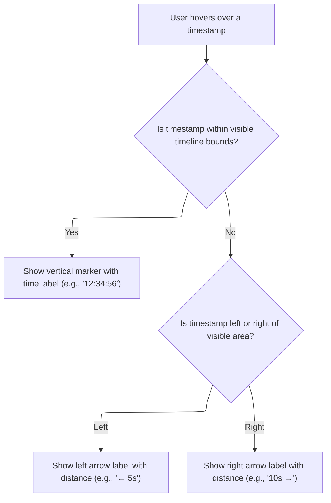

This document describes how the timeline canvas is rendered to visually reflect the current state, including tick marks, selected regions, hover indicators, and note highlights. The process takes into account user selections, hover position, and notes, and outputs an updated visual timeline.

# Setting Up the Timeline Canvas

<SwmSnippet path="/ui/src/frontend/timeline_page/time_selection_panel.ts" line="173">

---

In <SwmToken path="ui/src/frontend/timeline_page/time_selection_panel.ts" pos="173:1:1" line-data="  renderCanvas(ctx: CanvasRenderingContext2D, size: Size2D) {">`renderCanvas`</SwmToken>, we start by drawing the left border using <SwmToken path="ui/src/frontend/timeline_page/time_selection_panel.ts" pos="174:7:7" line-data="    ctx.fillStyle = COLOR_BORDER;">`COLOR_BORDER`</SwmToken> and reserving <SwmToken path="ui/src/frontend/timeline_page/time_selection_panel.ts" pos="175:5:5" line-data="    ctx.fillRect(TRACK_SHELL_WIDTH - 1, 0, 1, size.height);">`TRACK_SHELL_WIDTH`</SwmToken> for the shell area. We then adjust the drawing area for the main timeline by subtracting <SwmToken path="ui/src/frontend/timeline_page/time_selection_panel.ts" pos="175:5:5" line-data="    ctx.fillRect(TRACK_SHELL_WIDTH - 1, 0, 1, size.height);">`TRACK_SHELL_WIDTH`</SwmToken> from the width. The context is saved, shifted right, and clipped to this new area, so when we call <SwmToken path="ui/src/frontend/timeline_page/time_selection_panel.ts" pos="182:3:3" line-data="    this.renderPanel(ctx, trackSize);">`renderPanel`</SwmToken> next, it only draws inside the main track area, not over the shell or border.

```typescript
  renderCanvas(ctx: CanvasRenderingContext2D, size: Size2D) {
    ctx.fillStyle = COLOR_BORDER;
    ctx.fillRect(TRACK_SHELL_WIDTH - 1, 0, 1, size.height);

    const trackSize = {...size, width: size.width - TRACK_SHELL_WIDTH};

    ctx.save();
    ctx.translate(TRACK_SHELL_WIDTH, 0);
    canvasClip(ctx, 0, 0, trackSize.width, trackSize.height);
    this.renderPanel(ctx, trackSize);
```

---

</SwmSnippet>

## Drawing Timeline Ticks and Selections

```mermaid
%%{init: {"flowchart": {"defaultRenderer": "elk"}} }%%
flowchart TD
  node1["Draw timeline tick marks if visible"]
  click node1 openCode "ui/src/frontend/timeline_page/time_selection_panel.ts:194:203"
  node1 --> node2{"Is there a selected time span, area, or event?"}
  click node2 openCode "ui/src/frontend/timeline_page/time_selection_panel.ts:208:229"
  node2 -->|"Yes"| node3["Highlighting Selected Timeline Regions"]
  
  node2 -->|"No"| node4{"Is user hovering over a timestamp?"}
  click node4 openCode "ui/src/frontend/timeline_page/time_selection_panel.ts:231:238"
  node4 -->|"Yes"| node5["Drawing the Hover Indicator and Out-of-View Labels"]
  
  node4 -->|"No"| loop1
  subgraph loop1["Highlighting Selected Timeline Regions"]
    loop1["Highlighting Selected Timeline Regions"]
    
  end
classDef HeadingStyle fill:#777777,stroke:#333,stroke-width:2px;
click node3 goToHeading "Highlighting Selected Timeline Regions"
node3:::HeadingStyle
click node5 goToHeading "Drawing the Hover Indicator and Out-of-View Labels"
node5:::HeadingStyle
click loop1 goToHeading "Highlighting Selected Timeline Regions"
loop1:::HeadingStyle

%% Swimm:
%% %%{init: {"flowchart": {"defaultRenderer": "elk"}} }%%
%% flowchart TD
%%   node1["Draw timeline tick marks if visible"]
%%   click node1 openCode "<SwmPath>[ui/…/timeline_page/time_selection_panel.ts](ui/src/frontend/timeline_page/time_selection_panel.ts)</SwmPath>:194:203"
%%   node1 --> node2{"Is there a selected time span, area, or event?"}
%%   click node2 openCode "<SwmPath>[ui/…/timeline_page/time_selection_panel.ts](ui/src/frontend/timeline_page/time_selection_panel.ts)</SwmPath>:208:229"
%%   node2 -->|"Yes"| node3["Highlighting Selected Timeline Regions"]
%%   
%%   node2 -->|"No"| node4{"Is user hovering over a timestamp?"}
%%   click node4 openCode "<SwmPath>[ui/…/timeline_page/time_selection_panel.ts](ui/src/frontend/timeline_page/time_selection_panel.ts)</SwmPath>:231:238"
%%   node4 -->|"Yes"| node5["Drawing the Hover Indicator and Out-of-View Labels"]
%%   
%%   node4 -->|"No"| loop1
%%   subgraph loop1["Highlighting Selected Timeline Regions"]
%%     loop1["Highlighting Selected Timeline Regions"]
%%     
%%   end
%% classDef HeadingStyle fill:#777777,stroke:#333,stroke-width:2px;
%% click node3 goToHeading "Highlighting Selected Timeline Regions"
%% node3:::HeadingStyle
%% click node5 goToHeading "Drawing the Hover Indicator and Out-of-View Labels"
%% node5:::HeadingStyle
%% click loop1 goToHeading "Highlighting Selected Timeline Regions"
%% loop1:::HeadingStyle
```

<SwmSnippet path="/ui/src/frontend/timeline_page/time_selection_panel.ts" line="186">

---

In <SwmToken path="ui/src/frontend/timeline_page/time_selection_panel.ts" pos="186:3:3" line-data="  private renderPanel(ctx: CanvasRenderingContext2D, size: Size2D): void {">`renderPanel`</SwmToken>, we figure out the visible time range and use it to generate major tick marks spaced to fit the panel width. Each tick is mapped to a pixel position and drawn as a vertical line, segmenting the timeline visually.

```typescript
  private renderPanel(ctx: CanvasRenderingContext2D, size: Size2D): void {
    const visibleWindow = this.trace.timeline.visibleWindow;
    const timescale = new TimeScale(visibleWindow, {
      left: 0,
      right: size.width,
    });
    const timespan = visibleWindow.toTimeSpan();

    if (size.width > 0 && timespan.duration > 0n) {
      const maxMajorTicks = getMaxMajorTicks(size.width);
      const offset = this.trace.timeline.getTimeAxisOrigin();
      const tickGen = generateTicks(timespan, maxMajorTicks, offset);
      for (const {type, time} of tickGen) {
        const px = Math.floor(timescale.timeToPx(time));
        if (type === TickType.MAJOR) {
          ctx.fillRect(px, 0, 1, size.height);
        }
      }
```

---

</SwmSnippet>

<SwmSnippet path="/ui/src/frontend/timeline_page/time_selection_panel.ts" line="206">

---

After drawing ticks, we check if there's a selected span or area, or a selected event. Depending on what's selected, we call <SwmToken path="ui/src/frontend/timeline_page/time_selection_panel.ts" pos="211:3:3" line-data="      this.renderSpan(ctx, timescale, size, start, end);">`renderSpan`</SwmToken> (or <SwmToken path="ui/src/frontend/timeline_page/time_selection_panel.ts" pos="224:3:3" line-data="          this.renderInstantEvent(ctx, timescale, size, selection.ts);">`renderInstantEvent`</SwmToken> for zero-duration events) to highlight the relevant region or marker on the timeline.

```typescript
    const localSpan = this.trace.timeline.selectedSpan;
    const selection = this.trace.selection.selection;
    if (localSpan !== undefined) {
      const start = Time.min(localSpan.start, localSpan.end);
      const end = Time.max(localSpan.start, localSpan.end);
      this.renderSpan(ctx, timescale, size, start, end);
    } else {
      if (selection.kind === 'area') {
        const start = Time.min(selection.start, selection.end);
        const end = Time.max(selection.start, selection.end);
        this.renderSpan(ctx, timescale, size, start, end);
      } else if (
        selection.kind === 'track_event' &&
        selection.dur !== undefined
      ) {
        const start = selection.ts;
        const end = Time.add(selection.ts, selection.dur);
        if (selection.dur === 0n) {
          this.renderInstantEvent(ctx, timescale, size, selection.ts);
        } else if (end > start) {
          this.renderSpan(ctx, timescale, size, start, end);
        }
      }
    }

```

---

</SwmSnippet>

### Highlighting Selected Timeline Regions

See <SwmLink doc-title="Displaying a Selected Time Span on the Timeline">[Displaying a Selected Time Span on the Timeline](/.swm/displaying-a-selected-time-span-on-the-timeline.t15azf9k.sw.md)</SwmLink>

### Handling Hover and Note Rendering

<SwmSnippet path="/ui/src/frontend/timeline_page/time_selection_panel.ts" line="231">

---

Back in <SwmToken path="ui/src/frontend/timeline_page/time_selection_panel.ts" pos="182:3:3" line-data="    this.renderPanel(ctx, trackSize);">`renderPanel`</SwmToken>, after handling selections, we check if there's a hover cursor timestamp. If so, we call <SwmToken path="ui/src/frontend/timeline_page/time_selection_panel.ts" pos="232:3:3" line-data="      this.renderHover(">`renderHover`</SwmToken> to draw a visual indicator at that position, giving users feedback as they move the mouse over the timeline.

```typescript
    if (this.trace.timeline.hoverCursorTimestamp !== undefined) {
      this.renderHover(
        ctx,
        timescale,
        size,
        this.trace.timeline.hoverCursorTimestamp,
      );
    }

```

---

</SwmSnippet>

### Drawing the Hover Indicator and Out-of-View Labels



<SwmSnippet path="/ui/src/frontend/timeline_page/time_selection_panel.ts" line="251">

---

In <SwmToken path="ui/src/frontend/timeline_page/time_selection_panel.ts" pos="251:1:1" line-data="  renderHover(">`renderHover`</SwmToken>, we figure out where the hover timestamp maps to in pixels. If it's inside the panel, we draw a vertical bar and label. If it's outside, we use <SwmToken path="ui/src/frontend/timeline_page/time_selection_panel.ts" pos="21:12:12" line-data="import {formatDuration} from &#39;../../components/time_utils&#39;;">`time_utils`</SwmToken> to format a label showing how far out of bounds it is, and draw that at the edge. This keeps users oriented even when hovering outside the visible area.

```typescript
  renderHover(
    ctx: CanvasRenderingContext2D,
    timescale: TimeScale,
    size: Size2D,
    ts: time,
  ) {
    const xPos = Math.floor(timescale.timeToPx(ts));
    const bounds = this.getBBoxFromSize(size);

    const hoverVisible = bounds.x <= xPos && xPos <= bounds.x + bounds.width;

    if (hoverVisible) {
      const domainTime = this.trace.timeline.toDomainTime(ts);
      const label = this.stringifyTimestamp(domainTime);
      drawIBar(ctx, xPos, bounds, label);
      return;
    }

    ctx.save();
    ctx.font = `10px ${FONT_COMPACT}`;
    ctx.textBaseline = 'middle';

    const yMid = Math.floor(bounds.height / 2);

    const {label, labelWidth, textX} = (() => {
      if (xPos < bounds.x) {
        const distance = Time.sub(timescale.timeSpan.start.toTime(), ts);
        const label = `← ${formatDuration(this.trace, distance)}`;
        const labelWidth = ctx.measureText(label).width;
        return {
          textX: bounds.x,
          label,
          labelWidth,
        };
      } else {
        const distance = Time.sub(ts, timescale.timeSpan.end.toTime());
        const label = `${formatDuration(this.trace, distance)} →`;
        const labelWidth = ctx.measureText(label).width;
        return {
          label,
          labelWidth,
          textX: bounds.x + bounds.width - labelWidth,
        };
      }
    })();

```

---

</SwmSnippet>

<SwmSnippet path="/ui/src/frontend/timeline_page/time_selection_panel.ts" line="297">

---

After getting the formatted label and position from <SwmToken path="ui/src/frontend/timeline_page/time_selection_panel.ts" pos="21:12:12" line-data="import {formatDuration} from &#39;../../components/time_utils&#39;;">`time_utils`</SwmToken>, we draw a background rectangle and the label text at the calculated spot, then restore the context. This wraps up the hover rendering in <SwmToken path="ui/src/frontend/timeline_page/time_selection_panel.ts" pos="232:3:3" line-data="      this.renderHover(">`renderHover`</SwmToken>, making sure the label stands out.

```typescript
    ctx.fillStyle = COLOR_BACKGROUND;
    ctx.fillRect(textX - 1, 0, labelWidth + 2, bounds.height);
    ctx.fillStyle = COLOR_TEXT;
    ctx.fillText(label, textX, yMid);
    ctx.restore();
  }
```

---

</SwmSnippet>

### Rendering Note Highlights

```mermaid
%%{init: {"flowchart": {"defaultRenderer": "elk"}} }%%
flowchart TD
  node1["Start rendering time selection panel"]
  click node1 openCode "ui/src/frontend/timeline_page/time_selection_panel.ts:240:249"
  subgraph loop1["For each note in timeline"]
    node1 --> node2{"Is note type 'SPAN'?"}
    click node2 openCode "ui/src/frontend/timeline_page/time_selection_panel.ts:241:243"
    node2 -->|"Yes"| node3{"Is this note selected? (selection.kind = 'note' and selection.id = note.id)"}
    click node3 openCode "ui/src/frontend/timeline_page/time_selection_panel.ts:241:243"
    node2 -->|"No"| node4["Continue to next note"]
    click node4 openCode "ui/src/frontend/timeline_page/time_selection_panel.ts:246:246"
    node3 -->|"Yes"| node5["Render selected time span"]
    click node5 openCode "ui/src/frontend/timeline_page/time_selection_panel.ts:244:245"
    node3 -->|"No"| node4
    node5 --> node4
  end

classDef HeadingStyle fill:#777777,stroke:#333,stroke-width:2px;

%% Swimm:
%% %%{init: {"flowchart": {"defaultRenderer": "elk"}} }%%
%% flowchart TD
%%   node1["Start rendering time selection panel"]
%%   click node1 openCode "<SwmPath>[ui/…/timeline_page/time_selection_panel.ts](ui/src/frontend/timeline_page/time_selection_panel.ts)</SwmPath>:240:249"
%%   subgraph loop1["For each note in timeline"]
%%     node1 --> node2{"Is note type 'SPAN'?"}
%%     click node2 openCode "<SwmPath>[ui/…/timeline_page/time_selection_panel.ts](ui/src/frontend/timeline_page/time_selection_panel.ts)</SwmPath>:241:243"
%%     node2 -->|"Yes"| node3{"Is this note selected? (<SwmToken path="ui/src/frontend/timeline_page/time_selection_panel.ts" pos="213:4:6" line-data="      if (selection.kind === &#39;area&#39;) {">`selection.kind`</SwmToken> = 'note' and <SwmToken path="ui/src/frontend/timeline_page/time_selection_panel.ts" pos="242:13:15" line-data="        selection.kind === &#39;note&#39; &amp;&amp; selection.id === note.id;">`selection.id`</SwmToken> = <SwmToken path="ui/src/frontend/timeline_page/time_selection_panel.ts" pos="242:19:21" line-data="        selection.kind === &#39;note&#39; &amp;&amp; selection.id === note.id;">`note.id`</SwmToken>)"}
%%     click node3 openCode "<SwmPath>[ui/…/timeline_page/time_selection_panel.ts](ui/src/frontend/timeline_page/time_selection_panel.ts)</SwmPath>:241:243"
%%     node2 -->|"No"| node4["Continue to next note"]
%%     click node4 openCode "<SwmPath>[ui/…/timeline_page/time_selection_panel.ts](ui/src/frontend/timeline_page/time_selection_panel.ts)</SwmPath>:246:246"
%%     node3 -->|"Yes"| node5["Render selected time span"]
%%     click node5 openCode "<SwmPath>[ui/…/timeline_page/time_selection_panel.ts](ui/src/frontend/timeline_page/time_selection_panel.ts)</SwmPath>:244:245"
%%     node3 -->|"No"| node4
%%     node5 --> node4
%%   end
%% 
%% classDef HeadingStyle fill:#777777,stroke:#333,stroke-width:2px;
```



<SwmSnippet path="/ui/src/frontend/timeline_page/time_selection_panel.ts" line="240">

---

Back in <SwmToken path="ui/src/frontend/timeline_page/time_selection_panel.ts" pos="182:3:3" line-data="    this.renderPanel(ctx, trackSize);">`renderPanel`</SwmToken>, after handling the hover, we loop through notes and, if a note is selected and of type 'SPAN', we call <SwmToken path="ui/src/frontend/timeline_page/time_selection_panel.ts" pos="244:3:3" line-data="        this.renderSpan(ctx, timescale, size, note.start, note.end);">`renderSpan`</SwmToken> to highlight its region. This keeps user annotations visible and interactive.

```typescript
    for (const note of this.trace.notes.notes.values()) {
      const noteIsSelected =
        selection.kind === 'note' && selection.id === note.id;
      if (note.noteType === 'SPAN' && noteIsSelected) {
        this.renderSpan(ctx, timescale, size, note.start, note.end);
      }
    }

```

---

</SwmSnippet>

<SwmSnippet path="/ui/src/frontend/timeline_page/time_selection_panel.ts" line="248">

---

After all the drawing in <SwmToken path="ui/src/frontend/timeline_page/time_selection_panel.ts" pos="182:3:3" line-data="    this.renderPanel(ctx, trackSize);">`renderPanel`</SwmToken>, we restore the canvas context to clean up any changes made (like translation or clipping), so nothing leaks into other drawing code.

```typescript
    ctx.restore();
  }
```

---

</SwmSnippet>

## Finalizing Canvas State

<SwmSnippet path="/ui/src/frontend/timeline_page/time_selection_panel.ts" line="183">

---

After <SwmToken path="ui/src/frontend/timeline_page/time_selection_panel.ts" pos="182:3:3" line-data="    this.renderPanel(ctx, trackSize);">`renderPanel`</SwmToken> finishes, we restore the canvas context in <SwmToken path="ui/src/frontend/timeline_page/time_selection_panel.ts" pos="173:1:1" line-data="  renderCanvas(ctx: CanvasRenderingContext2D, size: Size2D) {">`renderCanvas`</SwmToken> to undo any translation or clipping, so the rest of the canvas stays unaffected.

```typescript
    ctx.restore();
  }
```

---

</SwmSnippet>

&nbsp;

*This is an auto-generated document by Swimm 🌊 and has not yet been verified by a human*

<SwmMeta version="3.0.0" repo-id="Z2l0aHViJTNBJTNBY3BsdXNwbHVzLXBlcmZldHRvJTNBJTNBcmljYXJkb2xvcGV6Zw==" repo-name="cplusplus-perfetto"><sup>Powered by [Swimm](https://app.swimm.io/)</sup></SwmMeta>
