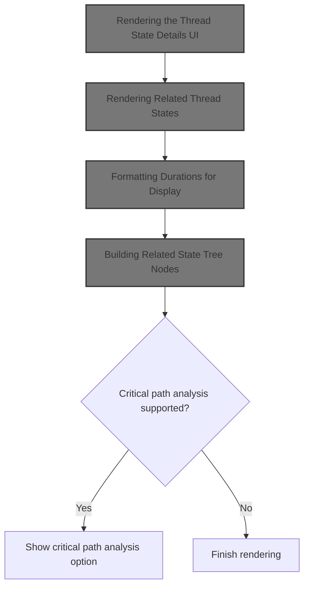

This document explains how the trace analysis UI presents detailed information about a selected thread state and its relationships. The flow receives thread state data from a trace and displays it in an interactive panel, including related states and formatted durations. Users can also initiate a critical path analysis if supported.



# Rendering the Thread State Details UI

```mermaid
%%{init: {"flowchart": {"defaultRenderer": "elk"}} }%%
flowchart TD
    node1["Display Thread State Details Panel (includes description/loading text)"]
    click node1 openCode "ui/src/plugins/dev.perfetto.Sched/thread_state_details_panel.ts:136:156"
    node1 --> node2{"Is thread state data available?"}
    click node2 openCode "ui/src/plugins/dev.perfetto.Sched/thread_state_details_panel.ts:147:147"
    node2 -->|"Yes"| node3["Show thread state details"]
    click node3 openCode "ui/src/plugins/dev.perfetto.Sched/thread_state_details_panel.ts:147:147"
    node2 -->|"No"| node4["Skip details"]
    click node4 openCode "ui/src/plugins/dev.perfetto.Sched/thread_state_details_panel.ts:147:147"
    node3 --> node5["Show related thread states"]
    click node5 openCode "ui/src/plugins/dev.perfetto.Sched/thread_state_details_panel.ts:152:152"
    node4 --> node5
classDef HeadingStyle fill:#777777,stroke:#333,stroke-width:2px;

%% Swimm:
%% %%{init: {"flowchart": {"defaultRenderer": "elk"}} }%%
%% flowchart TD
%%     node1["Display Thread State Details Panel (includes description/loading text)"]
%%     click node1 openCode "<SwmPath>[ui/…/dev.perfetto.Sched/thread_state_details_panel.ts](ui/src/plugins/dev.perfetto.Sched/thread_state_details_panel.ts)</SwmPath>:136:156"
%%     node1 --> node2{"Is thread state data available?"}
%%     click node2 openCode "<SwmPath>[ui/…/dev.perfetto.Sched/thread_state_details_panel.ts](ui/src/plugins/dev.perfetto.Sched/thread_state_details_panel.ts)</SwmPath>:147:147"
%%     node2 -->|"Yes"| node3["Show thread state details"]
%%     click node3 openCode "<SwmPath>[ui/…/dev.perfetto.Sched/thread_state_details_panel.ts](ui/src/plugins/dev.perfetto.Sched/thread_state_details_panel.ts)</SwmPath>:147:147"
%%     node2 -->|"No"| node4["Skip details"]
%%     click node4 openCode "<SwmPath>[ui/…/dev.perfetto.Sched/thread_state_details_panel.ts](ui/src/plugins/dev.perfetto.Sched/thread_state_details_panel.ts)</SwmPath>:147:147"
%%     node3 --> node5["Show related thread states"]
%%     click node5 openCode "<SwmPath>[ui/…/dev.perfetto.Sched/thread_state_details_panel.ts](ui/src/plugins/dev.perfetto.Sched/thread_state_details_panel.ts)</SwmPath>:152:152"
%%     node4 --> node5
%% classDef HeadingStyle fill:#777777,stroke:#333,stroke-width:2px;
```



<SwmSnippet path="/ui/src/plugins/dev.perfetto.Sched/thread_state_details_panel.ts" line="136">

---

<SwmToken path="ui/src/plugins/dev.perfetto.Sched/thread_state_details_panel.ts" pos="136:1:1" line-data="  render() {">`render`</SwmToken> sets up the UI for the thread state details panel. It returns a <SwmToken path="ui/src/plugins/dev.perfetto.Sched/thread_state_details_panel.ts" pos="138:11:11" line-data="    // &quot;Pinned&quot; views in DetailsShell.">`DetailsShell`</SwmToken> with a title and description, and inside it, a <SwmToken path="ui/src/plugins/dev.perfetto.Sched/thread_state_details_panel.ts" pos="143:1:1" line-data="        GridLayout,">`GridLayout`</SwmToken> with two sections: one for the main thread state details (if available), and one for related thread states. We call <SwmToken path="ui/src/plugins/dev.perfetto.Sched/thread_state_details_panel.ts" pos="152:3:3" line-data="          this.renderRelatedThreadStates(),">`renderRelatedThreadStates`</SwmToken> next to handle the rendering of those related states, keeping the main render logic clean and separating concerns.

```typescript
  render() {
    // TODO(altimin/stevegolton): Differentiate between "Current Selection" and
    // "Pinned" views in DetailsShell.
    return m(
      DetailsShell,
      {title: 'Thread State', description: this.renderLoadingText()},
      m(
        GridLayout,
        m(
          Section,
          {title: 'Details'},
          this.threadState && this.renderTree(this.threadState),
        ),
        m(
          Section,
          {title: 'Related thread states'},
          this.renderRelatedThreadStates(),
        ),
      ),
    );
  }
```

---

</SwmSnippet>

# Rendering Related Thread States

<SwmSnippet path="/ui/src/plugins/dev.perfetto.Sched/thread_state_details_panel.ts" line="231">

---

In <SwmToken path="ui/src/plugins/dev.perfetto.Sched/thread_state_details_panel.ts" pos="231:3:3" line-data="  private renderRelatedThreadStates(): m.Children {">`renderRelatedThreadStates`</SwmToken>, we build the UI for related thread states by checking for previous, next, waker, and wakee states, and rendering them with helper functions. We need to call into <SwmPath>[ui/…/components/time_utils.ts](ui/src/components/time_utils.ts)</SwmPath> next to format durations for display, since labels and timestamps for these states depend on properly formatted time values.

```typescript
  private renderRelatedThreadStates(): m.Children {
    if (this.threadState === undefined || this.relatedStates === undefined) {
      return 'Loading';
    }
    const startTs = this.threadState.ts;
    const renderRef = (state: ThreadState, name?: string) =>
      m(ThreadStateRef, {
        trace: this.trace,
        id: state.id,
        name,
      });

    const nameForNextOrPrev = (threadState: ThreadState) =>
      `${threadState.state} for ${formatDuration(this.trace, threadState.dur)}`;

    const renderWaker = (related: RelatedThreadStates) => {
      // Could be absent if:
      // * this thread state wasn't woken up (e.g. it is a running slice).
      // * the wakeup is from an interrupt during the idle process (which
      //   isn't populated in thread_state).
      // * at the start of the trace, before all per-cpu scheduling is known.
      const hasWakerId = related.waker !== undefined;
      // Interrupt context for the wakeups is absent from older traces.
      const hasInterruptCtx = related.wakerInterruptCtx !== undefined;

      if (!hasWakerId && !hasInterruptCtx) {
        return null;
      }
      if (related.wakerInterruptCtx) {
        return m(TreeNode, {
          left: 'Woken by',
          right: `Interrupt`,
        });
      }
      return (
        related.waker &&
        m(TreeNode, {
          left: hasInterruptCtx ? 'Woken by' : 'Woken by (maybe interrupt)',
          right: renderRef(
            related.waker,
            getFullThreadName(related.waker.thread),
          ),
        })
      );
    };

    const renderWakees = (related: RelatedThreadStates) => {
      if (related.wakee === undefined || related.wakee.length == 0) {
        return null;
      }
      const hasInterruptCtx = related.wakee[0].wakerInterruptCtx !== undefined;
      return m(
        TreeNode,
        {
          left: hasInterruptCtx
            ? 'Woken threads'
            : 'Woken threads (maybe interrupt)',
        },
        related.wakee.map((state) =>
          m(TreeNode, {
            left: m(Timestamp, {
              trace: this.trace,
              ts: state.ts,
              display: `+${formatDuration(this.trace, state.ts - startTs)}`,
            }),
            right: renderRef(state, getFullThreadName(state.thread)),
          }),
        ),
      );
    };

```

---

</SwmSnippet>

## Formatting Durations for Display

```mermaid
%%{init: {"flowchart": {"defaultRenderer": "elk"}} }%%
flowchart TD
  node1["Receive duration and user time format"]
  click node1 openCode "ui/src/components/time_utils.ts:32:54"
  node1 --> node2{"Which time format?"}
  click node2 openCode "ui/src/components/time_utils.ts:34:50"
  node2 -->|"UTC/TraceTz/Timecode/CustomTimezone"| node3{"Which precision?"}
  node2 -->|TraceNs| node4["Show as raw number (for debugging)"]
  node2 -->|TraceNsLocale| node5["Show as localized number (for display)"]
  node2 -->|"Seconds"| node6["Show as seconds (for user display)"]
  node2 -->|"Milliseconds"| node7["Show as milliseconds (for user display)"]
  node2 -->|"Microseconds"| node8["Show as microseconds (for user display)"]
  node2 -->|"Invalid format"| node9["Show error (invalid format)"]
  click node3 openCode "ui/src/components/time_utils.ts:56:67"
  node3 -->|HumanReadable| node10["Show as human-friendly text (e.g., '2 min 5 s')"]
  node3 -->|"Full"| node11["Show as full-precision text (e.g., '125.000 s')"]
  node3 -->|"Invalid precision"| node12["Show error (invalid precision)"]
  click node4 openCode "ui/src/components/time_utils.ts:41:41"
  click node5 openCode "ui/src/components/time_utils.ts:43:43"
  click node6 openCode "ui/src/components/time_utils.ts:45:45"
  click node7 openCode "ui/src/components/time_utils.ts:47:47"
  click node8 openCode "ui/src/components/time_utils.ts:49:49"
  click node9 openCode "ui/src/components/time_utils.ts:52:53"
  click node10 openCode "ui/src/components/time_utils.ts:60:60"
  click node11 openCode "ui/src/components/time_utils.ts:62:62"
  click node12 openCode "ui/src/components/time_utils.ts:65:66"
classDef HeadingStyle fill:#777777,stroke:#333,stroke-width:2px;

%% Swimm:
%% %%{init: {"flowchart": {"defaultRenderer": "elk"}} }%%
%% flowchart TD
%%   node1["Receive duration and user time format"]
%%   click node1 openCode "<SwmPath>[ui/…/components/time_utils.ts](ui/src/components/time_utils.ts)</SwmPath>:32:54"
%%   node1 --> node2{"Which time format?"}
%%   click node2 openCode "<SwmPath>[ui/…/components/time_utils.ts](ui/src/components/time_utils.ts)</SwmPath>:34:50"
%%   node2 -->|"UTC/TraceTz/Timecode/CustomTimezone"| node3{"Which precision?"}
%%   node2 -->|<SwmToken path="ui/src/components/time_utils.ts" pos="40:5:5" line-data="    case TimestampFormat.TraceNs:">`TraceNs`</SwmToken>| node4["Show as raw number (for debugging)"]
%%   node2 -->|<SwmToken path="ui/src/components/time_utils.ts" pos="42:5:5" line-data="    case TimestampFormat.TraceNsLocale:">`TraceNsLocale`</SwmToken>| node5["Show as localized number (for display)"]
%%   node2 -->|"Seconds"| node6["Show as seconds (for user display)"]
%%   node2 -->|"Milliseconds"| node7["Show as milliseconds (for user display)"]
%%   node2 -->|"Microseconds"| node8["Show as microseconds (for user display)"]
%%   node2 -->|"Invalid format"| node9["Show error (invalid format)"]
%%   click node3 openCode "<SwmPath>[ui/…/components/time_utils.ts](ui/src/components/time_utils.ts)</SwmPath>:56:67"
%%   node3 -->|<SwmToken path="ui/src/components/time_utils.ts" pos="59:5:5" line-data="    case DurationPrecision.HumanReadable:">`HumanReadable`</SwmToken>| node10["Show as human-friendly text (<SwmToken path="ui/src/plugins/dev.perfetto.Sched/thread_state_details_panel.ts" pos="248:20:22" line-data="      // * this thread state wasn&#39;t woken up (e.g. it is a running slice).">`e.g`</SwmToken>., '2 min 5 s')"]
%%   node3 -->|"Full"| node11["Show as full-precision text (<SwmToken path="ui/src/plugins/dev.perfetto.Sched/thread_state_details_panel.ts" pos="248:20:22" line-data="      // * this thread state wasn&#39;t woken up (e.g. it is a running slice).">`e.g`</SwmToken>., '125.000 s')"]
%%   node3 -->|"Invalid precision"| node12["Show error (invalid precision)"]
%%   click node4 openCode "<SwmPath>[ui/…/components/time_utils.ts](ui/src/components/time_utils.ts)</SwmPath>:41:41"
%%   click node5 openCode "<SwmPath>[ui/…/components/time_utils.ts](ui/src/components/time_utils.ts)</SwmPath>:43:43"
%%   click node6 openCode "<SwmPath>[ui/…/components/time_utils.ts](ui/src/components/time_utils.ts)</SwmPath>:45:45"
%%   click node7 openCode "<SwmPath>[ui/…/components/time_utils.ts](ui/src/components/time_utils.ts)</SwmPath>:47:47"
%%   click node8 openCode "<SwmPath>[ui/…/components/time_utils.ts](ui/src/components/time_utils.ts)</SwmPath>:49:49"
%%   click node9 openCode "<SwmPath>[ui/…/components/time_utils.ts](ui/src/components/time_utils.ts)</SwmPath>:52:53"
%%   click node10 openCode "<SwmPath>[ui/…/components/time_utils.ts](ui/src/components/time_utils.ts)</SwmPath>:60:60"
%%   click node11 openCode "<SwmPath>[ui/…/components/time_utils.ts](ui/src/components/time_utils.ts)</SwmPath>:62:62"
%%   click node12 openCode "<SwmPath>[ui/…/components/time_utils.ts](ui/src/components/time_utils.ts)</SwmPath>:65:66"
%% classDef HeadingStyle fill:#777777,stroke:#333,stroke-width:2px;
```



<SwmSnippet path="/ui/src/components/time_utils.ts" line="32">

---

In <SwmToken path="ui/src/components/time_utils.ts" pos="32:4:4" line-data="export function formatDuration(trace: Trace, dur: duration): string {">`formatDuration`</SwmToken>, we pick the right formatting method for a duration based on the trace's timestamp format. For some formats, we call <SwmToken path="ui/src/components/time_utils.ts" pos="39:3:3" line-data="      return renderFormattedDuration(trace, dur);">`renderFormattedDuration`</SwmToken> to handle precision, for others we use string or locale conversion, or Duration class methods. This lets us display durations in the format expected by the trace or user.

```typescript
export function formatDuration(trace: Trace, dur: duration): string {
  const fmt = trace.timeline.timestampFormat;
  switch (fmt) {
    case TimestampFormat.UTC:
    case TimestampFormat.TraceTz:
    case TimestampFormat.Timecode:
    case TimestampFormat.CustomTimezone:
      return renderFormattedDuration(trace, dur);
    case TimestampFormat.TraceNs:
      return dur.toString();
    case TimestampFormat.TraceNsLocale:
      return dur.toLocaleString();
    case TimestampFormat.Seconds:
      return Duration.formatSeconds(dur);
    case TimestampFormat.Milliseconds:
      return Duration.formatMilliseconds(dur);
    case TimestampFormat.Microseconds:
      return Duration.formatMicroseconds(dur);
    default:
```

---

</SwmSnippet>

<SwmSnippet path="/ui/src/components/time_utils.ts" line="56">

---

<SwmToken path="ui/src/components/time_utils.ts" pos="56:2:2" line-data="function renderFormattedDuration(trace: Trace, dur: duration): string {">`renderFormattedDuration`</SwmToken> formats a duration based on the trace's <SwmToken path="ui/src/components/time_utils.ts" pos="57:11:11" line-data="  const fmt = trace.timeline.durationPrecision;">`durationPrecision`</SwmToken> setting. It switches between human-readable and full formats, using Duration helpers. If the precision isn't recognized, it throws an error.

```typescript
function renderFormattedDuration(trace: Trace, dur: duration): string {
  const fmt = trace.timeline.durationPrecision;
  switch (fmt) {
    case DurationPrecision.HumanReadable:
      return Duration.humanise(dur);
    case DurationPrecision.Full:
      return Duration.format(dur);
    default:
      const x: never = fmt;
      throw new Error(`Invalid format ${x}`);
  }
}
```

---

</SwmSnippet>

<SwmSnippet path="/ui/src/components/time_utils.ts" line="51">

---

We just returned from <SwmToken path="ui/src/plugins/dev.perfetto.Sched/thread_state_details_panel.ts" pos="244:12:12" line-data="      `${threadState.state} for ${formatDuration(this.trace, threadState.dur)}`;">`formatDuration`</SwmToken> in <SwmPath>[ui/…/components/time_utils.ts](ui/src/components/time_utils.ts)</SwmPath>. If the timestamp format isn't recognized, the function throws an error, stopping the flow and flagging a problem with the trace configuration or data.

```typescript
      const x: never = fmt;
      throw new Error(`Invalid format ${x}`);
  }
}
```

---

</SwmSnippet>

## Building Related State Tree Nodes

```mermaid
%%{init: {"flowchart": {"defaultRenderer": "elk"}} }%%
flowchart TD
  node1["Render thread state details panel"]
  click node1 openCode "ui/src/plugins/dev.perfetto.Sched/thread_state_details_panel.ts:302:338"
  node1 --> node2{"Previous state exists?"}
  click node2 openCode "ui/src/plugins/dev.perfetto.Sched/thread_state_details_panel.ts:304:311"
  node2 -->|"Yes"| node3["Show previous state"]
  click node3 openCode "ui/src/plugins/dev.perfetto.Sched/thread_state_details_panel.ts:304:311"
  node2 -->|"No"| node4
  node3 --> node4
  node4{"Next state exists?"}
  click node4 openCode "ui/src/plugins/dev.perfetto.Sched/thread_state_details_panel.ts:312:319"
  node4 -->|"Yes"| node5["Show next state"]
  click node5 openCode "ui/src/plugins/dev.perfetto.Sched/thread_state_details_panel.ts:312:319"
  node4 -->|"No"| node6
  node5 --> node6
  node6["Show waker"]
  click node6 openCode "ui/src/plugins/dev.perfetto.Sched/thread_state_details_panel.ts:320:320"
  node6 --> node7{"Wakees exist?"}
  click node7 openCode "ui/src/plugins/dev.perfetto.Sched/thread_state_details_panel.ts:321:300"
  node7 -->|"Yes"| loop1
  node7 -->|"No"| node9
  subgraph loop1["For each wakee"]
    node8["Show wakee"]
    click node8 openCode "ui/src/plugins/dev.perfetto.Sched/thread_state_details_panel.ts:289:297"
  end
  loop1 --> node9
  node9{"Critical path analysis available?"}
  click node9 openCode "ui/src/plugins/dev.perfetto.Sched/thread_state_details_panel.ts:323:336"
  node9 -->|"Yes"| node10["Show critical path analysis button"]
  click node10 openCode "ui/src/plugins/dev.perfetto.Sched/thread_state_details_panel.ts:324:335"
  node9 -->|"No"| node11["Finish rendering"]
  click node11 openCode "ui/src/plugins/dev.perfetto.Sched/thread_state_details_panel.ts:337:338"

classDef HeadingStyle fill:#777777,stroke:#333,stroke-width:2px;

%% Swimm:
%% %%{init: {"flowchart": {"defaultRenderer": "elk"}} }%%
%% flowchart TD
%%   node1["Render thread state details panel"]
%%   click node1 openCode "<SwmPath>[ui/…/dev.perfetto.Sched/thread_state_details_panel.ts](ui/src/plugins/dev.perfetto.Sched/thread_state_details_panel.ts)</SwmPath>:302:338"
%%   node1 --> node2{"Previous state exists?"}
%%   click node2 openCode "<SwmPath>[ui/…/dev.perfetto.Sched/thread_state_details_panel.ts](ui/src/plugins/dev.perfetto.Sched/thread_state_details_panel.ts)</SwmPath>:304:311"
%%   node2 -->|"Yes"| node3["Show previous state"]
%%   click node3 openCode "<SwmPath>[ui/…/dev.perfetto.Sched/thread_state_details_panel.ts](ui/src/plugins/dev.perfetto.Sched/thread_state_details_panel.ts)</SwmPath>:304:311"
%%   node2 -->|"No"| node4
%%   node3 --> node4
%%   node4{"Next state exists?"}
%%   click node4 openCode "<SwmPath>[ui/…/dev.perfetto.Sched/thread_state_details_panel.ts](ui/src/plugins/dev.perfetto.Sched/thread_state_details_panel.ts)</SwmPath>:312:319"
%%   node4 -->|"Yes"| node5["Show next state"]
%%   click node5 openCode "<SwmPath>[ui/…/dev.perfetto.Sched/thread_state_details_panel.ts](ui/src/plugins/dev.perfetto.Sched/thread_state_details_panel.ts)</SwmPath>:312:319"
%%   node4 -->|"No"| node6
%%   node5 --> node6
%%   node6["Show waker"]
%%   click node6 openCode "<SwmPath>[ui/…/dev.perfetto.Sched/thread_state_details_panel.ts](ui/src/plugins/dev.perfetto.Sched/thread_state_details_panel.ts)</SwmPath>:320:320"
%%   node6 --> node7{"Wakees exist?"}
%%   click node7 openCode "<SwmPath>[ui/…/dev.perfetto.Sched/thread_state_details_panel.ts](ui/src/plugins/dev.perfetto.Sched/thread_state_details_panel.ts)</SwmPath>:321:300"
%%   node7 -->|"Yes"| loop1
%%   node7 -->|"No"| node9
%%   subgraph loop1["For each wakee"]
%%     node8["Show wakee"]
%%     click node8 openCode "<SwmPath>[ui/…/dev.perfetto.Sched/thread_state_details_panel.ts](ui/src/plugins/dev.perfetto.Sched/thread_state_details_panel.ts)</SwmPath>:289:297"
%%   end
%%   loop1 --> node9
%%   node9{"Critical path analysis available?"}
%%   click node9 openCode "<SwmPath>[ui/…/dev.perfetto.Sched/thread_state_details_panel.ts](ui/src/plugins/dev.perfetto.Sched/thread_state_details_panel.ts)</SwmPath>:323:336"
%%   node9 -->|"Yes"| node10["Show critical path analysis button"]
%%   click node10 openCode "<SwmPath>[ui/…/dev.perfetto.Sched/thread_state_details_panel.ts](ui/src/plugins/dev.perfetto.Sched/thread_state_details_panel.ts)</SwmPath>:324:335"
%%   node9 -->|"No"| node11["Finish rendering"]
%%   click node11 openCode "<SwmPath>[ui/…/dev.perfetto.Sched/thread_state_details_panel.ts](ui/src/plugins/dev.perfetto.Sched/thread_state_details_panel.ts)</SwmPath>:337:338"
%% 
%% classDef HeadingStyle fill:#777777,stroke:#333,stroke-width:2px;
```



<SwmSnippet path="/ui/src/plugins/dev.perfetto.Sched/thread_state_details_panel.ts" line="302">

---

We just returned from <SwmPath>[ui/…/components/time_utils.ts](ui/src/components/time_utils.ts)</SwmPath>, so now in <SwmToken path="ui/src/plugins/dev.perfetto.Sched/thread_state_details_panel.ts" pos="152:3:3" line-data="          this.renderRelatedThreadStates(),">`renderRelatedThreadStates`</SwmToken>, we use <SwmToken path="ui/src/plugins/dev.perfetto.Sched/thread_state_details_panel.ts" pos="309:1:1" line-data="              nameForNextOrPrev(this.relatedStates.prev),">`nameForNextOrPrev`</SwmToken> to build labels for previous and next states, combining their state and formatted duration for clarity before rendering them as TreeNodes.

```typescript
    return m(Stack, [
      m(Tree, [
        this.relatedStates.prev &&
          m(TreeNode, {
            left: 'Previous state',
            right: renderRef(
              this.relatedStates.prev,
              nameForNextOrPrev(this.relatedStates.prev),
            ),
          }),
        this.relatedStates.next &&
          m(TreeNode, {
            left: 'Next state',
            right: renderRef(
              this.relatedStates.next,
              nameForNextOrPrev(this.relatedStates.next),
            ),
          }),
        renderWaker(this.relatedStates),
```

---

</SwmSnippet>

<SwmSnippet path="/ui/src/plugins/dev.perfetto.Sched/thread_state_details_panel.ts" line="243">

---

<SwmToken path="ui/src/plugins/dev.perfetto.Sched/thread_state_details_panel.ts" pos="243:3:3" line-data="    const nameForNextOrPrev = (threadState: ThreadState) =&gt;">`nameForNextOrPrev`</SwmToken> builds a label by joining the thread state and its formatted duration. We call <SwmToken path="ui/src/plugins/dev.perfetto.Sched/thread_state_details_panel.ts" pos="244:12:12" line-data="      `${threadState.state} for ${formatDuration(this.trace, threadState.dur)}`;">`formatDuration`</SwmToken> next to make sure the duration part is readable and matches the trace's format.

```typescript
    const nameForNextOrPrev = (threadState: ThreadState) =>
      `${threadState.state} for ${formatDuration(this.trace, threadState.dur)}`;
```

---

</SwmSnippet>

<SwmSnippet path="/ui/src/plugins/dev.perfetto.Sched/thread_state_details_panel.ts" line="321">

---

We just returned from <SwmToken path="ui/src/plugins/dev.perfetto.Sched/thread_state_details_panel.ts" pos="243:3:3" line-data="    const nameForNextOrPrev = (threadState: ThreadState) =&gt;">`nameForNextOrPrev`</SwmToken>, so now in <SwmToken path="ui/src/plugins/dev.perfetto.Sched/thread_state_details_panel.ts" pos="152:3:3" line-data="          this.renderRelatedThreadStates(),">`renderRelatedThreadStates`</SwmToken>, we call <SwmToken path="ui/src/plugins/dev.perfetto.Sched/thread_state_details_panel.ts" pos="321:1:1" line-data="        renderWakees(this.relatedStates),">`renderWakees`</SwmToken> to display wakee thread states. After that, if the trace supports <SwmToken path="ui/src/plugins/dev.perfetto.Sched/thread_state_details_panel.ts" pos="323:9:9" line-data="      this.trace.commands.hasCommand(CRITICAL_PATH_LITE_CMD) &amp;&amp;">`CRITICAL_PATH_LITE_CMD`</SwmToken>, we render a button that lets users run a critical path analysis for the current thread.

```typescript
        renderWakees(this.relatedStates),
      ]),
      this.trace.commands.hasCommand(CRITICAL_PATH_LITE_CMD) &&
        m(ButtonBar, [
          m(Button, {
            label: 'Critical path lite',
            intent: Intent.Primary,
            variant: ButtonVariant.Filled,
            onclick: () => {
```

---

</SwmSnippet>

<SwmSnippet path="/ui/src/plugins/dev.perfetto.Sched/thread_state_details_panel.ts" line="277">

---

<SwmToken path="ui/src/plugins/dev.perfetto.Sched/thread_state_details_panel.ts" pos="277:3:3" line-data="    const renderWakees = (related: RelatedThreadStates) =&gt; {">`renderWakees`</SwmToken> checks if wakee threads exist and uses the interrupt context to pick the label. It then maps over the wakee array, rendering each as a <SwmToken path="ui/src/plugins/dev.perfetto.Sched/thread_state_details_panel.ts" pos="283:1:1" line-data="        TreeNode,">`TreeNode`</SwmToken> with a timestamp offset (using <SwmToken path="ui/src/plugins/dev.perfetto.Sched/thread_state_details_panel.ts" pos="294:6:6" line-data="              display: `+${formatDuration(this.trace, state.ts - startTs)}`,">`formatDuration`</SwmToken>) and a reference to the thread state. We call <SwmPath>[ui/…/components/time_utils.ts](ui/src/components/time_utils.ts)</SwmPath> next to format those offsets for display.

```typescript
    const renderWakees = (related: RelatedThreadStates) => {
      if (related.wakee === undefined || related.wakee.length == 0) {
        return null;
      }
      const hasInterruptCtx = related.wakee[0].wakerInterruptCtx !== undefined;
      return m(
        TreeNode,
        {
          left: hasInterruptCtx
            ? 'Woken threads'
            : 'Woken threads (maybe interrupt)',
        },
        related.wakee.map((state) =>
          m(TreeNode, {
            left: m(Timestamp, {
              trace: this.trace,
              ts: state.ts,
              display: `+${formatDuration(this.trace, state.ts - startTs)}`,
            }),
            right: renderRef(state, getFullThreadName(state.thread)),
          }),
        ),
      );
    };
```

---

</SwmSnippet>

<SwmSnippet path="/ui/src/plugins/dev.perfetto.Sched/thread_state_details_panel.ts" line="330">

---

We just returned from <SwmToken path="ui/src/plugins/dev.perfetto.Sched/thread_state_details_panel.ts" pos="277:3:3" line-data="    const renderWakees = (related: RelatedThreadStates) =&gt; {">`renderWakees`</SwmToken>, so at the end of <SwmToken path="ui/src/plugins/dev.perfetto.Sched/thread_state_details_panel.ts" pos="152:3:3" line-data="          this.renderRelatedThreadStates(),">`renderRelatedThreadStates`</SwmToken>, we finish building the UI for all related states and, if supported, add a button for running a critical path analysis. This keeps the panel interactive and focused on thread relationships.

```typescript
              this.trace.commands.runCommand(
                CRITICAL_PATH_LITE_CMD,
                this.threadState?.thread?.utid,
              );
            },
          }),
        ]),
    ]);
  }
```

---

</SwmSnippet>

&nbsp;

*This is an auto-generated document by Swimm 🌊 and has not yet been verified by a human*

<SwmMeta version="3.0.0" repo-id="Z2l0aHViJTNBJTNBY3BsdXNwbHVzLXBlcmZldHRvJTNBJTNBcmljYXJkb2xvcGV6Zw==" repo-name="cplusplus-perfetto"><sup>Powered by [Swimm](https://app.swimm.io/)</sup></SwmMeta>
