This document describes how timeline slices are rendered in the trace analysis UI. Timeline slice data and display context are used to produce a visual representation, allowing users to interpret and interact with trace data.

# Slice Geometry and Visibility Setup

<SwmSnippet path="/ui/src/components/tracks/base_slice_track.ts" line="426">

---

We start by prepping visible slices and calculating their geometry, handling instant/incomplete flags so later rendering passes can use the right positions and widths.

```typescript
  render({
    ctx,
    size,
    visibleWindow,
    timescale,
    colors,
  }: TrackRenderContext): void {
    // TODO(hjd): fonts and colors should come from the CSS and not hardcoded
    // here.

    // In any case, draw whatever we have (which might be stale/incomplete).
    let charWidth = this.charWidth;
    if (charWidth < 0) {
      // TODO(hjd): Centralize font measurement/invalidation.
      ctx.font = this.getTitleFont();
      charWidth = this.charWidth = ctx.measureText('dbpqaouk').width / 8;
    }

    // Filter only the visible slices. |this.slices| will have more slices than
    // needed because maybeRequestData() over-fetches to handle small pan/zooms.
    // We don't want to waste time drawing slices that are off screen.
    const vizSlices = this.getVisibleSlicesInternal(
      visibleWindow.start.toTime('floor'),
      visibleWindow.end.toTime('ceil'),
    );

    const selection = this.trace.selection.selection;
    const selectedId =
      selection.kind === 'track_event' && selection.trackUri === this.uri
        ? selection.eventId
        : undefined;

    if (selectedId === undefined) {
      this.selectedSlice = undefined;
    }
    let discoveredSelection: CastInternal<SliceT> | undefined;

    // Believe it or not, doing 4xO(N) passes is ~2x faster than trying to draw
    // everything in one go. The key is that state changes operations on the
    // canvas (e.g., color, fonts) dominate any number crunching we do in JS.

    const sliceHeight = this.sliceLayout.sliceHeight;
    const padding = this.sliceLayout.padding;
    const rowSpacing = this.sliceLayout.rowGap;

    // First pass: compute geometry of slices.

    // pxEnd is the last visible pixel in the visible viewport. Drawing
    // anything < 0 or > pxEnd doesn't produce any visible effect as it goes
    // beyond the visible portion of the canvas.
    const pxEnd = size.width;

    for (const slice of vizSlices) {
      // Compute the basic geometry for any visible slice, even if only
      // partially visible. This might end up with a negative x if the
      // slice starts before the visible time or with a width that overflows
      // pxEnd.
      slice.x = timescale.timeToPx(slice.startNs);
      slice.w = timescale.durationToPx(slice.durNs);

      if (slice.flags & SLICE_FLAGS_INSTANT) {
        // In the case of an instant slice, set the slice geometry on the
        // bounding box that will contain the chevron.
        slice.x -= this.instantWidthPx / 2;
        slice.w = this.instantWidthPx;
      } else if (slice.flags & SLICE_FLAGS_INCOMPLETE) {
        let widthPx;
        if (CROP_INCOMPLETE_SLICE_FLAG.get()) {
          widthPx =
            slice.x > 0
              ? Math.min(pxEnd, INCOMPLETE_SLICE_WIDTH_PX)
              : Math.max(0, INCOMPLETE_SLICE_WIDTH_PX + slice.x);
          slice.x = Math.max(slice.x, 0);
        } else {
          slice.x = Math.max(slice.x, 0);
          widthPx = pxEnd - slice.x;
        }
        slice.w = widthPx;
      } else {
        // If the slice is an actual slice, intersect the slice geometry with
        // the visible viewport (this affects only the first and last slice).
        // This is so that text is always centered even if we are zoomed in.
        // Visually if we have
        //                   [    visible viewport   ]
        //  [         slice         ]
        // The resulting geometry will be:
        //                   [slice]
        // So that the slice title stays within the visible region.
        const sliceVizLimit = Math.min(slice.x + slice.w, pxEnd);
        slice.x = Math.max(slice.x, 0);
        slice.w = sliceVizLimit - slice.x;
      }

      if (selectedId === slice.id) {
        discoveredSelection = slice;
      }
    }
```

---

</SwmSnippet>

<SwmSnippet path="/ui/src/components/tracks/base_slice_track.ts" line="524">

---

We sort slices by color to minimize fill style changes, unless timestamp order is required.

```typescript
    // Second pass: fill slices by color.
    const vizSlicesByColor = vizSlices.slice();
    if (!this.forceTimestampRenderOrder) {
      vizSlicesByColor.sort((a, b) =>
        colorCompare(a.colorScheme.base, b.colorScheme.base),
      );
    }
```

---

</SwmSnippet>

## Pivot Tree Node Sorting

```mermaid
%%{init: {"flowchart": {"defaultRenderer": "elk"}} }%%
flowchart TD
  node1{"Is sort order specified?"}
  click node1 openCode "ui/src/components/widgets/sql/pivot_table/pivot_tree_node.ts:204:204"
  node1 -->|"Yes"| node2["Recursively sort all child nodes"]
  click node2 openCode "ui/src/components/widgets/sql/pivot_table/pivot_tree_node.ts:206:208"
  node2 --> node3["Sort children according to specified order"]
  click node3 openCode "ui/src/components/widgets/sql/pivot_table/pivot_tree_node.ts:209:211"
  node3 --> node4["Rebuild children map in sorted order"]
  click node4 openCode "ui/src/components/widgets/sql/pivot_table/pivot_tree_node.ts:212:215"
  node1 -->|"No"| node5["Do nothing"]
  click node5 openCode "ui/src/components/widgets/sql/pivot_table/pivot_tree_node.ts:204:204"

  subgraph loop1["For each child node"]
    node2
  end
  subgraph loop2["For each sorted child"]
    node4
  end
classDef HeadingStyle fill:#777777,stroke:#333,stroke-width:2px;

%% Swimm:
%% %%{init: {"flowchart": {"defaultRenderer": "elk"}} }%%
%% flowchart TD
%%   node1{"Is sort order specified?"}
%%   click node1 openCode "<SwmPath>[ui/…/pivot_table/pivot_tree_node.ts](ui/src/components/widgets/sql/pivot_table/pivot_tree_node.ts)</SwmPath>:204:204"
%%   node1 -->|"Yes"| node2["Recursively sort all child nodes"]
%%   click node2 openCode "<SwmPath>[ui/…/pivot_table/pivot_tree_node.ts](ui/src/components/widgets/sql/pivot_table/pivot_tree_node.ts)</SwmPath>:206:208"
%%   node2 --> node3["Sort children according to specified order"]
%%   click node3 openCode "<SwmPath>[ui/…/pivot_table/pivot_tree_node.ts](ui/src/components/widgets/sql/pivot_table/pivot_tree_node.ts)</SwmPath>:209:211"
%%   node3 --> node4["Rebuild children map in sorted order"]
%%   click node4 openCode "<SwmPath>[ui/…/pivot_table/pivot_tree_node.ts](ui/src/components/widgets/sql/pivot_table/pivot_tree_node.ts)</SwmPath>:212:215"
%%   node1 -->|"No"| node5["Do nothing"]
%%   click node5 openCode "<SwmPath>[ui/…/pivot_table/pivot_tree_node.ts](ui/src/components/widgets/sql/pivot_table/pivot_tree_node.ts)</SwmPath>:204:204"
%% 
%%   subgraph loop1["For each child node"]
%%     node2
%%   end
%%   subgraph loop2["For each sorted child"]
%%     node4
%%   end
%% classDef HeadingStyle fill:#777777,stroke:#333,stroke-width:2px;
```



<SwmSnippet path="/ui/src/components/widgets/sql/pivot_table/pivot_tree_node.ts" line="203">

---

We recursively sort all children so the whole tree stays ordered.

```typescript
  sort(order: SortOrder) {
    if (order.length === 0) return;

    for (const child of this.children.values()) {
      child.sort(order);
    }
```

---

</SwmSnippet>

<SwmSnippet path="/ui/src/components/widgets/sql/pivot_table/pivot_tree_node.ts" line="209">

---

We sort children using a custom compare so the tree order matches the sort criteria.

```typescript
    const sorted = [...this.children.values()].sort((lhs, rhs) =>
      PivotTreeNode.compare(lhs, rhs, order),
    );
```

---

</SwmSnippet>

<SwmSnippet path="/ui/src/components/widgets/sql/pivot_table/pivot_tree_node.ts" line="288">

---

<SwmToken path="ui/src/components/widgets/sql/pivot_table/pivot_tree_node.ts" pos="288:5:5" line-data="  private static compare(">`compare`</SwmToken> checks that both nodes are siblings, then runs through each sort criterion (aggregation or pivot), comparing values and handling nulls as smallest. It uses repo-specific IDs and config structure to find the right values, and only compares pivot values at the matching depth.

```typescript
  private static compare(
    lhs: PivotTreeNode,
    rhs: PivotTreeNode,
    order: SortOrder,
  ): number {
    // Note: resolving items in `order` requires a lookup in the state. We can consider
    // optimising this and performing the lookup in `sort` instead.

    // We should only compare siblings.
    assertTrue(
      lhs.config === rhs.config &&
        lhs.depth === rhs.depth &&
        lhs.parent === rhs.parent,
    );

    const compareSqlValues = (lhs: SqlValue, rhs: SqlValue) => {
      if (lhs === rhs) return 0;
      // Nulls can't be compared, but should be considered the smallest value.
      if (lhs === null) return -1;
      if (rhs === null) return 1;
      return lhs < rhs ? -1 : 1;
    };
    for (const {type, id, direction} of order) {
      if (type === 'aggregation') {
        const index = lhs.config.aggregations.findIndex(
          (a) => aggregationId(a) === id,
        );
        // Aggregation with this index should always exist.
        // If this is not the case, we probably failed to remove sorting after
        // hiding a column.
        assertTrue(index !== -1);
        const cmp = compareSqlValues(
          lhs.getAggregationValue(index),
          rhs.getAggregationValue(index),
        );
        if (cmp !== 0) return direction === 'ASC' ? cmp : -cmp;
      } else {
        const index = lhs.config.pivots.findIndex((p) => pivotId(p) === id);
        // Pivot with this index should always exist.
        // If this is not the case, we probably failed to remove sorting after
        // hiding a column.
        assertTrue(index !== -1);
        // For pivot sorting, we only compare the pivot values at the given depth.
        if (index + 1 === lhs.depth) {
          const cmp = compareSqlValues(
            assertDefined(lhs.pivotValue),
            assertDefined(rhs.pivotValue),
          );
          if (cmp !== 0) return direction === 'ASC' ? cmp : -cmp;
        }
      }
    }
```

---

</SwmSnippet>

<SwmSnippet path="/ui/src/components/widgets/sql/pivot_table/pivot_tree_node.ts" line="212">

---

After returning from <SwmToken path="ui/src/components/widgets/sql/pivot_table/pivot_tree_node.ts" pos="210:1:3" line-data="      PivotTreeNode.compare(lhs, rhs, order),">`PivotTreeNode.compare`</SwmToken>, we clear the children and re-insert them in sorted order using their <SwmToken path="ui/src/components/widgets/sql/pivot_table/pivot_tree_node.ts" pos="214:11:11" line-data="      this.children.set(assertDefined(child.pivotValue), child);">`pivotValue`</SwmToken> as the key. This updates the tree structure to match the new sort order.

```typescript
    this.children.clear();
    for (const child of sorted) {
      this.children.set(assertDefined(child.pivotValue), child);
    }
```

---

</SwmSnippet>

## Slice Color Fill and Highlighting

```mermaid
%%{init: {"flowchart": {"defaultRenderer": "elk"}} }%%
flowchart TD
  node1["Start rendering timeline slices"]
  click node1 openCode "ui/src/components/tracks/base_slice_track.ts:531:566"
  subgraph loop1["For each slice"]
    node1 --> node2{"Is slice highlighted?"}
    click node2 openCode "ui/src/components/tracks/base_slice_track.ts:533:535"
    node2 -->|"Yes"| node3["Use highlight color"]
    click node3 openCode "ui/src/components/tracks/base_slice_track.ts:534:535"
    node2 -->|"No"| node4["Use base color"]
    click node4 openCode "ui/src/components/tracks/base_slice_track.ts:535:535"
    node3 --> node5{"Slice type?"}
    node4 --> node5
    click node5 openCode "ui/src/components/tracks/base_slice_track.ts:542:565"
    node5 -->|"Instant"| node6["Draw chevron"]
    click node6 openCode "ui/src/components/tracks/base_slice_track.ts:543:544"
    node5 -->|"Incomplete"| node7["Draw incomplete slice"]
    click node7 openCode "ui/src/components/tracks/base_slice_track.ts:545:557"
    node5 -->|"Standard"| node8["Draw standard slice"]
    click node8 openCode "ui/src/components/tracks/base_slice_track.ts:558:565"
  end
  subgraph loop2["For each slice by color"]
    node9{"Fill ratio < 1?"}
    click node9 openCode "ui/src/components/tracks/base_slice_track.ts:576:580"
    node9 -->|"Yes"| node10["Draw fill ratio overlay"]
    click node10 openCode "ui/src/components/tracks/base_slice_track.ts:585:595"
    node9 -->|"No"| node11["Skip overlay"]
    click node11 openCode "ui/src/components/tracks/base_slice_track.ts:581:582"
  end
  subgraph loop3["For each slice"]
    node12{"Has title and enough width?"}
    click node12 openCode "ui/src/components/tracks/base_slice_track.ts:603:607"
    node12 -->|"Yes"| node13["Draw title"]
    click node13 openCode "ui/src/components/tracks/base_slice_track.ts:612:621"
    node12 -->|"No"| node14["Skip title"]
    click node14 openCode "ui/src/components/tracks/base_slice_track.ts:608:609"
  end
  subgraph loop4["For each slice"]
    node15{"Has subtitle and enough width?"}
    click node15 openCode "ui/src/components/tracks/base_slice_track.ts:628:631"
    node15 -->|"Yes"| node16["Draw subtitle"]
    click node16 openCode "ui/src/components/tracks/base_slice_track.ts:635:639"
    node15 -->|"No"| node17["Skip subtitle"]
    click node17 openCode "ui/src/components/tracks/base_slice_track.ts:633:634"
  end
  node18{"Is a slice selected?"}
  click node18 openCode "ui/src/components/tracks/base_slice_track.ts:645:646"
  node18 -->|"Yes"| node19["Highlight selected slice"]
  click node19 openCode "ui/src/components/tracks/base_slice_track.ts:649:661"
  node18 -->|"No"| node20["Continue"]
  click node20 openCode "ui/src/components/tracks/base_slice_track.ts:662:663"
  node19 --> node21{"Is data fully loaded?"}
  node20 --> node21
  click node21 openCode "ui/src/components/tracks/base_slice_track.ts:664:673"
  node21 -->|"No"| node22["Show loading indicator"]
  click node22 openCode "ui/src/components/tracks/base_slice_track.ts:666:673"
  node21 -->|"Yes"| node23["Show latency arrow"]
  click node23 openCode "ui/src/components/tracks/base_slice_track.ts:679:680"

classDef HeadingStyle fill:#777777,stroke:#333,stroke-width:2px;

%% Swimm:
%% %%{init: {"flowchart": {"defaultRenderer": "elk"}} }%%
%% flowchart TD
%%   node1["Start rendering timeline slices"]
%%   click node1 openCode "<SwmPath>[ui/…/tracks/base_slice_track.ts](ui/src/components/tracks/base_slice_track.ts)</SwmPath>:531:566"
%%   subgraph loop1["For each slice"]
%%     node1 --> node2{"Is slice highlighted?"}
%%     click node2 openCode "<SwmPath>[ui/…/tracks/base_slice_track.ts](ui/src/components/tracks/base_slice_track.ts)</SwmPath>:533:535"
%%     node2 -->|"Yes"| node3["Use highlight color"]
%%     click node3 openCode "<SwmPath>[ui/…/tracks/base_slice_track.ts](ui/src/components/tracks/base_slice_track.ts)</SwmPath>:534:535"
%%     node2 -->|"No"| node4["Use base color"]
%%     click node4 openCode "<SwmPath>[ui/…/tracks/base_slice_track.ts](ui/src/components/tracks/base_slice_track.ts)</SwmPath>:535:535"
%%     node3 --> node5{"Slice type?"}
%%     node4 --> node5
%%     click node5 openCode "<SwmPath>[ui/…/tracks/base_slice_track.ts](ui/src/components/tracks/base_slice_track.ts)</SwmPath>:542:565"
%%     node5 -->|"Instant"| node6["Draw chevron"]
%%     click node6 openCode "<SwmPath>[ui/…/tracks/base_slice_track.ts](ui/src/components/tracks/base_slice_track.ts)</SwmPath>:543:544"
%%     node5 -->|"Incomplete"| node7["Draw incomplete slice"]
%%     click node7 openCode "<SwmPath>[ui/…/tracks/base_slice_track.ts](ui/src/components/tracks/base_slice_track.ts)</SwmPath>:545:557"
%%     node5 -->|"Standard"| node8["Draw standard slice"]
%%     click node8 openCode "<SwmPath>[ui/…/tracks/base_slice_track.ts](ui/src/components/tracks/base_slice_track.ts)</SwmPath>:558:565"
%%   end
%%   subgraph loop2["For each slice by color"]
%%     node9{"Fill ratio < 1?"}
%%     click node9 openCode "<SwmPath>[ui/…/tracks/base_slice_track.ts](ui/src/components/tracks/base_slice_track.ts)</SwmPath>:576:580"
%%     node9 -->|"Yes"| node10["Draw fill ratio overlay"]
%%     click node10 openCode "<SwmPath>[ui/…/tracks/base_slice_track.ts](ui/src/components/tracks/base_slice_track.ts)</SwmPath>:585:595"
%%     node9 -->|"No"| node11["Skip overlay"]
%%     click node11 openCode "<SwmPath>[ui/…/tracks/base_slice_track.ts](ui/src/components/tracks/base_slice_track.ts)</SwmPath>:581:582"
%%   end
%%   subgraph loop3["For each slice"]
%%     node12{"Has title and enough width?"}
%%     click node12 openCode "<SwmPath>[ui/…/tracks/base_slice_track.ts](ui/src/components/tracks/base_slice_track.ts)</SwmPath>:603:607"
%%     node12 -->|"Yes"| node13["Draw title"]
%%     click node13 openCode "<SwmPath>[ui/…/tracks/base_slice_track.ts](ui/src/components/tracks/base_slice_track.ts)</SwmPath>:612:621"
%%     node12 -->|"No"| node14["Skip title"]
%%     click node14 openCode "<SwmPath>[ui/…/tracks/base_slice_track.ts](ui/src/components/tracks/base_slice_track.ts)</SwmPath>:608:609"
%%   end
%%   subgraph loop4["For each slice"]
%%     node15{"Has subtitle and enough width?"}
%%     click node15 openCode "<SwmPath>[ui/…/tracks/base_slice_track.ts](ui/src/components/tracks/base_slice_track.ts)</SwmPath>:628:631"
%%     node15 -->|"Yes"| node16["Draw subtitle"]
%%     click node16 openCode "<SwmPath>[ui/…/tracks/base_slice_track.ts](ui/src/components/tracks/base_slice_track.ts)</SwmPath>:635:639"
%%     node15 -->|"No"| node17["Skip subtitle"]
%%     click node17 openCode "<SwmPath>[ui/…/tracks/base_slice_track.ts](ui/src/components/tracks/base_slice_track.ts)</SwmPath>:633:634"
%%   end
%%   node18{"Is a slice selected?"}
%%   click node18 openCode "<SwmPath>[ui/…/tracks/base_slice_track.ts](ui/src/components/tracks/base_slice_track.ts)</SwmPath>:645:646"
%%   node18 -->|"Yes"| node19["Highlight selected slice"]
%%   click node19 openCode "<SwmPath>[ui/…/tracks/base_slice_track.ts](ui/src/components/tracks/base_slice_track.ts)</SwmPath>:649:661"
%%   node18 -->|"No"| node20["Continue"]
%%   click node20 openCode "<SwmPath>[ui/…/tracks/base_slice_track.ts](ui/src/components/tracks/base_slice_track.ts)</SwmPath>:662:663"
%%   node19 --> node21{"Is data fully loaded?"}
%%   node20 --> node21
%%   click node21 openCode "<SwmPath>[ui/…/tracks/base_slice_track.ts](ui/src/components/tracks/base_slice_track.ts)</SwmPath>:664:673"
%%   node21 -->|"No"| node22["Show loading indicator"]
%%   click node22 openCode "<SwmPath>[ui/…/tracks/base_slice_track.ts](ui/src/components/tracks/base_slice_track.ts)</SwmPath>:666:673"
%%   node21 -->|"Yes"| node23["Show latency arrow"]
%%   click node23 openCode "<SwmPath>[ui/…/tracks/base_slice_track.ts](ui/src/components/tracks/base_slice_track.ts)</SwmPath>:679:680"
%% 
%% classDef HeadingStyle fill:#777777,stroke:#333,stroke-width:2px;
```



<SwmSnippet path="/ui/src/components/tracks/base_slice_track.ts" line="531">

---

Back in <SwmToken path="ui/src/components/tracks/base_slice_track.ts" pos="426:1:1" line-data="  render({">`render`</SwmToken> after sorting, we loop through slices and fill them by color, switching fill style only when needed. Special flags trigger custom drawing for instant and incomplete slices, using repo-specific helpers.

```typescript
    let lastColor = undefined;
    for (const slice of vizSlices) {
      const color = slice.isHighlighted
        ? slice.colorScheme.variant
        : slice.colorScheme.base;
      const colorString = color.cssString;
      if (colorString !== lastColor) {
        lastColor = colorString;
        ctx.fillStyle = colorString;
      }
      const y = padding + slice.depth * (sliceHeight + rowSpacing);
      if (slice.flags & SLICE_FLAGS_INSTANT) {
        this.drawChevron(ctx, slice.x, y, sliceHeight);
      } else if (slice.flags & SLICE_FLAGS_INCOMPLETE) {
        const w = CROP_INCOMPLETE_SLICE_FLAG.get()
          ? slice.w
          : Math.max(slice.w - 2, 2);
        drawIncompleteSlice(
          ctx,
          slice.x,
          y,
          w,
          sliceHeight,
          color,
          !CROP_INCOMPLETE_SLICE_FLAG.get(),
        );
      } else {
        const w = Math.max(
          slice.w,
          FADE_THIN_SLICES_FLAG.get()
            ? SLICE_MIN_WIDTH_FADED_PX
            : SLICE_MIN_WIDTH_PX,
        );
        ctx.fillRect(slice.x, y, w, sliceHeight);
      }
    }
```

---

</SwmSnippet>

<SwmSnippet path="/ui/src/components/tracks/base_slice_track.ts" line="568">

---

After filling slices by color, we draw a light overlay for slices with <SwmToken path="ui/src/components/tracks/base_slice_track.ts" pos="568:12:12" line-data="    // Pass 2.5: Draw fillRatio light section.">`fillRatio`</SwmToken> < 1, skipping instant and incomplete types. This visually indicates partial fill for regular slices.

```typescript
    // Pass 2.5: Draw fillRatio light section.
    ctx.fillStyle = `#FFFFFF50`;
    for (const slice of vizSlicesByColor) {
      // Can't draw fill ratio on incomplete or instant slices.
      if (slice.flags & (SLICE_FLAGS_INCOMPLETE | SLICE_FLAGS_INSTANT)) {
        continue;
      }

      // Clamp fillRatio between 0.0 -> 1.0
      const fillRatio = clamp(slice.fillRatio, 0, 1);

      // Don't draw anything if the fill ratio is 1.0ish
      if (floatEqual(fillRatio, 1)) {
        continue;
      }

      // Work out the width of the light section
      const sliceDrawWidth = Math.max(slice.w, SLICE_MIN_WIDTH_PX);
      const lightSectionDrawWidth = sliceDrawWidth * (1 - fillRatio);

      // Don't draw anything if the light section is smaller than 1 px
      if (lightSectionDrawWidth < 1) {
        continue;
      }

      const y = padding + slice.depth * (sliceHeight + rowSpacing);
      const x = slice.x + (sliceDrawWidth - lightSectionDrawWidth);
      ctx.fillRect(x, y, lightSectionDrawWidth, sliceHeight);
    }
```

---

</SwmSnippet>

<SwmSnippet path="/ui/src/components/tracks/base_slice_track.ts" line="598">

---

Next we draw centered titles for slices that are wide enough and not instant types, using dynamic text color for contrast. This comes after color and overlay passes, before subtitles.

```typescript
    // Third pass, draw the titles (e.g., process name for sched slices).
    ctx.textAlign = 'center';
    ctx.font = this.getTitleFont();
    ctx.textBaseline = 'middle';
    for (const slice of vizSlices) {
      if (
        slice.flags & SLICE_FLAGS_INSTANT ||
        !slice.title ||
        slice.w < SLICE_MIN_WIDTH_FOR_TEXT_PX
      ) {
        continue;
      }

      // Change the title color dynamically depending on contrast.
      const textColor = slice.isHighlighted
        ? slice.colorScheme.textVariant
        : slice.colorScheme.textBase;
      ctx.fillStyle = textColor.cssString;
      const title = cropText(slice.title, charWidth, slice.w);
      const rectXCenter = slice.x + slice.w / 2;
      const y = padding + slice.depth * (sliceHeight + rowSpacing);
      const yDiv = slice.subTitle ? 3 : 2;
      const yMidPoint = Math.floor(y + sliceHeight / yDiv) + 0.5;
      ctx.fillText(title, rectXCenter, yMidPoint);
    }
```

---

</SwmSnippet>

<SwmSnippet path="/ui/src/components/tracks/base_slice_track.ts" line="624">

---

After titles, we draw subtitles for slices that are wide enough and not instant types, using a lighter style. This runs after the title pass and before selection highlighting.

```typescript
    // Fourth pass, draw the subtitles (e.g., thread name for sched slices).
    ctx.fillStyle = 'rgba(255, 255, 255, 0.6)';
    ctx.font = this.getSubtitleFont();
    for (const slice of vizSlices) {
      if (
        slice.w < SLICE_MIN_WIDTH_FOR_TEXT_PX ||
        !slice.subTitle ||
        slice.flags & SLICE_FLAGS_INSTANT
      ) {
        continue;
      }
      const rectXCenter = slice.x + slice.w / 2;
      const subTitle = cropText(slice.subTitle, charWidth, slice.w);
      const y = padding + slice.depth * (sliceHeight + rowSpacing);
      const yMidPoint = Math.ceil(y + (sliceHeight * 2) / 3) + 1.5;
      ctx.fillText(subTitle, rectXCenter, yMidPoint);
    }
```

---

</SwmSnippet>

<SwmSnippet path="/ui/src/components/tracks/base_slice_track.ts" line="642">

---

Finally, we highlight the selected slice with a thick border, show a loading overlay if needed, and draw a special arrow for latency. All rendering passes use repo-specific constants and helpers, and arbitrary values control the visual style.

```typescript
    // Here we need to ensure we never draw a slice that hasn't been
    // updated via the math above so we don't use this.selectedSlice
    // directly.
    if (discoveredSelection !== undefined) {
      this.selectedSlice = discoveredSelection;

      // Draw a thicker border around the selected slice (or chevron).
      const slice = discoveredSelection;
      const y = padding + slice.depth * (sliceHeight + rowSpacing);
      ctx.strokeStyle = colors.COLOR_TIMELINE_OVERLAY;
      ctx.beginPath();
      const THICKNESS = 3;
      ctx.lineWidth = THICKNESS;
      ctx.strokeRect(
        slice.x,
        y - THICKNESS / 2,
        slice.w,
        sliceHeight + THICKNESS,
      );
      ctx.closePath();
    }

    // If the cached trace slices don't fully cover the visible time range,
    // show a gray rectangle with a "Loading..." label.
    checkerboardExcept(
      ctx,
      this.getHeight(),
      0,
      size.width,
      timescale.timeToPx(this.slicesKey.start),
      timescale.timeToPx(this.slicesKey.end),
    );

    // TODO(hjd): Remove this.
    // The only thing this does is drawing the sched latency arrow. We should
    // have some abstraction for that arrow (ideally the same we'd use for
    // flows).
    this.drawSchedLatencyArrow(ctx, this.selectedSlice);
  }
```

---

</SwmSnippet>

&nbsp;

*This is an auto-generated document by Swimm 🌊 and has not yet been verified by a human*

<SwmMeta version="3.0.0" repo-id="Z2l0aHViJTNBJTNBY3BsdXNwbHVzLXBlcmZldHRvJTNBJTNBcmljYXJkb2xvcGV6Zw==" repo-name="cplusplus-perfetto"><sup>Powered by [Swimm](https://app.swimm.io/)</sup></SwmMeta>
