This document describes how visual overlays are rendered on the timeline to help users analyze wakeup events and thread scheduling relationships. When a user selects a CPU slice, the system fetches scheduling and wakeup data, locates the relevant waker thread, and displays overlays that highlight wakeup events, waker threads, and latency.

# Handling selection and wakeup info loading

```mermaid
%%{init: {"flowchart": {"defaultRenderer": "elk"}} }%%
flowchart TD
    node1{"Is selection a CPU slice?"}
    click node1 openCode "ui/src/plugins/dev.perfetto.Sched/waker_overlay.ts:57:60"
    node1 -->|"Yes"| node2{"Has selection changed?"}
    node1 -->|"No"| node4["No overlay drawn"]
    click node4 openCode "ui/src/plugins/dev.perfetto.Sched/waker_overlay.ts:59:60"
    node2 -->|"Yes"| node5["Fetching scheduling and wakeup data"]
    
    node2 -->|"No"| node3{"Is wakeup info available and valid?"}
    click node3 openCode "ui/src/plugins/dev.perfetto.Sched/waker_overlay.ts:75:77"
    node5 --> node3
    node3 -->|"Yes"| node6["Highlight wakeup event using wakeup timestamp and CPU"]
    click node6 openCode "ui/src/plugins/dev.perfetto.Sched/waker_overlay.ts:79:110"
    node3 -->|"No"| node4

classDef HeadingStyle fill:#777777,stroke:#333,stroke-width:2px;
click node5 goToHeading "Fetching scheduling and wakeup data"
node5:::HeadingStyle

%% Swimm:
%% %%{init: {"flowchart": {"defaultRenderer": "elk"}} }%%
%% flowchart TD
%%     node1{"Is selection a CPU slice?"}
%%     click node1 openCode "<SwmPath>[ui/…/dev.perfetto.Sched/waker_overlay.ts](ui/src/plugins/dev.perfetto.Sched/waker_overlay.ts)</SwmPath>:57:60"
%%     node1 -->|"Yes"| node2{"Has selection changed?"}
%%     node1 -->|"No"| node4["No overlay drawn"]
%%     click node4 openCode "<SwmPath>[ui/…/dev.perfetto.Sched/waker_overlay.ts](ui/src/plugins/dev.perfetto.Sched/waker_overlay.ts)</SwmPath>:59:60"
%%     node2 -->|"Yes"| node5["Fetching scheduling and wakeup data"]
%%     
%%     node2 -->|"No"| node3{"Is wakeup info available and valid?"}
%%     click node3 openCode "<SwmPath>[ui/…/dev.perfetto.Sched/waker_overlay.ts](ui/src/plugins/dev.perfetto.Sched/waker_overlay.ts)</SwmPath>:75:77"
%%     node5 --> node3
%%     node3 -->|"Yes"| node6["Highlight wakeup event using wakeup timestamp and CPU"]
%%     click node6 openCode "<SwmPath>[ui/…/dev.perfetto.Sched/waker_overlay.ts](ui/src/plugins/dev.perfetto.Sched/waker_overlay.ts)</SwmPath>:79:110"
%%     node3 -->|"No"| node4
%% 
%% classDef HeadingStyle fill:#777777,stroke:#333,stroke-width:2px;
%% click node5 goToHeading "Fetching scheduling and wakeup data"
%% node5:::HeadingStyle
```



<SwmSnippet path="/ui/src/plugins/dev.perfetto.Sched/waker_overlay.ts" line="47">

---

In <SwmToken path="ui/src/plugins/dev.perfetto.Sched/waker_overlay.ts" pos="47:1:1" line-data="  render(">`render`</SwmToken>, we check if the current selection is a CPU slice and compare it to the cached selection. If it's new, we schedule an async load of wakeup info for that selection. This is needed so we can later display wakeup-related overlays only when relevant data is available.

```typescript
  render(
    canvasCtx: CanvasRenderingContext2D,
    timescale: TimeScale,
    size: Size2D,
    renderedTracks: ReadonlyArray<TrackBounds>,
    colors: CanvasColors,
  ): void {
    const selection = this.trace.selection.selection;

    // Get out if selection is not a CPU slice.
    if (!this.cpuSliceTrackSelected(selection)) {
      this.cachedSelection = undefined;
      return;
    }

    // Compare the current selection with the cached one to determine if it has
    // changed and we need to start loading new wakeup info.
    if (this.cachedSelection !== selection) {
      this.cachedSelection = selection;
      this.limiter.schedule(async () => {
        const wakeupInfo = await this.loadWakeupInfo(selection);
        if (!wakeupInfo) return;
        this.wakeupCache.set(selection, wakeupInfo);
      });
    }

```

---

</SwmSnippet>

## Fetching scheduling and wakeup data

<SwmSnippet path="/ui/src/plugins/dev.perfetto.Sched/waker_overlay.ts" line="122">

---

<SwmToken path="ui/src/plugins/dev.perfetto.Sched/waker_overlay.ts" pos="122:5:5" line-data="  private async loadWakeupInfo(">`loadWakeupInfo`</SwmToken> grabs the scheduling event for the selection, then calls <SwmToken path="ui/src/plugins/dev.perfetto.Sched/waker_overlay.ts" pos="130:9:9" line-data="    const cache = await getSchedWakeupInfo(this.trace.engine, sched);">`getSchedWakeupInfo`</SwmToken> to pull out wakeup details. This step is needed because the wakeup info is derived from thread state data linked to the sched event.

```typescript
  private async loadWakeupInfo(
    selection: TrackEventSelection,
  ): Promise<SchedWakeupInfo | undefined> {
    const sched = await getSched(
      this.trace.engine,
      asSchedSqlId(selection.eventId),
    );
    if (!sched) return undefined;
    const cache = await getSchedWakeupInfo(this.trace.engine, sched);
    return cache;
  }
```

---

</SwmSnippet>

## Locating previous runnable thread state and waker

```mermaid
%%{init: {"flowchart": {"defaultRenderer": "elk"}} }%%
flowchart TD
  node1["Analyze thread scheduling to find previous runnable state"] --> node2{"Was a previous runnable found?"}
  click node1 openCode "ui/src/components/sql_utils/sched.ts:136:143"
  node2 -->|"No"| node5["No wakeup info available"]
  click node2 openCode "ui/src/components/sql_utils/sched.ts:144:146"
  node2 -->|"Yes"| node3{"Does previous runnable have a valid waker?"}
  click node3 openCode "ui/src/components/sql_utils/sched.ts:144:146"
  node3 -->|"No"| node5
  node3 -->|"Yes"| node4["Retrieve waker thread details"]
  click node4 openCode "ui/src/components/sql_utils/sched.ts:147:150"
  node4 --> node6{"Was waker found?"}
  click node6 openCode "ui/src/components/sql_utils/sched.ts:148:150"
  node6 -->|"No"| node5
  node6 -->|"Yes"| node7["Return wakeup info: wakerCpu, wakerUtid, wakeupTs"]
  click node7 openCode "ui/src/components/sql_utils/sched.ts:151:155"
  click node5 openCode "ui/src/components/sql_utils/sched.ts:145:146"
classDef HeadingStyle fill:#777777,stroke:#333,stroke-width:2px;

%% Swimm:
%% %%{init: {"flowchart": {"defaultRenderer": "elk"}} }%%
%% flowchart TD
%%   node1["Analyze thread scheduling to find previous runnable state"] --> node2{"Was a previous runnable found?"}
%%   click node1 openCode "<SwmPath>[ui/…/sql_utils/sched.ts](ui/src/components/sql_utils/sched.ts)</SwmPath>:136:143"
%%   node2 -->|"No"| node5["No wakeup info available"]
%%   click node2 openCode "<SwmPath>[ui/…/sql_utils/sched.ts](ui/src/components/sql_utils/sched.ts)</SwmPath>:144:146"
%%   node2 -->|"Yes"| node3{"Does previous runnable have a valid waker?"}
%%   click node3 openCode "<SwmPath>[ui/…/sql_utils/sched.ts](ui/src/components/sql_utils/sched.ts)</SwmPath>:144:146"
%%   node3 -->|"No"| node5
%%   node3 -->|"Yes"| node4["Retrieve waker thread details"]
%%   click node4 openCode "<SwmPath>[ui/…/sql_utils/sched.ts](ui/src/components/sql_utils/sched.ts)</SwmPath>:147:150"
%%   node4 --> node6{"Was waker found?"}
%%   click node6 openCode "<SwmPath>[ui/…/sql_utils/sched.ts](ui/src/components/sql_utils/sched.ts)</SwmPath>:148:150"
%%   node6 -->|"No"| node5
%%   node6 -->|"Yes"| node7["Return wakeup info: <SwmToken path="ui/src/plugins/dev.perfetto.Sched/waker_overlay.ts" pos="89:6:6" line-data="    if (wakeup.wakerCpu !== undefined) {">`wakerCpu`</SwmToken>, <SwmToken path="ui/src/components/sql_utils/sched.ts" pos="153:1:1" line-data="    wakerUtid: prevRunnable[0].wakerUtid,">`wakerUtid`</SwmToken>, <SwmToken path="ui/src/plugins/dev.perfetto.Sched/waker_overlay.ts" pos="75:12:12" line-data="    if (!wakeup || !wakeup.wakeupTs) {">`wakeupTs`</SwmToken>"]
%%   click node7 openCode "<SwmPath>[ui/…/sql_utils/sched.ts](ui/src/components/sql_utils/sched.ts)</SwmPath>:151:155"
%%   click node5 openCode "<SwmPath>[ui/…/sql_utils/sched.ts](ui/src/components/sql_utils/sched.ts)</SwmPath>:145:146"
%% classDef HeadingStyle fill:#777777,stroke:#333,stroke-width:2px;
```



<SwmSnippet path="/ui/src/components/sql_utils/sched.ts" line="132">

---

In <SwmToken path="ui/src/components/sql_utils/sched.ts" pos="132:6:6" line-data="export async function getSchedWakeupInfo(">`getSchedWakeupInfo`</SwmToken>, we look for the previous runnable thread state that matches the sched event constraints. If it has a <SwmToken path="ui/src/components/sql_utils/sched.ts" pos="144:19:19" line-data="  if (prevRunnable.length === 0 || prevRunnable[0].wakerId === undefined) {">`wakerId`</SwmToken>, we need to fetch the waker's thread state next to get the full wakeup info.

```typescript
export async function getSchedWakeupInfo(
  engine: Engine,
  sched: Sched,
): Promise<SchedWakeupInfo | undefined> {
  const prevRunnable = await getThreadStateFromConstraints(engine, {
    filters: [
      'state = "R"',
      `ts + dur = ${sched.ts}`,
      `utid = ${sched.thread.utid}`,
      `(irq_context is null or irq_context = 0)`,
    ],
  });
  if (prevRunnable.length === 0 || prevRunnable[0].wakerId === undefined) {
    return undefined;
  }
```

---

</SwmSnippet>

<SwmSnippet path="/ui/src/components/sql_utils/thread_state.ts" line="125">

---

<SwmToken path="ui/src/components/sql_utils/thread_state.ts" pos="125:6:6" line-data="export async function getThreadStateFromConstraints(">`getThreadStateFromConstraints`</SwmToken> runs a SQL query that joins thread state and sched info, then maps each row to a structured object, fetching thread/process info for each. This gives us all the context we need for wakeup analysis.

```typescript
export async function getThreadStateFromConstraints(
  engine: Engine,
  constraints: SQLConstraints,
): Promise<ThreadState[]> {
  const query = await engine.query(`
    WITH raw AS (
      SELECT
      ts.id,
      sched.id AS sched_id,
      ts.ts,
      ts.dur,
      ts.cpu,
      ts.state,
      ts.blocked_function,
      ts.io_wait,
      ts.utid,
      ts.waker_utid,
      ts.waker_id,
      ts.irq_context,
      sched.priority
    FROM thread_state ts
    LEFT JOIN sched USING (utid, ts)
    )
    SELECT * FROM raw

    ${constraintsToQuerySuffix(constraints)}`);
  const it = query.iter({
    id: NUM,
    sched_id: NUM_NULL,
    ts: LONG,
    dur: LONG,
    cpu: NUM_NULL,
    state: STR_NULL,
    blocked_function: STR_NULL,
    io_wait: NUM_NULL,
    utid: NUM,
    waker_utid: NUM_NULL,
    waker_id: NUM_NULL,
    irq_context: NUM_NULL,
    priority: NUM_NULL,
  });

  const result: ThreadState[] = [];

  for (; it.valid(); it.next()) {
    const ioWait = it.io_wait === null ? undefined : it.io_wait > 0;

    // TODO(altimin): Consider fetching thread / process info using a single
    // query instead of one per row.
    result.push({
      id: it.id as ThreadStateSqlId,
      schedSqlId: fromNumNull(it.sched_id) as SchedSqlId | undefined,
      ts: Time.fromRaw(it.ts),
      dur: it.dur,
      cpu: fromNumNull(it.cpu),
      state: translateState(it.state ?? undefined, ioWait),
      blockedFunction: it.blocked_function ?? undefined,
      thread: await getThreadInfo(engine, asUtid(it.utid)),
      wakerUtid: asUtid(it.waker_utid ?? undefined),
      wakerId: asThreadStateSqlId(it.waker_id ?? undefined),
      wakerInterruptCtx: fromNumNull(it.irq_context) as boolean | undefined,
      priority: fromNumNull(it.priority),
    });
  }
```

---

</SwmSnippet>

<SwmSnippet path="/ui/src/components/sql_utils/sched.ts" line="147">

---

Back in <SwmToken path="ui/src/plugins/dev.perfetto.Sched/waker_overlay.ts" pos="130:9:9" line-data="    const cache = await getSchedWakeupInfo(this.trace.engine, sched);">`getSchedWakeupInfo`</SwmToken>, after getting the previous runnable thread state, we fetch the waker's thread state using <SwmToken path="ui/src/components/sql_utils/sched.ts" pos="147:19:19" line-data="  const waker = await getThreadState(engine, prevRunnable[0].wakerId);">`wakerId`</SwmToken>. If it's valid, we return the wakeup info object with CPU, thread ID, and timestamp.

```typescript
  const waker = await getThreadState(engine, prevRunnable[0].wakerId);
  if (waker === undefined) {
    return undefined;
  }
  return {
    wakerCpu: waker?.cpu,
    wakerUtid: prevRunnable[0].wakerUtid,
    wakeupTs: prevRunnable[0].ts,
  };
}
```

---

</SwmSnippet>

<SwmSnippet path="/ui/src/components/sql_utils/thread_state.ts" line="192">

---

<SwmToken path="ui/src/components/sql_utils/thread_state.ts" pos="192:6:6" line-data="export async function getThreadState(">`getThreadState`</SwmToken> fetches a thread state by its unique ID using constraints. If more than one row is found, it throws an error to catch data issues.

```typescript
export async function getThreadState(
  engine: Engine,
  id: number,
): Promise<ThreadState | undefined> {
  const result = await getThreadStateFromConstraints(engine, {
    filters: [`id=${id}`],
  });
  if (result.length > 1) {
    throw new Error(`thread_state table has more than one row with id ${id}`);
  }
  if (result.length === 0) {
    return undefined;
  }
  return result[0];
}
```

---

</SwmSnippet>

## Rendering wakeup overlays

```mermaid
%%{init: {"flowchart": {"defaultRenderer": "elk"}} }%%
flowchart TD
  node1{"Is wakeup info with timestamp available?"}
  click node1 openCode "ui/src/plugins/dev.perfetto.Sched/waker_overlay.ts:74:77"
  node1 -->|"No"| node2["Do nothing"]
  click node2 openCode "ui/src/plugins/dev.perfetto.Sched/waker_overlay.ts:76:77"
  node1 -->|"Yes"| node3["Draw vertical line at wakeup timestamp"]
  click node3 openCode "ui/src/plugins/dev.perfetto.Sched/waker_overlay.ts:80:86"
  node3 --> node4{"Is waker CPU specified?"}
  click node4 openCode "ui/src/plugins/dev.perfetto.Sched/waker_overlay.ts:89:90"
  node4 -->|"Yes"| node5["Draw marker on waker CPU track"]
  click node5 openCode "ui/src/plugins/dev.perfetto.Sched/waker_overlay.ts:91:97"
  node4 -->|"No"| node7["Draw latency arrow between wakeup and selection"]
  click node7 openCode "ui/src/plugins/dev.perfetto.Sched/waker_overlay.ts:100:110"
  node5 --> node7

classDef HeadingStyle fill:#777777,stroke:#333,stroke-width:2px;

%% Swimm:
%% %%{init: {"flowchart": {"defaultRenderer": "elk"}} }%%
%% flowchart TD
%%   node1{"Is wakeup info with timestamp available?"}
%%   click node1 openCode "<SwmPath>[ui/…/dev.perfetto.Sched/waker_overlay.ts](ui/src/plugins/dev.perfetto.Sched/waker_overlay.ts)</SwmPath>:74:77"
%%   node1 -->|"No"| node2["Do nothing"]
%%   click node2 openCode "<SwmPath>[ui/…/dev.perfetto.Sched/waker_overlay.ts](ui/src/plugins/dev.perfetto.Sched/waker_overlay.ts)</SwmPath>:76:77"
%%   node1 -->|"Yes"| node3["Draw vertical line at wakeup timestamp"]
%%   click node3 openCode "<SwmPath>[ui/…/dev.perfetto.Sched/waker_overlay.ts](ui/src/plugins/dev.perfetto.Sched/waker_overlay.ts)</SwmPath>:80:86"
%%   node3 --> node4{"Is waker CPU specified?"}
%%   click node4 openCode "<SwmPath>[ui/…/dev.perfetto.Sched/waker_overlay.ts](ui/src/plugins/dev.perfetto.Sched/waker_overlay.ts)</SwmPath>:89:90"
%%   node4 -->|"Yes"| node5["Draw marker on waker CPU track"]
%%   click node5 openCode "<SwmPath>[ui/…/dev.perfetto.Sched/waker_overlay.ts](ui/src/plugins/dev.perfetto.Sched/waker_overlay.ts)</SwmPath>:91:97"
%%   node4 -->|"No"| node7["Draw latency arrow between wakeup and selection"]
%%   click node7 openCode "<SwmPath>[ui/…/dev.perfetto.Sched/waker_overlay.ts](ui/src/plugins/dev.perfetto.Sched/waker_overlay.ts)</SwmPath>:100:110"
%%   node5 --> node7
%% 
%% classDef HeadingStyle fill:#777777,stroke:#333,stroke-width:2px;
```



<SwmSnippet path="/ui/src/plugins/dev.perfetto.Sched/waker_overlay.ts" line="73">

---

Back in `WakerOverlay.render`, after getting wakeup info, we check if it's cached and valid. If so, we draw overlays for the wakeup event, including a vertical line, waker marker, and latency arrow.

```typescript
    // Check if we have the wakeup info cached, get out if not.
    const wakeup = this.wakeupCache.get(selection);
    if (!wakeup || !wakeup.wakeupTs) {
      return;
    }

    // Draw the vertical line at the wakeup timestamp
    drawVerticalLineAtTime(
      canvasCtx,
      timescale,
      wakeup.wakeupTs,
      size.height,
      colors.COLOR_TIMELINE_OVERLAY,
    );

    // Draw the marker on the waker CPU track
    if (wakeup.wakerCpu !== undefined) {
      this.drawWakerMarker(
        canvasCtx,
        timescale,
        renderedTracks,
        wakeup.wakeupTs,
        wakeup.wakerCpu,
        colors.COLOR_TIMELINE_OVERLAY,
      );
    }

    this.drawLatencyArrow(
      canvasCtx,
      timescale,
      renderedTracks,
      wakeup.wakeupTs,
      selection.trackUri,
      selection.ts,
      colors.COLOR_TIMELINE_OVERLAY,
      colors.COLOR_BACKGROUND,
      colors.COLOR_TEXT,
    );
  }
```

---

</SwmSnippet>

&nbsp;

*This is an auto-generated document by Swimm 🌊 and has not yet been verified by a human*

<SwmMeta version="3.0.0" repo-id="Z2l0aHViJTNBJTNBY3BsdXNwbHVzLXBlcmZldHRvJTNBJTNBcmljYXJkb2xvcGV6Zw==" repo-name="cplusplus-perfetto"><sup>Powered by [Swimm](https://app.swimm.io/)</sup></SwmMeta>
