This document describes the flow that occurs when a user clicks a button to reset the current recording session. After confirming the action, the system clears the session and restores all relevant UI and configuration states to their defaults or previously saved values.

# User Confirmation and Session Reset Trigger

<SwmSnippet path="/ui/src/plugins/dev.perfetto.RecordTraceV2/pages/record_page.ts" line="196">

---

<SwmToken path="ui/src/plugins/dev.perfetto.RecordTraceV2/pages/record_page.ts" pos="196:1:1" line-data="          onclick: () =&gt; {">`onclick`</SwmToken> kicks off the flow by showing a confirmation dialog to the user. If the user agrees, it calls <SwmToken path="ui/src/plugins/dev.perfetto.RecordTraceV2/pages/record_page.ts" pos="198:1:7" line-data="              this.recMgr.clearSession();">`this.recMgr.clearSession()`</SwmToken> to wipe the current session. This hands off control to the recording manager, which actually performs the session clearing logic.

```typescript
          onclick: () => {
            if (confirm('The current config will be cleared. Are you sure?')) {
              this.recMgr.clearSession();
            }
          },
```

---

</SwmSnippet>

# Session State Reset Logic

<SwmSnippet path="/ui/src/plugins/dev.perfetto.RecordTraceV2/recording_manager.ts" line="301">

---

<SwmToken path="ui/src/plugins/dev.perfetto.RecordTraceV2/recording_manager.ts" pos="301:1:1" line-data="  clearSession() {">`clearSession`</SwmToken> creates a new empty session object using the schema parser to guarantee structure, then calls <SwmToken path="ui/src/plugins/dev.perfetto.RecordTraceV2/recording_manager.ts" pos="303:5:5" line-data="    return this.loadSession(emptySession);">`loadSession`</SwmToken> to actually reset the session state. This moves the flow into the session loading logic, which handles the details of applying the empty state.

```typescript
  clearSession() {
    const emptySession = RECORD_SESSION_SCHEMA.parse({});
    return this.loadSession(emptySession);
  }
```

---

</SwmSnippet>

# Restoring Session Data to Pages

<SwmSnippet path="/ui/src/plugins/dev.perfetto.RecordTraceV2/recording_manager.ts" line="240">

---

In <SwmToken path="ui/src/plugins/dev.perfetto.RecordTraceV2/recording_manager.ts" pos="240:1:1" line-data="  loadSession(state: RecordSessionSchema): void {">`loadSession`</SwmToken>, we loop through all pages and call <SwmToken path="ui/src/plugins/dev.perfetto.RecordTraceV2/recording_manager.ts" pos="243:3:3" line-data="        page.deserialize(state);">`deserialize`</SwmToken> on those marked as <SwmToken path="ui/src/plugins/dev.perfetto.RecordTraceV2/recording_manager.ts" pos="242:11:11" line-data="      if (page.kind === &#39;SESSION_PAGE&#39;) {">`SESSION_PAGE`</SwmToken>, passing in the session state. This hands off to each page to restore its own state, and sets up the next step where the target selection page will handle its specific deserialization logic.

```typescript
  loadSession(state: RecordSessionSchema): void {
    for (const page of this.pages.values()) {
      if (page.kind === 'SESSION_PAGE') {
        page.deserialize(state);
      }
    }
```

---

</SwmSnippet>

## Restoring Target and Config Selection

```mermaid
%%{init: {"flowchart": {"defaultRenderer": "elk"}} }%%
flowchart TD
  node1["Begin restoring previous session"]
  click node1 openCode "ui/src/plugins/dev.perfetto.RecordTraceV2/pages/target_selection_page.ts:60:61"
  node1 --> node2{"Was a platform previously selected?"}
  click node2 openCode "ui/src/plugins/dev.perfetto.RecordTraceV2/pages/target_selection_page.ts:64:66"
  node2 -->|"platformId exists"| node3["Restore platform"]
  click node3 openCode "ui/src/plugins/dev.perfetto.RecordTraceV2/pages/target_selection_page.ts:65:66"
  node2 -->|"No previous platform"| node4
  node3 --> node5{"Is a saved config or session available?"}
  click node5 openCode "ui/src/plugins/dev.perfetto.RecordTraceV2/pages/target_selection_page.ts:74:87"
  node4 --> node5
  node5 -->|"selectedConfigId or saved probes exist"| node6{"Was a specific config selected?"}
  click node6 openCode "ui/src/plugins/dev.perfetto.RecordTraceV2/pages/target_selection_page.ts:75:82"
  node6 -->|"selectedConfigId exists"| node7["Load selected config"]
  click node7 openCode "ui/src/plugins/dev.perfetto.RecordTraceV2/pages/target_selection_page.ts:76:81"
  node6 -->|"No config selected"| node8["Load previous session"]
  click node8 openCode "ui/src/plugins/dev.perfetto.RecordTraceV2/pages/target_selection_page.ts:83:84"
  node5 -->|"No config or session"| node9["Load default config"]
  click node9 openCode "ui/src/plugins/dev.perfetto.RecordTraceV2/pages/target_selection_page.ts:86:87"
  node7 --> node10{"Was a provider previously selected?"}
  node8 --> node10
  node9 --> node10
  click node10 openCode "ui/src/plugins/dev.perfetto.RecordTraceV2/pages/target_selection_page.ts:91:93"
  node10 -->|"provider exists"| node11["Restore provider"]
  click node11 openCode "ui/src/plugins/dev.perfetto.RecordTraceV2/pages/target_selection_page.ts:92:93"
  node10 -->|"No provider"| node12
  node11 --> node13{"Was a target previously selected?"}
  click node13 openCode "ui/src/plugins/dev.perfetto.RecordTraceV2/pages/target_selection_page.ts:96:101"
  node12 --> node13
  node13 -->|"targetId exists"| node14["Restore target"]
  click node14 openCode "ui/src/plugins/dev.perfetto.RecordTraceV2/pages/target_selection_page.ts:100:101"
  node13 -->|"No target"| node15["Session ready"]
  click node15 openCode "ui/src/plugins/dev.perfetto.RecordTraceV2/pages/target_selection_page.ts:102:103"
classDef HeadingStyle fill:#777777,stroke:#333,stroke-width:2px;

%% Swimm:
%% %%{init: {"flowchart": {"defaultRenderer": "elk"}} }%%
%% flowchart TD
%%   node1["Begin restoring previous session"]
%%   click node1 openCode "<SwmPath>[ui/…/pages/target_selection_page.ts](ui/src/plugins/dev.perfetto.RecordTraceV2/pages/target_selection_page.ts)</SwmPath>:60:61"
%%   node1 --> node2{"Was a platform previously selected?"}
%%   click node2 openCode "<SwmPath>[ui/…/pages/target_selection_page.ts](ui/src/plugins/dev.perfetto.RecordTraceV2/pages/target_selection_page.ts)</SwmPath>:64:66"
%%   node2 -->|"<SwmToken path="ui/src/plugins/dev.perfetto.RecordTraceV2/pages/target_selection_page.ts" pos="64:8:8" line-data="      if (state.target.platformId !== undefined) {">`platformId`</SwmToken> exists"| node3["Restore platform"]
%%   click node3 openCode "<SwmPath>[ui/…/pages/target_selection_page.ts](ui/src/plugins/dev.perfetto.RecordTraceV2/pages/target_selection_page.ts)</SwmPath>:65:66"
%%   node2 -->|"No previous platform"| node4
%%   node3 --> node5{"Is a saved config or session available?"}
%%   click node5 openCode "<SwmPath>[ui/…/pages/target_selection_page.ts](ui/src/plugins/dev.perfetto.RecordTraceV2/pages/target_selection_page.ts)</SwmPath>:74:87"
%%   node4 --> node5
%%   node5 -->|"<SwmToken path="ui/src/plugins/dev.perfetto.RecordTraceV2/pages/target_selection_page.ts" pos="74:6:6" line-data="      if (state.selectedConfigId || hasSavedProbes) {">`selectedConfigId`</SwmToken> or saved probes exist"| node6{"Was a specific config selected?"}
%%   click node6 openCode "<SwmPath>[ui/…/pages/target_selection_page.ts](ui/src/plugins/dev.perfetto.RecordTraceV2/pages/target_selection_page.ts)</SwmPath>:75:82"
%%   node6 -->|"<SwmToken path="ui/src/plugins/dev.perfetto.RecordTraceV2/pages/target_selection_page.ts" pos="74:6:6" line-data="      if (state.selectedConfigId || hasSavedProbes) {">`selectedConfigId`</SwmToken> exists"| node7["Load selected config"]
%%   click node7 openCode "<SwmPath>[ui/…/pages/target_selection_page.ts](ui/src/plugins/dev.perfetto.RecordTraceV2/pages/target_selection_page.ts)</SwmPath>:76:81"
%%   node6 -->|"No config selected"| node8["Load previous session"]
%%   click node8 openCode "<SwmPath>[ui/…/pages/target_selection_page.ts](ui/src/plugins/dev.perfetto.RecordTraceV2/pages/target_selection_page.ts)</SwmPath>:83:84"
%%   node5 -->|"No config or session"| node9["Load default config"]
%%   click node9 openCode "<SwmPath>[ui/…/pages/target_selection_page.ts](ui/src/plugins/dev.perfetto.RecordTraceV2/pages/target_selection_page.ts)</SwmPath>:86:87"
%%   node7 --> node10{"Was a provider previously selected?"}
%%   node8 --> node10
%%   node9 --> node10
%%   click node10 openCode "<SwmPath>[ui/…/pages/target_selection_page.ts](ui/src/plugins/dev.perfetto.RecordTraceV2/pages/target_selection_page.ts)</SwmPath>:91:93"
%%   node10 -->|"provider exists"| node11["Restore provider"]
%%   click node11 openCode "<SwmPath>[ui/…/pages/target_selection_page.ts](ui/src/plugins/dev.perfetto.RecordTraceV2/pages/target_selection_page.ts)</SwmPath>:92:93"
%%   node10 -->|"No provider"| node12
%%   node11 --> node13{"Was a target previously selected?"}
%%   click node13 openCode "<SwmPath>[ui/…/pages/target_selection_page.ts](ui/src/plugins/dev.perfetto.RecordTraceV2/pages/target_selection_page.ts)</SwmPath>:96:101"
%%   node12 --> node13
%%   node13 -->|"<SwmToken path="ui/src/plugins/dev.perfetto.RecordTraceV2/pages/target_selection_page.ts" pos="96:8:8" line-data="      if (state.target.targetId !== undefined) {">`targetId`</SwmToken> exists"| node14["Restore target"]
%%   click node14 openCode "<SwmPath>[ui/…/pages/target_selection_page.ts](ui/src/plugins/dev.perfetto.RecordTraceV2/pages/target_selection_page.ts)</SwmPath>:100:101"
%%   node13 -->|"No target"| node15["Session ready"]
%%   click node15 openCode "<SwmPath>[ui/…/pages/target_selection_page.ts](ui/src/plugins/dev.perfetto.RecordTraceV2/pages/target_selection_page.ts)</SwmPath>:102:103"
%% classDef HeadingStyle fill:#777777,stroke:#333,stroke-width:2px;
```



<SwmSnippet path="/ui/src/plugins/dev.perfetto.RecordTraceV2/pages/target_selection_page.ts" line="60">

---

In <SwmToken path="ui/src/plugins/dev.perfetto.RecordTraceV2/pages/target_selection_page.ts" pos="60:3:3" line-data="    async deserialize(state: RecordPluginSchema) {">`deserialize`</SwmToken>, we restore UI and session state by setting flags, platform, config, provider, and target based on what's in the input state. Depending on which fields are present, it either loads a specific config, restores the last session, or defaults to a base config. This sets up the recording manager for the next step, which is restoring probe settings.

```typescript
    async deserialize(state: RecordPluginSchema) {
      recMgr.autoOpenTraceWhenTracingEnds = state.autoOpenTrace;

      // Restore platform selection
      if (state.target.platformId !== undefined) {
        recMgr.setPlatform(state.target.platformId);
      }

      // Restore config
      const hasSavedProbes =
        state.lastSession !== undefined &&
        state.lastSession.probes !== undefined &&
        Object.keys(state.lastSession.probes).length > 0;

      if (state.selectedConfigId || hasSavedProbes) {
        if (state.selectedConfigId) {
          recMgr.loadConfig({
            config: state.lastSession,
            configId: state.selectedConfigId,
            configName: recMgr.resolveConfigName(state.selectedConfigId),
            configModified: state.configModified,
          });
        } else {
          recMgr.loadSession(state.lastSession);
        }
      } else {
        recMgr.loadDefaultConfig();
      }

```

---

</SwmSnippet>

<SwmSnippet path="/ui/src/plugins/dev.perfetto.RecordTraceV2/pages/target_selection_page.ts" line="89">

---

After restoring config, <SwmToken path="ui/src/plugins/dev.perfetto.RecordTraceV2/recording_manager.ts" pos="243:3:3" line-data="        page.deserialize(state);">`deserialize`</SwmToken> finishes by restoring provider and target if they're available.

```typescript
      // Restore provider selection
      const prov = recMgr.getProvider(state.target.transportId ?? '');
      if (prov !== undefined) {
        await recMgr.setProvider(prov);
      }

      // Restore target selection
      if (state.target.targetId !== undefined) {
        const targets = await recMgr.listTargets();
        const target = targets.find((t) => t.id === state.target.targetId);
        if (target) {
          recMgr.setTarget(target);
        }
      }
    },
```

---

</SwmSnippet>

## Restoring Probe Configurations

```mermaid
%%{init: {"flowchart": {"defaultRenderer": "elk"}} }%%
flowchart TD
    node1["Start loading previous session"]
    click node1 openCode "ui/src/plugins/dev.perfetto.RecordTraceV2/recording_manager.ts:246:247"
    subgraph loop1["For each probe"]
      node2{"Does probe have saved state and settings?"}
      click node2 openCode "ui/src/plugins/dev.perfetto.RecordTraceV2/config/config_manager.ts:158:162"
      node2 -->|"Yes"| node3["Enable probe"]
      click node3 openCode "ui/src/plugins/dev.perfetto.RecordTraceV2/config/config_manager.ts:163:163"
      node2 -->|"No"| node8["Skip to next probe"]
      click node8 openCode "ui/src/plugins/dev.perfetto.RecordTraceV2/config/config_manager.ts:161:162"
      node3 --> node4
      subgraph loop2["For each setting in probe"]
        node4{"Is setting recognized?"}
        click node4 openCode "ui/src/plugins/dev.perfetto.RecordTraceV2/config/config_manager.ts:169:171"
        node4 -->|"Yes"| node5["Restore setting value"]
        click node5 openCode "ui/src/plugins/dev.perfetto.RecordTraceV2/config/config_manager.ts:171:172"
        node4 -->|"No"| node6["Skip setting"]
        click node6 openCode "ui/src/plugins/dev.perfetto.RecordTraceV2/config/config_manager.ts:170:171"
        node5 --> node7["Next setting"]
        node6 --> node7
        node7 --> node4
      end
      node4 --> node9["Next probe"]
      click node9 openCode "ui/src/plugins/dev.perfetto.RecordTraceV2/config/config_manager.ts:173:173"
      node8 --> node9
    end
    node9 --> node10["Session restored"]
    click node10 openCode "ui/src/plugins/dev.perfetto.RecordTraceV2/recording_manager.ts:247:247"

classDef HeadingStyle fill:#777777,stroke:#333,stroke-width:2px;

%% Swimm:
%% %%{init: {"flowchart": {"defaultRenderer": "elk"}} }%%
%% flowchart TD
%%     node1["Start loading previous session"]
%%     click node1 openCode "<SwmPath>[ui/…/dev.perfetto.RecordTraceV2/recording_manager.ts](ui/src/plugins/dev.perfetto.RecordTraceV2/recording_manager.ts)</SwmPath>:246:247"
%%     subgraph loop1["For each probe"]
%%       node2{"Does probe have saved state and settings?"}
%%       click node2 openCode "<SwmPath>[ui/…/config/config_manager.ts](ui/src/plugins/dev.perfetto.RecordTraceV2/config/config_manager.ts)</SwmPath>:158:162"
%%       node2 -->|"Yes"| node3["Enable probe"]
%%       click node3 openCode "<SwmPath>[ui/…/config/config_manager.ts](ui/src/plugins/dev.perfetto.RecordTraceV2/config/config_manager.ts)</SwmPath>:163:163"
%%       node2 -->|"No"| node8["Skip to next probe"]
%%       click node8 openCode "<SwmPath>[ui/…/config/config_manager.ts](ui/src/plugins/dev.perfetto.RecordTraceV2/config/config_manager.ts)</SwmPath>:161:162"
%%       node3 --> node4
%%       subgraph loop2["For each setting in probe"]
%%         node4{"Is setting recognized?"}
%%         click node4 openCode "<SwmPath>[ui/…/config/config_manager.ts](ui/src/plugins/dev.perfetto.RecordTraceV2/config/config_manager.ts)</SwmPath>:169:171"
%%         node4 -->|"Yes"| node5["Restore setting value"]
%%         click node5 openCode "<SwmPath>[ui/…/config/config_manager.ts](ui/src/plugins/dev.perfetto.RecordTraceV2/config/config_manager.ts)</SwmPath>:171:172"
%%         node4 -->|"No"| node6["Skip setting"]
%%         click node6 openCode "<SwmPath>[ui/…/config/config_manager.ts](ui/src/plugins/dev.perfetto.RecordTraceV2/config/config_manager.ts)</SwmPath>:170:171"
%%         node5 --> node7["Next setting"]
%%         node6 --> node7
%%         node7 --> node4
%%       end
%%       node4 --> node9["Next probe"]
%%       click node9 openCode "<SwmPath>[ui/…/config/config_manager.ts](ui/src/plugins/dev.perfetto.RecordTraceV2/config/config_manager.ts)</SwmPath>:173:173"
%%       node8 --> node9
%%     end
%%     node9 --> node10["Session restored"]
%%     click node10 openCode "<SwmPath>[ui/…/dev.perfetto.RecordTraceV2/recording_manager.ts](ui/src/plugins/dev.perfetto.RecordTraceV2/recording_manager.ts)</SwmPath>:247:247"
%% 
%% classDef HeadingStyle fill:#777777,stroke:#333,stroke-width:2px;
```



<SwmSnippet path="/ui/src/plugins/dev.perfetto.RecordTraceV2/recording_manager.ts" line="246">

---

After restoring pages, <SwmToken path="ui/src/plugins/dev.perfetto.RecordTraceV2/recording_manager.ts" pos="240:1:1" line-data="  loadSession(state: RecordSessionSchema): void {">`loadSession`</SwmToken> restores probe configs using <SwmToken path="ui/src/plugins/dev.perfetto.RecordTraceV2/recording_manager.ts" pos="246:5:5" line-data="    this.recordConfig.deserializeProbes(state.probes);">`deserializeProbes`</SwmToken>.

```typescript
    this.recordConfig.deserializeProbes(state.probes);
  }
```

---

</SwmSnippet>

<SwmSnippet path="/ui/src/plugins/dev.perfetto.RecordTraceV2/config/config_manager.ts" line="155">

---

<SwmToken path="ui/src/plugins/dev.perfetto.RecordTraceV2/config/config_manager.ts" pos="155:1:1" line-data="  deserializeProbes(state: ProbesSchema): void {">`deserializeProbes`</SwmToken> clears probe state and restores each probe's enabled status and settings, handling dependencies and missing settings cleanly.

```typescript
  deserializeProbes(state: ProbesSchema): void {
    this.enabledProbes.clear();
    this.indirectlyEnabledProbes.clear();
    this.getProbesOrderedByDep().forEach((probe) => {
      const probeState = state[probe.id];
      if (probeState === undefined || probeState.settings === undefined) {
        return;
      }
      this.setProbeEnabled(probe.id, true);
      if (probe.settings === undefined) {
        // The probe has no settings, there is nothing to restore.
        // This return is theoretically redundant but is here to make tsc happy.
        return;
      }
      for (const [key, settingState] of Object.entries(probeState.settings)) {
        if (key in probe.settings) {
          probe.settings[key].deserialize(settingState);
        }
      }
```

---

</SwmSnippet>

&nbsp;

*This is an auto-generated document by Swimm 🌊 and has not yet been verified by a human*

<SwmMeta version="3.0.0" repo-id="Z2l0aHViJTNBJTNBY3BsdXNwbHVzLXBlcmZldHRvJTNBJTNBcmljYXJkb2xvcGV6Zw==" repo-name="cplusplus-perfetto"><sup>Powered by [Swimm](https://app.swimm.io/)</sup></SwmMeta>
