This document describes how memory mappings are resolved or created for processes and shared contexts. The system checks for cached mappings, decodes mapping information, determines the mapping type, manages overlaps, and registers the mapping. The resulting mapping is cached for efficient future retrieval, supporting profiling and trace analysis.

# Resolving or Creating a Memory Mapping

```mermaid
%%{init: {"flowchart": {"defaultRenderer": "elk"}} }%%
flowchart TD
  node1{"Is mapping already cached?"}
  click node1 openCode "src/trace_processor/importers/proto/stack_profile_sequence_state.cc:80:82"
  node1 -->|"Yes"| node2["Return cached mapping"]
  click node2 openCode "src/trace_processor/importers/proto/stack_profile_sequence_state.cc:81:82"
  node1 -->|"No"| node3{"Is mapping info valid?"}
  click node3 openCode "src/trace_processor/importers/proto/stack_profile_sequence_state.cc:86:89"
  node3 -->|"No"| node4["Return null (invalid mapping)"]
  click node4 openCode "src/trace_processor/importers/proto/stack_profile_sequence_state.cc:87:89"
  node3 -->|"Yes"| node5{"Determine mapping type (kernel, user, dummy, generic)"}
  
  node5 --> node6["Caching and Returning the Final Mapping"]
  

classDef HeadingStyle fill:#777777,stroke:#333,stroke-width:2px;
click node5 goToHeading "Managing Kernel Memory Mappings"
node5:::HeadingStyle
click node6 goToHeading "Caching and Returning the Final Mapping"
node6:::HeadingStyle

%% Swimm:
%% %%{init: {"flowchart": {"defaultRenderer": "elk"}} }%%
%% flowchart TD
%%   node1{"Is mapping already cached?"}
%%   click node1 openCode "<SwmPath>[src/…/proto/stack_profile_sequence_state.cc](src/trace_processor/importers/proto/stack_profile_sequence_state.cc)</SwmPath>:80:82"
%%   node1 -->|"Yes"| node2["Return cached mapping"]
%%   click node2 openCode "<SwmPath>[src/…/proto/stack_profile_sequence_state.cc](src/trace_processor/importers/proto/stack_profile_sequence_state.cc)</SwmPath>:81:82"
%%   node1 -->|"No"| node3{"Is mapping info valid?"}
%%   click node3 openCode "<SwmPath>[src/…/proto/stack_profile_sequence_state.cc](src/trace_processor/importers/proto/stack_profile_sequence_state.cc)</SwmPath>:86:89"
%%   node3 -->|"No"| node4["Return null (invalid mapping)"]
%%   click node4 openCode "<SwmPath>[src/…/proto/stack_profile_sequence_state.cc](src/trace_processor/importers/proto/stack_profile_sequence_state.cc)</SwmPath>:87:89"
%%   node3 -->|"Yes"| node5{"Determine mapping type (kernel, user, dummy, generic)"}
%%   
%%   node5 --> node6["Caching and Returning the Final Mapping"]
%%   
%% 
%% classDef HeadingStyle fill:#777777,stroke:#333,stroke-width:2px;
%% click node5 goToHeading "Managing Kernel Memory Mappings"
%% node5:::HeadingStyle
%% click node6 goToHeading "Caching and Returning the Final Mapping"
%% node6:::HeadingStyle
```



<SwmSnippet path="/src/trace_processor/importers/proto/stack_profile_sequence_state.cc" line="77">

---

In <SwmToken path="src/trace_processor/importers/proto/stack_profile_sequence_state.cc" pos="77:5:5" line-data="VirtualMemoryMapping* StackProfileSequenceState::FindOrInsertMappingImpl(">`FindOrInsertMappingImpl`</SwmToken>, we first check if the mapping for (upid, iid) is already cached and return it if so. If not, we look up the interned mapping message using the iid, decode its fields, and build up the mapping parameters. We handle kernel mappings, user mappings, and empty-range mappings differently, setting up the right parameters for each. This is where we gather all the info needed to either find or create the correct memory mapping, and decide which specialized mapping tracker method to call next.

```c++
VirtualMemoryMapping* StackProfileSequenceState::FindOrInsertMappingImpl(
    std::optional<UniquePid> upid,
    uint64_t iid) {
  if (VirtualMemoryMapping** ptr = cached_mappings_.Find({upid, iid}); ptr) {
    return *ptr;
  }
  auto* decoder =
      LookupInternedMessage<protos::pbzero::InternedData::kMappingsFieldNumber,
                            protos::pbzero::Mapping>(iid);
  if (!decoder) {
    context_->storage->IncrementStats(stats::stackprofile_invalid_mapping_id);
    return nullptr;
  }

  std::vector<base::StringView> path_components;
  for (auto it = decoder->path_string_ids(); it; ++it) {
    std::optional<base::StringView> str = LookupInternedMappingPath(*it);
    if (!str) {
      // For backward compatibility reasons we do not return an error but
      // instead stop adding path components.
      break;
    }
    path_components.push_back(*str);
  }
```

---

</SwmSnippet>

<SwmSnippet path="/src/trace_processor/importers/proto/stack_profile_sequence_state.cc" line="102">

---

After prepping the mapping parameters, we check if this is a kernel mapping and, if so, call into the mapping tracker to handle it. This is where we branch into the kernel mapping logic, which is handled separately from user or generic mappings. The mapping tracker takes over to actually create or reuse the mapping object based on these parameters.

```c++
  CreateMappingParams params;
  std::optional<base::StringView> build_id =
      LookupInternedBuildId(decoder->build_id());
  if (!build_id) {
    return nullptr;
  }
  if (!build_id->empty()) {
    params.build_id = BuildId::FromRaw(*build_id);
  }

  params.memory_range = AddressRange(decoder->start(), decoder->end());
  params.exact_offset = decoder->exact_offset();
  params.start_offset = decoder->start_offset();
  params.load_bias = decoder->load_bias();
  params.name = ProfilePacketUtils::MakeMappingName(path_components);

  VirtualMemoryMapping* mapping;

  if (IsMagicalKernelMapping(params)) {
    mapping = &context_->mapping_tracker->CreateKernelMemoryMapping(
        std::move(params));
```

---

</SwmSnippet>

## Managing Kernel Memory Mappings

```mermaid
%%{init: {"flowchart": {"defaultRenderer": "elk"}} }%%
flowchart TD
  node1["Receive mapping parameters"] --> node2{"Is mapping for a kernel module?"}
  click node1 openCode "src/trace_processor/importers/common/mapping_tracker.cc:62:67"
  node2 -->|"No"| node3{"Is there an existing main kernel mapping and does it match?"}
  click node2 openCode "src/trace_processor/importers/common/mapping_tracker.cc:67:68"
  node3 -->|"Yes"| node4["Return existing main kernel mapping"]
  click node3 openCode "src/trace_processor/importers/common/mapping_tracker.cc:69:72"
  node3 -->|"No"| node5["Create new main kernel mapping"]
  click node5 openCode "src/trace_processor/importers/common/mapping_tracker.cc:74:82"
  node2 -->|"Yes"| node6["Create new kernel module mapping (ensure no overlaps)"]
  click node6 openCode "src/trace_processor/importers/common/mapping_tracker.cc:74:80"
  node5 --> node7["Register and return mapping using AddMapping"]
  click node7 openCode "src/trace_processor/importers/common/mapping_tracker.cc:84:85"
  node6 --> node7
classDef HeadingStyle fill:#777777,stroke:#333,stroke-width:2px;

%% Swimm:
%% %%{init: {"flowchart": {"defaultRenderer": "elk"}} }%%
%% flowchart TD
%%   node1["Receive mapping parameters"] --> node2{"Is mapping for a kernel module?"}
%%   click node1 openCode "<SwmPath>[src/…/common/mapping_tracker.cc](src/trace_processor/importers/common/mapping_tracker.cc)</SwmPath>:62:67"
%%   node2 -->|"No"| node3{"Is there an existing main kernel mapping and does it match?"}
%%   click node2 openCode "<SwmPath>[src/…/common/mapping_tracker.cc](src/trace_processor/importers/common/mapping_tracker.cc)</SwmPath>:67:68"
%%   node3 -->|"Yes"| node4["Return existing main kernel mapping"]
%%   click node3 openCode "<SwmPath>[src/…/common/mapping_tracker.cc](src/trace_processor/importers/common/mapping_tracker.cc)</SwmPath>:69:72"
%%   node3 -->|"No"| node5["Create new main kernel mapping"]
%%   click node5 openCode "<SwmPath>[src/…/common/mapping_tracker.cc](src/trace_processor/importers/common/mapping_tracker.cc)</SwmPath>:74:82"
%%   node2 -->|"Yes"| node6["Create new kernel module mapping (ensure no overlaps)"]
%%   click node6 openCode "<SwmPath>[src/…/common/mapping_tracker.cc](src/trace_processor/importers/common/mapping_tracker.cc)</SwmPath>:74:80"
%%   node5 --> node7["Register and return mapping using <SwmToken path="src/trace_processor/importers/common/mapping_tracker.cc" pos="84:3:3" line-data="  return AddMapping(std::move(mapping));">`AddMapping`</SwmToken>"]
%%   click node7 openCode "<SwmPath>[src/…/common/mapping_tracker.cc](src/trace_processor/importers/common/mapping_tracker.cc)</SwmPath>:84:85"
%%   node6 --> node7
%% classDef HeadingStyle fill:#777777,stroke:#333,stroke-width:2px;
```



<SwmSnippet path="/src/trace_processor/importers/common/mapping_tracker.cc" line="62">

---

<SwmToken path="src/trace_processor/importers/common/mapping_tracker.cc" pos="62:5:5" line-data="KernelMemoryMapping&amp; MappingTracker::CreateKernelMemoryMapping(">`CreateKernelMemoryMapping`</SwmToken> checks if we're dealing with a kernel module or the main kernel mapping. For modules, it trims overlaps and inserts the new mapping into the <SwmToken path="src/trace_processor/importers/common/mapping_tracker.cc" pos="78:1:1" line-data="    kernel_modules_.TrimOverlapsAndEmplace(mapping-&gt;memory_range(),">`kernel_modules_`</SwmToken> container, which means we need to call into the address range logic next to handle those overlaps. For the main kernel mapping, it either reuses the existing mapping or creates a new one if needed.

```c++
KernelMemoryMapping& MappingTracker::CreateKernelMemoryMapping(
    CreateMappingParams params) {
  // TODO(carlscab): Guess build_id if not provided. Some tools like simpleperf
  // add a mapping file_name ->build_id that we could use here

  const bool is_module = IsKernelModule(params);

  if (!is_module && kernel_ != nullptr) {
    PERFETTO_CHECK(params.memory_range == kernel_->memory_range());
    return *kernel_;
  }

  std::unique_ptr<KernelMemoryMapping> mapping(
      new KernelMemoryMapping(context_, std::move(params)));

  if (is_module) {
    kernel_modules_.TrimOverlapsAndEmplace(mapping->memory_range(),
                                           mapping.get());
  } else {
    kernel_ = mapping.get();
  }

  return AddMapping(std::move(mapping));
}
```

---

</SwmSnippet>

## Trimming and Inserting Overlapping Address Ranges

```mermaid
%%{init: {"flowchart": {"defaultRenderer": "elk"}} }%%
flowchart TD
  node1{"Is new range empty?"}
  click node1 openCode "src/trace_processor/importers/common/address_range.h:289:291"
  node1 -->|"Yes"| node2["Do not insert new range"]
  click node2 openCode "src/trace_processor/importers/common/address_range.h:290:291"
  node1 -->|"No"| node3{"Does new range overlap with existing range at start?"}
  click node3 openCode "src/trace_processor/importers/common/address_range.h:296:335"
  node3 -->|"Yes"| node4["Trim existing range at start to avoid overlap"]
  click node4 openCode "src/trace_processor/importers/common/address_range.h:307:335"
  node3 -->|"No"| node5
  node4 --> node5
  subgraph loop1["Remove fully contained ranges"]
    node5 --> node6{"Is there an existing range fully inside new range?"}
    click node6 openCode "src/trace_processor/importers/common/address_range.h:339:350"
    node6 -->|"Yes"| node7["Remove existing range from collection"]
    click node7 openCode "src/trace_processor/importers/common/address_range.h:349:350"
    node7 --> node6
    node6 -->|"No"| node8
  end
  node8 --> node9{"Does new range overlap with existing range at end?"}
  click node9 openCode "src/trace_processor/importers/common/address_range.h:356:371"
  node9 -->|"Yes"| node10["Trim existing range at end to avoid overlap"]
  click node10 openCode "src/trace_processor/importers/common/address_range.h:366:371"
  node9 -->|"No"| node11
  node10 --> node11
  node11 --> node12["Insert new range into collection"]
  click node12 openCode "src/trace_processor/importers/common/address_range.h:373:375"
classDef HeadingStyle fill:#777777,stroke:#333,stroke-width:2px;

%% Swimm:
%% %%{init: {"flowchart": {"defaultRenderer": "elk"}} }%%
%% flowchart TD
%%   node1{"Is new range empty?"}
%%   click node1 openCode "<SwmPath>[src/…/common/address_range.h](src/trace_processor/importers/common/address_range.h)</SwmPath>:289:291"
%%   node1 -->|"Yes"| node2["Do not insert new range"]
%%   click node2 openCode "<SwmPath>[src/…/common/address_range.h](src/trace_processor/importers/common/address_range.h)</SwmPath>:290:291"
%%   node1 -->|"No"| node3{"Does new range overlap with existing range at start?"}
%%   click node3 openCode "<SwmPath>[src/…/common/address_range.h](src/trace_processor/importers/common/address_range.h)</SwmPath>:296:335"
%%   node3 -->|"Yes"| node4["Trim existing range at start to avoid overlap"]
%%   click node4 openCode "<SwmPath>[src/…/common/address_range.h](src/trace_processor/importers/common/address_range.h)</SwmPath>:307:335"
%%   node3 -->|"No"| node5
%%   node4 --> node5
%%   subgraph loop1["Remove fully contained ranges"]
%%     node5 --> node6{"Is there an existing range fully inside new range?"}
%%     click node6 openCode "<SwmPath>[src/…/common/address_range.h](src/trace_processor/importers/common/address_range.h)</SwmPath>:339:350"
%%     node6 -->|"Yes"| node7["Remove existing range from collection"]
%%     click node7 openCode "<SwmPath>[src/…/common/address_range.h](src/trace_processor/importers/common/address_range.h)</SwmPath>:349:350"
%%     node7 --> node6
%%     node6 -->|"No"| node8
%%   end
%%   node8 --> node9{"Does new range overlap with existing range at end?"}
%%   click node9 openCode "<SwmPath>[src/…/common/address_range.h](src/trace_processor/importers/common/address_range.h)</SwmPath>:356:371"
%%   node9 -->|"Yes"| node10["Trim existing range at end to avoid overlap"]
%%   click node10 openCode "<SwmPath>[src/…/common/address_range.h](src/trace_processor/importers/common/address_range.h)</SwmPath>:366:371"
%%   node9 -->|"No"| node11
%%   node10 --> node11
%%   node11 --> node12["Insert new range into collection"]
%%   click node12 openCode "<SwmPath>[src/…/common/address_range.h](src/trace_processor/importers/common/address_range.h)</SwmPath>:373:375"
%% classDef HeadingStyle fill:#777777,stroke:#333,stroke-width:2px;
```



<SwmSnippet path="/src/trace_processor/importers/common/address_range.h" line="288">

---

In <SwmToken path="src/trace_processor/importers/common/address_range.h" pos="288:3:3" line-data="  bool TrimOverlapsAndEmplace(AddressRange range, Args&amp;&amp;... args) {">`TrimOverlapsAndEmplace`</SwmToken>, we handle all the overlap scenarios for address ranges: trimming, splitting, and removing as needed so that when we insert the new range, the container stays sorted and overlap-free. This is where we make sure the memory mapping logic doesn't end up with conflicting ranges.

```c
  bool TrimOverlapsAndEmplace(AddressRange range, Args&&... args) {
    if (range.empty()) {
      return false;
    }
    auto it = ranges_.upper_bound(range.start());
    PERFETTO_DCHECK(it == ranges_.end() || range.start() < it->first.end());

    // First check if we need to trim the first overlapping range, if any.
    if (it != ranges_.end() && it->first.start() < range.start()) {
      // Range starts after `it->first` starts, but before `it->first` ends, and
      // so overlaps it:
      //   it->first:   |-----------?
      //       range:        |------?
      PERFETTO_DCHECK(it->first.Overlaps(range));

      // Cache it->first since we'll be mutating it in TrimEntryRange.
      AddressRange existing_range = it->first;

      // Trim the first overlap to end at the start of the range.
      //   it->first:   |----|
      //       range:        |------?
      it = TrimEntryRange(it,
                          AddressRange(existing_range.start(), range.start()));

      if (range.end() < existing_range.end()) {
        // Range also ends before existing_range, thus strictly containing it.
        //   existing_range:   |-----------|    (previously it->first)
        //            range:        |----|
        PERFETTO_DCHECK(existing_range.Contains(range));

        // In this special case, we need to split existing_range into two
        // ranges, with the same value, and insert the new range between them:
        //        it->first:   |----|
        //            range:        |----|
        //             tail:             |-|
        // We've already trimmed existing_range (as it->first), so just add
        // the tail now.

        AddressRange tail(range.end(), existing_range.end());
        ranges_.emplace_hint(std::next(it, 1), tail, Value(it->second));
      }

      // After trimming, the current iterated range is now before the new
      // range. This means it no longer ends after the new range starts, and we
      // need to advance the iterator to the new upper_bound.
      ++it;
      PERFETTO_DCHECK(it == ranges_.upper_bound(range.start()));
    }

    // Now, check for any ranges which are _fully_ contained inside
    // the existing range.
    while (it != ranges_.end() && it->first.end() <= range.end()) {
      // Range fully contains `it->first`:
      //   it->first:     |----|
      //       range:   |-----------|
      //
      // We're testing for whether it ends after it->first, and we know it
      // starts before it->first (because we've already handled the first
      // overlap), so this existing range is fully contained inside the new
      // range
      PERFETTO_DCHECK(range.Contains(it->first));
      it = ranges_.erase(it);
    }
```

---

</SwmSnippet>

<SwmSnippet path="/src/trace_processor/importers/common/address_range.h" line="352">

---

After all the trimming and overlap handling, <SwmToken path="src/trace_processor/importers/common/mapping_tracker.cc" pos="78:3:3" line-data="    kernel_modules_.TrimOverlapsAndEmplace(mapping-&gt;memory_range(),">`TrimOverlapsAndEmplace`</SwmToken> inserts the new range and returns true if it did, or false if the range was empty. This tells the caller if the mapping was actually added.

```c
    // Finally, check if we need to trim the last range. We know that it
    // ends after the new range, but it might also start after the new
    // range, or we might have reached the end, so this is really a check for
    // overlap.
    if (it != ranges_.end() && it->first.start() < range.end()) {
      // Range overlaps with it->first, and ends before `it->first`:
      //   it->first:     |----------|
      //       range:   |-----|
      PERFETTO_DCHECK(range.Overlaps(it->first));

      // Trim this overlap to end after the end of the range, and insert it
      // after where the range will be inserted.
      //       range:   |-----|
      //   it->first:         |-----|
      it = TrimEntryRange(it, AddressRange(range.end(), it->first.end()));

      // `it` now points to the newly trimmed range, which is _after_ where
      // we want to insert the new range. This is what we want as an insertion
      // hint, so keep it as is.
    }

    ranges_.emplace_hint(it, std::piecewise_construct,
                         std::forward_as_tuple(range),
                         std::forward_as_tuple(std::forward<Args>(args)...));

    return true;
  }
```

---

</SwmSnippet>

## Handling User and Interned Memory Mappings

```mermaid
%%{init: {"flowchart": {"defaultRenderer": "elk"}} }%%
flowchart TD
  node1["Determine how to register or retrieve a memory mapping"]
  click node1 openCode "src/trace_processor/importers/proto/stack_profile_sequence_state.cc:123:134"
  node1 --> node2{"Is memory range empty?"}
  click node2 openCode "src/trace_processor/importers/proto/stack_profile_sequence_state.cc:125:125"
  node2 -->|"Yes"| node3["Register as dummy/incomplete mapping (shared)"]
  click node3 openCode "src/trace_processor/importers/proto/stack_profile_sequence_state.cc:126:127"
  node2 -->|"No"| node4{"Is user process ID available?"}
  click node4 openCode "src/trace_processor/importers/proto/stack_profile_sequence_state.cc:128:128"
  node4 -->|"Yes"| node5["Register as user-specific mapping"]
  click node5 openCode "src/trace_processor/importers/proto/stack_profile_sequence_state.cc:129:130"
  node4 -->|"No"| node6["Register as shared mapping"]
  click node6 openCode "src/trace_processor/importers/proto/stack_profile_sequence_state.cc:132:133"

classDef HeadingStyle fill:#777777,stroke:#333,stroke-width:2px;

%% Swimm:
%% %%{init: {"flowchart": {"defaultRenderer": "elk"}} }%%
%% flowchart TD
%%   node1["Determine how to register or retrieve a memory mapping"]
%%   click node1 openCode "<SwmPath>[src/…/proto/stack_profile_sequence_state.cc](src/trace_processor/importers/proto/stack_profile_sequence_state.cc)</SwmPath>:123:134"
%%   node1 --> node2{"Is memory range empty?"}
%%   click node2 openCode "<SwmPath>[src/…/proto/stack_profile_sequence_state.cc](src/trace_processor/importers/proto/stack_profile_sequence_state.cc)</SwmPath>:125:125"
%%   node2 -->|"Yes"| node3["Register as dummy/incomplete mapping (shared)"]
%%   click node3 openCode "<SwmPath>[src/…/proto/stack_profile_sequence_state.cc](src/trace_processor/importers/proto/stack_profile_sequence_state.cc)</SwmPath>:126:127"
%%   node2 -->|"No"| node4{"Is user process ID available?"}
%%   click node4 openCode "<SwmPath>[src/…/proto/stack_profile_sequence_state.cc](src/trace_processor/importers/proto/stack_profile_sequence_state.cc)</SwmPath>:128:128"
%%   node4 -->|"Yes"| node5["Register as user-specific mapping"]
%%   click node5 openCode "<SwmPath>[src/…/proto/stack_profile_sequence_state.cc](src/trace_processor/importers/proto/stack_profile_sequence_state.cc)</SwmPath>:129:130"
%%   node4 -->|"No"| node6["Register as shared mapping"]
%%   click node6 openCode "<SwmPath>[src/…/proto/stack_profile_sequence_state.cc](src/trace_processor/importers/proto/stack_profile_sequence_state.cc)</SwmPath>:132:133"
%% 
%% classDef HeadingStyle fill:#777777,stroke:#333,stroke-width:2px;
```



<SwmSnippet path="/src/trace_processor/importers/proto/stack_profile_sequence_state.cc" line="123">

---

Back in <SwmToken path="src/trace_processor/importers/proto/stack_profile_sequence_state.cc" pos="77:5:5" line-data="VirtualMemoryMapping* StackProfileSequenceState::FindOrInsertMappingImpl(">`FindOrInsertMappingImpl`</SwmToken>, after handling kernel mappings, we branch based on the mapping parameters: if the memory range is empty, we intern the mapping; if upid is set, we create a user mapping; otherwise, we intern again. Each branch calls into the mapping tracker to handle the specifics for that mapping type.

```c++
    // A lot of tests to not set a proper mapping range
    // Dummy mappings can also be emitted (e.g. for errors during unwinding)
  } else if (params.memory_range.empty()) {
    mapping =
        &context_->mapping_tracker->InternMemoryMapping(std::move(params));
  } else if (upid.has_value()) {
    mapping = &context_->mapping_tracker->CreateUserMemoryMapping(
        *upid, std::move(params));
  } else {
    mapping =
        &context_->mapping_tracker->InternMemoryMapping(std::move(params));
  }

```

---

</SwmSnippet>

## Inserting User Memory Mappings and Handling Overlaps

<SwmSnippet path="/src/trace_processor/importers/common/mapping_tracker.cc" line="87">

---

In <SwmToken path="src/trace_processor/importers/common/mapping_tracker.cc" pos="87:5:5" line-data="UserMemoryMapping&amp; MappingTracker::CreateUserMemoryMapping(">`CreateUserMemoryMapping`</SwmToken>, we create the new mapping and call into the address range logic to trim any overlaps in <SwmToken path="src/trace_processor/importers/common/mapping_tracker.cc" pos="94:1:1" line-data="  user_memory_[upid].TrimOverlapsAndEmplace(mapping_range, mapping.get());">`user_memory_`</SwmToken> for this upid before inserting. This keeps the memory mapping for each process consistent and non-overlapping.

```c++
UserMemoryMapping& MappingTracker::CreateUserMemoryMapping(
    UniquePid upid,
    CreateMappingParams params) {
  const AddressRange mapping_range = params.memory_range;
  std::unique_ptr<UserMemoryMapping> mapping(
      new UserMemoryMapping(context_, upid, std::move(params)));

  user_memory_[upid].TrimOverlapsAndEmplace(mapping_range, mapping.get());

```

---

</SwmSnippet>

<SwmSnippet path="/src/trace_processor/importers/common/mapping_tracker.cc" line="96">

---

After trimming overlaps, <SwmToken path="src/trace_processor/importers/proto/stack_profile_sequence_state.cc" pos="129:10:10" line-data="    mapping = &amp;context_-&gt;mapping_tracker-&gt;CreateUserMemoryMapping(">`CreateUserMemoryMapping`</SwmToken> checks for any overlapping JIT caches for this upid and links them to the new mapping if their range fully contains it. This step is key for tracking JIT code regions tied to this mapping.

```c++
  jit_caches_[upid].ForOverlaps(
      mapping_range, [&](std::pair<const AddressRange, JitCache*>& entry) {
        const auto& jit_range = entry.first;
        JitCache* jit_cache = entry.second;
        PERFETTO_CHECK(jit_range.Contains(mapping_range));
        mapping->SetJitCache(jit_cache);
      });

  return AddMapping(std::move(mapping));
}
```

---

</SwmSnippet>

## Caching and Returning the Final Mapping

<SwmSnippet path="/src/trace_processor/importers/proto/stack_profile_sequence_state.cc" line="136">

---

After coming back from the mapping tracker, <SwmToken path="src/trace_processor/importers/proto/stack_profile_sequence_state.cc" pos="77:5:5" line-data="VirtualMemoryMapping* StackProfileSequenceState::FindOrInsertMappingImpl(">`FindOrInsertMappingImpl`</SwmToken> inserts the new mapping into the cache keyed by (upid, iid) and returns it. This makes sure future lookups for the same mapping are fast and consistent.

```c++
  cached_mappings_.Insert({upid, iid}, mapping);
  return mapping;
}
```

---

</SwmSnippet>

&nbsp;

*This is an auto-generated document by Swimm 🌊 and has not yet been verified by a human*

<SwmMeta version="3.0.0" repo-id="Z2l0aHViJTNBJTNBY3BsdXNwbHVzLXBlcmZldHRvJTNBJTNBcmljYXJkb2xvcGV6Zw==" repo-name="cplusplus-perfetto"><sup>Powered by [Swimm](https://app.swimm.io/)</sup></SwmMeta>
