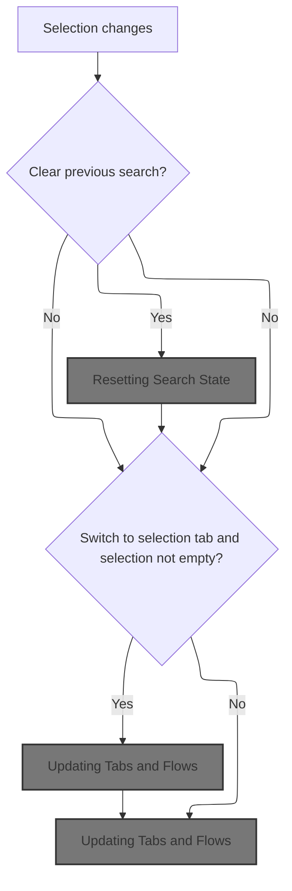

This document describes how the trace analysis interface responds to user selection changes. When a new selection is made, previous search results may be cleared, a new search may be performed, and the UI is updated to reflect the new context, ensuring the displayed information matches the user's focus.

# Reacting to Selection Changes



<SwmSnippet path="/ui/src/core/trace_impl.ts" line="176">

---

In <SwmToken path="ui/src/core/trace_impl.ts" pos="176:3:3" line-data="  private onSelectionChange(selection: Selection, opts: SelectionOpts) {">`onSelectionChange`</SwmToken>, we kick things off by checking if the search state should be cleared. If so, we reset the search manager, which wipes out any previous search results. This is needed before we do anything else, so the UI doesn't show stale search data when the selection changes. Next, we need to call into the search manager to actually perform the reset and update its internal state.

```typescript
  private onSelectionChange(selection: Selection, opts: SelectionOpts) {
    const {clearSearch = true, switchToCurrentSelectionTab = true} = opts;
    if (clearSearch) {
      this.search.reset();
    }
```

---

</SwmSnippet>

## Resetting Search State

<SwmSnippet path="/ui/src/core/search_manager.ts" line="115">

---

<SwmToken path="ui/src/core/search_manager.ts" pos="115:1:3" line-data="  reset() {">`reset()`</SwmToken> just calls <SwmToken path="ui/src/core/search_manager.ts" pos="116:3:7" line-data="    this.search(&#39;&#39;);">`search('')`</SwmToken>, which clears out any current search text and results. This keeps the search manager's state in sync with the new selection, making sure nothing from the previous search lingers.

```typescript
  reset() {
    this.search('');
  }
```

---

</SwmSnippet>

## Running a New Search

```mermaid
%%{init: {"flowchart": {"defaultRenderer": "elk"}} }%%
flowchart TD
  node1["Receive new search query"] --> node2{"Is query same as previous?"}
  click node1 openCode "ui/src/core/search_manager.ts:92:93"
  click node2 openCode "ui/src/core/search_manager.ts:93:95"
  node2 -->|"Yes"| node3["Return without searching"]
  click node3 openCode "ui/src/core/search_manager.ts:94:95"
  node2 -->|"No"| node4["Reset search state"]
  click node4 openCode "ui/src/core/search_manager.ts:96:100"
  node4 --> node5{"Is query empty?"}
  click node5 openCode "ui/src/core/search_manager.ts:101:112"
  node5 -->|"Yes"| node6["Reset results and search state"]
  click node6 openCode "ui/src/core/search_manager.ts:98:100"
  node5 -->|"No"| node7["Mark search as in progress"]
  click node7 openCode "ui/src/core/search_manager.ts:102:103"
  node7 --> node8["Schedule search execution"]
  click node8 openCode "ui/src/core/search_manager.ts:103:111"
  node8 --> node9{"Is dataset search mode enabled?"}
  click node9 openCode "ui/src/core/search_manager.ts:104:108"
  node9 -->|"Yes"| node10["Execute dataset search"]
  click node10 openCode "ui/src/core/search_manager.ts:105:106"
  node9 -->|"No"| node11["Execute standard search"]
  click node11 openCode "ui/src/core/search_manager.ts:107:108"
  node10 --> node12["Mark search as complete and redraw UI"]
  node11 --> node12
  click node12 openCode "ui/src/core/search_manager.ts:109:111"
classDef HeadingStyle fill:#777777,stroke:#333,stroke-width:2px;

%% Swimm:
%% %%{init: {"flowchart": {"defaultRenderer": "elk"}} }%%
%% flowchart TD
%%   node1["Receive new search query"] --> node2{"Is query same as previous?"}
%%   click node1 openCode "<SwmPath>[ui/…/core/search_manager.ts](ui/src/core/search_manager.ts)</SwmPath>:92:93"
%%   click node2 openCode "<SwmPath>[ui/…/core/search_manager.ts](ui/src/core/search_manager.ts)</SwmPath>:93:95"
%%   node2 -->|"Yes"| node3["Return without searching"]
%%   click node3 openCode "<SwmPath>[ui/…/core/search_manager.ts](ui/src/core/search_manager.ts)</SwmPath>:94:95"
%%   node2 -->|"No"| node4["Reset search state"]
%%   click node4 openCode "<SwmPath>[ui/…/core/search_manager.ts](ui/src/core/search_manager.ts)</SwmPath>:96:100"
%%   node4 --> node5{"Is query empty?"}
%%   click node5 openCode "<SwmPath>[ui/…/core/search_manager.ts](ui/src/core/search_manager.ts)</SwmPath>:101:112"
%%   node5 -->|"Yes"| node6["Reset results and search state"]
%%   click node6 openCode "<SwmPath>[ui/…/core/search_manager.ts](ui/src/core/search_manager.ts)</SwmPath>:98:100"
%%   node5 -->|"No"| node7["Mark search as in progress"]
%%   click node7 openCode "<SwmPath>[ui/…/core/search_manager.ts](ui/src/core/search_manager.ts)</SwmPath>:102:103"
%%   node7 --> node8["Schedule search execution"]
%%   click node8 openCode "<SwmPath>[ui/…/core/search_manager.ts](ui/src/core/search_manager.ts)</SwmPath>:103:111"
%%   node8 --> node9{"Is dataset search mode enabled?"}
%%   click node9 openCode "<SwmPath>[ui/…/core/search_manager.ts](ui/src/core/search_manager.ts)</SwmPath>:104:108"
%%   node9 -->|"Yes"| node10["Execute dataset search"]
%%   click node10 openCode "<SwmPath>[ui/…/core/search_manager.ts](ui/src/core/search_manager.ts)</SwmPath>:105:106"
%%   node9 -->|"No"| node11["Execute standard search"]
%%   click node11 openCode "<SwmPath>[ui/…/core/search_manager.ts](ui/src/core/search_manager.ts)</SwmPath>:107:108"
%%   node10 --> node12["Mark search as complete and redraw UI"]
%%   node11 --> node12
%%   click node12 openCode "<SwmPath>[ui/…/core/search_manager.ts](ui/src/core/search_manager.ts)</SwmPath>:109:111"
%% classDef HeadingStyle fill:#777777,stroke:#333,stroke-width:2px;
```



<SwmSnippet path="/ui/src/core/search_manager.ts" line="92">

---

`search()` updates all the internal state for the search lifecycle, like the search text, generation, and result tracking. If the search text isn't empty, it schedules an async search using a limiter to avoid spamming the backend. Depending on a feature flag, it runs one of two search implementations. When the search finishes, it updates the state and triggers a UI redraw so the user sees the new results.

```typescript
  search(text: string) {
    if (text === this._searchText) {
      return;
    }
    this._searchText = text;
    this._searchGeneration++;
    this._results = undefined;
    this._resultIndex = -1;
    this._searchInProgress = false;
    if (text !== '') {
      this._searchInProgress = true;
      this._limiter.schedule(async () => {
        if (DATASET_SEARCH.get()) {
          await this.executeDatasetSearch();
        } else {
          await this.executeSearch();
        }
        this._searchInProgress = false;
        raf.scheduleFullRedraw();
      });
    }
  }
```

---

</SwmSnippet>

## Searching Dataset Events

```mermaid
%%{init: {"flowchart": {"defaultRenderer": "elk"}} }%%
flowchart TD
  node1{"Are engine and track manager available?"}
  click node1 openCode "ui/src/core/search_manager.ts:357:359"
  node1 -->|"No"| node2["Stop search"]
  click node2 openCode "ui/src/core/search_manager.ts:358:359"
  node1 -->|"Yes"| node3["Perform search across all tracks"]
  click node3 openCode "ui/src/core/search_manager.ts:363:368"
  node3 --> node4["Initialize results structure"]
  click node4 openCode "ui/src/core/search_manager.ts:370:378"
  subgraph loop1["For each search result"]
    node4 --> node5["Add event data to results"]
    click node5 openCode "ui/src/core/search_manager.ts:380:387"
  end
  node5 --> node6{"Are there results and a visible window?"}
  click node6 openCode "ui/src/core/search_manager.ts:396:397"
  node6 -->|"No"| node7["Set result index to -1"]
  click node7 openCode "ui/src/core/search_manager.ts:408:409"
  node6 -->|"Yes"| node8["Find first result after visible window start"]
  click node8 openCode "ui/src/core/search_manager.ts:399:404"
  subgraph loop2["For each result timestamp"]
    node8 --> node9{"Is timestamp after visible window start?"}
    click node9 openCode "ui/src/core/search_manager.ts:400:403"
    node9 -->|"Yes"| node10["Store index before this one"]
    click node10 openCode "ui/src/core/search_manager.ts:406:406"
    node9 -->|"No"| node11["Continue"]
    click node11 openCode "ui/src/core/search_manager.ts:399:404"
  end
  node10 --> node12["Results ready for user"]
  click node12 openCode "ui/src/core/search_manager.ts:393:410"
  node7 --> node12
classDef HeadingStyle fill:#777777,stroke:#333,stroke-width:2px;

%% Swimm:
%% %%{init: {"flowchart": {"defaultRenderer": "elk"}} }%%
%% flowchart TD
%%   node1{"Are engine and track manager available?"}
%%   click node1 openCode "<SwmPath>[ui/…/core/search_manager.ts](ui/src/core/search_manager.ts)</SwmPath>:357:359"
%%   node1 -->|"No"| node2["Stop search"]
%%   click node2 openCode "<SwmPath>[ui/…/core/search_manager.ts](ui/src/core/search_manager.ts)</SwmPath>:358:359"
%%   node1 -->|"Yes"| node3["Perform search across all tracks"]
%%   click node3 openCode "<SwmPath>[ui/…/core/search_manager.ts](ui/src/core/search_manager.ts)</SwmPath>:363:368"
%%   node3 --> node4["Initialize results structure"]
%%   click node4 openCode "<SwmPath>[ui/…/core/search_manager.ts](ui/src/core/search_manager.ts)</SwmPath>:370:378"
%%   subgraph loop1["For each search result"]
%%     node4 --> node5["Add event data to results"]
%%     click node5 openCode "<SwmPath>[ui/…/core/search_manager.ts](ui/src/core/search_manager.ts)</SwmPath>:380:387"
%%   end
%%   node5 --> node6{"Are there results and a visible window?"}
%%   click node6 openCode "<SwmPath>[ui/…/core/search_manager.ts](ui/src/core/search_manager.ts)</SwmPath>:396:397"
%%   node6 -->|"No"| node7["Set result index to -1"]
%%   click node7 openCode "<SwmPath>[ui/…/core/search_manager.ts](ui/src/core/search_manager.ts)</SwmPath>:408:409"
%%   node6 -->|"Yes"| node8["Find first result after visible window start"]
%%   click node8 openCode "<SwmPath>[ui/…/core/search_manager.ts](ui/src/core/search_manager.ts)</SwmPath>:399:404"
%%   subgraph loop2["For each result timestamp"]
%%     node8 --> node9{"Is timestamp after visible window start?"}
%%     click node9 openCode "<SwmPath>[ui/…/core/search_manager.ts](ui/src/core/search_manager.ts)</SwmPath>:400:403"
%%     node9 -->|"Yes"| node10["Store index before this one"]
%%     click node10 openCode "<SwmPath>[ui/…/core/search_manager.ts](ui/src/core/search_manager.ts)</SwmPath>:406:406"
%%     node9 -->|"No"| node11["Continue"]
%%     click node11 openCode "<SwmPath>[ui/…/core/search_manager.ts](ui/src/core/search_manager.ts)</SwmPath>:399:404"
%%   end
%%   node10 --> node12["Results ready for user"]
%%   click node12 openCode "<SwmPath>[ui/…/core/search_manager.ts](ui/src/core/search_manager.ts)</SwmPath>:393:410"
%%   node7 --> node12
%% classDef HeadingStyle fill:#777777,stroke:#333,stroke-width:2px;
```



<SwmSnippet path="/ui/src/core/search_manager.ts" line="354">

---

In <SwmToken path="ui/src/core/search_manager.ts" pos="354:5:5" line-data="  private async executeDatasetSearch() {">`executeDatasetSearch`</SwmToken>, we kick off an async search for events using the current engine and track manager. Results are packed into typed arrays for efficiency, and utids are set to -1 since they're unknown here. We also check the search generation before and after the async call to make sure we don't update state with stale results if a newer search started in the meantime. All results are marked as 'event' type, which is an assumption specific to this codebase.

```typescript
  private async executeDatasetSearch() {
    const trackManager = this._trackManager;
    const engine = this._engine;
    if (!engine || !trackManager) {
      return;
    }

    const generation = this._searchGeneration;

    const allResults = await searchTrackEvents(
      engine,
      trackManager.getAllTracks(),
      this._providers,
      this._searchText,
    );

    const numRows = allResults.length;
    const searchResults: SearchResults = {
      eventIds: new Float64Array(numRows),
      tses: new BigInt64Array(numRows),
      utids: new Float64Array(numRows).fill(-1), // Fill with -1 as utid is unknown
      sources: [],
      trackUris: [],
      totalResults: numRows,
    };

    for (let i = 0; i < numRows; i++) {
      const {id, ts, track} = allResults[i];
      searchResults.eventIds[i] = id;
      searchResults.tses[i] = ts;
      searchResults.trackUris.push(track.uri);
      // Assuming all results from datasets correspond to 'event' type search
      searchResults.sources.push('event');
    }
```

---

</SwmSnippet>

<SwmSnippet path="/ui/src/core/search_manager.ts" line="393">

---

After storing the search results, we look for the first result that appears after the visible window's start time. We set the result index to just before this, so the next navigation lands right on the first visible result. If nothing matches, the index is set to -1.

```typescript
    this._results = searchResults;

    // Find first result after the start of the visible window
    const visibleWindow = this._timeline?.visibleWindow.toTimeSpan();
    if (visibleWindow && this._results.totalResults > 0) {
      let foundIndex = -1;
      for (let i = 0; i < this._results.tses.length; i++) {
        if (this._results.tses[i] >= visibleWindow.start) {
          foundIndex = i;
          break;
        }
      }
```

---

</SwmSnippet>

<SwmSnippet path="/ui/src/core/search_manager.ts" line="405">

---

Here we finalize the result index: if we found a matching result, we set the index to just before it; otherwise, it's -1. This index is used for navigation and highlighting in the UI.

```typescript
      // Store the index *before* the found one, so the first step lands on it.
      this._resultIndex = foundIndex === -1 ? -1 : foundIndex - 1;
    } else {
      this._resultIndex = -1;
    }
  }
```

---

</SwmSnippet>

## Updating Tabs and Flows

<SwmSnippet path="/ui/src/core/trace_impl.ts" line="181">

---

We just came back from the search manager. Now, in the last part of <SwmToken path="ui/src/core/trace_impl.ts" pos="176:3:3" line-data="  private onSelectionChange(selection: Selection, opts: SelectionOpts) {">`onSelectionChange`</SwmToken>, we update the UI tab if needed and then call into the flow manager to refresh any flows related to the new selection. This keeps the UI and internal state in sync with what the user just picked.

```typescript
    if (switchToCurrentSelectionTab && selection.kind !== 'empty') {
      this.tabs.showCurrentSelectionTab();
    }

    this.flows.updateFlows(selection);
  }
```

---

</SwmSnippet>

<SwmSnippet path="/ui/src/core/flow_manager.ts" line="453">

---

<SwmToken path="ui/src/core/flow_manager.ts" pos="453:1:1" line-data="  updateFlows(selection: Selection) {">`updateFlows`</SwmToken> branches on selection type, updating or clearing flows so only the right ones are active for what the user picked.

```typescript
  updateFlows(selection: Selection) {
    this.initialize();
    this._curSelection = selection;

    if (selection.kind === 'empty') {
      this.setConnectedFlows([]);
      this.setSelectedFlows([]);
      return;
    }

    if (
      selection.kind === 'track_event' &&
      this.trackMgr.getTrack(selection.trackUri)?.renderer.rootTableName ===
        'slice'
    ) {
      this.sliceSelected(selection.eventId);
    } else {
      this.setConnectedFlows([]);
    }

    if (selection.kind === 'area') {
      this.areaSelected(selection);
    } else {
      this.setConnectedFlows([]);
    }
  }
```

---

</SwmSnippet>

&nbsp;

*This is an auto-generated document by Swimm 🌊 and has not yet been verified by a human*

<SwmMeta version="3.0.0" repo-id="Z2l0aHViJTNBJTNBY3BsdXNwbHVzLXBlcmZldHRvJTNBJTNBcmljYXJkb2xvcGV6Zw==" repo-name="cplusplus-perfetto"><sup>Powered by [Swimm](https://app.swimm.io/)</sup></SwmMeta>
