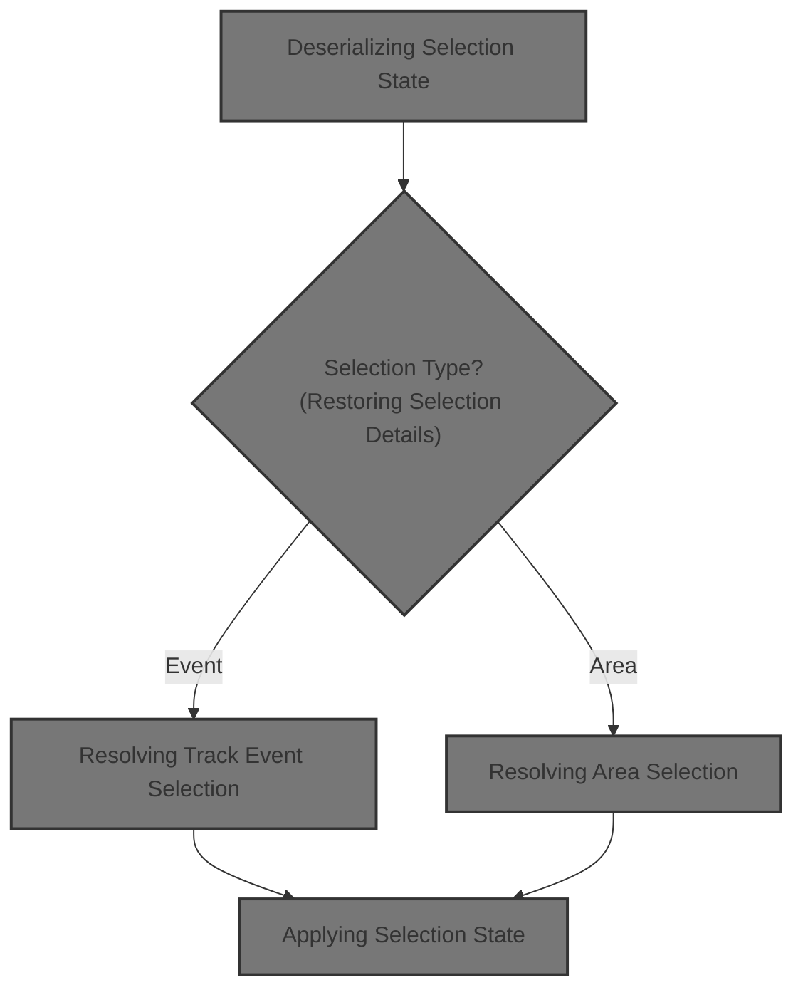

This document describes how the system restores a previously saved selection, enabling users to seamlessly continue their work. The flow receives a serialized selection state, determines whether it is an event or area selection, and updates the user interface to reflect the restored selection.



# Resolving Specialized Identifiers

<SwmSnippet path="/ui/src/base/perfetto_sql_lang/perfetto_sql.grammar.js" line="4">

---

<SwmToken path="ui/src/base/perfetto_sql_lang/perfetto_sql.grammar.js" pos="16:12:12" line-data="  specialized: [{term: 6, get: (value) =&gt; spec_Identifier[value] || -1}],">`get`</SwmToken> starts the flow by mapping a term value to a specialized identifier, which sets up the context for selection handling. We need to call into <SwmPath>[ui/…/core/selection_manager.ts](ui/src/core/selection_manager.ts)</SwmPath> next to actually process and apply the selection based on this resolved identifier.

```javascript
  specialized: [{term: 6, get: (value) => spec_Identifier[value] || -1}],
```

---

</SwmSnippet>

# Deserializing Selection State

<SwmSnippet path="/ui/src/core/selection_manager.ts" line="122">

---

<SwmToken path="ui/src/core/selection_manager.ts" pos="122:1:1" line-data="  deserialize(serialized: SerializedSelection | undefined) {">`deserialize`</SwmToken> checks if there's a serialized selection and, if so, passes it to <SwmToken path="ui/src/core/selection_manager.ts" pos="126:3:3" line-data="    this.deserializeInternal(serialized);">`deserializeInternal`</SwmToken> to restore the selection state. Next, we need to dig into <SwmToken path="ui/src/core/selection_manager.ts" pos="126:3:3" line-data="    this.deserializeInternal(serialized);">`deserializeInternal`</SwmToken> to see how the selection is actually reconstructed.

```typescript
  deserialize(serialized: SerializedSelection | undefined) {
    if (serialized === undefined) {
      return;
    }
    this.deserializeInternal(serialized);
  }
```

---

</SwmSnippet>

# Restoring Selection Details

```mermaid
%%{init: {"flowchart": {"defaultRenderer": "elk"}} }%%
flowchart TD
    node1["Attempt to restore previous selection"]
    click node1 openCode "ui/src/core/selection_manager.ts:129:130"
    node1 --> node2{"Selection type?"}
    click node2 openCode "ui/src/core/selection_manager.ts:131:146"
    node2 -->|TRACK_EVENT| node3["Resolving Track Event Selection"]
    
    node2 -->|"AREA"| node4["Resolving Area Selection"]
    
    node3 --> node5{"Did restoration fail?"}
    node4 --> node5
    click node5 openCode "ui/src/core/selection_manager.ts:147:171"
    node5 -->|"Yes"| node6["Show error message to user"]
    click node6 openCode "ui/src/core/selection_manager.ts:148:170"
    node5 -->|"No"| node3

classDef HeadingStyle fill:#777777,stroke:#333,stroke-width:2px;
click node3 goToHeading "Resolving Track Event Selection"
node3:::HeadingStyle
click node4 goToHeading "Resolving Area Selection"
node4:::HeadingStyle

%% Swimm:
%% %%{init: {"flowchart": {"defaultRenderer": "elk"}} }%%
%% flowchart TD
%%     node1["Attempt to restore previous selection"]
%%     click node1 openCode "<SwmPath>[ui/…/core/selection_manager.ts](ui/src/core/selection_manager.ts)</SwmPath>:129:130"
%%     node1 --> node2{"Selection type?"}
%%     click node2 openCode "<SwmPath>[ui/…/core/selection_manager.ts](ui/src/core/selection_manager.ts)</SwmPath>:131:146"
%%     node2 -->|<SwmToken path="ui/src/core/selection_manager.ts" pos="132:4:4" line-data="        case &#39;TRACK_EVENT&#39;:">`TRACK_EVENT`</SwmToken>| node3["Resolving Track Event Selection"]
%%     
%%     node2 -->|"AREA"| node4["Resolving Area Selection"]
%%     
%%     node3 --> node5{"Did restoration fail?"}
%%     node4 --> node5
%%     click node5 openCode "<SwmPath>[ui/…/core/selection_manager.ts](ui/src/core/selection_manager.ts)</SwmPath>:147:171"
%%     node5 -->|"Yes"| node6["Show error message to user"]
%%     click node6 openCode "<SwmPath>[ui/…/core/selection_manager.ts](ui/src/core/selection_manager.ts)</SwmPath>:148:170"
%%     node5 -->|"No"| node3
%% 
%% classDef HeadingStyle fill:#777777,stroke:#333,stroke-width:2px;
%% click node3 goToHeading "Resolving Track Event Selection"
%% node3:::HeadingStyle
%% click node4 goToHeading "Resolving Area Selection"
%% node4:::HeadingStyle
```



<SwmSnippet path="/ui/src/core/selection_manager.ts" line="129">

---

In <SwmToken path="ui/src/core/selection_manager.ts" pos="129:5:5" line-data="  private async deserializeInternal(serialized: SerializedSelection) {">`deserializeInternal`</SwmToken>, we branch based on the kind of selection to handle different restoration paths. For <SwmToken path="ui/src/core/selection_manager.ts" pos="132:4:4" line-data="        case &#39;TRACK_EVENT&#39;:">`TRACK_EVENT`</SwmToken>, we call <SwmToken path="ui/src/core/selection_manager.ts" pos="133:5:5" line-data="          await this.selectTrackEventInternal(">`selectTrackEventInternal`</SwmToken> to fetch and apply event-specific details. Next, we need to see how <SwmToken path="ui/src/core/selection_manager.ts" pos="133:5:5" line-data="          await this.selectTrackEventInternal(">`selectTrackEventInternal`</SwmToken> resolves and applies the event selection.

```typescript
  private async deserializeInternal(serialized: SerializedSelection) {
    try {
      switch (serialized.kind) {
        case 'TRACK_EVENT':
          await this.selectTrackEventInternal(
            serialized.trackKey,
            parseInt(serialized.eventId),
            undefined,
            serialized.detailsPanel,
          );
          break;
```

---

</SwmSnippet>

## Resolving Track Event Selection

```mermaid
%%{init: {"flowchart": {"defaultRenderer": "elk"}} }%%
flowchart TD
  node2{"Does the track exist for trackUri?"}
  click node2 openCode "ui/src/core/selection_manager.ts:423:428"
  node2 -->|"Yes"| node3{"Does the track support selection details?"}
  node2 -->|"No"| node6["Selection failed: Track not found"]
  click node6 openCode "ui/src/core/selection_manager.ts:424:428"
  node3 -->|"Yes"| node4{"Are details available for eventId?"}
  click node3 openCode "ui/src/core/selection_manager.ts:430:435"
  node3 -->|"No"| node7["Selection failed: Details not supported"]
  click node7 openCode "ui/src/core/selection_manager.ts:431:435"
  node4 -->|"Yes"| node9["Prepare event details panel"]
  click node4 openCode "ui/src/core/selection_manager.ts:437:442"
  node4 -->|"No"| node8["Selection failed: No details for event"]
  click node8 openCode "ui/src/core/selection_manager.ts:438:442"
  node9 --> node10["Update selection to eventId on trackUri"]
  click node9 openCode "ui/src/core/selection_manager.ts:444:450"
  click node10 openCode "ui/src/core/selection_manager.ts:451:451"

classDef HeadingStyle fill:#777777,stroke:#333,stroke-width:2px;

%% Swimm:
%% %%{init: {"flowchart": {"defaultRenderer": "elk"}} }%%
%% flowchart TD
%%   node2{"Does the track exist for <SwmToken path="ui/src/core/selection_manager.ts" pos="418:1:1" line-data="    trackUri: string,">`trackUri`</SwmToken>?"}
%%   click node2 openCode "<SwmPath>[ui/…/core/selection_manager.ts](ui/src/core/selection_manager.ts)</SwmPath>:423:428"
%%   node2 -->|"Yes"| node3{"Does the track support selection details?"}
%%   node2 -->|"No"| node6["Selection failed: Track not found"]
%%   click node6 openCode "<SwmPath>[ui/…/core/selection_manager.ts](ui/src/core/selection_manager.ts)</SwmPath>:424:428"
%%   node3 -->|"Yes"| node4{"Are details available for <SwmToken path="ui/src/core/selection_manager.ts" pos="135:5:5" line-data="            parseInt(serialized.eventId),">`eventId`</SwmToken>?"}
%%   click node3 openCode "<SwmPath>[ui/…/core/selection_manager.ts](ui/src/core/selection_manager.ts)</SwmPath>:430:435"
%%   node3 -->|"No"| node7["Selection failed: Details not supported"]
%%   click node7 openCode "<SwmPath>[ui/…/core/selection_manager.ts](ui/src/core/selection_manager.ts)</SwmPath>:431:435"
%%   node4 -->|"Yes"| node9["Prepare event details panel"]
%%   click node4 openCode "<SwmPath>[ui/…/core/selection_manager.ts](ui/src/core/selection_manager.ts)</SwmPath>:437:442"
%%   node4 -->|"No"| node8["Selection failed: No details for event"]
%%   click node8 openCode "<SwmPath>[ui/…/core/selection_manager.ts](ui/src/core/selection_manager.ts)</SwmPath>:438:442"
%%   node9 --> node10["Update selection to <SwmToken path="ui/src/core/selection_manager.ts" pos="135:5:5" line-data="            parseInt(serialized.eventId),">`eventId`</SwmToken> on <SwmToken path="ui/src/core/selection_manager.ts" pos="418:1:1" line-data="    trackUri: string,">`trackUri`</SwmToken>"]
%%   click node9 openCode "<SwmPath>[ui/…/core/selection_manager.ts](ui/src/core/selection_manager.ts)</SwmPath>:444:450"
%%   click node10 openCode "<SwmPath>[ui/…/core/selection_manager.ts](ui/src/core/selection_manager.ts)</SwmPath>:451:451"
%% 
%% classDef HeadingStyle fill:#777777,stroke:#333,stroke-width:2px;
```



<SwmSnippet path="/ui/src/core/selection_manager.ts" line="417">

---

<SwmToken path="ui/src/core/selection_manager.ts" pos="417:5:5" line-data="  private async selectTrackEventInternal(">`selectTrackEventInternal`</SwmToken> resolves the track and renderer, fetches event details, and then sets up the selection and details panel. We call <SwmToken path="ui/src/core/selection_manager.ts" pos="451:3:3" line-data="    this.setSelection(selection, opts);">`setSelection`</SwmToken> next to update the selection state and trigger downstream UI updates.

```typescript
  private async selectTrackEventInternal(
    trackUri: string,
    eventId: number,
    opts?: SelectionOpts,
    serializedDetailsPanel?: unknown,
  ) {
    const track = this.trackManager.getTrack(trackUri);
    if (!track) {
      throw new Error(
        `Unable to resolve selection details: Track ${trackUri} not found`,
      );
    }

    const trackRenderer = track.renderer;
    if (!trackRenderer.getSelectionDetails) {
      throw new Error(
        `Unable to resolve selection details: Track ${trackUri} does not support selection details`,
      );
    }

    const details = await trackRenderer.getSelectionDetails(eventId);
    if (!exists(details)) {
      throw new Error(
        `Unable to resolve selection details: Track ${trackUri} returned no details for event ${eventId}`,
      );
    }

    const selection: TrackEventSelection = {
      ...details,
      kind: 'track_event',
      trackUri,
      eventId,
    };
    this.createTrackEventDetailsPanel(selection, serializedDetailsPanel);
    this.setSelection(selection, opts);
  }
```

---

</SwmSnippet>

## Applying Selection State

<SwmSnippet path="/ui/src/core/selection_manager.ts" line="332">

---

In <SwmToken path="ui/src/core/selection_manager.ts" pos="332:3:3" line-data="  private setSelection(selection: Selection, opts?: SelectionOpts) {">`setSelection`</SwmToken>, we update the selection and notify listeners via <SwmToken path="ui/src/core/selection_manager.ts" pos="334:3:3" line-data="    this.onSelectionChange(selection, opts ?? {});">`onSelectionChange`</SwmToken>. Next, we call into trace_impl to propagate the selection change to other parts of the system.

```typescript
  private setSelection(selection: Selection, opts?: SelectionOpts) {
    this._selection = selection;
    this.onSelectionChange(selection, opts ?? {});

```

---

</SwmSnippet>

### Propagating Selection Changes

See <SwmLink doc-title="Selection Change Handling">[Selection Change Handling](/.swm/selection-change-handling.c02ksxm5.sw.md)</SwmLink>

### Handling Selection Side Effects

<SwmSnippet path="/ui/src/core/selection_manager.ts" line="336">

---

We just returned from trace_impl, and now in <SwmToken path="ui/src/core/selection_manager.ts" pos="112:3:3" line-data="    this.setSelection(">`setSelection`</SwmToken>, we check if we need to scroll to the selection. If requested, we trigger <SwmToken path="ui/src/core/selection_manager.ts" pos="336:6:6" line-data="    if (opts?.scrollToSelection) {">`scrollToSelection`</SwmToken> to focus the UI on the selected item.

```typescript
    if (opts?.scrollToSelection) {
      this.scrollToSelection();
    }
  }
```

---

</SwmSnippet>

## Restoring Area Selection

<SwmSnippet path="/ui/src/core/selection_manager.ts" line="140">

---

We just returned from <SwmToken path="ui/src/core/selection_manager.ts" pos="133:5:5" line-data="          await this.selectTrackEventInternal(">`selectTrackEventInternal`</SwmToken>, and now in <SwmToken path="ui/src/core/selection_manager.ts" pos="126:3:3" line-data="    this.deserializeInternal(serialized);">`deserializeInternal`</SwmToken>, we handle AREA selections by calling <SwmToken path="ui/src/core/selection_manager.ts" pos="141:3:3" line-data="          this.selectArea({">`selectArea`</SwmToken> with the relevant range and <SwmToken path="ui/src/core/selection_manager.ts" pos="144:1:1" line-data="            trackUris: serialized.trackUris,">`trackUris`</SwmToken>. Next, <SwmToken path="ui/src/core/selection_manager.ts" pos="141:3:3" line-data="          this.selectArea({">`selectArea`</SwmToken> will resolve the tracks and update the selection.

```typescript
        case 'AREA':
          this.selectArea({
            start: serialized.start,
            end: serialized.end,
            trackUris: serialized.trackUris,
          });
      }
```

---

</SwmSnippet>

## Resolving Area Selection

```mermaid
%%{init: {"flowchart": {"defaultRenderer": "elk"}} }%%
flowchart TD
    node1["Validate area boundaries: start <= end"]
    click node1 openCode "ui/src/core/selection_manager.ts:99:99"
    node1 --> node2["Resolve tracks from trackUris"]
    click node2 openCode "ui/src/core/selection_manager.ts:106:110"
    
    subgraph loop1["For each track URI in area.trackUris"]
        node2 --> node3{"Is track valid?"}
        click node3 openCode "ui/src/core/selection_manager.ts:108:108"
        node3 -->|"Yes"| node4["Include track in selection"]
        click node4 openCode "ui/src/core/selection_manager.ts:109:109"
        node4 --> node2
        node3 -->|"No"| node2
    end
    node2 --> node5["Update selection with area and resolved tracks"]
    click node5 openCode "ui/src/core/selection_manager.ts:112:119"

classDef HeadingStyle fill:#777777,stroke:#333,stroke-width:2px;

%% Swimm:
%% %%{init: {"flowchart": {"defaultRenderer": "elk"}} }%%
%% flowchart TD
%%     node1["Validate area boundaries: start <= end"]
%%     click node1 openCode "<SwmPath>[ui/…/core/selection_manager.ts](ui/src/core/selection_manager.ts)</SwmPath>:99:99"
%%     node1 --> node2["Resolve tracks from <SwmToken path="ui/src/core/selection_manager.ts" pos="101:28:28" line-data="    // In the case of area selection, the caller provides a list of trackUris.">`trackUris`</SwmToken>"]
%%     click node2 openCode "<SwmPath>[ui/…/core/selection_manager.ts](ui/src/core/selection_manager.ts)</SwmPath>:106:110"
%%     
%%     subgraph loop1["For each track URI in <SwmToken path="ui/src/core/selection_manager.ts" pos="106:10:12" line-data="    for (const uri of area.trackUris) {">`area.trackUris`</SwmToken>"]
%%         node2 --> node3{"Is track valid?"}
%%         click node3 openCode "<SwmPath>[ui/…/core/selection_manager.ts](ui/src/core/selection_manager.ts)</SwmPath>:108:108"
%%         node3 -->|"Yes"| node4["Include track in selection"]
%%         click node4 openCode "<SwmPath>[ui/…/core/selection_manager.ts](ui/src/core/selection_manager.ts)</SwmPath>:109:109"
%%         node4 --> node2
%%         node3 -->|"No"| node2
%%     end
%%     node2 --> node5["Update selection with area and resolved tracks"]
%%     click node5 openCode "<SwmPath>[ui/…/core/selection_manager.ts](ui/src/core/selection_manager.ts)</SwmPath>:112:119"
%% 
%% classDef HeadingStyle fill:#777777,stroke:#333,stroke-width:2px;
```



<SwmSnippet path="/ui/src/core/selection_manager.ts" line="97">

---

In <SwmToken path="ui/src/core/selection_manager.ts" pos="97:1:1" line-data="  selectArea(area: Area, opts?: SelectionOpts): void {">`selectArea`</SwmToken>, we resolve the <SwmToken path="ui/src/core/selection_manager.ts" pos="101:28:28" line-data="    // In the case of area selection, the caller provides a list of trackUris.">`trackUris`</SwmToken> to actual track objects and build the selection with the area range. This prepares the selection for consumers who need track details.

```typescript
  selectArea(area: Area, opts?: SelectionOpts): void {
    const {start, end} = area;
    assertTrue(start <= end);

    // In the case of area selection, the caller provides a list of trackUris.
    // However, all the consumers want to access the resolved Tracks. Rather
    // than delegating this to the various consumers, we resolve them now once
    // and for all and place them in the selection object.
    const tracks = [];
    for (const uri of area.trackUris) {
      const trackDescr = this.trackManager.getTrack(uri);
      if (trackDescr === undefined) continue;
      tracks.push(trackDescr);
    }
```

---

</SwmSnippet>

<SwmSnippet path="/ui/src/core/selection_manager.ts" line="112">

---

After resolving tracks, we call <SwmToken path="ui/src/core/selection_manager.ts" pos="112:3:3" line-data="    this.setSelection(">`setSelection`</SwmToken> to update the selection state with the area info and notify listeners.

```typescript
    this.setSelection(
      {
        ...area,
        kind: 'area',
        tracks,
      },
      opts,
    );
  }
```

---

</SwmSnippet>

## Handling Restoration Errors

<SwmSnippet path="/ui/src/core/selection_manager.ts" line="147">

---

We just returned from <SwmToken path="ui/src/core/selection_manager.ts" pos="97:1:1" line-data="  selectArea(area: Area, opts?: SelectionOpts): void {">`selectArea`</SwmToken>, and now at the end of <SwmToken path="ui/src/core/selection_manager.ts" pos="126:3:3" line-data="    this.deserializeInternal(serialized);">`deserializeInternal`</SwmToken>, we catch any errors and show a modal to inform the user about restoration issues, especially due to version mismatches.

```typescript
    } catch (ex) {
      showModal({
        title: 'Failed to restore the selected event',
        content: m(
          'div',
          m(
            'p',
            `Due to a version skew between the version of the UI the trace was
             shared with and the version of the UI you are using, we were
             unable to restore the selected event.`,
          ),
          m(
            'p',
            `These backwards incompatible changes are very rare but is in some
             cases unavoidable. We apologise for the inconvenience.`,
          ),
        ),
        buttons: [
          {
            text: 'Continue',
            primary: true,
          },
        ],
      });
    }
  }
```

---

</SwmSnippet>

&nbsp;

*This is an auto-generated document by Swimm 🌊 and has not yet been verified by a human*

<SwmMeta version="3.0.0" repo-id="Z2l0aHViJTNBJTNBY3BsdXNwbHVzLXBlcmZldHRvJTNBJTNBcmljYXJkb2xvcGV6Zw==" repo-name="cplusplus-perfetto"><sup>Powered by [Swimm](https://app.swimm.io/)</sup></SwmMeta>
