This document describes how the application restores its UI and selection state from serialized data. When a user loads a saved workspace, the visible time window, pinned tracks, notes, and the user's last selection are all brought back, allowing the user to continue their workflow seamlessly.


# Where is this flow used?

This flow is used multiple times in the codebase as represented in the following diagram:

(Note - these are only some of the entry points of this flow)

```mermaid
graph TD;
      47a009bb28468bd248715ec917e8837b1a126907e2ff752f89d3e6e278078226(ui/…/bigtrace/index.ts::main) --> 9da801899ca38d8b30d5a1c08b2d8a45ef97466770974636e7d91ac9692e14f5(ui/…/bigtrace/index.ts::onCssLoaded)

9da801899ca38d8b30d5a1c08b2d8a45ef97466770974636e7d91ac9692e14f5(ui/…/bigtrace/index.ts::onCssLoaded) --> d6a1751f4520c969334266976c264e13155eead8051bbc6b9a56dc7d44df9330(ui/…/bigtrace/index.ts::routeChange)

9da801899ca38d8b30d5a1c08b2d8a45ef97466770974636e7d91ac9692e14f5(ui/…/bigtrace/index.ts::onCssLoaded) --> 44db15a568163e0104544225e5ad572d43d80cea5a874b23ee18b845a0659a31(ui/…/frontend/rpc_http_dialog.ts::checkHttpRpcConnection)

d6a1751f4520c969334266976c264e13155eead8051bbc6b9a56dc7d44df9330(ui/…/bigtrace/index.ts::routeChange) --> 62f31ae162641250ca8ec850093254a04eef8fe489545ec815bad98247976306(ui/…/frontend/trace_url_handler.ts::maybeOpenTraceFromRoute)

62f31ae162641250ca8ec850093254a04eef8fe489545ec815bad98247976306(ui/…/frontend/trace_url_handler.ts::maybeOpenTraceFromRoute) --> 6f37504e78a178dc65bc1392e79a5a654928ae8edb1e0b94ddf571824243e3d9(ui/…/frontend/permalink.ts::loadPermalink)

6f37504e78a178dc65bc1392e79a5a654928ae8edb1e0b94ddf571824243e3d9(ui/…/frontend/permalink.ts::loadPermalink) --> 609cb59a249be327f15be34c29f0308ef395d9f5d0c303e7ad384868a5558017(ui/…/core/app_impl.ts::AppImpl.openTraceFromUrl)

609cb59a249be327f15be34c29f0308ef395d9f5d0c303e7ad384868a5558017(ui/…/core/app_impl.ts::AppImpl.openTraceFromUrl) --> e47fa8fc91587c08ac0c3bb2d6ffbc8207b333b8d2a76e6dc3b240ac39f686e9(ui/…/core/app_impl.ts::AppImpl.openTrace)

e47fa8fc91587c08ac0c3bb2d6ffbc8207b333b8d2a76e6dc3b240ac39f686e9(ui/…/core/app_impl.ts::AppImpl.openTrace) --> ccf2ed155e6b8c7313b9e6cd6f672a3ea5c9f0e6e22cae91477dc62cbf9b8f4a(ui/…/core/load_trace.ts::loadTrace)

ccf2ed155e6b8c7313b9e6cd6f672a3ea5c9f0e6e22cae91477dc62cbf9b8f4a(ui/…/core/load_trace.ts::loadTrace) --> 8bc69be8b4561b5b6b9cab450db0e00ba41e83956931c2a65d570eada8ee7117(ui/…/core/load_trace.ts::loadTraceIntoEngine)

8bc69be8b4561b5b6b9cab450db0e00ba41e83956931c2a65d570eada8ee7117(ui/…/core/load_trace.ts::loadTraceIntoEngine) --> eb8fc69b2c7b7e67feb74dcb8649e311fbcb28d3a718044bc335e74170bf3329(ui/…/core/state_serialization.ts::deserializeAppStatePhase2):::mainFlowStyle

44db15a568163e0104544225e5ad572d43d80cea5a874b23ee18b845a0659a31(ui/…/frontend/rpc_http_dialog.ts::checkHttpRpcConnection) --> e9477adb21c1214b2b92e61c40e2a66b6e853907768a158707e2912a62efe942(ui/…/core/app_impl.ts::AppImpl.openTraceFromHttpRpc)

e9477adb21c1214b2b92e61c40e2a66b6e853907768a158707e2912a62efe942(ui/…/core/app_impl.ts::AppImpl.openTraceFromHttpRpc) --> e47fa8fc91587c08ac0c3bb2d6ffbc8207b333b8d2a76e6dc3b240ac39f686e9(ui/…/core/app_impl.ts::AppImpl.openTrace)

348c9442d30a0321e4c3b3d93e2a1cfc0a9acf45ba27cede8a6fbd51ed345a57(ui/…/frontend/post_message_handler.ts::postMessageHandler) --> 10d630be7f61b80334c99a55f76ece4b0acbdef3175963a4f83fe7fb118a8759(ui/…/core/app_impl.ts::AppImpl.openTraceFromBuffer)

348c9442d30a0321e4c3b3d93e2a1cfc0a9acf45ba27cede8a6fbd51ed345a57(ui/…/frontend/post_message_handler.ts::postMessageHandler) --> fe66a8909ca5436d7a79816b194bdb036dce242cb5918c6e77effc893fb0dda7(ui/…/frontend/post_message_handler.ts::openTrace)

10d630be7f61b80334c99a55f76ece4b0acbdef3175963a4f83fe7fb118a8759(ui/…/core/app_impl.ts::AppImpl.openTraceFromBuffer) --> e47fa8fc91587c08ac0c3bb2d6ffbc8207b333b8d2a76e6dc3b240ac39f686e9(ui/…/core/app_impl.ts::AppImpl.openTrace)

fe66a8909ca5436d7a79816b194bdb036dce242cb5918c6e77effc893fb0dda7(ui/…/frontend/post_message_handler.ts::openTrace) --> 10d630be7f61b80334c99a55f76ece4b0acbdef3175963a4f83fe7fb118a8759(ui/…/core/app_impl.ts::AppImpl.openTraceFromBuffer)

8a34b5d536a890f9a23aeec055956210e7222a96e85641ead723b412f294e85b(ui/…/bigtrace/index.ts::CoreCommands.onTraceLoad) --> eb8fc69b2c7b7e67feb74dcb8649e311fbcb28d3a718044bc335e74170bf3329(ui/…/core/state_serialization.ts::deserializeAppStatePhase2):::mainFlowStyle

b6e2f1dfb23e4d05c9aca9250ac5bbbd6e38a8bfa4aeaf7027de481b5059b093(ui/…/dev.perfetto.MultiTraceOpen/multi_trace_modal.ts::MultiTraceModalShell.view) --> 9c8b1fd7c7f5868de6050594d9788e0a58ee6df5a484a8581e17394dbcefafec(ui/…/dev.perfetto.MultiTraceOpen/multi_trace_modal.ts::MultiTraceModalShell.renderActions)

9c8b1fd7c7f5868de6050594d9788e0a58ee6df5a484a8581e17394dbcefafec(ui/…/dev.perfetto.MultiTraceOpen/multi_trace_modal.ts::MultiTraceModalShell.renderActions) --> f72ca928779f8cb8a5b1cdce1fbf6792470599c4682fe545a7bddee664236476(ui/…/dev.perfetto.MultiTraceOpen/multi_trace_modal.ts::MultiTraceModalShell.openTraces)

f72ca928779f8cb8a5b1cdce1fbf6792470599c4682fe545a7bddee664236476(ui/…/dev.perfetto.MultiTraceOpen/multi_trace_modal.ts::MultiTraceModalShell.openTraces) --> 4f19786a72e5f73ac101216d9bb9613aa796fe640699fed90a3c809547a57658(ui/…/core/app_impl.ts::AppImpl.openTraceFromMultipleFiles)

4f19786a72e5f73ac101216d9bb9613aa796fe640699fed90a3c809547a57658(ui/…/core/app_impl.ts::AppImpl.openTraceFromMultipleFiles) --> e47fa8fc91587c08ac0c3bb2d6ffbc8207b333b8d2a76e6dc3b240ac39f686e9(ui/…/core/app_impl.ts::AppImpl.openTrace)

20be23f3ae2f3927f2a3ff5197032efd25f952e6e27dcde702e053db9e89097c(ui/…/frontend/post_message_handler.ts::trustAndOpenTrace) --> fe66a8909ca5436d7a79816b194bdb036dce242cb5918c6e77effc893fb0dda7(ui/…/frontend/post_message_handler.ts::openTrace)


classDef mainFlowStyle color:#000000,fill:#7CB9F4
classDef rootsStyle color:#000000,fill:#00FFF4
classDef Style1 color:#000000,fill:#00FFAA
classDef Style2 color:#000000,fill:#FFFF00
classDef Style3 color:#000000,fill:#AA7CB9

%% Swimm:
%% graph TD;
%%       47a009bb28468bd248715ec917e8837b1a126907e2ff752f89d3e6e278078226(<SwmPath>[ui/…/bigtrace/index.ts](ui/src/bigtrace/index.ts)</SwmPath>::main) --> 9da801899ca38d8b30d5a1c08b2d8a45ef97466770974636e7d91ac9692e14f5(<SwmPath>[ui/…/bigtrace/index.ts](ui/src/bigtrace/index.ts)</SwmPath>::onCssLoaded)
%% 
%% 9da801899ca38d8b30d5a1c08b2d8a45ef97466770974636e7d91ac9692e14f5(<SwmPath>[ui/…/bigtrace/index.ts](ui/src/bigtrace/index.ts)</SwmPath>::onCssLoaded) --> d6a1751f4520c969334266976c264e13155eead8051bbc6b9a56dc7d44df9330(<SwmPath>[ui/…/bigtrace/index.ts](ui/src/bigtrace/index.ts)</SwmPath>::routeChange)
%% 
%% 9da801899ca38d8b30d5a1c08b2d8a45ef97466770974636e7d91ac9692e14f5(<SwmPath>[ui/…/bigtrace/index.ts](ui/src/bigtrace/index.ts)</SwmPath>::onCssLoaded) --> 44db15a568163e0104544225e5ad572d43d80cea5a874b23ee18b845a0659a31(<SwmPath>[ui/…/frontend/rpc_http_dialog.ts](ui/src/frontend/rpc_http_dialog.ts)</SwmPath>::checkHttpRpcConnection)
%% 
%% d6a1751f4520c969334266976c264e13155eead8051bbc6b9a56dc7d44df9330(<SwmPath>[ui/…/bigtrace/index.ts](ui/src/bigtrace/index.ts)</SwmPath>::routeChange) --> 62f31ae162641250ca8ec850093254a04eef8fe489545ec815bad98247976306(<SwmPath>[ui/…/frontend/trace_url_handler.ts](ui/src/frontend/trace_url_handler.ts)</SwmPath>::maybeOpenTraceFromRoute)
%% 
%% 62f31ae162641250ca8ec850093254a04eef8fe489545ec815bad98247976306(<SwmPath>[ui/…/frontend/trace_url_handler.ts](ui/src/frontend/trace_url_handler.ts)</SwmPath>::maybeOpenTraceFromRoute) --> 6f37504e78a178dc65bc1392e79a5a654928ae8edb1e0b94ddf571824243e3d9(<SwmPath>[ui/…/frontend/permalink.ts](ui/src/frontend/permalink.ts)</SwmPath>::loadPermalink)
%% 
%% 6f37504e78a178dc65bc1392e79a5a654928ae8edb1e0b94ddf571824243e3d9(<SwmPath>[ui/…/frontend/permalink.ts](ui/src/frontend/permalink.ts)</SwmPath>::loadPermalink) --> 609cb59a249be327f15be34c29f0308ef395d9f5d0c303e7ad384868a5558017(<SwmPath>[ui/…/core/app_impl.ts](ui/src/core/app_impl.ts)</SwmPath>::AppImpl.openTraceFromUrl)
%% 
%% 609cb59a249be327f15be34c29f0308ef395d9f5d0c303e7ad384868a5558017(<SwmPath>[ui/…/core/app_impl.ts](ui/src/core/app_impl.ts)</SwmPath>::AppImpl.openTraceFromUrl) --> e47fa8fc91587c08ac0c3bb2d6ffbc8207b333b8d2a76e6dc3b240ac39f686e9(<SwmPath>[ui/…/core/app_impl.ts](ui/src/core/app_impl.ts)</SwmPath>::AppImpl.openTrace)
%% 
%% e47fa8fc91587c08ac0c3bb2d6ffbc8207b333b8d2a76e6dc3b240ac39f686e9(<SwmPath>[ui/…/core/app_impl.ts](ui/src/core/app_impl.ts)</SwmPath>::AppImpl.openTrace) --> ccf2ed155e6b8c7313b9e6cd6f672a3ea5c9f0e6e22cae91477dc62cbf9b8f4a(<SwmPath>[ui/…/core/load_trace.ts](ui/src/core/load_trace.ts)</SwmPath>::loadTrace)
%% 
%% ccf2ed155e6b8c7313b9e6cd6f672a3ea5c9f0e6e22cae91477dc62cbf9b8f4a(<SwmPath>[ui/…/core/load_trace.ts](ui/src/core/load_trace.ts)</SwmPath>::loadTrace) --> 8bc69be8b4561b5b6b9cab450db0e00ba41e83956931c2a65d570eada8ee7117(<SwmPath>[ui/…/core/load_trace.ts](ui/src/core/load_trace.ts)</SwmPath>::loadTraceIntoEngine)
%% 
%% 8bc69be8b4561b5b6b9cab450db0e00ba41e83956931c2a65d570eada8ee7117(<SwmPath>[ui/…/core/load_trace.ts](ui/src/core/load_trace.ts)</SwmPath>::loadTraceIntoEngine) --> eb8fc69b2c7b7e67feb74dcb8649e311fbcb28d3a718044bc335e74170bf3329(<SwmPath>[ui/…/core/state_serialization.ts](ui/src/core/state_serialization.ts)</SwmPath>::<SwmToken path="ui/src/core/state_serialization.ts" pos="167:4:4" line-data="export function deserializeAppStatePhase2(">`deserializeAppStatePhase2`</SwmToken>):::mainFlowStyle
%% 
%% 44db15a568163e0104544225e5ad572d43d80cea5a874b23ee18b845a0659a31(<SwmPath>[ui/…/frontend/rpc_http_dialog.ts](ui/src/frontend/rpc_http_dialog.ts)</SwmPath>::checkHttpRpcConnection) --> e9477adb21c1214b2b92e61c40e2a66b6e853907768a158707e2912a62efe942(<SwmPath>[ui/…/core/app_impl.ts](ui/src/core/app_impl.ts)</SwmPath>::AppImpl.openTraceFromHttpRpc)
%% 
%% e9477adb21c1214b2b92e61c40e2a66b6e853907768a158707e2912a62efe942(<SwmPath>[ui/…/core/app_impl.ts](ui/src/core/app_impl.ts)</SwmPath>::AppImpl.openTraceFromHttpRpc) --> e47fa8fc91587c08ac0c3bb2d6ffbc8207b333b8d2a76e6dc3b240ac39f686e9(<SwmPath>[ui/…/core/app_impl.ts](ui/src/core/app_impl.ts)</SwmPath>::AppImpl.openTrace)
%% 
%% 348c9442d30a0321e4c3b3d93e2a1cfc0a9acf45ba27cede8a6fbd51ed345a57(<SwmPath>[ui/…/frontend/post_message_handler.ts](ui/src/frontend/post_message_handler.ts)</SwmPath>::postMessageHandler) --> 10d630be7f61b80334c99a55f76ece4b0acbdef3175963a4f83fe7fb118a8759(<SwmPath>[ui/…/core/app_impl.ts](ui/src/core/app_impl.ts)</SwmPath>::AppImpl.openTraceFromBuffer)
%% 
%% 348c9442d30a0321e4c3b3d93e2a1cfc0a9acf45ba27cede8a6fbd51ed345a57(<SwmPath>[ui/…/frontend/post_message_handler.ts](ui/src/frontend/post_message_handler.ts)</SwmPath>::postMessageHandler) --> fe66a8909ca5436d7a79816b194bdb036dce242cb5918c6e77effc893fb0dda7(<SwmPath>[ui/…/frontend/post_message_handler.ts](ui/src/frontend/post_message_handler.ts)</SwmPath>::openTrace)
%% 
%% 10d630be7f61b80334c99a55f76ece4b0acbdef3175963a4f83fe7fb118a8759(<SwmPath>[ui/…/core/app_impl.ts](ui/src/core/app_impl.ts)</SwmPath>::AppImpl.openTraceFromBuffer) --> e47fa8fc91587c08ac0c3bb2d6ffbc8207b333b8d2a76e6dc3b240ac39f686e9(<SwmPath>[ui/…/core/app_impl.ts](ui/src/core/app_impl.ts)</SwmPath>::AppImpl.openTrace)
%% 
%% fe66a8909ca5436d7a79816b194bdb036dce242cb5918c6e77effc893fb0dda7(<SwmPath>[ui/…/frontend/post_message_handler.ts](ui/src/frontend/post_message_handler.ts)</SwmPath>::openTrace) --> 10d630be7f61b80334c99a55f76ece4b0acbdef3175963a4f83fe7fb118a8759(<SwmPath>[ui/…/core/app_impl.ts](ui/src/core/app_impl.ts)</SwmPath>::AppImpl.openTraceFromBuffer)
%% 
%% 8a34b5d536a890f9a23aeec055956210e7222a96e85641ead723b412f294e85b(<SwmPath>[ui/…/bigtrace/index.ts](ui/src/bigtrace/index.ts)</SwmPath>::CoreCommands.onTraceLoad) --> eb8fc69b2c7b7e67feb74dcb8649e311fbcb28d3a718044bc335e74170bf3329(<SwmPath>[ui/…/core/state_serialization.ts](ui/src/core/state_serialization.ts)</SwmPath>::<SwmToken path="ui/src/core/state_serialization.ts" pos="167:4:4" line-data="export function deserializeAppStatePhase2(">`deserializeAppStatePhase2`</SwmToken>):::mainFlowStyle
%% 
%% b6e2f1dfb23e4d05c9aca9250ac5bbbd6e38a8bfa4aeaf7027de481b5059b093(<SwmPath>[ui/…/dev.perfetto.MultiTraceOpen/multi_trace_modal.ts](ui/src/core_plugins/dev.perfetto.MultiTraceOpen/multi_trace_modal.ts)</SwmPath>::MultiTraceModalShell.view) --> 9c8b1fd7c7f5868de6050594d9788e0a58ee6df5a484a8581e17394dbcefafec(<SwmPath>[ui/…/dev.perfetto.MultiTraceOpen/multi_trace_modal.ts](ui/src/core_plugins/dev.perfetto.MultiTraceOpen/multi_trace_modal.ts)</SwmPath>::MultiTraceModalShell.renderActions)
%% 
%% 9c8b1fd7c7f5868de6050594d9788e0a58ee6df5a484a8581e17394dbcefafec(<SwmPath>[ui/…/dev.perfetto.MultiTraceOpen/multi_trace_modal.ts](ui/src/core_plugins/dev.perfetto.MultiTraceOpen/multi_trace_modal.ts)</SwmPath>::MultiTraceModalShell.renderActions) --> f72ca928779f8cb8a5b1cdce1fbf6792470599c4682fe545a7bddee664236476(<SwmPath>[ui/…/dev.perfetto.MultiTraceOpen/multi_trace_modal.ts](ui/src/core_plugins/dev.perfetto.MultiTraceOpen/multi_trace_modal.ts)</SwmPath>::MultiTraceModalShell.openTraces)
%% 
%% f72ca928779f8cb8a5b1cdce1fbf6792470599c4682fe545a7bddee664236476(<SwmPath>[ui/…/dev.perfetto.MultiTraceOpen/multi_trace_modal.ts](ui/src/core_plugins/dev.perfetto.MultiTraceOpen/multi_trace_modal.ts)</SwmPath>::MultiTraceModalShell.openTraces) --> 4f19786a72e5f73ac101216d9bb9613aa796fe640699fed90a3c809547a57658(<SwmPath>[ui/…/core/app_impl.ts](ui/src/core/app_impl.ts)</SwmPath>::AppImpl.openTraceFromMultipleFiles)
%% 
%% 4f19786a72e5f73ac101216d9bb9613aa796fe640699fed90a3c809547a57658(<SwmPath>[ui/…/core/app_impl.ts](ui/src/core/app_impl.ts)</SwmPath>::AppImpl.openTraceFromMultipleFiles) --> e47fa8fc91587c08ac0c3bb2d6ffbc8207b333b8d2a76e6dc3b240ac39f686e9(<SwmPath>[ui/…/core/app_impl.ts](ui/src/core/app_impl.ts)</SwmPath>::AppImpl.openTrace)
%% 
%% 20be23f3ae2f3927f2a3ff5197032efd25f952e6e27dcde702e053db9e89097c(<SwmPath>[ui/…/frontend/post_message_handler.ts](ui/src/frontend/post_message_handler.ts)</SwmPath>::trustAndOpenTrace) --> fe66a8909ca5436d7a79816b194bdb036dce242cb5918c6e77effc893fb0dda7(<SwmPath>[ui/…/frontend/post_message_handler.ts](ui/src/frontend/post_message_handler.ts)</SwmPath>::openTrace)
%% 
%% 
%% classDef mainFlowStyle color:#000000,fill:#7CB9F4
%% classDef rootsStyle color:#000000,fill:#00FFF4
%% classDef Style1 color:#000000,fill:#00FFAA
%% classDef Style2 color:#000000,fill:#FFFF00
%% classDef Style3 color:#000000,fill:#AA7CB9
```



# Restoring UI State from Serialized App Data


<SwmSnippet path="/ui/src/core/state_serialization.ts" line="167">

---

We restore the visible time window if specified, and re-pin tracks in the workspace using their URIs.

```typescript
export function deserializeAppStatePhase2(
  appState: SerializedAppState,
  trace: TraceImpl,
): void {
  if (appState.viewport !== undefined) {
    trace.timeline.updateVisibleTime(
      new TimeSpan(appState.viewport.start, appState.viewport.end),
    );
  }

  // Restore the pinned tracks for the default workspace, if they exist.
  for (const uri of appState.pinnedTracks) {
    const track = trace.defaultWorkspace.getTrackByUri(uri);
    if (track) {
      track.pin();
    }
  }
```

---

</SwmSnippet>

<SwmSnippet path="/ui/src/core/state_serialization.ts" line="185">

---

We loop through notes and restore them as either point or span annotations depending on their type.

```typescript
  // Restore notes.
  for (const note of appState.notes) {
    const commonArgs = {
      id: note.id,
      timestamp: note.start,
      color: note.color,
      text: note.text,
    };
    if (note.noteType === 'DEFAULT') {
      trace.notes.addNote({...commonArgs});
    } else if (note.noteType === 'SPAN') {
      trace.notes.addSpanNote({
        ...commonArgs,
        start: commonArgs.timestamp,
        end: note.end,
      });
    }
  }
```

---

</SwmSnippet>

<SwmSnippet path="/ui/src/core/state_serialization.ts" line="204">

---

Finally in <SwmToken path="ui/src/core/state_serialization.ts" pos="167:4:4" line-data="export function deserializeAppStatePhase2(">`deserializeAppStatePhase2`</SwmToken>, we restore the selection by deserializing the first item in <SwmToken path="ui/src/core/state_serialization.ts" pos="205:7:9" line-data="  trace.selection.deserialize(appState.selection[0]);">`appState.selection`</SwmToken>. This hands off to the selection manager to bring back the user's last selected event or area.

```typescript
  // Restore the selection
  trace.selection.deserialize(appState.selection[0]);
}
```

---

</SwmSnippet>

# Deserializing the Selection State

<SwmSnippet path="/ui/src/core/selection_manager.ts" line="122">

---

<SwmToken path="ui/src/core/selection_manager.ts" pos="122:1:1" line-data="  deserialize(serialized: SerializedSelection | undefined) {">`deserialize`</SwmToken> checks if the serialized selection exists. If it does, it delegates to <SwmToken path="ui/src/core/selection_manager.ts" pos="126:3:3" line-data="    this.deserializeInternal(serialized);">`deserializeInternal`</SwmToken> to actually restore the selection. If not, it just returns, leaving the current selection unchanged.

```typescript
  deserialize(serialized: SerializedSelection | undefined) {
    if (serialized === undefined) {
      return;
    }
    this.deserializeInternal(serialized);
  }
```

---

</SwmSnippet>

# Restoring Selection Details


<SwmSnippet path="/ui/src/core/selection_manager.ts" line="129">

---

We restore either a track event or an area selection depending on the kind property.

```typescript
  private async deserializeInternal(serialized: SerializedSelection) {
    try {
      switch (serialized.kind) {
        case 'TRACK_EVENT':
          await this.selectTrackEventInternal(
            serialized.trackKey,
            parseInt(serialized.eventId),
            undefined,
            serialized.detailsPanel,
          );
          break;
```

---

</SwmSnippet>

## Selecting a Track Event


<SwmSnippet path="/ui/src/core/selection_manager.ts" line="417">

---

We resolve the track, get its event details, and update the selection and details panel if everything checks out.

```typescript
  private async selectTrackEventInternal(
    trackUri: string,
    eventId: number,
    opts?: SelectionOpts,
    serializedDetailsPanel?: unknown,
  ) {
    const track = this.trackManager.getTrack(trackUri);
    if (!track) {
      throw new Error(
        `Unable to resolve selection details: Track ${trackUri} not found`,
      );
    }

    const trackRenderer = track.renderer;
    if (!trackRenderer.getSelectionDetails) {
      throw new Error(
        `Unable to resolve selection details: Track ${trackUri} does not support selection details`,
      );
    }

    const details = await trackRenderer.getSelectionDetails(eventId);
    if (!exists(details)) {
      throw new Error(
        `Unable to resolve selection details: Track ${trackUri} returned no details for event ${eventId}`,
      );
    }

    const selection: TrackEventSelection = {
      ...details,
      kind: 'track_event',
      trackUri,
      eventId,
    };
    this.createTrackEventDetailsPanel(selection, serializedDetailsPanel);
    this.setSelection(selection, opts);
  }
```

---

</SwmSnippet>

## Updating the Selection and Notifying Listeners

<SwmSnippet path="/ui/src/core/selection_manager.ts" line="332">

---

In <SwmToken path="ui/src/core/selection_manager.ts" pos="332:3:3" line-data="  private setSelection(selection: Selection, opts?: SelectionOpts) {">`setSelection`</SwmToken>, we update the internal selection and immediately notify listeners by calling <SwmToken path="ui/src/core/selection_manager.ts" pos="334:3:3" line-data="    this.onSelectionChange(selection, opts ?? {});">`onSelectionChange`</SwmToken>. This triggers any UI updates or side effects tied to selection changes.

```typescript
  private setSelection(selection: Selection, opts?: SelectionOpts) {
    this._selection = selection;
    this.onSelectionChange(selection, opts ?? {});

```

---

</SwmSnippet>

### Reacting to Selection Changes in the Trace

See <SwmLink doc-title="Responding to Selection Changes">[Responding to Selection Changes](/.swm/responding-to-selection-changes.zb6tkvez.sw.md)</SwmLink>

### Scrolling to the Selection if Needed

<SwmSnippet path="/ui/src/core/selection_manager.ts" line="336">

---

Back in <SwmToken path="ui/src/core/selection_manager.ts" pos="112:3:3" line-data="    this.setSelection(">`setSelection`</SwmToken>, after notifying listeners, we check if scrolling to the selection is requested. If so, we scroll the view to bring the selection into focus.

```typescript
    if (opts?.scrollToSelection) {
      this.scrollToSelection();
    }
  }
```

---

</SwmSnippet>

## Restoring Area Selection

<SwmSnippet path="/ui/src/core/selection_manager.ts" line="140">

---

We restore area selection if that's the kind specified.

```typescript
        case 'AREA':
          this.selectArea({
            start: serialized.start,
            end: serialized.end,
            trackUris: serialized.trackUris,
          });
      }
```

---

</SwmSnippet>

## Selecting an Area


<SwmSnippet path="/ui/src/core/selection_manager.ts" line="97">

---

In <SwmToken path="ui/src/core/selection_manager.ts" pos="97:1:1" line-data="  selectArea(area: Area, opts?: SelectionOpts): void {">`selectArea`</SwmToken>, we validate the time range and resolve each track URI to a track object, building a list of tracks for the area selection. This makes sure downstream consumers get actual track objects, not just URIs.

```typescript
  selectArea(area: Area, opts?: SelectionOpts): void {
    const {start, end} = area;
    assertTrue(start <= end);

    // In the case of area selection, the caller provides a list of trackUris.
    // However, all the consumers want to access the resolved Tracks. Rather
    // than delegating this to the various consumers, we resolve them now once
    // and for all and place them in the selection object.
    const tracks = [];
    for (const uri of area.trackUris) {
      const trackDescr = this.trackManager.getTrack(uri);
      if (trackDescr === undefined) continue;
      tracks.push(trackDescr);
    }
```

---

</SwmSnippet>

<SwmSnippet path="/ui/src/core/selection_manager.ts" line="112">

---

After building the area selection in <SwmToken path="ui/src/core/selection_manager.ts" pos="97:1:1" line-data="  selectArea(area: Area, opts?: SelectionOpts): void {">`selectArea`</SwmToken>, we call <SwmToken path="ui/src/core/selection_manager.ts" pos="112:3:3" line-data="    this.setSelection(">`setSelection`</SwmToken> to update the selection state and notify listeners, making sure the UI reflects the new area selection.

```typescript
    this.setSelection(
      {
        ...area,
        kind: 'area',
        tracks,
      },
      opts,
    );
  }
```

---

</SwmSnippet>

## Handling Errors During Selection Restoration

<SwmSnippet path="/ui/src/core/selection_manager.ts" line="147">

---

After returning from selection restoration in <SwmToken path="ui/src/core/selection_manager.ts" pos="126:3:3" line-data="    this.deserializeInternal(serialized);">`deserializeInternal`</SwmToken>, if an error occurs (like version mismatch), we show a modal to inform the user that their selection couldn't be restored.

```typescript
    } catch (ex) {
      showModal({
        title: 'Failed to restore the selected event',
        content: m(
          'div',
          m(
            'p',
            `Due to a version skew between the version of the UI the trace was
             shared with and the version of the UI you are using, we were
             unable to restore the selected event.`,
          ),
          m(
            'p',
            `These backwards incompatible changes are very rare but is in some
             cases unavoidable. We apologise for the inconvenience.`,
          ),
        ),
        buttons: [
          {
            text: 'Continue',
            primary: true,
          },
        ],
      });
    }
  }
```

---

</SwmSnippet>

&nbsp;

*This is an auto-generated document by Swimm 🌊 and has not yet been verified by a human*

<SwmMeta version="3.0.0" repo-id="Z2l0aHViJTNBJTNBY3BsdXNwbHVzLXBlcmZldHRvJTNBJTNBcmljYXJkb2xvcGV6Zw==" repo-name="cplusplus-perfetto"><sup>Powered by [Swimm](https://app.swimm.io/)</sup></SwmMeta>
