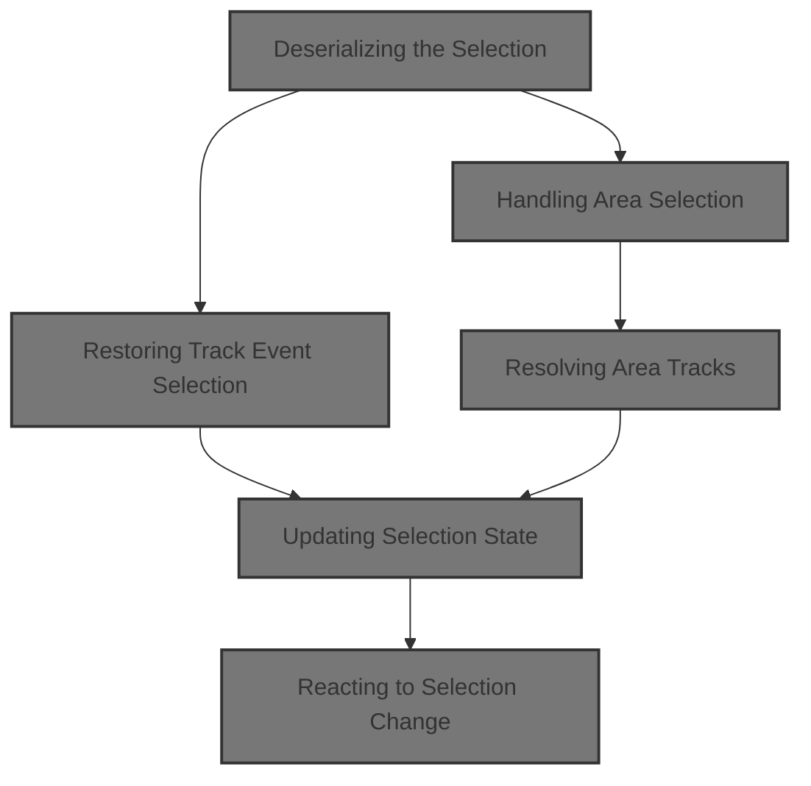

This document outlines how the trace UI restores a user's previous selection from a saved state. By analyzing the serialized selection, the system identifies whether it represents an event or an area, and updates the UI accordingly. This ensures users can seamlessly continue their work from where they left off.



# Deserializing the Selection

```mermaid
%%{init: {"flowchart": {"defaultRenderer": "elk"}} }%%
flowchart TD
  node1["Start restoring selection"] --> node2{"Selection type?"}
  click node1 openCode "ui/src/core/selection_manager.ts:129:131"
  node2 -->|TRACK_EVENT| node3["Restoring Track Event Selection"]
  click node2 openCode "ui/src/core/selection_manager.ts:131:139"
  
  node2 -->|"AREA"| node4["Resolving Area Tracks"]
  
  node3 -->|"Success"| node5["Selection restored"]
  node4 -->|"Success"| node5
  node3 -->|"Fail"| node6["Error Handling on Deserialization"]
  node4 -->|"Fail"| node6
  
  click node5 openCode "ui/src/core/selection_manager.ts:139:146"
classDef HeadingStyle fill:#777777,stroke:#333,stroke-width:2px;
click node3 goToHeading "Restoring Track Event Selection"
node3:::HeadingStyle
click node4 goToHeading "Resolving Area Tracks"
node4:::HeadingStyle
click node6 goToHeading "Error Handling on Deserialization"
node6:::HeadingStyle

%% Swimm:
%% %%{init: {"flowchart": {"defaultRenderer": "elk"}} }%%
%% flowchart TD
%%   node1["Start restoring selection"] --> node2{"Selection type?"}
%%   click node1 openCode "<SwmPath>[ui/…/core/selection_manager.ts](ui/src/core/selection_manager.ts)</SwmPath>:129:131"
%%   node2 -->|<SwmToken path="ui/src/core/selection_manager.ts" pos="132:4:4" line-data="        case &#39;TRACK_EVENT&#39;:">`TRACK_EVENT`</SwmToken>| node3["Restoring Track Event Selection"]
%%   click node2 openCode "<SwmPath>[ui/…/core/selection_manager.ts](ui/src/core/selection_manager.ts)</SwmPath>:131:139"
%%   
%%   node2 -->|"AREA"| node4["Resolving Area Tracks"]
%%   
%%   node3 -->|"Success"| node5["Selection restored"]
%%   node4 -->|"Success"| node5
%%   node3 -->|"Fail"| node6["Error Handling on Deserialization"]
%%   node4 -->|"Fail"| node6
%%   
%%   click node5 openCode "<SwmPath>[ui/…/core/selection_manager.ts](ui/src/core/selection_manager.ts)</SwmPath>:139:146"
%% classDef HeadingStyle fill:#777777,stroke:#333,stroke-width:2px;
%% click node3 goToHeading "Restoring Track Event Selection"
%% node3:::HeadingStyle
%% click node4 goToHeading "Resolving Area Tracks"
%% node4:::HeadingStyle
%% click node6 goToHeading "Error Handling on Deserialization"
%% node6:::HeadingStyle
```



<SwmSnippet path="/ui/src/core/selection_manager.ts" line="129">

---

In <SwmToken path="ui/src/core/selection_manager.ts" pos="129:5:5" line-data="  private async deserializeInternal(serialized: SerializedSelection) {">`deserializeInternal`</SwmToken>, we start by checking the type of selection ('kind'). For <SwmToken path="ui/src/core/selection_manager.ts" pos="132:4:4" line-data="        case &#39;TRACK_EVENT&#39;:">`TRACK_EVENT`</SwmToken>, we immediately delegate to <SwmToken path="ui/src/core/selection_manager.ts" pos="133:5:5" line-data="          await this.selectTrackEventInternal(">`selectTrackEventInternal`</SwmToken> to reconstruct the selection state for a track event. This sets up the context for restoring the user's previous selection.

```typescript
  private async deserializeInternal(serialized: SerializedSelection) {
    try {
      switch (serialized.kind) {
        case 'TRACK_EVENT':
          await this.selectTrackEventInternal(
            serialized.trackKey,
            parseInt(serialized.eventId),
            undefined,
            serialized.detailsPanel,
          );
          break;
```

---

</SwmSnippet>

## Restoring Track Event Selection

```mermaid
%%{init: {"flowchart": {"defaultRenderer": "elk"}} }%%
flowchart TD
    node1["Find track by identifier (trackUri)"] --> node2{"Is track found?"}
    click node1 openCode "ui/src/core/selection_manager.ts:423:428"
    node2 -->|"Yes"| node3{"Does track support selection details?"}
    node2 -->|"No"| node8["Cannot select event"]
    click node2 openCode "ui/src/core/selection_manager.ts:424:428"
    node3 -->|"Yes"| node4{"Are event details available for eventId?"}
    node3 -->|"No"| node8
    click node3 openCode "ui/src/core/selection_manager.ts:431:435"
    node4 -->|"Yes"| node5["Select and display event details"]
    node4 -->|"No"| node8
    click node4 openCode "ui/src/core/selection_manager.ts:437:442"
    node5 --> node6["Selection complete"]
    click node5 openCode "ui/src/core/selection_manager.ts:444:451"
    click node6 openCode "ui/src/core/selection_manager.ts:451:452"
    click node8 openCode "ui/src/core/selection_manager.ts:425:441"

classDef HeadingStyle fill:#777777,stroke:#333,stroke-width:2px;

%% Swimm:
%% %%{init: {"flowchart": {"defaultRenderer": "elk"}} }%%
%% flowchart TD
%%     node1["Find track by identifier (<SwmToken path="ui/src/core/selection_manager.ts" pos="418:1:1" line-data="    trackUri: string,">`trackUri`</SwmToken>)"] --> node2{"Is track found?"}
%%     click node1 openCode "<SwmPath>[ui/…/core/selection_manager.ts](ui/src/core/selection_manager.ts)</SwmPath>:423:428"
%%     node2 -->|"Yes"| node3{"Does track support selection details?"}
%%     node2 -->|"No"| node8["Cannot select event"]
%%     click node2 openCode "<SwmPath>[ui/…/core/selection_manager.ts](ui/src/core/selection_manager.ts)</SwmPath>:424:428"
%%     node3 -->|"Yes"| node4{"Are event details available for <SwmToken path="ui/src/core/selection_manager.ts" pos="135:5:5" line-data="            parseInt(serialized.eventId),">`eventId`</SwmToken>?"}
%%     node3 -->|"No"| node8
%%     click node3 openCode "<SwmPath>[ui/…/core/selection_manager.ts](ui/src/core/selection_manager.ts)</SwmPath>:431:435"
%%     node4 -->|"Yes"| node5["Select and display event details"]
%%     node4 -->|"No"| node8
%%     click node4 openCode "<SwmPath>[ui/…/core/selection_manager.ts](ui/src/core/selection_manager.ts)</SwmPath>:437:442"
%%     node5 --> node6["Selection complete"]
%%     click node5 openCode "<SwmPath>[ui/…/core/selection_manager.ts](ui/src/core/selection_manager.ts)</SwmPath>:444:451"
%%     click node6 openCode "<SwmPath>[ui/…/core/selection_manager.ts](ui/src/core/selection_manager.ts)</SwmPath>:451:452"
%%     click node8 openCode "<SwmPath>[ui/…/core/selection_manager.ts](ui/src/core/selection_manager.ts)</SwmPath>:425:441"
%% 
%% classDef HeadingStyle fill:#777777,stroke:#333,stroke-width:2px;
```



<SwmSnippet path="/ui/src/core/selection_manager.ts" line="417">

---

<SwmToken path="ui/src/core/selection_manager.ts" pos="417:5:5" line-data="  private async selectTrackEventInternal(">`selectTrackEventInternal`</SwmToken> fetches the track and its renderer, checks for selection details support, and builds the selection object. We then call <SwmToken path="ui/src/core/selection_manager.ts" pos="451:3:3" line-data="    this.setSelection(selection, opts);">`setSelection`</SwmToken> to update the selection state and trigger downstream UI updates.

```typescript
  private async selectTrackEventInternal(
    trackUri: string,
    eventId: number,
    opts?: SelectionOpts,
    serializedDetailsPanel?: unknown,
  ) {
    const track = this.trackManager.getTrack(trackUri);
    if (!track) {
      throw new Error(
        `Unable to resolve selection details: Track ${trackUri} not found`,
      );
    }

    const trackRenderer = track.renderer;
    if (!trackRenderer.getSelectionDetails) {
      throw new Error(
        `Unable to resolve selection details: Track ${trackUri} does not support selection details`,
      );
    }

    const details = await trackRenderer.getSelectionDetails(eventId);
    if (!exists(details)) {
      throw new Error(
        `Unable to resolve selection details: Track ${trackUri} returned no details for event ${eventId}`,
      );
    }

    const selection: TrackEventSelection = {
      ...details,
      kind: 'track_event',
      trackUri,
      eventId,
    };
    this.createTrackEventDetailsPanel(selection, serializedDetailsPanel);
    this.setSelection(selection, opts);
  }
```

---

</SwmSnippet>

## Updating Selection State

<SwmSnippet path="/ui/src/core/selection_manager.ts" line="332">

---

In <SwmToken path="ui/src/core/selection_manager.ts" pos="332:3:3" line-data="  private setSelection(selection: Selection, opts?: SelectionOpts) {">`setSelection`</SwmToken>, we update the internal selection state and immediately call <SwmToken path="ui/src/core/selection_manager.ts" pos="334:3:3" line-data="    this.onSelectionChange(selection, opts ?? {});">`onSelectionChange`</SwmToken> to propagate the change to other parts of the system.

```typescript
  private setSelection(selection: Selection, opts?: SelectionOpts) {
    this._selection = selection;
    this.onSelectionChange(selection, opts ?? {});

```

---

</SwmSnippet>

### Reacting to Selection Change

```mermaid
%%{init: {"flowchart": {"defaultRenderer": "elk"}} }%%
flowchart TD
  node1["Selection changes"] --> node2{"Clear search?"}
  click node1 openCode "ui/src/core/trace_impl.ts:176:186"
  node2 -->|"Yes"| node3["Reset search state"]
  click node2 openCode "ui/src/core/trace_impl.ts:178:180"
  node2 -->|"No"| node4
  node3 --> node4{"Switch to current selection tab AND selection not empty?"}
  node4 -->|"Yes"| node5["Show current selection tab"]
  click node4 openCode "ui/src/core/trace_impl.ts:181:183"
  node4 -->|"No"| node6["Update flows for new selection"]
  node5 --> node6["Update flows for new selection"]
  click node5 openCode "ui/src/core/trace_impl.ts:181:183"
  click node6 openCode "ui/src/core/trace_impl.ts:185:186"
classDef HeadingStyle fill:#777777,stroke:#333,stroke-width:2px;

%% Swimm:
%% %%{init: {"flowchart": {"defaultRenderer": "elk"}} }%%
%% flowchart TD
%%   node1["Selection changes"] --> node2{"Clear search?"}
%%   click node1 openCode "<SwmPath>[ui/…/core/trace_impl.ts](ui/src/core/trace_impl.ts)</SwmPath>:176:186"
%%   node2 -->|"Yes"| node3["Reset search state"]
%%   click node2 openCode "<SwmPath>[ui/…/core/trace_impl.ts](ui/src/core/trace_impl.ts)</SwmPath>:178:180"
%%   node2 -->|"No"| node4
%%   node3 --> node4{"Switch to current selection tab AND selection not empty?"}
%%   node4 -->|"Yes"| node5["Show current selection tab"]
%%   click node4 openCode "<SwmPath>[ui/…/core/trace_impl.ts](ui/src/core/trace_impl.ts)</SwmPath>:181:183"
%%   node4 -->|"No"| node6["Update flows for new selection"]
%%   node5 --> node6["Update flows for new selection"]
%%   click node5 openCode "<SwmPath>[ui/…/core/trace_impl.ts](ui/src/core/trace_impl.ts)</SwmPath>:181:183"
%%   click node6 openCode "<SwmPath>[ui/…/core/trace_impl.ts](ui/src/core/trace_impl.ts)</SwmPath>:185:186"
%% classDef HeadingStyle fill:#777777,stroke:#333,stroke-width:2px;
```



<SwmSnippet path="/ui/src/core/trace_impl.ts" line="176">

---

We reset the search state to keep things consistent with the new selection.

```typescript
  private onSelectionChange(selection: Selection, opts: SelectionOpts) {
    const {clearSearch = true, switchToCurrentSelectionTab = true} = opts;
    if (clearSearch) {
      this.search.reset();
    }
```

---

</SwmSnippet>

<SwmSnippet path="/ui/src/core/trace_impl.ts" line="181">

---

Back in <SwmToken path="ui/src/core/selection_manager.ts" pos="334:3:3" line-data="    this.onSelectionChange(selection, opts ?? {});">`onSelectionChange`</SwmToken>, after resetting the search, we switch to the selection tab if the selection isn't empty, then update flows to reflect the new selection context.

```typescript
    if (switchToCurrentSelectionTab && selection.kind !== 'empty') {
      this.tabs.showCurrentSelectionTab();
    }

    this.flows.updateFlows(selection);
  }
```

---

</SwmSnippet>

<SwmSnippet path="/ui/src/core/flow_manager.ts" line="453">

---

<SwmToken path="ui/src/core/flow_manager.ts" pos="453:1:1" line-data="  updateFlows(selection: Selection) {">`updateFlows`</SwmToken> initializes state, sets the current selection, and then branches based on selection kind. For <SwmToken path="ui/src/core/flow_manager.ts" pos="464:8:8" line-data="      selection.kind === &#39;track_event&#39; &amp;&amp;">`track_event`</SwmToken> with a 'slice' renderer, it calls <SwmToken path="ui/src/core/flow_manager.ts" pos="468:3:3" line-data="      this.sliceSelected(selection.eventId);">`sliceSelected`</SwmToken>; for 'area', it calls <SwmToken path="ui/src/core/flow_manager.ts" pos="474:3:3" line-data="      this.areaSelected(selection);">`areaSelected`</SwmToken>. Otherwise, it resets connected flows. This branching is key to handling different selection types.

```typescript
  updateFlows(selection: Selection) {
    this.initialize();
    this._curSelection = selection;

    if (selection.kind === 'empty') {
      this.setConnectedFlows([]);
      this.setSelectedFlows([]);
      return;
    }

    if (
      selection.kind === 'track_event' &&
      this.trackMgr.getTrack(selection.trackUri)?.renderer.rootTableName ===
        'slice'
    ) {
      this.sliceSelected(selection.eventId);
    } else {
      this.setConnectedFlows([]);
    }

    if (selection.kind === 'area') {
      this.areaSelected(selection);
    } else {
      this.setConnectedFlows([]);
    }
  }
```

---

</SwmSnippet>

### Scrolling to Selection

<SwmSnippet path="/ui/src/core/selection_manager.ts" line="336">

---

After returning from <SwmToken path="ui/src/core/selection_manager.ts" pos="334:3:3" line-data="    this.onSelectionChange(selection, opts ?? {});">`onSelectionChange`</SwmToken>, <SwmToken path="ui/src/core/selection_manager.ts" pos="112:3:3" line-data="    this.setSelection(">`setSelection`</SwmToken> optionally scrolls to the selected item if requested, making sure the UI focuses on the new selection.

```typescript
    if (opts?.scrollToSelection) {
      this.scrollToSelection();
    }
  }
```

---

</SwmSnippet>

## Handling Area Selection

<SwmSnippet path="/ui/src/core/selection_manager.ts" line="140">

---

Back in <SwmToken path="ui/src/core/selection_manager.ts" pos="129:5:5" line-data="  private async deserializeInternal(serialized: SerializedSelection) {">`deserializeInternal`</SwmToken>, after handling <SwmToken path="ui/src/core/selection_manager.ts" pos="132:4:4" line-data="        case &#39;TRACK_EVENT&#39;:">`TRACK_EVENT`</SwmToken>, we check for 'AREA' and call <SwmToken path="ui/src/core/selection_manager.ts" pos="141:3:3" line-data="          this.selectArea({">`selectArea`</SwmToken> with the relevant parameters to restore an area selection.

```typescript
        case 'AREA':
          this.selectArea({
            start: serialized.start,
            end: serialized.end,
            trackUris: serialized.trackUris,
          });
      }
```

---

</SwmSnippet>

## Resolving Area Tracks

```mermaid
%%{init: {"flowchart": {"defaultRenderer": "elk"}} }%%
flowchart TD
  node1{"Are area boundaries valid?"}
  click node1 openCode "ui/src/core/selection_manager.ts:99:99"
  node1 -->|"Yes"| node2["Resolve tracks for selection"]
  click node2 openCode "ui/src/core/selection_manager.ts:106:110"
  node1 -->|"No"| node7["Do not update selection"]
  click node7 openCode "ui/src/core/selection_manager.ts:99:99"

  subgraph loop1["For each track URI"]
    node2 --> node3{"Is track valid?"}
    click node3 openCode "ui/src/core/selection_manager.ts:107:108"
    node3 -->|"Yes"| node4["Add track to selection"]
    click node4 openCode "ui/src/core/selection_manager.ts:109:109"
    node3 -->|"No"| node2
    node4 --> node2
  end

  node2 --> node5["Update selection state with area and resolved tracks"]
  click node5 openCode "ui/src/core/selection_manager.ts:112:119"

classDef HeadingStyle fill:#777777,stroke:#333,stroke-width:2px;

%% Swimm:
%% %%{init: {"flowchart": {"defaultRenderer": "elk"}} }%%
%% flowchart TD
%%   node1{"Are area boundaries valid?"}
%%   click node1 openCode "<SwmPath>[ui/…/core/selection_manager.ts](ui/src/core/selection_manager.ts)</SwmPath>:99:99"
%%   node1 -->|"Yes"| node2["Resolve tracks for selection"]
%%   click node2 openCode "<SwmPath>[ui/…/core/selection_manager.ts](ui/src/core/selection_manager.ts)</SwmPath>:106:110"
%%   node1 -->|"No"| node7["Do not update selection"]
%%   click node7 openCode "<SwmPath>[ui/…/core/selection_manager.ts](ui/src/core/selection_manager.ts)</SwmPath>:99:99"
%% 
%%   subgraph loop1["For each track URI"]
%%     node2 --> node3{"Is track valid?"}
%%     click node3 openCode "<SwmPath>[ui/…/core/selection_manager.ts](ui/src/core/selection_manager.ts)</SwmPath>:107:108"
%%     node3 -->|"Yes"| node4["Add track to selection"]
%%     click node4 openCode "<SwmPath>[ui/…/core/selection_manager.ts](ui/src/core/selection_manager.ts)</SwmPath>:109:109"
%%     node3 -->|"No"| node2
%%     node4 --> node2
%%   end
%% 
%%   node2 --> node5["Update selection state with area and resolved tracks"]
%%   click node5 openCode "<SwmPath>[ui/…/core/selection_manager.ts](ui/src/core/selection_manager.ts)</SwmPath>:112:119"
%% 
%% classDef HeadingStyle fill:#777777,stroke:#333,stroke-width:2px;
```



<SwmSnippet path="/ui/src/core/selection_manager.ts" line="97">

---

In <SwmToken path="ui/src/core/selection_manager.ts" pos="97:1:1" line-data="  selectArea(area: Area, opts?: SelectionOpts): void {">`selectArea`</SwmToken>, we resolve each track URI to its descriptor, filter out any missing tracks, and build a list of valid tracks to include in the selection object.

```typescript
  selectArea(area: Area, opts?: SelectionOpts): void {
    const {start, end} = area;
    assertTrue(start <= end);

    // In the case of area selection, the caller provides a list of trackUris.
    // However, all the consumers want to access the resolved Tracks. Rather
    // than delegating this to the various consumers, we resolve them now once
    // and for all and place them in the selection object.
    const tracks = [];
    for (const uri of area.trackUris) {
      const trackDescr = this.trackManager.getTrack(uri);
      if (trackDescr === undefined) continue;
      tracks.push(trackDescr);
    }
```

---

</SwmSnippet>

<SwmSnippet path="/ui/src/core/selection_manager.ts" line="112">

---

After resolving the tracks, we call <SwmToken path="ui/src/core/selection_manager.ts" pos="112:3:3" line-data="    this.setSelection(">`setSelection`</SwmToken> with the area and its tracks to update the selection state.

```typescript
    this.setSelection(
      {
        ...area,
        kind: 'area',
        tracks,
      },
      opts,
    );
  }
```

---

</SwmSnippet>

## Error Handling on Deserialization

<SwmSnippet path="/ui/src/core/selection_manager.ts" line="147">

---

After returning from <SwmToken path="ui/src/core/selection_manager.ts" pos="97:1:1" line-data="  selectArea(area: Area, opts?: SelectionOpts): void {">`selectArea`</SwmToken>, if anything fails in <SwmToken path="ui/src/core/selection_manager.ts" pos="129:5:5" line-data="  private async deserializeInternal(serialized: SerializedSelection) {">`deserializeInternal`</SwmToken>, we show a modal explaining that version mismatches can prevent restoring the selection.

```typescript
    } catch (ex) {
      showModal({
        title: 'Failed to restore the selected event',
        content: m(
          'div',
          m(
            'p',
            `Due to a version skew between the version of the UI the trace was
             shared with and the version of the UI you are using, we were
             unable to restore the selected event.`,
          ),
          m(
            'p',
            `These backwards incompatible changes are very rare but is in some
             cases unavoidable. We apologise for the inconvenience.`,
          ),
        ),
        buttons: [
          {
            text: 'Continue',
            primary: true,
          },
        ],
      });
    }
  }
```

---

</SwmSnippet>

&nbsp;

*This is an auto-generated document by Swimm 🌊 and has not yet been verified by a human*

<SwmMeta version="3.0.0" repo-id="Z2l0aHViJTNBJTNBY3BsdXNwbHVzLXBlcmZldHRvJTNBJTNBcmljYXJkb2xvcGV6Zw==" repo-name="cplusplus-perfetto"><sup>Powered by [Swimm](https://app.swimm.io/)</sup></SwmMeta>
