This document describes how the system retrieves detailed information about a specific slice using its unique identifier. The process provides users with enriched slice details, including thread and process context, supporting in-depth trace analysis.


# Where is this flow used?

This flow is used multiple times in the codebase as represented in the following diagram:

```mermaid
graph TD;
      a27bc901e1ea2d341a9fff9091233e47bd74537e21715a867a4d402662fe172f(ui/…/details/thread_slice_details_tab.ts::getSliceDetails) --> 9fa39b53a00adcb70ed765bcb652286f12c1e61b825d33f31c0d67a33b797613(ui/…/sql_utils/slice.ts::getSlice):::mainFlowStyle

776a5f882f8020368a353fdfc5f8cb15708d5521f9c4ccae706eb4f149c212cb(ui/…/details/thread_slice_details_tab.ts::ThreadSliceDetailsPanel.load) --> a27bc901e1ea2d341a9fff9091233e47bd74537e21715a867a4d402662fe172f(ui/…/details/thread_slice_details_tab.ts::getSliceDetails)

cadf26964040d5b11321377c4485472071baab2ff1965c8aacfbad8816f13521(ui/…/sql_utils/slice.ts::getDescendantSliceTree) --> 9fa39b53a00adcb70ed765bcb652286f12c1e61b825d33f31c0d67a33b797613(ui/…/sql_utils/slice.ts::getSlice):::mainFlowStyle

aaf52a3555c463af125463aa69081dc5ad18b9a365e91f412bf37fd745ac854f(ui/…/org.chromium.ChromeScrollJank/event_latency_details_panel.ts::EventLatencySliceDetailsPanel.loadEventLatencyBreakdown) --> cadf26964040d5b11321377c4485472071baab2ff1965c8aacfbad8816f13521(ui/…/sql_utils/slice.ts::getDescendantSliceTree)

18f9ca4a2e38f11b4b696685d692e2e3849e545094c5c52312400d9a25527b60(ui/…/org.chromium.ChromeScrollJank/event_latency_details_panel.ts::EventLatencySliceDetailsPanel.load) --> aaf52a3555c463af125463aa69081dc5ad18b9a365e91f412bf37fd745ac854f(ui/…/org.chromium.ChromeScrollJank/event_latency_details_panel.ts::EventLatencySliceDetailsPanel.loadEventLatencyBreakdown)

18f9ca4a2e38f11b4b696685d692e2e3849e545094c5c52312400d9a25527b60(ui/…/org.chromium.ChromeScrollJank/event_latency_details_panel.ts::EventLatencySliceDetailsPanel.load) --> a20e1d6891c573c98010b1590d91b65bb7c895619f3c2ff34e1708e45f305a50(ui/…/org.chromium.ChromeScrollJank/event_latency_details_panel.ts::EventLatencySliceDetailsPanel.loadSlice)

5a5bac6353645a2be7c23e32b41fd4fcfe5354c83ee20f0ca61655451076c238(ui/…/tracks/debug_slice_track_details_panel.ts::DebugSliceTrackDetailsPanel.maybeLoadSlice) --> 9fa39b53a00adcb70ed765bcb652286f12c1e61b825d33f31c0d67a33b797613(ui/…/sql_utils/slice.ts::getSlice):::mainFlowStyle

fd8281d821b8fefd7915502b6cf4c65a483ec2ccae6809a5fab290aebef37912(ui/…/tracks/debug_slice_track_details_panel.ts::DebugSliceTrackDetailsPanel.load) --> 5a5bac6353645a2be7c23e32b41fd4fcfe5354c83ee20f0ca61655451076c238(ui/…/tracks/debug_slice_track_details_panel.ts::DebugSliceTrackDetailsPanel.maybeLoadSlice)

45d61454d5a68d78bab41f19c934fc6e1515d8ddb27416c3cad1d3af6e42a04f(ui/…/dev.perfetto.Screenshots/screenshot_panel.ts::ScreenshotDetailsPanel.load) --> 9fa39b53a00adcb70ed765bcb652286f12c1e61b825d33f31c0d67a33b797613(ui/…/sql_utils/slice.ts::getSlice):::mainFlowStyle

a20e1d6891c573c98010b1590d91b65bb7c895619f3c2ff34e1708e45f305a50(ui/…/org.chromium.ChromeScrollJank/event_latency_details_panel.ts::EventLatencySliceDetailsPanel.loadSlice) --> 9fa39b53a00adcb70ed765bcb652286f12c1e61b825d33f31c0d67a33b797613(ui/…/sql_utils/slice.ts::getSlice):::mainFlowStyle

eb51763f471588db78257531d2eb3eba8c9c7fc4cf1545d24d399330f8ed1b9b(ui/…/org.chromium.ChromeScrollJank/scroll_jank_v3_details_panel.ts::getSliceDetails) --> 9fa39b53a00adcb70ed765bcb652286f12c1e61b825d33f31c0d67a33b797613(ui/…/sql_utils/slice.ts::getSlice):::mainFlowStyle

b2639bf8980e0d30c6c33ad7939c043db3b05a00f7ef0a9bc8de4c883d516876(ui/…/org.chromium.ChromeScrollJank/scroll_jank_v3_details_panel.ts::ScrollJankV3DetailsPanel.loadSlices) --> eb51763f471588db78257531d2eb3eba8c9c7fc4cf1545d24d399330f8ed1b9b(ui/…/org.chromium.ChromeScrollJank/scroll_jank_v3_details_panel.ts::getSliceDetails)

0c1f0fff73e8d200446d106c698b72f49f3199147bb0aeeb76f3b841709a3c54(ui/…/org.chromium.ChromeScrollJank/scroll_jank_v3_details_panel.ts::ScrollJankV3DetailsPanel.load) --> b2639bf8980e0d30c6c33ad7939c043db3b05a00f7ef0a9bc8de4c883d516876(ui/…/org.chromium.ChromeScrollJank/scroll_jank_v3_details_panel.ts::ScrollJankV3DetailsPanel.loadSlices)


classDef mainFlowStyle color:#000000,fill:#7CB9F4
classDef rootsStyle color:#000000,fill:#00FFF4
classDef Style1 color:#000000,fill:#00FFAA
classDef Style2 color:#000000,fill:#FFFF00
classDef Style3 color:#000000,fill:#AA7CB9

%% Swimm:
%% graph TD;
%%       a27bc901e1ea2d341a9fff9091233e47bd74537e21715a867a4d402662fe172f(<SwmPath>[ui/…/details/thread_slice_details_tab.ts](ui/src/components/details/thread_slice_details_tab.ts)</SwmPath>::getSliceDetails) --> 9fa39b53a00adcb70ed765bcb652286f12c1e61b825d33f31c0d67a33b797613(<SwmPath>[ui/…/sql_utils/slice.ts](ui/src/components/sql_utils/slice.ts)</SwmPath>::<SwmToken path="ui/src/components/sql_utils/slice.ts" pos="146:6:6" line-data="export async function getSlice(">`getSlice`</SwmToken>):::mainFlowStyle
%% 
%% 776a5f882f8020368a353fdfc5f8cb15708d5521f9c4ccae706eb4f149c212cb(<SwmPath>[ui/…/details/thread_slice_details_tab.ts](ui/src/components/details/thread_slice_details_tab.ts)</SwmPath>::ThreadSliceDetailsPanel.load) --> a27bc901e1ea2d341a9fff9091233e47bd74537e21715a867a4d402662fe172f(<SwmPath>[ui/…/details/thread_slice_details_tab.ts](ui/src/components/details/thread_slice_details_tab.ts)</SwmPath>::getSliceDetails)
%% 
%% cadf26964040d5b11321377c4485472071baab2ff1965c8aacfbad8816f13521(<SwmPath>[ui/…/sql_utils/slice.ts](ui/src/components/sql_utils/slice.ts)</SwmPath>::<SwmToken path="ui/src/components/sql_utils/slice.ts" pos="170:6:6" line-data="export async function getDescendantSliceTree(">`getDescendantSliceTree`</SwmToken>) --> 9fa39b53a00adcb70ed765bcb652286f12c1e61b825d33f31c0d67a33b797613(<SwmPath>[ui/…/sql_utils/slice.ts](ui/src/components/sql_utils/slice.ts)</SwmPath>::<SwmToken path="ui/src/components/sql_utils/slice.ts" pos="146:6:6" line-data="export async function getSlice(">`getSlice`</SwmToken>):::mainFlowStyle
%% 
%% aaf52a3555c463af125463aa69081dc5ad18b9a365e91f412bf37fd745ac854f(<SwmPath>[ui/…/org.chromium.ChromeScrollJank/event_latency_details_panel.ts](ui/src/plugins/org.chromium.ChromeScrollJank/event_latency_details_panel.ts)</SwmPath>::EventLatencySliceDetailsPanel.loadEventLatencyBreakdown) --> cadf26964040d5b11321377c4485472071baab2ff1965c8aacfbad8816f13521(<SwmPath>[ui/…/sql_utils/slice.ts](ui/src/components/sql_utils/slice.ts)</SwmPath>::<SwmToken path="ui/src/components/sql_utils/slice.ts" pos="170:6:6" line-data="export async function getDescendantSliceTree(">`getDescendantSliceTree`</SwmToken>)
%% 
%% 18f9ca4a2e38f11b4b696685d692e2e3849e545094c5c52312400d9a25527b60(<SwmPath>[ui/…/org.chromium.ChromeScrollJank/event_latency_details_panel.ts](ui/src/plugins/org.chromium.ChromeScrollJank/event_latency_details_panel.ts)</SwmPath>::EventLatencySliceDetailsPanel.load) --> aaf52a3555c463af125463aa69081dc5ad18b9a365e91f412bf37fd745ac854f(<SwmPath>[ui/…/org.chromium.ChromeScrollJank/event_latency_details_panel.ts](ui/src/plugins/org.chromium.ChromeScrollJank/event_latency_details_panel.ts)</SwmPath>::EventLatencySliceDetailsPanel.loadEventLatencyBreakdown)
%% 
%% 18f9ca4a2e38f11b4b696685d692e2e3849e545094c5c52312400d9a25527b60(<SwmPath>[ui/…/org.chromium.ChromeScrollJank/event_latency_details_panel.ts](ui/src/plugins/org.chromium.ChromeScrollJank/event_latency_details_panel.ts)</SwmPath>::EventLatencySliceDetailsPanel.load) --> a20e1d6891c573c98010b1590d91b65bb7c895619f3c2ff34e1708e45f305a50(<SwmPath>[ui/…/org.chromium.ChromeScrollJank/event_latency_details_panel.ts](ui/src/plugins/org.chromium.ChromeScrollJank/event_latency_details_panel.ts)</SwmPath>::EventLatencySliceDetailsPanel.loadSlice)
%% 
%% 5a5bac6353645a2be7c23e32b41fd4fcfe5354c83ee20f0ca61655451076c238(<SwmPath>[ui/…/tracks/debug_slice_track_details_panel.ts](ui/src/components/tracks/debug_slice_track_details_panel.ts)</SwmPath>::DebugSliceTrackDetailsPanel.maybeLoadSlice) --> 9fa39b53a00adcb70ed765bcb652286f12c1e61b825d33f31c0d67a33b797613(<SwmPath>[ui/…/sql_utils/slice.ts](ui/src/components/sql_utils/slice.ts)</SwmPath>::<SwmToken path="ui/src/components/sql_utils/slice.ts" pos="146:6:6" line-data="export async function getSlice(">`getSlice`</SwmToken>):::mainFlowStyle
%% 
%% fd8281d821b8fefd7915502b6cf4c65a483ec2ccae6809a5fab290aebef37912(<SwmPath>[ui/…/tracks/debug_slice_track_details_panel.ts](ui/src/components/tracks/debug_slice_track_details_panel.ts)</SwmPath>::DebugSliceTrackDetailsPanel.load) --> 5a5bac6353645a2be7c23e32b41fd4fcfe5354c83ee20f0ca61655451076c238(<SwmPath>[ui/…/tracks/debug_slice_track_details_panel.ts](ui/src/components/tracks/debug_slice_track_details_panel.ts)</SwmPath>::DebugSliceTrackDetailsPanel.maybeLoadSlice)
%% 
%% 45d61454d5a68d78bab41f19c934fc6e1515d8ddb27416c3cad1d3af6e42a04f(<SwmPath>[ui/…/dev.perfetto.Screenshots/screenshot_panel.ts](ui/src/plugins/dev.perfetto.Screenshots/screenshot_panel.ts)</SwmPath>::ScreenshotDetailsPanel.load) --> 9fa39b53a00adcb70ed765bcb652286f12c1e61b825d33f31c0d67a33b797613(<SwmPath>[ui/…/sql_utils/slice.ts](ui/src/components/sql_utils/slice.ts)</SwmPath>::<SwmToken path="ui/src/components/sql_utils/slice.ts" pos="146:6:6" line-data="export async function getSlice(">`getSlice`</SwmToken>):::mainFlowStyle
%% 
%% a20e1d6891c573c98010b1590d91b65bb7c895619f3c2ff34e1708e45f305a50(<SwmPath>[ui/…/org.chromium.ChromeScrollJank/event_latency_details_panel.ts](ui/src/plugins/org.chromium.ChromeScrollJank/event_latency_details_panel.ts)</SwmPath>::EventLatencySliceDetailsPanel.loadSlice) --> 9fa39b53a00adcb70ed765bcb652286f12c1e61b825d33f31c0d67a33b797613(<SwmPath>[ui/…/sql_utils/slice.ts](ui/src/components/sql_utils/slice.ts)</SwmPath>::<SwmToken path="ui/src/components/sql_utils/slice.ts" pos="146:6:6" line-data="export async function getSlice(">`getSlice`</SwmToken>):::mainFlowStyle
%% 
%% eb51763f471588db78257531d2eb3eba8c9c7fc4cf1545d24d399330f8ed1b9b(<SwmPath>[ui/…/org.chromium.ChromeScrollJank/scroll_jank_v3_details_panel.ts](ui/src/plugins/org.chromium.ChromeScrollJank/scroll_jank_v3_details_panel.ts)</SwmPath>::getSliceDetails) --> 9fa39b53a00adcb70ed765bcb652286f12c1e61b825d33f31c0d67a33b797613(<SwmPath>[ui/…/sql_utils/slice.ts](ui/src/components/sql_utils/slice.ts)</SwmPath>::<SwmToken path="ui/src/components/sql_utils/slice.ts" pos="146:6:6" line-data="export async function getSlice(">`getSlice`</SwmToken>):::mainFlowStyle
%% 
%% b2639bf8980e0d30c6c33ad7939c043db3b05a00f7ef0a9bc8de4c883d516876(<SwmPath>[ui/…/org.chromium.ChromeScrollJank/scroll_jank_v3_details_panel.ts](ui/src/plugins/org.chromium.ChromeScrollJank/scroll_jank_v3_details_panel.ts)</SwmPath>::ScrollJankV3DetailsPanel.loadSlices) --> eb51763f471588db78257531d2eb3eba8c9c7fc4cf1545d24d399330f8ed1b9b(<SwmPath>[ui/…/org.chromium.ChromeScrollJank/scroll_jank_v3_details_panel.ts](ui/src/plugins/org.chromium.ChromeScrollJank/scroll_jank_v3_details_panel.ts)</SwmPath>::getSliceDetails)
%% 
%% 0c1f0fff73e8d200446d106c698b72f49f3199147bb0aeeb76f3b841709a3c54(<SwmPath>[ui/…/org.chromium.ChromeScrollJank/scroll_jank_v3_details_panel.ts](ui/src/plugins/org.chromium.ChromeScrollJank/scroll_jank_v3_details_panel.ts)</SwmPath>::ScrollJankV3DetailsPanel.load) --> b2639bf8980e0d30c6c33ad7939c043db3b05a00f7ef0a9bc8de4c883d516876(<SwmPath>[ui/…/org.chromium.ChromeScrollJank/scroll_jank_v3_details_panel.ts](ui/src/plugins/org.chromium.ChromeScrollJank/scroll_jank_v3_details_panel.ts)</SwmPath>::ScrollJankV3DetailsPanel.loadSlices)
%% 
%% 
%% classDef mainFlowStyle color:#000000,fill:#7CB9F4
%% classDef rootsStyle color:#000000,fill:#00FFF4
%% classDef Style1 color:#000000,fill:#00FFAA
%% classDef Style2 color:#000000,fill:#FFFF00
%% classDef Style3 color:#000000,fill:#AA7CB9
```



# Fetching a Single Slice by ID


<SwmSnippet path="/ui/src/components/sql_utils/slice.ts" line="146">

---

GetSlice kicks off the flow by requesting a slice with a specific ID. It delegates the actual query logic to <SwmToken path="ui/src/components/sql_utils/slice.ts" pos="150:9:9" line-data="  const result = await getSliceFromConstraints(engine, {">`getSliceFromConstraints`</SwmToken>, passing a filter for the ID. This keeps the query logic centralized and lets us reuse constraint-based querying elsewhere. We call <SwmToken path="ui/src/components/sql_utils/slice.ts" pos="150:9:9" line-data="  const result = await getSliceFromConstraints(engine, {">`getSliceFromConstraints`</SwmToken> next to handle the actual SQL and result parsing, then check for multiple or missing results before returning the slice.

```typescript
export async function getSlice(
  engine: Engine,
  id: SliceSqlId,
): Promise<SliceDetails | undefined> {
  const result = await getSliceFromConstraints(engine, {
    filters: [`id=${id}`],
  });
  if (result.length > 1) {
    throw new Error(`slice table has more than one row with id ${id}`);
  }
  if (result.length === 0) {
    return undefined;
  }
  return result[0];
}
```

---

</SwmSnippet>

# Querying Slices with Constraints

<SwmSnippet path="/ui/src/components/sql_utils/slice.ts" line="76">

---

In <SwmToken path="ui/src/components/sql_utils/slice.ts" pos="76:6:6" line-data="export async function getSliceFromConstraints(">`getSliceFromConstraints`</SwmToken>, we build and run a SQL query to fetch slices matching the given constraints. For each result, we need to enrich the slice with thread and process info, so we call <SwmToken path="ui/src/components/sql_utils/slice.ts" pos="113:14:14" line-data="    const {utid, upid} = await getUtidAndUpid(engine, it.trackId);">`getUtidAndUpid`</SwmToken> and then <SwmToken path="ui/src/components/sql_utils/slice.ts" pos="116:15:15" line-data="      utid === undefined ? undefined : await getThreadInfo(engine, utid);">`getThreadInfo`</SwmToken> to fetch thread details. This gives us the context needed for each slice.

```typescript
export async function getSliceFromConstraints(
  engine: Engine,
  constraints: SQLConstraints,
): Promise<SliceDetails[]> {
  const query = await engine.query(`
    SELECT
      id,
      name,
      ts,
      dur,
      track_id as trackId,
      depth,
      parent_id as parentId,
      thread_dur as threadDur,
      thread_ts as threadTs,
      category,
      arg_set_id as argSetId,
      ABS_TIME_STR(ts) as absTime
    FROM slice
    ${constraintsToQuerySuffix(constraints)}`);
  const it = query.iter({
    id: NUM,
    name: STR_NULL,
    ts: LONG,
    dur: LONG,
    trackId: NUM,
    depth: NUM,
    parentId: NUM_NULL,
    threadDur: LONG_NULL,
    threadTs: LONG_NULL,
    category: STR_NULL,
    argSetId: NUM_NULL,
    absTime: STR_NULL,
  });

  const result: SliceDetails[] = [];
  for (; it.valid(); it.next()) {
    const {utid, upid} = await getUtidAndUpid(engine, it.trackId);

    const thread: ThreadInfo | undefined =
      utid === undefined ? undefined : await getThreadInfo(engine, utid);
```

---

</SwmSnippet>

## Retrieving Thread and Process Context


<SwmSnippet path="/ui/src/components/sql_utils/thread.ts" line="31">

---

GetThreadInfo queries the thread table for details about a thread, and if there's a valid upid, it calls <SwmToken path="ui/src/components/sql_utils/thread.ts" pos="52:10:10" line-data="    process: upid ? await getProcessInfo(engine, upid) : undefined,">`getProcessInfo`</SwmToken> to fetch process details. This way, each <SwmToken path="ui/src/components/sql_utils/thread.ts" pos="34:5:5" line-data="): Promise&lt;ThreadInfo&gt; {">`ThreadInfo`</SwmToken> can optionally include process context if available.

```typescript
export async function getThreadInfo(
  engine: Engine,
  utid: Utid,
): Promise<ThreadInfo> {
  const it = (
    await engine.query(`
        SELECT tid, name, upid
        FROM thread
        WHERE utid = ${utid};
    `)
  ).iter({tid: LONG, name: STR_NULL, upid: NUM_NULL});
  if (!it.valid()) {
    return {
      utid,
    };
  }
  const upid = fromNumNull(it.upid) as Upid | undefined;
  return {
    utid,
    tid: it.tid,
    name: it.name ?? undefined,
    process: upid ? await getProcessInfo(engine, upid) : undefined,
  };
}
```

---

</SwmSnippet>

<SwmSnippet path="/ui/src/components/sql_utils/process.ts" line="37">

---

GetProcessInfo runs a SQL query that joins the process table with <SwmToken path="ui/src/components/sql_utils/process.ts" pos="51:5:5" line-data="    left join android_process_metadata m using (upid)">`android_process_metadata`</SwmToken> using upid, pulling in extra fields like package name and version code. It uses Perfetto's module system to get Android-specific metadata, then maps the result to a <SwmToken path="ui/src/components/sql_utils/process.ts" pos="40:5:5" line-data="): Promise&lt;ProcessInfo&gt; {">`ProcessInfo`</SwmToken> object, handling nullable fields as needed.

```typescript
export async function getProcessInfo(
  engine: Engine,
  upid: Upid,
): Promise<ProcessInfo> {
  const res = await engine.query(`
    include perfetto module android.process_metadata;
    select
      p.upid,
      p.pid,
      p.name,
      p.uid,
      m.package_name as packageName,
      m.version_code as versionCode
    from process p
    left join android_process_metadata m using (upid)
    where upid = ${upid};
  `);
  const row = res.firstRow({
    upid: NUM,
    pid: LONG,
    name: STR_NULL,
    uid: NUM_NULL,
    packageName: STR_NULL,
    versionCode: NUM_NULL,
  });
  return {
    upid,
    pid: row.pid,
    name: row.name ?? undefined,
    uid: fromNumNull(row.uid),
    packageName: row.packageName ?? undefined,
    versionCode: fromNumNull(row.versionCode),
  };
}
```

---

</SwmSnippet>

## Attaching Process Context to Slices


<SwmSnippet path="/ui/src/components/sql_utils/slice.ts" line="117">

---

Back in <SwmToken path="ui/src/components/sql_utils/slice.ts" pos="76:6:6" line-data="export async function getSliceFromConstraints(">`getSliceFromConstraints`</SwmToken>, after getting thread info, we check if process info is available from the thread. If not, and we have an upid, we call <SwmToken path="ui/src/components/sql_utils/slice.ts" pos="122:5:5" line-data="          : await getProcessInfo(engine, upid);">`getProcessInfo`</SwmToken> directly to make sure each slice gets process context when possible.

```typescript
    const process: ProcessInfo | undefined =
      thread !== undefined
        ? thread.process
        : upid === undefined
          ? undefined
          : await getProcessInfo(engine, upid);

```

---

</SwmSnippet>

<SwmSnippet path="/ui/src/components/sql_utils/slice.ts" line="124">

---

After returning from <SwmToken path="ui/src/components/sql_utils/slice.ts" pos="122:5:5" line-data="          : await getProcessInfo(engine, upid);">`getProcessInfo`</SwmToken> in <SwmToken path="ui/src/components/sql_utils/slice.ts" pos="76:6:6" line-data="export async function getSliceFromConstraints(">`getSliceFromConstraints`</SwmToken>, we assemble the final <SwmToken path="ui/src/components/sql_utils/slice.ts" pos="79:5:5" line-data="): Promise&lt;SliceDetails[]&gt; {">`SliceDetails`</SwmToken> object for each slice, including thread, process, and optional args if present. Each result is pushed to the array for return.

```typescript
    result.push({
      id: asSliceSqlId(it.id),
      name: it.name ?? undefined,
      ts: Time.fromRaw(it.ts),
      dur: it.dur,
      trackId: it.trackId,
      depth: it.depth,
      parentId: asSliceSqlId(it.parentId ?? undefined),
      thread,
      process,
      threadDur: it.threadDur ?? undefined,
      threadTs: exists(it.threadTs) ? Time.fromRaw(it.threadTs) : undefined,
      category: it.category ?? undefined,
      args: exists(it.argSetId)
        ? await getArgs(engine, asArgSetId(it.argSetId))
        : undefined,
      absTime: it.absTime ?? undefined,
    });
  }
  return result;
}
```

---

</SwmSnippet>

&nbsp;

*This is an auto-generated document by Swimm 🌊 and has not yet been verified by a human*

<SwmMeta version="3.0.0" repo-id="Z2l0aHViJTNBJTNBY3BsdXNwbHVzLXBlcmZldHRvJTNBJTNBcmljYXJkb2xvcGV6Zw==" repo-name="cplusplus-perfetto"><sup>Powered by [Swimm](https://app.swimm.io/)</sup></SwmMeta>
