This document outlines the flow for executing a user-initiated query, materializing results if needed, and updating the UI and dependent nodes with the latest data and metadata. The process starts with a user action, proceeds through validation and materialization, and concludes with metadata updates and downstream notifications.

# Where is this flow used?

This flow is used multiple times in the codebase as represented in the following diagram:

```mermaid
graph TD;
      b509ccb45cc8e03f65f3168ab47121baa9de9ad7412e3aa7a1083bfd1c46be2f(ui/…/query_builder/builder.ts::Builder.view) --> b210847ba2269abc50d96479cbbfa7aa626dd0ad8266536847a9e4912d5bc8bf(ui/…/query_builder/builder.ts::Builder.runQuery)

bea9f7ceae81187b5c6b970858397922a6eb7dcefb75715e6d613243cfd72b16(ui/…/query_builder/builder.ts::onQueryAnalyzed) --> b210847ba2269abc50d96479cbbfa7aa626dd0ad8266536847a9e4912d5bc8bf(ui/…/query_builder/builder.ts::Builder.runQuery)

fc81f01c08b603aa2a5d75b94458942bf4f1b1e10f628adc6585937a17d93145(ui/…/query_builder/node_explorer.ts::NodeExplorer.updateQuery) --> bea9f7ceae81187b5c6b970858397922a6eb7dcefb75715e6d613243cfd72b16(ui/…/query_builder/builder.ts::onQueryAnalyzed)

3a56a00908da944cd130db84f174dc56f722b317349226d05773e25033c8e79f(ui/…/query_builder/node_explorer.ts::NodeExplorer.view) --> fc81f01c08b603aa2a5d75b94458942bf4f1b1e10f628adc6585937a17d93145(ui/…/query_builder/node_explorer.ts::NodeExplorer.updateQuery)

a9f2f5b35be2ed9e379a59849afc419d0d71008306de54d6fb417acdba4e035e(ui/…/query_builder/builder.ts::onExecute) --> b210847ba2269abc50d96479cbbfa7aa626dd0ad8266536847a9e4912d5bc8bf(ui/…/query_builder/builder.ts::Builder.runQuery)

6244d2e66df4715d6efb84e66b7a39d517a3021ab95d1eb57561663002c713e7(ui/…/query_builder/data_explorer.ts::DataExplorer.renderContent) --> a9f2f5b35be2ed9e379a59849afc419d0d71008306de54d6fb417acdba4e035e(ui/…/query_builder/builder.ts::onExecute)

b9ad6ef77117e3c529314fc0052ca0617fa1f9633fa8a33b768049ba7840b713(ui/…/query_builder/data_explorer.ts::DataExplorer.view) --> 6244d2e66df4715d6efb84e66b7a39d517a3021ab95d1eb57561663002c713e7(ui/…/query_builder/data_explorer.ts::DataExplorer.renderContent)

b9ad6ef77117e3c529314fc0052ca0617fa1f9633fa8a33b768049ba7840b713(ui/…/query_builder/data_explorer.ts::DataExplorer.view) --> 504cc4eac8b384ecfbdc67119bb0889424ef5a12659f9818553d919f57235dc5(ui/…/query_builder/data_explorer.ts::DataExplorer.renderMenu)

f27a7a24035117cd3be4a062cfa141bf704c78db86fb3b46519f1965219e6d5e(ui/…/query_builder/data_explorer.ts::onclick) --> a9f2f5b35be2ed9e379a59849afc419d0d71008306de54d6fb417acdba4e035e(ui/…/query_builder/builder.ts::onExecute)

504cc4eac8b384ecfbdc67119bb0889424ef5a12659f9818553d919f57235dc5(ui/…/query_builder/data_explorer.ts::DataExplorer.renderMenu) --> a9f2f5b35be2ed9e379a59849afc419d0d71008306de54d6fb417acdba4e035e(ui/…/query_builder/builder.ts::onExecute)

f27a7a24035117cd3be4a062cfa141bf704c78db86fb3b46519f1965219e6d5e(ui/…/query_builder/data_explorer.ts::onclick) --> a9f2f5b35be2ed9e379a59849afc419d0d71008306de54d6fb417acdba4e035e(ui/…/query_builder/builder.ts::onExecute)


classDef mainFlowStyle color:#000000,fill:#7CB9F4
classDef rootsStyle color:#000000,fill:#00FFF4
classDef Style1 color:#000000,fill:#00FFAA
classDef Style2 color:#000000,fill:#FFFF00
classDef Style3 color:#000000,fill:#AA7CB9

%% Swimm:
%% graph TD;
%%       b509ccb45cc8e03f65f3168ab47121baa9de9ad7412e3aa7a1083bfd1c46be2f(<SwmPath>[ui/…/query_builder/builder.ts](ui/src/plugins/dev.perfetto.ExplorePage/query_builder/builder.ts)</SwmPath>::Builder.view) --> b210847ba2269abc50d96479cbbfa7aa626dd0ad8266536847a9e4912d5bc8bf(<SwmPath>[ui/…/query_builder/builder.ts](ui/src/plugins/dev.perfetto.ExplorePage/query_builder/builder.ts)</SwmPath>::<SwmToken path="ui/src/plugins/dev.perfetto.ExplorePage/query_builder/builder.ts" pos="41:5:7" line-data="// 1. Builder.runQuery() is called (auto or manual)">`Builder.runQuery`</SwmToken>)
%% 
%% bea9f7ceae81187b5c6b970858397922a6eb7dcefb75715e6d613243cfd72b16(<SwmPath>[ui/…/query_builder/builder.ts](ui/src/plugins/dev.perfetto.ExplorePage/query_builder/builder.ts)</SwmPath>::<SwmToken path="ui/src/plugins/dev.perfetto.ExplorePage/query_builder/builder.ts" pos="27:7:7" line-data="// 5. Calls onQueryAnalyzed() callback with the validated query">`onQueryAnalyzed`</SwmToken>) --> b210847ba2269abc50d96479cbbfa7aa626dd0ad8266536847a9e4912d5bc8bf(<SwmPath>[ui/…/query_builder/builder.ts](ui/src/plugins/dev.perfetto.ExplorePage/query_builder/builder.ts)</SwmPath>::<SwmToken path="ui/src/plugins/dev.perfetto.ExplorePage/query_builder/builder.ts" pos="41:5:7" line-data="// 1. Builder.runQuery() is called (auto or manual)">`Builder.runQuery`</SwmToken>)
%% 
%% fc81f01c08b603aa2a5d75b94458942bf4f1b1e10f628adc6585937a17d93145(<SwmPath>[ui/…/query_builder/node_explorer.ts](ui/src/plugins/dev.perfetto.ExplorePage/query_builder/node_explorer.ts)</SwmPath>::<SwmToken path="ui/src/plugins/dev.perfetto.ExplorePage/query_builder/builder.ts" pos="23:5:7" line-data="// 1. NodeExplorer.updateQuery() is called (debounced via AsyncLimiter)">`NodeExplorer.updateQuery`</SwmToken>) --> bea9f7ceae81187b5c6b970858397922a6eb7dcefb75715e6d613243cfd72b16(<SwmPath>[ui/…/query_builder/builder.ts](ui/src/plugins/dev.perfetto.ExplorePage/query_builder/builder.ts)</SwmPath>::<SwmToken path="ui/src/plugins/dev.perfetto.ExplorePage/query_builder/builder.ts" pos="27:7:7" line-data="// 5. Calls onQueryAnalyzed() callback with the validated query">`onQueryAnalyzed`</SwmToken>)
%% 
%% 3a56a00908da944cd130db84f174dc56f722b317349226d05773e25033c8e79f(<SwmPath>[ui/…/query_builder/node_explorer.ts](ui/src/plugins/dev.perfetto.ExplorePage/query_builder/node_explorer.ts)</SwmPath>::NodeExplorer.view) --> fc81f01c08b603aa2a5d75b94458942bf4f1b1e10f628adc6585937a17d93145(<SwmPath>[ui/…/query_builder/node_explorer.ts](ui/src/plugins/dev.perfetto.ExplorePage/query_builder/node_explorer.ts)</SwmPath>::<SwmToken path="ui/src/plugins/dev.perfetto.ExplorePage/query_builder/builder.ts" pos="23:5:7" line-data="// 1. NodeExplorer.updateQuery() is called (debounced via AsyncLimiter)">`NodeExplorer.updateQuery`</SwmToken>)
%% 
%% a9f2f5b35be2ed9e379a59849afc419d0d71008306de54d6fb417acdba4e035e(<SwmPath>[ui/…/query_builder/builder.ts](ui/src/plugins/dev.perfetto.ExplorePage/query_builder/builder.ts)</SwmPath>::<SwmToken path="ui/src/plugins/dev.perfetto.ExplorePage/query_builder/builder.ts" pos="318:1:1" line-data="              onExecute: () =&gt; {">`onExecute`</SwmToken>) --> b210847ba2269abc50d96479cbbfa7aa626dd0ad8266536847a9e4912d5bc8bf(<SwmPath>[ui/…/query_builder/builder.ts](ui/src/plugins/dev.perfetto.ExplorePage/query_builder/builder.ts)</SwmPath>::<SwmToken path="ui/src/plugins/dev.perfetto.ExplorePage/query_builder/builder.ts" pos="41:5:7" line-data="// 1. Builder.runQuery() is called (auto or manual)">`Builder.runQuery`</SwmToken>)
%% 
%% 6244d2e66df4715d6efb84e66b7a39d517a3021ab95d1eb57561663002c713e7(<SwmPath>[ui/…/query_builder/data_explorer.ts](ui/src/plugins/dev.perfetto.ExplorePage/query_builder/data_explorer.ts)</SwmPath>::DataExplorer.renderContent) --> a9f2f5b35be2ed9e379a59849afc419d0d71008306de54d6fb417acdba4e035e(<SwmPath>[ui/…/query_builder/builder.ts](ui/src/plugins/dev.perfetto.ExplorePage/query_builder/builder.ts)</SwmPath>::<SwmToken path="ui/src/plugins/dev.perfetto.ExplorePage/query_builder/builder.ts" pos="318:1:1" line-data="              onExecute: () =&gt; {">`onExecute`</SwmToken>)
%% 
%% b9ad6ef77117e3c529314fc0052ca0617fa1f9633fa8a33b768049ba7840b713(<SwmPath>[ui/…/query_builder/data_explorer.ts](ui/src/plugins/dev.perfetto.ExplorePage/query_builder/data_explorer.ts)</SwmPath>::DataExplorer.view) --> 6244d2e66df4715d6efb84e66b7a39d517a3021ab95d1eb57561663002c713e7(<SwmPath>[ui/…/query_builder/data_explorer.ts](ui/src/plugins/dev.perfetto.ExplorePage/query_builder/data_explorer.ts)</SwmPath>::DataExplorer.renderContent)
%% 
%% b9ad6ef77117e3c529314fc0052ca0617fa1f9633fa8a33b768049ba7840b713(<SwmPath>[ui/…/query_builder/data_explorer.ts](ui/src/plugins/dev.perfetto.ExplorePage/query_builder/data_explorer.ts)</SwmPath>::DataExplorer.view) --> 504cc4eac8b384ecfbdc67119bb0889424ef5a12659f9818553d919f57235dc5(<SwmPath>[ui/…/query_builder/data_explorer.ts](ui/src/plugins/dev.perfetto.ExplorePage/query_builder/data_explorer.ts)</SwmPath>::DataExplorer.renderMenu)
%% 
%% f27a7a24035117cd3be4a062cfa141bf704c78db86fb3b46519f1965219e6d5e(<SwmPath>[ui/…/query_builder/data_explorer.ts](ui/src/plugins/dev.perfetto.ExplorePage/query_builder/data_explorer.ts)</SwmPath>::onclick) --> a9f2f5b35be2ed9e379a59849afc419d0d71008306de54d6fb417acdba4e035e(<SwmPath>[ui/…/query_builder/builder.ts](ui/src/plugins/dev.perfetto.ExplorePage/query_builder/builder.ts)</SwmPath>::<SwmToken path="ui/src/plugins/dev.perfetto.ExplorePage/query_builder/builder.ts" pos="318:1:1" line-data="              onExecute: () =&gt; {">`onExecute`</SwmToken>)
%% 
%% 504cc4eac8b384ecfbdc67119bb0889424ef5a12659f9818553d919f57235dc5(<SwmPath>[ui/…/query_builder/data_explorer.ts](ui/src/plugins/dev.perfetto.ExplorePage/query_builder/data_explorer.ts)</SwmPath>::DataExplorer.renderMenu) --> a9f2f5b35be2ed9e379a59849afc419d0d71008306de54d6fb417acdba4e035e(<SwmPath>[ui/…/query_builder/builder.ts](ui/src/plugins/dev.perfetto.ExplorePage/query_builder/builder.ts)</SwmPath>::<SwmToken path="ui/src/plugins/dev.perfetto.ExplorePage/query_builder/builder.ts" pos="318:1:1" line-data="              onExecute: () =&gt; {">`onExecute`</SwmToken>)
%% 
%% f27a7a24035117cd3be4a062cfa141bf704c78db86fb3b46519f1965219e6d5e(<SwmPath>[ui/…/query_builder/data_explorer.ts](ui/src/plugins/dev.perfetto.ExplorePage/query_builder/data_explorer.ts)</SwmPath>::onclick) --> a9f2f5b35be2ed9e379a59849afc419d0d71008306de54d6fb417acdba4e035e(<SwmPath>[ui/…/query_builder/builder.ts](ui/src/plugins/dev.perfetto.ExplorePage/query_builder/builder.ts)</SwmPath>::<SwmToken path="ui/src/plugins/dev.perfetto.ExplorePage/query_builder/builder.ts" pos="318:1:1" line-data="              onExecute: () =&gt; {">`onExecute`</SwmToken>)
%% 
%% 
%% classDef mainFlowStyle color:#000000,fill:#7CB9F4
%% classDef rootsStyle color:#000000,fill:#00FFF4
%% classDef Style1 color:#000000,fill:#00FFAA
%% classDef Style2 color:#000000,fill:#FFFF00
%% classDef Style3 color:#000000,fill:#AA7CB9
```



# Running and Validating the Query Node


<SwmSnippet path="/ui/src/plugins/dev.perfetto.ExplorePage/query_builder/builder.ts" line="516">

---

In <SwmToken path="ui/src/plugins/dev.perfetto.ExplorePage/query_builder/builder.ts" pos="516:5:5" line-data="  private async runQuery(node: QueryNode) {">`runQuery`</SwmToken>, we kick off the query execution by checking if the query is valid and hasn't already run. We compute a hash of the query node to see if we can reuse an existing materialized table or need to drop and recreate it. If the node structure is off and we can't get a hash, we call <SwmToken path="ui/src/plugins/dev.perfetto.ExplorePage/query_builder/builder.ts" pos="533:3:3" line-data="      this.handleQueryError(">`handleQueryError`</SwmToken> to record the error and bail out early. This avoids running queries on broken nodes and keeps materialization logic tight.

```typescript
  private async runQuery(node: QueryNode) {
    if (
      this.query === undefined ||
      this.query instanceof Error ||
      this.queryExecuted
    ) {
      return;
    }

    this.isQueryRunning = true;
    const queryStartMs = performance.now();
    let tableName: string | undefined;
    let createdNewMaterialization = false;
    const currentQueryHash = hashNodeQuery(node);

    // If we can't get a hash, something is wrong with the node
    if (currentQueryHash === undefined) {
      this.handleQueryError(
        node,
        new Error('Cannot generate query hash - invalid node structure'),
      );
      this.isQueryRunning = false;
      return;
    }

```

---

</SwmSnippet>

<SwmSnippet path="/ui/src/plugins/dev.perfetto.ExplorePage/query_builder/builder.ts" line="651">

---

<SwmToken path="ui/src/plugins/dev.perfetto.ExplorePage/query_builder/builder.ts" pos="651:3:3" line-data="  private handleQueryError(node: QueryNode, e: unknown) {">`handleQueryError`</SwmToken> logs the error, resets the query state, and attaches a <SwmToken path="ui/src/plugins/dev.perfetto.ExplorePage/query_builder/builder.ts" pos="655:11:11" line-data="      node.state.issues = new NodeIssues();">`NodeIssues`</SwmToken> object to the node's state if needed. It then records the error in the issues property. This keeps error tracking consistent and tied to the node for later inspection or UI display.

```typescript
  private handleQueryError(node: QueryNode, e: unknown) {
    console.error('Failed to run query:', e);
    this.resetQueryState();
    if (!node.state.issues) {
      node.state.issues = new NodeIssues();
    }
    node.state.issues.queryError =
      e instanceof Error ? e : new Error(String(e));
  }
```

---

</SwmSnippet>

<SwmSnippet path="/ui/src/plugins/dev.perfetto.ExplorePage/query_builder/builder.ts" line="541">

---

After error handling in <SwmToken path="ui/src/plugins/dev.perfetto.ExplorePage/query_builder/builder.ts" pos="516:5:5" line-data="  private async runQuery(node: QueryNode) {">`runQuery`</SwmToken>, we decide whether to reuse or recreate the materialized table, then call the materialization service if needed.

```typescript
    try {
      const engine = this.materializationService.getEngine();

      // Check if we can reuse existing materialization
      if (this.canReuseMaterialization(node, currentQueryHash)) {
        // Query hasn't changed, reuse existing materialized table
        tableName = node.state.materializationTableName!;
        console.log(
          `Reusing materialized table ${tableName} for node ${node.nodeId}`,
        );
      } else {
        // Query changed - drop old materialization if it exists
        if (node.state.materialized) {
          await this.materializationService.dropMaterialization(node);
        }

        // Materialize the new query
        tableName = await this.materializationService.materializeNode(
          node,
          this.query,
          currentQueryHash,
        );
        createdNewMaterialization = true;
      }

```

---

</SwmSnippet>

## Debounced Materialization and Table Creation


<SwmSnippet path="/ui/src/plugins/dev.perfetto.ExplorePage/query_builder/materialization_service.ts" line="40">

---

<SwmToken path="ui/src/plugins/dev.perfetto.ExplorePage/query_builder/materialization_service.ts" pos="40:3:3" line-data="  async materializeNode(">`materializeNode`</SwmToken> debounces materialization and returns a Promise that resolves after the delay and table creation.

```typescript
  async materializeNode(
    node: QueryNode,
    query: Query,
    queryHash: string,
  ): Promise<string> {
    // Cancel any pending materialization
    if (this.materializeTimer !== undefined) {
      clearTimeout(this.materializeTimer);
    }

    // Return a promise that resolves after debouncing
    return new Promise((resolve, reject) => {
      this.materializeTimer = setTimeout(async () => {
        try {
          const tableName = await this.performMaterialization(
            node,
            query,
            queryHash,
          );
```

---

</SwmSnippet>

<SwmSnippet path="/ui/src/plugins/dev.perfetto.ExplorePage/query_builder/materialization_service.ts" line="73">

---

<SwmToken path="ui/src/plugins/dev.perfetto.ExplorePage/query_builder/materialization_service.ts" pos="73:5:5" line-data="  private async performMaterialization(">`performMaterialization`</SwmToken> builds and runs SQL to include Perfetto modules and preambles, then creates or replaces the materialized table using the query's SQL. It updates the node's state with materialization info and the query hash for cache management, then returns the table name.

```typescript
  private async performMaterialization(
    node: QueryNode,
    query: Query,
    queryHash: string,
  ): Promise<string> {
    const tableName = this.getTableName(node);

    // Build the full SQL with includes and preambles
    const includes = query.modules.map((c) => `INCLUDE PERFETTO MODULE ${c};`);
    const parts: string[] = [];
    if (includes.length > 0) {
      parts.push(includes.join('\n'));
    }
    if (query.preambles.length > 0) {
      parts.push(query.preambles.join('\n'));
    }

    // Execute the includes and preambles first
    if (parts.length > 0) {
      const fullSql = parts.join('\n');
      await this.engine.query(fullSql);
    }

    // Create or replace the materialized table
    const createTableSql = `CREATE OR REPLACE PERFETTO TABLE ${tableName} AS ${query.sql}`;
    await this.engine.query(createTableSql);

    // Update node state
    node.state.materialized = true;
    node.state.materializationTableName = tableName;
    // Store query hash for cache invalidation when query changes
    node.state.materializedQueryHash = queryHash;

    return tableName;
  }
```

---

</SwmSnippet>

<SwmSnippet path="/ui/src/plugins/dev.perfetto.ExplorePage/query_builder/materialization_service.ts" line="59">

---

After <SwmToken path="ui/src/plugins/dev.perfetto.ExplorePage/query_builder/materialization_service.ts" pos="54:11:11" line-data="          const tableName = await this.performMaterialization(">`performMaterialization`</SwmToken> finishes, the Promise from <SwmToken path="ui/src/plugins/dev.perfetto.ExplorePage/query_builder/builder.ts" pos="558:11:11" line-data="        tableName = await this.materializationService.materializeNode(">`materializeNode`</SwmToken> resolves or rejects based on the outcome. The debounce delay is set by a repo constant, so timing is consistent across all materializations.

```typescript
          this.materializeTimer = undefined;
          resolve(tableName);
        } catch (error) {
          this.materializeTimer = undefined;
          reject(error);
        }
      }, MaterializationService.MATERIALIZE_DEBOUNCE_MS);
    });
  }
```

---

</SwmSnippet>

## Fetching Metadata and Setting Up Data Source

<SwmSnippet path="/ui/src/plugins/dev.perfetto.ExplorePage/query_builder/builder.ts" line="566">

---

After materialization, we fetch count and schema, build the UI response, set up data source, and call <SwmToken path="ui/src/plugins/dev.perfetto.ExplorePage/query_builder/builder.ts" pos="591:3:3" line-data="      this.setNodeIssuesFromResponse(node, this.query, this.response);">`setNodeIssuesFromResponse`</SwmToken> for error handling.

```typescript
      // Fetch metadata: count and columns (we need both for the UI)
      // If these fail, we want to clean up the materialized table
      const [countQueryResult, schemaQueryResult] = await Promise.all([
        engine.query(`SELECT COUNT(*) as count FROM ${tableName}`),
        engine.query(`SELECT * FROM ${tableName} LIMIT 1`),
      ]);

      // Build response object with metadata
      const response: QueryResponse = {
        query: queryToRun(this.query),
        totalRowCount: Number(countQueryResult.firstRow({count: NUM}).count),
        durationMs: performance.now() - queryStartMs,
        columns: schemaQueryResult.columns(),
        rows: [], // SQLDataSource fetches rows on-demand
        statementCount: 1,
        statementWithOutputCount: 1,
        lastStatementSql: this.query.sql,
      };
      this.response = response;

      // Create data source for server-side pagination/filtering/sorting
      this.dataSource = new SQLDataSource(engine, `SELECT * FROM ${tableName}`);

      // Handle errors and warnings
      this.queryExecuted = true;
      this.setNodeIssuesFromResponse(node, this.query, this.response);

```

---

</SwmSnippet>

## Error and Warning Analysis from Query Response


<SwmSnippet path="/ui/src/plugins/dev.perfetto.ExplorePage/query_builder/builder.ts" line="616">

---

In <SwmToken path="ui/src/plugins/dev.perfetto.ExplorePage/query_builder/builder.ts" pos="616:3:3" line-data="  private setNodeIssuesFromResponse(">`setNodeIssuesFromResponse`</SwmToken>, we analyze the query and response for errors and warnings using helper functions. We also check for empty results to flag a <SwmToken path="ui/src/plugins/dev.perfetto.ExplorePage/query_builder/builder.ts" pos="623:3:3" line-data="    const noDataWarning =">`noDataWarning`</SwmToken>. Next, we call the utils to get warning details.

```typescript
  private setNodeIssuesFromResponse(
    node: QueryNode,
    query: Query,
    response: QueryResponse,
  ) {
    const error = findErrors(query, response);
    const warning = findWarnings(response, node);
    const noDataWarning =
      response.totalRowCount === 0
        ? new Error('Query returned no rows')
        : undefined;

```

---

</SwmSnippet>

<SwmSnippet path="/ui/src/plugins/dev.perfetto.ExplorePage/query_builder/query_builder_utils.ts" line="32">

---

<SwmToken path="ui/src/plugins/dev.perfetto.ExplorePage/query_builder/query_builder_utils.ts" pos="32:4:4" line-data="export function findWarnings(">`findWarnings`</SwmToken> checks if the response is valid, then enforces that only 'INCLUDE PERFETTO MODULE ...;' statements can precede the main query for SqlSourceNodes. It also checks if the last statement produces output, returning errors for violations. Regex is used to validate statement types.

```typescript
export function findWarnings(
  response: QueryResponse | undefined,
  node: QueryNode,
): Error | undefined {
  if (!response || response.error) {
    return undefined;
  }

  if (
    response.statementCount > 0 &&
    response.statementWithOutputCount === 0 &&
    response.columns.length === 0
  ) {
    return new Error('The last statement must produce an output.');
  }

  if (node instanceof SqlSourceNode && response.statementCount > 1) {
    const statements = response.query
      .split(';')
      .map((x) => x.trim())
      .filter((x) => x.length > 0);
    const allButLast = statements.slice(0, statements.length - 1);
    const moduleIncludeRegex = /^\s*INCLUDE\s+PERFETTO\s+MODULE\s+[\w._]+\s*$/i;
    for (const stmt of allButLast) {
      if (!moduleIncludeRegex.test(stmt)) {
        return new Error(
          `Only 'INCLUDE PERFETTO MODULE ...;' statements are ` +
            `allowed before the final statement. Error on: "${stmt}"`,
        );
      }
    }
  }

  return undefined;
}
```

---

</SwmSnippet>

<SwmSnippet path="/ui/src/plugins/dev.perfetto.ExplorePage/query_builder/builder.ts" line="628">

---

After getting warnings from the utils, <SwmToken path="ui/src/plugins/dev.perfetto.ExplorePage/query_builder/builder.ts" pos="591:3:3" line-data="      this.setNodeIssuesFromResponse(node, this.query, this.response);">`setNodeIssuesFromResponse`</SwmToken> updates the node's issues property with any errors or warnings found. If nothing is wrong, it clears the issues property.

```typescript
    if (error || warning || noDataWarning) {
      if (!node.state.issues) {
        node.state.issues = new NodeIssues();
      }
      node.state.issues.queryError = error;
      node.state.issues.responseError = warning;
      node.state.issues.dataError = noDataWarning;
    } else {
      node.state.issues = undefined;
    }
  }
```

---

</SwmSnippet>

## Updating Source Node Metadata and Notifying Dependents

<SwmSnippet path="/ui/src/plugins/dev.perfetto.ExplorePage/query_builder/builder.ts" line="593">

---

After setting node issues in <SwmToken path="ui/src/plugins/dev.perfetto.ExplorePage/query_builder/builder.ts" pos="516:5:5" line-data="  private async runQuery(node: QueryNode) {">`runQuery`</SwmToken>, if the node is a <SwmToken path="ui/src/plugins/dev.perfetto.ExplorePage/query_builder/builder.ts" pos="594:8:8" line-data="      if (node instanceof SqlSourceNode &amp;&amp; this.response !== undefined) {">`SqlSourceNode`</SwmToken>, we call <SwmToken path="ui/src/plugins/dev.perfetto.ExplorePage/query_builder/builder.ts" pos="595:3:3" line-data="        node.onQueryExecuted(this.response.columns);">`onQueryExecuted`</SwmToken> with the columns. This updates metadata and notifies downstream nodes for <SwmToken path="ui/src/plugins/dev.perfetto.ExplorePage/query_builder/builder.ts" pos="597:3:5" line-data="        // re-analysis for downstream nodes without marking this node as changed.">`re-analysis`</SwmToken>, but doesn't mark the node as changed.

```typescript
      // Update columns for SQL source nodes
      if (node instanceof SqlSourceNode && this.response !== undefined) {
        node.onQueryExecuted(this.response.columns);
        // Note: onQueryExecuted() calls notifyNextNodes() which triggers
        // re-analysis for downstream nodes without marking this node as changed.
        // We don't need to resetQueryState() here as that would clear the results display.
      }
```

---

</SwmSnippet>

## Updating Columns and Triggering Downstream Analysis

<SwmSnippet path="/ui/src/plugins/dev.perfetto.ExplorePage/query_builder/nodes/sources/sql_source.ts" line="80">

---

In <SwmToken path="ui/src/plugins/dev.perfetto.ExplorePage/query_builder/nodes/sources/sql_source.ts" pos="80:1:1" line-data="  onQueryExecuted(columns: string[]) {">`onQueryExecuted`</SwmToken>, we update the node's source columns with the latest metadata. This sets up the node for downstream notifications and keeps column info current.

```typescript
  onQueryExecuted(columns: string[]) {
    this.setSourceColumns(columns);
```

---

</SwmSnippet>

### Setting Source Columns and Column Metadata

See <SwmLink doc-title="Updating Displayed Columns in the Data Exploration Interface">[Updating Displayed Columns in the Data Exploration Interface](/.swm/updating-displayed-columns-in-the-data-exploration-interface.4t8bo6ob.sw.md)</SwmLink>

### Notifying Downstream Nodes After Column Update

<SwmSnippet path="/ui/src/plugins/dev.perfetto.ExplorePage/query_builder/nodes/sources/sql_source.ts" line="82">

---

After updating columns in <SwmToken path="ui/src/plugins/dev.perfetto.ExplorePage/query_builder/builder.ts" pos="595:3:3" line-data="        node.onQueryExecuted(this.response.columns);">`onQueryExecuted`</SwmToken>, we notify downstream nodes so they can re-analyze with the new metadata. This doesn't mark the node as changed, so only metadata updates propagate.

```typescript
    // Notify downstream nodes that our columns have changed, but don't mark
    // this node as having an operation change (which would cause hash to change
    // and trigger re-execution). Column discovery is metadata, not a query change.
    notifyNextNodes(this);
  }
```

---

</SwmSnippet>

## Final Error Handling and Cleanup


<SwmSnippet path="/ui/src/plugins/dev.perfetto.ExplorePage/query_builder/builder.ts" line="600">

---

After downstream updates in <SwmToken path="ui/src/plugins/dev.perfetto.ExplorePage/query_builder/builder.ts" pos="516:5:5" line-data="  private async runQuery(node: QueryNode) {">`runQuery`</SwmToken>, if any errors occur, we clean up by dropping the materialized table if it was newly created, then call <SwmToken path="ui/src/plugins/dev.perfetto.ExplorePage/query_builder/builder.ts" pos="609:3:3" line-data="      this.handleQueryError(node, e);">`handleQueryError`</SwmToken> to log the error. This avoids leaving bad data and keeps error tracking consistent.

```typescript
    } catch (e) {
      // If we created a new materialization and it failed, clean it up
      if (createdNewMaterialization && tableName !== undefined) {
        try {
          await this.materializationService.dropMaterialization(node);
        } catch (dropError) {
          console.error('Failed to clean up materialized table:', dropError);
        }
      }
      this.handleQueryError(node, e);
    } finally {
      this.isQueryRunning = false;
      m.redraw();
    }
  }
```

---

</SwmSnippet>

&nbsp;

*This is an auto-generated document by Swimm 🌊 and has not yet been verified by a human*

<SwmMeta version="3.0.0" repo-id="Z2l0aHViJTNBJTNBY3BsdXNwbHVzLXBlcmZldHRvJTNBJTNBcmljYXJkb2xvcGV6Zw==" repo-name="cplusplus-perfetto"><sup>Powered by [Swimm](https://app.swimm.io/)</sup></SwmMeta>
