This document describes how users can save and activate a new configuration by providing a unique name. The system saves and activates the configuration, then updates the UI to reflect the change.

# Saving and Activating a New Configuration

```mermaid
%%{init: {"flowchart": {"defaultRenderer": "elk"}} }%%
flowchart TD
  node1["Prompt user for configuration name"]
  click node1 openCode "ui/src/plugins/dev.perfetto.RecordTraceV2/pages/target_selection_page.ts:307:307"
  node1 --> node2{"Is name non-empty?"}
  click node2 openCode "ui/src/plugins/dev.perfetto.RecordTraceV2/pages/target_selection_page.ts:308:308"
  node2 -->|"Yes"| node3{"Is name unique?"}
  node2 -->|"No"| node8["End"]
  click node3 openCode "ui/src/plugins/dev.perfetto.RecordTraceV2/pages/target_selection_page.ts:310:310"
  node3 -->|"Yes"| node4["Save configuration"]
  node3 -->|"No"| node5["Alert: Name already exists"]
  click node4 openCode "ui/src/plugins/dev.perfetto.RecordTraceV2/pages/target_selection_page.ts:316:317"
  click node5 openCode "ui/src/plugins/dev.perfetto.RecordTraceV2/pages/target_selection_page.ts:311:314"
  node4 --> node6["Activate configuration"]
  click node6 openCode "ui/src/plugins/dev.perfetto.RecordTraceV2/pages/target_selection_page.ts:318:322"
  node6 --> node7["Refresh UI"]
  click node7 openCode "ui/src/plugins/dev.perfetto.RecordTraceV2/pages/target_selection_page.ts:323:323"
  node7 --> node8["End"]
  click node8 openCode "ui/src/plugins/dev.perfetto.RecordTraceV2/pages/target_selection_page.ts:325:325"

classDef HeadingStyle fill:#777777,stroke:#333,stroke-width:2px;

%% Swimm:
%% %%{init: {"flowchart": {"defaultRenderer": "elk"}} }%%
%% flowchart TD
%%   node1["Prompt user for configuration name"]
%%   click node1 openCode "<SwmPath>[ui/…/pages/target_selection_page.ts](ui/src/plugins/dev.perfetto.RecordTraceV2/pages/target_selection_page.ts)</SwmPath>:307:307"
%%   node1 --> node2{"Is name non-empty?"}
%%   click node2 openCode "<SwmPath>[ui/…/pages/target_selection_page.ts](ui/src/plugins/dev.perfetto.RecordTraceV2/pages/target_selection_page.ts)</SwmPath>:308:308"
%%   node2 -->|"Yes"| node3{"Is name unique?"}
%%   node2 -->|"No"| node8["End"]
%%   click node3 openCode "<SwmPath>[ui/…/pages/target_selection_page.ts](ui/src/plugins/dev.perfetto.RecordTraceV2/pages/target_selection_page.ts)</SwmPath>:310:310"
%%   node3 -->|"Yes"| node4["Save configuration"]
%%   node3 -->|"No"| node5["Alert: Name already exists"]
%%   click node4 openCode "<SwmPath>[ui/…/pages/target_selection_page.ts](ui/src/plugins/dev.perfetto.RecordTraceV2/pages/target_selection_page.ts)</SwmPath>:316:317"
%%   click node5 openCode "<SwmPath>[ui/…/pages/target_selection_page.ts](ui/src/plugins/dev.perfetto.RecordTraceV2/pages/target_selection_page.ts)</SwmPath>:311:314"
%%   node4 --> node6["Activate configuration"]
%%   click node6 openCode "<SwmPath>[ui/…/pages/target_selection_page.ts](ui/src/plugins/dev.perfetto.RecordTraceV2/pages/target_selection_page.ts)</SwmPath>:318:322"
%%   node6 --> node7["Refresh UI"]
%%   click node7 openCode "<SwmPath>[ui/…/pages/target_selection_page.ts](ui/src/plugins/dev.perfetto.RecordTraceV2/pages/target_selection_page.ts)</SwmPath>:323:323"
%%   node7 --> node8["End"]
%%   click node8 openCode "<SwmPath>[ui/…/pages/target_selection_page.ts](ui/src/plugins/dev.perfetto.RecordTraceV2/pages/target_selection_page.ts)</SwmPath>:325:325"
%% 
%% classDef HeadingStyle fill:#777777,stroke:#333,stroke-width:2px;
```



<SwmSnippet path="/ui/src/plugins/dev.perfetto.RecordTraceV2/pages/target_selection_page.ts" line="306">

---

Onclick kicks off the flow by prompting the user for a configuration name, checks if it's unique among saved configs, and if so, serializes the current session, saves it, loads it as the active config, and triggers a UI redraw. The uniqueness check prevents overwriting, and the 'saved:' prefix in <SwmToken path="ui/src/plugins/dev.perfetto.RecordTraceV2/pages/target_selection_page.ts" pos="320:1:1" line-data="                    configId: `saved:${trimmedName}`,">`configId`</SwmToken> helps distinguish saved configs internally.

```typescript
              onclick: () => {
                const name = prompt('Enter a name for this configuration:');
                if (name?.trim()) {
                  const trimmedName = name.trim();
                  if (recMgr.savedConfigs.some((s) => s.name === trimmedName)) {
                    alert(
                      `A configuration named "${trimmedName}" already exists.`,
                    );
                    return;
                  }
                  const savedConfig = recMgr.serializeSession();
                  recMgr.saveConfig(trimmedName, savedConfig);
                  recMgr.loadConfig({
                    config: savedConfig,
                    configId: `saved:${trimmedName}`,
                    configName: trimmedName,
                  });
                  recMgr.app.raf.scheduleFullRedraw();
                }
              },
```

---

</SwmSnippet>

&nbsp;

*This is an auto-generated document by Swimm 🌊 and has not yet been verified by a human*

<SwmMeta version="3.0.0" repo-id="Z2l0aHViJTNBJTNBY3BsdXNwbHVzLXBlcmZldHRvJTNBJTNBcmljYXJkb2xvcGV6Zw==" repo-name="cplusplus-perfetto"><sup>Powered by [Swimm](https://app.swimm.io/)</sup></SwmMeta>
