This document explains how scroll event data is transformed into a detailed performance summary for users. By loading timing information and gathering related metrics such as input events, frame statistics, delays, and offsets, the system provides a visual and quantitative analysis of scroll behavior.

# Loading Scroll Event Data

```mermaid
%%{init: {"flowchart": {"defaultRenderer": "elk"}} }%%
flowchart TD
  node1["Query scroll event details (id, start time, duration)"]
  click node1 openCode "ui/src/plugins/org.chromium.ChromeScrollJank/scroll_details_panel.ts:88:104"
  node1 --> node2{"How to determine end time?"}
  node2 -->|"gesture_scroll_end_ts present"| node3["Set end time to gesture_scroll_end_ts"]
  node2 -->|"gesture_scroll_begin_ts present"| node4["Set end time to gesture_scroll_begin_ts + duration"]
  node2 -->|"Otherwise"| node5["Set end time to ts + duration"]
  node3 --> node6["Store scroll event id, start time, end time, duration"]
  node4 --> node6
  node5 --> node6
  click node6 openCode "ui/src/plugins/org.chromium.ChromeScrollJank/scroll_details_panel.ts:111:115"
  node6 --> node7["Load additional scroll metrics"]
  click node7 openCode "ui/src/plugins/org.chromium.ChromeScrollJank/scroll_details_panel.ts:117:117"
classDef HeadingStyle fill:#777777,stroke:#333,stroke-width:2px;

%% Swimm:
%% %%{init: {"flowchart": {"defaultRenderer": "elk"}} }%%
%% flowchart TD
%%   node1["Query scroll event details (id, start time, duration)"]
%%   click node1 openCode "<SwmPath>[ui/…/org.chromium.ChromeScrollJank/scroll_details_panel.ts](ui/src/plugins/org.chromium.ChromeScrollJank/scroll_details_panel.ts)</SwmPath>:88:104"
%%   node1 --> node2{"How to determine end time?"}
%%   node2 -->|"<SwmToken path="ui/src/plugins/org.chromium.ChromeScrollJank/scroll_details_panel.ts" pos="94:3:3" line-data="            WHEN gesture_scroll_end_ts IS NOT NULL THEN gesture_scroll_end_ts">`gesture_scroll_end_ts`</SwmToken> present"| node3["Set end time to <SwmToken path="ui/src/plugins/org.chromium.ChromeScrollJank/scroll_details_panel.ts" pos="94:3:3" line-data="            WHEN gesture_scroll_end_ts IS NOT NULL THEN gesture_scroll_end_ts">`gesture_scroll_end_ts`</SwmToken>"]
%%   node2 -->|"<SwmToken path="ui/src/plugins/org.chromium.ChromeScrollJank/scroll_details_panel.ts" pos="92:3:3" line-data="          IFNULL(gesture_scroll_begin_ts, ts) AS start_ts,">`gesture_scroll_begin_ts`</SwmToken> present"| node4["Set end time to <SwmToken path="ui/src/plugins/org.chromium.ChromeScrollJank/scroll_details_panel.ts" pos="92:3:3" line-data="          IFNULL(gesture_scroll_begin_ts, ts) AS start_ts,">`gesture_scroll_begin_ts`</SwmToken> + duration"]
%%   node2 -->|"Otherwise"| node5["Set end time to ts + duration"]
%%   node3 --> node6["Store scroll event id, start time, end time, duration"]
%%   node4 --> node6
%%   node5 --> node6
%%   click node6 openCode "<SwmPath>[ui/…/org.chromium.ChromeScrollJank/scroll_details_panel.ts](ui/src/plugins/org.chromium.ChromeScrollJank/scroll_details_panel.ts)</SwmPath>:111:115"
%%   node6 --> node7["Load additional scroll metrics"]
%%   click node7 openCode "<SwmPath>[ui/…/org.chromium.ChromeScrollJank/scroll_details_panel.ts](ui/src/plugins/org.chromium.ChromeScrollJank/scroll_details_panel.ts)</SwmPath>:117:117"
%% classDef HeadingStyle fill:#777777,stroke:#333,stroke-width:2px;
```



<SwmSnippet path="/ui/src/plugins/org.chromium.ChromeScrollJank/scroll_details_panel.ts" line="87">

---

<SwmToken path="ui/src/plugins/org.chromium.ChromeScrollJank/scroll_details_panel.ts" pos="87:3:3" line-data="  async load() {">`load`</SwmToken> kicks off the flow by running a SQL query to fetch scroll event timing, using conditional logic to handle different timestamp field scenarios. It then processes the result and sets up <SwmToken path="ui/src/plugins/org.chromium.ChromeScrollJank/scroll_details_panel.ts" pos="111:1:3" line-data="    this.data = {">`this.data`</SwmToken> for downstream use. We call <SwmToken path="ui/src/plugins/org.chromium.ChromeScrollJank/scroll_details_panel.ts" pos="117:5:5" line-data="    await this.loadMetrics();">`loadMetrics`</SwmToken> next to fetch additional metrics tied to this scroll event, since the rest of the panel's data depends on having <SwmToken path="ui/src/plugins/org.chromium.ChromeScrollJank/scroll_details_panel.ts" pos="111:1:3" line-data="    this.data = {">`this.data`</SwmToken> populated first.

```typescript
  async load() {
    const queryResult = await this.trace.engine.query(`
      WITH scrolls AS (
        SELECT
          id,
          IFNULL(gesture_scroll_begin_ts, ts) AS start_ts,
          CASE
            WHEN gesture_scroll_end_ts IS NOT NULL THEN gesture_scroll_end_ts
            WHEN gesture_scroll_begin_ts IS NOT NULL
              THEN gesture_scroll_begin_ts + dur
            ELSE ts + dur
          END AS end_ts
        FROM chrome_scrolls WHERE id = ${this.id})
      SELECT
        id,
        start_ts AS ts,
        end_ts - start_ts AS dur
      FROM scrolls`);

    const iter = queryResult.firstRow({
      id: LONG,
      ts: LONG,
      dur: LONG,
    });
    this.data = {
      id: iter.id,
      ts: Time.fromRaw(iter.ts),
      dur: iter.dur,
    };

    await this.loadMetrics();
  }
```

---

</SwmSnippet>

# Fetching Scroll Metrics

```mermaid
%%{init: {"flowchart": {"defaultRenderer": "elk"}} }%%
flowchart TD
    node1["Begin: Gather scroll performance metrics"] --> node2["Load number of scroll input events"]
    click node1 openCode "ui/src/plugins/org.chromium.ChromeScrollJank/scroll_details_panel.ts:120:120"
    node2 --> node3["Load frame rendering statistics"]
    click node2 openCode "ui/src/plugins/org.chromium.ChromeScrollJank/scroll_details_panel.ts:121:121"
    node3 --> node4["Load scroll delay information"]
    click node3 openCode "ui/src/plugins/org.chromium.ChromeScrollJank/scroll_details_panel.ts:122:122"
    node4 --> node5["Load scroll position offsets"]
    click node4 openCode "ui/src/plugins/org.chromium.ChromeScrollJank/scroll_details_panel.ts:123:123"
    node5 --> node6["Display comprehensive scroll performance summary"]
    click node5 openCode "ui/src/plugins/org.chromium.ChromeScrollJank/scroll_details_panel.ts:124:124"
    click node6 openCode "ui/src/plugins/org.chromium.ChromeScrollJank/scroll_details_panel.ts:125:125"

classDef HeadingStyle fill:#777777,stroke:#333,stroke-width:2px;

%% Swimm:
%% %%{init: {"flowchart": {"defaultRenderer": "elk"}} }%%
%% flowchart TD
%%     node1["Begin: Gather scroll performance metrics"] --> node2["Load number of scroll input events"]
%%     click node1 openCode "<SwmPath>[ui/…/org.chromium.ChromeScrollJank/scroll_details_panel.ts](ui/src/plugins/org.chromium.ChromeScrollJank/scroll_details_panel.ts)</SwmPath>:120:120"
%%     node2 --> node3["Load frame rendering statistics"]
%%     click node2 openCode "<SwmPath>[ui/…/org.chromium.ChromeScrollJank/scroll_details_panel.ts](ui/src/plugins/org.chromium.ChromeScrollJank/scroll_details_panel.ts)</SwmPath>:121:121"
%%     node3 --> node4["Load scroll delay information"]
%%     click node3 openCode "<SwmPath>[ui/…/org.chromium.ChromeScrollJank/scroll_details_panel.ts](ui/src/plugins/org.chromium.ChromeScrollJank/scroll_details_panel.ts)</SwmPath>:122:122"
%%     node4 --> node5["Load scroll position offsets"]
%%     click node4 openCode "<SwmPath>[ui/…/org.chromium.ChromeScrollJank/scroll_details_panel.ts](ui/src/plugins/org.chromium.ChromeScrollJank/scroll_details_panel.ts)</SwmPath>:123:123"
%%     node5 --> node6["Display comprehensive scroll performance summary"]
%%     click node5 openCode "<SwmPath>[ui/…/org.chromium.ChromeScrollJank/scroll_details_panel.ts](ui/src/plugins/org.chromium.ChromeScrollJank/scroll_details_panel.ts)</SwmPath>:124:124"
%%     click node6 openCode "<SwmPath>[ui/…/org.chromium.ChromeScrollJank/scroll_details_panel.ts](ui/src/plugins/org.chromium.ChromeScrollJank/scroll_details_panel.ts)</SwmPath>:125:125"
%% 
%% classDef HeadingStyle fill:#777777,stroke:#333,stroke-width:2px;
```



<SwmSnippet path="/ui/src/plugins/org.chromium.ChromeScrollJank/scroll_details_panel.ts" line="120">

---

<SwmToken path="ui/src/plugins/org.chromium.ChromeScrollJank/scroll_details_panel.ts" pos="120:5:5" line-data="  private async loadMetrics() {">`loadMetrics`</SwmToken> chains together async calls to fetch input event counts, frame stats, delay data, and finally scroll offsets. We call <SwmToken path="ui/src/plugins/org.chromium.ChromeScrollJank/scroll_details_panel.ts" pos="124:5:5" line-data="    await this.loadScrollOffsets();">`loadScrollOffsets`</SwmToken> last because it needs the previously loaded data to build the scroll offsets graph and calculate related metrics.

```typescript
  private async loadMetrics() {
    await this.loadInputEventCount();
    await this.loadFrameStats();
    await this.loadDelayData();
    await this.loadScrollOffsets();
  }
```

---

</SwmSnippet>

# Aggregating Scroll Offsets and Deltas

<SwmSnippet path="/ui/src/plugins/org.chromium.ChromeScrollJank/scroll_details_panel.ts" line="215">

---

In <SwmToken path="ui/src/plugins/org.chromium.ChromeScrollJank/scroll_details_panel.ts" pos="215:5:5" line-data="  private async loadScrollOffsets() {">`loadScrollOffsets`</SwmToken>, we grab input, presented, and predictor jank deltas, plus jank intervals, all tied to the scroll event. We then pass these to the graph builder in <SwmPath>[ui/…/org.chromium.ChromeScrollJank/scroll_delta_graph.ts](ui/src/plugins/org.chromium.ChromeScrollJank/scroll_delta_graph.ts)</SwmPath> to visualize and aggregate the scroll offsets and related metrics.

```typescript
  private async loadScrollOffsets() {
    if (exists(this.data)) {
      const inputDeltas = await getInputScrollDeltas(
        this.trace.engine,
        this.data.id,
      );
      const presentedDeltas = await getPresentedScrollDeltas(
        this.trace.engine,
        this.data.id,
      );
      const predictorDeltas = await getPredictorJankDeltas(
        this.trace.engine,
        this.data.id,
      );
      const jankIntervals = await getJankIntervals(
        this.trace.engine,
        this.data.ts,
        this.data.dur,
      );
      this.scrollDeltas = buildScrollOffsetsGraph(
        inputDeltas,
        presentedDeltas,
        predictorDeltas,
        jankIntervals,
      );

```

---

</SwmSnippet>

## Filtering and Categorizing Scroll Deltas

```mermaid
%%{init: {"flowchart": {"defaultRenderer": "elk"}} }%%
flowchart TD
    node1["Prepare input scroll events for visualization"]
    click node1 openCode "ui/src/plugins/org.chromium.ChromeScrollJank/scroll_delta_graph.ts:214:215"
    node1 --> node2["Filter presented scroll events"]
    click node2 openCode "ui/src/plugins/org.chromium.ChromeScrollJank/scroll_delta_graph.ts:217:226"
    subgraph loop1["For each presented scroll event"]
      node2 --> node3{"Does this event match a predicted event?"}
      click node3 openCode "ui/src/plugins/org.chromium.ChromeScrollJank/scroll_delta_graph.ts:220:223"
      node3 -->|"Yes"| node4["Exclude from presented layer"]
      click node4 openCode "ui/src/plugins/org.chromium.ChromeScrollJank/scroll_delta_graph.ts:224:225"
      node3 -->|"No"| node5["Include in presented layer"]
      click node5 openCode "ui/src/plugins/org.chromium.ChromeScrollJank/scroll_delta_graph.ts:226:226"
      node4 --> node2
      node5 --> node2
    end
    node2 --> node6["Prepare filtered presented scroll events for visualization"]
    click node6 openCode "ui/src/plugins/org.chromium.ChromeScrollJank/scroll_delta_graph.ts:230:233"
    node6 --> node7["Prepare predictor scroll events for visualization"]
    click node7 openCode "ui/src/plugins/org.chromium.ChromeScrollJank/scroll_delta_graph.ts:234:237"
    node7 --> node8["Prepare jank intervals for visualization"]
    click node8 openCode "ui/src/plugins/org.chromium.ChromeScrollJank/scroll_delta_graph.ts:238:238"
    node8 --> node9["Render scroll offsets graph for analysis"]
    click node9 openCode "ui/src/plugins/org.chromium.ChromeScrollJank/scroll_delta_graph.ts:240:336"

classDef HeadingStyle fill:#777777,stroke:#333,stroke-width:2px;

%% Swimm:
%% %%{init: {"flowchart": {"defaultRenderer": "elk"}} }%%
%% flowchart TD
%%     node1["Prepare input scroll events for visualization"]
%%     click node1 openCode "<SwmPath>[ui/…/org.chromium.ChromeScrollJank/scroll_delta_graph.ts](ui/src/plugins/org.chromium.ChromeScrollJank/scroll_delta_graph.ts)</SwmPath>:214:215"
%%     node1 --> node2["Filter presented scroll events"]
%%     click node2 openCode "<SwmPath>[ui/…/org.chromium.ChromeScrollJank/scroll_delta_graph.ts](ui/src/plugins/org.chromium.ChromeScrollJank/scroll_delta_graph.ts)</SwmPath>:217:226"
%%     subgraph loop1["For each presented scroll event"]
%%       node2 --> node3{"Does this event match a predicted event?"}
%%       click node3 openCode "<SwmPath>[ui/…/org.chromium.ChromeScrollJank/scroll_delta_graph.ts](ui/src/plugins/org.chromium.ChromeScrollJank/scroll_delta_graph.ts)</SwmPath>:220:223"
%%       node3 -->|"Yes"| node4["Exclude from presented layer"]
%%       click node4 openCode "<SwmPath>[ui/…/org.chromium.ChromeScrollJank/scroll_delta_graph.ts](ui/src/plugins/org.chromium.ChromeScrollJank/scroll_delta_graph.ts)</SwmPath>:224:225"
%%       node3 -->|"No"| node5["Include in presented layer"]
%%       click node5 openCode "<SwmPath>[ui/…/org.chromium.ChromeScrollJank/scroll_delta_graph.ts](ui/src/plugins/org.chromium.ChromeScrollJank/scroll_delta_graph.ts)</SwmPath>:226:226"
%%       node4 --> node2
%%       node5 --> node2
%%     end
%%     node2 --> node6["Prepare filtered presented scroll events for visualization"]
%%     click node6 openCode "<SwmPath>[ui/…/org.chromium.ChromeScrollJank/scroll_delta_graph.ts](ui/src/plugins/org.chromium.ChromeScrollJank/scroll_delta_graph.ts)</SwmPath>:230:233"
%%     node6 --> node7["Prepare predictor scroll events for visualization"]
%%     click node7 openCode "<SwmPath>[ui/…/org.chromium.ChromeScrollJank/scroll_delta_graph.ts](ui/src/plugins/org.chromium.ChromeScrollJank/scroll_delta_graph.ts)</SwmPath>:234:237"
%%     node7 --> node8["Prepare jank intervals for visualization"]
%%     click node8 openCode "<SwmPath>[ui/…/org.chromium.ChromeScrollJank/scroll_delta_graph.ts](ui/src/plugins/org.chromium.ChromeScrollJank/scroll_delta_graph.ts)</SwmPath>:238:238"
%%     node8 --> node9["Render scroll offsets graph for analysis"]
%%     click node9 openCode "<SwmPath>[ui/…/org.chromium.ChromeScrollJank/scroll_delta_graph.ts](ui/src/plugins/org.chromium.ChromeScrollJank/scroll_delta_graph.ts)</SwmPath>:240:336"
%% 
%% classDef HeadingStyle fill:#777777,stroke:#333,stroke-width:2px;
```



<SwmSnippet path="/ui/src/plugins/org.chromium.ChromeScrollJank/scroll_delta_graph.ts" line="208">

---

In <SwmToken path="ui/src/plugins/org.chromium.ChromeScrollJank/scroll_delta_graph.ts" pos="208:4:4" line-data="export function buildScrollOffsetsGraph(">`buildScrollOffsetsGraph`</SwmToken>, we filter out predictor deltas from presented deltas to prevent duplicate rendering. We also categorize each delta using repo-specific constants, which drive the color and legend in the graph. The function expects each delta to have ts and <SwmToken path="ui/src/plugins/org.chromium.ChromeScrollJank/scroll_delta_graph.ts" pos="222:3:3" line-data="        predictorDelta.scrollUpdateId == item.scrollUpdateId">`scrollUpdateId`</SwmToken> for matching and categorization.

```typescript
export function buildScrollOffsetsGraph(
  inputDeltas: ScrollDeltaDetails[],
  presentedDeltas: ScrollDeltaDetails[],
  predictorDeltas: ScrollDeltaDetails[],
  jankIntervals: JankIntervalPlotDetails[],
): m.Child {
  const inputData = buildOffsetData(inputDeltas, INPUT_CATEGORY);
  // Filter out the predictor deltas from the presented deltas, as these will be
  // rendered in a new layer, with new tooltip/color/etc.
  const filteredPresentedDeltas = presentedDeltas.filter((item) => {
    for (let i = 0; i < predictorDeltas.length; i++) {
      const predictorDelta: ScrollDeltaDetails = predictorDeltas[i];
      if (
        predictorDelta.ts == item.ts &&
        predictorDelta.scrollUpdateId == item.scrollUpdateId
      ) {
        return false;
      }
    }
```

---

</SwmSnippet>

<SwmSnippet path="/ui/src/plugins/org.chromium.ChromeScrollJank/scroll_delta_graph.ts" line="230">

---

The graph builder returns a Mithril component that wraps a Vega-Lite spec string. The spec defines layers for jank intervals and scroll deltas, with color and tooltip encoding based on repo-specific categories. Data arrays are concatenated and fed directly to the graph.

```typescript
  const presentedData = buildOffsetData(
    filteredPresentedDeltas,
    PRESENTED_CATEGORY,
  );
  const predictorData = buildOffsetData(
    predictorDeltas,
    PRESENTED_JANKY_CATEGORY,
  );
  const jankData = buildJankLayerData(jankIntervals);

  return m(VegaView, {
    spec: `
{
  "$schema": "https://vega.github.io/schema/vega-lite/v5.json",
  "description": "Scatter plot showcasing the pixel offset deltas between input frames and presented frames.",
  "width": "container",
  "height": 200,
  "padding": 5,

  "data": {
    "name": "table"
  },

  "layer": [
    {
      "mark": "rect",
      "data": {
        "values": [
          ${jankData}
        ]
      },
      "encoding": {
        "x": {
          "field": "start",
          "type": "quantitative"
        },
        "x2": {
          "field": "end",
          "type": "quantitative"
        },
        "color": {
          "value": "#D3D3D3"
        }
      }
    },
    {
      "mark": {
        "type": "point",
        "filled": true
      },

      "encoding": {
        "x": {
          "field": "ts",
          "type": "quantitative",
          "title": "Raw Timestamp",
          "axis" : {
            "labels": true
          },
          "scale": {"zero":false}
        },
        "y": {
          "field": "offset",
          "type": "quantitative",
          "title": "Offset (pixels)",
          "scale": {"zero":false}
        },
        "color": {
          "field": "category",
          "type": "nominal",
          "scale": {
            "domain": [
              "${INPUT_CATEGORY}",
              "${PRESENTED_CATEGORY}",
              "${PRESENTED_JANKY_CATEGORY}"
            ],
            "range": ["blue", "red", "orange"]
          },
          "legend": {
            "title":null
          }
        },
        "tooltip": [
          {
            "field": "delta",
            "type": "quantitative",
            "title": "Delta",
            "format": ".2f"
          },
          {
            "field": "scrollUpdateId",
            "type": "quantititive",
            "title": "Trace Id"
          },
          {
            "field": "predictorJank",
            "type": "nominal",
            "title": "Predictor Jank"
          }
        ]
      }
    }
  ]
}
`,
    data: {table: inputData.concat(presentedData).concat(predictorData)},
  });
}
```

---

</SwmSnippet>

## Calculating Scroll Metrics

```mermaid
%%{init: {"flowchart": {"defaultRenderer": "elk"}} }%%
flowchart TD
    node1{"Are there scroll events?"}
    click node1 openCode "ui/src/plugins/org.chromium.ChromeScrollJank/scroll_details_panel.ts:241:241"
    node1 -->|"Yes"| node2["Set startOffset (first event) and endOffset (last event)"]
    click node2 openCode "ui/src/plugins/org.chromium.ChromeScrollJank/scroll_details_panel.ts:242:244"
    subgraph loop1["For each scroll event"]
      node2 --> node3["Add event's scroll distance to totalPixelsScrolled"]
      click node3 openCode "ui/src/plugins/org.chromium.ChromeScrollJank/scroll_details_panel.ts:247:249"
    end
    node3 --> node4{"Did user scroll any pixels?"}
    click node4 openCode "ui/src/plugins/org.chromium.ChromeScrollJank/scroll_details_panel.ts:251:251"
    node4 -->|"Yes"| node5["Update totalPixelsScrolled"]
    click node5 openCode "ui/src/plugins/org.chromium.ChromeScrollJank/scroll_details_panel.ts:252:253"
    node4 -->|"No"| node6["End"]
    node1 -->|"No"| node6["End"]
    click node6 openCode "ui/src/plugins/org.chromium.ChromeScrollJank/scroll_details_panel.ts:254:256"
classDef HeadingStyle fill:#777777,stroke:#333,stroke-width:2px;

%% Swimm:
%% %%{init: {"flowchart": {"defaultRenderer": "elk"}} }%%
%% flowchart TD
%%     node1{"Are there scroll events?"}
%%     click node1 openCode "<SwmPath>[ui/…/org.chromium.ChromeScrollJank/scroll_details_panel.ts](ui/src/plugins/org.chromium.ChromeScrollJank/scroll_details_panel.ts)</SwmPath>:241:241"
%%     node1 -->|"Yes"| node2["Set <SwmToken path="ui/src/plugins/org.chromium.ChromeScrollJank/scroll_details_panel.ts" pos="242:5:5" line-data="        this.metrics.startOffset = presentedDeltas[0].scrollOffset;">`startOffset`</SwmToken> (first event) and <SwmToken path="ui/src/plugins/org.chromium.ChromeScrollJank/scroll_details_panel.ts" pos="243:5:5" line-data="        this.metrics.endOffset =">`endOffset`</SwmToken> (last event)"]
%%     click node2 openCode "<SwmPath>[ui/…/org.chromium.ChromeScrollJank/scroll_details_panel.ts](ui/src/plugins/org.chromium.ChromeScrollJank/scroll_details_panel.ts)</SwmPath>:242:244"
%%     subgraph loop1["For each scroll event"]
%%       node2 --> node3["Add event's scroll distance to <SwmToken path="ui/src/plugins/org.chromium.ChromeScrollJank/scroll_details_panel.ts" pos="252:5:5" line-data="          this.metrics.totalPixelsScrolled = pixelsScrolled;">`totalPixelsScrolled`</SwmToken>"]
%%       click node3 openCode "<SwmPath>[ui/…/org.chromium.ChromeScrollJank/scroll_details_panel.ts](ui/src/plugins/org.chromium.ChromeScrollJank/scroll_details_panel.ts)</SwmPath>:247:249"
%%     end
%%     node3 --> node4{"Did user scroll any pixels?"}
%%     click node4 openCode "<SwmPath>[ui/…/org.chromium.ChromeScrollJank/scroll_details_panel.ts](ui/src/plugins/org.chromium.ChromeScrollJank/scroll_details_panel.ts)</SwmPath>:251:251"
%%     node4 -->|"Yes"| node5["Update <SwmToken path="ui/src/plugins/org.chromium.ChromeScrollJank/scroll_details_panel.ts" pos="252:5:5" line-data="          this.metrics.totalPixelsScrolled = pixelsScrolled;">`totalPixelsScrolled`</SwmToken>"]
%%     click node5 openCode "<SwmPath>[ui/…/org.chromium.ChromeScrollJank/scroll_details_panel.ts](ui/src/plugins/org.chromium.ChromeScrollJank/scroll_details_panel.ts)</SwmPath>:252:253"
%%     node4 -->|"No"| node6["End"]
%%     node1 -->|"No"| node6["End"]
%%     click node6 openCode "<SwmPath>[ui/…/org.chromium.ChromeScrollJank/scroll_details_panel.ts](ui/src/plugins/org.chromium.ChromeScrollJank/scroll_details_panel.ts)</SwmPath>:254:256"
%% classDef HeadingStyle fill:#777777,stroke:#333,stroke-width:2px;
```



<SwmSnippet path="/ui/src/plugins/org.chromium.ChromeScrollJank/scroll_details_panel.ts" line="241">

---

Back in <SwmToken path="ui/src/plugins/org.chromium.ChromeScrollJank/scroll_details_panel.ts" pos="124:5:5" line-data="    await this.loadScrollOffsets();">`loadScrollOffsets`</SwmToken>, after getting the graph from <SwmPath>[ui/…/org.chromium.ChromeScrollJank/scroll_delta_graph.ts](ui/src/plugins/org.chromium.ChromeScrollJank/scroll_delta_graph.ts)</SwmPath>, we calculate <SwmToken path="ui/src/plugins/org.chromium.ChromeScrollJank/scroll_details_panel.ts" pos="242:5:5" line-data="        this.metrics.startOffset = presentedDeltas[0].scrollOffset;">`startOffset`</SwmToken>, <SwmToken path="ui/src/plugins/org.chromium.ChromeScrollJank/scroll_details_panel.ts" pos="243:5:5" line-data="        this.metrics.endOffset =">`endOffset`</SwmToken>, and <SwmToken path="ui/src/plugins/org.chromium.ChromeScrollJank/scroll_details_panel.ts" pos="252:5:5" line-data="          this.metrics.totalPixelsScrolled = pixelsScrolled;">`totalPixelsScrolled`</SwmToken> by summing the absolute <SwmToken path="ui/src/plugins/org.chromium.ChromeScrollJank/scroll_details_panel.ts" pos="248:14:14" line-data="          pixelsScrolled += Math.abs(presentedDeltas[i].scrollDelta);">`scrollDelta`</SwmToken> values from <SwmToken path="ui/src/plugins/org.chromium.ChromeScrollJank/scroll_details_panel.ts" pos="241:4:4" line-data="      if (presentedDeltas.length &gt; 0) {">`presentedDeltas`</SwmToken>. This gives us the raw scroll metrics for the event.

```typescript
      if (presentedDeltas.length > 0) {
        this.metrics.startOffset = presentedDeltas[0].scrollOffset;
        this.metrics.endOffset =
          presentedDeltas[presentedDeltas.length - 1].scrollOffset;

        let pixelsScrolled = 0;
        for (let i = 0; i < presentedDeltas.length; i++) {
          pixelsScrolled += Math.abs(presentedDeltas[i].scrollDelta);
        }
```

---

</SwmSnippet>

<SwmSnippet path="/ui/src/plugins/org.chromium.ChromeScrollJank/scroll_details_panel.ts" line="251">

---

<SwmToken path="ui/src/plugins/org.chromium.ChromeScrollJank/scroll_details_panel.ts" pos="124:5:5" line-data="    await this.loadScrollOffsets();">`loadScrollOffsets`</SwmToken> wraps up by setting the scroll offsets graph and updating metrics for <SwmToken path="ui/src/plugins/org.chromium.ChromeScrollJank/scroll_details_panel.ts" pos="242:5:5" line-data="        this.metrics.startOffset = presentedDeltas[0].scrollOffset;">`startOffset`</SwmToken>, <SwmToken path="ui/src/plugins/org.chromium.ChromeScrollJank/scroll_details_panel.ts" pos="243:5:5" line-data="        this.metrics.endOffset =">`endOffset`</SwmToken>, and <SwmToken path="ui/src/plugins/org.chromium.ChromeScrollJank/scroll_details_panel.ts" pos="252:5:5" line-data="          this.metrics.totalPixelsScrolled = pixelsScrolled;">`totalPixelsScrolled`</SwmToken>. It aggregates all the scroll deltas and intervals to provide a full picture of the scroll event.

```typescript
        if (pixelsScrolled != 0) {
          this.metrics.totalPixelsScrolled = pixelsScrolled;
        }
      }
    }
  }
```

---

</SwmSnippet>

&nbsp;

*This is an auto-generated document by Swimm 🌊 and has not yet been verified by a human*

<SwmMeta version="3.0.0" repo-id="Z2l0aHViJTNBJTNBY3BsdXNwbHVzLXBlcmZldHRvJTNBJTNBcmljYXJkb2xvcGV6Zw==" repo-name="cplusplus-perfetto"><sup>Powered by [Swimm](https://app.swimm.io/)</sup></SwmMeta>
