This document describes how users can scroll and focus the timeline view to examine specific time ranges or tracks. As part of the timeline navigation experience, users can request to center the view on a particular time span or track, making it easier to analyze profiling data.

# Scrolling and Focusing Timeline View

```mermaid
%%{init: {"flowchart": {"defaultRenderer": "elk"}} }%%
flowchart TD
  node1["User requests scroll"] --> node2{"Is time specified?"}
  click node1 openCode "ui/src/core/scroll_helper.ts:34:54"
  node2 -->|"Yes"| node3{"Is view percentage specified?"}
  click node2 openCode "ui/src/core/scroll_helper.ts:38:49"
  node2 -->|"No"| node6{"Is track specified?"}
  node3 -->|"Yes"| node4["Focus view on time range with view percentage"]
  click node3 openCode "ui/src/core/scroll_helper.ts:40:46"
  node3 -->|"No"| node5{"Is event instant (duration = 0)?"}
  click node5 openCode "ui/src/core/scroll_helper.ts:76:100"
  node5 -->|"Yes"| node9["Zoom in closely to instant event"]
  click node9 openCode "ui/src/core/scroll_helper.ts:82:94"
  node5 -->|"No"| node10["Fill 80% of viewport with event"]
  click node10 openCode "ui/src/core/scroll_helper.ts:95:99"
  node4 --> node6
  node9 --> node6
  node10 --> node6
  node6 -->|"Yes"| node7["Scroll to track"]
  click node6 openCode "ui/src/core/scroll_helper.ts:51:53"
  node6 -->|"No"| node8["Scroll complete"]
  click node7 openCode "ui/src/core/scroll_helper.ts:52:53"
  click node8 openCode "ui/src/core/scroll_helper.ts:54:54"

classDef HeadingStyle fill:#777777,stroke:#333,stroke-width:2px;

%% Swimm:
%% %%{init: {"flowchart": {"defaultRenderer": "elk"}} }%%
%% flowchart TD
%%   node1["User requests scroll"] --> node2{"Is time specified?"}
%%   click node1 openCode "<SwmPath>[ui/…/core/scroll_helper.ts](ui/src/core/scroll_helper.ts)</SwmPath>:34:54"
%%   node2 -->|"Yes"| node3{"Is view percentage specified?"}
%%   click node2 openCode "<SwmPath>[ui/…/core/scroll_helper.ts](ui/src/core/scroll_helper.ts)</SwmPath>:38:49"
%%   node2 -->|"No"| node6{"Is track specified?"}
%%   node3 -->|"Yes"| node4["Focus view on time range with view percentage"]
%%   click node3 openCode "<SwmPath>[ui/…/core/scroll_helper.ts](ui/src/core/scroll_helper.ts)</SwmPath>:40:46"
%%   node3 -->|"No"| node5{"Is event instant (duration = 0)?"}
%%   click node5 openCode "<SwmPath>[ui/…/core/scroll_helper.ts](ui/src/core/scroll_helper.ts)</SwmPath>:76:100"
%%   node5 -->|"Yes"| node9["Zoom in closely to instant event"]
%%   click node9 openCode "<SwmPath>[ui/…/core/scroll_helper.ts](ui/src/core/scroll_helper.ts)</SwmPath>:82:94"
%%   node5 -->|"No"| node10["Fill 80% of viewport with event"]
%%   click node10 openCode "<SwmPath>[ui/…/core/scroll_helper.ts](ui/src/core/scroll_helper.ts)</SwmPath>:95:99"
%%   node4 --> node6
%%   node9 --> node6
%%   node10 --> node6
%%   node6 -->|"Yes"| node7["Scroll to track"]
%%   click node6 openCode "<SwmPath>[ui/…/core/scroll_helper.ts](ui/src/core/scroll_helper.ts)</SwmPath>:51:53"
%%   node6 -->|"No"| node8["Scroll complete"]
%%   click node7 openCode "<SwmPath>[ui/…/core/scroll_helper.ts](ui/src/core/scroll_helper.ts)</SwmPath>:52:53"
%%   click node8 openCode "<SwmPath>[ui/…/core/scroll_helper.ts](ui/src/core/scroll_helper.ts)</SwmPath>:54:54"
%% 
%% classDef HeadingStyle fill:#777777,stroke:#333,stroke-width:2px;
```



<SwmSnippet path="/ui/src/core/scroll_helper.ts" line="34">

---

In <SwmToken path="ui/src/core/scroll_helper.ts" pos="34:1:1" line-data="  scrollTo(args: ScrollToArgs) {">`scrollTo`</SwmToken>, we kick off the flow by scheduling a canvas redraw and checking if a time range is provided. If so, we decide whether to focus a percentage-based horizontal range or a direct time span, which sets up the visible window horizontally. We need to call <SwmToken path="ui/src/core/scroll_helper.ts" pos="47:3:3" line-data="        this.focusHorizontalRange(time.start, end);">`focusHorizontalRange`</SwmToken> next to make sure the timeline view is centered on the relevant time span before any vertical movement happens.

```typescript
  scrollTo(args: ScrollToArgs) {
    const {time, track} = args;
    raf.scheduleCanvasRedraw();

    if (time !== undefined) {
      const end = time.end ?? time.start;
      if (time.viewPercentage !== undefined) {
        this.focusHorizontalRangePercentage(
          time.start,
          end,
          time.viewPercentage,
        );
      } else {
        this.focusHorizontalRange(time.start, end);
      }
    }

```

---

</SwmSnippet>

<SwmSnippet path="/ui/src/core/scroll_helper.ts" line="76">

---

<SwmToken path="ui/src/core/scroll_helper.ts" pos="76:3:3" line-data="  private focusHorizontalRange(start: time, end: time): void {">`focusHorizontalRange`</SwmToken> zooms in on instant events so they're visible, and pads duration events so they fill most of the viewport, all using high-precision time math.

```typescript
  private focusHorizontalRange(start: time, end: time): void {
    const visible = this.timeline.visibleWindow;
    const aoi = HighPrecisionTimeSpan.fromTime(start, end);
    const fillPercentage = 0.8; // Make selection fill 80% of viewport

    // Handle instant events (duration = 0) specially
    if (aoi.duration === 0) {
      // For instant events, zoom in by 99.8% (new duration = 0.2% of current)
      // This value (0.002) was chosen based on heuristic testing.
      // TODO(lalitm): This should ideally use the actual viewport width in
      // pixels to calculate a precise zoom level (e.g., make 1px at current
      // scale fill 80% of viewport), but plumbing viewport width through to
      // ScrollHelper is architecturally difficult right now.
      const newDuration = visible.duration * 0.002;
      const halfDuration = newDuration / 2;
      const newStart = aoi.start.subNumber(halfDuration);
      const newWindow = new HighPrecisionTimeSpan(newStart, newDuration);
      this.timeline.updateVisibleTimeHP(newWindow);
    } else {
      // For events with duration, make them fill 80% of the viewport
      const paddingPercentage = 1.0 - fillPercentage;
      const halfPaddingTime = (aoi.duration * paddingPercentage) / 2;
      this.timeline.updateVisibleTimeHP(aoi.pad(halfPaddingTime));
    }
  }
```

---

</SwmSnippet>

<SwmSnippet path="/ui/src/core/scroll_helper.ts" line="51">

---

After focusing the time window in <SwmToken path="ui/src/core/scroll_helper.ts" pos="34:1:1" line-data="  scrollTo(args: ScrollToArgs) {">`scrollTo`</SwmToken>, we scroll vertically to the track if needed, so both time and track are aligned for the user.

```typescript
    if (track !== undefined) {
      this.verticalScrollToTrack(track.uri, track.expandGroup ?? false);
    }
  }
```

---

</SwmSnippet>

&nbsp;

*This is an auto-generated document by Swimm 🌊 and has not yet been verified by a human*

<SwmMeta version="3.0.0" repo-id="Z2l0aHViJTNBJTNBY3BsdXNwbHVzLXBlcmZldHRvJTNBJTNBcmljYXJkb2xvcGV6Zw==" repo-name="cplusplus-perfetto"><sup>Powered by [Swimm](https://app.swimm.io/)</sup></SwmMeta>
