This document describes how the trace analysis interface processes a user's search query, organizes results, and updates the UI so navigation lands on the first relevant result.

# Starting a New Search Request

<SwmSnippet path="/ui/src/core/search_manager.ts" line="92">

---

In <SwmToken path="ui/src/core/search_manager.ts" pos="92:1:1" line-data="  search(text: string) {">`search`</SwmToken>, we kick off the search flow by checking if the text is new, updating the search state, and bumping <SwmToken path="ui/src/core/search_manager.ts" pos="97:3:3" line-data="    this._searchGeneration++;">`_searchGeneration`</SwmToken> to track which results belong to which search. We reset results and schedule the actual search using \_limiter, which helps control concurrency. The next step is to call either <SwmToken path="ui/src/core/search_manager.ts" pos="105:5:5" line-data="          await this.executeDatasetSearch();">`executeDatasetSearch`</SwmToken> or <SwmToken path="ui/src/core/search_manager.ts" pos="107:5:5" line-data="          await this.executeSearch();">`executeSearch`</SwmToken> depending on the feature flag, so we can run the right search logic asynchronously and avoid race conditions or UI glitches.

```typescript
  search(text: string) {
    if (text === this._searchText) {
      return;
    }
    this._searchText = text;
    this._searchGeneration++;
    this._results = undefined;
    this._resultIndex = -1;
    this._searchInProgress = false;
    if (text !== '') {
      this._searchInProgress = true;
      this._limiter.schedule(async () => {
        if (DATASET_SEARCH.get()) {
          await this.executeDatasetSearch();
        } else {
```

---

</SwmSnippet>

## Running Dataset-Based Search

```mermaid
%%{init: {"flowchart": {"defaultRenderer": "elk"}} }%%
flowchart TD
  node1{"Are engine and track manager available?"}
  click node1 openCode "ui/src/core/search_manager.ts:357:359"
  node1 -->|"Yes"| node2["Perform search across all tracks"]
  click node2 openCode "ui/src/core/search_manager.ts:363:368"
  node1 -->|"No"| node7["Stop: Cannot search"]
  click node7 openCode "ui/src/core/search_manager.ts:358:359"
  node2 --> node3["Organize search results"]
  click node3 openCode "ui/src/core/search_manager.ts:370:378"
  subgraph loop1["For each search result"]
    node3 --> node4["Add event details to results"]
    click node4 openCode "ui/src/core/search_manager.ts:380:387"
    node4 -->|"Next result"| node3
  end
  node3 --> node5{"Is there a visible window and results?"}
  click node5 openCode "ui/src/core/search_manager.ts:396:397"
  node5 -->|"Yes"| node6["Find first relevant result after visible window start"]
  click node6 openCode "ui/src/core/search_manager.ts:399:404"
  node5 -->|"No"| node8["Set result index to -1"]
  click node8 openCode "ui/src/core/search_manager.ts:406:409"
  subgraph loop2["For each result timestamp"]
    node6 --> node9{"Is timestamp after visible window start?"}
    click node9 openCode "ui/src/core/search_manager.ts:400:401"
    node9 -->|"Yes"| node10["Set result index to foundIndex - 1"]
    click node10 openCode "ui/src/core/search_manager.ts:406:406"
    node9 -->|"No, continue"| node6
  end
  node10 --> node11["Done"]
  click node11 openCode "ui/src/core/search_manager.ts:410:410"

classDef HeadingStyle fill:#777777,stroke:#333,stroke-width:2px;

%% Swimm:
%% %%{init: {"flowchart": {"defaultRenderer": "elk"}} }%%
%% flowchart TD
%%   node1{"Are engine and track manager available?"}
%%   click node1 openCode "<SwmPath>[ui/…/core/search_manager.ts](ui/src/core/search_manager.ts)</SwmPath>:357:359"
%%   node1 -->|"Yes"| node2["Perform search across all tracks"]
%%   click node2 openCode "<SwmPath>[ui/…/core/search_manager.ts](ui/src/core/search_manager.ts)</SwmPath>:363:368"
%%   node1 -->|"No"| node7["Stop: Cannot search"]
%%   click node7 openCode "<SwmPath>[ui/…/core/search_manager.ts](ui/src/core/search_manager.ts)</SwmPath>:358:359"
%%   node2 --> node3["Organize search results"]
%%   click node3 openCode "<SwmPath>[ui/…/core/search_manager.ts](ui/src/core/search_manager.ts)</SwmPath>:370:378"
%%   subgraph loop1["For each search result"]
%%     node3 --> node4["Add event details to results"]
%%     click node4 openCode "<SwmPath>[ui/…/core/search_manager.ts](ui/src/core/search_manager.ts)</SwmPath>:380:387"
%%     node4 -->|"Next result"| node3
%%   end
%%   node3 --> node5{"Is there a visible window and results?"}
%%   click node5 openCode "<SwmPath>[ui/…/core/search_manager.ts](ui/src/core/search_manager.ts)</SwmPath>:396:397"
%%   node5 -->|"Yes"| node6["Find first relevant result after visible window start"]
%%   click node6 openCode "<SwmPath>[ui/…/core/search_manager.ts](ui/src/core/search_manager.ts)</SwmPath>:399:404"
%%   node5 -->|"No"| node8["Set result index to -1"]
%%   click node8 openCode "<SwmPath>[ui/…/core/search_manager.ts](ui/src/core/search_manager.ts)</SwmPath>:406:409"
%%   subgraph loop2["For each result timestamp"]
%%     node6 --> node9{"Is timestamp after visible window start?"}
%%     click node9 openCode "<SwmPath>[ui/…/core/search_manager.ts](ui/src/core/search_manager.ts)</SwmPath>:400:401"
%%     node9 -->|"Yes"| node10["Set result index to <SwmToken path="ui/src/core/search_manager.ts" pos="398:3:3" line-data="      let foundIndex = -1;">`foundIndex`</SwmToken> - 1"]
%%     click node10 openCode "<SwmPath>[ui/…/core/search_manager.ts](ui/src/core/search_manager.ts)</SwmPath>:406:406"
%%     node9 -->|"No, continue"| node6
%%   end
%%   node10 --> node11["Done"]
%%   click node11 openCode "<SwmPath>[ui/…/core/search_manager.ts](ui/src/core/search_manager.ts)</SwmPath>:410:410"
%% 
%% classDef HeadingStyle fill:#777777,stroke:#333,stroke-width:2px;
```



<SwmSnippet path="/ui/src/core/search_manager.ts" line="354">

---

In <SwmToken path="ui/src/core/search_manager.ts" pos="354:5:5" line-data="  private async executeDatasetSearch() {">`executeDatasetSearch`</SwmToken>, we run the dataset search, build up results with typed arrays, and tag everything as 'event' type for downstream use.

```typescript
  private async executeDatasetSearch() {
    const trackManager = this._trackManager;
    const engine = this._engine;
    if (!engine || !trackManager) {
      return;
    }

    const generation = this._searchGeneration;

    const allResults = await searchTrackEvents(
      engine,
      trackManager.getAllTracks(),
      this._providers,
      this._searchText,
    );

    const numRows = allResults.length;
    const searchResults: SearchResults = {
      eventIds: new Float64Array(numRows),
      tses: new BigInt64Array(numRows),
      utids: new Float64Array(numRows).fill(-1), // Fill with -1 as utid is unknown
      sources: [],
      trackUris: [],
      totalResults: numRows,
    };

    for (let i = 0; i < numRows; i++) {
      const {id, ts, track} = allResults[i];
      searchResults.eventIds[i] = id;
      searchResults.tses[i] = ts;
      searchResults.trackUris.push(track.uri);
      // Assuming all results from datasets correspond to 'event' type search
      searchResults.sources.push('event');
    }
```

---

</SwmSnippet>

<SwmSnippet path="/ui/src/core/search_manager.ts" line="393">

---

After building the results, we look for the first result that's in the visible window by scanning timestamps. We set <SwmToken path="ui/src/core/search_manager.ts" pos="99:3:3" line-data="    this._resultIndex = -1;">`_resultIndex`</SwmToken> so navigation lands on the first visible result, or -1 if nothing matches.

```typescript
    this._results = searchResults;

    // Find first result after the start of the visible window
    const visibleWindow = this._timeline?.visibleWindow.toTimeSpan();
    if (visibleWindow && this._results.totalResults > 0) {
      let foundIndex = -1;
      for (let i = 0; i < this._results.tses.length; i++) {
        if (this._results.tses[i] >= visibleWindow.start) {
          foundIndex = i;
          break;
        }
      }
```

---

</SwmSnippet>

<SwmSnippet path="/ui/src/core/search_manager.ts" line="405">

---

Here we finalize <SwmToken path="ui/src/core/search_manager.ts" pos="406:3:3" line-data="      this._resultIndex = foundIndex === -1 ? -1 : foundIndex - 1;">`_resultIndex`</SwmToken> based on the visible window scan, so the next navigation lands on the first visible result or stays at -1 if nothing matches.

```typescript
      // Store the index *before* the found one, so the first step lands on it.
      this._resultIndex = foundIndex === -1 ? -1 : foundIndex - 1;
    } else {
      this._resultIndex = -1;
    }
  }
```

---

</SwmSnippet>

## Finishing the Search and UI Update

<SwmSnippet path="/ui/src/core/search_manager.ts" line="107">

---

Back in <SwmToken path="ui/src/core/search_manager.ts" pos="92:1:1" line-data="  search(text: string) {">`search`</SwmToken>, after returning from <SwmToken path="ui/src/core/search_manager.ts" pos="105:5:5" line-data="          await this.executeDatasetSearch();">`executeDatasetSearch`</SwmToken> (or <SwmToken path="ui/src/core/search_manager.ts" pos="107:5:5" line-data="          await this.executeSearch();">`executeSearch`</SwmToken>), we mark the search as finished and trigger a full UI redraw so the user sees the latest results. The \_limiter keeps the async flow controlled, and the feature flag picks which search logic to run.

```typescript
          await this.executeSearch();
        }
        this._searchInProgress = false;
        raf.scheduleFullRedraw();
      });
    }
  }
```

---

</SwmSnippet>

&nbsp;

*This is an auto-generated document by Swimm 🌊 and has not yet been verified by a human*

<SwmMeta version="3.0.0" repo-id="Z2l0aHViJTNBJTNBY3BsdXNwbHVzLXBlcmZldHRvJTNBJTNBcmljYXJkb2xvcGV6Zw==" repo-name="cplusplus-perfetto"><sup>Powered by [Swimm](https://app.swimm.io/)</sup></SwmMeta>
