This document describes how users can search for tracks and events within a trace. When a search query is entered, the system processes the input and updates the UI to highlight relevant results for navigation and analysis.

# Where is this flow used?

This flow is used multiple times in the codebase as represented in the following diagram:

(Note - these are only some of the entry points of this flow)

```mermaid
graph TD;
      47a009bb28468bd248715ec917e8837b1a126907e2ff752f89d3e6e278078226(ui/…/bigtrace/index.ts::main) --> 9da801899ca38d8b30d5a1c08b2d8a45ef97466770974636e7d91ac9692e14f5(ui/…/bigtrace/index.ts::onCssLoaded)

9da801899ca38d8b30d5a1c08b2d8a45ef97466770974636e7d91ac9692e14f5(ui/…/bigtrace/index.ts::onCssLoaded) --> d6a1751f4520c969334266976c264e13155eead8051bbc6b9a56dc7d44df9330(ui/…/bigtrace/index.ts::routeChange)

9da801899ca38d8b30d5a1c08b2d8a45ef97466770974636e7d91ac9692e14f5(ui/…/bigtrace/index.ts::onCssLoaded) --> 44db15a568163e0104544225e5ad572d43d80cea5a874b23ee18b845a0659a31(ui/…/frontend/rpc_http_dialog.ts::checkHttpRpcConnection)

d6a1751f4520c969334266976c264e13155eead8051bbc6b9a56dc7d44df9330(ui/…/bigtrace/index.ts::routeChange) --> 62f31ae162641250ca8ec850093254a04eef8fe489545ec815bad98247976306(ui/…/frontend/trace_url_handler.ts::maybeOpenTraceFromRoute)

62f31ae162641250ca8ec850093254a04eef8fe489545ec815bad98247976306(ui/…/frontend/trace_url_handler.ts::maybeOpenTraceFromRoute) --> 6f37504e78a178dc65bc1392e79a5a654928ae8edb1e0b94ddf571824243e3d9(ui/…/frontend/permalink.ts::loadPermalink)

6f37504e78a178dc65bc1392e79a5a654928ae8edb1e0b94ddf571824243e3d9(ui/…/frontend/permalink.ts::loadPermalink) --> 609cb59a249be327f15be34c29f0308ef395d9f5d0c303e7ad384868a5558017(ui/…/core/app_impl.ts::AppImpl.openTraceFromUrl)

609cb59a249be327f15be34c29f0308ef395d9f5d0c303e7ad384868a5558017(ui/…/core/app_impl.ts::AppImpl.openTraceFromUrl) --> e47fa8fc91587c08ac0c3bb2d6ffbc8207b333b8d2a76e6dc3b240ac39f686e9(ui/…/core/app_impl.ts::AppImpl.openTrace)

e47fa8fc91587c08ac0c3bb2d6ffbc8207b333b8d2a76e6dc3b240ac39f686e9(ui/…/core/app_impl.ts::AppImpl.openTrace) --> ccf2ed155e6b8c7313b9e6cd6f672a3ea5c9f0e6e22cae91477dc62cbf9b8f4a(ui/…/core/load_trace.ts::loadTrace)

e47fa8fc91587c08ac0c3bb2d6ffbc8207b333b8d2a76e6dc3b240ac39f686e9(ui/…/core/app_impl.ts::AppImpl.openTrace) --> c305028f294e52b8480a19d5f519830bb33f793c9fe5ac7973e9e1ab1bf43710(ui/…/core/app_impl.ts::AppImpl.closeCurrentTrace)

e47fa8fc91587c08ac0c3bb2d6ffbc8207b333b8d2a76e6dc3b240ac39f686e9(ui/…/core/app_impl.ts::AppImpl.openTrace) --> 00543227459b8366ec2268c23f1c5815a0a94b03d9fba467ae0d420301aad8b7(ui/…/core/search_manager.ts::SearchManagerImpl.reset)

ccf2ed155e6b8c7313b9e6cd6f672a3ea5c9f0e6e22cae91477dc62cbf9b8f4a(ui/…/core/load_trace.ts::loadTrace) --> 8bc69be8b4561b5b6b9cab450db0e00ba41e83956931c2a65d570eada8ee7117(ui/…/core/load_trace.ts::loadTraceIntoEngine)

8bc69be8b4561b5b6b9cab450db0e00ba41e83956931c2a65d570eada8ee7117(ui/…/core/load_trace.ts::loadTraceIntoEngine) --> a028457b98fcf755e1ee7fc568782d0a1ff54966d291d8bbdc2690a62911dd12(ui/…/core/app_impl.ts::AppImpl.setActiveTrace)

8bc69be8b4561b5b6b9cab450db0e00ba41e83956931c2a65d570eada8ee7117(ui/…/core/load_trace.ts::loadTraceIntoEngine) --> eb8fc69b2c7b7e67feb74dcb8649e311fbcb28d3a718044bc335e74170bf3329(ui/…/core/state_serialization.ts::deserializeAppStatePhase2)

a028457b98fcf755e1ee7fc568782d0a1ff54966d291d8bbdc2690a62911dd12(ui/…/core/app_impl.ts::AppImpl.setActiveTrace) --> c305028f294e52b8480a19d5f519830bb33f793c9fe5ac7973e9e1ab1bf43710(ui/…/core/app_impl.ts::AppImpl.closeCurrentTrace)

c305028f294e52b8480a19d5f519830bb33f793c9fe5ac7973e9e1ab1bf43710(ui/…/core/app_impl.ts::AppImpl.closeCurrentTrace) --> 00543227459b8366ec2268c23f1c5815a0a94b03d9fba467ae0d420301aad8b7(ui/…/core/search_manager.ts::SearchManagerImpl.reset)

00543227459b8366ec2268c23f1c5815a0a94b03d9fba467ae0d420301aad8b7(ui/…/core/search_manager.ts::SearchManagerImpl.reset) --> 64aa04bf295eef42146cf534c992ca4ce163443b9705d3f4a440261ec0708c1c(ui/…/core/search_manager.ts::SearchManagerImpl.search)

eb8fc69b2c7b7e67feb74dcb8649e311fbcb28d3a718044bc335e74170bf3329(ui/…/core/state_serialization.ts::deserializeAppStatePhase2) --> fc62237e73570a042401c8d5a583d87a37e4f207e6e73545f152717bd54bb374(ui/…/core/selection_manager.ts::SelectionManagerImpl.deserialize)

fc62237e73570a042401c8d5a583d87a37e4f207e6e73545f152717bd54bb374(ui/…/core/selection_manager.ts::SelectionManagerImpl.deserialize) --> abd9e7d1fbfb9827529a425fbef56f0ed7b9459a22cc380c0f01e5cfc9dab939(ui/…/core/selection_manager.ts::SelectionManagerImpl.deserializeInternal)

abd9e7d1fbfb9827529a425fbef56f0ed7b9459a22cc380c0f01e5cfc9dab939(ui/…/core/selection_manager.ts::SelectionManagerImpl.deserializeInternal) --> 15ac8de3d4288183264cd12ec78e14e3d3fe2faaf3c78ce1feaf519bff9ff7cd(ui/…/core/selection_manager.ts::SelectionManagerImpl.selectTrackEventInternal)

abd9e7d1fbfb9827529a425fbef56f0ed7b9459a22cc380c0f01e5cfc9dab939(ui/…/core/selection_manager.ts::SelectionManagerImpl.deserializeInternal) --> f50b8032ad105429f4efe1dcc929769d7f4d6b28ee0721c6d8cea88fad0b353a(ui/…/core/selection_manager.ts::SelectionManagerImpl.selectArea)

15ac8de3d4288183264cd12ec78e14e3d3fe2faaf3c78ce1feaf519bff9ff7cd(ui/…/core/selection_manager.ts::SelectionManagerImpl.selectTrackEventInternal) --> 01505f66ffc6ef9b64737fce286502d4927f18e9984e1a555d48ce0992bb5c7d(ui/…/core/selection_manager.ts::SelectionManagerImpl.setSelection)

01505f66ffc6ef9b64737fce286502d4927f18e9984e1a555d48ce0992bb5c7d(ui/…/core/selection_manager.ts::SelectionManagerImpl.setSelection) --> 4fab258d5e551fa54265896044e2a406a2dcd2501013baae26c6ef7eae7a0c1a(ui/…/core/trace_impl.ts::TraceImpl.onSelectionChange)

4fab258d5e551fa54265896044e2a406a2dcd2501013baae26c6ef7eae7a0c1a(ui/…/core/trace_impl.ts::TraceImpl.onSelectionChange) --> 00543227459b8366ec2268c23f1c5815a0a94b03d9fba467ae0d420301aad8b7(ui/…/core/search_manager.ts::SearchManagerImpl.reset)

f50b8032ad105429f4efe1dcc929769d7f4d6b28ee0721c6d8cea88fad0b353a(ui/…/core/selection_manager.ts::SelectionManagerImpl.selectArea) --> 01505f66ffc6ef9b64737fce286502d4927f18e9984e1a555d48ce0992bb5c7d(ui/…/core/selection_manager.ts::SelectionManagerImpl.setSelection)

44db15a568163e0104544225e5ad572d43d80cea5a874b23ee18b845a0659a31(ui/…/frontend/rpc_http_dialog.ts::checkHttpRpcConnection) --> e9477adb21c1214b2b92e61c40e2a66b6e853907768a158707e2912a62efe942(ui/…/core/app_impl.ts::AppImpl.openTraceFromHttpRpc)

e9477adb21c1214b2b92e61c40e2a66b6e853907768a158707e2912a62efe942(ui/…/core/app_impl.ts::AppImpl.openTraceFromHttpRpc) --> e47fa8fc91587c08ac0c3bb2d6ffbc8207b333b8d2a76e6dc3b240ac39f686e9(ui/…/core/app_impl.ts::AppImpl.openTrace)

348c9442d30a0321e4c3b3d93e2a1cfc0a9acf45ba27cede8a6fbd51ed345a57(ui/…/frontend/post_message_handler.ts::postMessageHandler) --> 10d630be7f61b80334c99a55f76ece4b0acbdef3175963a4f83fe7fb118a8759(ui/…/core/app_impl.ts::AppImpl.openTraceFromBuffer)

348c9442d30a0321e4c3b3d93e2a1cfc0a9acf45ba27cede8a6fbd51ed345a57(ui/…/frontend/post_message_handler.ts::postMessageHandler) --> fe66a8909ca5436d7a79816b194bdb036dce242cb5918c6e77effc893fb0dda7(ui/…/frontend/post_message_handler.ts::openTrace)

10d630be7f61b80334c99a55f76ece4b0acbdef3175963a4f83fe7fb118a8759(ui/…/core/app_impl.ts::AppImpl.openTraceFromBuffer) --> e47fa8fc91587c08ac0c3bb2d6ffbc8207b333b8d2a76e6dc3b240ac39f686e9(ui/…/core/app_impl.ts::AppImpl.openTrace)

fe66a8909ca5436d7a79816b194bdb036dce242cb5918c6e77effc893fb0dda7(ui/…/frontend/post_message_handler.ts::openTrace) --> 10d630be7f61b80334c99a55f76ece4b0acbdef3175963a4f83fe7fb118a8759(ui/…/core/app_impl.ts::AppImpl.openTraceFromBuffer)

7af2a7812bac0fd77765ddddcbd63121690ab837f6ee0644fc5ffbfc1b106963(ui/…/timeline_page/track_tree_view.ts::TrackTreeView.view) --> 925b9ccedebafdbef04dfe98926e027413208a3887a621aafb61d275841d3d6c(ui/…/timeline_page/track_view.ts::TrackView.renderDOM)

7af2a7812bac0fd77765ddddcbd63121690ab837f6ee0644fc5ffbfc1b106963(ui/…/timeline_page/track_tree_view.ts::TrackTreeView.view) --> 71a9af46b6a4cfbffec5d3b1946c3970075b05dba39f20887ed63966b55d8cde(ui/…/timeline_page/track_tree_view.ts::renderTrack)

925b9ccedebafdbef04dfe98926e027413208a3887a621aafb61d275841d3d6c(ui/…/timeline_page/track_view.ts::TrackView.renderDOM) --> 62bf06cf0909830ca467b41be854b4b3214122d7b8f6cca66d21a828fb03dfd2(ui/…/timeline_page/track_view.ts::TrackView.renderAreaSelectionCheckbox)

62bf06cf0909830ca467b41be854b4b3214122d7b8f6cca66d21a828fb03dfd2(ui/…/timeline_page/track_view.ts::TrackView.renderAreaSelectionCheckbox) --> 2e14d5f91493ddb3de4661cbcaede40f32a453c68588321cd605f6a3255218e1(ui/…/core/selection_manager.ts::SelectionManagerImpl.toggleTrackAreaSelection)

62bf06cf0909830ca467b41be854b4b3214122d7b8f6cca66d21a828fb03dfd2(ui/…/timeline_page/track_view.ts::TrackView.renderAreaSelectionCheckbox) --> d45879e24f9cbbdfe7633603833252a353da05a5d209be2caa162c94a9bc0e43(ui/…/core/selection_manager.ts::SelectionManagerImpl.toggleGroupAreaSelection)

62bf06cf0909830ca467b41be854b4b3214122d7b8f6cca66d21a828fb03dfd2(ui/…/timeline_page/track_view.ts::TrackView.renderAreaSelectionCheckbox) --> 4ef40b3b0a6937dbedebd46e41748cf2d4f122f61539647a7d356954cc47757b(ui/…/timeline_page/track_view.ts::renderButton)

2e14d5f91493ddb3de4661cbcaede40f32a453c68588321cd605f6a3255218e1(ui/…/core/selection_manager.ts::SelectionManagerImpl.toggleTrackAreaSelection) --> f50b8032ad105429f4efe1dcc929769d7f4d6b28ee0721c6d8cea88fad0b353a(ui/…/core/selection_manager.ts::SelectionManagerImpl.selectArea)

d45879e24f9cbbdfe7633603833252a353da05a5d209be2caa162c94a9bc0e43(ui/…/core/selection_manager.ts::SelectionManagerImpl.toggleGroupAreaSelection) --> f50b8032ad105429f4efe1dcc929769d7f4d6b28ee0721c6d8cea88fad0b353a(ui/…/core/selection_manager.ts::SelectionManagerImpl.selectArea)

4ef40b3b0a6937dbedebd46e41748cf2d4f122f61539647a7d356954cc47757b(ui/…/timeline_page/track_view.ts::renderButton) --> d45879e24f9cbbdfe7633603833252a353da05a5d209be2caa162c94a9bc0e43(ui/…/core/selection_manager.ts::SelectionManagerImpl.toggleGroupAreaSelection)

71a9af46b6a4cfbffec5d3b1946c3970075b05dba39f20887ed63966b55d8cde(ui/…/timeline_page/track_tree_view.ts::renderTrack) --> 925b9ccedebafdbef04dfe98926e027413208a3887a621aafb61d275841d3d6c(ui/…/timeline_page/track_view.ts::TrackView.renderDOM)

71a9af46b6a4cfbffec5d3b1946c3970075b05dba39f20887ed63966b55d8cde(ui/…/timeline_page/track_tree_view.ts::renderTrack) --> 71a9af46b6a4cfbffec5d3b1946c3970075b05dba39f20887ed63966b55d8cde(ui/…/timeline_page/track_tree_view.ts::renderTrack)

8a34b5d536a890f9a23aeec055956210e7222a96e85641ead723b412f294e85b(ui/…/bigtrace/index.ts::CoreCommands.onTraceLoad) --> eb8fc69b2c7b7e67feb74dcb8649e311fbcb28d3a718044bc335e74170bf3329(ui/…/core/state_serialization.ts::deserializeAppStatePhase2)

8a34b5d536a890f9a23aeec055956210e7222a96e85641ead723b412f294e85b(ui/…/bigtrace/index.ts::CoreCommands.onTraceLoad) --> dab247b7ff6138ddf1b03f504b9d985f244ed79024cba644ececfebdee8a1cc1(ui/…/core/flow_manager.ts::FlowManager.moveByFocusedFlow)

dab247b7ff6138ddf1b03f504b9d985f244ed79024cba644ececfebdee8a1cc1(ui/…/core/flow_manager.ts::FlowManager.moveByFocusedFlow) --> 72e5511d1cb30e324585cd83156489500911b1d189f24bd2eff7b4401699593f(ui/…/core/selection_manager.ts::SelectionManagerImpl.selectSqlEvent)

72e5511d1cb30e324585cd83156489500911b1d189f24bd2eff7b4401699593f(ui/…/core/selection_manager.ts::SelectionManagerImpl.selectSqlEvent) --> f29a493d82460fa4886805a3cb91f12534e24a8560119248a7d782ecdfcb0545(ui/…/core/selection_manager.ts::SelectionManagerImpl.selectTrackEvent)

f29a493d82460fa4886805a3cb91f12534e24a8560119248a7d782ecdfcb0545(ui/…/core/selection_manager.ts::SelectionManagerImpl.selectTrackEvent) --> 15ac8de3d4288183264cd12ec78e14e3d3fe2faaf3c78ce1feaf519bff9ff7cd(ui/…/core/selection_manager.ts::SelectionManagerImpl.selectTrackEventInternal)

b6e2f1dfb23e4d05c9aca9250ac5bbbd6e38a8bfa4aeaf7027de481b5059b093(ui/…/dev.perfetto.MultiTraceOpen/multi_trace_modal.ts::MultiTraceModalShell.view) --> 9c8b1fd7c7f5868de6050594d9788e0a58ee6df5a484a8581e17394dbcefafec(ui/…/dev.perfetto.MultiTraceOpen/multi_trace_modal.ts::MultiTraceModalShell.renderActions)

9c8b1fd7c7f5868de6050594d9788e0a58ee6df5a484a8581e17394dbcefafec(ui/…/dev.perfetto.MultiTraceOpen/multi_trace_modal.ts::MultiTraceModalShell.renderActions) --> f72ca928779f8cb8a5b1cdce1fbf6792470599c4682fe545a7bddee664236476(ui/…/dev.perfetto.MultiTraceOpen/multi_trace_modal.ts::MultiTraceModalShell.openTraces)

f72ca928779f8cb8a5b1cdce1fbf6792470599c4682fe545a7bddee664236476(ui/…/dev.perfetto.MultiTraceOpen/multi_trace_modal.ts::MultiTraceModalShell.openTraces) --> 4f19786a72e5f73ac101216d9bb9613aa796fe640699fed90a3c809547a57658(ui/…/core/app_impl.ts::AppImpl.openTraceFromMultipleFiles)

4f19786a72e5f73ac101216d9bb9613aa796fe640699fed90a3c809547a57658(ui/…/core/app_impl.ts::AppImpl.openTraceFromMultipleFiles) --> e47fa8fc91587c08ac0c3bb2d6ffbc8207b333b8d2a76e6dc3b240ac39f686e9(ui/…/core/app_impl.ts::AppImpl.openTrace)


classDef mainFlowStyle color:#000000,fill:#7CB9F4
classDef rootsStyle color:#000000,fill:#00FFF4
classDef Style1 color:#000000,fill:#00FFAA
classDef Style2 color:#000000,fill:#FFFF00
classDef Style3 color:#000000,fill:#AA7CB9

%% Swimm:
%% graph TD;
%%       47a009bb28468bd248715ec917e8837b1a126907e2ff752f89d3e6e278078226(<SwmPath>[ui/…/bigtrace/index.ts](ui/src/bigtrace/index.ts)</SwmPath>::main) --> 9da801899ca38d8b30d5a1c08b2d8a45ef97466770974636e7d91ac9692e14f5(<SwmPath>[ui/…/bigtrace/index.ts](ui/src/bigtrace/index.ts)</SwmPath>::onCssLoaded)
%% 
%% 9da801899ca38d8b30d5a1c08b2d8a45ef97466770974636e7d91ac9692e14f5(<SwmPath>[ui/…/bigtrace/index.ts](ui/src/bigtrace/index.ts)</SwmPath>::onCssLoaded) --> d6a1751f4520c969334266976c264e13155eead8051bbc6b9a56dc7d44df9330(<SwmPath>[ui/…/bigtrace/index.ts](ui/src/bigtrace/index.ts)</SwmPath>::routeChange)
%% 
%% 9da801899ca38d8b30d5a1c08b2d8a45ef97466770974636e7d91ac9692e14f5(<SwmPath>[ui/…/bigtrace/index.ts](ui/src/bigtrace/index.ts)</SwmPath>::onCssLoaded) --> 44db15a568163e0104544225e5ad572d43d80cea5a874b23ee18b845a0659a31(<SwmPath>[ui/…/frontend/rpc_http_dialog.ts](ui/src/frontend/rpc_http_dialog.ts)</SwmPath>::checkHttpRpcConnection)
%% 
%% d6a1751f4520c969334266976c264e13155eead8051bbc6b9a56dc7d44df9330(<SwmPath>[ui/…/bigtrace/index.ts](ui/src/bigtrace/index.ts)</SwmPath>::routeChange) --> 62f31ae162641250ca8ec850093254a04eef8fe489545ec815bad98247976306(<SwmPath>[ui/…/frontend/trace_url_handler.ts](ui/src/frontend/trace_url_handler.ts)</SwmPath>::maybeOpenTraceFromRoute)
%% 
%% 62f31ae162641250ca8ec850093254a04eef8fe489545ec815bad98247976306(<SwmPath>[ui/…/frontend/trace_url_handler.ts](ui/src/frontend/trace_url_handler.ts)</SwmPath>::maybeOpenTraceFromRoute) --> 6f37504e78a178dc65bc1392e79a5a654928ae8edb1e0b94ddf571824243e3d9(<SwmPath>[ui/…/frontend/permalink.ts](ui/src/frontend/permalink.ts)</SwmPath>::loadPermalink)
%% 
%% 6f37504e78a178dc65bc1392e79a5a654928ae8edb1e0b94ddf571824243e3d9(<SwmPath>[ui/…/frontend/permalink.ts](ui/src/frontend/permalink.ts)</SwmPath>::loadPermalink) --> 609cb59a249be327f15be34c29f0308ef395d9f5d0c303e7ad384868a5558017(<SwmPath>[ui/…/core/app_impl.ts](ui/src/core/app_impl.ts)</SwmPath>::AppImpl.openTraceFromUrl)
%% 
%% 609cb59a249be327f15be34c29f0308ef395d9f5d0c303e7ad384868a5558017(<SwmPath>[ui/…/core/app_impl.ts](ui/src/core/app_impl.ts)</SwmPath>::AppImpl.openTraceFromUrl) --> e47fa8fc91587c08ac0c3bb2d6ffbc8207b333b8d2a76e6dc3b240ac39f686e9(<SwmPath>[ui/…/core/app_impl.ts](ui/src/core/app_impl.ts)</SwmPath>::AppImpl.openTrace)
%% 
%% e47fa8fc91587c08ac0c3bb2d6ffbc8207b333b8d2a76e6dc3b240ac39f686e9(<SwmPath>[ui/…/core/app_impl.ts](ui/src/core/app_impl.ts)</SwmPath>::AppImpl.openTrace) --> ccf2ed155e6b8c7313b9e6cd6f672a3ea5c9f0e6e22cae91477dc62cbf9b8f4a(<SwmPath>[ui/…/core/load_trace.ts](ui/src/core/load_trace.ts)</SwmPath>::loadTrace)
%% 
%% e47fa8fc91587c08ac0c3bb2d6ffbc8207b333b8d2a76e6dc3b240ac39f686e9(<SwmPath>[ui/…/core/app_impl.ts](ui/src/core/app_impl.ts)</SwmPath>::AppImpl.openTrace) --> c305028f294e52b8480a19d5f519830bb33f793c9fe5ac7973e9e1ab1bf43710(<SwmPath>[ui/…/core/app_impl.ts](ui/src/core/app_impl.ts)</SwmPath>::AppImpl.closeCurrentTrace)
%% 
%% e47fa8fc91587c08ac0c3bb2d6ffbc8207b333b8d2a76e6dc3b240ac39f686e9(<SwmPath>[ui/…/core/app_impl.ts](ui/src/core/app_impl.ts)</SwmPath>::AppImpl.openTrace) --> 00543227459b8366ec2268c23f1c5815a0a94b03d9fba467ae0d420301aad8b7(<SwmPath>[ui/…/core/search_manager.ts](ui/src/core/search_manager.ts)</SwmPath>::SearchManagerImpl.reset)
%% 
%% ccf2ed155e6b8c7313b9e6cd6f672a3ea5c9f0e6e22cae91477dc62cbf9b8f4a(<SwmPath>[ui/…/core/load_trace.ts](ui/src/core/load_trace.ts)</SwmPath>::loadTrace) --> 8bc69be8b4561b5b6b9cab450db0e00ba41e83956931c2a65d570eada8ee7117(<SwmPath>[ui/…/core/load_trace.ts](ui/src/core/load_trace.ts)</SwmPath>::loadTraceIntoEngine)
%% 
%% 8bc69be8b4561b5b6b9cab450db0e00ba41e83956931c2a65d570eada8ee7117(<SwmPath>[ui/…/core/load_trace.ts](ui/src/core/load_trace.ts)</SwmPath>::loadTraceIntoEngine) --> a028457b98fcf755e1ee7fc568782d0a1ff54966d291d8bbdc2690a62911dd12(<SwmPath>[ui/…/core/app_impl.ts](ui/src/core/app_impl.ts)</SwmPath>::AppImpl.setActiveTrace)
%% 
%% 8bc69be8b4561b5b6b9cab450db0e00ba41e83956931c2a65d570eada8ee7117(<SwmPath>[ui/…/core/load_trace.ts](ui/src/core/load_trace.ts)</SwmPath>::loadTraceIntoEngine) --> eb8fc69b2c7b7e67feb74dcb8649e311fbcb28d3a718044bc335e74170bf3329(<SwmPath>[ui/…/core/state_serialization.ts](ui/src/core/state_serialization.ts)</SwmPath>::deserializeAppStatePhase2)
%% 
%% a028457b98fcf755e1ee7fc568782d0a1ff54966d291d8bbdc2690a62911dd12(<SwmPath>[ui/…/core/app_impl.ts](ui/src/core/app_impl.ts)</SwmPath>::AppImpl.setActiveTrace) --> c305028f294e52b8480a19d5f519830bb33f793c9fe5ac7973e9e1ab1bf43710(<SwmPath>[ui/…/core/app_impl.ts](ui/src/core/app_impl.ts)</SwmPath>::AppImpl.closeCurrentTrace)
%% 
%% c305028f294e52b8480a19d5f519830bb33f793c9fe5ac7973e9e1ab1bf43710(<SwmPath>[ui/…/core/app_impl.ts](ui/src/core/app_impl.ts)</SwmPath>::AppImpl.closeCurrentTrace) --> 00543227459b8366ec2268c23f1c5815a0a94b03d9fba467ae0d420301aad8b7(<SwmPath>[ui/…/core/search_manager.ts](ui/src/core/search_manager.ts)</SwmPath>::SearchManagerImpl.reset)
%% 
%% 00543227459b8366ec2268c23f1c5815a0a94b03d9fba467ae0d420301aad8b7(<SwmPath>[ui/…/core/search_manager.ts](ui/src/core/search_manager.ts)</SwmPath>::SearchManagerImpl.reset) --> 64aa04bf295eef42146cf534c992ca4ce163443b9705d3f4a440261ec0708c1c(<SwmPath>[ui/…/core/search_manager.ts](ui/src/core/search_manager.ts)</SwmPath>::SearchManagerImpl.search)
%% 
%% eb8fc69b2c7b7e67feb74dcb8649e311fbcb28d3a718044bc335e74170bf3329(<SwmPath>[ui/…/core/state_serialization.ts](ui/src/core/state_serialization.ts)</SwmPath>::deserializeAppStatePhase2) --> fc62237e73570a042401c8d5a583d87a37e4f207e6e73545f152717bd54bb374(<SwmPath>[ui/…/core/selection_manager.ts](ui/src/core/selection_manager.ts)</SwmPath>::SelectionManagerImpl.deserialize)
%% 
%% fc62237e73570a042401c8d5a583d87a37e4f207e6e73545f152717bd54bb374(<SwmPath>[ui/…/core/selection_manager.ts](ui/src/core/selection_manager.ts)</SwmPath>::SelectionManagerImpl.deserialize) --> abd9e7d1fbfb9827529a425fbef56f0ed7b9459a22cc380c0f01e5cfc9dab939(<SwmPath>[ui/…/core/selection_manager.ts](ui/src/core/selection_manager.ts)</SwmPath>::SelectionManagerImpl.deserializeInternal)
%% 
%% abd9e7d1fbfb9827529a425fbef56f0ed7b9459a22cc380c0f01e5cfc9dab939(<SwmPath>[ui/…/core/selection_manager.ts](ui/src/core/selection_manager.ts)</SwmPath>::SelectionManagerImpl.deserializeInternal) --> 15ac8de3d4288183264cd12ec78e14e3d3fe2faaf3c78ce1feaf519bff9ff7cd(<SwmPath>[ui/…/core/selection_manager.ts](ui/src/core/selection_manager.ts)</SwmPath>::SelectionManagerImpl.selectTrackEventInternal)
%% 
%% abd9e7d1fbfb9827529a425fbef56f0ed7b9459a22cc380c0f01e5cfc9dab939(<SwmPath>[ui/…/core/selection_manager.ts](ui/src/core/selection_manager.ts)</SwmPath>::SelectionManagerImpl.deserializeInternal) --> f50b8032ad105429f4efe1dcc929769d7f4d6b28ee0721c6d8cea88fad0b353a(<SwmPath>[ui/…/core/selection_manager.ts](ui/src/core/selection_manager.ts)</SwmPath>::SelectionManagerImpl.selectArea)
%% 
%% 15ac8de3d4288183264cd12ec78e14e3d3fe2faaf3c78ce1feaf519bff9ff7cd(<SwmPath>[ui/…/core/selection_manager.ts](ui/src/core/selection_manager.ts)</SwmPath>::SelectionManagerImpl.selectTrackEventInternal) --> 01505f66ffc6ef9b64737fce286502d4927f18e9984e1a555d48ce0992bb5c7d(<SwmPath>[ui/…/core/selection_manager.ts](ui/src/core/selection_manager.ts)</SwmPath>::SelectionManagerImpl.setSelection)
%% 
%% 01505f66ffc6ef9b64737fce286502d4927f18e9984e1a555d48ce0992bb5c7d(<SwmPath>[ui/…/core/selection_manager.ts](ui/src/core/selection_manager.ts)</SwmPath>::SelectionManagerImpl.setSelection) --> 4fab258d5e551fa54265896044e2a406a2dcd2501013baae26c6ef7eae7a0c1a(<SwmPath>[ui/…/core/trace_impl.ts](ui/src/core/trace_impl.ts)</SwmPath>::TraceImpl.onSelectionChange)
%% 
%% 4fab258d5e551fa54265896044e2a406a2dcd2501013baae26c6ef7eae7a0c1a(<SwmPath>[ui/…/core/trace_impl.ts](ui/src/core/trace_impl.ts)</SwmPath>::TraceImpl.onSelectionChange) --> 00543227459b8366ec2268c23f1c5815a0a94b03d9fba467ae0d420301aad8b7(<SwmPath>[ui/…/core/search_manager.ts](ui/src/core/search_manager.ts)</SwmPath>::SearchManagerImpl.reset)
%% 
%% f50b8032ad105429f4efe1dcc929769d7f4d6b28ee0721c6d8cea88fad0b353a(<SwmPath>[ui/…/core/selection_manager.ts](ui/src/core/selection_manager.ts)</SwmPath>::SelectionManagerImpl.selectArea) --> 01505f66ffc6ef9b64737fce286502d4927f18e9984e1a555d48ce0992bb5c7d(<SwmPath>[ui/…/core/selection_manager.ts](ui/src/core/selection_manager.ts)</SwmPath>::SelectionManagerImpl.setSelection)
%% 
%% 44db15a568163e0104544225e5ad572d43d80cea5a874b23ee18b845a0659a31(<SwmPath>[ui/…/frontend/rpc_http_dialog.ts](ui/src/frontend/rpc_http_dialog.ts)</SwmPath>::checkHttpRpcConnection) --> e9477adb21c1214b2b92e61c40e2a66b6e853907768a158707e2912a62efe942(<SwmPath>[ui/…/core/app_impl.ts](ui/src/core/app_impl.ts)</SwmPath>::AppImpl.openTraceFromHttpRpc)
%% 
%% e9477adb21c1214b2b92e61c40e2a66b6e853907768a158707e2912a62efe942(<SwmPath>[ui/…/core/app_impl.ts](ui/src/core/app_impl.ts)</SwmPath>::AppImpl.openTraceFromHttpRpc) --> e47fa8fc91587c08ac0c3bb2d6ffbc8207b333b8d2a76e6dc3b240ac39f686e9(<SwmPath>[ui/…/core/app_impl.ts](ui/src/core/app_impl.ts)</SwmPath>::AppImpl.openTrace)
%% 
%% 348c9442d30a0321e4c3b3d93e2a1cfc0a9acf45ba27cede8a6fbd51ed345a57(<SwmPath>[ui/…/frontend/post_message_handler.ts](ui/src/frontend/post_message_handler.ts)</SwmPath>::postMessageHandler) --> 10d630be7f61b80334c99a55f76ece4b0acbdef3175963a4f83fe7fb118a8759(<SwmPath>[ui/…/core/app_impl.ts](ui/src/core/app_impl.ts)</SwmPath>::AppImpl.openTraceFromBuffer)
%% 
%% 348c9442d30a0321e4c3b3d93e2a1cfc0a9acf45ba27cede8a6fbd51ed345a57(<SwmPath>[ui/…/frontend/post_message_handler.ts](ui/src/frontend/post_message_handler.ts)</SwmPath>::postMessageHandler) --> fe66a8909ca5436d7a79816b194bdb036dce242cb5918c6e77effc893fb0dda7(<SwmPath>[ui/…/frontend/post_message_handler.ts](ui/src/frontend/post_message_handler.ts)</SwmPath>::openTrace)
%% 
%% 10d630be7f61b80334c99a55f76ece4b0acbdef3175963a4f83fe7fb118a8759(<SwmPath>[ui/…/core/app_impl.ts](ui/src/core/app_impl.ts)</SwmPath>::AppImpl.openTraceFromBuffer) --> e47fa8fc91587c08ac0c3bb2d6ffbc8207b333b8d2a76e6dc3b240ac39f686e9(<SwmPath>[ui/…/core/app_impl.ts](ui/src/core/app_impl.ts)</SwmPath>::AppImpl.openTrace)
%% 
%% fe66a8909ca5436d7a79816b194bdb036dce242cb5918c6e77effc893fb0dda7(<SwmPath>[ui/…/frontend/post_message_handler.ts](ui/src/frontend/post_message_handler.ts)</SwmPath>::openTrace) --> 10d630be7f61b80334c99a55f76ece4b0acbdef3175963a4f83fe7fb118a8759(<SwmPath>[ui/…/core/app_impl.ts](ui/src/core/app_impl.ts)</SwmPath>::AppImpl.openTraceFromBuffer)
%% 
%% 7af2a7812bac0fd77765ddddcbd63121690ab837f6ee0644fc5ffbfc1b106963(<SwmPath>[ui/…/timeline_page/track_tree_view.ts](ui/src/frontend/timeline_page/track_tree_view.ts)</SwmPath>::TrackTreeView.view) --> 925b9ccedebafdbef04dfe98926e027413208a3887a621aafb61d275841d3d6c(<SwmPath>[ui/…/timeline_page/track_view.ts](ui/src/frontend/timeline_page/track_view.ts)</SwmPath>::TrackView.renderDOM)
%% 
%% 7af2a7812bac0fd77765ddddcbd63121690ab837f6ee0644fc5ffbfc1b106963(<SwmPath>[ui/…/timeline_page/track_tree_view.ts](ui/src/frontend/timeline_page/track_tree_view.ts)</SwmPath>::TrackTreeView.view) --> 71a9af46b6a4cfbffec5d3b1946c3970075b05dba39f20887ed63966b55d8cde(<SwmPath>[ui/…/timeline_page/track_tree_view.ts](ui/src/frontend/timeline_page/track_tree_view.ts)</SwmPath>::renderTrack)
%% 
%% 925b9ccedebafdbef04dfe98926e027413208a3887a621aafb61d275841d3d6c(<SwmPath>[ui/…/timeline_page/track_view.ts](ui/src/frontend/timeline_page/track_view.ts)</SwmPath>::TrackView.renderDOM) --> 62bf06cf0909830ca467b41be854b4b3214122d7b8f6cca66d21a828fb03dfd2(<SwmPath>[ui/…/timeline_page/track_view.ts](ui/src/frontend/timeline_page/track_view.ts)</SwmPath>::TrackView.renderAreaSelectionCheckbox)
%% 
%% 62bf06cf0909830ca467b41be854b4b3214122d7b8f6cca66d21a828fb03dfd2(<SwmPath>[ui/…/timeline_page/track_view.ts](ui/src/frontend/timeline_page/track_view.ts)</SwmPath>::TrackView.renderAreaSelectionCheckbox) --> 2e14d5f91493ddb3de4661cbcaede40f32a453c68588321cd605f6a3255218e1(<SwmPath>[ui/…/core/selection_manager.ts](ui/src/core/selection_manager.ts)</SwmPath>::SelectionManagerImpl.toggleTrackAreaSelection)
%% 
%% 62bf06cf0909830ca467b41be854b4b3214122d7b8f6cca66d21a828fb03dfd2(<SwmPath>[ui/…/timeline_page/track_view.ts](ui/src/frontend/timeline_page/track_view.ts)</SwmPath>::TrackView.renderAreaSelectionCheckbox) --> d45879e24f9cbbdfe7633603833252a353da05a5d209be2caa162c94a9bc0e43(<SwmPath>[ui/…/core/selection_manager.ts](ui/src/core/selection_manager.ts)</SwmPath>::SelectionManagerImpl.toggleGroupAreaSelection)
%% 
%% 62bf06cf0909830ca467b41be854b4b3214122d7b8f6cca66d21a828fb03dfd2(<SwmPath>[ui/…/timeline_page/track_view.ts](ui/src/frontend/timeline_page/track_view.ts)</SwmPath>::TrackView.renderAreaSelectionCheckbox) --> 4ef40b3b0a6937dbedebd46e41748cf2d4f122f61539647a7d356954cc47757b(<SwmPath>[ui/…/timeline_page/track_view.ts](ui/src/frontend/timeline_page/track_view.ts)</SwmPath>::renderButton)
%% 
%% 2e14d5f91493ddb3de4661cbcaede40f32a453c68588321cd605f6a3255218e1(<SwmPath>[ui/…/core/selection_manager.ts](ui/src/core/selection_manager.ts)</SwmPath>::SelectionManagerImpl.toggleTrackAreaSelection) --> f50b8032ad105429f4efe1dcc929769d7f4d6b28ee0721c6d8cea88fad0b353a(<SwmPath>[ui/…/core/selection_manager.ts](ui/src/core/selection_manager.ts)</SwmPath>::SelectionManagerImpl.selectArea)
%% 
%% d45879e24f9cbbdfe7633603833252a353da05a5d209be2caa162c94a9bc0e43(<SwmPath>[ui/…/core/selection_manager.ts](ui/src/core/selection_manager.ts)</SwmPath>::SelectionManagerImpl.toggleGroupAreaSelection) --> f50b8032ad105429f4efe1dcc929769d7f4d6b28ee0721c6d8cea88fad0b353a(<SwmPath>[ui/…/core/selection_manager.ts](ui/src/core/selection_manager.ts)</SwmPath>::SelectionManagerImpl.selectArea)
%% 
%% 4ef40b3b0a6937dbedebd46e41748cf2d4f122f61539647a7d356954cc47757b(<SwmPath>[ui/…/timeline_page/track_view.ts](ui/src/frontend/timeline_page/track_view.ts)</SwmPath>::renderButton) --> d45879e24f9cbbdfe7633603833252a353da05a5d209be2caa162c94a9bc0e43(<SwmPath>[ui/…/core/selection_manager.ts](ui/src/core/selection_manager.ts)</SwmPath>::SelectionManagerImpl.toggleGroupAreaSelection)
%% 
%% 71a9af46b6a4cfbffec5d3b1946c3970075b05dba39f20887ed63966b55d8cde(<SwmPath>[ui/…/timeline_page/track_tree_view.ts](ui/src/frontend/timeline_page/track_tree_view.ts)</SwmPath>::renderTrack) --> 925b9ccedebafdbef04dfe98926e027413208a3887a621aafb61d275841d3d6c(<SwmPath>[ui/…/timeline_page/track_view.ts](ui/src/frontend/timeline_page/track_view.ts)</SwmPath>::TrackView.renderDOM)
%% 
%% 71a9af46b6a4cfbffec5d3b1946c3970075b05dba39f20887ed63966b55d8cde(<SwmPath>[ui/…/timeline_page/track_tree_view.ts](ui/src/frontend/timeline_page/track_tree_view.ts)</SwmPath>::renderTrack) --> 71a9af46b6a4cfbffec5d3b1946c3970075b05dba39f20887ed63966b55d8cde(<SwmPath>[ui/…/timeline_page/track_tree_view.ts](ui/src/frontend/timeline_page/track_tree_view.ts)</SwmPath>::renderTrack)
%% 
%% 8a34b5d536a890f9a23aeec055956210e7222a96e85641ead723b412f294e85b(<SwmPath>[ui/…/bigtrace/index.ts](ui/src/bigtrace/index.ts)</SwmPath>::CoreCommands.onTraceLoad) --> eb8fc69b2c7b7e67feb74dcb8649e311fbcb28d3a718044bc335e74170bf3329(<SwmPath>[ui/…/core/state_serialization.ts](ui/src/core/state_serialization.ts)</SwmPath>::deserializeAppStatePhase2)
%% 
%% 8a34b5d536a890f9a23aeec055956210e7222a96e85641ead723b412f294e85b(<SwmPath>[ui/…/bigtrace/index.ts](ui/src/bigtrace/index.ts)</SwmPath>::CoreCommands.onTraceLoad) --> dab247b7ff6138ddf1b03f504b9d985f244ed79024cba644ececfebdee8a1cc1(<SwmPath>[ui/…/core/flow_manager.ts](ui/src/core/flow_manager.ts)</SwmPath>::FlowManager.moveByFocusedFlow)
%% 
%% dab247b7ff6138ddf1b03f504b9d985f244ed79024cba644ececfebdee8a1cc1(<SwmPath>[ui/…/core/flow_manager.ts](ui/src/core/flow_manager.ts)</SwmPath>::FlowManager.moveByFocusedFlow) --> 72e5511d1cb30e324585cd83156489500911b1d189f24bd2eff7b4401699593f(<SwmPath>[ui/…/core/selection_manager.ts](ui/src/core/selection_manager.ts)</SwmPath>::SelectionManagerImpl.selectSqlEvent)
%% 
%% 72e5511d1cb30e324585cd83156489500911b1d189f24bd2eff7b4401699593f(<SwmPath>[ui/…/core/selection_manager.ts](ui/src/core/selection_manager.ts)</SwmPath>::SelectionManagerImpl.selectSqlEvent) --> f29a493d82460fa4886805a3cb91f12534e24a8560119248a7d782ecdfcb0545(<SwmPath>[ui/…/core/selection_manager.ts](ui/src/core/selection_manager.ts)</SwmPath>::SelectionManagerImpl.selectTrackEvent)
%% 
%% f29a493d82460fa4886805a3cb91f12534e24a8560119248a7d782ecdfcb0545(<SwmPath>[ui/…/core/selection_manager.ts](ui/src/core/selection_manager.ts)</SwmPath>::SelectionManagerImpl.selectTrackEvent) --> 15ac8de3d4288183264cd12ec78e14e3d3fe2faaf3c78ce1feaf519bff9ff7cd(<SwmPath>[ui/…/core/selection_manager.ts](ui/src/core/selection_manager.ts)</SwmPath>::SelectionManagerImpl.selectTrackEventInternal)
%% 
%% b6e2f1dfb23e4d05c9aca9250ac5bbbd6e38a8bfa4aeaf7027de481b5059b093(<SwmPath>[ui/…/dev.perfetto.MultiTraceOpen/multi_trace_modal.ts](ui/src/core_plugins/dev.perfetto.MultiTraceOpen/multi_trace_modal.ts)</SwmPath>::MultiTraceModalShell.view) --> 9c8b1fd7c7f5868de6050594d9788e0a58ee6df5a484a8581e17394dbcefafec(<SwmPath>[ui/…/dev.perfetto.MultiTraceOpen/multi_trace_modal.ts](ui/src/core_plugins/dev.perfetto.MultiTraceOpen/multi_trace_modal.ts)</SwmPath>::MultiTraceModalShell.renderActions)
%% 
%% 9c8b1fd7c7f5868de6050594d9788e0a58ee6df5a484a8581e17394dbcefafec(<SwmPath>[ui/…/dev.perfetto.MultiTraceOpen/multi_trace_modal.ts](ui/src/core_plugins/dev.perfetto.MultiTraceOpen/multi_trace_modal.ts)</SwmPath>::MultiTraceModalShell.renderActions) --> f72ca928779f8cb8a5b1cdce1fbf6792470599c4682fe545a7bddee664236476(<SwmPath>[ui/…/dev.perfetto.MultiTraceOpen/multi_trace_modal.ts](ui/src/core_plugins/dev.perfetto.MultiTraceOpen/multi_trace_modal.ts)</SwmPath>::MultiTraceModalShell.openTraces)
%% 
%% f72ca928779f8cb8a5b1cdce1fbf6792470599c4682fe545a7bddee664236476(<SwmPath>[ui/…/dev.perfetto.MultiTraceOpen/multi_trace_modal.ts](ui/src/core_plugins/dev.perfetto.MultiTraceOpen/multi_trace_modal.ts)</SwmPath>::MultiTraceModalShell.openTraces) --> 4f19786a72e5f73ac101216d9bb9613aa796fe640699fed90a3c809547a57658(<SwmPath>[ui/…/core/app_impl.ts](ui/src/core/app_impl.ts)</SwmPath>::AppImpl.openTraceFromMultipleFiles)
%% 
%% 4f19786a72e5f73ac101216d9bb9613aa796fe640699fed90a3c809547a57658(<SwmPath>[ui/…/core/app_impl.ts](ui/src/core/app_impl.ts)</SwmPath>::AppImpl.openTraceFromMultipleFiles) --> e47fa8fc91587c08ac0c3bb2d6ffbc8207b333b8d2a76e6dc3b240ac39f686e9(<SwmPath>[ui/…/core/app_impl.ts](ui/src/core/app_impl.ts)</SwmPath>::AppImpl.openTrace)
%% 
%% 
%% classDef mainFlowStyle color:#000000,fill:#7CB9F4
%% classDef rootsStyle color:#000000,fill:#00FFF4
%% classDef Style1 color:#000000,fill:#00FFAA
%% classDef Style2 color:#000000,fill:#FFFF00
%% classDef Style3 color:#000000,fill:#AA7CB9
```

# Triggering a New Search

```mermaid
%%{init: {"flowchart": {"defaultRenderer": "elk"}} }%%
flowchart TD
  node1["User initiates search with new text"]
  click node1 openCode "ui/src/core/search_manager.ts:92:113"
  node1 --> node2{"Is new search text same as previous?"}
  click node2 openCode "ui/src/core/search_manager.ts:93:95"
  node2 -->|"Yes"| node3["Do nothing"]
  click node3 openCode "ui/src/core/search_manager.ts:94:94"
  node2 -->|"No"| node4["Update search text and reset state (clear results, reset index, mark not in progress)"]
  click node4 openCode "ui/src/core/search_manager.ts:96:100"
  node4 --> node5{"Is search text empty?"}
  click node5 openCode "ui/src/core/search_manager.ts:101:112"
  node5 -->|"Yes"| node6["End"]
  click node6 openCode "ui/src/core/search_manager.ts:112:113"
  node5 -->|"No"| node7["Schedule search and mark as in progress"]
  click node7 openCode "ui/src/core/search_manager.ts:102:103"
  node7 --> node8{"Is dataset search enabled?"}
  click node8 openCode "ui/src/core/search_manager.ts:104:108"
  node8 -->|"Yes"| node9["Execute dataset search"]
  click node9 openCode "ui/src/core/search_manager.ts:105:106"
  node8 -->|"No"| node10["Execute standard search"]
  click node10 openCode "ui/src/core/search_manager.ts:107:108"
  node9 --> node11["Mark search as complete and redraw UI"]
  click node11 openCode "ui/src/core/search_manager.ts:109:111"
  node10 --> node11
classDef HeadingStyle fill:#777777,stroke:#333,stroke-width:2px;

%% Swimm:
%% %%{init: {"flowchart": {"defaultRenderer": "elk"}} }%%
%% flowchart TD
%%   node1["User initiates search with new text"]
%%   click node1 openCode "<SwmPath>[ui/…/core/search_manager.ts](ui/src/core/search_manager.ts)</SwmPath>:92:113"
%%   node1 --> node2{"Is new search text same as previous?"}
%%   click node2 openCode "<SwmPath>[ui/…/core/search_manager.ts](ui/src/core/search_manager.ts)</SwmPath>:93:95"
%%   node2 -->|"Yes"| node3["Do nothing"]
%%   click node3 openCode "<SwmPath>[ui/…/core/search_manager.ts](ui/src/core/search_manager.ts)</SwmPath>:94:94"
%%   node2 -->|"No"| node4["Update search text and reset state (clear results, reset index, mark not in progress)"]
%%   click node4 openCode "<SwmPath>[ui/…/core/search_manager.ts](ui/src/core/search_manager.ts)</SwmPath>:96:100"
%%   node4 --> node5{"Is search text empty?"}
%%   click node5 openCode "<SwmPath>[ui/…/core/search_manager.ts](ui/src/core/search_manager.ts)</SwmPath>:101:112"
%%   node5 -->|"Yes"| node6["End"]
%%   click node6 openCode "<SwmPath>[ui/…/core/search_manager.ts](ui/src/core/search_manager.ts)</SwmPath>:112:113"
%%   node5 -->|"No"| node7["Schedule search and mark as in progress"]
%%   click node7 openCode "<SwmPath>[ui/…/core/search_manager.ts](ui/src/core/search_manager.ts)</SwmPath>:102:103"
%%   node7 --> node8{"Is dataset search enabled?"}
%%   click node8 openCode "<SwmPath>[ui/…/core/search_manager.ts](ui/src/core/search_manager.ts)</SwmPath>:104:108"
%%   node8 -->|"Yes"| node9["Execute dataset search"]
%%   click node9 openCode "<SwmPath>[ui/…/core/search_manager.ts](ui/src/core/search_manager.ts)</SwmPath>:105:106"
%%   node8 -->|"No"| node10["Execute standard search"]
%%   click node10 openCode "<SwmPath>[ui/…/core/search_manager.ts](ui/src/core/search_manager.ts)</SwmPath>:107:108"
%%   node9 --> node11["Mark search as complete and redraw UI"]
%%   click node11 openCode "<SwmPath>[ui/…/core/search_manager.ts](ui/src/core/search_manager.ts)</SwmPath>:109:111"
%%   node10 --> node11
%% classDef HeadingStyle fill:#777777,stroke:#333,stroke-width:2px;
```



<SwmSnippet path="/ui/src/core/search_manager.ts" line="92">

---

<SwmToken path="ui/src/core/search_manager.ts" pos="92:1:1" line-data="  search(text: string) {">`search`</SwmToken> sets up and schedules the search operation, then hands off to <SwmToken path="ui/src/core/search_manager.ts" pos="107:5:5" line-data="          await this.executeSearch();">`executeSearch`</SwmToken> to actually perform the data queries and filtering.

```typescript
  search(text: string) {
    if (text === this._searchText) {
      return;
    }
    this._searchText = text;
    this._searchGeneration++;
    this._results = undefined;
    this._resultIndex = -1;
    this._searchInProgress = false;
    if (text !== '') {
      this._searchInProgress = true;
      this._limiter.schedule(async () => {
        if (DATASET_SEARCH.get()) {
          await this.executeDatasetSearch();
        } else {
          await this.executeSearch();
        }
        this._searchInProgress = false;
        raf.scheduleFullRedraw();
      });
    }
  }
```

---

</SwmSnippet>

# Preparing Search Data and Track Mappings

```mermaid
%%{init: {"flowchart": {"defaultRenderer": "elk"}} }%%
flowchart TD
  node1{"Are prerequisites available?"}
  click node1 openCode "ui/src/core/search_manager.ts:187:189"
  node1 -->|"Yes"| node2["Aggregate matching tracks"]
  node1 -->|"No"| node13["End"]
  click node13 openCode "ui/src/core/search_manager.ts:188:189"

  subgraph loop1["For each track in workspace"]
    node2 --> node3{"Does track name match search query?"}
    click node3 openCode "ui/src/core/search_manager.ts:273:278"
    node3 -->|"Yes"| node4["Add track to results"]
    click node4 openCode "ui/src/core/search_manager.ts:279:282"
    node3 -->|"No"| node2
  end
  node2 --> node5["Aggregate matching events"]
  click node5 openCode "ui/src/core/search_manager.ts:296:326"

  subgraph loop2["For each event result"]
    node5 --> node6{"Map event source to track"}
    click node6 openCode "ui/src/core/search_manager.ts:306:314"
    node6 -->|"Valid mapping"| node7["Add event to results"]
    click node7 openCode "ui/src/core/search_manager.ts:320:325"
    node6 -->|"No mapping"| node5
  end
  node5 --> node8["Update search results"]
  click node8 openCode "ui/src/core/search_manager.ts:333:333"
  node8 --> node9{"Is visible window available?"}
  click node9 openCode "ui/src/core/search_manager.ts:338:349"
  node9 -->|"Yes"| node10["Determine first relevant result"]
  click node10 openCode "ui/src/core/search_manager.ts:339:347"
  node9 -->|"No"| node11["Set navigation index to -1"]
  click node11 openCode "ui/src/core/search_manager.ts:350:351"

classDef HeadingStyle fill:#777777,stroke:#333,stroke-width:2px;

%% Swimm:
%% %%{init: {"flowchart": {"defaultRenderer": "elk"}} }%%
%% flowchart TD
%%   node1{"Are prerequisites available?"}
%%   click node1 openCode "<SwmPath>[ui/…/core/search_manager.ts](ui/src/core/search_manager.ts)</SwmPath>:187:189"
%%   node1 -->|"Yes"| node2["Aggregate matching tracks"]
%%   node1 -->|"No"| node13["End"]
%%   click node13 openCode "<SwmPath>[ui/…/core/search_manager.ts](ui/src/core/search_manager.ts)</SwmPath>:188:189"
%% 
%%   subgraph loop1["For each track in workspace"]
%%     node2 --> node3{"Does track name match search query?"}
%%     click node3 openCode "<SwmPath>[ui/…/core/search_manager.ts](ui/src/core/search_manager.ts)</SwmPath>:273:278"
%%     node3 -->|"Yes"| node4["Add track to results"]
%%     click node4 openCode "<SwmPath>[ui/…/core/search_manager.ts](ui/src/core/search_manager.ts)</SwmPath>:279:282"
%%     node3 -->|"No"| node2
%%   end
%%   node2 --> node5["Aggregate matching events"]
%%   click node5 openCode "<SwmPath>[ui/…/core/search_manager.ts](ui/src/core/search_manager.ts)</SwmPath>:296:326"
%% 
%%   subgraph loop2["For each event result"]
%%     node5 --> node6{"Map event source to track"}
%%     click node6 openCode "<SwmPath>[ui/…/core/search_manager.ts](ui/src/core/search_manager.ts)</SwmPath>:306:314"
%%     node6 -->|"Valid mapping"| node7["Add event to results"]
%%     click node7 openCode "<SwmPath>[ui/…/core/search_manager.ts](ui/src/core/search_manager.ts)</SwmPath>:320:325"
%%     node6 -->|"No mapping"| node5
%%   end
%%   node5 --> node8["Update search results"]
%%   click node8 openCode "<SwmPath>[ui/…/core/search_manager.ts](ui/src/core/search_manager.ts)</SwmPath>:333:333"
%%   node8 --> node9{"Is visible window available?"}
%%   click node9 openCode "<SwmPath>[ui/…/core/search_manager.ts](ui/src/core/search_manager.ts)</SwmPath>:338:349"
%%   node9 -->|"Yes"| node10["Determine first relevant result"]
%%   click node10 openCode "<SwmPath>[ui/…/core/search_manager.ts](ui/src/core/search_manager.ts)</SwmPath>:339:347"
%%   node9 -->|"No"| node11["Set navigation index to -1"]
%%   click node11 openCode "<SwmPath>[ui/…/core/search_manager.ts](ui/src/core/search_manager.ts)</SwmPath>:350:351"
%% 
%% classDef HeadingStyle fill:#777777,stroke:#333,stroke-width:2px;
```



<SwmSnippet path="/ui/src/core/search_manager.ts" line="179">

---

In <SwmToken path="ui/src/core/search_manager.ts" pos="179:5:5" line-data="  private async executeSearch() {">`executeSearch`</SwmToken>, we prep everything for the actual search: escape the query, get thread/process IDs, and build mappings from CPUs and track IDs to URIs using repository-specific constants. This sets up the context for querying and filtering events from multiple sources.

```typescript
  private async executeSearch() {
    const search = this._searchText;
    const searchLiteral = escapeSearchQuery(this._searchText);
    const generation = this._searchGeneration;

    const engine = this._engine;
    const trackManager = this._trackManager;
    const workspace = this._workspace;
    if (!engine || !trackManager || !workspace) {
      return;
    }

    // TODO(stevegolton): Avoid recomputing these indexes each time.
    const trackUrisByCpu = new Map<number, string>();
    const allTracks = trackManager.getAllTracks();
    allTracks.forEach((td) => {
      const tags = td?.tags;
      const cpu = tags?.cpu;
      const kind = tags?.kind;
      exists(cpu) &&
        kind === CPU_SLICE_TRACK_KIND &&
        trackUrisByCpu.set(cpu, td.uri);
    });

    const trackUrisByTrackId = new Map<number, string>();
    allTracks.forEach((td) => {
      const trackIds = td?.tags?.trackIds ?? [];
      trackIds.forEach((trackId) => trackUrisByTrackId.set(trackId, td.uri));
    });

    const utidRes = await engine.query(`select utid from thread join process
    using(upid) where
      thread.name glob ${searchLiteral} or
      process.name glob ${searchLiteral}`);
    const utids = [];
    for (const it = utidRes.iter({utid: NUM}); it.valid(); it.next()) {
      utids.push(it.utid);
    }
```

---

</SwmSnippet>

<SwmSnippet path="/ui/src/core/search_manager.ts" line="263">

---

Here we filter workspace tracks by name and add matching ones to the search results, bumping up <SwmToken path="ui/src/core/search_manager.ts" pos="269:1:1" line-data="      totalResults: 0,">`totalResults`</SwmToken> and marking their sources. This complements the earlier track mapping and sets up the results structure before adding event-based matches.

```typescript
    const searchResults: SearchResults = {
      eventIds: new Float64Array(0),
      tses: new BigInt64Array(0),
      utids: new Float64Array(0),
      sources: [],
      trackUris: [],
      totalResults: 0,
    };

    const lowerSearch = search.toLowerCase();
    for (const track of workspace.flatTracksOrdered) {
      // We don't support searching for tracks that don't have a URI.
      if (!track.uri) continue;
      if (track.name.toLowerCase().indexOf(lowerSearch) === -1) {
        continue;
      }
      searchResults.totalResults++;
      searchResults.sources.push('track');
      searchResults.trackUris.push(track.uri);
    }
```

---

</SwmSnippet>

<SwmSnippet path="/ui/src/core/search_manager.ts" line="284">

---

Next we allocate space for event and track results in typed arrays, pre-filling track-only entries with -1 to separate them from actual event results. This sets up the structure for appending event matches in the next step.

```typescript
    const rows = res.numRows();
    searchResults.eventIds = new Float64Array(
      searchResults.totalResults + rows,
    );
    searchResults.tses = new BigInt64Array(searchResults.totalResults + rows);
    searchResults.utids = new Float64Array(searchResults.totalResults + rows);
    for (let i = 0; i < searchResults.totalResults; ++i) {
      searchResults.eventIds[i] = -1;
      searchResults.tses[i] = -1n;
      searchResults.utids[i] = -1;
    }
```

---

</SwmSnippet>

<SwmSnippet path="/ui/src/core/search_manager.ts" line="296">

---

Here we iterate over event rows, map each event to its corresponding track using repository-specific constants and schema knowledge, and append valid matches to the search results. This step ties event data to UI tracks, making results actionable.

```typescript
    const it = res.iter({
      sliceId: NUM,
      ts: LONG,
      source: STR,
      sourceId: NUM,
      utid: NUM,
    });
    for (; it.valid(); it.next()) {
      let track: string | undefined = undefined;

      if (it.source === 'cpu') {
        track = trackUrisByCpu.get(it.sourceId);
      } else if (it.source === 'slice') {
        track = trackUrisByTrackId.get(it.sourceId);
      } else if (it.source === 'log') {
        track = trackManager
          .getAllTracks()
          .find((td) => td.tags?.kind === ANDROID_LOGS_TRACK_KIND)?.uri;
      }
      // The .get() calls above could return undefined, this isn't just an else.
      if (track === undefined) {
        continue;
      }

      const i = searchResults.totalResults++;
      searchResults.trackUris.push(track);
      searchResults.sources.push(it.source as SearchSource);
      searchResults.eventIds[i] = it.sliceId;
      searchResults.tses[i] = it.ts;
      searchResults.utids[i] = it.utid;
    }
```

---

</SwmSnippet>

<SwmSnippet path="/ui/src/core/search_manager.ts" line="333">

---

Finally we store the search results and set the result index to the first match after the visible window start, so navigation jumps to relevant results. If nothing is found, we reset the index. This keeps the UI in sync with what the user is looking at.

```typescript
    this._results = searchResults;

    // We have changed the search results - try and find the first result that's
    // after the start of this visible window.
    const visibleWindow = this._timeline?.visibleWindow.toTimeSpan();
    if (visibleWindow) {
      const foundIndex = this._results.tses.findIndex(
        (ts) => ts >= visibleWindow.start,
      );
      if (foundIndex === -1) {
        this._resultIndex = -1;
      } else {
        // Store the value before the found one, so that when the user presses
        // enter we navigate to the correct one.
        this._resultIndex = foundIndex - 1;
      }
    } else {
      this._resultIndex = -1;
    }
  }
```

---

</SwmSnippet>

&nbsp;

*This is an auto-generated document by Swimm 🌊 and has not yet been verified by a human*

<SwmMeta version="3.0.0" repo-id="Z2l0aHViJTNBJTNBY3BsdXNwbHVzLXBlcmZldHRvJTNBJTNBcmljYXJkb2xvcGV6Zw==" repo-name="cplusplus-perfetto"><sup>Powered by [Swimm](https://app.swimm.io/)</sup></SwmMeta>
