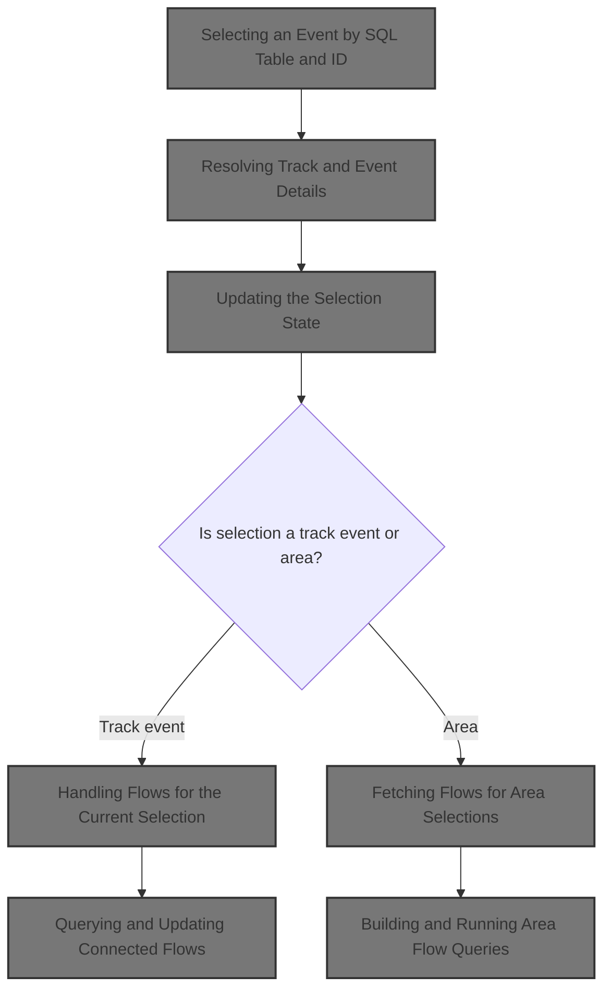
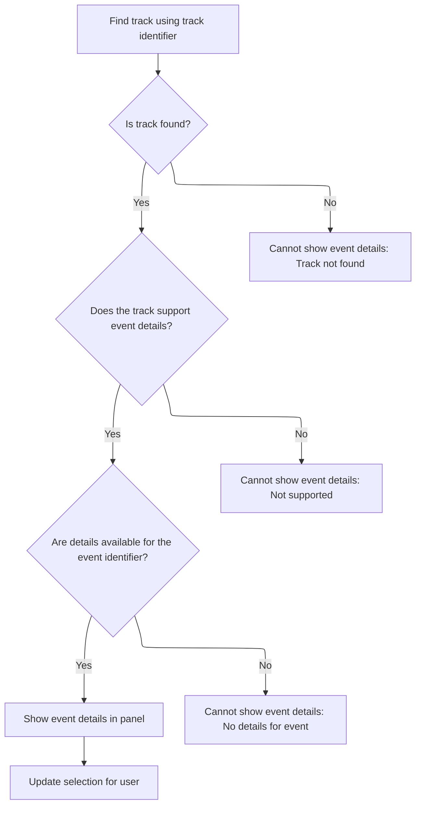
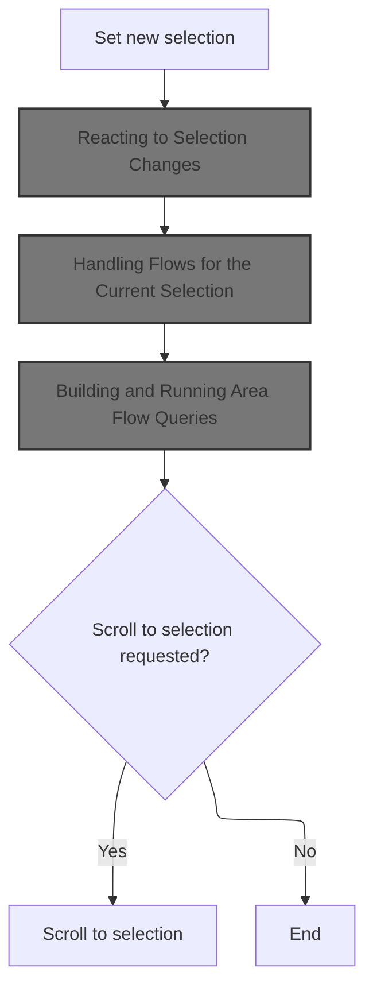
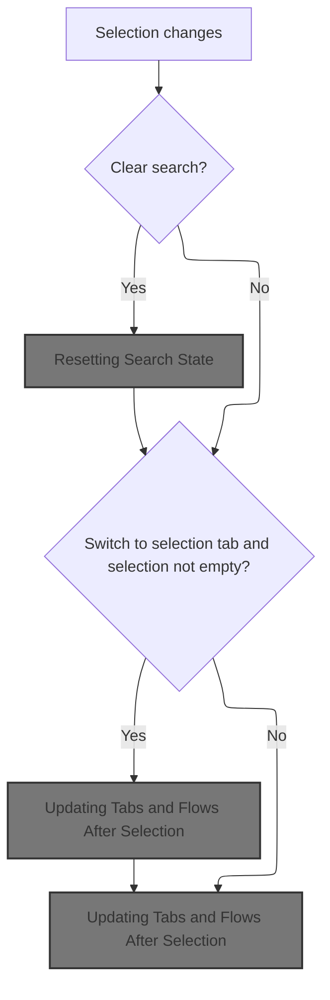
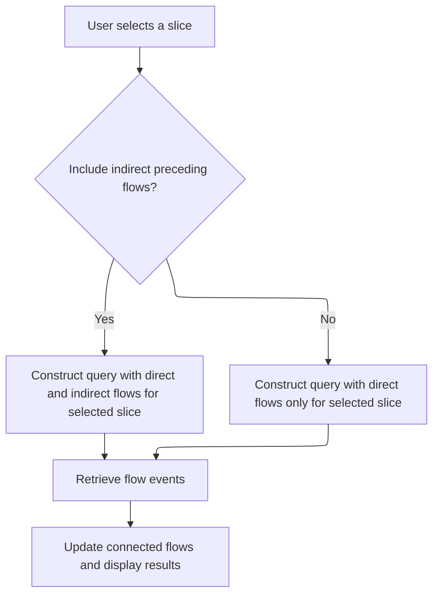
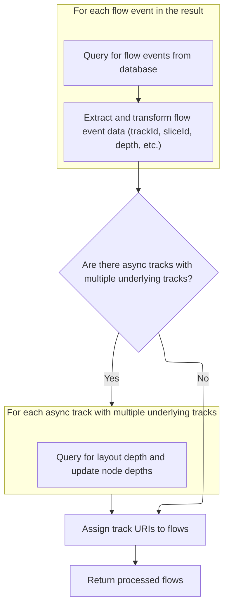
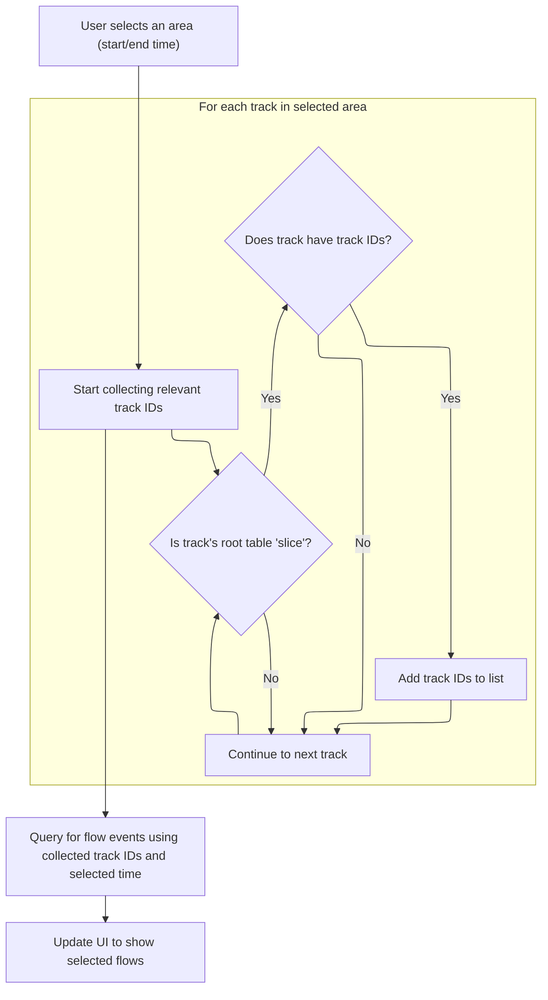

This document describes how users can select an event by specifying a SQL table and event ID, and how the system updates the UI to display the event's details and related flows. The flow ensures the selection is reflected throughout the interface, supporting interactive exploration of trace data.



# Where is this flow used?

This flow is used multiple times in the codebase as represented in the following diagram:

```mermaid
graph TD;
      dab247b7ff6138ddf1b03f504b9d985f244ed79024cba644ececfebdee8a1cc1(ui/…/core/flow_manager.ts::FlowManager.moveByFocusedFlow) --> 72e5511d1cb30e324585cd83156489500911b1d189f24bd2eff7b4401699593f(ui/…/core/selection_manager.ts::SelectionManagerImpl.selectSqlEvent)

8a34b5d536a890f9a23aeec055956210e7222a96e85641ead723b412f294e85b(ui/…/bigtrace/index.ts::CoreCommands.onTraceLoad) --> dab247b7ff6138ddf1b03f504b9d985f244ed79024cba644ececfebdee8a1cc1(ui/…/core/flow_manager.ts::FlowManager.moveByFocusedFlow)

01b2c60421647abd892cf071e4cbd8a630f1268337fee72b9176fcbc5d6e8a14(ui/…/bigtrace/index.ts::callback) --> dab247b7ff6138ddf1b03f504b9d985f244ed79024cba644ececfebdee8a1cc1(ui/…/core/flow_manager.ts::FlowManager.moveByFocusedFlow)

01b2c60421647abd892cf071e4cbd8a630f1268337fee72b9176fcbc5d6e8a14(ui/…/bigtrace/index.ts::callback) --> dab247b7ff6138ddf1b03f504b9d985f244ed79024cba644ececfebdee8a1cc1(ui/…/core/flow_manager.ts::FlowManager.moveByFocusedFlow)

64f3785cbfab14a8dba8f5aa66ff2050b3714f7a93c69f739073d35b34fcc793(ui/…/core/selection_manager.ts::SelectionManagerImpl.selectSearchResult) --> 72e5511d1cb30e324585cd83156489500911b1d189f24bd2eff7b4401699593f(ui/…/core/selection_manager.ts::SelectionManagerImpl.selectSqlEvent)

319c2f952a9ef6f7190d6e43c1373dcd2f451a4db4f385d4fdb91161b679b967(ui/…/core/trace_impl.ts::TraceImpl.onResultStep) --> 64f3785cbfab14a8dba8f5aa66ff2050b3714f7a93c69f739073d35b34fcc793(ui/…/core/selection_manager.ts::SelectionManagerImpl.selectSearchResult)


classDef mainFlowStyle color:#000000,fill:#7CB9F4
classDef rootsStyle color:#000000,fill:#00FFF4
classDef Style1 color:#000000,fill:#00FFAA
classDef Style2 color:#000000,fill:#FFFF00
classDef Style3 color:#000000,fill:#AA7CB9

%% Swimm:
%% graph TD;
%%       dab247b7ff6138ddf1b03f504b9d985f244ed79024cba644ececfebdee8a1cc1(<SwmPath>[ui/…/core/flow_manager.ts](ui/src/core/flow_manager.ts)</SwmPath>::FlowManager.moveByFocusedFlow) --> 72e5511d1cb30e324585cd83156489500911b1d189f24bd2eff7b4401699593f(<SwmPath>[ui/…/core/selection_manager.ts](ui/src/core/selection_manager.ts)</SwmPath>::SelectionManagerImpl.selectSqlEvent)
%% 
%% 8a34b5d536a890f9a23aeec055956210e7222a96e85641ead723b412f294e85b(<SwmPath>[ui/…/bigtrace/index.ts](ui/src/bigtrace/index.ts)</SwmPath>::CoreCommands.onTraceLoad) --> dab247b7ff6138ddf1b03f504b9d985f244ed79024cba644ececfebdee8a1cc1(<SwmPath>[ui/…/core/flow_manager.ts](ui/src/core/flow_manager.ts)</SwmPath>::FlowManager.moveByFocusedFlow)
%% 
%% 01b2c60421647abd892cf071e4cbd8a630f1268337fee72b9176fcbc5d6e8a14(<SwmPath>[ui/…/bigtrace/index.ts](ui/src/bigtrace/index.ts)</SwmPath>::callback) --> dab247b7ff6138ddf1b03f504b9d985f244ed79024cba644ececfebdee8a1cc1(<SwmPath>[ui/…/core/flow_manager.ts](ui/src/core/flow_manager.ts)</SwmPath>::FlowManager.moveByFocusedFlow)
%% 
%% 01b2c60421647abd892cf071e4cbd8a630f1268337fee72b9176fcbc5d6e8a14(<SwmPath>[ui/…/bigtrace/index.ts](ui/src/bigtrace/index.ts)</SwmPath>::callback) --> dab247b7ff6138ddf1b03f504b9d985f244ed79024cba644ececfebdee8a1cc1(<SwmPath>[ui/…/core/flow_manager.ts](ui/src/core/flow_manager.ts)</SwmPath>::FlowManager.moveByFocusedFlow)
%% 
%% 64f3785cbfab14a8dba8f5aa66ff2050b3714f7a93c69f739073d35b34fcc793(<SwmPath>[ui/…/core/selection_manager.ts](ui/src/core/selection_manager.ts)</SwmPath>::SelectionManagerImpl.selectSearchResult) --> 72e5511d1cb30e324585cd83156489500911b1d189f24bd2eff7b4401699593f(<SwmPath>[ui/…/core/selection_manager.ts](ui/src/core/selection_manager.ts)</SwmPath>::SelectionManagerImpl.selectSqlEvent)
%% 
%% 319c2f952a9ef6f7190d6e43c1373dcd2f451a4db4f385d4fdb91161b679b967(<SwmPath>[ui/…/core/trace_impl.ts](ui/src/core/trace_impl.ts)</SwmPath>::TraceImpl.onResultStep) --> 64f3785cbfab14a8dba8f5aa66ff2050b3714f7a93c69f739073d35b34fcc793(<SwmPath>[ui/…/core/selection_manager.ts](ui/src/core/selection_manager.ts)</SwmPath>::SelectionManagerImpl.selectSearchResult)
%% 
%% 
%% classDef mainFlowStyle color:#000000,fill:#7CB9F4
%% classDef rootsStyle color:#000000,fill:#00FFF4
%% classDef Style1 color:#000000,fill:#00FFAA
%% classDef Style2 color:#000000,fill:#FFFF00
%% classDef Style3 color:#000000,fill:#AA7CB9
```



# Selecting an Event by SQL Table and ID

<SwmSnippet path="/ui/src/core/selection_manager.ts" line="327">

---

SelectSqlEvent kicks off the selection flow by resolving an event from a SQL table and ID, then, if found, hands off to <SwmToken path="ui/src/core/selection_manager.ts" pos="329:7:7" line-data="    event &amp;&amp; this.selectTrackEvent(event.trackUri, event.eventId, opts);">`selectTrackEvent`</SwmToken> with the event's <SwmToken path="ui/src/core/selection_manager.ts" pos="329:11:11" line-data="    event &amp;&amp; this.selectTrackEvent(event.trackUri, event.eventId, opts);">`trackUri`</SwmToken> and <SwmToken path="ui/src/core/selection_manager.ts" pos="329:16:16" line-data="    event &amp;&amp; this.selectTrackEvent(event.trackUri, event.eventId, opts);">`eventId`</SwmToken>. This bridges the gap between SQL-based event lookup and the track-based selection system used downstream.

```typescript
  async selectSqlEvent(sqlTableName: string, id: number, opts?: SelectionOpts) {
    const event = await this.resolveSqlEvent(sqlTableName, id);
    event && this.selectTrackEvent(event.trackUri, event.eventId, opts);
  }
```

---

</SwmSnippet>

# Selecting a Track Event by URI and ID

<SwmSnippet path="/ui/src/core/selection_manager.ts" line="75">

---

SelectTrackEvent is just a thin wrapper that forwards the call to <SwmToken path="ui/src/core/selection_manager.ts" pos="80:3:3" line-data="    this.selectTrackEventInternal(trackUri, eventId, opts);">`selectTrackEventInternal`</SwmToken> with the same arguments. This keeps the API surface clean and lets the internal function handle the details.

```typescript
  async selectTrackEvent(
    trackUri: string,
    eventId: number,
    opts?: SelectionOpts,
  ) {
    this.selectTrackEventInternal(trackUri, eventId, opts);
  }
```

---

</SwmSnippet>

# Resolving Track and Event Details



<SwmSnippet path="/ui/src/core/selection_manager.ts" line="417">

---

SelectTrackEventInternal gets the event details, sets up the details panel, and then updates the selection state.

```typescript
  private async selectTrackEventInternal(
    trackUri: string,
    eventId: number,
    opts?: SelectionOpts,
    serializedDetailsPanel?: unknown,
  ) {
    const track = this.trackManager.getTrack(trackUri);
    if (!track) {
      throw new Error(
        `Unable to resolve selection details: Track ${trackUri} not found`,
      );
    }

    const trackRenderer = track.renderer;
    if (!trackRenderer.getSelectionDetails) {
      throw new Error(
        `Unable to resolve selection details: Track ${trackUri} does not support selection details`,
      );
    }

    const details = await trackRenderer.getSelectionDetails(eventId);
    if (!exists(details)) {
      throw new Error(
        `Unable to resolve selection details: Track ${trackUri} returned no details for event ${eventId}`,
      );
    }

    const selection: TrackEventSelection = {
      ...details,
      kind: 'track_event',
      trackUri,
      eventId,
    };
    this.createTrackEventDetailsPanel(selection, serializedDetailsPanel);
    this.setSelection(selection, opts);
  }
```

---

</SwmSnippet>

# Updating the Selection State



<SwmSnippet path="/ui/src/core/selection_manager.ts" line="332">

---

In <SwmToken path="ui/src/core/selection_manager.ts" pos="332:3:3" line-data="  private setSelection(selection: Selection, opts?: SelectionOpts) {">`setSelection`</SwmToken>, we update the internal selection state and then call <SwmToken path="ui/src/core/selection_manager.ts" pos="334:3:3" line-data="    this.onSelectionChange(selection, opts ?? {});">`onSelectionChange`</SwmToken> to notify the rest of the system. This triggers updates like resetting search and switching tabs.

```typescript
  private setSelection(selection: Selection, opts?: SelectionOpts) {
    this._selection = selection;
    this.onSelectionChange(selection, opts ?? {});

```

---

</SwmSnippet>

## Reacting to Selection Changes



<SwmSnippet path="/ui/src/core/trace_impl.ts" line="176">

---

In <SwmToken path="ui/src/core/trace_impl.ts" pos="176:3:3" line-data="  private onSelectionChange(selection: Selection, opts: SelectionOpts) {">`onSelectionChange`</SwmToken>, we check if the search should be cleared and, if so, reset the search manager. This keeps the search results in sync with the current selection.

```typescript
  private onSelectionChange(selection: Selection, opts: SelectionOpts) {
    const {clearSearch = true, switchToCurrentSelectionTab = true} = opts;
    if (clearSearch) {
      this.search.reset();
    }
```

---

</SwmSnippet>

### Resetting Search State

<SwmSnippet path="/ui/src/core/search_manager.ts" line="115">

---

Reset just calls search with an empty string, which clears out any previous search results and resets the state.

```typescript
  reset() {
    this.search('');
  }
```

---

</SwmSnippet>

### Running a Search Query

See <SwmLink doc-title="Search Flow">[Search Flow](/.swm/search-flow.guj19p5a.sw.md)</SwmLink>

### Executing the Search and Collecting Results

```mermaid
%%{init: {"flowchart": {"defaultRenderer": "elk"}} }%%
flowchart TD
  node1["Start search operation"] --> node2{"Are all required components available?"}
  click node1 openCode "ui/src/core/search_manager.ts:179:352"
  node2 -->|"No"| node3["Abort search"]
  click node2 openCode "ui/src/core/search_manager.ts:187:189"
  click node3 openCode "ui/src/core/search_manager.ts:188:189"
  node2 -->|"Yes"| node4["Begin search"]
  click node4 openCode "ui/src/core/search_manager.ts:190:193"

  subgraph loop1["For each track in workspace"]
    node4 --> node5{"Does track name match search text?"}
    click node5 openCode "ui/src/core/search_manager.ts:273:278"
    node5 -->|"Yes"| node6["Add track to results (increment totalResults)"]
    click node6 openCode "ui/src/core/search_manager.ts:279:282"
    node5 -->|"No"| node4
  end

  node6 --> node7["Search events for matches"]
  click node7 openCode "ui/src/core/search_manager.ts:284:294"

  subgraph loop2["For each event in results"]
    node7 --> node8{"Can event be associated with a track?"}
    click node8 openCode "ui/src/core/search_manager.ts:303:318"
    node8 -->|"Yes"| node9["Add event to results (increment totalResults)"]
    click node9 openCode "ui/src/core/search_manager.ts:320:325"
    node8 -->|"No"| node7
  end

  node9 --> node10["Aggregate all results (totalResults)"]
  click node10 openCode "ui/src/core/search_manager.ts:333:333"
  node10 --> node11{"Is there a visible window?"}
  click node11 openCode "ui/src/core/search_manager.ts:338:349"
  node11 -->|"Yes"| node12["Focus result index in visible window"]
  click node12 openCode "ui/src/core/search_manager.ts:339:347"
  node11 -->|"No"| node13["Set result index to none"]
  click node13 openCode "ui/src/core/search_manager.ts:350:351"
  node12 --> node14["Update UI with results"]
  click node14 openCode "ui/src/core/search_manager.ts:333:352"
  node13 --> node14
classDef HeadingStyle fill:#777777,stroke:#333,stroke-width:2px;

%% Swimm:
%% %%{init: {"flowchart": {"defaultRenderer": "elk"}} }%%
%% flowchart TD
%%   node1["Start search operation"] --> node2{"Are all required components available?"}
%%   click node1 openCode "<SwmPath>[ui/…/core/search_manager.ts](ui/src/core/search_manager.ts)</SwmPath>:179:352"
%%   node2 -->|"No"| node3["Abort search"]
%%   click node2 openCode "<SwmPath>[ui/…/core/search_manager.ts](ui/src/core/search_manager.ts)</SwmPath>:187:189"
%%   click node3 openCode "<SwmPath>[ui/…/core/search_manager.ts](ui/src/core/search_manager.ts)</SwmPath>:188:189"
%%   node2 -->|"Yes"| node4["Begin search"]
%%   click node4 openCode "<SwmPath>[ui/…/core/search_manager.ts](ui/src/core/search_manager.ts)</SwmPath>:190:193"
%% 
%%   subgraph loop1["For each track in workspace"]
%%     node4 --> node5{"Does track name match search text?"}
%%     click node5 openCode "<SwmPath>[ui/…/core/search_manager.ts](ui/src/core/search_manager.ts)</SwmPath>:273:278"
%%     node5 -->|"Yes"| node6["Add track to results (increment <SwmToken path="ui/src/core/search_manager.ts" pos="269:1:1" line-data="      totalResults: 0,">`totalResults`</SwmToken>)"]
%%     click node6 openCode "<SwmPath>[ui/…/core/search_manager.ts](ui/src/core/search_manager.ts)</SwmPath>:279:282"
%%     node5 -->|"No"| node4
%%   end
%% 
%%   node6 --> node7["Search events for matches"]
%%   click node7 openCode "<SwmPath>[ui/…/core/search_manager.ts](ui/src/core/search_manager.ts)</SwmPath>:284:294"
%% 
%%   subgraph loop2["For each event in results"]
%%     node7 --> node8{"Can event be associated with a track?"}
%%     click node8 openCode "<SwmPath>[ui/…/core/search_manager.ts](ui/src/core/search_manager.ts)</SwmPath>:303:318"
%%     node8 -->|"Yes"| node9["Add event to results (increment <SwmToken path="ui/src/core/search_manager.ts" pos="269:1:1" line-data="      totalResults: 0,">`totalResults`</SwmToken>)"]
%%     click node9 openCode "<SwmPath>[ui/…/core/search_manager.ts](ui/src/core/search_manager.ts)</SwmPath>:320:325"
%%     node8 -->|"No"| node7
%%   end
%% 
%%   node9 --> node10["Aggregate all results (<SwmToken path="ui/src/core/search_manager.ts" pos="269:1:1" line-data="      totalResults: 0,">`totalResults`</SwmToken>)"]
%%   click node10 openCode "<SwmPath>[ui/…/core/search_manager.ts](ui/src/core/search_manager.ts)</SwmPath>:333:333"
%%   node10 --> node11{"Is there a visible window?"}
%%   click node11 openCode "<SwmPath>[ui/…/core/search_manager.ts](ui/src/core/search_manager.ts)</SwmPath>:338:349"
%%   node11 -->|"Yes"| node12["Focus result index in visible window"]
%%   click node12 openCode "<SwmPath>[ui/…/core/search_manager.ts](ui/src/core/search_manager.ts)</SwmPath>:339:347"
%%   node11 -->|"No"| node13["Set result index to none"]
%%   click node13 openCode "<SwmPath>[ui/…/core/search_manager.ts](ui/src/core/search_manager.ts)</SwmPath>:350:351"
%%   node12 --> node14["Update UI with results"]
%%   click node14 openCode "<SwmPath>[ui/…/core/search_manager.ts](ui/src/core/search_manager.ts)</SwmPath>:333:352"
%%   node13 --> node14
%% classDef HeadingStyle fill:#777777,stroke:#333,stroke-width:2px;
```



<SwmSnippet path="/ui/src/core/search_manager.ts" line="179">

---

ExecuteSearch checks for required components, builds lookup maps for tracks, runs SQL queries to find matching threads and events, and organizes the results. It also tracks the search generation to avoid showing stale results if a new search starts before the current one finishes.

```typescript
  private async executeSearch() {
    const search = this._searchText;
    const searchLiteral = escapeSearchQuery(this._searchText);
    const generation = this._searchGeneration;

    const engine = this._engine;
    const trackManager = this._trackManager;
    const workspace = this._workspace;
    if (!engine || !trackManager || !workspace) {
      return;
    }

    // TODO(stevegolton): Avoid recomputing these indexes each time.
    const trackUrisByCpu = new Map<number, string>();
    const allTracks = trackManager.getAllTracks();
    allTracks.forEach((td) => {
      const tags = td?.tags;
      const cpu = tags?.cpu;
      const kind = tags?.kind;
      exists(cpu) &&
        kind === CPU_SLICE_TRACK_KIND &&
        trackUrisByCpu.set(cpu, td.uri);
    });

    const trackUrisByTrackId = new Map<number, string>();
    allTracks.forEach((td) => {
      const trackIds = td?.tags?.trackIds ?? [];
      trackIds.forEach((trackId) => trackUrisByTrackId.set(trackId, td.uri));
    });

    const utidRes = await engine.query(`select utid from thread join process
    using(upid) where
      thread.name glob ${searchLiteral} or
      process.name glob ${searchLiteral}`);
    const utids = [];
    for (const it = utidRes.iter({utid: NUM}); it.valid(); it.next()) {
      utids.push(it.utid);
    }
```

---

</SwmSnippet>

<SwmSnippet path="/ui/src/core/search_manager.ts" line="263">

---

This part sets up the <SwmToken path="ui/src/core/search_manager.ts" pos="263:6:6" line-data="    const searchResults: SearchResults = {">`SearchResults`</SwmToken> object and preps arrays for later filling.

```typescript
    const searchResults: SearchResults = {
      eventIds: new Float64Array(0),
      tses: new BigInt64Array(0),
      utids: new Float64Array(0),
      sources: [],
      trackUris: [],
      totalResults: 0,
    };

    const lowerSearch = search.toLowerCase();
    for (const track of workspace.flatTracksOrdered) {
      // We don't support searching for tracks that don't have a URI.
      if (!track.uri) continue;
      if (track.name.toLowerCase().indexOf(lowerSearch) === -1) {
        continue;
      }
      searchResults.totalResults++;
      searchResults.sources.push('track');
      searchResults.trackUris.push(track.uri);
    }
```

---

</SwmSnippet>

<SwmSnippet path="/ui/src/core/search_manager.ts" line="284">

---

Now we allocate the arrays in <SwmToken path="ui/src/core/search_manager.ts" pos="263:6:6" line-data="    const searchResults: SearchResults = {">`SearchResults`</SwmToken> to fit both track name matches and SQL event matches, initializing them with sentinel values for later use.

```typescript
    const rows = res.numRows();
    searchResults.eventIds = new Float64Array(
      searchResults.totalResults + rows,
    );
    searchResults.tses = new BigInt64Array(searchResults.totalResults + rows);
    searchResults.utids = new Float64Array(searchResults.totalResults + rows);
    for (let i = 0; i < searchResults.totalResults; ++i) {
      searchResults.eventIds[i] = -1;
      searchResults.tses[i] = -1n;
      searchResults.utids[i] = -1;
    }
```

---

</SwmSnippet>

<SwmSnippet path="/ui/src/core/search_manager.ts" line="296">

---

Here we fill the <SwmToken path="ui/src/core/search_manager.ts" pos="263:6:6" line-data="    const searchResults: SearchResults = {">`SearchResults`</SwmToken> arrays with data from the SQL query, mapping each event to its track URI and source type using the lookup maps. This ties results to the right tracks for later use.

```typescript
    const it = res.iter({
      sliceId: NUM,
      ts: LONG,
      source: STR,
      sourceId: NUM,
      utid: NUM,
    });
    for (; it.valid(); it.next()) {
      let track: string | undefined = undefined;

      if (it.source === 'cpu') {
        track = trackUrisByCpu.get(it.sourceId);
      } else if (it.source === 'slice') {
        track = trackUrisByTrackId.get(it.sourceId);
      } else if (it.source === 'log') {
        track = trackManager
          .getAllTracks()
          .find((td) => td.tags?.kind === ANDROID_LOGS_TRACK_KIND)?.uri;
      }
      // The .get() calls above could return undefined, this isn't just an else.
      if (track === undefined) {
        continue;
      }

      const i = searchResults.totalResults++;
      searchResults.trackUris.push(track);
      searchResults.sources.push(it.source as SearchSource);
      searchResults.eventIds[i] = it.sliceId;
      searchResults.tses[i] = it.ts;
      searchResults.utids[i] = it.utid;
    }
```

---

</SwmSnippet>

<SwmSnippet path="/ui/src/core/search_manager.ts" line="333">

---

After collecting all search results, we update the internal results and set the result index based on the visible timeline window. This makes sure navigation starts at the right place for the user.

```typescript
    this._results = searchResults;

    // We have changed the search results - try and find the first result that's
    // after the start of this visible window.
    const visibleWindow = this._timeline?.visibleWindow.toTimeSpan();
    if (visibleWindow) {
      const foundIndex = this._results.tses.findIndex(
        (ts) => ts >= visibleWindow.start,
      );
      if (foundIndex === -1) {
        this._resultIndex = -1;
      } else {
        // Store the value before the found one, so that when the user presses
        // enter we navigate to the correct one.
        this._resultIndex = foundIndex - 1;
      }
    } else {
      this._resultIndex = -1;
    }
  }
```

---

</SwmSnippet>

### Updating Tabs and Flows After Selection

<SwmSnippet path="/ui/src/core/trace_impl.ts" line="181">

---

After returning from <SwmToken path="ui/src/core/trace_impl.ts" pos="25:10:10" line-data="import {SearchManagerImpl} from &#39;./search_manager&#39;;">`search_manager`</SwmToken>, <SwmToken path="ui/src/core/selection_manager.ts" pos="334:3:3" line-data="    this.onSelectionChange(selection, opts ?? {});">`onSelectionChange`</SwmToken> in trace_impl updates the UI by switching tabs if needed and then calls <SwmToken path="ui/src/core/trace_impl.ts" pos="185:5:5" line-data="    this.flows.updateFlows(selection);">`updateFlows`</SwmToken> to refresh any flow-related visuals for the new selection.

```typescript
    if (switchToCurrentSelectionTab && selection.kind !== 'empty') {
      this.tabs.showCurrentSelectionTab();
    }

    this.flows.updateFlows(selection);
  }
```

---

</SwmSnippet>

## Handling Flows for the Current Selection

<SwmSnippet path="/ui/src/core/flow_manager.ts" line="453">

---

UpdateFlows checks the selection kind and track renderer type. If it's a <SwmToken path="ui/src/core/flow_manager.ts" pos="464:8:8" line-data="      selection.kind === &#39;track_event&#39; &amp;&amp;">`track_event`</SwmToken> on a 'slice' track, it calls <SwmToken path="ui/src/core/flow_manager.ts" pos="468:3:3" line-data="      this.sliceSelected(selection.eventId);">`sliceSelected`</SwmToken> to fetch flows; otherwise, it clears flow state. This keeps flow visuals in sync with the selection.

```typescript
  updateFlows(selection: Selection) {
    this.initialize();
    this._curSelection = selection;

    if (selection.kind === 'empty') {
      this.setConnectedFlows([]);
      this.setSelectedFlows([]);
      return;
    }

    if (
      selection.kind === 'track_event' &&
      this.trackMgr.getTrack(selection.trackUri)?.renderer.rootTableName ===
        'slice'
    ) {
      this.sliceSelected(selection.eventId);
    } else {
      this.setConnectedFlows([]);
    }

```

---

</SwmSnippet>

### Querying and Updating Connected Flows



<SwmSnippet path="/ui/src/core/flow_manager.ts" line="315">

---

QueryFlowEvents runs the SQL query, builds detailed <SwmToken path="ui/src/core/flow_manager.ts" pos="297:7:9" line-data="      // For each begin/end from an async track update the depth:">`begin/end`</SwmToken> slice objects for each flow, and collects nodes for later depth adjustment. It also handles nulls and expects a specific result schema.

```typescript
  sliceSelected(sliceId: number) {
    const connectedFlows = SHOW_INDIRECT_PRECEDING_FLOWS_FLAG.get()
      ? `(
           select * from directly_connected_flow(${sliceId})
           union
           select * from preceding_flow(${sliceId})
         )`
      : `directly_connected_flow(${sliceId})`;

    const query = `
    -- Include slices.flow to initialise indexes on 'flow.slice_in' and 'flow.slice_out'.
    INCLUDE PERFETTO MODULE slices.flow;

    select
      f.slice_out as beginSliceId,
      t1.track_id as beginTrackId,
      t1.name as beginSliceName,
      CHROME_CUSTOM_SLICE_NAME(t1.slice_id) as beginSliceChromeCustomName,
      t1.category as beginSliceCategory,
      t1.ts as beginSliceStartTs,
      (t1.ts+t1.dur) as beginSliceEndTs,
      t1.depth as beginDepth,
      (thread_out.name || ' ' || thread_out.tid) as beginThreadName,
      (process_out.name || ' ' || process_out.pid) as beginProcessName,
      f.slice_in as endSliceId,
      t2.track_id as endTrackId,
      t2.name as endSliceName,
      CHROME_CUSTOM_SLICE_NAME(t2.slice_id) as endSliceChromeCustomName,
      t2.category as endSliceCategory,
      t2.ts as endSliceStartTs,
      (t2.ts+t2.dur) as endSliceEndTs,
      t2.depth as endDepth,
      (thread_in.name || ' ' || thread_in.tid) as endThreadName,
      (process_in.name || ' ' || process_in.pid) as endProcessName,
      extract_arg(f.arg_set_id, 'cat') as category,
      extract_arg(f.arg_set_id, 'name') as name,
      f.id as id,
      slice_is_ancestor(t1.slice_id, t2.slice_id) as flowToDescendant
    from ${connectedFlows} f
    join slice t1 on f.slice_out = t1.slice_id
    join slice t2 on f.slice_in = t2.slice_id
    left join thread_track track_out on track_out.id = t1.track_id
    left join thread thread_out on thread_out.utid = track_out.utid
    left join thread_track track_in on track_in.id = t2.track_id
    left join thread thread_in on thread_in.utid = track_in.utid
    left join process process_out on process_out.upid = thread_out.upid
    left join process process_in on process_in.upid = thread_in.upid
    `;
    this.queryFlowEvents(query).then((flows) => this.setConnectedFlows(flows));
  }
```

---

</SwmSnippet>

### Parsing Flow Events and Preparing for Depth Adjustment



<SwmSnippet path="/ui/src/core/flow_manager.ts" line="81">

---

Now we run a query for each async track to get the correct layout_depths, then update each node's depth in place. This avoids overlapping slices in the UI for async tracks.

```typescript
  async queryFlowEvents(query: string): Promise<Flow[]> {
    const result = await this.engine.query(query);
    const flows: Flow[] = [];

    const it = result.iter({
      beginSliceId: NUM,
      beginTrackId: NUM,
      beginSliceName: STR_NULL,
      beginSliceChromeCustomName: STR_NULL,
      beginSliceCategory: STR_NULL,
      beginSliceStartTs: LONG,
      beginSliceEndTs: LONG,
      beginDepth: NUM,
      beginThreadName: STR_NULL,
      beginProcessName: STR_NULL,
      endSliceId: NUM,
      endTrackId: NUM,
      endSliceName: STR_NULL,
      endSliceChromeCustomName: STR_NULL,
      endSliceCategory: STR_NULL,
      endSliceStartTs: LONG,
      endSliceEndTs: LONG,
      endDepth: NUM,
      endThreadName: STR_NULL,
      endProcessName: STR_NULL,
      name: STR_NULL,
      category: STR_NULL,
      id: NUM,
      flowToDescendant: NUM,
    });

    const nullToStr = (s: null | string): string => {
      return s === null ? 'NULL' : s;
    };

    const nullToUndefined = (s: null | string): undefined | string => {
      return s === null ? undefined : s;
    };

    const nodes = [];

    for (; it.valid(); it.next()) {
      // Category and name present only in version 1 flow events
      // It is most likelly NULL for all other versions
      const category = nullToUndefined(it.category);
      const name = nullToUndefined(it.name);
      const id = it.id;

      const begin = {
        trackId: it.beginTrackId,
        sliceId: asSliceSqlId(it.beginSliceId),
        sliceName: nullToStr(it.beginSliceName),
        sliceChromeCustomName: nullToUndefined(it.beginSliceChromeCustomName),
        sliceCategory: nullToStr(it.beginSliceCategory),
        sliceStartTs: Time.fromRaw(it.beginSliceStartTs),
        sliceEndTs: Time.fromRaw(it.beginSliceEndTs),
        depth: it.beginDepth,
        threadName: nullToStr(it.beginThreadName),
        processName: nullToStr(it.beginProcessName),
      };

      const end = {
        trackId: it.endTrackId,
        sliceId: asSliceSqlId(it.endSliceId),
        sliceName: nullToStr(it.endSliceName),
        sliceChromeCustomName: nullToUndefined(it.endSliceChromeCustomName),
        sliceCategory: nullToStr(it.endSliceCategory),
        sliceStartTs: Time.fromRaw(it.endSliceStartTs),
        sliceEndTs: Time.fromRaw(it.endSliceEndTs),
        depth: it.endDepth,
        threadName: nullToStr(it.endThreadName),
        processName: nullToStr(it.endProcessName),
      };

      nodes.push(begin);
      nodes.push(end);

      flows.push({
        id,
        begin,
        end,
        dur: it.endSliceStartTs - it.beginSliceEndTs,
        category,
        name,
        flowToDescendant: !!it.flowToDescendant,
      });
    }
```

---

</SwmSnippet>

<SwmSnippet path="/ui/src/core/flow_manager.ts" line="169">

---

After fixing depths, we attach track URIs to each flow's begin and end slices, then return the flows for use elsewhere in the UI.

```typescript
    // Everything below here is a horrible hack to support flows for
    // async slice tracks.
    // In short the issue is this:
    // - For most slice tracks there is a one-to-one mapping between
    //   the track in the UI and the track in the TP. n.b. Even in this
    //   case the UI 'trackId' and the TP 'track.id' may not be the
    //   same. In this case 'depth' in the TP is the exact depth in the
    //   UI.
    // - In the case of aysnc tracks however the mapping is
    //   one-to-many. Each async slice track in the UI is 'backed' but
    //   multiple TP tracks. In order to render this track we need
    //   to adjust depth to avoid overlapping slices. In the render
    //   path we use experimental_slice_layout for this purpose. This
    //   is a virtual table in the TP which, for an arbitrary collection
    //   of TP trackIds, computes for each slice a 'layout_depth'.
    // - Everything above in this function and its callers doesn't
    //   know anything about layout_depth.
    //
    // So if we stopped here we would have incorrect rendering for
    // async slice tracks. Instead we want to 'fix' depth for these
    // cases. We do this in two passes.
    // - First we collect all the information we need in 'Info' POJOs
    // - Secondly we loop over those Infos querying
    //   the database to find the layout_depth for each sliceId
    // TODO(hjd): This should not be needed after TracksV2 lands.

    // We end up with one Info POJOs for each UI async slice track
    // which has at least  one flow {begin,end}ing in one of its slices.
    interface Info {
      siblingTrackIds: number[];
      sliceIds: number[];
      nodes: Array<{
        sliceId: number;
        depth: number;
      }>;
    }

    const trackUriToInfo = new Map<string, null | Info>();
    const trackIdToInfo = new Map<number, null | Info>();

    const trackIdToTrack = new Map<number, Track>();
    this.trackMgr
      .getAllTracks()
      .forEach((track) =>
        track.tags?.trackIds?.forEach((trackId) =>
          trackIdToTrack.set(trackId, track),
        ),
      );

    const getInfo = (trackId: number): null | Info => {
      let info = trackIdToInfo.get(trackId);
      if (info !== undefined) {
        return info;
      }

      const track = trackIdToTrack.get(trackId);
      if (track === undefined) {
        trackIdToInfo.set(trackId, null);
        return null;
      }

      info = trackUriToInfo.get(track.uri);
      if (info !== undefined) {
        return info;
      }

      // If 'trackIds' is undefined this is not an async slice track so
      // we don't need to do anything. We also don't need to do
      // anything if there is only one TP track in this async track. In
      // that case experimental_slice_layout is just an expensive way
      // to find out depth === layout_depth.
      const trackIds = track?.tags?.trackIds;
      if (trackIds === undefined || trackIds.length <= 1) {
        trackUriToInfo.set(track.uri, null);
        trackIdToInfo.set(trackId, null);
        return null;
      }

      const newInfo = {
        siblingTrackIds: [...trackIds],
        sliceIds: [],
        nodes: [],
      };

      trackUriToInfo.set(track.uri, newInfo);
      trackIdToInfo.set(trackId, newInfo);

      return newInfo;
    };

    // First pass, collect:
    // - all slices that belong to async slice track
    // - grouped by the async slice track in question
    for (const node of nodes) {
      const info = getInfo(node.trackId);
      if (info !== null) {
        info.sliceIds.push(node.sliceId);
        info.nodes.push(node);
      }
    }
```

---

</SwmSnippet>

<SwmSnippet path="/ui/src/core/flow_manager.ts" line="270">

---

After grouping slices by async track, we run a query for each async track to get the correct layout_depths, then update each node's depth in place. This avoids overlapping slices in the UI for async tracks.

```typescript
    // Second pass, for each async track:
    // - Query to find the layout_depth for each relevant sliceId
    // - Iterate through the nodes updating the depth in place
    for (const info of trackUriToInfo.values()) {
      if (info === null) {
        continue;
      }
      const r = await this.engine.query(`
        SELECT
          id,
          layout_depth as depth
        FROM
          experimental_slice_layout('${info.siblingTrackIds.join(',')}')
        WHERE
          id in (${info.sliceIds.join(', ')})
      `);

      // Create the sliceId -> new depth map:
      const it = r.iter({
        id: NUM,
        depth: NUM,
      });
      const sliceIdToDepth = new Map<number, number>();
      for (; it.valid(); it.next()) {
        sliceIdToDepth.set(it.id, it.depth);
      }

      // For each begin/end from an async track update the depth:
      for (const node of info.nodes) {
        const newDepth = sliceIdToDepth.get(node.sliceId);
        if (newDepth !== undefined) {
          node.depth = newDepth;
        }
      }
    }
```

---

</SwmSnippet>

<SwmSnippet path="/ui/src/core/flow_manager.ts" line="306">

---

After returning from <SwmToken path="ui/src/core/flow_manager.ts" pos="315:1:1" line-data="  sliceSelected(sliceId: number) {">`sliceSelected`</SwmToken>, <SwmToken path="ui/src/core/trace_impl.ts" pos="185:5:5" line-data="    this.flows.updateFlows(selection);">`updateFlows`</SwmToken> checks if the selection is an area and, if so, calls <SwmToken path="ui/src/core/flow_manager.ts" pos="366:3:3" line-data="  private areaSelected(area: AreaSelection) {">`areaSelected`</SwmToken> to fetch flows for the selected region. Otherwise, it clears flows.

```typescript
    // Fill in the track uris if available
    flows.forEach((flow) => {
      flow.begin.trackUri = trackIdToTrack.get(flow.begin.trackId)?.uri;
      flow.end.trackUri = trackIdToTrack.get(flow.end.trackId)?.uri;
    });

    return flows;
  }
```

---

</SwmSnippet>

### Fetching Flows for Area Selections

<SwmSnippet path="/ui/src/core/flow_manager.ts" line="473">

---

AreaSelected filters the area's tracks to only those based on the 'slice' table, then collects their track IDs for querying flows. This keeps the flow logic focused on relevant tracks.

```typescript
    if (selection.kind === 'area') {
      this.areaSelected(selection);
    } else {
      this.setConnectedFlows([]);
    }
  }
```

---

</SwmSnippet>

## Building and Running Area Flow Queries



<SwmSnippet path="/ui/src/core/flow_manager.ts" line="366">

---

After filtering tracks, <SwmToken path="ui/src/core/flow_manager.ts" pos="366:3:3" line-data="  private areaSelected(area: AreaSelection) {">`areaSelected`</SwmToken> builds a SQL query to fetch flows within the selected time range and tracks, then updates the selected flows when the query resolves.

```typescript
  private areaSelected(area: AreaSelection) {
    const trackIds: number[] = [];

    for (const trackInfo of area.tracks) {
      // Flows are only applicable for tracks whose slices derive from the
      // 'slice' root table.
      //
      // TODO(stevegolton): We can remove this check entirely once flows are
      // made more generic.
      const rootTableName = trackInfo.renderer.rootTableName;
      if (rootTableName === 'slice') {
        if (trackInfo?.tags?.trackIds) {
          for (const trackId of trackInfo.tags.trackIds) {
            trackIds.push(trackId);
          }
        }
      }
    }
```

---

</SwmSnippet>

<SwmSnippet path="/ui/src/core/flow_manager.ts" line="385">

---

After returning from trace_impl, <SwmToken path="ui/src/core/selection_manager.ts" pos="332:3:3" line-data="  private setSelection(selection: Selection, opts?: SelectionOpts) {">`setSelection`</SwmToken> checks if scrolling is requested and, if so, scrolls to the new selection to bring it into view.

```typescript
    const tracks = `(${trackIds.join(',')})`;

    const startNs = area.start;
    const endNs = area.end;

    const query = `
    select
      f.slice_out as beginSliceId,
      t1.track_id as beginTrackId,
      t1.name as beginSliceName,
      CHROME_CUSTOM_SLICE_NAME(t1.slice_id) as beginSliceChromeCustomName,
      t1.category as beginSliceCategory,
      t1.ts as beginSliceStartTs,
      (t1.ts+t1.dur) as beginSliceEndTs,
      t1.depth as beginDepth,
      NULL as beginThreadName,
      NULL as beginProcessName,
      f.slice_in as endSliceId,
      t2.track_id as endTrackId,
      t2.name as endSliceName,
      CHROME_CUSTOM_SLICE_NAME(t2.slice_id) as endSliceChromeCustomName,
      t2.category as endSliceCategory,
      t2.ts as endSliceStartTs,
      (t2.ts+t2.dur) as endSliceEndTs,
      t2.depth as endDepth,
      NULL as endThreadName,
      NULL as endProcessName,
      extract_arg(f.arg_set_id, 'cat') as category,
      extract_arg(f.arg_set_id, 'name') as name,
      f.id as id,
      slice_is_ancestor(t1.slice_id, t2.slice_id) as flowToDescendant
    from flow f
    join slice t1 on f.slice_out = t1.slice_id
    join slice t2 on f.slice_in = t2.slice_id
    where
      (t1.track_id in ${tracks}
        and (t1.ts+t1.dur <= ${endNs} and t1.ts+t1.dur >= ${startNs}))
      or
      (t2.track_id in ${tracks}
        and (t2.ts <= ${endNs} and t2.ts >= ${startNs}))
    `;
    this.queryFlowEvents(query).then((flows) => this.setSelectedFlows(flows));
  }
```

---

</SwmSnippet>

## Scrolling to the Selected Item

<SwmSnippet path="/ui/src/core/selection_manager.ts" line="336">

---

After returning from trace_impl, SelectionManagerImpl.setSelection checks if scrolling is requested and, if so, scrolls to the new selection to bring it into view.

```typescript
    if (opts?.scrollToSelection) {
      this.scrollToSelection();
    }
  }
```

---

</SwmSnippet>

&nbsp;

*This is an auto-generated document by Swimm 🌊 and has not yet been verified by a human*

<SwmMeta version="3.0.0" repo-id="Z2l0aHViJTNBJTNBY3BsdXNwbHVzLXBlcmZldHRvJTNBJTNBcmljYXJkb2xvcGV6Zw==" repo-name="cplusplus-perfetto"><sup>Powered by [Swimm](https://app.swimm.io/)</sup></SwmMeta>
