This document describes how the UI and internal state are updated when a user changes their selection in the trace interface. When a new selection is made, the system resets the search state if needed, updates search results, and refreshes the UI to display flows relevant to the selection type.

# Handling selection changes

```mermaid
%%{init: {"flowchart": {"defaultRenderer": "elk"}} }%%
flowchart TD
  node1["Selection changes"]
  click node1 openCode "ui/src/core/trace_impl.ts:176:177"
  node1 --> node2{"Clear previous search?"}
  click node2 openCode "ui/src/core/trace_impl.ts:178:180"
  node2 -->|"Yes"| node3["Resetting search state"]
  
  node2 -->|"No"| node4{"Switch to selection tab & selection not empty?"}
  click node4 openCode "ui/src/core/trace_impl.ts:181:183"
  node3 --> node4
  node4 -->|"Yes"| node5["Updating selection UI and flows"]
  
  node4 -->|"No"| node6["Updating selection UI and flows"]
  
  node5 --> node6

classDef HeadingStyle fill:#777777,stroke:#333,stroke-width:2px;
click node3 goToHeading "Resetting search state"
node3:::HeadingStyle
click node5 goToHeading "Updating selection UI and flows"
node5:::HeadingStyle
click node6 goToHeading "Updating selection UI and flows"
node6:::HeadingStyle

%% Swimm:
%% %%{init: {"flowchart": {"defaultRenderer": "elk"}} }%%
%% flowchart TD
%%   node1["Selection changes"]
%%   click node1 openCode "<SwmPath>[ui/…/core/trace_impl.ts](ui/src/core/trace_impl.ts)</SwmPath>:176:177"
%%   node1 --> node2{"Clear previous search?"}
%%   click node2 openCode "<SwmPath>[ui/…/core/trace_impl.ts](ui/src/core/trace_impl.ts)</SwmPath>:178:180"
%%   node2 -->|"Yes"| node3["Resetting search state"]
%%   
%%   node2 -->|"No"| node4{"Switch to selection tab & selection not empty?"}
%%   click node4 openCode "<SwmPath>[ui/…/core/trace_impl.ts](ui/src/core/trace_impl.ts)</SwmPath>:181:183"
%%   node3 --> node4
%%   node4 -->|"Yes"| node5["Updating selection UI and flows"]
%%   
%%   node4 -->|"No"| node6["Updating selection UI and flows"]
%%   
%%   node5 --> node6
%% 
%% classDef HeadingStyle fill:#777777,stroke:#333,stroke-width:2px;
%% click node3 goToHeading "Resetting search state"
%% node3:::HeadingStyle
%% click node5 goToHeading "Updating selection UI and flows"
%% node5:::HeadingStyle
%% click node6 goToHeading "Updating selection UI and flows"
%% node6:::HeadingStyle
```



<SwmSnippet path="/ui/src/core/trace_impl.ts" line="176">

---

In <SwmToken path="ui/src/core/trace_impl.ts" pos="176:3:3" line-data="  private onSelectionChange(selection: Selection, opts: SelectionOpts) {">`onSelectionChange`</SwmToken>, we kick off the flow by checking if the search state needs to be reset. If <SwmToken path="ui/src/core/trace_impl.ts" pos="177:4:4" line-data="    const {clearSearch = true, switchToCurrentSelectionTab = true} = opts;">`clearSearch`</SwmToken> is true, we call <SwmToken path="ui/src/core/trace_impl.ts" pos="179:3:5" line-data="      this.search.reset();">`search.reset`</SwmToken> to clear any previous search results. This sets up the state so that any subsequent selection logic works with a clean slate. Next, we need to call into <SwmPath>[ui/…/core/search_manager.ts](ui/src/core/search_manager.ts)</SwmPath> to actually perform the reset and update the search state.

```typescript
  private onSelectionChange(selection: Selection, opts: SelectionOpts) {
    const {clearSearch = true, switchToCurrentSelectionTab = true} = opts;
    if (clearSearch) {
      this.search.reset();
    }
```

---

</SwmSnippet>

## Resetting search state

<SwmSnippet path="/ui/src/core/search_manager.ts" line="115">

---

<SwmToken path="ui/src/core/search_manager.ts" pos="115:1:1" line-data="  reset() {">`reset`</SwmToken> just calls search with an empty string, which wipes out any previous search text and results. This is how we clear the search state before handling new selections.

```typescript
  reset() {
    this.search('');
  }
```

---

</SwmSnippet>

## Updating search results

```mermaid
%%{init: {"flowchart": {"defaultRenderer": "elk"}} }%%
flowchart TD
    node1["User initiates search"] --> node2{"Is search text different from previous?"}
    click node1 openCode "ui/src/core/search_manager.ts:92:93"
    click node2 openCode "ui/src/core/search_manager.ts:93:95"
    node2 -->|"No"| node3["No action needed"]
    click node3 openCode "ui/src/core/search_manager.ts:94:95"
    node2 -->|"Yes"| node4["Reset search state"]
    click node4 openCode "ui/src/core/search_manager.ts:96:100"
    node4 --> node5{"Is search text empty?"}
    click node5 openCode "ui/src/core/search_manager.ts:101:112"
    node5 -->|"Yes"| node3
    node5 -->|"No"| node6["Schedule search"]
    click node6 openCode "ui/src/core/search_manager.ts:102:103"
    node6 --> node7{"Is dataset search enabled?"}
    click node7 openCode "ui/src/core/search_manager.ts:104:108"
    node7 -->|"Yes"| node8["Perform dataset search"]
    click node8 openCode "ui/src/core/search_manager.ts:105:106"
    node7 -->|"No"| node9["Perform general search"]
    click node9 openCode "ui/src/core/search_manager.ts:107:108"
    node8 --> node10["Mark search as complete and update UI"]
    click node10 openCode "ui/src/core/search_manager.ts:109:111"
    node9 --> node10
classDef HeadingStyle fill:#777777,stroke:#333,stroke-width:2px;

%% Swimm:
%% %%{init: {"flowchart": {"defaultRenderer": "elk"}} }%%
%% flowchart TD
%%     node1["User initiates search"] --> node2{"Is search text different from previous?"}
%%     click node1 openCode "<SwmPath>[ui/…/core/search_manager.ts](ui/src/core/search_manager.ts)</SwmPath>:92:93"
%%     click node2 openCode "<SwmPath>[ui/…/core/search_manager.ts](ui/src/core/search_manager.ts)</SwmPath>:93:95"
%%     node2 -->|"No"| node3["No action needed"]
%%     click node3 openCode "<SwmPath>[ui/…/core/search_manager.ts](ui/src/core/search_manager.ts)</SwmPath>:94:95"
%%     node2 -->|"Yes"| node4["Reset search state"]
%%     click node4 openCode "<SwmPath>[ui/…/core/search_manager.ts](ui/src/core/search_manager.ts)</SwmPath>:96:100"
%%     node4 --> node5{"Is search text empty?"}
%%     click node5 openCode "<SwmPath>[ui/…/core/search_manager.ts](ui/src/core/search_manager.ts)</SwmPath>:101:112"
%%     node5 -->|"Yes"| node3
%%     node5 -->|"No"| node6["Schedule search"]
%%     click node6 openCode "<SwmPath>[ui/…/core/search_manager.ts](ui/src/core/search_manager.ts)</SwmPath>:102:103"
%%     node6 --> node7{"Is dataset search enabled?"}
%%     click node7 openCode "<SwmPath>[ui/…/core/search_manager.ts](ui/src/core/search_manager.ts)</SwmPath>:104:108"
%%     node7 -->|"Yes"| node8["Perform dataset search"]
%%     click node8 openCode "<SwmPath>[ui/…/core/search_manager.ts](ui/src/core/search_manager.ts)</SwmPath>:105:106"
%%     node7 -->|"No"| node9["Perform general search"]
%%     click node9 openCode "<SwmPath>[ui/…/core/search_manager.ts](ui/src/core/search_manager.ts)</SwmPath>:107:108"
%%     node8 --> node10["Mark search as complete and update UI"]
%%     click node10 openCode "<SwmPath>[ui/…/core/search_manager.ts](ui/src/core/search_manager.ts)</SwmPath>:109:111"
%%     node9 --> node10
%% classDef HeadingStyle fill:#777777,stroke:#333,stroke-width:2px;
```



<SwmSnippet path="/ui/src/core/search_manager.ts" line="92">

---

<SwmToken path="ui/src/core/search_manager.ts" pos="92:1:1" line-data="  search(text: string) {">`search`</SwmToken> checks if the search text is different from the previous one. If it is, it updates internal state, bumps the generation, and kicks off an async search (either dataset or regular) depending on config. This is where we actually start searching for results, and after it's done, we trigger a UI redraw.

```typescript
  search(text: string) {
    if (text === this._searchText) {
      return;
    }
    this._searchText = text;
    this._searchGeneration++;
    this._results = undefined;
    this._resultIndex = -1;
    this._searchInProgress = false;
    if (text !== '') {
      this._searchInProgress = true;
      this._limiter.schedule(async () => {
        if (DATASET_SEARCH.get()) {
          await this.executeDatasetSearch();
        } else {
          await this.executeSearch();
        }
        this._searchInProgress = false;
        raf.scheduleFullRedraw();
      });
    }
  }
```

---

</SwmSnippet>

## Performing dataset search

```mermaid
%%{init: {"flowchart": {"defaultRenderer": "elk"}} }%%
flowchart TD
  node1["Check if search components are available"]
  click node1 openCode "ui/src/core/search_manager.ts:357:359"
  node1 -->|"Available"| node2["Perform search across all datasets"]
  click node2 openCode "ui/src/core/search_manager.ts:363:368"
  node1 -->|"Not available"| nodeEnd["Stop"]
  
  subgraph loop1["For each result in search results"]
    node2 --> node3["Add event info to results structure"]
    click node3 openCode "ui/src/core/search_manager.ts:380:387"
  end
  loop1 --> node4{"Is there a visible window and results?"}
  click node4 openCode "ui/src/core/search_manager.ts:396:397"
  node4 -->|"Yes"| node5["Find first result after visible window start"]
  node4 -->|"No"| node6["Set result index to -1"]
  click node6 openCode "ui/src/core/search_manager.ts:408:409"
  
  subgraph loop2["For each result timestamp"]
    node5 --> node7{"Is timestamp after visible window start?"}
    click node7 openCode "ui/src/core/search_manager.ts:400:401"
    node7 -->|"Yes"| node8["Set result index to previous result"]
    click node8 openCode "ui/src/core/search_manager.ts:406:406"
    node7 -->|"No"| node5
  end
  loop2 --> nodeEnd["Done"]
  node6 --> nodeEnd
classDef HeadingStyle fill:#777777,stroke:#333,stroke-width:2px;

%% Swimm:
%% %%{init: {"flowchart": {"defaultRenderer": "elk"}} }%%
%% flowchart TD
%%   node1["Check if search components are available"]
%%   click node1 openCode "<SwmPath>[ui/…/core/search_manager.ts](ui/src/core/search_manager.ts)</SwmPath>:357:359"
%%   node1 -->|"Available"| node2["Perform search across all datasets"]
%%   click node2 openCode "<SwmPath>[ui/…/core/search_manager.ts](ui/src/core/search_manager.ts)</SwmPath>:363:368"
%%   node1 -->|"Not available"| nodeEnd["Stop"]
%%   
%%   subgraph loop1["For each result in search results"]
%%     node2 --> node3["Add event info to results structure"]
%%     click node3 openCode "<SwmPath>[ui/…/core/search_manager.ts](ui/src/core/search_manager.ts)</SwmPath>:380:387"
%%   end
%%   loop1 --> node4{"Is there a visible window and results?"}
%%   click node4 openCode "<SwmPath>[ui/…/core/search_manager.ts](ui/src/core/search_manager.ts)</SwmPath>:396:397"
%%   node4 -->|"Yes"| node5["Find first result after visible window start"]
%%   node4 -->|"No"| node6["Set result index to -1"]
%%   click node6 openCode "<SwmPath>[ui/…/core/search_manager.ts](ui/src/core/search_manager.ts)</SwmPath>:408:409"
%%   
%%   subgraph loop2["For each result timestamp"]
%%     node5 --> node7{"Is timestamp after visible window start?"}
%%     click node7 openCode "<SwmPath>[ui/…/core/search_manager.ts](ui/src/core/search_manager.ts)</SwmPath>:400:401"
%%     node7 -->|"Yes"| node8["Set result index to previous result"]
%%     click node8 openCode "<SwmPath>[ui/…/core/search_manager.ts](ui/src/core/search_manager.ts)</SwmPath>:406:406"
%%     node7 -->|"No"| node5
%%   end
%%   loop2 --> nodeEnd["Done"]
%%   node6 --> nodeEnd
%% classDef HeadingStyle fill:#777777,stroke:#333,stroke-width:2px;
```



<SwmSnippet path="/ui/src/core/search_manager.ts" line="354">

---

In <SwmToken path="ui/src/core/search_manager.ts" pos="354:5:5" line-data="  private async executeDatasetSearch() {">`executeDatasetSearch`</SwmToken>, we check for engine and <SwmToken path="ui/src/core/search_manager.ts" pos="355:3:3" line-data="    const trackManager = this._trackManager;">`trackManager`</SwmToken>, grab the current search generation, and run an async search across all tracks. We process the results into typed arrays, set utids to -1 since they're unknown, and collect track URIs and sources. This sets up the search results for later use.

```typescript
  private async executeDatasetSearch() {
    const trackManager = this._trackManager;
    const engine = this._engine;
    if (!engine || !trackManager) {
      return;
    }

    const generation = this._searchGeneration;

    const allResults = await searchTrackEvents(
      engine,
      trackManager.getAllTracks(),
      this._providers,
      this._searchText,
    );

    const numRows = allResults.length;
    const searchResults: SearchResults = {
      eventIds: new Float64Array(numRows),
      tses: new BigInt64Array(numRows),
      utids: new Float64Array(numRows).fill(-1), // Fill with -1 as utid is unknown
      sources: [],
      trackUris: [],
      totalResults: numRows,
    };

    for (let i = 0; i < numRows; i++) {
      const {id, ts, track} = allResults[i];
      searchResults.eventIds[i] = id;
      searchResults.tses[i] = ts;
      searchResults.trackUris.push(track.uri);
      // Assuming all results from datasets correspond to 'event' type search
      searchResults.sources.push('event');
    }
```

---

</SwmSnippet>

<SwmSnippet path="/ui/src/core/search_manager.ts" line="393">

---

After storing the search results, we look for the first result in the visible window and set <SwmToken path="ui/src/core/search_manager.ts" pos="99:3:3" line-data="    this._resultIndex = -1;">`_resultIndex`</SwmToken> so navigation lands on it. If there's no visible window or no results, we reset the index to -1.

```typescript
    this._results = searchResults;

    // Find first result after the start of the visible window
    const visibleWindow = this._timeline?.visibleWindow.toTimeSpan();
    if (visibleWindow && this._results.totalResults > 0) {
      let foundIndex = -1;
      for (let i = 0; i < this._results.tses.length; i++) {
        if (this._results.tses[i] >= visibleWindow.start) {
          foundIndex = i;
          break;
        }
      }
```

---

</SwmSnippet>

<SwmSnippet path="/ui/src/core/search_manager.ts" line="405">

---

Finally, we update <SwmToken path="ui/src/core/search_manager.ts" pos="406:3:3" line-data="      this._resultIndex = foundIndex === -1 ? -1 : foundIndex - 1;">`_resultIndex`</SwmToken> based on the visible window and store the results. If nothing matches, <SwmToken path="ui/src/core/search_manager.ts" pos="406:3:3" line-data="      this._resultIndex = foundIndex === -1 ? -1 : foundIndex - 1;">`_resultIndex`</SwmToken> is -1, so the UI doesn't highlight anything.

```typescript
      // Store the index *before* the found one, so the first step lands on it.
      this._resultIndex = foundIndex === -1 ? -1 : foundIndex - 1;
    } else {
      this._resultIndex = -1;
    }
  }
```

---

</SwmSnippet>

## Updating selection UI and flows

<SwmSnippet path="/ui/src/core/trace_impl.ts" line="181">

---

Back in <SwmToken path="ui/src/core/trace_impl.ts" pos="176:3:3" line-data="  private onSelectionChange(selection: Selection, opts: SelectionOpts) {">`onSelectionChange`</SwmToken>, after resetting the search, we update the UI tab if the selection isn't empty, then call <SwmToken path="ui/src/core/trace_impl.ts" pos="185:5:5" line-data="    this.flows.updateFlows(selection);">`updateFlows`</SwmToken> to refresh flow data for the new selection. This hands off to <SwmPath>[ui/…/core/flow_manager.ts](ui/src/core/flow_manager.ts)</SwmPath> to handle flow logic.

```typescript
    if (switchToCurrentSelectionTab && selection.kind !== 'empty') {
      this.tabs.showCurrentSelectionTab();
    }

    this.flows.updateFlows(selection);
  }
```

---

</SwmSnippet>

# Branching flow updates by selection type

```mermaid
%%{init: {"flowchart": {"defaultRenderer": "elk"}} }%%
flowchart TD
  node1["User changes selection"] --> node2{"Is selection type 'empty'?"}
  click node1 openCode "ui/src/core/flow_manager.ts:453:478"
  node2 -->|"Yes"| node3["Clear displayed and selected flows"]
  click node2 openCode "ui/src/core/flow_manager.ts:457:461"
  click node3 openCode "ui/src/core/flow_manager.ts:458:459"
  node2 -->|"No"| node4{"Is selection a track event AND track is 'slice'?"}
  click node4 openCode "ui/src/core/flow_manager.ts:463:467"
  node4 -->|"Yes"| node5["Show only flows related to selected event"]
  click node5 openCode "ui/src/core/flow_manager.ts:468:469"
  node4 -->|"No"| node6{"Is selection type 'area'?"}
  click node6 openCode "ui/src/core/flow_manager.ts:473:475"
  node6 -->|"Yes"| node7["Show only flows related to selected area"]
  click node7 openCode "ui/src/core/flow_manager.ts:474:475"
  node6 -->|"No"| node8["Clear displayed flows"]
  click node8 openCode "ui/src/core/flow_manager.ts:476:477"
classDef HeadingStyle fill:#777777,stroke:#333,stroke-width:2px;

%% Swimm:
%% %%{init: {"flowchart": {"defaultRenderer": "elk"}} }%%
%% flowchart TD
%%   node1["User changes selection"] --> node2{"Is selection type 'empty'?"}
%%   click node1 openCode "<SwmPath>[ui/…/core/flow_manager.ts](ui/src/core/flow_manager.ts)</SwmPath>:453:478"
%%   node2 -->|"Yes"| node3["Clear displayed and selected flows"]
%%   click node2 openCode "<SwmPath>[ui/…/core/flow_manager.ts](ui/src/core/flow_manager.ts)</SwmPath>:457:461"
%%   click node3 openCode "<SwmPath>[ui/…/core/flow_manager.ts](ui/src/core/flow_manager.ts)</SwmPath>:458:459"
%%   node2 -->|"No"| node4{"Is selection a track event AND track is 'slice'?"}
%%   click node4 openCode "<SwmPath>[ui/…/core/flow_manager.ts](ui/src/core/flow_manager.ts)</SwmPath>:463:467"
%%   node4 -->|"Yes"| node5["Show only flows related to selected event"]
%%   click node5 openCode "<SwmPath>[ui/…/core/flow_manager.ts](ui/src/core/flow_manager.ts)</SwmPath>:468:469"
%%   node4 -->|"No"| node6{"Is selection type 'area'?"}
%%   click node6 openCode "<SwmPath>[ui/…/core/flow_manager.ts](ui/src/core/flow_manager.ts)</SwmPath>:473:475"
%%   node6 -->|"Yes"| node7["Show only flows related to selected area"]
%%   click node7 openCode "<SwmPath>[ui/…/core/flow_manager.ts](ui/src/core/flow_manager.ts)</SwmPath>:474:475"
%%   node6 -->|"No"| node8["Clear displayed flows"]
%%   click node8 openCode "<SwmPath>[ui/…/core/flow_manager.ts](ui/src/core/flow_manager.ts)</SwmPath>:476:477"
%% classDef HeadingStyle fill:#777777,stroke:#333,stroke-width:2px;
```



<SwmSnippet path="/ui/src/core/flow_manager.ts" line="453">

---

In <SwmToken path="ui/src/core/flow_manager.ts" pos="453:1:1" line-data="  updateFlows(selection: Selection) {">`updateFlows`</SwmToken>, we branch based on <SwmToken path="ui/src/core/flow_manager.ts" pos="457:4:6" line-data="    if (selection.kind === &#39;empty&#39;) {">`selection.kind`</SwmToken>. For 'empty', we clear flows; for <SwmToken path="ui/src/core/flow_manager.ts" pos="464:8:8" line-data="      selection.kind === &#39;track_event&#39; &amp;&amp;">`track_event`</SwmToken> with a 'slice' track, we call <SwmToken path="ui/src/core/flow_manager.ts" pos="468:3:3" line-data="      this.sliceSelected(selection.eventId);">`sliceSelected`</SwmToken>; for 'area', we call <SwmToken path="ui/src/core/flow_manager.ts" pos="366:3:3" line-data="  private areaSelected(area: AreaSelection) {">`areaSelected`</SwmToken>. This sets up the right flow logic for each selection type.

```typescript
  updateFlows(selection: Selection) {
    this.initialize();
    this._curSelection = selection;

    if (selection.kind === 'empty') {
      this.setConnectedFlows([]);
      this.setSelectedFlows([]);
      return;
    }

    if (
      selection.kind === 'track_event' &&
      this.trackMgr.getTrack(selection.trackUri)?.renderer.rootTableName ===
        'slice'
    ) {
      this.sliceSelected(selection.eventId);
    } else {
      this.setConnectedFlows([]);
    }

```

---

</SwmSnippet>

<SwmSnippet path="/ui/src/core/flow_manager.ts" line="315">

---

<SwmToken path="ui/src/core/flow_manager.ts" pos="315:1:1" line-data="  sliceSelected(sliceId: number) {">`sliceSelected`</SwmToken> builds a SQL query to fetch flow events for the given <SwmToken path="ui/src/core/flow_manager.ts" pos="315:3:3" line-data="  sliceSelected(sliceId: number) {">`sliceId`</SwmToken>. It uses <SwmToken path="ui/src/core/flow_manager.ts" pos="316:7:7" line-data="    const connectedFlows = SHOW_INDIRECT_PRECEDING_FLOWS_FLAG.get()">`SHOW_INDIRECT_PRECEDING_FLOWS_FLAG`</SwmToken> to decide if we include indirect flows. The query joins several tables and uses Perfetto-specific SQL functions to get detailed flow info, then updates connected flows asynchronously.

```typescript
  sliceSelected(sliceId: number) {
    const connectedFlows = SHOW_INDIRECT_PRECEDING_FLOWS_FLAG.get()
      ? `(
           select * from directly_connected_flow(${sliceId})
           union
           select * from preceding_flow(${sliceId})
         )`
      : `directly_connected_flow(${sliceId})`;

    const query = `
    -- Include slices.flow to initialise indexes on 'flow.slice_in' and 'flow.slice_out'.
    INCLUDE PERFETTO MODULE slices.flow;

    select
      f.slice_out as beginSliceId,
      t1.track_id as beginTrackId,
      t1.name as beginSliceName,
      CHROME_CUSTOM_SLICE_NAME(t1.slice_id) as beginSliceChromeCustomName,
      t1.category as beginSliceCategory,
      t1.ts as beginSliceStartTs,
      (t1.ts+t1.dur) as beginSliceEndTs,
      t1.depth as beginDepth,
      (thread_out.name || ' ' || thread_out.tid) as beginThreadName,
      (process_out.name || ' ' || process_out.pid) as beginProcessName,
      f.slice_in as endSliceId,
      t2.track_id as endTrackId,
      t2.name as endSliceName,
      CHROME_CUSTOM_SLICE_NAME(t2.slice_id) as endSliceChromeCustomName,
      t2.category as endSliceCategory,
      t2.ts as endSliceStartTs,
      (t2.ts+t2.dur) as endSliceEndTs,
      t2.depth as endDepth,
      (thread_in.name || ' ' || thread_in.tid) as endThreadName,
      (process_in.name || ' ' || process_in.pid) as endProcessName,
      extract_arg(f.arg_set_id, 'cat') as category,
      extract_arg(f.arg_set_id, 'name') as name,
      f.id as id,
      slice_is_ancestor(t1.slice_id, t2.slice_id) as flowToDescendant
    from ${connectedFlows} f
    join slice t1 on f.slice_out = t1.slice_id
    join slice t2 on f.slice_in = t2.slice_id
    left join thread_track track_out on track_out.id = t1.track_id
    left join thread thread_out on thread_out.utid = track_out.utid
    left join thread_track track_in on track_in.id = t2.track_id
    left join thread thread_in on thread_in.utid = track_in.utid
    left join process process_out on process_out.upid = thread_out.upid
    left join process process_in on process_in.upid = thread_in.upid
    `;
    this.queryFlowEvents(query).then((flows) => this.setConnectedFlows(flows));
  }
```

---

</SwmSnippet>

<SwmSnippet path="/ui/src/core/flow_manager.ts" line="473">

---

After handling <SwmToken path="ui/src/core/flow_manager.ts" pos="315:1:1" line-data="  sliceSelected(sliceId: number) {">`sliceSelected`</SwmToken>, we check if the selection is an 'area'. If so, we call <SwmToken path="ui/src/core/flow_manager.ts" pos="474:3:3" line-data="      this.areaSelected(selection);">`areaSelected`</SwmToken> to fetch flows for the area; otherwise, we clear connected flows. This wraps up the branching logic for updating flows.

```typescript
    if (selection.kind === 'area') {
      this.areaSelected(selection);
    } else {
      this.setConnectedFlows([]);
    }
  }
```

---

</SwmSnippet>

# Selecting flows for area selections

```mermaid
%%{init: {"flowchart": {"defaultRenderer": "elk"}} }%%
flowchart TD
    node1["User selects area in trace"] --> node2["Process tracks in selected area"]
    click node1 openCode "ui/src/core/flow_manager.ts:366:367"
    click node2 openCode "ui/src/core/flow_manager.ts:369:383"
    subgraph loop1["For each track in area"]
      node2 --> node3{"Track based on 'slice' table?"}
      click node3 openCode "ui/src/core/flow_manager.ts:375:376"
      node3 -->|"Yes"| node4{"Track has associated track IDs?"}
      click node4 openCode "ui/src/core/flow_manager.ts:377:378"
      node4 -->|"Yes"| node5["Add track IDs to collection"]
      click node5 openCode "ui/src/core/flow_manager.ts:379:380"
      node4 -->|"No"| node2
      node3 -->|"No"| node2
    end
    node2 --> node6["Query flow events for collected track IDs and selected time range"]
    click node6 openCode "ui/src/core/flow_manager.ts:385:425"
    node6 --> node7["Update UI with selected flows"]
    click node7 openCode "ui/src/core/flow_manager.ts:426:427"
classDef HeadingStyle fill:#777777,stroke:#333,stroke-width:2px;

%% Swimm:
%% %%{init: {"flowchart": {"defaultRenderer": "elk"}} }%%
%% flowchart TD
%%     node1["User selects area in trace"] --> node2["Process tracks in selected area"]
%%     click node1 openCode "<SwmPath>[ui/…/core/flow_manager.ts](ui/src/core/flow_manager.ts)</SwmPath>:366:367"
%%     click node2 openCode "<SwmPath>[ui/…/core/flow_manager.ts](ui/src/core/flow_manager.ts)</SwmPath>:369:383"
%%     subgraph loop1["For each track in area"]
%%       node2 --> node3{"Track based on 'slice' table?"}
%%       click node3 openCode "<SwmPath>[ui/…/core/flow_manager.ts](ui/src/core/flow_manager.ts)</SwmPath>:375:376"
%%       node3 -->|"Yes"| node4{"Track has associated track IDs?"}
%%       click node4 openCode "<SwmPath>[ui/…/core/flow_manager.ts](ui/src/core/flow_manager.ts)</SwmPath>:377:378"
%%       node4 -->|"Yes"| node5["Add track IDs to collection"]
%%       click node5 openCode "<SwmPath>[ui/…/core/flow_manager.ts](ui/src/core/flow_manager.ts)</SwmPath>:379:380"
%%       node4 -->|"No"| node2
%%       node3 -->|"No"| node2
%%     end
%%     node2 --> node6["Query flow events for collected track IDs and selected time range"]
%%     click node6 openCode "<SwmPath>[ui/…/core/flow_manager.ts](ui/src/core/flow_manager.ts)</SwmPath>:385:425"
%%     node6 --> node7["Update UI with selected flows"]
%%     click node7 openCode "<SwmPath>[ui/…/core/flow_manager.ts](ui/src/core/flow_manager.ts)</SwmPath>:426:427"
%% classDef HeadingStyle fill:#777777,stroke:#333,stroke-width:2px;
```



<SwmSnippet path="/ui/src/core/flow_manager.ts" line="366">

---

We filter for 'slice' tracks and collect their <SwmToken path="ui/src/core/flow_manager.ts" pos="367:3:3" line-data="    const trackIds: number[] = [];">`trackIds`</SwmToken> for the flow query.

```typescript
  private areaSelected(area: AreaSelection) {
    const trackIds: number[] = [];

    for (const trackInfo of area.tracks) {
      // Flows are only applicable for tracks whose slices derive from the
      // 'slice' root table.
      //
      // TODO(stevegolton): We can remove this check entirely once flows are
      // made more generic.
      const rootTableName = trackInfo.renderer.rootTableName;
      if (rootTableName === 'slice') {
        if (trackInfo?.tags?.trackIds) {
          for (const trackId of trackInfo.tags.trackIds) {
            trackIds.push(trackId);
          }
        }
      }
    }
```

---

</SwmSnippet>

<SwmSnippet path="/ui/src/core/flow_manager.ts" line="385">

---

After filtering <SwmToken path="ui/src/core/flow_manager.ts" pos="385:11:11" line-data="    const tracks = `(${trackIds.join(&#39;,&#39;)})`;">`trackIds`</SwmToken>, we build a SQL query to fetch flow events for those tracks in the selected time range. The results include slice info and custom fields, and we update selected flows when the query resolves.

```typescript
    const tracks = `(${trackIds.join(',')})`;

    const startNs = area.start;
    const endNs = area.end;

    const query = `
    select
      f.slice_out as beginSliceId,
      t1.track_id as beginTrackId,
      t1.name as beginSliceName,
      CHROME_CUSTOM_SLICE_NAME(t1.slice_id) as beginSliceChromeCustomName,
      t1.category as beginSliceCategory,
      t1.ts as beginSliceStartTs,
      (t1.ts+t1.dur) as beginSliceEndTs,
      t1.depth as beginDepth,
      NULL as beginThreadName,
      NULL as beginProcessName,
      f.slice_in as endSliceId,
      t2.track_id as endTrackId,
      t2.name as endSliceName,
      CHROME_CUSTOM_SLICE_NAME(t2.slice_id) as endSliceChromeCustomName,
      t2.category as endSliceCategory,
      t2.ts as endSliceStartTs,
      (t2.ts+t2.dur) as endSliceEndTs,
      t2.depth as endDepth,
      NULL as endThreadName,
      NULL as endProcessName,
      extract_arg(f.arg_set_id, 'cat') as category,
      extract_arg(f.arg_set_id, 'name') as name,
      f.id as id,
      slice_is_ancestor(t1.slice_id, t2.slice_id) as flowToDescendant
    from flow f
    join slice t1 on f.slice_out = t1.slice_id
    join slice t2 on f.slice_in = t2.slice_id
    where
      (t1.track_id in ${tracks}
        and (t1.ts+t1.dur <= ${endNs} and t1.ts+t1.dur >= ${startNs}))
      or
      (t2.track_id in ${tracks}
        and (t2.ts <= ${endNs} and t2.ts >= ${startNs}))
    `;
    this.queryFlowEvents(query).then((flows) => this.setSelectedFlows(flows));
  }
```

---

</SwmSnippet>

&nbsp;

*This is an auto-generated document by Swimm 🌊 and has not yet been verified by a human*

<SwmMeta version="3.0.0" repo-id="Z2l0aHViJTNBJTNBY3BsdXNwbHVzLXBlcmZldHRvJTNBJTNBcmljYXJkb2xvcGV6Zw==" repo-name="cplusplus-perfetto"><sup>Powered by [Swimm](https://app.swimm.io/)</sup></SwmMeta>
