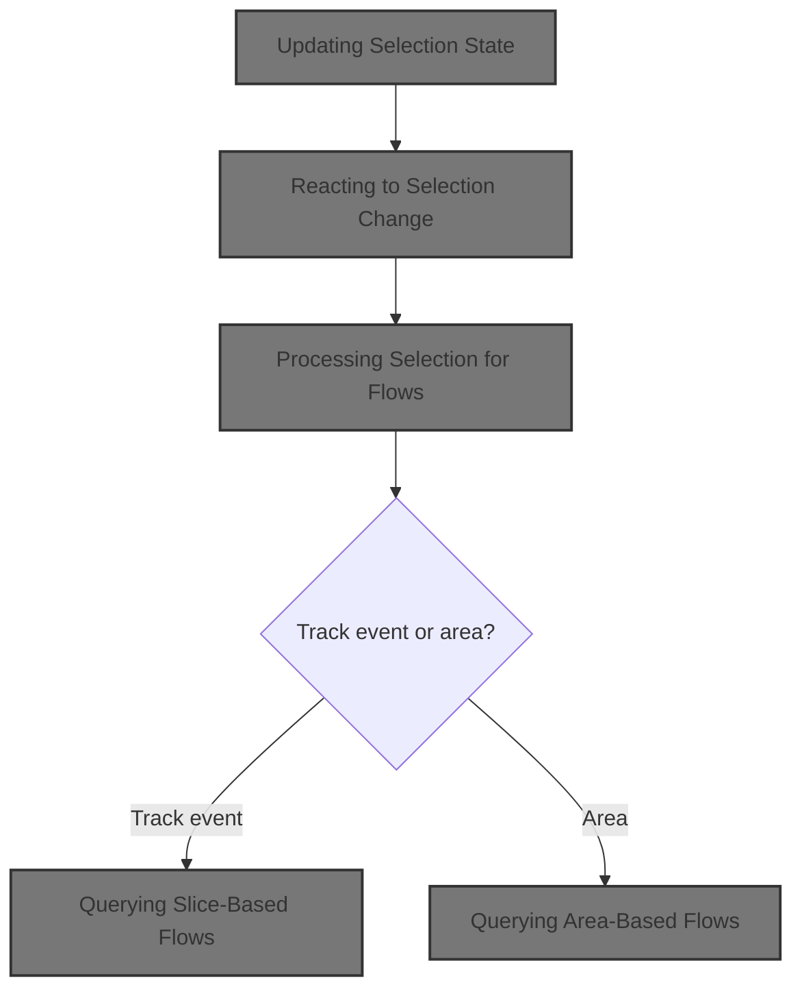
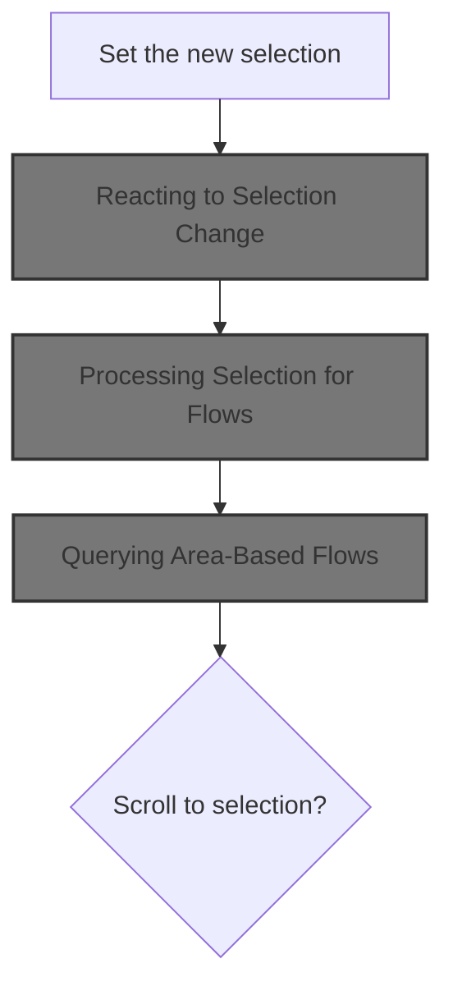
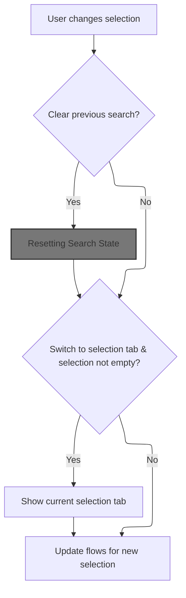
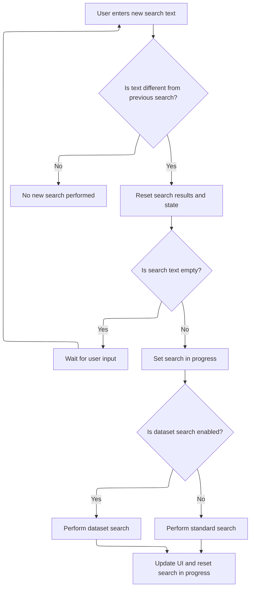
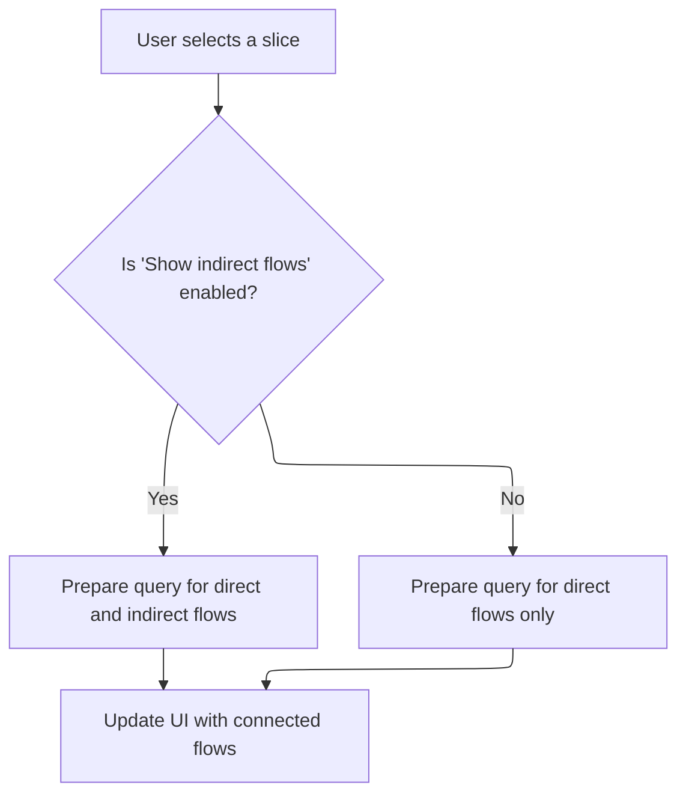
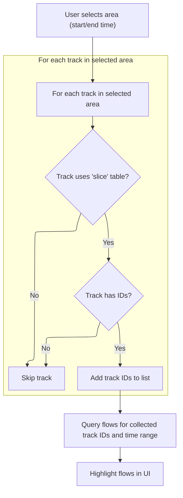

This document describes how the application responds when a user or system action changes the current selection, such as selecting a track event or an area in the trace. The system updates its internal selection state, refreshes search results, queries for related flows, and updates the UI to reflect the new selection.



# Where is this flow used?

This flow is used multiple times in the codebase as represented in the following diagram:

(Note - these are only some of the entry points of this flow)

```mermaid
graph TD;
      47a009bb28468bd248715ec917e8837b1a126907e2ff752f89d3e6e278078226(ui/…/bigtrace/index.ts::main) --> 9da801899ca38d8b30d5a1c08b2d8a45ef97466770974636e7d91ac9692e14f5(ui/…/bigtrace/index.ts::onCssLoaded)

9da801899ca38d8b30d5a1c08b2d8a45ef97466770974636e7d91ac9692e14f5(ui/…/bigtrace/index.ts::onCssLoaded) --> d6a1751f4520c969334266976c264e13155eead8051bbc6b9a56dc7d44df9330(ui/…/bigtrace/index.ts::routeChange)

9da801899ca38d8b30d5a1c08b2d8a45ef97466770974636e7d91ac9692e14f5(ui/…/bigtrace/index.ts::onCssLoaded) --> 44db15a568163e0104544225e5ad572d43d80cea5a874b23ee18b845a0659a31(ui/…/frontend/rpc_http_dialog.ts::checkHttpRpcConnection)

d6a1751f4520c969334266976c264e13155eead8051bbc6b9a56dc7d44df9330(ui/…/bigtrace/index.ts::routeChange) --> 62f31ae162641250ca8ec850093254a04eef8fe489545ec815bad98247976306(ui/…/frontend/trace_url_handler.ts::maybeOpenTraceFromRoute)

62f31ae162641250ca8ec850093254a04eef8fe489545ec815bad98247976306(ui/…/frontend/trace_url_handler.ts::maybeOpenTraceFromRoute) --> 6f37504e78a178dc65bc1392e79a5a654928ae8edb1e0b94ddf571824243e3d9(ui/…/frontend/permalink.ts::loadPermalink)

6f37504e78a178dc65bc1392e79a5a654928ae8edb1e0b94ddf571824243e3d9(ui/…/frontend/permalink.ts::loadPermalink) --> 609cb59a249be327f15be34c29f0308ef395d9f5d0c303e7ad384868a5558017(ui/…/core/app_impl.ts::AppImpl.openTraceFromUrl)

609cb59a249be327f15be34c29f0308ef395d9f5d0c303e7ad384868a5558017(ui/…/core/app_impl.ts::AppImpl.openTraceFromUrl) --> e47fa8fc91587c08ac0c3bb2d6ffbc8207b333b8d2a76e6dc3b240ac39f686e9(ui/…/core/app_impl.ts::AppImpl.openTrace)

e47fa8fc91587c08ac0c3bb2d6ffbc8207b333b8d2a76e6dc3b240ac39f686e9(ui/…/core/app_impl.ts::AppImpl.openTrace) --> ccf2ed155e6b8c7313b9e6cd6f672a3ea5c9f0e6e22cae91477dc62cbf9b8f4a(ui/…/core/load_trace.ts::loadTrace)

ccf2ed155e6b8c7313b9e6cd6f672a3ea5c9f0e6e22cae91477dc62cbf9b8f4a(ui/…/core/load_trace.ts::loadTrace) --> 8bc69be8b4561b5b6b9cab450db0e00ba41e83956931c2a65d570eada8ee7117(ui/…/core/load_trace.ts::loadTraceIntoEngine)

8bc69be8b4561b5b6b9cab450db0e00ba41e83956931c2a65d570eada8ee7117(ui/…/core/load_trace.ts::loadTraceIntoEngine) --> eb8fc69b2c7b7e67feb74dcb8649e311fbcb28d3a718044bc335e74170bf3329(ui/…/core/state_serialization.ts::deserializeAppStatePhase2)

eb8fc69b2c7b7e67feb74dcb8649e311fbcb28d3a718044bc335e74170bf3329(ui/…/core/state_serialization.ts::deserializeAppStatePhase2) --> fc62237e73570a042401c8d5a583d87a37e4f207e6e73545f152717bd54bb374(ui/…/core/selection_manager.ts::SelectionManagerImpl.deserialize)

fc62237e73570a042401c8d5a583d87a37e4f207e6e73545f152717bd54bb374(ui/…/core/selection_manager.ts::SelectionManagerImpl.deserialize) --> abd9e7d1fbfb9827529a425fbef56f0ed7b9459a22cc380c0f01e5cfc9dab939(ui/…/core/selection_manager.ts::SelectionManagerImpl.deserializeInternal)

abd9e7d1fbfb9827529a425fbef56f0ed7b9459a22cc380c0f01e5cfc9dab939(ui/…/core/selection_manager.ts::SelectionManagerImpl.deserializeInternal) --> 15ac8de3d4288183264cd12ec78e14e3d3fe2faaf3c78ce1feaf519bff9ff7cd(ui/…/core/selection_manager.ts::SelectionManagerImpl.selectTrackEventInternal)

abd9e7d1fbfb9827529a425fbef56f0ed7b9459a22cc380c0f01e5cfc9dab939(ui/…/core/selection_manager.ts::SelectionManagerImpl.deserializeInternal) --> f50b8032ad105429f4efe1dcc929769d7f4d6b28ee0721c6d8cea88fad0b353a(ui/…/core/selection_manager.ts::SelectionManagerImpl.selectArea)

15ac8de3d4288183264cd12ec78e14e3d3fe2faaf3c78ce1feaf519bff9ff7cd(ui/…/core/selection_manager.ts::SelectionManagerImpl.selectTrackEventInternal) --> 01505f66ffc6ef9b64737fce286502d4927f18e9984e1a555d48ce0992bb5c7d(ui/…/core/selection_manager.ts::SelectionManagerImpl.setSelection)

f50b8032ad105429f4efe1dcc929769d7f4d6b28ee0721c6d8cea88fad0b353a(ui/…/core/selection_manager.ts::SelectionManagerImpl.selectArea) --> 01505f66ffc6ef9b64737fce286502d4927f18e9984e1a555d48ce0992bb5c7d(ui/…/core/selection_manager.ts::SelectionManagerImpl.setSelection)

44db15a568163e0104544225e5ad572d43d80cea5a874b23ee18b845a0659a31(ui/…/frontend/rpc_http_dialog.ts::checkHttpRpcConnection) --> e9477adb21c1214b2b92e61c40e2a66b6e853907768a158707e2912a62efe942(ui/…/core/app_impl.ts::AppImpl.openTraceFromHttpRpc)

e9477adb21c1214b2b92e61c40e2a66b6e853907768a158707e2912a62efe942(ui/…/core/app_impl.ts::AppImpl.openTraceFromHttpRpc) --> e47fa8fc91587c08ac0c3bb2d6ffbc8207b333b8d2a76e6dc3b240ac39f686e9(ui/…/core/app_impl.ts::AppImpl.openTrace)

348c9442d30a0321e4c3b3d93e2a1cfc0a9acf45ba27cede8a6fbd51ed345a57(ui/…/frontend/post_message_handler.ts::postMessageHandler) --> 10d630be7f61b80334c99a55f76ece4b0acbdef3175963a4f83fe7fb118a8759(ui/…/core/app_impl.ts::AppImpl.openTraceFromBuffer)

348c9442d30a0321e4c3b3d93e2a1cfc0a9acf45ba27cede8a6fbd51ed345a57(ui/…/frontend/post_message_handler.ts::postMessageHandler) --> fe66a8909ca5436d7a79816b194bdb036dce242cb5918c6e77effc893fb0dda7(ui/…/frontend/post_message_handler.ts::openTrace)

10d630be7f61b80334c99a55f76ece4b0acbdef3175963a4f83fe7fb118a8759(ui/…/core/app_impl.ts::AppImpl.openTraceFromBuffer) --> e47fa8fc91587c08ac0c3bb2d6ffbc8207b333b8d2a76e6dc3b240ac39f686e9(ui/…/core/app_impl.ts::AppImpl.openTrace)

fe66a8909ca5436d7a79816b194bdb036dce242cb5918c6e77effc893fb0dda7(ui/…/frontend/post_message_handler.ts::openTrace) --> 10d630be7f61b80334c99a55f76ece4b0acbdef3175963a4f83fe7fb118a8759(ui/…/core/app_impl.ts::AppImpl.openTraceFromBuffer)

7af2a7812bac0fd77765ddddcbd63121690ab837f6ee0644fc5ffbfc1b106963(ui/…/timeline_page/track_tree_view.ts::TrackTreeView.view) --> 925b9ccedebafdbef04dfe98926e027413208a3887a621aafb61d275841d3d6c(ui/…/timeline_page/track_view.ts::TrackView.renderDOM)

7af2a7812bac0fd77765ddddcbd63121690ab837f6ee0644fc5ffbfc1b106963(ui/…/timeline_page/track_tree_view.ts::TrackTreeView.view) --> 71a9af46b6a4cfbffec5d3b1946c3970075b05dba39f20887ed63966b55d8cde(ui/…/timeline_page/track_tree_view.ts::renderTrack)

925b9ccedebafdbef04dfe98926e027413208a3887a621aafb61d275841d3d6c(ui/…/timeline_page/track_view.ts::TrackView.renderDOM) --> 62bf06cf0909830ca467b41be854b4b3214122d7b8f6cca66d21a828fb03dfd2(ui/…/timeline_page/track_view.ts::TrackView.renderAreaSelectionCheckbox)

62bf06cf0909830ca467b41be854b4b3214122d7b8f6cca66d21a828fb03dfd2(ui/…/timeline_page/track_view.ts::TrackView.renderAreaSelectionCheckbox) --> 2e14d5f91493ddb3de4661cbcaede40f32a453c68588321cd605f6a3255218e1(ui/…/core/selection_manager.ts::SelectionManagerImpl.toggleTrackAreaSelection)

62bf06cf0909830ca467b41be854b4b3214122d7b8f6cca66d21a828fb03dfd2(ui/…/timeline_page/track_view.ts::TrackView.renderAreaSelectionCheckbox) --> d45879e24f9cbbdfe7633603833252a353da05a5d209be2caa162c94a9bc0e43(ui/…/core/selection_manager.ts::SelectionManagerImpl.toggleGroupAreaSelection)

62bf06cf0909830ca467b41be854b4b3214122d7b8f6cca66d21a828fb03dfd2(ui/…/timeline_page/track_view.ts::TrackView.renderAreaSelectionCheckbox) --> 4ef40b3b0a6937dbedebd46e41748cf2d4f122f61539647a7d356954cc47757b(ui/…/timeline_page/track_view.ts::renderButton)

2e14d5f91493ddb3de4661cbcaede40f32a453c68588321cd605f6a3255218e1(ui/…/core/selection_manager.ts::SelectionManagerImpl.toggleTrackAreaSelection) --> f50b8032ad105429f4efe1dcc929769d7f4d6b28ee0721c6d8cea88fad0b353a(ui/…/core/selection_manager.ts::SelectionManagerImpl.selectArea)

d45879e24f9cbbdfe7633603833252a353da05a5d209be2caa162c94a9bc0e43(ui/…/core/selection_manager.ts::SelectionManagerImpl.toggleGroupAreaSelection) --> f50b8032ad105429f4efe1dcc929769d7f4d6b28ee0721c6d8cea88fad0b353a(ui/…/core/selection_manager.ts::SelectionManagerImpl.selectArea)

4ef40b3b0a6937dbedebd46e41748cf2d4f122f61539647a7d356954cc47757b(ui/…/timeline_page/track_view.ts::renderButton) --> d45879e24f9cbbdfe7633603833252a353da05a5d209be2caa162c94a9bc0e43(ui/…/core/selection_manager.ts::SelectionManagerImpl.toggleGroupAreaSelection)

71a9af46b6a4cfbffec5d3b1946c3970075b05dba39f20887ed63966b55d8cde(ui/…/timeline_page/track_tree_view.ts::renderTrack) --> 925b9ccedebafdbef04dfe98926e027413208a3887a621aafb61d275841d3d6c(ui/…/timeline_page/track_view.ts::TrackView.renderDOM)

71a9af46b6a4cfbffec5d3b1946c3970075b05dba39f20887ed63966b55d8cde(ui/…/timeline_page/track_tree_view.ts::renderTrack) --> 71a9af46b6a4cfbffec5d3b1946c3970075b05dba39f20887ed63966b55d8cde(ui/…/timeline_page/track_tree_view.ts::renderTrack)

8a34b5d536a890f9a23aeec055956210e7222a96e85641ead723b412f294e85b(ui/…/bigtrace/index.ts::CoreCommands.onTraceLoad) --> eb8fc69b2c7b7e67feb74dcb8649e311fbcb28d3a718044bc335e74170bf3329(ui/…/core/state_serialization.ts::deserializeAppStatePhase2)

8a34b5d536a890f9a23aeec055956210e7222a96e85641ead723b412f294e85b(ui/…/bigtrace/index.ts::CoreCommands.onTraceLoad) --> dab247b7ff6138ddf1b03f504b9d985f244ed79024cba644ececfebdee8a1cc1(ui/…/core/flow_manager.ts::FlowManager.moveByFocusedFlow)

dab247b7ff6138ddf1b03f504b9d985f244ed79024cba644ececfebdee8a1cc1(ui/…/core/flow_manager.ts::FlowManager.moveByFocusedFlow) --> 72e5511d1cb30e324585cd83156489500911b1d189f24bd2eff7b4401699593f(ui/…/core/selection_manager.ts::SelectionManagerImpl.selectSqlEvent)

72e5511d1cb30e324585cd83156489500911b1d189f24bd2eff7b4401699593f(ui/…/core/selection_manager.ts::SelectionManagerImpl.selectSqlEvent) --> f29a493d82460fa4886805a3cb91f12534e24a8560119248a7d782ecdfcb0545(ui/…/core/selection_manager.ts::SelectionManagerImpl.selectTrackEvent)

f29a493d82460fa4886805a3cb91f12534e24a8560119248a7d782ecdfcb0545(ui/…/core/selection_manager.ts::SelectionManagerImpl.selectTrackEvent) --> 15ac8de3d4288183264cd12ec78e14e3d3fe2faaf3c78ce1feaf519bff9ff7cd(ui/…/core/selection_manager.ts::SelectionManagerImpl.selectTrackEventInternal)

b6e2f1dfb23e4d05c9aca9250ac5bbbd6e38a8bfa4aeaf7027de481b5059b093(ui/…/dev.perfetto.MultiTraceOpen/multi_trace_modal.ts::MultiTraceModalShell.view) --> 9c8b1fd7c7f5868de6050594d9788e0a58ee6df5a484a8581e17394dbcefafec(ui/…/dev.perfetto.MultiTraceOpen/multi_trace_modal.ts::MultiTraceModalShell.renderActions)

9c8b1fd7c7f5868de6050594d9788e0a58ee6df5a484a8581e17394dbcefafec(ui/…/dev.perfetto.MultiTraceOpen/multi_trace_modal.ts::MultiTraceModalShell.renderActions) --> f72ca928779f8cb8a5b1cdce1fbf6792470599c4682fe545a7bddee664236476(ui/…/dev.perfetto.MultiTraceOpen/multi_trace_modal.ts::MultiTraceModalShell.openTraces)

f72ca928779f8cb8a5b1cdce1fbf6792470599c4682fe545a7bddee664236476(ui/…/dev.perfetto.MultiTraceOpen/multi_trace_modal.ts::MultiTraceModalShell.openTraces) --> 4f19786a72e5f73ac101216d9bb9613aa796fe640699fed90a3c809547a57658(ui/…/core/app_impl.ts::AppImpl.openTraceFromMultipleFiles)

4f19786a72e5f73ac101216d9bb9613aa796fe640699fed90a3c809547a57658(ui/…/core/app_impl.ts::AppImpl.openTraceFromMultipleFiles) --> e47fa8fc91587c08ac0c3bb2d6ffbc8207b333b8d2a76e6dc3b240ac39f686e9(ui/…/core/app_impl.ts::AppImpl.openTrace)


classDef mainFlowStyle color:#000000,fill:#7CB9F4
classDef rootsStyle color:#000000,fill:#00FFF4
classDef Style1 color:#000000,fill:#00FFAA
classDef Style2 color:#000000,fill:#FFFF00
classDef Style3 color:#000000,fill:#AA7CB9

%% Swimm:
%% graph TD;
%%       47a009bb28468bd248715ec917e8837b1a126907e2ff752f89d3e6e278078226(<SwmPath>[ui/…/bigtrace/index.ts](ui/src/bigtrace/index.ts)</SwmPath>::main) --> 9da801899ca38d8b30d5a1c08b2d8a45ef97466770974636e7d91ac9692e14f5(<SwmPath>[ui/…/bigtrace/index.ts](ui/src/bigtrace/index.ts)</SwmPath>::onCssLoaded)
%% 
%% 9da801899ca38d8b30d5a1c08b2d8a45ef97466770974636e7d91ac9692e14f5(<SwmPath>[ui/…/bigtrace/index.ts](ui/src/bigtrace/index.ts)</SwmPath>::onCssLoaded) --> d6a1751f4520c969334266976c264e13155eead8051bbc6b9a56dc7d44df9330(<SwmPath>[ui/…/bigtrace/index.ts](ui/src/bigtrace/index.ts)</SwmPath>::routeChange)
%% 
%% 9da801899ca38d8b30d5a1c08b2d8a45ef97466770974636e7d91ac9692e14f5(<SwmPath>[ui/…/bigtrace/index.ts](ui/src/bigtrace/index.ts)</SwmPath>::onCssLoaded) --> 44db15a568163e0104544225e5ad572d43d80cea5a874b23ee18b845a0659a31(<SwmPath>[ui/…/frontend/rpc_http_dialog.ts](ui/src/frontend/rpc_http_dialog.ts)</SwmPath>::checkHttpRpcConnection)
%% 
%% d6a1751f4520c969334266976c264e13155eead8051bbc6b9a56dc7d44df9330(<SwmPath>[ui/…/bigtrace/index.ts](ui/src/bigtrace/index.ts)</SwmPath>::routeChange) --> 62f31ae162641250ca8ec850093254a04eef8fe489545ec815bad98247976306(<SwmPath>[ui/…/frontend/trace_url_handler.ts](ui/src/frontend/trace_url_handler.ts)</SwmPath>::maybeOpenTraceFromRoute)
%% 
%% 62f31ae162641250ca8ec850093254a04eef8fe489545ec815bad98247976306(<SwmPath>[ui/…/frontend/trace_url_handler.ts](ui/src/frontend/trace_url_handler.ts)</SwmPath>::maybeOpenTraceFromRoute) --> 6f37504e78a178dc65bc1392e79a5a654928ae8edb1e0b94ddf571824243e3d9(<SwmPath>[ui/…/frontend/permalink.ts](ui/src/frontend/permalink.ts)</SwmPath>::loadPermalink)
%% 
%% 6f37504e78a178dc65bc1392e79a5a654928ae8edb1e0b94ddf571824243e3d9(<SwmPath>[ui/…/frontend/permalink.ts](ui/src/frontend/permalink.ts)</SwmPath>::loadPermalink) --> 609cb59a249be327f15be34c29f0308ef395d9f5d0c303e7ad384868a5558017(<SwmPath>[ui/…/core/app_impl.ts](ui/src/core/app_impl.ts)</SwmPath>::AppImpl.openTraceFromUrl)
%% 
%% 609cb59a249be327f15be34c29f0308ef395d9f5d0c303e7ad384868a5558017(<SwmPath>[ui/…/core/app_impl.ts](ui/src/core/app_impl.ts)</SwmPath>::AppImpl.openTraceFromUrl) --> e47fa8fc91587c08ac0c3bb2d6ffbc8207b333b8d2a76e6dc3b240ac39f686e9(<SwmPath>[ui/…/core/app_impl.ts](ui/src/core/app_impl.ts)</SwmPath>::AppImpl.openTrace)
%% 
%% e47fa8fc91587c08ac0c3bb2d6ffbc8207b333b8d2a76e6dc3b240ac39f686e9(<SwmPath>[ui/…/core/app_impl.ts](ui/src/core/app_impl.ts)</SwmPath>::AppImpl.openTrace) --> ccf2ed155e6b8c7313b9e6cd6f672a3ea5c9f0e6e22cae91477dc62cbf9b8f4a(<SwmPath>[ui/…/core/load_trace.ts](ui/src/core/load_trace.ts)</SwmPath>::loadTrace)
%% 
%% ccf2ed155e6b8c7313b9e6cd6f672a3ea5c9f0e6e22cae91477dc62cbf9b8f4a(<SwmPath>[ui/…/core/load_trace.ts](ui/src/core/load_trace.ts)</SwmPath>::loadTrace) --> 8bc69be8b4561b5b6b9cab450db0e00ba41e83956931c2a65d570eada8ee7117(<SwmPath>[ui/…/core/load_trace.ts](ui/src/core/load_trace.ts)</SwmPath>::loadTraceIntoEngine)
%% 
%% 8bc69be8b4561b5b6b9cab450db0e00ba41e83956931c2a65d570eada8ee7117(<SwmPath>[ui/…/core/load_trace.ts](ui/src/core/load_trace.ts)</SwmPath>::loadTraceIntoEngine) --> eb8fc69b2c7b7e67feb74dcb8649e311fbcb28d3a718044bc335e74170bf3329(<SwmPath>[ui/…/core/state_serialization.ts](ui/src/core/state_serialization.ts)</SwmPath>::deserializeAppStatePhase2)
%% 
%% eb8fc69b2c7b7e67feb74dcb8649e311fbcb28d3a718044bc335e74170bf3329(<SwmPath>[ui/…/core/state_serialization.ts](ui/src/core/state_serialization.ts)</SwmPath>::deserializeAppStatePhase2) --> fc62237e73570a042401c8d5a583d87a37e4f207e6e73545f152717bd54bb374(<SwmPath>[ui/…/core/selection_manager.ts](ui/src/core/selection_manager.ts)</SwmPath>::SelectionManagerImpl.deserialize)
%% 
%% fc62237e73570a042401c8d5a583d87a37e4f207e6e73545f152717bd54bb374(<SwmPath>[ui/…/core/selection_manager.ts](ui/src/core/selection_manager.ts)</SwmPath>::SelectionManagerImpl.deserialize) --> abd9e7d1fbfb9827529a425fbef56f0ed7b9459a22cc380c0f01e5cfc9dab939(<SwmPath>[ui/…/core/selection_manager.ts](ui/src/core/selection_manager.ts)</SwmPath>::SelectionManagerImpl.deserializeInternal)
%% 
%% abd9e7d1fbfb9827529a425fbef56f0ed7b9459a22cc380c0f01e5cfc9dab939(<SwmPath>[ui/…/core/selection_manager.ts](ui/src/core/selection_manager.ts)</SwmPath>::SelectionManagerImpl.deserializeInternal) --> 15ac8de3d4288183264cd12ec78e14e3d3fe2faaf3c78ce1feaf519bff9ff7cd(<SwmPath>[ui/…/core/selection_manager.ts](ui/src/core/selection_manager.ts)</SwmPath>::SelectionManagerImpl.selectTrackEventInternal)
%% 
%% abd9e7d1fbfb9827529a425fbef56f0ed7b9459a22cc380c0f01e5cfc9dab939(<SwmPath>[ui/…/core/selection_manager.ts](ui/src/core/selection_manager.ts)</SwmPath>::SelectionManagerImpl.deserializeInternal) --> f50b8032ad105429f4efe1dcc929769d7f4d6b28ee0721c6d8cea88fad0b353a(<SwmPath>[ui/…/core/selection_manager.ts](ui/src/core/selection_manager.ts)</SwmPath>::SelectionManagerImpl.selectArea)
%% 
%% 15ac8de3d4288183264cd12ec78e14e3d3fe2faaf3c78ce1feaf519bff9ff7cd(<SwmPath>[ui/…/core/selection_manager.ts](ui/src/core/selection_manager.ts)</SwmPath>::SelectionManagerImpl.selectTrackEventInternal) --> 01505f66ffc6ef9b64737fce286502d4927f18e9984e1a555d48ce0992bb5c7d(<SwmPath>[ui/…/core/selection_manager.ts](ui/src/core/selection_manager.ts)</SwmPath>::SelectionManagerImpl.setSelection)
%% 
%% f50b8032ad105429f4efe1dcc929769d7f4d6b28ee0721c6d8cea88fad0b353a(<SwmPath>[ui/…/core/selection_manager.ts](ui/src/core/selection_manager.ts)</SwmPath>::SelectionManagerImpl.selectArea) --> 01505f66ffc6ef9b64737fce286502d4927f18e9984e1a555d48ce0992bb5c7d(<SwmPath>[ui/…/core/selection_manager.ts](ui/src/core/selection_manager.ts)</SwmPath>::SelectionManagerImpl.setSelection)
%% 
%% 44db15a568163e0104544225e5ad572d43d80cea5a874b23ee18b845a0659a31(<SwmPath>[ui/…/frontend/rpc_http_dialog.ts](ui/src/frontend/rpc_http_dialog.ts)</SwmPath>::checkHttpRpcConnection) --> e9477adb21c1214b2b92e61c40e2a66b6e853907768a158707e2912a62efe942(<SwmPath>[ui/…/core/app_impl.ts](ui/src/core/app_impl.ts)</SwmPath>::AppImpl.openTraceFromHttpRpc)
%% 
%% e9477adb21c1214b2b92e61c40e2a66b6e853907768a158707e2912a62efe942(<SwmPath>[ui/…/core/app_impl.ts](ui/src/core/app_impl.ts)</SwmPath>::AppImpl.openTraceFromHttpRpc) --> e47fa8fc91587c08ac0c3bb2d6ffbc8207b333b8d2a76e6dc3b240ac39f686e9(<SwmPath>[ui/…/core/app_impl.ts](ui/src/core/app_impl.ts)</SwmPath>::AppImpl.openTrace)
%% 
%% 348c9442d30a0321e4c3b3d93e2a1cfc0a9acf45ba27cede8a6fbd51ed345a57(<SwmPath>[ui/…/frontend/post_message_handler.ts](ui/src/frontend/post_message_handler.ts)</SwmPath>::postMessageHandler) --> 10d630be7f61b80334c99a55f76ece4b0acbdef3175963a4f83fe7fb118a8759(<SwmPath>[ui/…/core/app_impl.ts](ui/src/core/app_impl.ts)</SwmPath>::AppImpl.openTraceFromBuffer)
%% 
%% 348c9442d30a0321e4c3b3d93e2a1cfc0a9acf45ba27cede8a6fbd51ed345a57(<SwmPath>[ui/…/frontend/post_message_handler.ts](ui/src/frontend/post_message_handler.ts)</SwmPath>::postMessageHandler) --> fe66a8909ca5436d7a79816b194bdb036dce242cb5918c6e77effc893fb0dda7(<SwmPath>[ui/…/frontend/post_message_handler.ts](ui/src/frontend/post_message_handler.ts)</SwmPath>::openTrace)
%% 
%% 10d630be7f61b80334c99a55f76ece4b0acbdef3175963a4f83fe7fb118a8759(<SwmPath>[ui/…/core/app_impl.ts](ui/src/core/app_impl.ts)</SwmPath>::AppImpl.openTraceFromBuffer) --> e47fa8fc91587c08ac0c3bb2d6ffbc8207b333b8d2a76e6dc3b240ac39f686e9(<SwmPath>[ui/…/core/app_impl.ts](ui/src/core/app_impl.ts)</SwmPath>::AppImpl.openTrace)
%% 
%% fe66a8909ca5436d7a79816b194bdb036dce242cb5918c6e77effc893fb0dda7(<SwmPath>[ui/…/frontend/post_message_handler.ts](ui/src/frontend/post_message_handler.ts)</SwmPath>::openTrace) --> 10d630be7f61b80334c99a55f76ece4b0acbdef3175963a4f83fe7fb118a8759(<SwmPath>[ui/…/core/app_impl.ts](ui/src/core/app_impl.ts)</SwmPath>::AppImpl.openTraceFromBuffer)
%% 
%% 7af2a7812bac0fd77765ddddcbd63121690ab837f6ee0644fc5ffbfc1b106963(<SwmPath>[ui/…/timeline_page/track_tree_view.ts](ui/src/frontend/timeline_page/track_tree_view.ts)</SwmPath>::TrackTreeView.view) --> 925b9ccedebafdbef04dfe98926e027413208a3887a621aafb61d275841d3d6c(<SwmPath>[ui/…/timeline_page/track_view.ts](ui/src/frontend/timeline_page/track_view.ts)</SwmPath>::TrackView.renderDOM)
%% 
%% 7af2a7812bac0fd77765ddddcbd63121690ab837f6ee0644fc5ffbfc1b106963(<SwmPath>[ui/…/timeline_page/track_tree_view.ts](ui/src/frontend/timeline_page/track_tree_view.ts)</SwmPath>::TrackTreeView.view) --> 71a9af46b6a4cfbffec5d3b1946c3970075b05dba39f20887ed63966b55d8cde(<SwmPath>[ui/…/timeline_page/track_tree_view.ts](ui/src/frontend/timeline_page/track_tree_view.ts)</SwmPath>::renderTrack)
%% 
%% 925b9ccedebafdbef04dfe98926e027413208a3887a621aafb61d275841d3d6c(<SwmPath>[ui/…/timeline_page/track_view.ts](ui/src/frontend/timeline_page/track_view.ts)</SwmPath>::TrackView.renderDOM) --> 62bf06cf0909830ca467b41be854b4b3214122d7b8f6cca66d21a828fb03dfd2(<SwmPath>[ui/…/timeline_page/track_view.ts](ui/src/frontend/timeline_page/track_view.ts)</SwmPath>::TrackView.renderAreaSelectionCheckbox)
%% 
%% 62bf06cf0909830ca467b41be854b4b3214122d7b8f6cca66d21a828fb03dfd2(<SwmPath>[ui/…/timeline_page/track_view.ts](ui/src/frontend/timeline_page/track_view.ts)</SwmPath>::TrackView.renderAreaSelectionCheckbox) --> 2e14d5f91493ddb3de4661cbcaede40f32a453c68588321cd605f6a3255218e1(<SwmPath>[ui/…/core/selection_manager.ts](ui/src/core/selection_manager.ts)</SwmPath>::SelectionManagerImpl.toggleTrackAreaSelection)
%% 
%% 62bf06cf0909830ca467b41be854b4b3214122d7b8f6cca66d21a828fb03dfd2(<SwmPath>[ui/…/timeline_page/track_view.ts](ui/src/frontend/timeline_page/track_view.ts)</SwmPath>::TrackView.renderAreaSelectionCheckbox) --> d45879e24f9cbbdfe7633603833252a353da05a5d209be2caa162c94a9bc0e43(<SwmPath>[ui/…/core/selection_manager.ts](ui/src/core/selection_manager.ts)</SwmPath>::SelectionManagerImpl.toggleGroupAreaSelection)
%% 
%% 62bf06cf0909830ca467b41be854b4b3214122d7b8f6cca66d21a828fb03dfd2(<SwmPath>[ui/…/timeline_page/track_view.ts](ui/src/frontend/timeline_page/track_view.ts)</SwmPath>::TrackView.renderAreaSelectionCheckbox) --> 4ef40b3b0a6937dbedebd46e41748cf2d4f122f61539647a7d356954cc47757b(<SwmPath>[ui/…/timeline_page/track_view.ts](ui/src/frontend/timeline_page/track_view.ts)</SwmPath>::renderButton)
%% 
%% 2e14d5f91493ddb3de4661cbcaede40f32a453c68588321cd605f6a3255218e1(<SwmPath>[ui/…/core/selection_manager.ts](ui/src/core/selection_manager.ts)</SwmPath>::SelectionManagerImpl.toggleTrackAreaSelection) --> f50b8032ad105429f4efe1dcc929769d7f4d6b28ee0721c6d8cea88fad0b353a(<SwmPath>[ui/…/core/selection_manager.ts](ui/src/core/selection_manager.ts)</SwmPath>::SelectionManagerImpl.selectArea)
%% 
%% d45879e24f9cbbdfe7633603833252a353da05a5d209be2caa162c94a9bc0e43(<SwmPath>[ui/…/core/selection_manager.ts](ui/src/core/selection_manager.ts)</SwmPath>::SelectionManagerImpl.toggleGroupAreaSelection) --> f50b8032ad105429f4efe1dcc929769d7f4d6b28ee0721c6d8cea88fad0b353a(<SwmPath>[ui/…/core/selection_manager.ts](ui/src/core/selection_manager.ts)</SwmPath>::SelectionManagerImpl.selectArea)
%% 
%% 4ef40b3b0a6937dbedebd46e41748cf2d4f122f61539647a7d356954cc47757b(<SwmPath>[ui/…/timeline_page/track_view.ts](ui/src/frontend/timeline_page/track_view.ts)</SwmPath>::renderButton) --> d45879e24f9cbbdfe7633603833252a353da05a5d209be2caa162c94a9bc0e43(<SwmPath>[ui/…/core/selection_manager.ts](ui/src/core/selection_manager.ts)</SwmPath>::SelectionManagerImpl.toggleGroupAreaSelection)
%% 
%% 71a9af46b6a4cfbffec5d3b1946c3970075b05dba39f20887ed63966b55d8cde(<SwmPath>[ui/…/timeline_page/track_tree_view.ts](ui/src/frontend/timeline_page/track_tree_view.ts)</SwmPath>::renderTrack) --> 925b9ccedebafdbef04dfe98926e027413208a3887a621aafb61d275841d3d6c(<SwmPath>[ui/…/timeline_page/track_view.ts](ui/src/frontend/timeline_page/track_view.ts)</SwmPath>::TrackView.renderDOM)
%% 
%% 71a9af46b6a4cfbffec5d3b1946c3970075b05dba39f20887ed63966b55d8cde(<SwmPath>[ui/…/timeline_page/track_tree_view.ts](ui/src/frontend/timeline_page/track_tree_view.ts)</SwmPath>::renderTrack) --> 71a9af46b6a4cfbffec5d3b1946c3970075b05dba39f20887ed63966b55d8cde(<SwmPath>[ui/…/timeline_page/track_tree_view.ts](ui/src/frontend/timeline_page/track_tree_view.ts)</SwmPath>::renderTrack)
%% 
%% 8a34b5d536a890f9a23aeec055956210e7222a96e85641ead723b412f294e85b(<SwmPath>[ui/…/bigtrace/index.ts](ui/src/bigtrace/index.ts)</SwmPath>::CoreCommands.onTraceLoad) --> eb8fc69b2c7b7e67feb74dcb8649e311fbcb28d3a718044bc335e74170bf3329(<SwmPath>[ui/…/core/state_serialization.ts](ui/src/core/state_serialization.ts)</SwmPath>::deserializeAppStatePhase2)
%% 
%% 8a34b5d536a890f9a23aeec055956210e7222a96e85641ead723b412f294e85b(<SwmPath>[ui/…/bigtrace/index.ts](ui/src/bigtrace/index.ts)</SwmPath>::CoreCommands.onTraceLoad) --> dab247b7ff6138ddf1b03f504b9d985f244ed79024cba644ececfebdee8a1cc1(<SwmPath>[ui/…/core/flow_manager.ts](ui/src/core/flow_manager.ts)</SwmPath>::FlowManager.moveByFocusedFlow)
%% 
%% dab247b7ff6138ddf1b03f504b9d985f244ed79024cba644ececfebdee8a1cc1(<SwmPath>[ui/…/core/flow_manager.ts](ui/src/core/flow_manager.ts)</SwmPath>::FlowManager.moveByFocusedFlow) --> 72e5511d1cb30e324585cd83156489500911b1d189f24bd2eff7b4401699593f(<SwmPath>[ui/…/core/selection_manager.ts](ui/src/core/selection_manager.ts)</SwmPath>::SelectionManagerImpl.selectSqlEvent)
%% 
%% 72e5511d1cb30e324585cd83156489500911b1d189f24bd2eff7b4401699593f(<SwmPath>[ui/…/core/selection_manager.ts](ui/src/core/selection_manager.ts)</SwmPath>::SelectionManagerImpl.selectSqlEvent) --> f29a493d82460fa4886805a3cb91f12534e24a8560119248a7d782ecdfcb0545(<SwmPath>[ui/…/core/selection_manager.ts](ui/src/core/selection_manager.ts)</SwmPath>::SelectionManagerImpl.selectTrackEvent)
%% 
%% f29a493d82460fa4886805a3cb91f12534e24a8560119248a7d782ecdfcb0545(<SwmPath>[ui/…/core/selection_manager.ts](ui/src/core/selection_manager.ts)</SwmPath>::SelectionManagerImpl.selectTrackEvent) --> 15ac8de3d4288183264cd12ec78e14e3d3fe2faaf3c78ce1feaf519bff9ff7cd(<SwmPath>[ui/…/core/selection_manager.ts](ui/src/core/selection_manager.ts)</SwmPath>::SelectionManagerImpl.selectTrackEventInternal)
%% 
%% b6e2f1dfb23e4d05c9aca9250ac5bbbd6e38a8bfa4aeaf7027de481b5059b093(<SwmPath>[ui/…/dev.perfetto.MultiTraceOpen/multi_trace_modal.ts](ui/src/core_plugins/dev.perfetto.MultiTraceOpen/multi_trace_modal.ts)</SwmPath>::MultiTraceModalShell.view) --> 9c8b1fd7c7f5868de6050594d9788e0a58ee6df5a484a8581e17394dbcefafec(<SwmPath>[ui/…/dev.perfetto.MultiTraceOpen/multi_trace_modal.ts](ui/src/core_plugins/dev.perfetto.MultiTraceOpen/multi_trace_modal.ts)</SwmPath>::MultiTraceModalShell.renderActions)
%% 
%% 9c8b1fd7c7f5868de6050594d9788e0a58ee6df5a484a8581e17394dbcefafec(<SwmPath>[ui/…/dev.perfetto.MultiTraceOpen/multi_trace_modal.ts](ui/src/core_plugins/dev.perfetto.MultiTraceOpen/multi_trace_modal.ts)</SwmPath>::MultiTraceModalShell.renderActions) --> f72ca928779f8cb8a5b1cdce1fbf6792470599c4682fe545a7bddee664236476(<SwmPath>[ui/…/dev.perfetto.MultiTraceOpen/multi_trace_modal.ts](ui/src/core_plugins/dev.perfetto.MultiTraceOpen/multi_trace_modal.ts)</SwmPath>::MultiTraceModalShell.openTraces)
%% 
%% f72ca928779f8cb8a5b1cdce1fbf6792470599c4682fe545a7bddee664236476(<SwmPath>[ui/…/dev.perfetto.MultiTraceOpen/multi_trace_modal.ts](ui/src/core_plugins/dev.perfetto.MultiTraceOpen/multi_trace_modal.ts)</SwmPath>::MultiTraceModalShell.openTraces) --> 4f19786a72e5f73ac101216d9bb9613aa796fe640699fed90a3c809547a57658(<SwmPath>[ui/…/core/app_impl.ts](ui/src/core/app_impl.ts)</SwmPath>::AppImpl.openTraceFromMultipleFiles)
%% 
%% 4f19786a72e5f73ac101216d9bb9613aa796fe640699fed90a3c809547a57658(<SwmPath>[ui/…/core/app_impl.ts](ui/src/core/app_impl.ts)</SwmPath>::AppImpl.openTraceFromMultipleFiles) --> e47fa8fc91587c08ac0c3bb2d6ffbc8207b333b8d2a76e6dc3b240ac39f686e9(<SwmPath>[ui/…/core/app_impl.ts](ui/src/core/app_impl.ts)</SwmPath>::AppImpl.openTrace)
%% 
%% 
%% classDef mainFlowStyle color:#000000,fill:#7CB9F4
%% classDef rootsStyle color:#000000,fill:#00FFF4
%% classDef Style1 color:#000000,fill:#00FFAA
%% classDef Style2 color:#000000,fill:#FFFF00
%% classDef Style3 color:#000000,fill:#AA7CB9
```

# Updating Selection State



<SwmSnippet path="/ui/src/core/selection_manager.ts" line="332">

---

In <SwmToken path="ui/src/core/selection_manager.ts" pos="332:3:3" line-data="  private setSelection(selection: Selection, opts?: SelectionOpts) {">`setSelection`</SwmToken>, we update the internal selection state and immediately call <SwmToken path="ui/src/core/selection_manager.ts" pos="334:3:3" line-data="    this.onSelectionChange(selection, opts ?? {});">`onSelectionChange`</SwmToken> to propagate the change. This triggers downstream updates, so next we need to call into <SwmPath>[ui/…/core/trace_impl.ts](ui/src/core/trace_impl.ts)</SwmPath> to handle UI and search logic tied to the new selection.

```typescript
  private setSelection(selection: Selection, opts?: SelectionOpts) {
    this._selection = selection;
    this.onSelectionChange(selection, opts ?? {});

```

---

</SwmSnippet>

## Reacting to Selection Change



<SwmSnippet path="/ui/src/core/trace_impl.ts" line="176">

---

In <SwmToken path="ui/src/core/trace_impl.ts" pos="176:3:3" line-data="  private onSelectionChange(selection: Selection, opts: SelectionOpts) {">`onSelectionChange`</SwmToken>, we reset the search if required, then move on to <SwmToken path="ui/src/core/trace_impl.ts" pos="25:10:10" line-data="import {SearchManagerImpl} from &#39;./search_manager&#39;;">`search_manager`</SwmToken> to handle the actual search state update.

```typescript
  private onSelectionChange(selection: Selection, opts: SelectionOpts) {
    const {clearSearch = true, switchToCurrentSelectionTab = true} = opts;
    if (clearSearch) {
      this.search.reset();
    }
```

---

</SwmSnippet>

### Resetting Search State

<SwmSnippet path="/ui/src/core/search_manager.ts" line="115">

---

<SwmToken path="ui/src/core/search_manager.ts" pos="115:1:1" line-data="  reset() {">`reset`</SwmToken> just calls <SwmToken path="ui/src/core/search_manager.ts" pos="116:3:3" line-data="    this.search(&#39;&#39;);">`search`</SwmToken> with an empty string to clear out any existing search results and state. Next, we go deeper into <SwmToken path="ui/src/core/trace_impl.ts" pos="25:10:10" line-data="import {SearchManagerImpl} from &#39;./search_manager&#39;;">`search_manager`</SwmToken> to handle the actual state changes for a blank search.

```typescript
  reset() {
    this.search('');
  }
```

---

</SwmSnippet>

### Managing Search Lifecycle



<SwmSnippet path="/ui/src/core/search_manager.ts" line="92">

---

<SwmToken path="ui/src/core/search_manager.ts" pos="92:1:1" line-data="  search(text: string) {">`search`</SwmToken> manages all the internal state for a new search, avoids redundant work, and schedules the actual search operation asynchronously. Depending on the feature flag, it picks the right search method. Next, we go into <SwmToken path="ui/src/core/search_manager.ts" pos="107:5:5" line-data="          await this.executeSearch();">`executeSearch`</SwmToken> to run the main search logic.

```typescript
  search(text: string) {
    if (text === this._searchText) {
      return;
    }
    this._searchText = text;
    this._searchGeneration++;
    this._results = undefined;
    this._resultIndex = -1;
    this._searchInProgress = false;
    if (text !== '') {
      this._searchInProgress = true;
      this._limiter.schedule(async () => {
        if (DATASET_SEARCH.get()) {
          await this.executeDatasetSearch();
        } else {
          await this.executeSearch();
        }
        this._searchInProgress = false;
        raf.scheduleFullRedraw();
      });
    }
  }
```

---

</SwmSnippet>

### Executing Search Queries

```mermaid
%%{init: {"flowchart": {"defaultRenderer": "elk"}} }%%
flowchart TD
    node1["User initiates search"] --> node2{"Are engine, track manager, and workspace available?"}
    click node1 openCode "ui/src/core/search_manager.ts:179:180"
    click node2 openCode "ui/src/core/search_manager.ts:187:189"
    node2 -->|"No"| node3["Abort search"]
    click node3 openCode "ui/src/core/search_manager.ts:188:189"
    node2 -->|"Yes"| node4["Begin search"]
    click node4 openCode "ui/src/core/search_manager.ts:190:193"
    
    subgraph loop1["For each track in workspace"]
      node4 --> node5{"Does track name contain search query?"}
      click node5 openCode "ui/src/core/search_manager.ts:273:278"
      node5 -->|"Yes"| node6["Add track to results"]
      click node6 openCode "ui/src/core/search_manager.ts:279:282"
      node5 -->|"No"| node5
    end
    
    subgraph loop2["For each event row"]
      node4 --> node7{"Is event source type cpu, slice, or log?"}
      click node7 openCode "ui/src/core/search_manager.ts:303:314"
      node7 -->|"Yes"| node8["Add event to results"]
      click node8 openCode "ui/src/core/search_manager.ts:320:326"
      node7 -->|"No"| node7
    end
    node4 --> node9["Aggregate and update totalResults"]
    click node9 openCode "ui/src/core/search_manager.ts:333:334"
    node9 --> node10{"Is a result within visible window?"}
    click node10 openCode "ui/src/core/search_manager.ts:338:349"
    node10 -->|"Yes"| node11["Set result index for navigation"]
    click node11 openCode "ui/src/core/search_manager.ts:345:347"
    node10 -->|"No"| node12["Set result index to -1"]
    click node12 openCode "ui/src/core/search_manager.ts:343:344"

classDef HeadingStyle fill:#777777,stroke:#333,stroke-width:2px;

%% Swimm:
%% %%{init: {"flowchart": {"defaultRenderer": "elk"}} }%%
%% flowchart TD
%%     node1["User initiates search"] --> node2{"Are engine, track manager, and workspace available?"}
%%     click node1 openCode "<SwmPath>[ui/…/core/search_manager.ts](ui/src/core/search_manager.ts)</SwmPath>:179:180"
%%     click node2 openCode "<SwmPath>[ui/…/core/search_manager.ts](ui/src/core/search_manager.ts)</SwmPath>:187:189"
%%     node2 -->|"No"| node3["Abort search"]
%%     click node3 openCode "<SwmPath>[ui/…/core/search_manager.ts](ui/src/core/search_manager.ts)</SwmPath>:188:189"
%%     node2 -->|"Yes"| node4["Begin search"]
%%     click node4 openCode "<SwmPath>[ui/…/core/search_manager.ts](ui/src/core/search_manager.ts)</SwmPath>:190:193"
%%     
%%     subgraph loop1["For each track in workspace"]
%%       node4 --> node5{"Does track name contain search query?"}
%%       click node5 openCode "<SwmPath>[ui/…/core/search_manager.ts](ui/src/core/search_manager.ts)</SwmPath>:273:278"
%%       node5 -->|"Yes"| node6["Add track to results"]
%%       click node6 openCode "<SwmPath>[ui/…/core/search_manager.ts](ui/src/core/search_manager.ts)</SwmPath>:279:282"
%%       node5 -->|"No"| node5
%%     end
%%     
%%     subgraph loop2["For each event row"]
%%       node4 --> node7{"Is event source type cpu, slice, or log?"}
%%       click node7 openCode "<SwmPath>[ui/…/core/search_manager.ts](ui/src/core/search_manager.ts)</SwmPath>:303:314"
%%       node7 -->|"Yes"| node8["Add event to results"]
%%       click node8 openCode "<SwmPath>[ui/…/core/search_manager.ts](ui/src/core/search_manager.ts)</SwmPath>:320:326"
%%       node7 -->|"No"| node7
%%     end
%%     node4 --> node9["Aggregate and update <SwmToken path="ui/src/core/search_manager.ts" pos="269:1:1" line-data="      totalResults: 0,">`totalResults`</SwmToken>"]
%%     click node9 openCode "<SwmPath>[ui/…/core/search_manager.ts](ui/src/core/search_manager.ts)</SwmPath>:333:334"
%%     node9 --> node10{"Is a result within visible window?"}
%%     click node10 openCode "<SwmPath>[ui/…/core/search_manager.ts](ui/src/core/search_manager.ts)</SwmPath>:338:349"
%%     node10 -->|"Yes"| node11["Set result index for navigation"]
%%     click node11 openCode "<SwmPath>[ui/…/core/search_manager.ts](ui/src/core/search_manager.ts)</SwmPath>:345:347"
%%     node10 -->|"No"| node12["Set result index to -1"]
%%     click node12 openCode "<SwmPath>[ui/…/core/search_manager.ts](ui/src/core/search_manager.ts)</SwmPath>:343:344"
%% 
%% classDef HeadingStyle fill:#777777,stroke:#333,stroke-width:2px;
```



<SwmSnippet path="/ui/src/core/search_manager.ts" line="179">

---

In <SwmToken path="ui/src/core/search_manager.ts" pos="179:5:5" line-data="  private async executeSearch() {">`executeSearch`</SwmToken>, we prep the search query, map tracks for fast lookup, and kick off the SQL queries to gather all matching events. This sets up the data structures for the next steps, where we build up the search results.

```typescript
  private async executeSearch() {
    const search = this._searchText;
    const searchLiteral = escapeSearchQuery(this._searchText);
    const generation = this._searchGeneration;

    const engine = this._engine;
    const trackManager = this._trackManager;
    const workspace = this._workspace;
    if (!engine || !trackManager || !workspace) {
      return;
    }

    // TODO(stevegolton): Avoid recomputing these indexes each time.
    const trackUrisByCpu = new Map<number, string>();
    const allTracks = trackManager.getAllTracks();
    allTracks.forEach((td) => {
      const tags = td?.tags;
      const cpu = tags?.cpu;
      const kind = tags?.kind;
      exists(cpu) &&
        kind === CPU_SLICE_TRACK_KIND &&
        trackUrisByCpu.set(cpu, td.uri);
    });

    const trackUrisByTrackId = new Map<number, string>();
    allTracks.forEach((td) => {
      const trackIds = td?.tags?.trackIds ?? [];
      trackIds.forEach((trackId) => trackUrisByTrackId.set(trackId, td.uri));
    });

    const utidRes = await engine.query(`select utid from thread join process
    using(upid) where
      thread.name glob ${searchLiteral} or
      process.name glob ${searchLiteral}`);
    const utids = [];
    for (const it = utidRes.iter({utid: NUM}); it.valid(); it.next()) {
      utids.push(it.utid);
    }
```

---

</SwmSnippet>

<SwmSnippet path="/ui/src/core/search_manager.ts" line="263">

---

Here we initialize the search results object and add tracks that match the search text directly. This sets up the base count and structure before we fill in results from the SQL query.

```typescript
    const searchResults: SearchResults = {
      eventIds: new Float64Array(0),
      tses: new BigInt64Array(0),
      utids: new Float64Array(0),
      sources: [],
      trackUris: [],
      totalResults: 0,
    };

    const lowerSearch = search.toLowerCase();
    for (const track of workspace.flatTracksOrdered) {
      // We don't support searching for tracks that don't have a URI.
      if (!track.uri) continue;
      if (track.name.toLowerCase().indexOf(lowerSearch) === -1) {
        continue;
      }
      searchResults.totalResults++;
      searchResults.sources.push('track');
      searchResults.trackUris.push(track.uri);
    }
```

---

</SwmSnippet>

<SwmSnippet path="/ui/src/core/search_manager.ts" line="284">

---

Now we allocate space for all results and pre-fill the arrays for direct track matches. This keeps the data structure consistent as we add SQL results next.

```typescript
    const rows = res.numRows();
    searchResults.eventIds = new Float64Array(
      searchResults.totalResults + rows,
    );
    searchResults.tses = new BigInt64Array(searchResults.totalResults + rows);
    searchResults.utids = new Float64Array(searchResults.totalResults + rows);
    for (let i = 0; i < searchResults.totalResults; ++i) {
      searchResults.eventIds[i] = -1;
      searchResults.tses[i] = -1n;
      searchResults.utids[i] = -1;
    }
```

---

</SwmSnippet>

<SwmSnippet path="/ui/src/core/search_manager.ts" line="296">

---

Here we process each SQL result, map it to the right track, and fill in the arrays. Only valid results with track URIs are added, keeping the output clean.

```typescript
    const it = res.iter({
      sliceId: NUM,
      ts: LONG,
      source: STR,
      sourceId: NUM,
      utid: NUM,
    });
    for (; it.valid(); it.next()) {
      let track: string | undefined = undefined;

      if (it.source === 'cpu') {
        track = trackUrisByCpu.get(it.sourceId);
      } else if (it.source === 'slice') {
        track = trackUrisByTrackId.get(it.sourceId);
      } else if (it.source === 'log') {
        track = trackManager
          .getAllTracks()
          .find((td) => td.tags?.kind === ANDROID_LOGS_TRACK_KIND)?.uri;
      }
      // The .get() calls above could return undefined, this isn't just an else.
      if (track === undefined) {
        continue;
      }

      const i = searchResults.totalResults++;
      searchResults.trackUris.push(track);
      searchResults.sources.push(it.source as SearchSource);
      searchResults.eventIds[i] = it.sliceId;
      searchResults.tses[i] = it.ts;
      searchResults.utids[i] = it.utid;
    }
```

---

</SwmSnippet>

<SwmSnippet path="/ui/src/core/search_manager.ts" line="333">

---

Finally we update the internal results and set the result index based on the visible window, so navigation and UI reflect the new search context.

```typescript
    this._results = searchResults;

    // We have changed the search results - try and find the first result that's
    // after the start of this visible window.
    const visibleWindow = this._timeline?.visibleWindow.toTimeSpan();
    if (visibleWindow) {
      const foundIndex = this._results.tses.findIndex(
        (ts) => ts >= visibleWindow.start,
      );
      if (foundIndex === -1) {
        this._resultIndex = -1;
      } else {
        // Store the value before the found one, so that when the user presses
        // enter we navigate to the correct one.
        this._resultIndex = foundIndex - 1;
      }
    } else {
      this._resultIndex = -1;
    }
  }
```

---

</SwmSnippet>

### Finalizing Selection UI

<SwmSnippet path="/ui/src/core/trace_impl.ts" line="181">

---

Back in <SwmToken path="ui/src/core/selection_manager.ts" pos="334:3:3" line-data="    this.onSelectionChange(selection, opts ?? {});">`onSelectionChange`</SwmToken>, after search is reset, we handle tab switching and then update flows to sync up flow-related state. Next, we call into <SwmToken path="ui/src/core/trace_impl.ts" pos="35:10:10" line-data="import {FlowManager} from &#39;./flow_manager&#39;;">`flow_manager`</SwmToken> to process the selection for flows.

```typescript
    if (switchToCurrentSelectionTab && selection.kind !== 'empty') {
      this.tabs.showCurrentSelectionTab();
    }

    this.flows.updateFlows(selection);
  }
```

---

</SwmSnippet>

## Processing Selection for Flows

<SwmSnippet path="/ui/src/core/flow_manager.ts" line="453">

---

In <SwmToken path="ui/src/core/flow_manager.ts" pos="453:1:1" line-data="  updateFlows(selection: Selection) {">`updateFlows`</SwmToken>, we prep the flow state based on the selection type. For <SwmToken path="ui/src/core/flow_manager.ts" pos="464:8:8" line-data="      selection.kind === &#39;track_event&#39; &amp;&amp;">`track_event`</SwmToken> with slice tracks, we call <SwmToken path="ui/src/core/flow_manager.ts" pos="468:3:3" line-data="      this.sliceSelected(selection.eventId);">`sliceSelected`</SwmToken> to fetch relevant flows. Next, we go into <SwmToken path="ui/src/core/flow_manager.ts" pos="468:3:3" line-data="      this.sliceSelected(selection.eventId);">`sliceSelected`</SwmToken> for the actual flow query.

```typescript
  updateFlows(selection: Selection) {
    this.initialize();
    this._curSelection = selection;

    if (selection.kind === 'empty') {
      this.setConnectedFlows([]);
      this.setSelectedFlows([]);
      return;
    }

    if (
      selection.kind === 'track_event' &&
      this.trackMgr.getTrack(selection.trackUri)?.renderer.rootTableName ===
        'slice'
    ) {
      this.sliceSelected(selection.eventId);
    } else {
      this.setConnectedFlows([]);
    }

```

---

</SwmSnippet>

### Querying Slice-Based Flows



<SwmSnippet path="/ui/src/core/flow_manager.ts" line="315">

---

<SwmToken path="ui/src/core/flow_manager.ts" pos="315:1:1" line-data="  sliceSelected(sliceId: number) {">`sliceSelected`</SwmToken> builds a SQL query for flows related to the slice, optionally including preceding flows based on a flag. Then it calls <SwmToken path="ui/src/core/flow_manager.ts" pos="363:3:3" line-data="    this.queryFlowEvents(query).then((flows) =&gt; this.setConnectedFlows(flows));">`queryFlowEvents`</SwmToken> to fetch and process the flow data.

```typescript
  sliceSelected(sliceId: number) {
    const connectedFlows = SHOW_INDIRECT_PRECEDING_FLOWS_FLAG.get()
      ? `(
           select * from directly_connected_flow(${sliceId})
           union
           select * from preceding_flow(${sliceId})
         )`
      : `directly_connected_flow(${sliceId})`;

    const query = `
    -- Include slices.flow to initialise indexes on 'flow.slice_in' and 'flow.slice_out'.
    INCLUDE PERFETTO MODULE slices.flow;

    select
      f.slice_out as beginSliceId,
      t1.track_id as beginTrackId,
      t1.name as beginSliceName,
      CHROME_CUSTOM_SLICE_NAME(t1.slice_id) as beginSliceChromeCustomName,
      t1.category as beginSliceCategory,
      t1.ts as beginSliceStartTs,
      (t1.ts+t1.dur) as beginSliceEndTs,
      t1.depth as beginDepth,
      (thread_out.name || ' ' || thread_out.tid) as beginThreadName,
      (process_out.name || ' ' || process_out.pid) as beginProcessName,
      f.slice_in as endSliceId,
      t2.track_id as endTrackId,
      t2.name as endSliceName,
      CHROME_CUSTOM_SLICE_NAME(t2.slice_id) as endSliceChromeCustomName,
      t2.category as endSliceCategory,
      t2.ts as endSliceStartTs,
      (t2.ts+t2.dur) as endSliceEndTs,
      t2.depth as endDepth,
      (thread_in.name || ' ' || thread_in.tid) as endThreadName,
      (process_in.name || ' ' || process_in.pid) as endProcessName,
      extract_arg(f.arg_set_id, 'cat') as category,
      extract_arg(f.arg_set_id, 'name') as name,
      f.id as id,
      slice_is_ancestor(t1.slice_id, t2.slice_id) as flowToDescendant
    from ${connectedFlows} f
    join slice t1 on f.slice_out = t1.slice_id
    join slice t2 on f.slice_in = t2.slice_id
    left join thread_track track_out on track_out.id = t1.track_id
    left join thread thread_out on thread_out.utid = track_out.utid
    left join thread_track track_in on track_in.id = t2.track_id
    left join thread thread_in on thread_in.utid = track_in.utid
    left join process process_out on process_out.upid = thread_out.upid
    left join process process_in on process_in.upid = thread_in.upid
    `;
    this.queryFlowEvents(query).then((flows) => this.setConnectedFlows(flows));
  }
```

---

</SwmSnippet>

### Fetching and Building Flow Objects

```mermaid
%%{init: {"flowchart": {"defaultRenderer": "elk"}} }%%
flowchart TD
    node1["Query flow events from database"]
    click node1 openCode "ui/src/core/flow_manager.ts:82:83"
    subgraph loop1["For each flow event in query result"]
      node1 --> node2["Extract flow event (id, begin, end, category, name, flowToDescendant)"]
      click node2 openCode "ui/src/core/flow_manager.ts:122:167"
    end
    subgraph loop2["For each node, group by async track"]
      node2 --> node3["Group nodes and collect info for async track correction"]
      click node3 openCode "ui/src/core/flow_manager.ts:262:268"
    end
    node3 --> node4{"Is track an async track with multiple backing TP tracks?"}
    click node4 openCode "ui/src/core/flow_manager.ts:241:245"
    node4 -->|"Yes"| loop3
    node4 -->|"No"| node5
    subgraph loop3["For each async track, update slice depths"]
      node4 --> node6["Query layout depth and update node depths"]
      click node6 openCode "ui/src/core/flow_manager.ts:273:304"
    end
    loop3 --> node5
    node5["Assign track URIs to flow begin/end"]
    click node5 openCode "ui/src/core/flow_manager.ts:307:310"
    node5 --> node7["Return processed flows"]
    click node7 openCode "ui/src/core/flow_manager.ts:312:313"
classDef HeadingStyle fill:#777777,stroke:#333,stroke-width:2px;

%% Swimm:
%% %%{init: {"flowchart": {"defaultRenderer": "elk"}} }%%
%% flowchart TD
%%     node1["Query flow events from database"]
%%     click node1 openCode "<SwmPath>[ui/…/core/flow_manager.ts](ui/src/core/flow_manager.ts)</SwmPath>:82:83"
%%     subgraph loop1["For each flow event in query result"]
%%       node1 --> node2["Extract flow event (id, begin, end, category, name, <SwmToken path="ui/src/core/flow_manager.ts" pos="109:1:1" line-data="      flowToDescendant: NUM,">`flowToDescendant`</SwmToken>)"]
%%       click node2 openCode "<SwmPath>[ui/…/core/flow_manager.ts](ui/src/core/flow_manager.ts)</SwmPath>:122:167"
%%     end
%%     subgraph loop2["For each node, group by async track"]
%%       node2 --> node3["Group nodes and collect info for async track correction"]
%%       click node3 openCode "<SwmPath>[ui/…/core/flow_manager.ts](ui/src/core/flow_manager.ts)</SwmPath>:262:268"
%%     end
%%     node3 --> node4{"Is track an async track with multiple backing TP tracks?"}
%%     click node4 openCode "<SwmPath>[ui/…/core/flow_manager.ts](ui/src/core/flow_manager.ts)</SwmPath>:241:245"
%%     node4 -->|"Yes"| loop3
%%     node4 -->|"No"| node5
%%     subgraph loop3["For each async track, update slice depths"]
%%       node4 --> node6["Query layout depth and update node depths"]
%%       click node6 openCode "<SwmPath>[ui/…/core/flow_manager.ts](ui/src/core/flow_manager.ts)</SwmPath>:273:304"
%%     end
%%     loop3 --> node5
%%     node5["Assign track URIs to flow <SwmToken path="ui/src/core/flow_manager.ts" pos="297:7:9" line-data="      // For each begin/end from an async track update the depth:">`begin/end`</SwmToken>"]
%%     click node5 openCode "<SwmPath>[ui/…/core/flow_manager.ts](ui/src/core/flow_manager.ts)</SwmPath>:307:310"
%%     node5 --> node7["Return processed flows"]
%%     click node7 openCode "<SwmPath>[ui/…/core/flow_manager.ts](ui/src/core/flow_manager.ts)</SwmPath>:312:313"
%% classDef HeadingStyle fill:#777777,stroke:#333,stroke-width:2px;
```



<SwmSnippet path="/ui/src/core/flow_manager.ts" line="81">

---

We process the query results and build up the flow objects, handling nulls as needed.

```typescript
  async queryFlowEvents(query: string): Promise<Flow[]> {
    const result = await this.engine.query(query);
    const flows: Flow[] = [];

    const it = result.iter({
      beginSliceId: NUM,
      beginTrackId: NUM,
      beginSliceName: STR_NULL,
      beginSliceChromeCustomName: STR_NULL,
      beginSliceCategory: STR_NULL,
      beginSliceStartTs: LONG,
      beginSliceEndTs: LONG,
      beginDepth: NUM,
      beginThreadName: STR_NULL,
      beginProcessName: STR_NULL,
      endSliceId: NUM,
      endTrackId: NUM,
      endSliceName: STR_NULL,
      endSliceChromeCustomName: STR_NULL,
      endSliceCategory: STR_NULL,
      endSliceStartTs: LONG,
      endSliceEndTs: LONG,
      endDepth: NUM,
      endThreadName: STR_NULL,
      endProcessName: STR_NULL,
      name: STR_NULL,
      category: STR_NULL,
      id: NUM,
      flowToDescendant: NUM,
    });

    const nullToStr = (s: null | string): string => {
      return s === null ? 'NULL' : s;
    };

    const nullToUndefined = (s: null | string): undefined | string => {
      return s === null ? undefined : s;
    };

    const nodes = [];

    for (; it.valid(); it.next()) {
      // Category and name present only in version 1 flow events
      // It is most likelly NULL for all other versions
      const category = nullToUndefined(it.category);
      const name = nullToUndefined(it.name);
      const id = it.id;

      const begin = {
        trackId: it.beginTrackId,
        sliceId: asSliceSqlId(it.beginSliceId),
        sliceName: nullToStr(it.beginSliceName),
        sliceChromeCustomName: nullToUndefined(it.beginSliceChromeCustomName),
        sliceCategory: nullToStr(it.beginSliceCategory),
        sliceStartTs: Time.fromRaw(it.beginSliceStartTs),
        sliceEndTs: Time.fromRaw(it.beginSliceEndTs),
        depth: it.beginDepth,
        threadName: nullToStr(it.beginThreadName),
        processName: nullToStr(it.beginProcessName),
      };

      const end = {
        trackId: it.endTrackId,
        sliceId: asSliceSqlId(it.endSliceId),
        sliceName: nullToStr(it.endSliceName),
        sliceChromeCustomName: nullToUndefined(it.endSliceChromeCustomName),
        sliceCategory: nullToStr(it.endSliceCategory),
        sliceStartTs: Time.fromRaw(it.endSliceStartTs),
        sliceEndTs: Time.fromRaw(it.endSliceEndTs),
        depth: it.endDepth,
        threadName: nullToStr(it.endThreadName),
        processName: nullToStr(it.endProcessName),
      };

      nodes.push(begin);
      nodes.push(end);

      flows.push({
        id,
        begin,
        end,
        dur: it.endSliceStartTs - it.beginSliceEndTs,
        category,
        name,
        flowToDescendant: !!it.flowToDescendant,
      });
    }
```

---

</SwmSnippet>

<SwmSnippet path="/ui/src/core/flow_manager.ts" line="169">

---

Here we collect all async slice track info and prep for depth adjustment. This is the first pass before we query for <SwmToken path="ui/src/core/flow_manager.ts" pos="183:21:21" line-data="    //   of TP trackIds, computes for each slice a &#39;layout_depth&#39;.">`layout_depth`</SwmToken> and fix up the nodes.

```typescript
    // Everything below here is a horrible hack to support flows for
    // async slice tracks.
    // In short the issue is this:
    // - For most slice tracks there is a one-to-one mapping between
    //   the track in the UI and the track in the TP. n.b. Even in this
    //   case the UI 'trackId' and the TP 'track.id' may not be the
    //   same. In this case 'depth' in the TP is the exact depth in the
    //   UI.
    // - In the case of aysnc tracks however the mapping is
    //   one-to-many. Each async slice track in the UI is 'backed' but
    //   multiple TP tracks. In order to render this track we need
    //   to adjust depth to avoid overlapping slices. In the render
    //   path we use experimental_slice_layout for this purpose. This
    //   is a virtual table in the TP which, for an arbitrary collection
    //   of TP trackIds, computes for each slice a 'layout_depth'.
    // - Everything above in this function and its callers doesn't
    //   know anything about layout_depth.
    //
    // So if we stopped here we would have incorrect rendering for
    // async slice tracks. Instead we want to 'fix' depth for these
    // cases. We do this in two passes.
    // - First we collect all the information we need in 'Info' POJOs
    // - Secondly we loop over those Infos querying
    //   the database to find the layout_depth for each sliceId
    // TODO(hjd): This should not be needed after TracksV2 lands.

    // We end up with one Info POJOs for each UI async slice track
    // which has at least  one flow {begin,end}ing in one of its slices.
    interface Info {
      siblingTrackIds: number[];
      sliceIds: number[];
      nodes: Array<{
        sliceId: number;
        depth: number;
      }>;
    }

    const trackUriToInfo = new Map<string, null | Info>();
    const trackIdToInfo = new Map<number, null | Info>();

    const trackIdToTrack = new Map<number, Track>();
    this.trackMgr
      .getAllTracks()
      .forEach((track) =>
        track.tags?.trackIds?.forEach((trackId) =>
          trackIdToTrack.set(trackId, track),
        ),
      );

    const getInfo = (trackId: number): null | Info => {
      let info = trackIdToInfo.get(trackId);
      if (info !== undefined) {
        return info;
      }

      const track = trackIdToTrack.get(trackId);
      if (track === undefined) {
        trackIdToInfo.set(trackId, null);
        return null;
      }

      info = trackUriToInfo.get(track.uri);
      if (info !== undefined) {
        return info;
      }

      // If 'trackIds' is undefined this is not an async slice track so
      // we don't need to do anything. We also don't need to do
      // anything if there is only one TP track in this async track. In
      // that case experimental_slice_layout is just an expensive way
      // to find out depth === layout_depth.
      const trackIds = track?.tags?.trackIds;
      if (trackIds === undefined || trackIds.length <= 1) {
        trackUriToInfo.set(track.uri, null);
        trackIdToInfo.set(trackId, null);
        return null;
      }

      const newInfo = {
        siblingTrackIds: [...trackIds],
        sliceIds: [],
        nodes: [],
      };

      trackUriToInfo.set(track.uri, newInfo);
      trackIdToInfo.set(trackId, newInfo);

      return newInfo;
    };

    // First pass, collect:
    // - all slices that belong to async slice track
    // - grouped by the async slice track in question
    for (const node of nodes) {
      const info = getInfo(node.trackId);
      if (info !== null) {
        info.sliceIds.push(node.sliceId);
        info.nodes.push(node);
      }
    }
```

---

</SwmSnippet>

<SwmSnippet path="/ui/src/core/flow_manager.ts" line="270">

---

Now we run the second pass: for each async track, we query for <SwmToken path="ui/src/core/flow_manager.ts" pos="271:13:13" line-data="    // - Query to find the layout_depth for each relevant sliceId">`layout_depth`</SwmToken> and update the depth of each node. This fixes up the rendering for async slice tracks.

```typescript
    // Second pass, for each async track:
    // - Query to find the layout_depth for each relevant sliceId
    // - Iterate through the nodes updating the depth in place
    for (const info of trackUriToInfo.values()) {
      if (info === null) {
        continue;
      }
      const r = await this.engine.query(`
        SELECT
          id,
          layout_depth as depth
        FROM
          experimental_slice_layout('${info.siblingTrackIds.join(',')}')
        WHERE
          id in (${info.sliceIds.join(', ')})
      `);

      // Create the sliceId -> new depth map:
      const it = r.iter({
        id: NUM,
        depth: NUM,
      });
      const sliceIdToDepth = new Map<number, number>();
      for (; it.valid(); it.next()) {
        sliceIdToDepth.set(it.id, it.depth);
      }

      // For each begin/end from an async track update the depth:
      for (const node of info.nodes) {
        const newDepth = sliceIdToDepth.get(node.sliceId);
        if (newDepth !== undefined) {
          node.depth = newDepth;
        }
      }
    }
```

---

</SwmSnippet>

<SwmSnippet path="/ui/src/core/flow_manager.ts" line="306">

---

Finally we fill in track URIs for each flow and return the completed flow objects, ready for use elsewhere.

```typescript
    // Fill in the track uris if available
    flows.forEach((flow) => {
      flow.begin.trackUri = trackIdToTrack.get(flow.begin.trackId)?.uri;
      flow.end.trackUri = trackIdToTrack.get(flow.end.trackId)?.uri;
    });

    return flows;
  }
```

---

</SwmSnippet>

### Handling Area-Based Flow Selection

<SwmSnippet path="/ui/src/core/flow_manager.ts" line="473">

---

Back in <SwmToken path="ui/src/core/trace_impl.ts" pos="185:5:5" line-data="    this.flows.updateFlows(selection);">`updateFlows`</SwmToken>, after handling slice selections, we check for area selections and call <SwmToken path="ui/src/core/flow_manager.ts" pos="474:3:3" line-data="      this.areaSelected(selection);">`areaSelected`</SwmToken> to process flows for the selected area. Otherwise, we clear connected flows.

```typescript
    if (selection.kind === 'area') {
      this.areaSelected(selection);
    } else {
      this.setConnectedFlows([]);
    }
  }
```

---

</SwmSnippet>

## Querying Area-Based Flows



<SwmSnippet path="/ui/src/core/flow_manager.ts" line="366">

---

In <SwmToken path="ui/src/core/flow_manager.ts" pos="366:3:3" line-data="  private areaSelected(area: AreaSelection) {">`areaSelected`</SwmToken>, we scan the selected area's tracks and collect track IDs only for those based on the 'slice' table. This sets up the list for the flow query.

```typescript
  private areaSelected(area: AreaSelection) {
    const trackIds: number[] = [];

    for (const trackInfo of area.tracks) {
      // Flows are only applicable for tracks whose slices derive from the
      // 'slice' root table.
      //
      // TODO(stevegolton): We can remove this check entirely once flows are
      // made more generic.
      const rootTableName = trackInfo.renderer.rootTableName;
      if (rootTableName === 'slice') {
        if (trackInfo?.tags?.trackIds) {
          for (const trackId of trackInfo.tags.trackIds) {
            trackIds.push(trackId);
          }
        }
      }
    }
```

---

</SwmSnippet>

<SwmSnippet path="/ui/src/core/flow_manager.ts" line="385">

---

Now we build the SQL query for area-based flows, filtering by track IDs and time range, and kick off the async fetch. When done, we update selected flows for the UI.

```typescript
    const tracks = `(${trackIds.join(',')})`;

    const startNs = area.start;
    const endNs = area.end;

    const query = `
    select
      f.slice_out as beginSliceId,
      t1.track_id as beginTrackId,
      t1.name as beginSliceName,
      CHROME_CUSTOM_SLICE_NAME(t1.slice_id) as beginSliceChromeCustomName,
      t1.category as beginSliceCategory,
      t1.ts as beginSliceStartTs,
      (t1.ts+t1.dur) as beginSliceEndTs,
      t1.depth as beginDepth,
      NULL as beginThreadName,
      NULL as beginProcessName,
      f.slice_in as endSliceId,
      t2.track_id as endTrackId,
      t2.name as endSliceName,
      CHROME_CUSTOM_SLICE_NAME(t2.slice_id) as endSliceChromeCustomName,
      t2.category as endSliceCategory,
      t2.ts as endSliceStartTs,
      (t2.ts+t2.dur) as endSliceEndTs,
      t2.depth as endDepth,
      NULL as endThreadName,
      NULL as endProcessName,
      extract_arg(f.arg_set_id, 'cat') as category,
      extract_arg(f.arg_set_id, 'name') as name,
      f.id as id,
      slice_is_ancestor(t1.slice_id, t2.slice_id) as flowToDescendant
    from flow f
    join slice t1 on f.slice_out = t1.slice_id
    join slice t2 on f.slice_in = t2.slice_id
    where
      (t1.track_id in ${tracks}
        and (t1.ts+t1.dur <= ${endNs} and t1.ts+t1.dur >= ${startNs}))
      or
      (t2.track_id in ${tracks}
        and (t2.ts <= ${endNs} and t2.ts >= ${startNs}))
    `;
    this.queryFlowEvents(query).then((flows) => this.setSelectedFlows(flows));
  }
```

---

</SwmSnippet>

## Finalizing Selection Handling

<SwmSnippet path="/ui/src/core/selection_manager.ts" line="336">

---

Back in <SwmToken path="ui/src/core/selection_manager.ts" pos="332:3:3" line-data="  private setSelection(selection: Selection, opts?: SelectionOpts) {">`setSelection`</SwmToken>, after all the downstream updates, we optionally scroll to the selection if requested. This is the last step for handling the selection change.

```typescript
    if (opts?.scrollToSelection) {
      this.scrollToSelection();
    }
  }
```

---

</SwmSnippet>

&nbsp;

*This is an auto-generated document by Swimm 🌊 and has not yet been verified by a human*

<SwmMeta version="3.0.0" repo-id="Z2l0aHViJTNBJTNBY3BsdXNwbHVzLXBlcmZldHRvJTNBJTNBcmljYXJkb2xvcGV6Zw==" repo-name="cplusplus-perfetto"><sup>Powered by [Swimm](https://app.swimm.io/)</sup></SwmMeta>
