This document describes how the system updates its state and user interface when a user makes a new selection. The system clears previous search results, updates UI tabs, and synchronizes flow-related state to match the new selection, ensuring a consistent and responsive experience.

# Initiating Selection Update

<SwmSnippet path="/ui/src/core/selection_manager.ts" line="332">

---

In <SwmToken path="ui/src/core/selection_manager.ts" pos="332:3:3" line-data="  private setSelection(selection: Selection, opts?: SelectionOpts) {">`setSelection`</SwmToken>, we update the internal selection state and immediately notify downstream logic by calling <SwmToken path="ui/src/core/selection_manager.ts" pos="334:3:3" line-data="    this.onSelectionChange(selection, opts ?? {});">`onSelectionChange`</SwmToken>. This triggers updates in other modules, starting with <SwmPath>[ui/…/core/trace_impl.ts](ui/src/core/trace_impl.ts)</SwmPath>, which handles search and tab logic based on the new selection.

```typescript
  private setSelection(selection: Selection, opts?: SelectionOpts) {
    this._selection = selection;
    this.onSelectionChange(selection, opts ?? {});

```

---

</SwmSnippet>

## Reacting to Selection Change

<SwmSnippet path="/ui/src/core/trace_impl.ts" line="176">

---

In <SwmToken path="ui/src/core/trace_impl.ts" pos="176:3:3" line-data="  private onSelectionChange(selection: Selection, opts: SelectionOpts) {">`onSelectionChange`</SwmToken>, we check if the search should be reset and trigger that if needed. This hands off control to <SwmPath>[ui/…/core/search_manager.ts](ui/src/core/search_manager.ts)</SwmPath> to clear any previous search state, keeping the UI in sync with the new selection.

```typescript
  private onSelectionChange(selection: Selection, opts: SelectionOpts) {
    const {clearSearch = true, switchToCurrentSelectionTab = true} = opts;
    if (clearSearch) {
      this.search.reset();
    }
```

---

</SwmSnippet>

### Clearing Search State

<SwmSnippet path="/ui/src/core/search_manager.ts" line="115">

---

<SwmToken path="ui/src/core/search_manager.ts" pos="115:1:1" line-data="  reset() {">`reset`</SwmToken> just calls <SwmToken path="ui/src/core/search_manager.ts" pos="116:3:3" line-data="    this.search(&#39;&#39;);">`search`</SwmToken> with an empty string, which wipes out any previous search results and prepares the search manager for a fresh state.

```typescript
  reset() {
    this.search('');
  }
```

---

</SwmSnippet>

<SwmSnippet path="/ui/src/core/search_manager.ts" line="92">

---

<SwmToken path="ui/src/core/search_manager.ts" pos="92:1:1" line-data="  search(text: string) {">`search`</SwmToken> checks if the new text matches the current search and bails early if so. Otherwise, it resets all relevant state, bumps the search generation, and if there's text, schedules an async search (using a limiter) and redraws the UI when done. The search method is picked based on a feature flag.

```typescript
  search(text: string) {
    if (text === this._searchText) {
      return;
    }
    this._searchText = text;
    this._searchGeneration++;
    this._results = undefined;
    this._resultIndex = -1;
    this._searchInProgress = false;
    if (text !== '') {
      this._searchInProgress = true;
      this._limiter.schedule(async () => {
        if (DATASET_SEARCH.get()) {
          await this.executeDatasetSearch();
        } else {
          await this.executeSearch();
        }
        this._searchInProgress = false;
        raf.scheduleFullRedraw();
      });
    }
  }
```

---

</SwmSnippet>

### Updating Tabs and Flows

```mermaid
%%{init: {"flowchart": {"defaultRenderer": "elk"}} }%%
flowchart TD
  node1{"Switch to current selection tab and selection is not empty?"}
  click node1 openCode "ui/src/core/trace_impl.ts:181:183"
  node1 -->|"Yes"| node2["Show current selection tab"]
  click node2 openCode "ui/src/core/trace_impl.ts:182:182"
  node1 -->|"No"| node3["Proceed without tab switch"]
  click node3 openCode "ui/src/core/trace_impl.ts:183:183"
  node2 --> node4["Update flows based on selection"]
  node3 --> node4
  click node4 openCode "ui/src/core/trace_impl.ts:185:186"
  node4 --> node5{"Selection kind?"}
  click node5 openCode "ui/src/core/flow_manager.ts:457:478"
  node5 -->|"empty"| node6["Clear all flows"]
  click node6 openCode "ui/src/core/flow_manager.ts:458:460"
  node5 -->|"track_event & relates to 'slice'"| node7["Show slice flows"]
  click node7 openCode "ui/src/core/flow_manager.ts:468:469"
  node5 -->|"area"| node8["Show area flows"]
  click node8 openCode "ui/src/core/flow_manager.ts:474:475"
  node5 -->|"other"| node6
classDef HeadingStyle fill:#777777,stroke:#333,stroke-width:2px;

%% Swimm:
%% %%{init: {"flowchart": {"defaultRenderer": "elk"}} }%%
%% flowchart TD
%%   node1{"Switch to current selection tab and selection is not empty?"}
%%   click node1 openCode "<SwmPath>[ui/…/core/trace_impl.ts](ui/src/core/trace_impl.ts)</SwmPath>:181:183"
%%   node1 -->|"Yes"| node2["Show current selection tab"]
%%   click node2 openCode "<SwmPath>[ui/…/core/trace_impl.ts](ui/src/core/trace_impl.ts)</SwmPath>:182:182"
%%   node1 -->|"No"| node3["Proceed without tab switch"]
%%   click node3 openCode "<SwmPath>[ui/…/core/trace_impl.ts](ui/src/core/trace_impl.ts)</SwmPath>:183:183"
%%   node2 --> node4["Update flows based on selection"]
%%   node3 --> node4
%%   click node4 openCode "<SwmPath>[ui/…/core/trace_impl.ts](ui/src/core/trace_impl.ts)</SwmPath>:185:186"
%%   node4 --> node5{"Selection kind?"}
%%   click node5 openCode "<SwmPath>[ui/…/core/flow_manager.ts](ui/src/core/flow_manager.ts)</SwmPath>:457:478"
%%   node5 -->|"empty"| node6["Clear all flows"]
%%   click node6 openCode "<SwmPath>[ui/…/core/flow_manager.ts](ui/src/core/flow_manager.ts)</SwmPath>:458:460"
%%   node5 -->|"<SwmToken path="ui/src/core/flow_manager.ts" pos="464:8:8" line-data="      selection.kind === &#39;track_event&#39; &amp;&amp;">`track_event`</SwmToken> & relates to 'slice'"| node7["Show slice flows"]
%%   click node7 openCode "<SwmPath>[ui/…/core/flow_manager.ts](ui/src/core/flow_manager.ts)</SwmPath>:468:469"
%%   node5 -->|"area"| node8["Show area flows"]
%%   click node8 openCode "<SwmPath>[ui/…/core/flow_manager.ts](ui/src/core/flow_manager.ts)</SwmPath>:474:475"
%%   node5 -->|"other"| node6
%% classDef HeadingStyle fill:#777777,stroke:#333,stroke-width:2px;
```



<SwmSnippet path="/ui/src/core/trace_impl.ts" line="181">

---

Back in <SwmToken path="ui/src/core/selection_manager.ts" pos="334:3:3" line-data="    this.onSelectionChange(selection, opts ?? {});">`onSelectionChange`</SwmToken>, after resetting the search, we update the UI tabs if the selection isn't empty and then call <SwmToken path="ui/src/core/trace_impl.ts" pos="185:5:5" line-data="    this.flows.updateFlows(selection);">`updateFlows`</SwmToken> in <SwmPath>[ui/…/core/flow_manager.ts](ui/src/core/flow_manager.ts)</SwmPath> to sync flow-related state with the new selection.

```typescript
    if (switchToCurrentSelectionTab && selection.kind !== 'empty') {
      this.tabs.showCurrentSelectionTab();
    }

    this.flows.updateFlows(selection);
  }
```

---

</SwmSnippet>

<SwmSnippet path="/ui/src/core/flow_manager.ts" line="453">

---

<SwmToken path="ui/src/core/flow_manager.ts" pos="453:1:1" line-data="  updateFlows(selection: Selection) {">`updateFlows`</SwmToken> checks the selection type and updates connected/selected flows accordingly. For <SwmToken path="ui/src/core/flow_manager.ts" pos="464:8:8" line-data="      selection.kind === &#39;track_event&#39; &amp;&amp;">`track_event`</SwmToken> with a 'slice' track, it calls <SwmToken path="ui/src/core/flow_manager.ts" pos="468:3:3" line-data="      this.sliceSelected(selection.eventId);">`sliceSelected`</SwmToken>; for 'area', it calls <SwmToken path="ui/src/core/flow_manager.ts" pos="474:3:3" line-data="      this.areaSelected(selection);">`areaSelected`</SwmToken>. Otherwise, it clears flows. This keeps flow state in sync with the selection.

```typescript
  updateFlows(selection: Selection) {
    this.initialize();
    this._curSelection = selection;

    if (selection.kind === 'empty') {
      this.setConnectedFlows([]);
      this.setSelectedFlows([]);
      return;
    }

    if (
      selection.kind === 'track_event' &&
      this.trackMgr.getTrack(selection.trackUri)?.renderer.rootTableName ===
        'slice'
    ) {
      this.sliceSelected(selection.eventId);
    } else {
      this.setConnectedFlows([]);
    }

    if (selection.kind === 'area') {
      this.areaSelected(selection);
    } else {
      this.setConnectedFlows([]);
    }
  }
```

---

</SwmSnippet>

## Finalizing Selection Handling

<SwmSnippet path="/ui/src/core/selection_manager.ts" line="336">

---

After <SwmPath>[ui/…/core/trace_impl.ts](ui/src/core/trace_impl.ts)</SwmPath> finishes, <SwmToken path="ui/src/core/selection_manager.ts" pos="332:3:3" line-data="  private setSelection(selection: Selection, opts?: SelectionOpts) {">`setSelection`</SwmToken> may scroll to the selection if needed.

```typescript
    if (opts?.scrollToSelection) {
      this.scrollToSelection();
    }
  }
```

---

</SwmSnippet>

&nbsp;

*This is an auto-generated document by Swimm 🌊 and has not yet been verified by a human*

<SwmMeta version="3.0.0" repo-id="Z2l0aHViJTNBJTNBY3BsdXNwbHVzLXBlcmZldHRvJTNBJTNBcmljYXJkb2xvcGV6Zw==" repo-name="cplusplus-perfetto"><sup>Powered by [Swimm](https://app.swimm.io/)</sup></SwmMeta>
