This document describes how CPU profile tracks are set up for user interaction after a trace is loaded. Threads with CPU profile samples are identified, tracks are registered and grouped in the UI, and the interface is prepared so users can analyze CPU stack samples per thread.

# Setting Up CPU Profile Tracks and State

```mermaid
%%{init: {"flowchart": {"defaultRenderer": "elk"}} }%%
flowchart TD
    node1["On trace load, query for threads with CPU profile samples"]
    click node1 openCode "ui/src/plugins/dev.perfetto.CpuProfile/index.ts:60:73"
    node1 --> node2{"Are there threads with CPU samples and not idle?"}
    click node2 openCode "ui/src/plugins/dev.perfetto.CpuProfile/index.ts:61:73"
    node2 -->|"Yes"| node3["Process each thread"]
    node2 -->|"No threads found"| node6["Register area selection tab and trace-ready listener"]
    
    subgraph loop1["For each thread with CPU samples"]
      node3 --> node4["Register a CPU profile track for thread (threadName, utid, upid)"]
      click node4 openCode "ui/src/plugins/dev.perfetto.CpuProfile/index.ts:85:104"
      node4 --> node5["Group and add the track to the UI"]
      click node5 openCode "ui/src/plugins/dev.perfetto.CpuProfile/index.ts:105:113"
    end
    node5 --> node6["Register area selection tab and trace-ready listener"]
    node6["Register area selection tab and trace-ready listener"]
    click node6 openCode "ui/src/plugins/dev.perfetto.CpuProfile/index.ts:116:120"
classDef HeadingStyle fill:#777777,stroke:#333,stroke-width:2px;

%% Swimm:
%% %%{init: {"flowchart": {"defaultRenderer": "elk"}} }%%
%% flowchart TD
%%     node1["On trace load, query for threads with CPU profile samples"]
%%     click node1 openCode "<SwmPath>[ui/…/dev.perfetto.CpuProfile/index.ts](ui/src/plugins/dev.perfetto.CpuProfile/index.ts)</SwmPath>:60:73"
%%     node1 --> node2{"Are there threads with CPU samples and not idle?"}
%%     click node2 openCode "<SwmPath>[ui/…/dev.perfetto.CpuProfile/index.ts](ui/src/plugins/dev.perfetto.CpuProfile/index.ts)</SwmPath>:61:73"
%%     node2 -->|"Yes"| node3["Process each thread"]
%%     node2 -->|"No threads found"| node6["Register area selection tab and trace-ready listener"]
%%     
%%     subgraph loop1["For each thread with CPU samples"]
%%       node3 --> node4["Register a CPU profile track for thread (<SwmToken path="ui/src/plugins/dev.perfetto.CpuProfile/index.ts" pos="69:7:7" line-data="        thread.name as threadName">`threadName`</SwmToken>, utid, upid)"]
%%       click node4 openCode "<SwmPath>[ui/…/dev.perfetto.CpuProfile/index.ts](ui/src/plugins/dev.perfetto.CpuProfile/index.ts)</SwmPath>:85:104"
%%       node4 --> node5["Group and add the track to the UI"]
%%       click node5 openCode "<SwmPath>[ui/…/dev.perfetto.CpuProfile/index.ts](ui/src/plugins/dev.perfetto.CpuProfile/index.ts)</SwmPath>:105:113"
%%     end
%%     node5 --> node6["Register area selection tab and trace-ready listener"]
%%     node6["Register area selection tab and trace-ready listener"]
%%     click node6 openCode "<SwmPath>[ui/…/dev.perfetto.CpuProfile/index.ts](ui/src/plugins/dev.perfetto.CpuProfile/index.ts)</SwmPath>:116:120"
%% classDef HeadingStyle fill:#777777,stroke:#333,stroke-width:2px;
```



<SwmSnippet path="/ui/src/plugins/dev.perfetto.CpuProfile/index.ts" line="56">

---

In <SwmToken path="ui/src/plugins/dev.perfetto.CpuProfile/index.ts" pos="56:3:3" line-data="  async onTraceLoad(ctx: Trace): Promise&lt;void&gt; {">`onTraceLoad`</SwmToken>, the flow starts by mounting the plugin's state store and migrating any old state. It then runs a SQL query to find all non-idle threads with CPU profile samples. For each thread, it registers a CPU profile track in the UI and adds it to the appropriate thread group, setting up everything needed for users to view and interact with CPU stack samples per thread.

```typescript
  async onTraceLoad(ctx: Trace): Promise<void> {
    this.store = ctx.mountStore(CpuProfilePlugin.id, (init) =>
      this.migrateCpuProfilePluginState(init),
    );
    const result = await ctx.engine.query(`
      with thread_cpu_sample as (
        select distinct utid
        from cpu_profile_stack_sample
      )
      select
        utid,
        tid,
        upid,
        thread.name as threadName
      from thread_cpu_sample
      join thread using(utid)
      where not is_idle
    `);

    const store = assertExists(this.store);
    const it = result.iter({
      utid: NUM,
      upid: NUM_NULL,
      threadName: STR_NULL,
    });
    for (; it.valid(); it.next()) {
      const utid = it.utid;
      const upid = it.upid;
      const threadName = it.threadName;
      const uri = `${getThreadUriPrefix(upid, utid)}_cpu_samples`;
      ctx.tracks.registerTrack({
        uri,
        tags: {
          kinds: [CPU_PROFILE_TRACK_KIND],
          utid,
          ...(exists(upid) && {upid}),
        },
        renderer: createCpuProfileTrack(
          ctx,
          uri,
          utid,
          store.state.detailsPanelFlamegraphState,
          (state) => {
            store.edit((draft) => {
              draft.detailsPanelFlamegraphState = state;
            });
          },
        ),
      });
      const group = ctx.plugins
        .getPlugin(ProcessThreadGroupsPlugin)
        .getGroupForThread(utid);
      const track = new TrackNode({
        uri,
        name: `${threadName} (CPU Stack Samples)`,
        sortOrder: -40,
      });
      group?.addChildInOrder(track);
    }
```

---

</SwmSnippet>

<SwmSnippet path="/ui/src/plugins/dev.perfetto.CpuProfile/index.ts" line="116">

---

After setting up the tracks, the function registers a CPU profile area selection tab in the UI and attaches a listener to the trace ready event. When the trace is ready, it triggers selection of a CPU profile callsite, so users can immediately interact with the relevant data.

```typescript
    ctx.selection.registerAreaSelectionTab(this.createAreaSelectionTab(ctx));

    ctx.onTraceReady.addListener(async () => {
      await selectCpuProfileCallsite(ctx);
    });
  }
```

---

</SwmSnippet>

&nbsp;

*This is an auto-generated document by Swimm 🌊 and has not yet been verified by a human*

<SwmMeta version="3.0.0" repo-id="Z2l0aHViJTNBJTNBY3BsdXNwbHVzLXBlcmZldHRvJTNBJTNBcmljYXJkb2xvcGV6Zw==" repo-name="cplusplus-perfetto"><sup>Powered by [Swimm](https://app.swimm.io/)</sup></SwmMeta>
