This document describes how an interactive HTML element is configured to support mouse, keyboard, wheel, and touch gesture inputs. The process ensures users can interact with UI elements using a variety of input methods.

# Setting Up Interaction Event Listeners

```mermaid
%%{init: {"flowchart": {"defaultRenderer": "elk"}} }%%
flowchart TD
    node1["Make target element interactive"]
    click node1 openCode "ui/src/base/zoned_interaction_handler.ts:157:158"
    node1 --> node2["Support mouse actions (click, drag)"]
    click node2 openCode "ui/src/base/zoned_interaction_handler.ts:158:160"
    node2 --> node3["Support keyboard shortcuts"]
    click node3 openCode "ui/src/base/zoned_interaction_handler.ts:161:162"
    node3 --> node4["Support wheel scrolling"]
    click node4 openCode "ui/src/base/zoned_interaction_handler.ts:163:163"
    node4 --> node5["Enable touch gestures (pan, pinch, zoom) as mouse events"]
    click node5 openCode "ui/src/base/zoned_interaction_handler.ts:164:170"

classDef HeadingStyle fill:#777777,stroke:#333,stroke-width:2px;

%% Swimm:
%% %%{init: {"flowchart": {"defaultRenderer": "elk"}} }%%
%% flowchart TD
%%     node1["Make target element interactive"]
%%     click node1 openCode "<SwmPath>[ui/…/base/zoned_interaction_handler.ts](ui/src/base/zoned_interaction_handler.ts)</SwmPath>:157:158"
%%     node1 --> node2["Support mouse actions (click, drag)"]
%%     click node2 openCode "<SwmPath>[ui/…/base/zoned_interaction_handler.ts](ui/src/base/zoned_interaction_handler.ts)</SwmPath>:158:160"
%%     node2 --> node3["Support keyboard shortcuts"]
%%     click node3 openCode "<SwmPath>[ui/…/base/zoned_interaction_handler.ts](ui/src/base/zoned_interaction_handler.ts)</SwmPath>:161:162"
%%     node3 --> node4["Support wheel scrolling"]
%%     click node4 openCode "<SwmPath>[ui/…/base/zoned_interaction_handler.ts](ui/src/base/zoned_interaction_handler.ts)</SwmPath>:163:163"
%%     node4 --> node5["Enable touch gestures (pan, pinch, zoom) as mouse events"]
%%     click node5 openCode "<SwmPath>[ui/…/base/zoned_interaction_handler.ts](ui/src/base/zoned_interaction_handler.ts)</SwmPath>:164:170"
%% 
%% classDef HeadingStyle fill:#777777,stroke:#333,stroke-width:2px;
```



<SwmSnippet path="/ui/src/base/zoned_interaction_handler.ts" line="157">

---

ZonedInteractionHandler.constructor kicks off the flow by wiring up mouse and keyboard event listeners on both the target element and the document, so interactions like dragging or keyboard shortcuts are tracked even if the pointer leaves the element. It binds handlers to 'this' to keep context, uses <SwmToken path="ui/src/base/zoned_interaction_handler.ts" pos="164:3:5" line-data="    this.trash.use(">`trash.use`</SwmToken> to manage cleanup of touch-to-mouse event conversions, and sets up gesture recognition for unified input handling.

```typescript
  constructor(readonly target: HTMLElement) {
    this.bindEvent(this.target, 'mousedown', this.onMouseDown.bind(this));
    this.bindEvent(document, 'mousemove', this.onMouseMove.bind(this));
    this.bindEvent(document, 'mouseup', this.onMouseUp.bind(this));
    this.bindEvent(document, 'keydown', this.onKeyDown.bind(this));
    this.bindEvent(document, 'keyup', this.onKeyUp.bind(this));
    this.bindEvent(this.target, 'wheel', this.handleWheel.bind(this));
    this.trash.use(
      convertTouchIntoMouseEvents(this.target, [
        'down-up-move',
        'pan-x',
        'pinch-zoom-as-ctrl-wheel',
      ]),
    );
  }
```

---

</SwmSnippet>

&nbsp;

*This is an auto-generated document by Swimm 🌊 and has not yet been verified by a human*

<SwmMeta version="3.0.0" repo-id="Z2l0aHViJTNBJTNBY3BsdXNwbHVzLXBlcmZldHRvJTNBJTNBcmljYXJkb2xvcGV6Zw==" repo-name="cplusplus-perfetto"><sup>Powered by [Swimm](https://app.swimm.io/)</sup></SwmMeta>
