This document describes the process that sets up timeline synchronization controls and communication when a trace is loaded. Users can manage timeline sync across multiple tabs using UI controls or commands, with automatic setup and cleanup based on user actions or URL parameters.

# Setting Up Timeline Sync Controls and Communication

```mermaid
%%{init: {"flowchart": {"defaultRenderer": "elk"}} }%%
flowchart TD
    node1["Register timeline sync commands and status bar UI (shows active/inactive state)"] --> node2["Start advertising tab for discovery"]
    click node1 openCode "ui/src/plugins/dev.perfetto.TimelineSync/index.ts:70:117"
    node2 --> node3["Set up event listeners for tab visibility and focus"]
    click node2 openCode "ui/src/plugins/dev.perfetto.TimelineSync/index.ts:121:125"
    node3 --> node4["Set up periodic advertising"]
    click node3 openCode "ui/src/plugins/dev.perfetto.TimelineSync/index.ts:125:125"
    node4 --> node5{"Is timeline sync auto-enabled from URL?"}
    click node4 openCode "ui/src/plugins/dev.perfetto.TimelineSync/index.ts:129:134"
    node5 -->|"Yes"| node6["Enable timeline sync with session ID"]
    click node5 openCode "ui/src/plugins/dev.perfetto.TimelineSync/index.ts:139:141"
    node5 -->|"No"| node7["User can interact with sync controls"]
    node6 --> node7
    node7 --> node8["Defer cleanup and disable sync on trace unload"]
    click node8 openCode "ui/src/plugins/dev.perfetto.TimelineSync/index.ts:142:145"
classDef HeadingStyle fill:#777777,stroke:#333,stroke-width:2px;

%% Swimm:
%% %%{init: {"flowchart": {"defaultRenderer": "elk"}} }%%
%% flowchart TD
%%     node1["Register timeline sync commands and status bar UI (shows active/inactive state)"] --> node2["Start advertising tab for discovery"]
%%     click node1 openCode "<SwmPath>[ui/…/dev.perfetto.TimelineSync/index.ts](ui/src/plugins/dev.perfetto.TimelineSync/index.ts)</SwmPath>:70:117"
%%     node2 --> node3["Set up event listeners for tab visibility and focus"]
%%     click node2 openCode "<SwmPath>[ui/…/dev.perfetto.TimelineSync/index.ts](ui/src/plugins/dev.perfetto.TimelineSync/index.ts)</SwmPath>:121:125"
%%     node3 --> node4["Set up periodic advertising"]
%%     click node3 openCode "<SwmPath>[ui/…/dev.perfetto.TimelineSync/index.ts](ui/src/plugins/dev.perfetto.TimelineSync/index.ts)</SwmPath>:125:125"
%%     node4 --> node5{"Is timeline sync auto-enabled from URL?"}
%%     click node4 openCode "<SwmPath>[ui/…/dev.perfetto.TimelineSync/index.ts](ui/src/plugins/dev.perfetto.TimelineSync/index.ts)</SwmPath>:129:134"
%%     node5 -->|"Yes"| node6["Enable timeline sync with session ID"]
%%     click node5 openCode "<SwmPath>[ui/…/dev.perfetto.TimelineSync/index.ts](ui/src/plugins/dev.perfetto.TimelineSync/index.ts)</SwmPath>:139:141"
%%     node5 -->|"No"| node7["User can interact with sync controls"]
%%     node6 --> node7
%%     node7 --> node8["Defer cleanup and disable sync on trace unload"]
%%     click node8 openCode "<SwmPath>[ui/…/dev.perfetto.TimelineSync/index.ts](ui/src/plugins/dev.perfetto.TimelineSync/index.ts)</SwmPath>:142:145"
%% classDef HeadingStyle fill:#777777,stroke:#333,stroke-width:2px;
```



<SwmSnippet path="/ui/src/plugins/dev.perfetto.TimelineSync/index.ts" line="69">

---

OnTraceLoad kicks off the timeline sync setup. It registers commands for enabling, disabling, and toggling sync, so users can control sync via commands or hotkeys. It adds a status bar item that shows sync state and lets users start/stop sync from the UI. The function sets up a <SwmToken path="ui/src/plugins/dev.perfetto.TimelineSync/index.ts" pos="121:9:9" line-data="    this._chan = new BroadcastChannel(DEFAULT_BROADCAST_CHANNEL);">`BroadcastChannel`</SwmToken> for inter-tab communication, advertising this tab's presence to coordinate sync. It parses the URL hash to <SwmToken path="ui/src/plugins/dev.perfetto.TimelineSync/index.ts" pos="56:24:26" line-data="  // Used when the url passes ?dev.perfetto.TimelineSync:enable to auto-enable">`auto-enable`</SwmToken> sync if requested, and registers a cleanup to disable sync and clear context when the trace is unloaded.

```typescript
  async onTraceLoad(ctx: Trace) {
    ctx.commands.registerCommand({
      id: `dev.perfetto.EnableTimelineSync`,
      name: 'Enable timeline sync with other Perfetto UI tabs',
      callback: () => this.showTimelineSyncDialog(),
    });
    ctx.commands.registerCommand({
      id: `dev.perfetto.DisableTimelineSync`,
      name: 'Disable timeline sync',
      callback: () => this.disableTimelineSync(this._sessionId),
    });
    ctx.commands.registerCommand({
      id: `dev.perfetto.ToggleTimelineSync`,
      name: 'Toggle timeline sync with other PerfettoUI tabs',
      callback: () => this.toggleTimelineSync(),
      defaultHotkey: 'Mod+Alt+S',
    });

    ctx.statusbar.registerItem({
      renderItem: () => {
        return {
          label: `Timeline Sync`,
          icon: 'sync',
          intent: this.active ? Intent.Success : Intent.None,
          onclick: this.active
            ? undefined
            : () => this.showTimelineSyncDialog(),
        };
      },
      popupContent: () => {
        return this.active
          ? m(
              '.pf-timeline-sync-popup',
              `Timeline Sync Active`,
              m(
                ButtonBar,
                m(Button, {
                  label: 'Stop',
                  icon: 'stop_circle',
                  intent: Intent.Danger,
                  variant: ButtonVariant.Filled,
                  dismissPopup: true,
                  onclick: () => this.disableTimelineSync(this._sessionId),
                }),
              ),
            )
          : undefined;
      },
    });

    // Start advertising this tab. This allows the command run in other
    // instances to discover us.
    this._chan = new BroadcastChannel(DEFAULT_BROADCAST_CHANNEL);
    this._chan.onmessage = this.onmessage.bind(this);
    document.addEventListener('visibilitychange', () => this.advertise());
    window.addEventListener('focus', () => this.advertise());
    setInterval(() => this.advertise(), ADVERTISE_PERIOD_MS);

    // Allow auto-enabling of timeline sync from the URI. The user can
    // optionally specify a session id, otherwise we just use a default one.
    const regex = /dev.perfetto.TimelineSync:enable(=\d+)?/.exec(location.hash);
    if (regex !== null) {
      this._sessionidFromUrl = regex[1]
        ? parseInt(regex[1].substring(1))
        : DEFAULT_SESSION_ID;
    }

    this._ctx = ctx;
    this._traceLoadTime = Date.now();
    this.advertise();
    if (this._sessionidFromUrl !== 0) {
      this.enableTimelineSync(this._sessionidFromUrl);
    }
    ctx.trash.defer(() => {
      this.disableTimelineSync(this._sessionId);
      this._ctx = undefined;
    });
  }
```

---

</SwmSnippet>

&nbsp;

*This is an auto-generated document by Swimm 🌊 and has not yet been verified by a human*

<SwmMeta version="3.0.0" repo-id="Z2l0aHViJTNBJTNBY3BsdXNwbHVzLXBlcmZldHRvJTNBJTNBcmljYXJkb2xvcGV6Zw==" repo-name="cplusplus-perfetto"><sup>Powered by [Swimm](https://app.swimm.io/)</sup></SwmMeta>
