This document describes how the system sets up an interactive trace analysis environment with integrated AI chat. When a trace file is loaded, the system configures analysis tools, establishes backend-frontend communication, and initializes the AI chat assistant. Users can then analyze trace data and interact with the AI assistant within the same interface.

# Setting Up Trace Analysis and AI Chat Integration

<SwmSnippet path="/ui/src/plugins/com.google.PerfettoMcp/index.ts" line="125">

---

In <SwmToken path="ui/src/plugins/com.google.PerfettoMcp/index.ts" pos="125:3:3" line-data="  async onTraceLoad(trace: Trace): Promise&lt;void&gt; {">`onTraceLoad`</SwmToken>, we're kicking off the whole trace analysis and AI chat setup. We create a <SwmToken path="ui/src/plugins/com.google.PerfettoMcp/index.ts" pos="126:9:9" line-data="    const mcpServer = new McpServer({">`McpServer`</SwmToken> and a Client, link them with an in-memory transport, and register all the trace and UI tools so the backend and frontend can talk. Then we configure the AI chat using repo-specific settings. We need to call TracingProtocol.create next because we need a protocol instance to actually interact with the trace data—without it, none of the tools or chat features can do anything useful.

```typescript
  async onTraceLoad(trace: Trace): Promise<void> {
    const mcpServer = new McpServer({
      name: 'PerfettoMcp',
      version: '1.0.0',
    });

    registerTraceTools(mcpServer, trace.engine);
    registerUiTools(mcpServer, trace);

    const client = new Client({
      name: 'PerfettoMcpClient',
      version: '1.0',
    });

    const [clientTransport, serverTransport] =
      InMemoryTransport.createLinkedPair();

    await Promise.all([
      client.connect(clientTransport),
      mcpServer.server.connect(serverTransport),
    ]);

    const tool: CallableTool = mcpToTool(client);

    const ai = new GoogleGenAI({apiKey: PerfettoMcpPlugin.tokenSetting.get()});

    const chat = await ai.chats.create({
      model: PerfettoMcpPlugin.modelNameSetting.get(),
      config: {
        systemInstruction:
          'You are an expert in analyzing perfetto traces. \n\n' +
          PerfettoMcpPlugin.promptSetting.get(),
        tools: [tool],
        toolConfig: {
          functionCallingConfig: {
            mode: FunctionCallingConfigMode.AUTO,
          },
        },
        thinkingConfig: {
          includeThoughts: true,
          thinkingBudget: -1, // Automatic
        },
        automaticFunctionCalling: {
          maximumRemoteCalls: 20,
        },
      },
    });

```

---

</SwmSnippet>

## Binding to Trace Service and Handling Trace Data

```mermaid
%%{init: {"flowchart": {"defaultRenderer": "elk"}} }%%
flowchart TD
  node1["Initiate connection to tracing service"] --> node2["Wait for service reply"]
  click node1 openCode "ui/src/plugins/dev.perfetto.RecordTraceV2/tracing_protocol/tracing_protocol.ts:49:58"
  click node2 openCode "ui/src/plugins/dev.perfetto.RecordTraceV2/tracing_protocol/tracing_protocol.ts:59:70"
  node2 --> node3{"Was service binding successful?"}
  click node3 openCode "ui/src/plugins/dev.perfetto.RecordTraceV2/tracing_protocol/tracing_protocol.ts:71:75"
  node3 -->|"Yes"| node4["Register available RPC methods"]
  node3 -->|"No"| node6["Abort: Service binding failed"]
  click node6 openCode "ui/src/plugins/dev.perfetto.RecordTraceV2/tracing_protocol/tracing_protocol.ts:72:75"
  
  subgraph loop1["For each method in reply"]
    node4 --> node8["Add method to available operations"]
    click node8 openCode "ui/src/plugins/dev.perfetto.RecordTraceV2/tracing_protocol/tracing_protocol.ts:77:79"
  end
  node8 --> node5["Return protocol object (serviceId, boundMethods)"]
  click node5 openCode "ui/src/plugins/dev.perfetto.RecordTraceV2/tracing_protocol/tracing_protocol.ts:80:82"

classDef HeadingStyle fill:#777777,stroke:#333,stroke-width:2px;

%% Swimm:
%% %%{init: {"flowchart": {"defaultRenderer": "elk"}} }%%
%% flowchart TD
%%   node1["Initiate connection to tracing service"] --> node2["Wait for service reply"]
%%   click node1 openCode "<SwmPath>[ui/…/tracing_protocol/tracing_protocol.ts](ui/src/plugins/dev.perfetto.RecordTraceV2/tracing_protocol/tracing_protocol.ts)</SwmPath>:49:58"
%%   click node2 openCode "<SwmPath>[ui/…/tracing_protocol/tracing_protocol.ts](ui/src/plugins/dev.perfetto.RecordTraceV2/tracing_protocol/tracing_protocol.ts)</SwmPath>:59:70"
%%   node2 --> node3{"Was service binding successful?"}
%%   click node3 openCode "<SwmPath>[ui/…/tracing_protocol/tracing_protocol.ts](ui/src/plugins/dev.perfetto.RecordTraceV2/tracing_protocol/tracing_protocol.ts)</SwmPath>:71:75"
%%   node3 -->|"Yes"| node4["Register available RPC methods"]
%%   node3 -->|"No"| node6["Abort: Service binding failed"]
%%   click node6 openCode "<SwmPath>[ui/…/tracing_protocol/tracing_protocol.ts](ui/src/plugins/dev.perfetto.RecordTraceV2/tracing_protocol/tracing_protocol.ts)</SwmPath>:72:75"
%%   
%%   subgraph loop1["For each method in reply"]
%%     node4 --> node8["Add method to available operations"]
%%     click node8 openCode "<SwmPath>[ui/…/tracing_protocol/tracing_protocol.ts](ui/src/plugins/dev.perfetto.RecordTraceV2/tracing_protocol/tracing_protocol.ts)</SwmPath>:77:79"
%%   end
%%   node8 --> node5["Return protocol object (<SwmToken path="ui/src/plugins/dev.perfetto.RecordTraceV2/tracing_protocol/tracing_protocol.ts" pos="76:3:3" line-data="    const serviceId = assertExists(replyMsg.serviceId);">`serviceId`</SwmToken>, <SwmToken path="ui/src/plugins/dev.perfetto.RecordTraceV2/tracing_protocol/tracing_protocol.ts" pos="74:3:3" line-data="    const boundMethods = new Map&lt;string, number&gt;();">`boundMethods`</SwmToken>)"]
%%   click node5 openCode "<SwmPath>[ui/…/tracing_protocol/tracing_protocol.ts](ui/src/plugins/dev.perfetto.RecordTraceV2/tracing_protocol/tracing_protocol.ts)</SwmPath>:80:82"
%% 
%% classDef HeadingStyle fill:#777777,stroke:#333,stroke-width:2px;
```



<SwmSnippet path="/ui/src/plugins/dev.perfetto.RecordTraceV2/tracing_protocol/tracing_protocol.ts" line="49">

---

In `TracingProtocol.create`, we're sending a <SwmToken path="ui/src/plugins/dev.perfetto.RecordTraceV2/tracing_protocol/tracing_protocol.ts" pos="50:7:7" line-data="    // Send the bindService request. This is a one-off request to connect to the">`bindService`</SwmToken> request to the trace service to figure out what RPC methods we can use. We buffer incoming data with <SwmToken path="ui/src/plugins/dev.perfetto.RecordTraceV2/tracing_protocol/tracing_protocol.ts" pos="60:9:9" line-data="    const rxFrameBuf = new ProtoRingBuffer(&#39;FIXED_SIZE&#39;);">`ProtoRingBuffer`</SwmToken> and wait for the reply. Once we get the service ID and method list, we can actually start making trace-related calls. This step is needed before any trace analysis or chat features can work, since it sets up the protocol for talking to the trace backend.

```typescript
  static async create(stream: ByteStream): Promise<TracingProtocol> {
    // Send the bindService request. This is a one-off request to connect to the
    // consumer port and list the RPC methods available.
    const requestId = 1;
    const txFrame = new protos.IPCFrame({
      requestId,
      msgBindService: new protos.IPCFrame.BindService({
        serviceName: 'ConsumerPort',
      }),
    });
    const repsponsePromise = defer<Uint8Array>();
    const rxFrameBuf = new ProtoRingBuffer('FIXED_SIZE');
    stream.onData = (data) => {
      rxFrameBuf.append(data);
      const rxFrame = rxFrameBuf.readMessage();
      rxFrame && repsponsePromise.resolve(rxFrame);
    };
    TracingProtocol.sendFrame(stream, txFrame);

    // Wait for the IPC reply. There is no state machine or queueing needed at
    // this point (not just yet) because this is 1 req -> 1 reply.
    const frameData = await repsponsePromise;
    const rxFrame = protos.IPCFrame.decode(frameData);
    assertTrue(rxFrame.msg === 'msgBindServiceReply');
    const replyMsg = assertExists(rxFrame.msgBindServiceReply);
    const boundMethods = new Map<string, number>();
    assertTrue(replyMsg.success === true);
    const serviceId = assertExists(replyMsg.serviceId);
    for (const m of assertExists(replyMsg.methods)) {
      boundMethods.set(assertExists(m.name), assertExists(m.id));
    }
```

---

</SwmSnippet>

<SwmSnippet path="/ui/src/plugins/dev.perfetto.RecordTraceV2/tracing_protocol/tracing_protocol.ts" line="237">

---

<SwmToken path="ui/src/plugins/dev.perfetto.RecordTraceV2/tracing_protocol/tracing_protocol.ts" pos="237:1:1" line-data="  decode(data: Uint8Array | undefined, hasMore: boolean) {">`decode`</SwmToken> is where we take incoming trace data, decode it from protobuf, and use <SwmToken path="ui/src/plugins/dev.perfetto.RecordTraceV2/tracing_protocol/tracing_protocol.ts" pos="246:14:14" line-data="    const packets: Uint8Array = this.traceBuf.pushSlices(rdresp);">`pushSlices`</SwmToken> to assemble packets from the slices. If there's no data, we just pass an empty buffer. The <SwmToken path="ui/src/plugins/dev.perfetto.RecordTraceV2/tracing_protocol/tracing_protocol.ts" pos="237:13:13" line-data="  decode(data: Uint8Array | undefined, hasMore: boolean) {">`hasMore`</SwmToken> flag tells the rest of the system if more data is coming, so downstream can keep waiting or finish up.

```typescript
  decode(data: Uint8Array | undefined, hasMore: boolean) {
    if (data === undefined) {
      this.onTraceData(new Uint8Array(), hasMore);
      return;
    }

    // ReadBuffers returns 1+ slices. They can form 1 packet (usually),
    // >1 packet, or a fraction of a packet.
    const rdresp = protos.ReadBuffersResponse.decode(data);
    const packets: Uint8Array = this.traceBuf.pushSlices(rdresp);
    this.onTraceData(packets, hasMore);
  }
```

---

</SwmSnippet>

<SwmSnippet path="/ui/src/plugins/dev.perfetto.RecordTraceV2/tracing_protocol/tracing_protocol.ts" line="80">

---

We just came back from `TracingProtocol.create`, so now we have a <SwmToken path="ui/src/plugins/dev.perfetto.RecordTraceV2/tracing_protocol/tracing_protocol.ts" pos="81:3:3" line-data="    // TracingProtocol object, so the caller can finally make calls.">`TracingProtocol`</SwmToken> instance with the <SwmToken path="ui/src/plugins/dev.perfetto.RecordTraceV2/tracing_protocol/tracing_protocol.ts" pos="82:10:10" line-data="    return new TracingProtocol(stream, serviceId, boundMethods);">`serviceId`</SwmToken> and method mappings. This lets the rest of the system start making trace RPC calls—everything downstream depends on having this object set up.

```typescript
    // Now that the details of the RPC methods are known, build and return the
    // TracingProtocol object, so the caller can finally make calls.
    return new TracingProtocol(stream, serviceId, boundMethods);
  }
```

---

</SwmSnippet>

## Registering AI Chat UI Components

<SwmSnippet path="/ui/src/plugins/com.google.PerfettoMcp/index.ts" line="173">

---

We just came back from `TracingProtocol.create`, so now at the end of <SwmToken path="ui/src/plugins/com.google.PerfettoMcp/index.ts" pos="125:3:3" line-data="  async onTraceLoad(trace: Trace): Promise&lt;void&gt; {">`onTraceLoad`</SwmToken>, we're registering the AI chat page and sidebar menu item in the trace UI. This makes the chat feature show up for users, using the repo-specific settings for display and config.

```typescript
    trace.pages.registerPage({
      route: '/aichat',
      render: () => {
        return m(ChatPage, {
          trace,
          chat,
          showThoughts: PerfettoMcpPlugin.thoughtsSetting,
          showTokens: PerfettoMcpPlugin.showTokensSetting,
        });
      },
    });
    trace.sidebar.addMenuItem({
      section: 'current_trace',
      text: 'AI Chat',
      href: '#!/aichat',
      icon: 'smart_toy',
      sortOrder: 10,
    });
  }
```

---

</SwmSnippet>

&nbsp;

*This is an auto-generated document by Swimm 🌊 and has not yet been verified by a human*

<SwmMeta version="3.0.0" repo-id="Z2l0aHViJTNBJTNBY3BsdXNwbHVzLXBlcmZldHRvJTNBJTNBcmljYXJkb2xvcGV6Zw==" repo-name="cplusplus-perfetto"><sup>Powered by [Swimm](https://app.swimm.io/)</sup></SwmMeta>
