This document explains how users are guided through setting up trace recording for their platform. The flow generates a trace configuration in text format and provides tailored instructions and documentation links for Android, Linux, or Chrome/Chrome OS.

# Setting Up Trace Instructions and Config

```mermaid
%%{init: {"flowchart": {"defaultRenderer": "elk"}} }%%
flowchart TD
  node1["Generate trace configuration in text format"]
  click node1 openCode "ui/src/plugins/dev.perfetto.RecordTraceV2/pages/instructions_page.ts:46:48"
  node1 --> node2{"Which platform?"}
  click node2 openCode "ui/src/plugins/dev.perfetto.RecordTraceV2/pages/instructions_page.ts:55:73"
  node2 -->|"Android"| node3["Show Android command and docs link"]
  click node3 openCode "ui/src/plugins/dev.perfetto.RecordTraceV2/pages/instructions_page.ts:57:61"
  node2 -->|"Linux"| node4["Show Linux command and docs link"]
  click node4 openCode "ui/src/plugins/dev.perfetto.RecordTraceV2/pages/instructions_page.ts:63:65"
  node2 -->|"Chrome/Chrome OS"| node5["Show Chrome/CrOS instructions: use UI, show docs link"]
  click node5 openCode "ui/src/plugins/dev.perfetto.RecordTraceV2/pages/instructions_page.ts:68:71"

classDef HeadingStyle fill:#777777,stroke:#333,stroke-width:2px;

%% Swimm:
%% %%{init: {"flowchart": {"defaultRenderer": "elk"}} }%%
%% flowchart TD
%%   node1["Generate trace configuration in text format"]
%%   click node1 openCode "<SwmPath>[ui/…/pages/instructions_page.ts](ui/src/plugins/dev.perfetto.RecordTraceV2/pages/instructions_page.ts)</SwmPath>:46:48"
%%   node1 --> node2{"Which platform?"}
%%   click node2 openCode "<SwmPath>[ui/…/pages/instructions_page.ts](ui/src/plugins/dev.perfetto.RecordTraceV2/pages/instructions_page.ts)</SwmPath>:55:73"
%%   node2 -->|"Android"| node3["Show Android command and docs link"]
%%   click node3 openCode "<SwmPath>[ui/…/pages/instructions_page.ts](ui/src/plugins/dev.perfetto.RecordTraceV2/pages/instructions_page.ts)</SwmPath>:57:61"
%%   node2 -->|"Linux"| node4["Show Linux command and docs link"]
%%   click node4 openCode "<SwmPath>[ui/…/pages/instructions_page.ts](ui/src/plugins/dev.perfetto.RecordTraceV2/pages/instructions_page.ts)</SwmPath>:63:65"
%%   node2 -->|"Chrome/Chrome OS"| node5["Show <SwmToken path="ui/src/plugins/dev.perfetto.RecordTraceV2/pages/instructions_page.ts" pos="70:14:16" line-data="          &#39;There is no cmdline support for Chrome/CrOS.\n&#39; +">`Chrome/CrOS`</SwmToken> instructions: use UI, show docs link"]
%%   click node5 openCode "<SwmPath>[ui/…/pages/instructions_page.ts](ui/src/plugins/dev.perfetto.RecordTraceV2/pages/instructions_page.ts)</SwmPath>:68:71"
%% 
%% classDef HeadingStyle fill:#777777,stroke:#333,stroke-width:2px;
```



<SwmSnippet path="/ui/src/plugins/dev.perfetto.RecordTraceV2/pages/instructions_page.ts" line="45">

---

<SwmToken path="ui/src/plugins/dev.perfetto.RecordTraceV2/pages/instructions_page.ts" pos="45:1:1" line-data="  constructor({attrs}: m.CVnode&lt;RecMgrAttrs&gt;) {">`constructor`</SwmToken> kicks off the flow by generating a trace config using <SwmToken path="ui/src/plugins/dev.perfetto.RecordTraceV2/pages/instructions_page.ts" pos="47:11:13" line-data="    const cfg = attrs.recMgr.genTraceConfig();">`genTraceConfig()`</SwmToken>, encodes it to protobuf bytes, and then asynchronously converts it to text proto format. Once that's done, it updates <SwmToken path="ui/src/plugins/dev.perfetto.RecordTraceV2/pages/instructions_page.ts" pos="50:3:3" line-data="      this.configTxt = txt;">`configTxt`</SwmToken> and redraws the UI. It also sets up the right command line instructions and docs link depending on the platform—shell commands for Android/Linux, and a UI-only note for <SwmToken path="ui/src/plugins/dev.perfetto.RecordTraceV2/pages/instructions_page.ts" pos="70:14:16" line-data="          &#39;There is no cmdline support for Chrome/CrOS.\n&#39; +">`Chrome/CrOS`</SwmToken>.

```typescript
  constructor({attrs}: m.CVnode<RecMgrAttrs>) {
    // Generate the config PBTX (text proto format).
    const cfg = attrs.recMgr.genTraceConfig();
    const cfgBytes = protos.TraceConfig.encode(cfg).finish().slice();
    traceConfigToTxt(cfgBytes).then((txt) => {
      this.configTxt = txt;
      m.redraw();
    });

    // Generate platform-specific commands.
    switch (attrs.recMgr.currentPlatform) {
      case 'ANDROID':
        this.cmdline =
          'cat config.pbtx | adb shell perfetto' +
          ' -c - --txt -o /data/misc/perfetto-traces/trace.pftrace';
        this.docsLink = 'https://perfetto.dev/docs/quickstart/android-tracing';
        break;
      case 'LINUX':
        this.cmdline = 'perfetto -c config.pbtx --txt -o /tmp/trace.pftrace';
        this.docsLink = 'https://perfetto.dev/docs/quickstart/linux-tracing';
        break;
      case 'CHROME':
      case 'CHROME_OS':
        this.docsLink = 'https://perfetto.dev/docs/quickstart/chrome-tracing';
        this.cmdline =
          'There is no cmdline support for Chrome/CrOS.\n' +
          'You must use the recording UI via the extension to record traces.';
        break;
    }
  }
```

---

</SwmSnippet>

&nbsp;

*This is an auto-generated document by Swimm 🌊 and has not yet been verified by a human*

<SwmMeta version="3.0.0" repo-id="Z2l0aHViJTNBJTNBY3BsdXNwbHVzLXBlcmZldHRvJTNBJTNBcmljYXJkb2xvcGV6Zw==" repo-name="cplusplus-perfetto"><sup>Powered by [Swimm](https://app.swimm.io/)</sup></SwmMeta>
